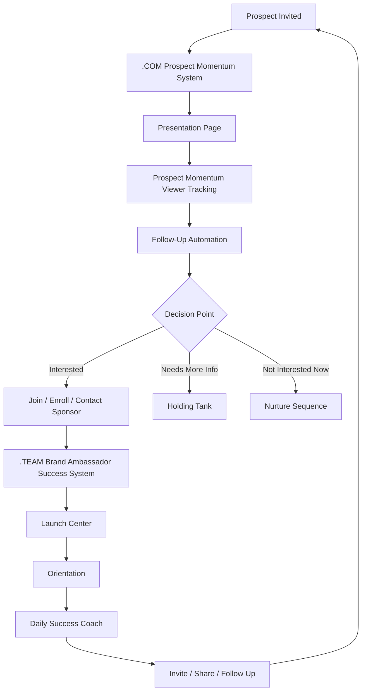
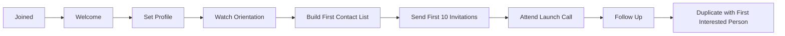
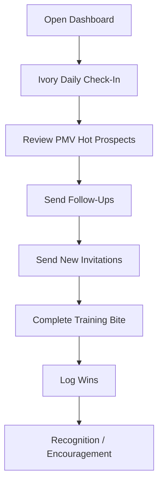
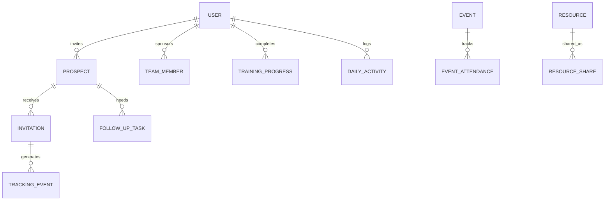
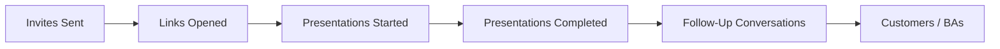

# Momentum Creation System V2 — Full Production Version

**Prepared for:** Kevin Gardner / Team Magnificent  
**System Name:** Momentum Creation System V2  
**Purpose:** A production-ready blueprint for a dual-side recruiting, onboarding, training, duplication, and follow-up platform designed for network marketing growth with compliance-first messaging, human-centered community, and AI-assisted momentum.

---

## 1. Executive Overview

The **Momentum Creation System V2** is a complete growth operating system for building, training, activating, and retaining a direct sales / network marketing organization. It is designed around two connected but distinct experiences:

1. **The .COM Prospect Momentum System**  
   The public-facing prospect journey where invitees watch the presentation, receive education, enter follow-up, and are guided toward a decision.

2. **The .TEAM Brand Ambassador Success System**  
   The private member-facing training, onboarding, leadership, accountability, and duplication environment where brand ambassadors learn what to do, how to do it, and when to do it.

The system is not simply a website, funnel, CRM, or training library. It is a **momentum engine**. Its job is to turn simple daily actions into measurable progress through clear invitations, structured presentation tracking, automated follow-up, role-based training, leadership development, and community reinforcement.

At its heart, the system solves five common problems in network marketing:

- Most people do not know who to invite.
- Most people do not know what to say.
- Most people do not follow up consistently.
- Most people do not onboard new people fast enough.
- Most people lose momentum because they feel alone, confused, or overwhelmed.

Momentum Creation System V2 answers those problems with a simple principle:

> **Make the next right action obvious, easy, trackable, duplicatable, and emotionally encouraging.**

---

## 2. Core Philosophy

The system is built on a community-first philosophy. Technology should not replace human relationships. It should remove friction so that people can build more relationships with confidence.

### 2.1 The Human-Centered Rule

Every automation must support human connection. The system should never feel cold, spammy, manipulative, or robotic. It should feel like a caring coach standing beside the user saying:

> “Here is what to do next. Here is how to say it. Here is who needs your attention today.”

### 2.2 The Simplicity Rule

A brand ambassador should never have to guess what to do. Every dashboard, button, script, training module, or alert must answer one of these questions:

- Who should I talk to?
- What should I say?
- What should I send?
- Who watched?
- Who needs follow-up?
- Who joined?
- Who needs help?
- What is my next move today?

### 2.3 The Compliance Rule

The system must protect the company, the field, and the individual brand ambassador. It must avoid unauthorized claims, income promises, medical claims, pressure language, and misleading guarantees.

The system should use compliant language such as:

- “Learn more”
- “Watch the presentation”
- “See if this is a fit”
- “Explore the product/opportunity”
- “Results vary”
- “No guarantee of income”
- “Not medical advice”
- “Use company-approved materials”

The system should avoid language such as:

- “Guaranteed income”
- “Cure”
- “Replace your medication”
- “Everyone wins”
- “No risk”
- “You will make money”
- “This is better than medical treatment”

---

## 3. System Vision

Momentum Creation System V2 is designed to help a team scale from individual effort to organizational duplication.

The vision is to create an environment where every brand ambassador can:

- Invite confidently.
- Share consistently.
- Track prospects clearly.
- Follow up on time.
- Onboard new people quickly.
- Learn daily.
- Stay encouraged.
- Duplicate the process with others.

The system should feel like a combination of:

- A recruiting assistant.
- A personal success coach.
- A CRM.
- A training academy.
- A presentation tracker.
- A leadership dashboard.
- A community launch center.
- A duplication machine.

---

## 4. High-Level System Architecture



The system creates a loop. Prospects become brand ambassadors. Brand ambassadors invite more prospects. Each person is guided through a simple, duplicatable process.

---

## 5. The Two-Sided Platform Model

### 5.1 .COM Side — Prospect Momentum System

The .COM side is public-facing and designed for prospects. It should be simple, distraction-free, mobile-first, and focused on presentation consumption and decision movement.

Primary goals:

- Deliver the presentation.
- Track engagement.
- Educate without overwhelming.
- Let the sponsor know what happened.
- Move interested people toward action.
- Move undecided people into a respectful holding/nurture process.

### 5.2 .TEAM Side — Brand Ambassador Success System

The .TEAM side is private-facing and designed for members, brand ambassadors, leaders, and admins.

Primary goals:

- Onboard new brand ambassadors.
- Teach the simple success process.
- Provide scripts and tools.
- Track prospects and follow-up.
- Train leadership.
- Support retention.
- Create daily activity rhythm.
- Encourage community and accountability.

---

## 6. .COM Prospect Momentum System

### 6.1 Purpose

The .COM Prospect Momentum System is the guided journey for people who receive an invitation. It should not feel like a complicated sales funnel. It should feel like a simple, respectful introduction.

The prospect journey should be:

1. Receive invitation.
2. Click personal presentation link.
3. Watch video or presentation.
4. Answer light engagement questions.
5. Receive next step options.
6. Sponsor is notified.
7. Prospect enters follow-up status.

### 6.2 Prospect Journey Stages

| Stage | Prospect Experience | System Action | Sponsor View |
|---|---|---|---|
| Invited | Receives link | Token created | New prospect appears |
| Opened | Clicks link | Visit tracked | Sponsor notified |
| Started | Begins presentation | Timestamp captured | Status changes |
| Completed | Watches enough of content | Completion tracked | Follow-up task generated |
| Engaged | Clicks CTA or answers question | Interest score updated | Priority raised |
| Decided | Requests contact or joins | Conversion logged | Sponsor alerted |
| Holding | Not ready yet | Nurture sequence starts | Follow-up calendar created |

### 6.3 Personal Invitation Tokens

Every invitation should generate a unique token tied to:

- Inviting brand ambassador.
- Prospect name.
- Prospect contact information.
- Presentation link.
- Campaign source.
- Date/time created.
- Follow-up status.
- Tracking events.

Example token payload:

```json
{
  "token_id": "pmv_8f3a9c21",
  "sponsor_id": "ba_1029",
  "prospect_id": "pros_5521",
  "campaign_id": "glp_three_intro",
  "created_at": "2026-06-21T10:00:00-07:00",
  "expires_at": null,
  "status": "invited"
}
```

### 6.4 Presentation Page Requirements

The presentation page should contain:

- Sponsor name and optional photo.
- Short welcome message.
- Primary video/presentation.
- Product or opportunity overview.
- Approved support materials.
- Simple CTA buttons.
- Contact sponsor option.
- Compliance footer.
- Tracking logic.

Recommended CTA options:

- “I watched it — contact me.”
- “I have questions.”
- “Send me more information.”
- “I am ready to get started.”
- “Not right now.”

### 6.5 Prospect Micro-Questions

After the presentation, ask simple, non-threatening questions:

- “What interested you most?”
- “Are you looking mainly as a customer, brand ambassador, or both?”
- “Would you like your sponsor to follow up?”
- “What is the best way to reach you?”

Do not make the prospect feel interrogated. Keep it conversational.

---

## 7. Prospect Momentum Viewer — PMV

### 7.1 Definition

The **Prospect Momentum Viewer** is the sponsor-facing engagement dashboard showing where each prospect is in the journey.

It answers:

- Who opened the link?
- Who watched the video?
- How much did they watch?
- Who clicked a button?
- Who requested follow-up?
- Who has gone cold?
- Who should be contacted first today?

### 7.2 PMV Statuses

| Status | Meaning | Sponsor Action |
|---|---|---|
| New | Prospect added but not invited | Send invite |
| Invited | Link sent | Wait or follow up gently |
| Opened | Prospect clicked | Send encouragement |
| Started | Presentation began | Monitor completion |
| Watched 25% | Early interest | Light follow-up |
| Watched 50% | Meaningful interest | Prepare follow-up |
| Watched 75% | Strong interest | Contact soon |
| Completed | Full presentation consumed | Follow up same day |
| CTA Clicked | Took action | Contact immediately |
| Questions | Asked for more info | Respond personally |
| Holding Tank | Not ready now | Nurture respectfully |
| Joined | Converted | Start onboarding |
| Not Interested | Declined | Close gracefully |

### 7.3 PMV Priority Score

The system should rank prospects by momentum.

Suggested scoring:

| Action | Points |
|---|---:|
| Link opened | +10 |
| Video started | +15 |
| Watched 25% | +10 |
| Watched 50% | +15 |
| Watched 75% | +20 |
| Completed | +25 |
| Clicked CTA | +30 |
| Asked question | +20 |
| Revisited page | +15 |
| Shared contact preference | +20 |
| No activity for 7 days | -10 |

Priority levels:

- **Hot:** 80+
- **Warm:** 45–79
- **Cool:** 15–44
- **Dormant:** 0–14

### 7.4 Sponsor Dashboard Cards

Each prospect card should show:

- Name.
- Status.
- Momentum score.
- Last action.
- Last action time.
- Recommended next message.
- Follow-up due date.
- Contact buttons.

Example:

```text
Maria Lopez
Status: Watched 75%
Momentum Score: 72 / Warm
Last Action: Revisited presentation 2 hours ago
Next Step: Send “What stood out to you?” message
Follow-Up Due: Today
```

---

## 8. Holding Tank Philosophy

### 8.1 Purpose

The Holding Tank is not a rejection bucket. It is a respectful relationship space for people who are not ready yet.

Many prospects need:

- More time.
- More trust.
- More education.
- More exposure.
- A different timing window.
- A personal story.
- A community experience.

The Holding Tank keeps the relationship warm without pressure.

### 8.2 Holding Tank Principles

- No chasing.
- No shaming.
- No guilt.
- No desperate follow-up.
- Provide value.
- Stay visible.
- Let timing mature.
- Invite again when appropriate.

### 8.3 Holding Tank Categories

| Category | Meaning | Follow-Up Style |
|---|---|---|
| Curious | Interested but not ready | Light education |
| Timing Issue | Needs later date | Scheduled check-in |
| Needs Proof | Wants results/stories | Testimonials/compliant stories |
| Needs Product Info | Wants details | Approved resources |
| Needs Opportunity Info | Wants comp/training overview | Simple opportunity explanation |
| Silent | No response | Gentle nurture |
| Declined Gracefully | Said no | Thank and close respectfully |

### 8.4 Holding Tank Nurture Rhythm

Suggested cadence:

- Day 1: Thank them for watching.
- Day 3: Ask what stood out.
- Day 7: Share approved resource.
- Day 14: Invite to event or short update.
- Day 30: Check timing.
- Day 60: Share new story/resource.
- Day 90: Ask if they want to stay updated.

---

## 9. Ivory — AI Success Companion

### 9.1 Definition

**Ivory** is the AI-powered success companion inside Momentum Creation System V2. Ivory is not the “boss.” Ivory is the friendly guide that helps members take the next right action.

Ivory should be warm, encouraging, compliant, and practical.

### 9.2 Ivory’s Core Jobs

Ivory helps with:

- Writing invitation messages.
- Creating follow-up messages.
- Suggesting who to contact today.
- Explaining training lessons.
- Coaching new brand ambassadors.
- Summarizing prospect activity.
- Preparing launch plans.
- Helping leaders identify stuck team members.
- Encouraging daily consistency.

### 9.3 Ivory Personality

Ivory should sound like:

- Encouraging.
- Clear.
- Calm.
- Human.
- Non-hype.
- Non-pressure.
- Compliance-aware.
- Duplication-focused.

Ivory should not sound like:

- Aggressive.
- Spammy.
- Overpromising.
- Overly technical.
- Robotic.
- Pushy.

### 9.4 Ivory Prompt Foundation

```text
You are Ivory, the Momentum Creation System AI Success Companion.

Your mission is to help brand ambassadors take simple, compliant, relationship-centered daily actions.

Always prioritize:
1. Human connection
2. Compliance
3. Simplicity
4. Duplication
5. Encouragement
6. Clear next steps

Never make income guarantees, medical claims, pressure-based statements, or unauthorized product claims.

When helping a user, provide:
- The next best action
- A simple script
- A reason why it matters
- A follow-up reminder when appropriate
```

---

## 10. .TEAM Brand Ambassador Success System

### 10.1 Purpose

The .TEAM side is the private operational headquarters for brand ambassadors. It should answer one question every day:

> “What should I do today to create momentum?”

### 10.2 Main .TEAM Modules

1. Launch Center
2. Orientation
3. Resource Center
4. Event Center
5. Daily Success Coach
6. Prospect Momentum Viewer
7. Invite Script Generator
8. Follow-Up Center
9. Training Academy
10. Leadership Dashboard
11. Recognition Wall
12. Accountability Tracker
13. Team Communication Center
14. Admin/Compliance Center

---

## 11. Launch Center

### 11.1 Purpose

The Launch Center is the first 72-hour activation environment for a new brand ambassador.

Its job is to prevent confusion and create immediate movement.

### 11.2 72-Hour Launch Flow



### 11.3 Launch Checklist

New brand ambassadors should complete:

- Set up profile.
- Add sponsor information.
- Watch welcome video.
- Understand the simple success process.
- Build first list of 25 people.
- Send first 10 invitations.
- Attend first team event.
- Follow up with first watchers.
- Schedule launch conversation with sponsor.

### 11.4 Launch Center Dashboard

Show:

- Progress bar.
- Tasks completed.
- Tasks due today.
- Sponsor contact button.
- Ivory coaching button.
- First invite script.
- First 10 people list.
- PMV activity.

---

## 12. Orientation

### 12.1 Purpose

Orientation explains the mission, culture, tools, and daily process.

It should be short enough to complete quickly but strong enough to set expectations.

### 12.2 Orientation Modules

1. Welcome to the Community
2. What We Do
3. How the System Works
4. The Simple Daily Method
5. How to Invite
6. How to Follow Up
7. How to Use PMV
8. How to Attend Events
9. Compliance Basics
10. Your First 72 Hours

### 12.3 Orientation Completion Logic

Each module should track:

- Not started.
- Started.
- Completed.
- Quiz passed, if required.
- Sponsor notified.

---

## 13. Resource Center

### 13.1 Purpose

The Resource Center is the approved library of materials. It prevents people from hunting through chats, texts, folders, and random links.

### 13.2 Resource Categories

- Product overview.
- Opportunity overview.
- Science/education.
- Testimonials/stories.
- FAQs.
- Invite scripts.
- Follow-up scripts.
- Event replays.
- Compliance guidelines.
- New member onboarding.
- Leadership training.

### 13.3 Resource Rules

Each resource should include:

- Title.
- Description.
- Category.
- Approved use case.
- Compliance status.
- Share button.
- Tracking link option.
- Version/date.
- Owner/admin.

---

## 14. Event Center

### 14.1 Purpose

The Event Center keeps the team plugged into live and recorded momentum events.

### 14.2 Event Types

- New prospect overview.
- Product education.
- Brand ambassador launch call.
- Team training.
- Leadership roundtable.
- Recognition meeting.
- Accountability session.
- Q&A.

### 14.3 Event Features

- Calendar view.
- RSVP.
- Add to calendar.
- Share invite.
- Replay archive.
- Attendance tracking.
- Follow-up task generation.

---

## 15. Daily Success Coach

### 15.1 Purpose

The Daily Success Coach turns activity into habit. It should be the first page a brand ambassador sees each day.

### 15.2 Daily Success Flow



### 15.3 Daily Success Checklist

Minimum daily actions:

- Invite 2–5 people.
- Follow up with active prospects.
- Check PMV.
- Watch one short training.
- Attend or promote one event when available.
- Log one win.

### 15.4 Daily Momentum Score

Suggested scoring:

| Action | Points |
|---|---:|
| Login | +5 |
| New invitation sent | +10 each |
| Follow-up sent | +8 each |
| Training completed | +10 |
| Event RSVP | +10 |
| Event attended | +20 |
| New prospect watched | +20 |
| New BA enrolled | +50 |

---

## 16. Invite Script Generator

### 16.1 Purpose

The Invite Script Generator helps brand ambassadors create personalized, compliant invitations.

### 16.2 Required Inputs

- Prospect name.
- Relationship type.
- Interest angle.
- Product/customer/opportunity/both.
- Tone: casual, professional, warm, direct.
- Delivery method: text, email, DM, voice note.

### 16.3 Example Output — Casual Text

```text
Hey Maria, I thought of you because you’re always open to learning about things that help people. I’m sharing a short presentation about something I’m involved with. No pressure at all — would you be open to taking a look and telling me what you think?
```

### 16.4 Example Output — Professional Message

```text
Hi Maria, I’m reaching out because I value your opinion. I’m working with a wellness and referral-based business project and I’d like to share a short overview with you. Would you be open to reviewing it and letting me know whether it makes sense for you or someone you know?
```

---

## 17. Follow-Up Center

### 17.1 Purpose

The Follow-Up Center prevents leads from falling through the cracks.

It should organize follow-up by urgency:

1. CTA clicked.
2. Presentation completed.
3. Watched 75%.
4. Asked question.
5. Revisited page.
6. Follow-up overdue.
7. Holding Tank nurture.

### 17.2 Follow-Up Script Examples

After opened but not watched:

```text
Hey Maria, just checking that the link opened okay for you. No rush — when you get a chance to watch it, I’d love to hear what stood out to you.
```

After completed presentation:

```text
Hey Maria, thank you for watching the presentation. What part interested you the most — the product side, the business side, or just learning more in general?
```

After CTA clicked:

```text
Hey Maria, I saw you requested more information. I’m glad you took a look. What questions can I answer for you?
```

After not interested:

```text
Thank you for taking a look, Maria. I appreciate your time. If anything changes later or someone comes to mind who may want information, feel free to let me know.
```

---

## 18. Training Academy

### 18.1 Purpose

The Training Academy develops skill, belief, confidence, and duplication.

### 18.2 Training Tracks

| Track | Audience | Purpose |
|---|---|---|
| New BA Track | New members | First 7 days |
| Customer Track | Product-focused users | Product education |
| Business Builder Track | Active recruiters | Inviting and follow-up |
| Leader Track | Emerging leaders | Duplication and team support |
| Compliance Track | Everyone | Safe, approved messaging |
| Event Host Track | Leaders | Running presentations |
| Retention Track | Leaders/admins | Helping people stay active |

### 18.3 Training Module Structure

Each lesson should include:

- Title.
- Objective.
- Short video or article.
- Key takeaways.
- Action step.
- Script/example.
- Quick check/quiz.
- Completion tracking.

---

## 19. Leadership Dashboard

### 19.1 Purpose

Leaders need visibility without micromanaging. The Leadership Dashboard shows activity, stuck points, and duplication health.

### 19.2 Leader Metrics

- New brand ambassadors.
- Active brand ambassadors.
- Daily logins.
- Invitations sent.
- Presentations watched.
- Follow-ups completed.
- New enrollments.
- Training completion.
- Event attendance.
- Retention risk.
- Leader rank readiness.

### 19.3 Duplication Health Score

Suggested inputs:

- Percentage completing orientation.
- Percentage sending first 10 invites.
- Average follow-up completion rate.
- Percentage attending events.
- Percentage with active PMV prospects.
- Percentage completing first 7-day launch.

---

## 20. Recognition Wall

### 20.1 Purpose

Recognition reinforces the right behaviors. It should celebrate activity, growth, learning, consistency, and leadership — not only enrollments.

### 20.2 Recognition Categories

- First invitation sent.
- First presentation watched.
- First follow-up completed.
- First event attended.
- First customer.
- First brand ambassador.
- 7-day consistency streak.
- Top encourager.
- Training finisher.
- Community builder.

---

## 21. Accountability Tracker

### 21.1 Purpose

The Accountability Tracker helps members see whether they are doing the simple daily actions that create results.

### 21.2 Weekly Scorecard

| Metric | Goal | Actual |
|---|---:|---:|
| New invitations | 25 | 0 |
| Follow-ups completed | 25 | 0 |
| Presentations watched | 10 | 0 |
| Events attended | 1 | 0 |
| Training modules completed | 3 | 0 |
| New customers/BAs | Personal | 0 |

---

## 22. Compliance Center

### 22.1 Purpose

The Compliance Center protects the organization.

### 22.2 Compliance Features

- Approved script library.
- Restricted claims list.
- Income disclosure links.
- Product disclaimer templates.
- Message scanner.
- Admin review queue.
- Resource approval workflow.
- Version history.

### 22.3 AI Compliance Scanner

Before a user sends or publishes AI-generated copy, the system can check for risky phrases.

Risk categories:

- Medical claims.
- Income guarantees.
- Pressure language.
- Unsupported testimonials.
- Competitor disparagement.
- Misleading statements.

---

## 23. CRM Data Model

### 23.1 Core Entities



### 23.2 User Table

Fields:

- id
- first_name
- last_name
- email
- phone
- role
- sponsor_id
- team_id
- profile_photo
- status
- created_at
- updated_at

### 23.3 Prospect Table

Fields:

- id
- sponsor_id
- first_name
- last_name
- email
- phone
- relationship_type
- interest_type
- status
- momentum_score
- source
- notes
- created_at
- updated_at

### 23.4 Invitation Table

Fields:

- id
- prospect_id
- sponsor_id
- token
- campaign_id
- link
- channel
- sent_at
- opened_at
- completed_at
- status

### 23.5 Tracking Event Table

Fields:

- id
- invitation_id
- prospect_id
- event_type
- event_value
- metadata
- created_at

Event types:

- link_opened
- video_started
- video_progress
- video_completed
- cta_clicked
- question_answered
- resource_downloaded
- revisit

### 23.6 Follow-Up Task Table

Fields:

- id
- prospect_id
- assigned_to
- due_at
- priority
- task_type
- suggested_script
- completed_at
- outcome

---

## 24. Recommended Technical Architecture

### 24.1 Frontend

Recommended:

- React or Next.js.
- Tailwind CSS.
- Component system such as shadcn/ui.
- Mobile-first design.
- Role-based dashboards.

### 24.2 Backend

Recommended:

- Node.js/Express or Python/FastAPI.
- REST API initially; GraphQL optional later.
- PostgreSQL for core relational data.
- Redis for queues/caching.
- Object storage for media/files.
- Background workers for email/SMS/event tracking.

### 24.3 AI Layer

Recommended:

- AI assistant service for Ivory.
- Prompt templates stored in database.
- Compliance guardrails.
- Retrieval from approved resources only.
- Activity-aware recommendations.

### 24.4 External Integrations

Possible integrations:

- Email provider.
- SMS provider.
- Calendar provider.
- Video hosting/tracking.
- Payment/enrollment system if allowed.
- Corporate replicated sites if required.
- Analytics.

---

## 25. API Endpoint Blueprint

### 25.1 Authentication

```http
POST /api/auth/register
POST /api/auth/login
POST /api/auth/logout
POST /api/auth/forgot-password
GET  /api/auth/me
```

### 25.2 Prospects

```http
GET    /api/prospects
POST   /api/prospects
GET    /api/prospects/:id
PATCH  /api/prospects/:id
DELETE /api/prospects/:id
```

### 25.3 Invitations

```http
POST /api/invitations
GET  /api/invitations/:token
POST /api/invitations/:token/events
POST /api/invitations/:token/cta
```

### 25.4 PMV

```http
GET /api/pmv/dashboard
GET /api/pmv/hot
GET /api/pmv/follow-up-due
GET /api/pmv/prospect/:id/timeline
```

### 25.5 Follow-Up

```http
GET   /api/follow-ups
POST  /api/follow-ups
PATCH /api/follow-ups/:id/complete
POST  /api/follow-ups/:id/reschedule
```

### 25.6 Training

```http
GET  /api/training/tracks
GET  /api/training/modules/:id
POST /api/training/modules/:id/complete
GET  /api/training/progress
```

### 25.7 Ivory AI

```http
POST /api/ivory/chat
POST /api/ivory/generate-invite
POST /api/ivory/generate-follow-up
POST /api/ivory/daily-plan
POST /api/ivory/compliance-check
```

---

## 26. MVP Scope

### 26.1 MVP Goal

Launch the simplest version that creates measurable recruiting momentum.

### 26.2 MVP Features

Must have:

- User accounts.
- Sponsor profile.
- Prospect CRM.
- Invitation token/link generator.
- Presentation page.
- Video engagement tracking.
- PMV dashboard.
- Follow-up tasks.
- Basic invite/follow-up scripts.
- Launch checklist.
- Orientation modules.
- Resource library.
- Admin resource management.

Nice to have:

- Ivory AI assistant.
- SMS/email automation.
- Event center.
- Recognition wall.
- Advanced analytics.

---

## 27. Phase Roadmap

### Phase A — Prospect Momentum Engine

Build:

- Prospect CRM.
- Invite generator.
- Tokenized presentation links.
- PMV tracking.
- Follow-up task creation.

Outcome:

Brand ambassadors can invite, track, and follow up.

### Phase B — Brand Ambassador Launch System

Build:

- Launch Center.
- Orientation.
- First 72-hour checklist.
- Training progress.
- Resource Center.

Outcome:

New people can start quickly without confusion.

### Phase C — AI Coaching and Compliance

Build:

- Ivory assistant.
- Script generator.
- Follow-up recommendations.
- Compliance scanner.
- Daily Success Coach.

Outcome:

Users receive guided, compliant daily support.

### Phase D — Leadership and Scale

Build:

- Leadership Dashboard.
- Team analytics.
- Retention risk alerts.
- Recognition Wall.
- Event Center.
- Advanced automation.

Outcome:

Leaders can support duplication across the organization.

---

## 28. User Roles and Permissions

| Role | Access |
|---|---|
| Prospect | Public presentation only |
| Brand Ambassador | Personal dashboard, PMV, training, resources |
| Team Leader | Team metrics, team PMV summary, recognition tools |
| Admin | Full system management |
| Compliance Admin | Resource approval, message review, restricted claim settings |
| Super Admin | Platform configuration, billing, global settings |

---

## 29. Notification System

### 29.1 Notification Types

- Prospect opened link.
- Prospect started video.
- Prospect completed video.
- Prospect clicked CTA.
- Follow-up due.
- Follow-up overdue.
- New BA joined.
- Training incomplete.
- Event starting soon.
- Recognition earned.

### 29.2 Notification Channels

- In-app.
- Email.
- SMS.
- Push notification later.

---

## 30. Analytics and KPIs

### 30.1 Individual KPIs

- Invites sent.
- Link opens.
- Video starts.
- Video completions.
- CTA clicks.
- Follow-up completion rate.
- New customers.
- New brand ambassadors.
- Training completion.
- Daily activity streak.

### 30.2 Team KPIs

- Active users.
- New members.
- Presentation views.
- Conversion rate.
- Follow-up speed.
- Training completion rate.
- Event attendance.
- Retention rate.
- Duplication score.

### 30.3 Funnel Metrics



Measure conversion rate at every step.

---

## 31. Production UI Pages

### 31.1 Public .COM Pages

- `/p/:token` — Personal presentation page.
- `/p/:token/thanks` — Thank-you / next-step page.
- `/resources/:slug` — Shareable resource page.
- `/events/:id` — Public event invite page.

### 31.2 Private .TEAM Pages

- `/dashboard`
- `/launch-center`
- `/prospects`
- `/prospects/:id`
- `/pmv`
- `/follow-up`
- `/training`
- `/training/:module`
- `/resources`
- `/events`
- `/daily-coach`
- `/recognition`
- `/team`
- `/leadership`
- `/admin`

---

## 32. Design Principles

The design should feel:

- Premium.
- Clean.
- Encouraging.
- Mobile-first.
- Simple.
- Warm.
- Trustworthy.
- Action-oriented.

Recommended visual style:

- Deep blue, electric blue, white, silver accents.
- Large clear cards.
- Minimal clutter.
- Progress bars.
- Friendly prompts.
- Clear buttons.
- Dashboard-first navigation.

---

## 33. Example Daily Dashboard Layout

```text
Good morning, Kevin.

Today’s Momentum Plan
[ ] Follow up with 3 hot prospects
[ ] Send 5 new invitations
[ ] Complete 1 short training
[ ] Invite 1 person to the next event

Hot Prospects
1. Maria — Completed presentation — Follow up today
2. James — Asked question — Reply now
3. Linda — Revisited page — Send check-in

Ivory Suggestion
“Start with Maria. She completed the presentation last night and is most likely ready for a conversation.”
```

---

## 34. Automation Rules

### 34.1 PMV Automation

When a prospect completes presentation:

- Increase score.
- Create follow-up task.
- Notify sponsor.
- Generate suggested follow-up script.

### 34.2 Holding Tank Automation

When a prospect says “not now”:

- Move to Holding Tank.
- Set category.
- Schedule nurture sequence.
- Stop urgent follow-up prompts.

### 34.3 Launch Automation

When a new BA joins:

- Create .TEAM account.
- Assign sponsor.
- Start 72-hour launch checklist.
- Send welcome message.
- Notify sponsor.
- Unlock orientation.

### 34.4 Retention Automation

When a BA is inactive for 7 days:

- Notify sponsor.
- Ivory generates encouragement message.
- Recommend simple reactivation task.

---

## 35. AI Prompt Library

### 35.1 Generate Invitation

```text
Create a short, compliant invitation message for a brand ambassador to send to a prospect.

Inputs:
- Prospect name: {{name}}
- Relationship: {{relationship}}
- Interest angle: {{interest_angle}}
- Tone: {{tone}}
- Channel: {{channel}}

Rules:
- No income guarantees.
- No medical claims.
- No pressure.
- Keep it warm and simple.
- End with a low-pressure question.
```

### 35.2 Generate Follow-Up

```text
Create a compliant follow-up message based on prospect activity.

Inputs:
- Prospect name: {{name}}
- Last action: {{last_action}}
- Interest type: {{interest_type}}
- Sponsor notes: {{notes}}

Rules:
- Acknowledge the action.
- Ask one simple question.
- Do not pressure.
- Keep under 80 words.
```

### 35.3 Daily Plan

```text
Create a daily momentum plan for this brand ambassador.

Inputs:
- Hot prospects: {{hot_prospects}}
- Follow-ups due: {{followups_due}}
- New invite goal: {{invite_goal}}
- Training status: {{training_status}}

Output:
- 3 to 5 daily actions.
- Priority order.
- Suggested first message.
- Encouraging closing sentence.
```

---

## 36. Security and Privacy

### 36.1 Requirements

- Secure authentication.
- Role-based access control.
- Encrypted sensitive data.
- Secure token generation.
- Audit logs.
- Rate limiting.
- Data export ability.
- Data deletion request process.

### 36.2 Privacy Rules

The system must protect:

- Prospect contact information.
- Sponsor relationships.
- Team structure.
- Message history.
- Training progress.
- Personal notes.

---

## 37. Production Database Recommendations

Use PostgreSQL for core data.

Core tables:

- users
- teams
- prospects
- invitations
- tracking_events
- follow_up_tasks
- resources
- resource_shares
- training_tracks
- training_modules
- training_progress
- events
- event_attendance
- notifications
- ai_messages
- compliance_reviews
- recognition_events
- daily_activity

Use Redis for:

- Queues.
- Rate limits.
- Temporary sessions.
- Notification jobs.

Use object storage for:

- Videos.
- PDFs.
- Images.
- Resource files.

---

## 38. Testing Plan

### 38.1 Unit Tests

Test:

- Token creation.
- PMV scoring.
- Follow-up task generation.
- Role permissions.
- Compliance scanner.
- Training completion.

### 38.2 Integration Tests

Test:

- Invite → open → watch → follow-up flow.
- New BA → Launch Center flow.
- Resource share tracking.
- Notification delivery.
- Event RSVP.

### 38.3 User Acceptance Tests

Test with real users:

- Can a new BA send their first invite in under 5 minutes?
- Can a sponsor identify who to follow up with today?
- Can a leader see who is stuck?
- Can a prospect watch without confusion?
- Can a non-technical user complete onboarding?

---

## 39. Production Success Criteria

The system is successful when:

- A new BA can invite within the first day.
- A sponsor knows who watched and who needs follow-up.
- Prospects do not disappear into confusion.
- Training completion increases.
- Follow-up speed improves.
- Leaders can identify stuck members.
- Compliance risk decreases.
- Duplication becomes easier.

---

## 40. Codex / Developer Build Prompt

Use this prompt to instruct an AI coding agent:

```text
You are building Momentum Creation System V2, a dual-sided network marketing growth platform.

Build a production-grade application with:

1. Public .COM Prospect Momentum System
- Tokenized presentation links
- Presentation page
- Video engagement tracking
- CTA tracking
- Prospect activity timeline

2. Private .TEAM Brand Ambassador Success System
- User authentication
- Sponsor profiles
- Prospect CRM
- Prospect Momentum Viewer
- Follow-up task system
- Launch Center
- Orientation modules
- Resource Center
- Daily Success Coach

3. AI Companion named Ivory
- Generate invitation scripts
- Generate follow-up scripts
- Create daily action plans
- Run compliance checks
- Use only approved resources and safe messaging

4. Admin tools
- Resource management
- User management
- Compliance review
- Analytics

Technical preferences:
- Mobile-first UI
- React/Next.js frontend
- Tailwind CSS
- PostgreSQL database
- REST API
- Role-based permissions
- Secure tokenized links
- Clean modular architecture

Important rules:
- No income guarantees
- No medical claims
- No pressure language
- Human-centered design
- Make the next action obvious
- Prioritize duplication, retention, and compliance

Deliver:
- Database schema
- API routes
- Frontend pages
- Reusable UI components
- Seed data
- Tests
- README setup instructions
```

---

## 41. Non-Negotiable Product Rules

1. Every user must know what to do next.
2. Every prospect must be tracked respectfully.
3. Every AI output must be compliance-aware.
4. Every new BA must have a 72-hour launch path.
5. Every leader must see team momentum, not just enrollment numbers.
6. Every script must be simple enough to duplicate.
7. Every module must reduce confusion.
8. Every feature must support relationships.

---

## 42. Final Production Summary

Momentum Creation System V2 is a complete, scalable, AI-assisted field growth platform. It connects public prospect education with private brand ambassador activation. It is designed to create measurable momentum through simple daily actions, clear tracking, structured follow-up, onboarding, training, events, recognition, and leadership visibility.

The system should not be built as a generic CRM. It should be built as a **relationship-centered duplication platform** where every prospect, every brand ambassador, and every leader is guided toward the next best action.

The full production version should now be treated as the master blueprint for design, development, AI agent prompting, database planning, and phased implementation.

