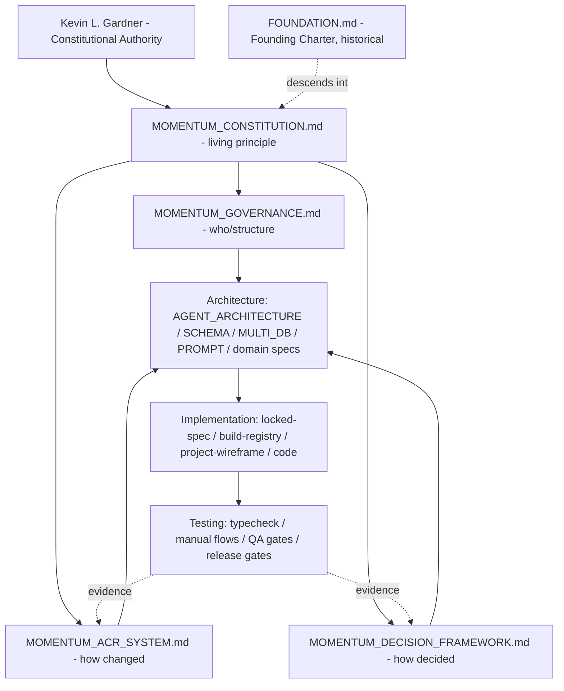

# CONSTITUTION DEPENDENCY MAP

**Purpose:** Show, at a glance, how the Momentum constitutional library fits together — what governs what, what derives authority from what, and where principle ends and execution begins.
**Authority:** Subordinate to `MOMENTUM_CONSTITUTION.md`. This map is a navigational aid, not a source of truth; when it disagrees with the Constitution, the Constitution wins.
**Date:** 2026-06-26

---

## The Three Layers

The library separates into three layers. Reading top to bottom is reading from *why* to *how*.

- **Principle layer — why.** The Constitution (and the Founding Charter it descends from). Changes rarely, only by ratified amendment.
- **Governance layer — who and how decisions are made.** Governance, Decision Framework, ACR System. Changes occasionally, by the constitutional lifecycle.
- **Execution layer — what gets built and proven.** Architecture, Implementation, Testing. Changes constantly, governed by the operational-currency chain.

**The rule across layers:** a lower layer may never contradict a higher one. Execution serves governance; governance serves principle; all of it serves people. Kevin sits above every layer.

---

## Dependency Diagram

---

## Dependency Table

| Document / Layer | Governs | Derives authority from | Feeds | Change cadence |
|---|---|---|---|---|
| `MOMENTUM_CONSTITUTION.md` | Principle: whether/why | Kevin; descends from Founding Charter | Governance, Decision, ACR | Rare (amendment) |
| `MOMENTUM_GOVERNANCE.md` | Org structure, agent contract, escalation | Constitution | Architecture | Occasional (lifecycle) |
| `MOMENTUM_DECISION_FRAMEWORK.md` | How any decision is made and recorded | Constitution | Architecture, ACR | Occasional (lifecycle) |
| `MOMENTUM_ACR_SYSTEM.md` | How the platform's shape is changed | Constitution; uses Decision Framework | Architecture | Occasional (lifecycle) |
| Architecture (`AGENT_ARCHITECTURE`, `SCHEMA_GOVERNANCE`, `MULTI_DB_AGENT_LEARNING_GOVERNANCE`, `AGENT_PROMPT_GOVERNANCE`, domain specs) | System shape, contracts, schemas, prompts | Governance + Decision + ACR | Implementation | Per approved ACR |
| Implementation (`docs/locked-spec.md`, `docs/build-registry.md`, `docs/project-wireframe.md`, code) | What is currently built | Architecture; operational-currency chain | Testing | Constant |
| Testing (typecheck, manual flows, QA gates, release gates) | Whether a change is safe to ship | ACR gates; Governance testing standard | Evidence back to ACR/Decision | Per change |

---

## How to Read a Conflict

1. **Principle vs. anything** — Constitution wins. The lower instrument is a defect to fix.
2. **Two governance instruments disagree** — escalate per the Decision Framework; Kevin decides.
3. **Architecture vs. Implementation** — the operational-currency chain decides what is *current*; the Constitution decides whether it is *allowed*.
4. **Testing contradicts a claim of “done”** — testing wins; the change is not done until verified.

*The Constitution Agent warns. Kevin decides.*
