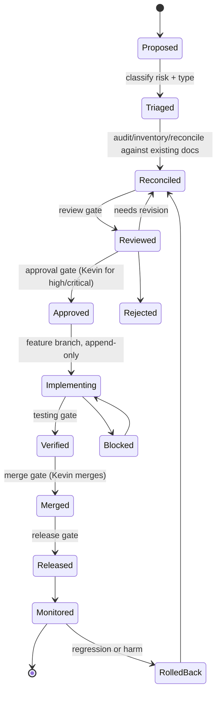

# MOMENTUM ACR SYSTEM

## The Architectural Change Request System of Momentum Creation System V2

**Version:** 1.0.0
**Authority:** Subordinate to `constitution/MOMENTUM_CONSTITUTION.md` and `MOMENTUM_DECISION_FRAMEWORK.md`. Where this document conflicts with either, the higher instrument wins.
**Constitutional Authority:** Kevin L. Gardner — sole and final
**Status:** Canonical (governance layer). Part of the integrated governance package awaiting ratification.

---

## Reconciliation Basis

Lifecycle stages:
1. **Audit / Inventory** — recorded in `MOMENTUM_CONSTITUTIONAL_RECONCILIATION_REPORT.md`.
2. **Reconciliation** — three existing change-control patterns were found and unified: the schema change-approval flow (`SCHEMA_GOVERNANCE.md`), the agent lifecycle (`AGENT_ARCHITECTURE.md` §6), and the prompt lifecycle (`AGENT_PROMPT_GOVERNANCE.md`).
3. **Gap Analysis (ACR-specific):** there was **no named, unified process** for changing the platform's shape. Changes to schemas, contracts, agent missions, and persistence patterns each had partial governance, but nothing tied them into one auditable request with gates. This document is that gap closed — the most net-new instrument in the library.
4. **Canonical + Cross-reference:** the ACR system *orchestrates* the existing change-control flows; it does not replace them. Schema review still follows `SCHEMA_GOVERNANCE.md`; prompt review still follows `AGENT_PROMPT_GOVERNANCE.md`. The ACR is the envelope around them.

---

## §1 — Purpose and Trigger

An **Architectural Change Request (ACR)** is the governed envelope for any change to the *shape* of Momentum Creation System V2. It exists so that no contract, schema, agent mission, or persistence pattern changes silently, and so that every such change carries a reviewable trail from proposal to release.

**An ACR is required when a change touches any of:**
- a canonical schema or data model (`SCHEMA_GOVERNANCE.md`);
- an API contract or shared type;
- a persistence pattern or the triple-stack write path (`MULTI_DB_AGENT_LEARNING_GOVERNANCE.md`);
- an agent's mission, permission policy, or escalation authority (`AGENT_ARCHITECTURE.md`);
- a prompt slot at the major-version / mission / safety level (`AGENT_PROMPT_GOVERNANCE.md`);
- a surface contract or a compliance boundary;
- an integration with an external system (THREE mirror, Telnyx, Resend, Anthropic, Gateway);
- a source-of-truth or precedence change.

---

## §2 — What Is *Not* an ACR

Routine delivery does not need an ACR: implementing an existing wireframe leaf, copy and content within compliance, styling within brand tokens, and bug fixes that do not change a contract, schema, or boundary. These follow ordinary delivery governance (`MOMENTUM_GOVERNANCE.md` §9). When in doubt whether a change is architectural, raise an ACR — the cost of an unnecessary ACR is small; the cost of silent contract drift is large.

---

## §3 — The ACR Record

```json
{
  "acr_id": "acr_...",
  "title": "",
  "status": "proposed",
  "risk_level": "low | medium | high | critical",
  "change_type": "schema | contract | persistence | agent | prompt | surface | integration | source-of-truth",
  "proposed_by": "",
  "constitutional_check": { "future_dev_test": "pass | reconsider", "boundaries_reviewed": [] },
  "affected": { "documents": [], "schemas": [], "surfaces": [], "agents": [] },
  "reconciliation_ref": "",
  "review": { "reviewers": [], "decision": "", "conditions": [] },
  "approval": { "approved_by": "", "approved_at": null },
  "implementation": { "branch": "", "commits": [], "append_only_respected": true },
  "verification": { "typecheck": false, "flows": [], "persistence_readback": false },
  "release": { "gates_passed": [], "released_at": null },
  "version": { "from": "", "to": "", "supersedes": null, "rollback_to": null },
  "decision_ledger_ref": "",
  "created_at": "", "updated_at": ""
}
```

---

## §4 — The ACR State Machine



No state is skipped. An ACR cannot reach `Merged` without passing `Verified`, and cannot reach `Approved` at high or critical risk without Kevin.

---

## §5 — The Gates

**Review gate** (Proposed/Reconciled → Reviewed): the change passed the Future-Development Test; affected documents and boundaries are enumerated; the relevant pillar review ran (schema review per `SCHEMA_GOVERNANCE.md`, prompt review per `AGENT_PROMPT_GOVERNANCE.md`, etc.); no duplicate concept or hidden persistence is introduced.

**Approval gate** (Reviewed → Approved): authority per the Decision Framework matrix. Minor schema/prompt changes may be approved by their technical/prompt owner; anything touching mission, safety, compliance, source-of-truth, or platform shape requires **Kevin**.

**Merge gate** (Verified → Merged): typecheck green; acceptance criteria met; compliance fail-closed confirmed; append-only rules respected on shared files; commit tagged with chat number. **Kevin merges; agents do not.**

**Testing gate** (Implementing → Verified): `pnpm typecheck` repo-wide; end-to-end manual flow against the running dev server; visual QA on touched surfaces; **persistence read-back** for any triple-stack write (the write is confirmed by reading it back, never assumed).

**Release gate** (Merged → Released): server-side auth verified; no compliance leakage to `.com`; degraded state shown honestly; audit entries written; no regression against a prior correction.

A gate that cannot be evidenced has not been passed.

---

## §6 — Versioning and Rollback

- **Semantic versioning** on the affected contract/schema/prompt: major = breaking, minor = additive/compatible, patch = non-behavioral.
- **Immutable versions.** An approved version is never edited in place; a new version supersedes it. Prior versions remain in history.
- **Rollback is first-class.** Every ACR names a `rollback_to` target before it implements. Rollback restores a known-approved state and is itself auditable. A change that cannot be rolled back is a critical-risk change and is reviewed as such.

---

## §7 — Risk Classification

Risk sets review depth and approval authority (adapted from the prompt-governance review-severity model).

| Risk | Examples | Approval |
|---|---|---|
| **Low** | additive field, internal summary format | technical owner |
| **Medium** | new training/recommendation flow, compatible schema addition | owner + governance reviewer |
| **High** | prospect-facing change, compliance-sensitive logic, agent orchestration, PMV interpretation | **Kevin** |
| **Critical** | source-of-truth change, agent mission/permission change, safety guardrail, irreversible migration, cross-model prompt migration | **Kevin** |

---

## §8 — Roles

- **Proposer** — any human or agent; agents propose with reconciliation evidence and never self-approve.
- **Reviewer(s)** — per change type: Architect, Compliance, QA, schema/prompt owners, Constitution & Governance.
- **Approver** — per the authority matrix (`MOMENTUM_DECISION_FRAMEWORK.md` §6); Kevin for high/critical.
- **Merger** — **Kevin only.**
- **Verifier** — QA; evidence-based; may block on findings.

---

## §9 — ACR and the Decision Ledger

An approved ACR **produces a decision-ledger entry** (`momentum.decisions`) recording the topic, the active rule, what it supersedes, and the implementation impact. The ACR is the *process*; the ledger entry is the *currency* that future sessions read to know what was decided. The two are linked by `decision_ledger_ref` / `reconciliation_ref` so the trail from proposal to current-truth is unbroken.

---

## §10 — Risk Analysis (what the ACR system prevents)

- **Silent contract drift** — a shared type or API changing without review. *Counter:* the ACR trigger list (§1) and append-only merge rules.
- **Schema fragmentation** — a second definition of an existing concept. *Counter:* review gate duplicate-concept check (`SCHEMA_GOVERNANCE.md`).
- **Ungoverned migration** — a data change with no rollback. *Counter:* §6 rollback-first rule; critical-risk classification.
- **Hidden persistence** — a write path bypassing the triple-stack. *Counter:* persistence read-back at the testing gate.
- **Unverified “done”** — a change reported complete without evidence. *Counter:* gates that fail without evidence.

---

## §11 — Cross-Reference

| For | See |
|---|---|
| The ACR register (all change requests) | `constitution/acr/REGISTER.md` |
| Whether a change is *allowed* | `MOMENTUM_CONSTITUTION.md` Art. VII, X |
| Who approves / decides | `MOMENTUM_DECISION_FRAMEWORK.md` §6 |
| Delivery, merge, gates detail | `MOMENTUM_GOVERNANCE.md` §9–10 |
| Schema change approval | `SCHEMA_GOVERNANCE.md` |
| Prompt change approval | `AGENT_PROMPT_GOVERNANCE.md` |
| Agent mission/permission change | `AGENT_ARCHITECTURE.md` |
| Triple-stack / persistence law | `MULTI_DB_AGENT_LEARNING_GOVERNANCE.md` |

*The Constitution Agent warns. Kevin decides.*
