# Momentum Agent Communication Protocol

Generated: 2026-06-26

<!-- PAGE 001 -->
# Page 1 - Protocol Source Basis

This handbook is grounded in the governing source set read on 2026-06-26.

- AGENTS.md
- docs/READ-ME-FIRST.md
- docs/AGENT-BRIEFING.md
- docs/locked-spec.md
- docs/build-registry.md
- docs/project-wireframe.md
- docs/graphrag-schema-contract.md
- docs/chat-registry-authority.md
- docs/handoff-contract.md
- MOMENTUM_CREATION_SYSTEM_V2_FOUNDATION.md
- MOMENTUM_CREATION_SYSTEM_V2_PRODUCTION_VERSION.md
- AGENT_ARCHITECTURE.md
- AGENT_PROMPT_GOVERNANCE.md
- MULTI_DB_AGENT_LEARNING_GOVERNANCE.md
- SCHEMA_GOVERNANCE.md
- RECOMMENDATION_ENGINE_ARCHITECTURE.md
- PMV_ARCHITECTURE.md
- CRM_ARCHITECTURE.md
- COMMUNITY_ARCHITECTURE.md
- ORIENTATION_ARCHITECTURE.md
- LAUNCH_CENTER_ARCHITECTURE.md
- RESOURCE_CENTER_ARCHITECTURE.md
- EVENT_CENTER_ARCHITECTURE.md
- TRAINING_ARCHITECTURE.md
- HOLDING_TANK_ARCHITECTURE.md
- NEW_BA_DISCOVERY_SUCCESS_INTERVIEW_SPEC.md
- MASTER_UX_IMPLEMENTATION_SPEC.md
- IMPLEMENTATION_TASKS.md
- PLATFORM_AUDIT.md
- graphify-out/GRAPH_REPORT.md

The governing precedence is: decision ledger, locked spec, design documents, build registry, git log, chat registry, then handoffs. The constitution created here does not override those sources. It organizes them into an AI software company operating model.

---

<!-- PAGE 002 -->
# Page 2 - Communication Protocol Purpose

This protocol defines how agents, departments, humans, memory systems, and product surfaces communicate. It covers agent messages, escalation, knowledge flow, collaboration, state machines, sequence diagrams, permissions, boundaries, APIs, testing, and future expansion.

---

<!-- PAGE 003 -->
# Page 3 - Canonical Communication Channels

| Channel | Purpose | Authority |
|---|---|---|
| Human directive | Kevin or authorized human instruction | highest runtime priority |
| Decision ledger | active decisions | decision currency |
| Agent message board | asynchronous agent coordination | operational communication |
| Audit log | immutable operational evidence | accountability |
| Handoff | session continuity | artifact, not identity authority |
| Chat registry | chat/thread identity | identity authority |
| Recommendation record | agent guidance | support, not command |
| Escalation record | boundary or risk routing | governance flow |

---

<!-- PAGE 004 -->
# Page 4 - Universal Message Envelope

```json
{
  "message_id": "msg_...",
  "schema_version": 1,
  "from_agent": "",
  "to_agent": "",
  "department": "",
  "workflow_id": "",
  "entity_type": "",
  "entity_id": "",
  "message_type": "",
  "priority": "normal",
  "status": "unread",
  "purpose": "",
  "payload": {},
  "evidence_refs": [],
  "created_at": "ISO-8601Z",
  "read_at": null,
  "resolved_at": null
}
```

Every durable agent-to-agent post must be written through a governed multi-store path when it becomes persistent memory.

---

<!-- PAGE 005 -->
# Page 5 - Message State Machine

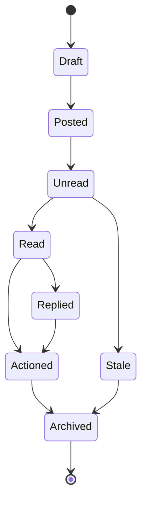

---

<!-- PAGE 006 -->
# Page 6 - Escalation Protocol

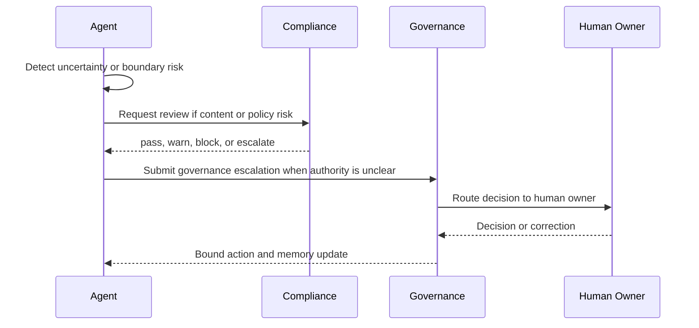

---

<!-- PAGE 007 -->
# Page 7 - Knowledge Flow

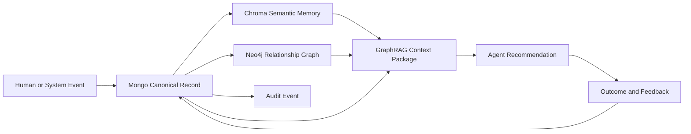

---

<!-- PAGE 008 -->
# Page 8 - Message Type: agent_context_requested

## Purpose
agent_context_requested coordinates bounded work between agents or departments.

## Required Fields
- message_id
- from_agent
- to_agent
- workflow_id
- entity reference
- purpose
- payload
- evidence_refs
- priority
- created_at

## Allowed Senders
Any agent whose permission policy includes the related workflow.

## Allowed Recipients
The owning agent, department queue, governance queue, QA queue, or human approval queue.

## Processing Rules
- Read highest priority first.
- Preserve parent message; replies are new messages with replies_to.
- Do not mutate evidence after posting.
- Mark read with read_at and read_by.
- Mark actioned only after the requested action or valid escalation occurs.
- Critical priority blocks dependent workflows until processed.

## Output
An actioned message, reply, escalation, audit event, recommendation, or documented no-action rationale.

---

<!-- PAGE 009 -->
# Page 9 - Message Type: agent_context_returned

## Purpose
agent_context_returned coordinates bounded work between agents or departments.

## Required Fields
- message_id
- from_agent
- to_agent
- workflow_id
- entity reference
- purpose
- payload
- evidence_refs
- priority
- created_at

## Allowed Senders
Any agent whose permission policy includes the related workflow.

## Allowed Recipients
The owning agent, department queue, governance queue, QA queue, or human approval queue.

## Processing Rules
- Read highest priority first.
- Preserve parent message; replies are new messages with replies_to.
- Do not mutate evidence after posting.
- Mark read with read_at and read_by.
- Mark actioned only after the requested action or valid escalation occurs.
- Critical priority blocks dependent workflows until processed.

## Output
An actioned message, reply, escalation, audit event, recommendation, or documented no-action rationale.

---

<!-- PAGE 010 -->
# Page 10 - Message Type: agent_review_requested

## Purpose
agent_review_requested coordinates bounded work between agents or departments.

## Required Fields
- message_id
- from_agent
- to_agent
- workflow_id
- entity reference
- purpose
- payload
- evidence_refs
- priority
- created_at

## Allowed Senders
Any agent whose permission policy includes the related workflow.

## Allowed Recipients
The owning agent, department queue, governance queue, QA queue, or human approval queue.

## Processing Rules
- Read highest priority first.
- Preserve parent message; replies are new messages with replies_to.
- Do not mutate evidence after posting.
- Mark read with read_at and read_by.
- Mark actioned only after the requested action or valid escalation occurs.
- Critical priority blocks dependent workflows until processed.

## Output
An actioned message, reply, escalation, audit event, recommendation, or documented no-action rationale.

---

<!-- PAGE 011 -->
# Page 11 - Message Type: agent_review_completed

## Purpose
agent_review_completed coordinates bounded work between agents or departments.

## Required Fields
- message_id
- from_agent
- to_agent
- workflow_id
- entity reference
- purpose
- payload
- evidence_refs
- priority
- created_at

## Allowed Senders
Any agent whose permission policy includes the related workflow.

## Allowed Recipients
The owning agent, department queue, governance queue, QA queue, or human approval queue.

## Processing Rules
- Read highest priority first.
- Preserve parent message; replies are new messages with replies_to.
- Do not mutate evidence after posting.
- Mark read with read_at and read_by.
- Mark actioned only after the requested action or valid escalation occurs.
- Critical priority blocks dependent workflows until processed.

## Output
An actioned message, reply, escalation, audit event, recommendation, or documented no-action rationale.

---

<!-- PAGE 012 -->
# Page 12 - Message Type: agent_handoff_created

## Purpose
agent_handoff_created coordinates bounded work between agents or departments.

## Required Fields
- message_id
- from_agent
- to_agent
- workflow_id
- entity reference
- purpose
- payload
- evidence_refs
- priority
- created_at

## Allowed Senders
Any agent whose permission policy includes the related workflow.

## Allowed Recipients
The owning agent, department queue, governance queue, QA queue, or human approval queue.

## Processing Rules
- Read highest priority first.
- Preserve parent message; replies are new messages with replies_to.
- Do not mutate evidence after posting.
- Mark read with read_at and read_by.
- Mark actioned only after the requested action or valid escalation occurs.
- Critical priority blocks dependent workflows until processed.

## Output
An actioned message, reply, escalation, audit event, recommendation, or documented no-action rationale.

---

<!-- PAGE 013 -->
# Page 13 - Message Type: agent_handoff_accepted

## Purpose
agent_handoff_accepted coordinates bounded work between agents or departments.

## Required Fields
- message_id
- from_agent
- to_agent
- workflow_id
- entity reference
- purpose
- payload
- evidence_refs
- priority
- created_at

## Allowed Senders
Any agent whose permission policy includes the related workflow.

## Allowed Recipients
The owning agent, department queue, governance queue, QA queue, or human approval queue.

## Processing Rules
- Read highest priority first.
- Preserve parent message; replies are new messages with replies_to.
- Do not mutate evidence after posting.
- Mark read with read_at and read_by.
- Mark actioned only after the requested action or valid escalation occurs.
- Critical priority blocks dependent workflows until processed.

## Output
An actioned message, reply, escalation, audit event, recommendation, or documented no-action rationale.

---

<!-- PAGE 014 -->
# Page 14 - Message Type: agent_conflict_detected

## Purpose
agent_conflict_detected coordinates bounded work between agents or departments.

## Required Fields
- message_id
- from_agent
- to_agent
- workflow_id
- entity reference
- purpose
- payload
- evidence_refs
- priority
- created_at

## Allowed Senders
Any agent whose permission policy includes the related workflow.

## Allowed Recipients
The owning agent, department queue, governance queue, QA queue, or human approval queue.

## Processing Rules
- Read highest priority first.
- Preserve parent message; replies are new messages with replies_to.
- Do not mutate evidence after posting.
- Mark read with read_at and read_by.
- Mark actioned only after the requested action or valid escalation occurs.
- Critical priority blocks dependent workflows until processed.

## Output
An actioned message, reply, escalation, audit event, recommendation, or documented no-action rationale.

---

<!-- PAGE 015 -->
# Page 15 - Message Type: agent_escalation_requested

## Purpose
agent_escalation_requested coordinates bounded work between agents or departments.

## Required Fields
- message_id
- from_agent
- to_agent
- workflow_id
- entity reference
- purpose
- payload
- evidence_refs
- priority
- created_at

## Allowed Senders
Any agent whose permission policy includes the related workflow.

## Allowed Recipients
The owning agent, department queue, governance queue, QA queue, or human approval queue.

## Processing Rules
- Read highest priority first.
- Preserve parent message; replies are new messages with replies_to.
- Do not mutate evidence after posting.
- Mark read with read_at and read_by.
- Mark actioned only after the requested action or valid escalation occurs.
- Critical priority blocks dependent workflows until processed.

## Output
An actioned message, reply, escalation, audit event, recommendation, or documented no-action rationale.

---

<!-- PAGE 016 -->
# Page 16 - Message Type: agent_outcome_reported

## Purpose
agent_outcome_reported coordinates bounded work between agents or departments.

## Required Fields
- message_id
- from_agent
- to_agent
- workflow_id
- entity reference
- purpose
- payload
- evidence_refs
- priority
- created_at

## Allowed Senders
Any agent whose permission policy includes the related workflow.

## Allowed Recipients
The owning agent, department queue, governance queue, QA queue, or human approval queue.

## Processing Rules
- Read highest priority first.
- Preserve parent message; replies are new messages with replies_to.
- Do not mutate evidence after posting.
- Mark read with read_at and read_by.
- Mark actioned only after the requested action or valid escalation occurs.
- Critical priority blocks dependent workflows until processed.

## Output
An actioned message, reply, escalation, audit event, recommendation, or documented no-action rationale.

---

<!-- PAGE 017 -->
# Page 17 - Message Type: agent_feedback_reported

## Purpose
agent_feedback_reported coordinates bounded work between agents or departments.

## Required Fields
- message_id
- from_agent
- to_agent
- workflow_id
- entity reference
- purpose
- payload
- evidence_refs
- priority
- created_at

## Allowed Senders
Any agent whose permission policy includes the related workflow.

## Allowed Recipients
The owning agent, department queue, governance queue, QA queue, or human approval queue.

## Processing Rules
- Read highest priority first.
- Preserve parent message; replies are new messages with replies_to.
- Do not mutate evidence after posting.
- Mark read with read_at and read_by.
- Mark actioned only after the requested action or valid escalation occurs.
- Critical priority blocks dependent workflows until processed.

## Output
An actioned message, reply, escalation, audit event, recommendation, or documented no-action rationale.

---

<!-- PAGE 018 -->
# Page 18 - Message Type: compliance_review_requested

## Purpose
compliance_review_requested coordinates bounded work between agents or departments.

## Required Fields
- message_id
- from_agent
- to_agent
- workflow_id
- entity reference
- purpose
- payload
- evidence_refs
- priority
- created_at

## Allowed Senders
Any agent whose permission policy includes the related workflow.

## Allowed Recipients
The owning agent, department queue, governance queue, QA queue, or human approval queue.

## Processing Rules
- Read highest priority first.
- Preserve parent message; replies are new messages with replies_to.
- Do not mutate evidence after posting.
- Mark read with read_at and read_by.
- Mark actioned only after the requested action or valid escalation occurs.
- Critical priority blocks dependent workflows until processed.

## Output
An actioned message, reply, escalation, audit event, recommendation, or documented no-action rationale.

---

<!-- PAGE 019 -->
# Page 19 - Message Type: compliance_block_issued

## Purpose
compliance_block_issued coordinates bounded work between agents or departments.

## Required Fields
- message_id
- from_agent
- to_agent
- workflow_id
- entity reference
- purpose
- payload
- evidence_refs
- priority
- created_at

## Allowed Senders
Any agent whose permission policy includes the related workflow.

## Allowed Recipients
The owning agent, department queue, governance queue, QA queue, or human approval queue.

## Processing Rules
- Read highest priority first.
- Preserve parent message; replies are new messages with replies_to.
- Do not mutate evidence after posting.
- Mark read with read_at and read_by.
- Mark actioned only after the requested action or valid escalation occurs.
- Critical priority blocks dependent workflows until processed.

## Output
An actioned message, reply, escalation, audit event, recommendation, or documented no-action rationale.

---

<!-- PAGE 020 -->
# Page 20 - Message Type: qa_gate_requested

## Purpose
qa_gate_requested coordinates bounded work between agents or departments.

## Required Fields
- message_id
- from_agent
- to_agent
- workflow_id
- entity reference
- purpose
- payload
- evidence_refs
- priority
- created_at

## Allowed Senders
Any agent whose permission policy includes the related workflow.

## Allowed Recipients
The owning agent, department queue, governance queue, QA queue, or human approval queue.

## Processing Rules
- Read highest priority first.
- Preserve parent message; replies are new messages with replies_to.
- Do not mutate evidence after posting.
- Mark read with read_at and read_by.
- Mark actioned only after the requested action or valid escalation occurs.
- Critical priority blocks dependent workflows until processed.

## Output
An actioned message, reply, escalation, audit event, recommendation, or documented no-action rationale.

---

<!-- PAGE 021 -->
# Page 21 - Message Type: qa_gate_completed

## Purpose
qa_gate_completed coordinates bounded work between agents or departments.

## Required Fields
- message_id
- from_agent
- to_agent
- workflow_id
- entity reference
- purpose
- payload
- evidence_refs
- priority
- created_at

## Allowed Senders
Any agent whose permission policy includes the related workflow.

## Allowed Recipients
The owning agent, department queue, governance queue, QA queue, or human approval queue.

## Processing Rules
- Read highest priority first.
- Preserve parent message; replies are new messages with replies_to.
- Do not mutate evidence after posting.
- Mark read with read_at and read_by.
- Mark actioned only after the requested action or valid escalation occurs.
- Critical priority blocks dependent workflows until processed.

## Output
An actioned message, reply, escalation, audit event, recommendation, or documented no-action rationale.

---

<!-- PAGE 022 -->
# Page 22 - Message Type: memory_write_requested

## Purpose
memory_write_requested coordinates bounded work between agents or departments.

## Required Fields
- message_id
- from_agent
- to_agent
- workflow_id
- entity reference
- purpose
- payload
- evidence_refs
- priority
- created_at

## Allowed Senders
Any agent whose permission policy includes the related workflow.

## Allowed Recipients
The owning agent, department queue, governance queue, QA queue, or human approval queue.

## Processing Rules
- Read highest priority first.
- Preserve parent message; replies are new messages with replies_to.
- Do not mutate evidence after posting.
- Mark read with read_at and read_by.
- Mark actioned only after the requested action or valid escalation occurs.
- Critical priority blocks dependent workflows until processed.

## Output
An actioned message, reply, escalation, audit event, recommendation, or documented no-action rationale.

---

<!-- PAGE 023 -->
# Page 23 - Message Type: memory_write_verified

## Purpose
memory_write_verified coordinates bounded work between agents or departments.

## Required Fields
- message_id
- from_agent
- to_agent
- workflow_id
- entity reference
- purpose
- payload
- evidence_refs
- priority
- created_at

## Allowed Senders
Any agent whose permission policy includes the related workflow.

## Allowed Recipients
The owning agent, department queue, governance queue, QA queue, or human approval queue.

## Processing Rules
- Read highest priority first.
- Preserve parent message; replies are new messages with replies_to.
- Do not mutate evidence after posting.
- Mark read with read_at and read_by.
- Mark actioned only after the requested action or valid escalation occurs.
- Critical priority blocks dependent workflows until processed.

## Output
An actioned message, reply, escalation, audit event, recommendation, or documented no-action rationale.

---

<!-- PAGE 024 -->
# Page 24 - Message Type: source_conflict_detected

## Purpose
source_conflict_detected coordinates bounded work between agents or departments.

## Required Fields
- message_id
- from_agent
- to_agent
- workflow_id
- entity reference
- purpose
- payload
- evidence_refs
- priority
- created_at

## Allowed Senders
Any agent whose permission policy includes the related workflow.

## Allowed Recipients
The owning agent, department queue, governance queue, QA queue, or human approval queue.

## Processing Rules
- Read highest priority first.
- Preserve parent message; replies are new messages with replies_to.
- Do not mutate evidence after posting.
- Mark read with read_at and read_by.
- Mark actioned only after the requested action or valid escalation occurs.
- Critical priority blocks dependent workflows until processed.

## Output
An actioned message, reply, escalation, audit event, recommendation, or documented no-action rationale.

---

<!-- PAGE 025 -->
# Page 25 - Message Type: decision_needed

## Purpose
decision_needed coordinates bounded work between agents or departments.

## Required Fields
- message_id
- from_agent
- to_agent
- workflow_id
- entity reference
- purpose
- payload
- evidence_refs
- priority
- created_at

## Allowed Senders
Any agent whose permission policy includes the related workflow.

## Allowed Recipients
The owning agent, department queue, governance queue, QA queue, or human approval queue.

## Processing Rules
- Read highest priority first.
- Preserve parent message; replies are new messages with replies_to.
- Do not mutate evidence after posting.
- Mark read with read_at and read_by.
- Mark actioned only after the requested action or valid escalation occurs.
- Critical priority blocks dependent workflows until processed.

## Output
An actioned message, reply, escalation, audit event, recommendation, or documented no-action rationale.

---

<!-- PAGE 026 -->
# Page 26 - Message Type: human_approval_requested

## Purpose
human_approval_requested coordinates bounded work between agents or departments.

## Required Fields
- message_id
- from_agent
- to_agent
- workflow_id
- entity reference
- purpose
- payload
- evidence_refs
- priority
- created_at

## Allowed Senders
Any agent whose permission policy includes the related workflow.

## Allowed Recipients
The owning agent, department queue, governance queue, QA queue, or human approval queue.

## Processing Rules
- Read highest priority first.
- Preserve parent message; replies are new messages with replies_to.
- Do not mutate evidence after posting.
- Mark read with read_at and read_by.
- Mark actioned only after the requested action or valid escalation occurs.
- Critical priority blocks dependent workflows until processed.

## Output
An actioned message, reply, escalation, audit event, recommendation, or documented no-action rationale.

---

<!-- PAGE 027 -->
# Page 27 - Message Type: incident_declared

## Purpose
incident_declared coordinates bounded work between agents or departments.

## Required Fields
- message_id
- from_agent
- to_agent
- workflow_id
- entity reference
- purpose
- payload
- evidence_refs
- priority
- created_at

## Allowed Senders
Any agent whose permission policy includes the related workflow.

## Allowed Recipients
The owning agent, department queue, governance queue, QA queue, or human approval queue.

## Processing Rules
- Read highest priority first.
- Preserve parent message; replies are new messages with replies_to.
- Do not mutate evidence after posting.
- Mark read with read_at and read_by.
- Mark actioned only after the requested action or valid escalation occurs.
- Critical priority blocks dependent workflows until processed.

## Output
An actioned message, reply, escalation, audit event, recommendation, or documented no-action rationale.

---

<!-- PAGE 028 -->
# Page 28 - Message Type: incident_resolved

## Purpose
incident_resolved coordinates bounded work between agents or departments.

## Required Fields
- message_id
- from_agent
- to_agent
- workflow_id
- entity reference
- purpose
- payload
- evidence_refs
- priority
- created_at

## Allowed Senders
Any agent whose permission policy includes the related workflow.

## Allowed Recipients
The owning agent, department queue, governance queue, QA queue, or human approval queue.

## Processing Rules
- Read highest priority first.
- Preserve parent message; replies are new messages with replies_to.
- Do not mutate evidence after posting.
- Mark read with read_at and read_by.
- Mark actioned only after the requested action or valid escalation occurs.
- Critical priority blocks dependent workflows until processed.

## Output
An actioned message, reply, escalation, audit event, recommendation, or documented no-action rationale.

---

<!-- PAGE 029 -->
# Page 29 - Message Type: release_ready

## Purpose
release_ready coordinates bounded work between agents or departments.

## Required Fields
- message_id
- from_agent
- to_agent
- workflow_id
- entity reference
- purpose
- payload
- evidence_refs
- priority
- created_at

## Allowed Senders
Any agent whose permission policy includes the related workflow.

## Allowed Recipients
The owning agent, department queue, governance queue, QA queue, or human approval queue.

## Processing Rules
- Read highest priority first.
- Preserve parent message; replies are new messages with replies_to.
- Do not mutate evidence after posting.
- Mark read with read_at and read_by.
- Mark actioned only after the requested action or valid escalation occurs.
- Critical priority blocks dependent workflows until processed.

## Output
An actioned message, reply, escalation, audit event, recommendation, or documented no-action rationale.

---

<!-- PAGE 030 -->
# Page 30 - Message Type: release_blocked

## Purpose
release_blocked coordinates bounded work between agents or departments.

## Required Fields
- message_id
- from_agent
- to_agent
- workflow_id
- entity reference
- purpose
- payload
- evidence_refs
- priority
- created_at

## Allowed Senders
Any agent whose permission policy includes the related workflow.

## Allowed Recipients
The owning agent, department queue, governance queue, QA queue, or human approval queue.

## Processing Rules
- Read highest priority first.
- Preserve parent message; replies are new messages with replies_to.
- Do not mutate evidence after posting.
- Mark read with read_at and read_by.
- Mark actioned only after the requested action or valid escalation occurs.
- Critical priority blocks dependent workflows until processed.

## Output
An actioned message, reply, escalation, audit event, recommendation, or documented no-action rationale.

---

<!-- PAGE 031 -->
# Page 31 - Message Type: prompt_review_requested

## Purpose
prompt_review_requested coordinates bounded work between agents or departments.

## Required Fields
- message_id
- from_agent
- to_agent
- workflow_id
- entity reference
- purpose
- payload
- evidence_refs
- priority
- created_at

## Allowed Senders
Any agent whose permission policy includes the related workflow.

## Allowed Recipients
The owning agent, department queue, governance queue, QA queue, or human approval queue.

## Processing Rules
- Read highest priority first.
- Preserve parent message; replies are new messages with replies_to.
- Do not mutate evidence after posting.
- Mark read with read_at and read_by.
- Mark actioned only after the requested action or valid escalation occurs.
- Critical priority blocks dependent workflows until processed.

## Output
An actioned message, reply, escalation, audit event, recommendation, or documented no-action rationale.

---

<!-- PAGE 032 -->
# Page 32 - Message Type: schema_review_requested

## Purpose
schema_review_requested coordinates bounded work between agents or departments.

## Required Fields
- message_id
- from_agent
- to_agent
- workflow_id
- entity reference
- purpose
- payload
- evidence_refs
- priority
- created_at

## Allowed Senders
Any agent whose permission policy includes the related workflow.

## Allowed Recipients
The owning agent, department queue, governance queue, QA queue, or human approval queue.

## Processing Rules
- Read highest priority first.
- Preserve parent message; replies are new messages with replies_to.
- Do not mutate evidence after posting.
- Mark read with read_at and read_by.
- Mark actioned only after the requested action or valid escalation occurs.
- Critical priority blocks dependent workflows until processed.

## Output
An actioned message, reply, escalation, audit event, recommendation, or documented no-action rationale.

---

<!-- PAGE 033 -->
# Page 33 - Message Type: knowledge_gap_detected

## Purpose
knowledge_gap_detected coordinates bounded work between agents or departments.

## Required Fields
- message_id
- from_agent
- to_agent
- workflow_id
- entity reference
- purpose
- payload
- evidence_refs
- priority
- created_at

## Allowed Senders
Any agent whose permission policy includes the related workflow.

## Allowed Recipients
The owning agent, department queue, governance queue, QA queue, or human approval queue.

## Processing Rules
- Read highest priority first.
- Preserve parent message; replies are new messages with replies_to.
- Do not mutate evidence after posting.
- Mark read with read_at and read_by.
- Mark actioned only after the requested action or valid escalation occurs.
- Critical priority blocks dependent workflows until processed.

## Output
An actioned message, reply, escalation, audit event, recommendation, or documented no-action rationale.

---

<!-- PAGE 034 -->
# Page 34 - Message Type: documentation_update_requested

## Purpose
documentation_update_requested coordinates bounded work between agents or departments.

## Required Fields
- message_id
- from_agent
- to_agent
- workflow_id
- entity reference
- purpose
- payload
- evidence_refs
- priority
- created_at

## Allowed Senders
Any agent whose permission policy includes the related workflow.

## Allowed Recipients
The owning agent, department queue, governance queue, QA queue, or human approval queue.

## Processing Rules
- Read highest priority first.
- Preserve parent message; replies are new messages with replies_to.
- Do not mutate evidence after posting.
- Mark read with read_at and read_by.
- Mark actioned only after the requested action or valid escalation occurs.
- Critical priority blocks dependent workflows until processed.

## Output
An actioned message, reply, escalation, audit event, recommendation, or documented no-action rationale.

---

<!-- PAGE 035 -->
# Page 35 - Message Type: research_claim_requested

## Purpose
research_claim_requested coordinates bounded work between agents or departments.

## Required Fields
- message_id
- from_agent
- to_agent
- workflow_id
- entity reference
- purpose
- payload
- evidence_refs
- priority
- created_at

## Allowed Senders
Any agent whose permission policy includes the related workflow.

## Allowed Recipients
The owning agent, department queue, governance queue, QA queue, or human approval queue.

## Processing Rules
- Read highest priority first.
- Preserve parent message; replies are new messages with replies_to.
- Do not mutate evidence after posting.
- Mark read with read_at and read_by.
- Mark actioned only after the requested action or valid escalation occurs.
- Critical priority blocks dependent workflows until processed.

## Output
An actioned message, reply, escalation, audit event, recommendation, or documented no-action rationale.

---

<!-- PAGE 036 -->
# Page 36 - Message Type: agent_retirement_requested

## Purpose
agent_retirement_requested coordinates bounded work between agents or departments.

## Required Fields
- message_id
- from_agent
- to_agent
- workflow_id
- entity reference
- purpose
- payload
- evidence_refs
- priority
- created_at

## Allowed Senders
Any agent whose permission policy includes the related workflow.

## Allowed Recipients
The owning agent, department queue, governance queue, QA queue, or human approval queue.

## Processing Rules
- Read highest priority first.
- Preserve parent message; replies are new messages with replies_to.
- Do not mutate evidence after posting.
- Mark read with read_at and read_by.
- Mark actioned only after the requested action or valid escalation occurs.
- Critical priority blocks dependent workflows until processed.

## Output
An actioned message, reply, escalation, audit event, recommendation, or documented no-action rationale.

---

<!-- PAGE 037 -->
# Page 37 - Message Type: future_expansion_requested

## Purpose
future_expansion_requested coordinates bounded work between agents or departments.

## Required Fields
- message_id
- from_agent
- to_agent
- workflow_id
- entity reference
- purpose
- payload
- evidence_refs
- priority
- created_at

## Allowed Senders
Any agent whose permission policy includes the related workflow.

## Allowed Recipients
The owning agent, department queue, governance queue, QA queue, or human approval queue.

## Processing Rules
- Read highest priority first.
- Preserve parent message; replies are new messages with replies_to.
- Do not mutate evidence after posting.
- Mark read with read_at and read_by.
- Mark actioned only after the requested action or valid escalation occurs.
- Critical priority blocks dependent workflows until processed.

## Output
An actioned message, reply, escalation, audit event, recommendation, or documented no-action rationale.

---

<!-- PAGE 038 -->
# Page 38 - Human Directive Intake Sequence

## Sequence Diagram
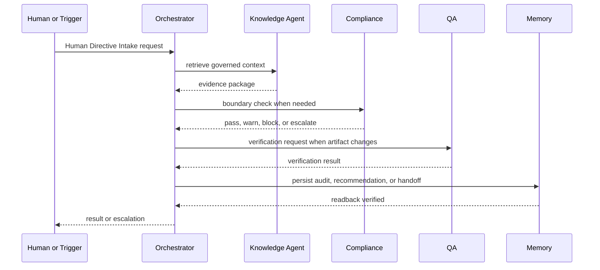

## Inputs
- trigger
- source documents
- canonical records
- permission policy
- evidence package

## Outputs
- answer
- recommendation
- block
- escalation
- audit event
- verified memory

## Boundary
The Human Directive Intake sequence may not skip source retrieval, permission checks, compliance review when applicable, or critical readback.

---

<!-- PAGE 039 -->
# Page 39 - Agent Context Request Sequence

## Sequence Diagram
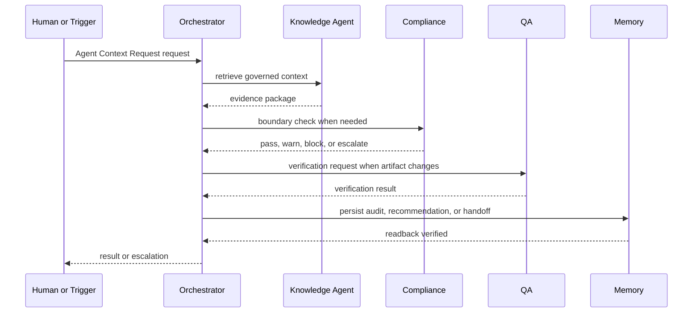

## Inputs
- trigger
- source documents
- canonical records
- permission policy
- evidence package

## Outputs
- answer
- recommendation
- block
- escalation
- audit event
- verified memory

## Boundary
The Agent Context Request sequence may not skip source retrieval, permission checks, compliance review when applicable, or critical readback.

---

<!-- PAGE 040 -->
# Page 40 - Compliance Review Sequence

## Sequence Diagram
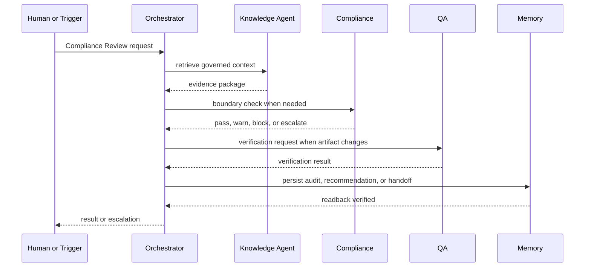

## Inputs
- trigger
- source documents
- canonical records
- permission policy
- evidence package

## Outputs
- answer
- recommendation
- block
- escalation
- audit event
- verified memory

## Boundary
The Compliance Review sequence may not skip source retrieval, permission checks, compliance review when applicable, or critical readback.

---

<!-- PAGE 041 -->
# Page 41 - QA Release Gate Sequence

## Sequence Diagram
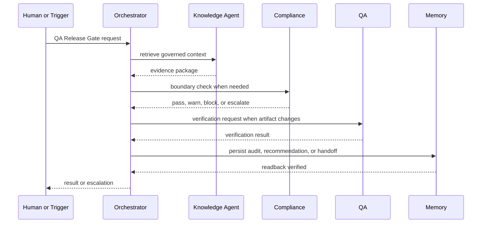

## Inputs
- trigger
- source documents
- canonical records
- permission policy
- evidence package

## Outputs
- answer
- recommendation
- block
- escalation
- audit event
- verified memory

## Boundary
The QA Release Gate sequence may not skip source retrieval, permission checks, compliance review when applicable, or critical readback.

---

<!-- PAGE 042 -->
# Page 42 - Memory Write Verification Sequence

## Sequence Diagram


## Inputs
- trigger
- source documents
- canonical records
- permission policy
- evidence package

## Outputs
- answer
- recommendation
- block
- escalation
- audit event
- verified memory

## Boundary
The Memory Write Verification sequence may not skip source retrieval, permission checks, compliance review when applicable, or critical readback.

---

<!-- PAGE 043 -->
# Page 43 - Source Conflict Resolution Sequence

## Sequence Diagram


## Inputs
- trigger
- source documents
- canonical records
- permission policy
- evidence package

## Outputs
- answer
- recommendation
- block
- escalation
- audit event
- verified memory

## Boundary
The Source Conflict Resolution sequence may not skip source retrieval, permission checks, compliance review when applicable, or critical readback.

---

<!-- PAGE 044 -->
# Page 44 - Prompt Change Approval Sequence

## Sequence Diagram


## Inputs
- trigger
- source documents
- canonical records
- permission policy
- evidence package

## Outputs
- answer
- recommendation
- block
- escalation
- audit event
- verified memory

## Boundary
The Prompt Change Approval sequence may not skip source retrieval, permission checks, compliance review when applicable, or critical readback.

---

<!-- PAGE 045 -->
# Page 45 - Schema Change Approval Sequence

## Sequence Diagram
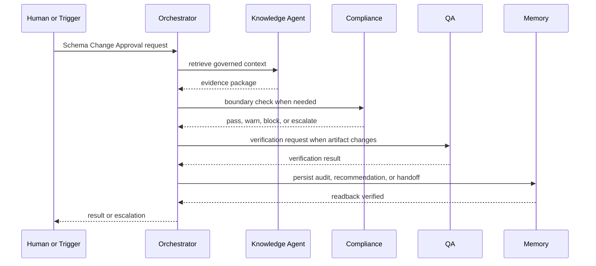

## Inputs
- trigger
- source documents
- canonical records
- permission policy
- evidence package

## Outputs
- answer
- recommendation
- block
- escalation
- audit event
- verified memory

## Boundary
The Schema Change Approval sequence may not skip source retrieval, permission checks, compliance review when applicable, or critical readback.

---

<!-- PAGE 046 -->
# Page 46 - Feature Handoff Sequence

## Sequence Diagram
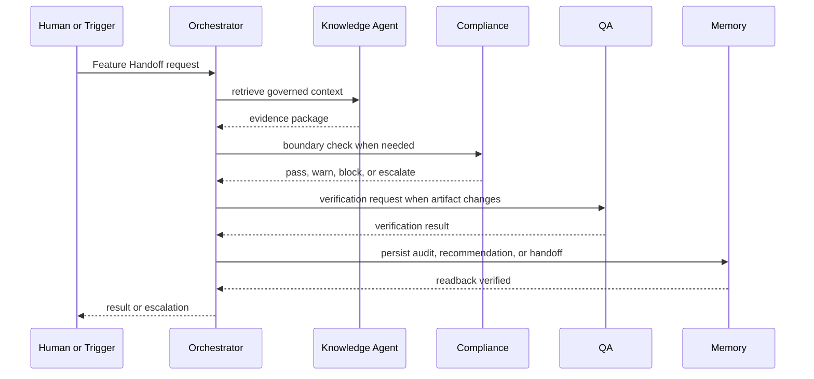

## Inputs
- trigger
- source documents
- canonical records
- permission policy
- evidence package

## Outputs
- answer
- recommendation
- block
- escalation
- audit event
- verified memory

## Boundary
The Feature Handoff sequence may not skip source retrieval, permission checks, compliance review when applicable, or critical readback.

---

<!-- PAGE 047 -->
# Page 47 - Incident Escalation Sequence

## Sequence Diagram
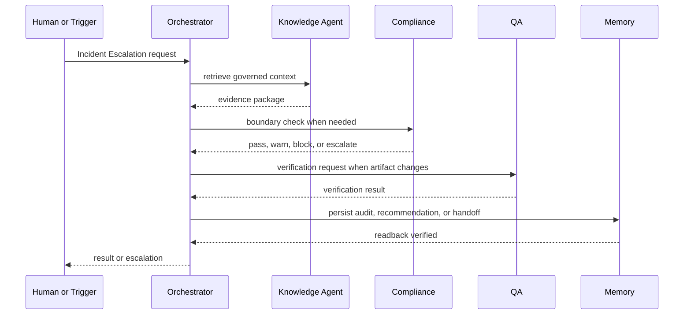

## Inputs
- trigger
- source documents
- canonical records
- permission policy
- evidence package

## Outputs
- answer
- recommendation
- block
- escalation
- audit event
- verified memory

## Boundary
The Incident Escalation sequence may not skip source retrieval, permission checks, compliance review when applicable, or critical readback.

---

<!-- PAGE 048 -->
# Page 48 - Research Claim Validation Sequence

## Sequence Diagram


## Inputs
- trigger
- source documents
- canonical records
- permission policy
- evidence package

## Outputs
- answer
- recommendation
- block
- escalation
- audit event
- verified memory

## Boundary
The Research Claim Validation sequence may not skip source retrieval, permission checks, compliance review when applicable, or critical readback.

---

<!-- PAGE 049 -->
# Page 49 - Documentation Publication Sequence

## Sequence Diagram


## Inputs
- trigger
- source documents
- canonical records
- permission policy
- evidence package

## Outputs
- answer
- recommendation
- block
- escalation
- audit event
- verified memory

## Boundary
The Documentation Publication sequence may not skip source retrieval, permission checks, compliance review when applicable, or critical readback.

---

<!-- PAGE 050 -->
# Page 50 - Future Agent Onboarding Sequence

## Sequence Diagram
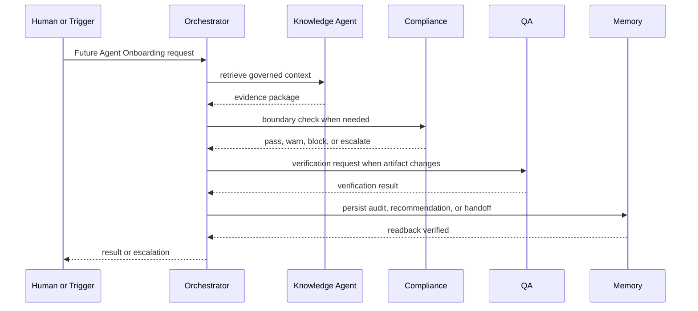

## Inputs
- trigger
- source documents
- canonical records
- permission policy
- evidence package

## Outputs
- answer
- recommendation
- block
- escalation
- audit event
- verified memory

## Boundary
The Future Agent Onboarding sequence may not skip source retrieval, permission checks, compliance review when applicable, or critical readback.

---

<!-- PAGE 051 -->
# Page 51 - Agent Retirement Sequence

## Sequence Diagram
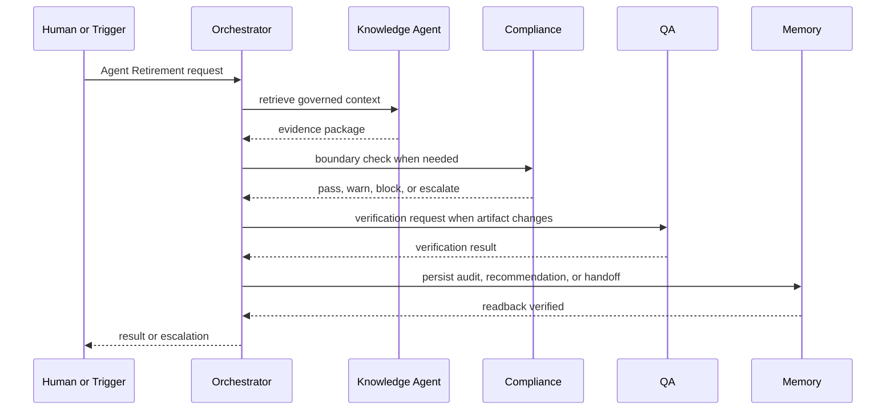

## Inputs
- trigger
- source documents
- canonical records
- permission policy
- evidence package

## Outputs
- answer
- recommendation
- block
- escalation
- audit event
- verified memory

## Boundary
The Agent Retirement sequence may not skip source retrieval, permission checks, compliance review when applicable, or critical readback.

---

<!-- PAGE 052 -->
# Page 52 - Learning Feedback Loop Sequence

## Sequence Diagram
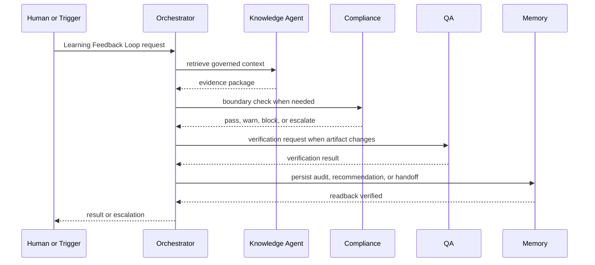

## Inputs
- trigger
- source documents
- canonical records
- permission policy
- evidence package

## Outputs
- answer
- recommendation
- block
- escalation
- audit event
- verified memory

## Boundary
The Learning Feedback Loop sequence may not skip source retrieval, permission checks, compliance review when applicable, or critical readback.

---

<!-- PAGE 053 -->
# Page 53 - Recommendation Outcome Loop Sequence

## Sequence Diagram
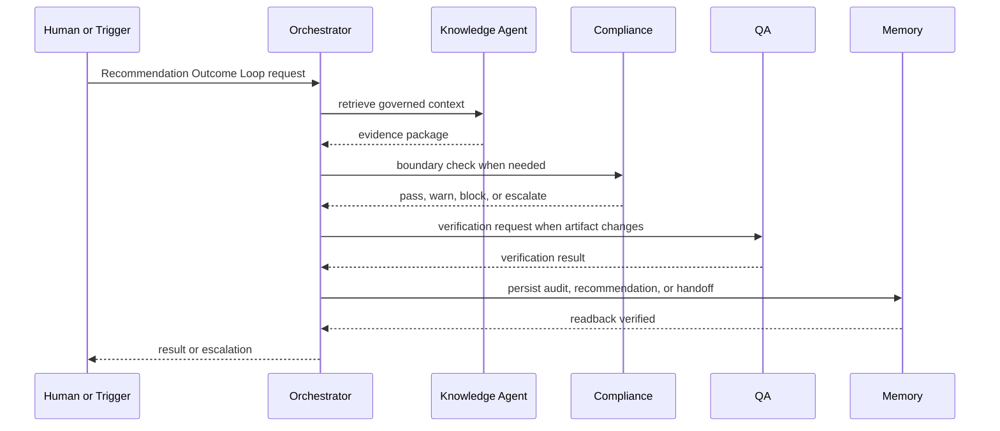

## Inputs
- trigger
- source documents
- canonical records
- permission policy
- evidence package

## Outputs
- answer
- recommendation
- block
- escalation
- audit event
- verified memory

## Boundary
The Recommendation Outcome Loop sequence may not skip source retrieval, permission checks, compliance review when applicable, or critical readback.

---

<!-- PAGE 054 -->
# Page 54 - GraphRAG Retrieval Loop Sequence

## Sequence Diagram
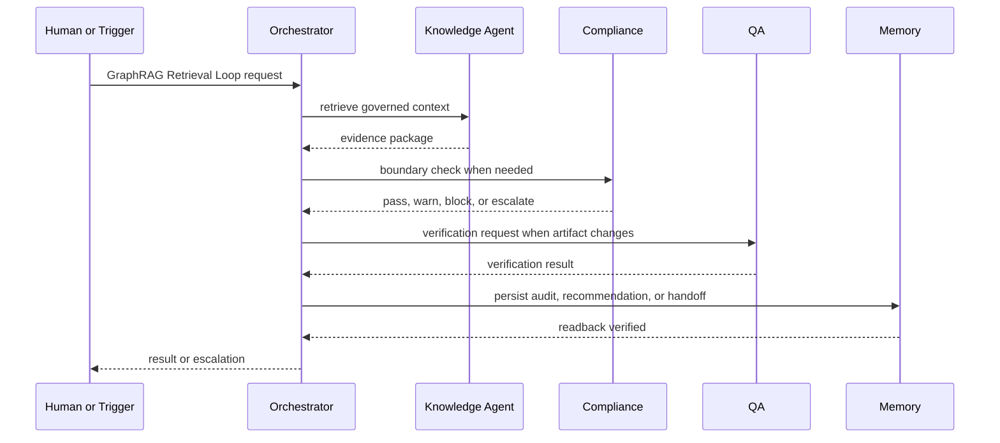

## Inputs
- trigger
- source documents
- canonical records
- permission policy
- evidence package

## Outputs
- answer
- recommendation
- block
- escalation
- audit event
- verified memory

## Boundary
The GraphRAG Retrieval Loop sequence may not skip source retrieval, permission checks, compliance review when applicable, or critical readback.

---

<!-- PAGE 055 -->
# Page 55 - Session Start Sequence

## Sequence Diagram
```mermaid
sequenceDiagram
  participant H as Human or Trigger
  participant O as Orchestrator
  participant K as Knowledge Agent
  participant C as Compliance
  participant Q as QA
  participant M as Memory
  H->>O: Session Start request
  O->>K: retrieve governed context
  K-->>O: evidence package
  O->>C: boundary check when needed
  C-->>O: pass, warn, block, or escalate
  O->>Q: verification request when artifact changes
  Q-->>O: verification result
  O->>M: persist audit, recommendation, or handoff
  M-->>O: readback verified
  O-->>H: result or escalation
```

## Inputs
- trigger
- source documents
- canonical records
- permission policy
- evidence package

## Outputs
- answer
- recommendation
- block
- escalation
- audit event
- verified memory

## Boundary
The Session Start sequence may not skip source retrieval, permission checks, compliance review when applicable, or critical readback.

---

<!-- PAGE 056 -->
# Page 56 - Session End Sequence

## Sequence Diagram
```mermaid
sequenceDiagram
  participant H as Human or Trigger
  participant O as Orchestrator
  participant K as Knowledge Agent
  participant C as Compliance
  participant Q as QA
  participant M as Memory
  H->>O: Session End request
  O->>K: retrieve governed context
  K-->>O: evidence package
  O->>C: boundary check when needed
  C-->>O: pass, warn, block, or escalate
  O->>Q: verification request when artifact changes
  Q-->>O: verification result
  O->>M: persist audit, recommendation, or handoff
  M-->>O: readback verified
  O-->>H: result or escalation
```

## Inputs
- trigger
- source documents
- canonical records
- permission policy
- evidence package

## Outputs
- answer
- recommendation
- block
- escalation
- audit event
- verified memory

## Boundary
The Session End sequence may not skip source retrieval, permission checks, compliance review when applicable, or critical readback.

---

<!-- PAGE 057 -->
# Page 57 - Intervector Message Processing Sequence

## Sequence Diagram
```mermaid
sequenceDiagram
  participant H as Human or Trigger
  participant O as Orchestrator
  participant K as Knowledge Agent
  participant C as Compliance
  participant Q as QA
  participant M as Memory
  H->>O: Intervector Message Processing request
  O->>K: retrieve governed context
  K-->>O: evidence package
  O->>C: boundary check when needed
  C-->>O: pass, warn, block, or escalate
  O->>Q: verification request when artifact changes
  Q-->>O: verification result
  O->>M: persist audit, recommendation, or handoff
  M-->>O: readback verified
  O-->>H: result or escalation
```

## Inputs
- trigger
- source documents
- canonical records
- permission policy
- evidence package

## Outputs
- answer
- recommendation
- block
- escalation
- audit event
- verified memory

## Boundary
The Intervector Message Processing sequence may not skip source retrieval, permission checks, compliance review when applicable, or critical readback.

---

<!-- PAGE 058 -->
# Page 58 - Recommendation State Machine

```mermaid
stateDiagram-v2
  [*] --> Created
  Created --> Validated
  Validated --> Active
  Active --> Reviewed
  Reviewed --> Accepted
  Reviewed --> Rejected
  Active --> Escalated
  Escalated --> Resolved
  Accepted --> Archived
  Rejected --> Archived
  Resolved --> Archived
  Archived --> [*]
```

## Transition Rules
- Created requires an owner.
- Validated requires schema and permission checks.
- Active requires a clear workflow purpose.
- Reviewed requires evidence.
- Accepted, rejected, or resolved requires an audit event.
- Archived preserves history and does not erase evidence.

---

<!-- PAGE 059 -->
# Page 59 - Escalation State Machine

```mermaid
stateDiagram-v2
  [*] --> Created
  Created --> Validated
  Validated --> Active
  Active --> Reviewed
  Reviewed --> Accepted
  Reviewed --> Rejected
  Active --> Escalated
  Escalated --> Resolved
  Accepted --> Archived
  Rejected --> Archived
  Resolved --> Archived
  Archived --> [*]
```

## Transition Rules
- Created requires an owner.
- Validated requires schema and permission checks.
- Active requires a clear workflow purpose.
- Reviewed requires evidence.
- Accepted, rejected, or resolved requires an audit event.
- Archived preserves history and does not erase evidence.

---

<!-- PAGE 060 -->
# Page 60 - Prompt Version State Machine

```mermaid
stateDiagram-v2
  [*] --> Created
  Created --> Validated
  Validated --> Active
  Active --> Reviewed
  Reviewed --> Accepted
  Reviewed --> Rejected
  Active --> Escalated
  Escalated --> Resolved
  Accepted --> Archived
  Rejected --> Archived
  Resolved --> Archived
  Archived --> [*]
```

## Transition Rules
- Created requires an owner.
- Validated requires schema and permission checks.
- Active requires a clear workflow purpose.
- Reviewed requires evidence.
- Accepted, rejected, or resolved requires an audit event.
- Archived preserves history and does not erase evidence.

---

<!-- PAGE 061 -->
# Page 61 - Schema Change State Machine

```mermaid
stateDiagram-v2
  [*] --> Created
  Created --> Validated
  Validated --> Active
  Active --> Reviewed
  Reviewed --> Accepted
  Reviewed --> Rejected
  Active --> Escalated
  Escalated --> Resolved
  Accepted --> Archived
  Rejected --> Archived
  Resolved --> Archived
  Archived --> [*]
```

## Transition Rules
- Created requires an owner.
- Validated requires schema and permission checks.
- Active requires a clear workflow purpose.
- Reviewed requires evidence.
- Accepted, rejected, or resolved requires an audit event.
- Archived preserves history and does not erase evidence.

---

<!-- PAGE 062 -->
# Page 62 - Memory Record State Machine

```mermaid
stateDiagram-v2
  [*] --> Created
  Created --> Validated
  Validated --> Active
  Active --> Reviewed
  Reviewed --> Accepted
  Reviewed --> Rejected
  Active --> Escalated
  Escalated --> Resolved
  Accepted --> Archived
  Rejected --> Archived
  Resolved --> Archived
  Archived --> [*]
```

## Transition Rules
- Created requires an owner.
- Validated requires schema and permission checks.
- Active requires a clear workflow purpose.
- Reviewed requires evidence.
- Accepted, rejected, or resolved requires an audit event.
- Archived preserves history and does not erase evidence.

---

<!-- PAGE 063 -->
# Page 63 - Audit Event State Machine

```mermaid
stateDiagram-v2
  [*] --> Created
  Created --> Validated
  Validated --> Active
  Active --> Reviewed
  Reviewed --> Accepted
  Reviewed --> Rejected
  Active --> Escalated
  Escalated --> Resolved
  Accepted --> Archived
  Rejected --> Archived
  Resolved --> Archived
  Archived --> [*]
```

## Transition Rules
- Created requires an owner.
- Validated requires schema and permission checks.
- Active requires a clear workflow purpose.
- Reviewed requires evidence.
- Accepted, rejected, or resolved requires an audit event.
- Archived preserves history and does not erase evidence.

---

<!-- PAGE 064 -->
# Page 64 - Handoff State Machine

```mermaid
stateDiagram-v2
  [*] --> Created
  Created --> Validated
  Validated --> Active
  Active --> Reviewed
  Reviewed --> Accepted
  Reviewed --> Rejected
  Active --> Escalated
  Escalated --> Resolved
  Accepted --> Archived
  Rejected --> Archived
  Resolved --> Archived
  Archived --> [*]
```

## Transition Rules
- Created requires an owner.
- Validated requires schema and permission checks.
- Active requires a clear workflow purpose.
- Reviewed requires evidence.
- Accepted, rejected, or resolved requires an audit event.
- Archived preserves history and does not erase evidence.

---

<!-- PAGE 065 -->
# Page 65 - Agent Runtime State Machine

```mermaid
stateDiagram-v2
  [*] --> Created
  Created --> Validated
  Validated --> Active
  Active --> Reviewed
  Reviewed --> Accepted
  Reviewed --> Rejected
  Active --> Escalated
  Escalated --> Resolved
  Accepted --> Archived
  Rejected --> Archived
  Resolved --> Archived
  Archived --> [*]
```

## Transition Rules
- Created requires an owner.
- Validated requires schema and permission checks.
- Active requires a clear workflow purpose.
- Reviewed requires evidence.
- Accepted, rejected, or resolved requires an audit event.
- Archived preserves history and does not erase evidence.

---

<!-- PAGE 066 -->
# Page 66 - Incident State Machine

```mermaid
stateDiagram-v2
  [*] --> Created
  Created --> Validated
  Validated --> Active
  Active --> Reviewed
  Reviewed --> Accepted
  Reviewed --> Rejected
  Active --> Escalated
  Escalated --> Resolved
  Accepted --> Archived
  Rejected --> Archived
  Resolved --> Archived
  Archived --> [*]
```

## Transition Rules
- Created requires an owner.
- Validated requires schema and permission checks.
- Active requires a clear workflow purpose.
- Reviewed requires evidence.
- Accepted, rejected, or resolved requires an audit event.
- Archived preserves history and does not erase evidence.

---

<!-- PAGE 067 -->
# Page 67 - Release Gate State Machine

```mermaid
stateDiagram-v2
  [*] --> Created
  Created --> Validated
  Validated --> Active
  Active --> Reviewed
  Reviewed --> Accepted
  Reviewed --> Rejected
  Active --> Escalated
  Escalated --> Resolved
  Accepted --> Archived
  Rejected --> Archived
  Resolved --> Archived
  Archived --> [*]
```

## Transition Rules
- Created requires an owner.
- Validated requires schema and permission checks.
- Active requires a clear workflow purpose.
- Reviewed requires evidence.
- Accepted, rejected, or resolved requires an audit event.
- Archived preserves history and does not erase evidence.

---

<!-- PAGE 068 -->
# Page 68 - Research Brief State Machine

```mermaid
stateDiagram-v2
  [*] --> Created
  Created --> Validated
  Validated --> Active
  Active --> Reviewed
  Reviewed --> Accepted
  Reviewed --> Rejected
  Active --> Escalated
  Escalated --> Resolved
  Accepted --> Archived
  Rejected --> Archived
  Resolved --> Archived
  Archived --> [*]
```

## Transition Rules
- Created requires an owner.
- Validated requires schema and permission checks.
- Active requires a clear workflow purpose.
- Reviewed requires evidence.
- Accepted, rejected, or resolved requires an audit event.
- Archived preserves history and does not erase evidence.

---

<!-- PAGE 069 -->
# Page 69 - Documentation Page State Machine

```mermaid
stateDiagram-v2
  [*] --> Created
  Created --> Validated
  Validated --> Active
  Active --> Reviewed
  Reviewed --> Accepted
  Reviewed --> Rejected
  Active --> Escalated
  Escalated --> Resolved
  Accepted --> Archived
  Rejected --> Archived
  Resolved --> Archived
  Archived --> [*]
```

## Transition Rules
- Created requires an owner.
- Validated requires schema and permission checks.
- Active requires a clear workflow purpose.
- Reviewed requires evidence.
- Accepted, rejected, or resolved requires an audit event.
- Archived preserves history and does not erase evidence.

---

<!-- PAGE 070 -->
# Page 70 - Decision Record State Machine

```mermaid
stateDiagram-v2
  [*] --> Created
  Created --> Validated
  Validated --> Active
  Active --> Reviewed
  Reviewed --> Accepted
  Reviewed --> Rejected
  Active --> Escalated
  Escalated --> Resolved
  Accepted --> Archived
  Rejected --> Archived
  Resolved --> Archived
  Archived --> [*]
```

## Transition Rules
- Created requires an owner.
- Validated requires schema and permission checks.
- Active requires a clear workflow purpose.
- Reviewed requires evidence.
- Accepted, rejected, or resolved requires an audit event.
- Archived preserves history and does not erase evidence.

---

<!-- PAGE 071 -->
# Page 71 - Work Queue Leaf State Machine

```mermaid
stateDiagram-v2
  [*] --> Created
  Created --> Validated
  Validated --> Active
  Active --> Reviewed
  Reviewed --> Accepted
  Reviewed --> Rejected
  Active --> Escalated
  Escalated --> Resolved
  Accepted --> Archived
  Rejected --> Archived
  Resolved --> Archived
  Archived --> [*]
```

## Transition Rules
- Created requires an owner.
- Validated requires schema and permission checks.
- Active requires a clear workflow purpose.
- Reviewed requires evidence.
- Accepted, rejected, or resolved requires an audit event.
- Archived preserves history and does not erase evidence.

---

<!-- PAGE 072 -->
# Page 72 - Agent Message State Machine

```mermaid
stateDiagram-v2
  [*] --> Created
  Created --> Validated
  Validated --> Active
  Active --> Reviewed
  Reviewed --> Accepted
  Reviewed --> Rejected
  Active --> Escalated
  Escalated --> Resolved
  Accepted --> Archived
  Rejected --> Archived
  Resolved --> Archived
  Archived --> [*]
```

## Transition Rules
- Created requires an owner.
- Validated requires schema and permission checks.
- Active requires a clear workflow purpose.
- Reviewed requires evidence.
- Accepted, rejected, or resolved requires an audit event.
- Archived preserves history and does not erase evidence.

---

<!-- PAGE 073 -->
# Page 73 - GraphRAG Package State Machine

```mermaid
stateDiagram-v2
  [*] --> Created
  Created --> Validated
  Validated --> Active
  Active --> Reviewed
  Reviewed --> Accepted
  Reviewed --> Rejected
  Active --> Escalated
  Escalated --> Resolved
  Accepted --> Archived
  Rejected --> Archived
  Resolved --> Archived
  Archived --> [*]
```

## Transition Rules
- Created requires an owner.
- Validated requires schema and permission checks.
- Active requires a clear workflow purpose.
- Reviewed requires evidence.
- Accepted, rejected, or resolved requires an audit event.
- Archived preserves history and does not erase evidence.

---

<!-- PAGE 074 -->
# Page 74 - Compliance Review State Machine

```mermaid
stateDiagram-v2
  [*] --> Created
  Created --> Validated
  Validated --> Active
  Active --> Reviewed
  Reviewed --> Accepted
  Reviewed --> Rejected
  Active --> Escalated
  Escalated --> Resolved
  Accepted --> Archived
  Rejected --> Archived
  Resolved --> Archived
  Archived --> [*]
```

## Transition Rules
- Created requires an owner.
- Validated requires schema and permission checks.
- Active requires a clear workflow purpose.
- Reviewed requires evidence.
- Accepted, rejected, or resolved requires an audit event.
- Archived preserves history and does not erase evidence.

---

<!-- PAGE 075 -->
# Page 75 - QA Finding State Machine

```mermaid
stateDiagram-v2
  [*] --> Created
  Created --> Validated
  Validated --> Active
  Active --> Reviewed
  Reviewed --> Accepted
  Reviewed --> Rejected
  Active --> Escalated
  Escalated --> Resolved
  Accepted --> Archived
  Rejected --> Archived
  Resolved --> Archived
  Archived --> [*]
```

## Transition Rules
- Created requires an owner.
- Validated requires schema and permission checks.
- Active requires a clear workflow purpose.
- Reviewed requires evidence.
- Accepted, rejected, or resolved requires an audit event.
- Archived preserves history and does not erase evidence.

---

<!-- PAGE 076 -->
# Page 76 - Operational Alert State Machine

```mermaid
stateDiagram-v2
  [*] --> Created
  Created --> Validated
  Validated --> Active
  Active --> Reviewed
  Reviewed --> Accepted
  Reviewed --> Rejected
  Active --> Escalated
  Escalated --> Resolved
  Accepted --> Archived
  Rejected --> Archived
  Resolved --> Archived
  Archived --> [*]
```

## Transition Rules
- Created requires an owner.
- Validated requires schema and permission checks.
- Active requires a clear workflow purpose.
- Reviewed requires evidence.
- Accepted, rejected, or resolved requires an audit event.
- Archived preserves history and does not erase evidence.

---

<!-- PAGE 077 -->
# Page 77 - Learning Note State Machine

```mermaid
stateDiagram-v2
  [*] --> Created
  Created --> Validated
  Validated --> Active
  Active --> Reviewed
  Reviewed --> Accepted
  Reviewed --> Rejected
  Active --> Escalated
  Escalated --> Resolved
  Accepted --> Archived
  Rejected --> Archived
  Resolved --> Archived
  Archived --> [*]
```

## Transition Rules
- Created requires an owner.
- Validated requires schema and permission checks.
- Active requires a clear workflow purpose.
- Reviewed requires evidence.
- Accepted, rejected, or resolved requires an audit event.
- Archived preserves history and does not erase evidence.

---

<!-- PAGE 078 -->
# Page 78 - Agent Message API

## Purpose
Agent Message API gives the organization a governed interface for communication and traceability.

## Request Shape
```json
{
  "request_id": "req_...",
  "actor": "",
  "purpose": "",
  "entity_refs": [],
  "payload": {},
  "evidence_refs": [],
  "created_at": "ISO-8601Z"
}
```

## Response Shape
```json
{
  "ok": true,
  "status": "",
  "result_ref": "",
  "warnings": [],
  "escalation_ref": null,
  "audit_ref": ""
}
```

## Testing
Test success, malformed payload, permission denied, source conflict, partial persistence, compliance block, and readback verification.

---

<!-- PAGE 079 -->
# Page 79 - Recommendation API

## Purpose
Recommendation API gives the organization a governed interface for communication and traceability.

## Request Shape
```json
{
  "request_id": "req_...",
  "actor": "",
  "purpose": "",
  "entity_refs": [],
  "payload": {},
  "evidence_refs": [],
  "created_at": "ISO-8601Z"
}
```

## Response Shape
```json
{
  "ok": true,
  "status": "",
  "result_ref": "",
  "warnings": [],
  "escalation_ref": null,
  "audit_ref": ""
}
```

## Testing
Test success, malformed payload, permission denied, source conflict, partial persistence, compliance block, and readback verification.

---

<!-- PAGE 080 -->
# Page 80 - Escalation API

## Purpose
Escalation API gives the organization a governed interface for communication and traceability.

## Request Shape
```json
{
  "request_id": "req_...",
  "actor": "",
  "purpose": "",
  "entity_refs": [],
  "payload": {},
  "evidence_refs": [],
  "created_at": "ISO-8601Z"
}
```

## Response Shape
```json
{
  "ok": true,
  "status": "",
  "result_ref": "",
  "warnings": [],
  "escalation_ref": null,
  "audit_ref": ""
}
```

## Testing
Test success, malformed payload, permission denied, source conflict, partial persistence, compliance block, and readback verification.

---

<!-- PAGE 081 -->
# Page 81 - Memory API

## Purpose
Memory API gives the organization a governed interface for communication and traceability.

## Request Shape
```json
{
  "request_id": "req_...",
  "actor": "",
  "purpose": "",
  "entity_refs": [],
  "payload": {},
  "evidence_refs": [],
  "created_at": "ISO-8601Z"
}
```

## Response Shape
```json
{
  "ok": true,
  "status": "",
  "result_ref": "",
  "warnings": [],
  "escalation_ref": null,
  "audit_ref": ""
}
```

## Testing
Test success, malformed payload, permission denied, source conflict, partial persistence, compliance block, and readback verification.

---

<!-- PAGE 082 -->
# Page 82 - GraphRAG API

## Purpose
GraphRAG API gives the organization a governed interface for communication and traceability.

## Request Shape
```json
{
  "request_id": "req_...",
  "actor": "",
  "purpose": "",
  "entity_refs": [],
  "payload": {},
  "evidence_refs": [],
  "created_at": "ISO-8601Z"
}
```

## Response Shape
```json
{
  "ok": true,
  "status": "",
  "result_ref": "",
  "warnings": [],
  "escalation_ref": null,
  "audit_ref": ""
}
```

## Testing
Test success, malformed payload, permission denied, source conflict, partial persistence, compliance block, and readback verification.

---

<!-- PAGE 083 -->
# Page 83 - Prompt Registry API

## Purpose
Prompt Registry API gives the organization a governed interface for communication and traceability.

## Request Shape
```json
{
  "request_id": "req_...",
  "actor": "",
  "purpose": "",
  "entity_refs": [],
  "payload": {},
  "evidence_refs": [],
  "created_at": "ISO-8601Z"
}
```

## Response Shape
```json
{
  "ok": true,
  "status": "",
  "result_ref": "",
  "warnings": [],
  "escalation_ref": null,
  "audit_ref": ""
}
```

## Testing
Test success, malformed payload, permission denied, source conflict, partial persistence, compliance block, and readback verification.

---

<!-- PAGE 084 -->
# Page 84 - Schema Registry API

## Purpose
Schema Registry API gives the organization a governed interface for communication and traceability.

## Request Shape
```json
{
  "request_id": "req_...",
  "actor": "",
  "purpose": "",
  "entity_refs": [],
  "payload": {},
  "evidence_refs": [],
  "created_at": "ISO-8601Z"
}
```

## Response Shape
```json
{
  "ok": true,
  "status": "",
  "result_ref": "",
  "warnings": [],
  "escalation_ref": null,
  "audit_ref": ""
}
```

## Testing
Test success, malformed payload, permission denied, source conflict, partial persistence, compliance block, and readback verification.

---

<!-- PAGE 085 -->
# Page 85 - Audit API

## Purpose
Audit API gives the organization a governed interface for communication and traceability.

## Request Shape
```json
{
  "request_id": "req_...",
  "actor": "",
  "purpose": "",
  "entity_refs": [],
  "payload": {},
  "evidence_refs": [],
  "created_at": "ISO-8601Z"
}
```

## Response Shape
```json
{
  "ok": true,
  "status": "",
  "result_ref": "",
  "warnings": [],
  "escalation_ref": null,
  "audit_ref": ""
}
```

## Testing
Test success, malformed payload, permission denied, source conflict, partial persistence, compliance block, and readback verification.

---

<!-- PAGE 086 -->
# Page 86 - QA API

## Purpose
QA API gives the organization a governed interface for communication and traceability.

## Request Shape
```json
{
  "request_id": "req_...",
  "actor": "",
  "purpose": "",
  "entity_refs": [],
  "payload": {},
  "evidence_refs": [],
  "created_at": "ISO-8601Z"
}
```

## Response Shape
```json
{
  "ok": true,
  "status": "",
  "result_ref": "",
  "warnings": [],
  "escalation_ref": null,
  "audit_ref": ""
}
```

## Testing
Test success, malformed payload, permission denied, source conflict, partial persistence, compliance block, and readback verification.

---

<!-- PAGE 087 -->
# Page 87 - Research API

## Purpose
Research API gives the organization a governed interface for communication and traceability.

## Request Shape
```json
{
  "request_id": "req_...",
  "actor": "",
  "purpose": "",
  "entity_refs": [],
  "payload": {},
  "evidence_refs": [],
  "created_at": "ISO-8601Z"
}
```

## Response Shape
```json
{
  "ok": true,
  "status": "",
  "result_ref": "",
  "warnings": [],
  "escalation_ref": null,
  "audit_ref": ""
}
```

## Testing
Test success, malformed payload, permission denied, source conflict, partial persistence, compliance block, and readback verification.

---

<!-- PAGE 088 -->
# Page 88 - Documentation API

## Purpose
Documentation API gives the organization a governed interface for communication and traceability.

## Request Shape
```json
{
  "request_id": "req_...",
  "actor": "",
  "purpose": "",
  "entity_refs": [],
  "payload": {},
  "evidence_refs": [],
  "created_at": "ISO-8601Z"
}
```

## Response Shape
```json
{
  "ok": true,
  "status": "",
  "result_ref": "",
  "warnings": [],
  "escalation_ref": null,
  "audit_ref": ""
}
```

## Testing
Test success, malformed payload, permission denied, source conflict, partial persistence, compliance block, and readback verification.

---

<!-- PAGE 089 -->
# Page 89 - Operations API

## Purpose
Operations API gives the organization a governed interface for communication and traceability.

## Request Shape
```json
{
  "request_id": "req_...",
  "actor": "",
  "purpose": "",
  "entity_refs": [],
  "payload": {},
  "evidence_refs": [],
  "created_at": "ISO-8601Z"
}
```

## Response Shape
```json
{
  "ok": true,
  "status": "",
  "result_ref": "",
  "warnings": [],
  "escalation_ref": null,
  "audit_ref": ""
}
```

## Testing
Test success, malformed payload, permission denied, source conflict, partial persistence, compliance block, and readback verification.

---

<!-- PAGE 090 -->
# Page 90 - Compliance API

## Purpose
Compliance API gives the organization a governed interface for communication and traceability.

## Request Shape
```json
{
  "request_id": "req_...",
  "actor": "",
  "purpose": "",
  "entity_refs": [],
  "payload": {},
  "evidence_refs": [],
  "created_at": "ISO-8601Z"
}
```

## Response Shape
```json
{
  "ok": true,
  "status": "",
  "result_ref": "",
  "warnings": [],
  "escalation_ref": null,
  "audit_ref": ""
}
```

## Testing
Test success, malformed payload, permission denied, source conflict, partial persistence, compliance block, and readback verification.

---

<!-- PAGE 091 -->
# Page 91 - Program Status API

## Purpose
Program Status API gives the organization a governed interface for communication and traceability.

## Request Shape
```json
{
  "request_id": "req_...",
  "actor": "",
  "purpose": "",
  "entity_refs": [],
  "payload": {},
  "evidence_refs": [],
  "created_at": "ISO-8601Z"
}
```

## Response Shape
```json
{
  "ok": true,
  "status": "",
  "result_ref": "",
  "warnings": [],
  "escalation_ref": null,
  "audit_ref": ""
}
```

## Testing
Test success, malformed payload, permission denied, source conflict, partial persistence, compliance block, and readback verification.

---

<!-- PAGE 092 -->
# Page 92 - Agent Directory API

## Purpose
Agent Directory API gives the organization a governed interface for communication and traceability.

## Request Shape
```json
{
  "request_id": "req_...",
  "actor": "",
  "purpose": "",
  "entity_refs": [],
  "payload": {},
  "evidence_refs": [],
  "created_at": "ISO-8601Z"
}
```

## Response Shape
```json
{
  "ok": true,
  "status": "",
  "result_ref": "",
  "warnings": [],
  "escalation_ref": null,
  "audit_ref": ""
}
```

## Testing
Test success, malformed payload, permission denied, source conflict, partial persistence, compliance block, and readback verification.

---

<!-- PAGE 093 -->
# Page 93 - Protocol Appendix 93

## Operating Rule
Every communication must be purposeful, scoped, auditable, and linked to the human or workflow need it serves.

## Collaboration Rules
- Use the message board for asynchronous agent coordination.
- Use replies rather than mutating parent messages.
- Use explicit priority and status.
- Use evidence references.
- Normalize legacy statuses on read.
- Escalate critical blocks before user-facing claims.
- Mention unresolved outbound messages in session handoff.
- Do not send secrets or raw tokens through messages.

## Memory Rules
- Mongo owns complete records.
- Neo4j owns relationships.
- Chroma owns semantic retrieval.
- GraphRAG packages context with evidence.
- Critical writes require readback.
- Schema-enforced envelopes are required for new memory lineage records.

## Interaction Diagram
```mermaid
flowchart TD
  Trigger[Trigger] --> Message[Governed Message]
  Message --> Permission[Permission Check]
  Permission --> Context[Context Retrieval]
  Context --> Boundary[Compliance and Privacy Boundary]
  Boundary --> Action[Action or Recommendation]
  Action --> Verify[Verification]
  Verify --> Persist[Memory and Audit]
  Persist --> Handoff[Handoff or Outcome]
```

---

<!-- PAGE 094 -->
# Page 94 - Protocol Appendix 94

## Operating Rule
Every communication must be purposeful, scoped, auditable, and linked to the human or workflow need it serves.

## Collaboration Rules
- Use the message board for asynchronous agent coordination.
- Use replies rather than mutating parent messages.
- Use explicit priority and status.
- Use evidence references.
- Normalize legacy statuses on read.
- Escalate critical blocks before user-facing claims.
- Mention unresolved outbound messages in session handoff.
- Do not send secrets or raw tokens through messages.

## Memory Rules
- Mongo owns complete records.
- Neo4j owns relationships.
- Chroma owns semantic retrieval.
- GraphRAG packages context with evidence.
- Critical writes require readback.
- Schema-enforced envelopes are required for new memory lineage records.

## Interaction Diagram
```mermaid
flowchart TD
  Trigger[Trigger] --> Message[Governed Message]
  Message --> Permission[Permission Check]
  Permission --> Context[Context Retrieval]
  Context --> Boundary[Compliance and Privacy Boundary]
  Boundary --> Action[Action or Recommendation]
  Action --> Verify[Verification]
  Verify --> Persist[Memory and Audit]
  Persist --> Handoff[Handoff or Outcome]
```

---

<!-- PAGE 095 -->
# Page 95 - Protocol Appendix 95

## Operating Rule
Every communication must be purposeful, scoped, auditable, and linked to the human or workflow need it serves.

## Collaboration Rules
- Use the message board for asynchronous agent coordination.
- Use replies rather than mutating parent messages.
- Use explicit priority and status.
- Use evidence references.
- Normalize legacy statuses on read.
- Escalate critical blocks before user-facing claims.
- Mention unresolved outbound messages in session handoff.
- Do not send secrets or raw tokens through messages.

## Memory Rules
- Mongo owns complete records.
- Neo4j owns relationships.
- Chroma owns semantic retrieval.
- GraphRAG packages context with evidence.
- Critical writes require readback.
- Schema-enforced envelopes are required for new memory lineage records.

## Interaction Diagram
```mermaid
flowchart TD
  Trigger[Trigger] --> Message[Governed Message]
  Message --> Permission[Permission Check]
  Permission --> Context[Context Retrieval]
  Context --> Boundary[Compliance and Privacy Boundary]
  Boundary --> Action[Action or Recommendation]
  Action --> Verify[Verification]
  Verify --> Persist[Memory and Audit]
  Persist --> Handoff[Handoff or Outcome]
```

---

<!-- PAGE 096 -->
# Page 96 - Protocol Appendix 96

## Operating Rule
Every communication must be purposeful, scoped, auditable, and linked to the human or workflow need it serves.

## Collaboration Rules
- Use the message board for asynchronous agent coordination.
- Use replies rather than mutating parent messages.
- Use explicit priority and status.
- Use evidence references.
- Normalize legacy statuses on read.
- Escalate critical blocks before user-facing claims.
- Mention unresolved outbound messages in session handoff.
- Do not send secrets or raw tokens through messages.

## Memory Rules
- Mongo owns complete records.
- Neo4j owns relationships.
- Chroma owns semantic retrieval.
- GraphRAG packages context with evidence.
- Critical writes require readback.
- Schema-enforced envelopes are required for new memory lineage records.

## Interaction Diagram
```mermaid
flowchart TD
  Trigger[Trigger] --> Message[Governed Message]
  Message --> Permission[Permission Check]
  Permission --> Context[Context Retrieval]
  Context --> Boundary[Compliance and Privacy Boundary]
  Boundary --> Action[Action or Recommendation]
  Action --> Verify[Verification]
  Verify --> Persist[Memory and Audit]
  Persist --> Handoff[Handoff or Outcome]
```

---

<!-- PAGE 097 -->
# Page 97 - Protocol Appendix 97

## Operating Rule
Every communication must be purposeful, scoped, auditable, and linked to the human or workflow need it serves.

## Collaboration Rules
- Use the message board for asynchronous agent coordination.
- Use replies rather than mutating parent messages.
- Use explicit priority and status.
- Use evidence references.
- Normalize legacy statuses on read.
- Escalate critical blocks before user-facing claims.
- Mention unresolved outbound messages in session handoff.
- Do not send secrets or raw tokens through messages.

## Memory Rules
- Mongo owns complete records.
- Neo4j owns relationships.
- Chroma owns semantic retrieval.
- GraphRAG packages context with evidence.
- Critical writes require readback.
- Schema-enforced envelopes are required for new memory lineage records.

## Interaction Diagram
```mermaid
flowchart TD
  Trigger[Trigger] --> Message[Governed Message]
  Message --> Permission[Permission Check]
  Permission --> Context[Context Retrieval]
  Context --> Boundary[Compliance and Privacy Boundary]
  Boundary --> Action[Action or Recommendation]
  Action --> Verify[Verification]
  Verify --> Persist[Memory and Audit]
  Persist --> Handoff[Handoff or Outcome]
```

---

<!-- PAGE 098 -->
# Page 98 - Protocol Appendix 98

## Operating Rule
Every communication must be purposeful, scoped, auditable, and linked to the human or workflow need it serves.

## Collaboration Rules
- Use the message board for asynchronous agent coordination.
- Use replies rather than mutating parent messages.
- Use explicit priority and status.
- Use evidence references.
- Normalize legacy statuses on read.
- Escalate critical blocks before user-facing claims.
- Mention unresolved outbound messages in session handoff.
- Do not send secrets or raw tokens through messages.

## Memory Rules
- Mongo owns complete records.
- Neo4j owns relationships.
- Chroma owns semantic retrieval.
- GraphRAG packages context with evidence.
- Critical writes require readback.
- Schema-enforced envelopes are required for new memory lineage records.

## Interaction Diagram
```mermaid
flowchart TD
  Trigger[Trigger] --> Message[Governed Message]
  Message --> Permission[Permission Check]
  Permission --> Context[Context Retrieval]
  Context --> Boundary[Compliance and Privacy Boundary]
  Boundary --> Action[Action or Recommendation]
  Action --> Verify[Verification]
  Verify --> Persist[Memory and Audit]
  Persist --> Handoff[Handoff or Outcome]
```

---

<!-- PAGE 099 -->
# Page 99 - Protocol Appendix 99

## Operating Rule
Every communication must be purposeful, scoped, auditable, and linked to the human or workflow need it serves.

## Collaboration Rules
- Use the message board for asynchronous agent coordination.
- Use replies rather than mutating parent messages.
- Use explicit priority and status.
- Use evidence references.
- Normalize legacy statuses on read.
- Escalate critical blocks before user-facing claims.
- Mention unresolved outbound messages in session handoff.
- Do not send secrets or raw tokens through messages.

## Memory Rules
- Mongo owns complete records.
- Neo4j owns relationships.
- Chroma owns semantic retrieval.
- GraphRAG packages context with evidence.
- Critical writes require readback.
- Schema-enforced envelopes are required for new memory lineage records.

## Interaction Diagram
```mermaid
flowchart TD
  Trigger[Trigger] --> Message[Governed Message]
  Message --> Permission[Permission Check]
  Permission --> Context[Context Retrieval]
  Context --> Boundary[Compliance and Privacy Boundary]
  Boundary --> Action[Action or Recommendation]
  Action --> Verify[Verification]
  Verify --> Persist[Memory and Audit]
  Persist --> Handoff[Handoff or Outcome]
```

---

<!-- PAGE 100 -->
# Page 100 - Protocol Appendix 100

## Operating Rule
Every communication must be purposeful, scoped, auditable, and linked to the human or workflow need it serves.

## Collaboration Rules
- Use the message board for asynchronous agent coordination.
- Use replies rather than mutating parent messages.
- Use explicit priority and status.
- Use evidence references.
- Normalize legacy statuses on read.
- Escalate critical blocks before user-facing claims.
- Mention unresolved outbound messages in session handoff.
- Do not send secrets or raw tokens through messages.

## Memory Rules
- Mongo owns complete records.
- Neo4j owns relationships.
- Chroma owns semantic retrieval.
- GraphRAG packages context with evidence.
- Critical writes require readback.
- Schema-enforced envelopes are required for new memory lineage records.

## Interaction Diagram
```mermaid
flowchart TD
  Trigger[Trigger] --> Message[Governed Message]
  Message --> Permission[Permission Check]
  Permission --> Context[Context Retrieval]
  Context --> Boundary[Compliance and Privacy Boundary]
  Boundary --> Action[Action or Recommendation]
  Action --> Verify[Verification]
  Verify --> Persist[Memory and Audit]
  Persist --> Handoff[Handoff or Outcome]
```

---

<!-- PAGE 101 -->
# Page 101 - Protocol Appendix 101

## Operating Rule
Every communication must be purposeful, scoped, auditable, and linked to the human or workflow need it serves.

## Collaboration Rules
- Use the message board for asynchronous agent coordination.
- Use replies rather than mutating parent messages.
- Use explicit priority and status.
- Use evidence references.
- Normalize legacy statuses on read.
- Escalate critical blocks before user-facing claims.
- Mention unresolved outbound messages in session handoff.
- Do not send secrets or raw tokens through messages.

## Memory Rules
- Mongo owns complete records.
- Neo4j owns relationships.
- Chroma owns semantic retrieval.
- GraphRAG packages context with evidence.
- Critical writes require readback.
- Schema-enforced envelopes are required for new memory lineage records.

## Interaction Diagram
```mermaid
flowchart TD
  Trigger[Trigger] --> Message[Governed Message]
  Message --> Permission[Permission Check]
  Permission --> Context[Context Retrieval]
  Context --> Boundary[Compliance and Privacy Boundary]
  Boundary --> Action[Action or Recommendation]
  Action --> Verify[Verification]
  Verify --> Persist[Memory and Audit]
  Persist --> Handoff[Handoff or Outcome]
```

---

<!-- PAGE 102 -->
# Page 102 - Protocol Appendix 102

## Operating Rule
Every communication must be purposeful, scoped, auditable, and linked to the human or workflow need it serves.

## Collaboration Rules
- Use the message board for asynchronous agent coordination.
- Use replies rather than mutating parent messages.
- Use explicit priority and status.
- Use evidence references.
- Normalize legacy statuses on read.
- Escalate critical blocks before user-facing claims.
- Mention unresolved outbound messages in session handoff.
- Do not send secrets or raw tokens through messages.

## Memory Rules
- Mongo owns complete records.
- Neo4j owns relationships.
- Chroma owns semantic retrieval.
- GraphRAG packages context with evidence.
- Critical writes require readback.
- Schema-enforced envelopes are required for new memory lineage records.

## Interaction Diagram
```mermaid
flowchart TD
  Trigger[Trigger] --> Message[Governed Message]
  Message --> Permission[Permission Check]
  Permission --> Context[Context Retrieval]
  Context --> Boundary[Compliance and Privacy Boundary]
  Boundary --> Action[Action or Recommendation]
  Action --> Verify[Verification]
  Verify --> Persist[Memory and Audit]
  Persist --> Handoff[Handoff or Outcome]
```

---

<!-- PAGE 103 -->
# Page 103 - Protocol Appendix 103

## Operating Rule
Every communication must be purposeful, scoped, auditable, and linked to the human or workflow need it serves.

## Collaboration Rules
- Use the message board for asynchronous agent coordination.
- Use replies rather than mutating parent messages.
- Use explicit priority and status.
- Use evidence references.
- Normalize legacy statuses on read.
- Escalate critical blocks before user-facing claims.
- Mention unresolved outbound messages in session handoff.
- Do not send secrets or raw tokens through messages.

## Memory Rules
- Mongo owns complete records.
- Neo4j owns relationships.
- Chroma owns semantic retrieval.
- GraphRAG packages context with evidence.
- Critical writes require readback.
- Schema-enforced envelopes are required for new memory lineage records.

## Interaction Diagram
```mermaid
flowchart TD
  Trigger[Trigger] --> Message[Governed Message]
  Message --> Permission[Permission Check]
  Permission --> Context[Context Retrieval]
  Context --> Boundary[Compliance and Privacy Boundary]
  Boundary --> Action[Action or Recommendation]
  Action --> Verify[Verification]
  Verify --> Persist[Memory and Audit]
  Persist --> Handoff[Handoff or Outcome]
```

---

<!-- PAGE 104 -->
# Page 104 - Protocol Appendix 104

## Operating Rule
Every communication must be purposeful, scoped, auditable, and linked to the human or workflow need it serves.

## Collaboration Rules
- Use the message board for asynchronous agent coordination.
- Use replies rather than mutating parent messages.
- Use explicit priority and status.
- Use evidence references.
- Normalize legacy statuses on read.
- Escalate critical blocks before user-facing claims.
- Mention unresolved outbound messages in session handoff.
- Do not send secrets or raw tokens through messages.

## Memory Rules
- Mongo owns complete records.
- Neo4j owns relationships.
- Chroma owns semantic retrieval.
- GraphRAG packages context with evidence.
- Critical writes require readback.
- Schema-enforced envelopes are required for new memory lineage records.

## Interaction Diagram
```mermaid
flowchart TD
  Trigger[Trigger] --> Message[Governed Message]
  Message --> Permission[Permission Check]
  Permission --> Context[Context Retrieval]
  Context --> Boundary[Compliance and Privacy Boundary]
  Boundary --> Action[Action or Recommendation]
  Action --> Verify[Verification]
  Verify --> Persist[Memory and Audit]
  Persist --> Handoff[Handoff or Outcome]
```

---

<!-- PAGE 105 -->
# Page 105 - Protocol Appendix 105

## Operating Rule
Every communication must be purposeful, scoped, auditable, and linked to the human or workflow need it serves.

## Collaboration Rules
- Use the message board for asynchronous agent coordination.
- Use replies rather than mutating parent messages.
- Use explicit priority and status.
- Use evidence references.
- Normalize legacy statuses on read.
- Escalate critical blocks before user-facing claims.
- Mention unresolved outbound messages in session handoff.
- Do not send secrets or raw tokens through messages.

## Memory Rules
- Mongo owns complete records.
- Neo4j owns relationships.
- Chroma owns semantic retrieval.
- GraphRAG packages context with evidence.
- Critical writes require readback.
- Schema-enforced envelopes are required for new memory lineage records.

## Interaction Diagram
```mermaid
flowchart TD
  Trigger[Trigger] --> Message[Governed Message]
  Message --> Permission[Permission Check]
  Permission --> Context[Context Retrieval]
  Context --> Boundary[Compliance and Privacy Boundary]
  Boundary --> Action[Action or Recommendation]
  Action --> Verify[Verification]
  Verify --> Persist[Memory and Audit]
  Persist --> Handoff[Handoff or Outcome]
```

---

<!-- PAGE 106 -->
# Page 106 - Protocol Appendix 106

## Operating Rule
Every communication must be purposeful, scoped, auditable, and linked to the human or workflow need it serves.

## Collaboration Rules
- Use the message board for asynchronous agent coordination.
- Use replies rather than mutating parent messages.
- Use explicit priority and status.
- Use evidence references.
- Normalize legacy statuses on read.
- Escalate critical blocks before user-facing claims.
- Mention unresolved outbound messages in session handoff.
- Do not send secrets or raw tokens through messages.

## Memory Rules
- Mongo owns complete records.
- Neo4j owns relationships.
- Chroma owns semantic retrieval.
- GraphRAG packages context with evidence.
- Critical writes require readback.
- Schema-enforced envelopes are required for new memory lineage records.

## Interaction Diagram
```mermaid
flowchart TD
  Trigger[Trigger] --> Message[Governed Message]
  Message --> Permission[Permission Check]
  Permission --> Context[Context Retrieval]
  Context --> Boundary[Compliance and Privacy Boundary]
  Boundary --> Action[Action or Recommendation]
  Action --> Verify[Verification]
  Verify --> Persist[Memory and Audit]
  Persist --> Handoff[Handoff or Outcome]
```

---

<!-- PAGE 107 -->
# Page 107 - Protocol Appendix 107

## Operating Rule
Every communication must be purposeful, scoped, auditable, and linked to the human or workflow need it serves.

## Collaboration Rules
- Use the message board for asynchronous agent coordination.
- Use replies rather than mutating parent messages.
- Use explicit priority and status.
- Use evidence references.
- Normalize legacy statuses on read.
- Escalate critical blocks before user-facing claims.
- Mention unresolved outbound messages in session handoff.
- Do not send secrets or raw tokens through messages.

## Memory Rules
- Mongo owns complete records.
- Neo4j owns relationships.
- Chroma owns semantic retrieval.
- GraphRAG packages context with evidence.
- Critical writes require readback.
- Schema-enforced envelopes are required for new memory lineage records.

## Interaction Diagram
```mermaid
flowchart TD
  Trigger[Trigger] --> Message[Governed Message]
  Message --> Permission[Permission Check]
  Permission --> Context[Context Retrieval]
  Context --> Boundary[Compliance and Privacy Boundary]
  Boundary --> Action[Action or Recommendation]
  Action --> Verify[Verification]
  Verify --> Persist[Memory and Audit]
  Persist --> Handoff[Handoff or Outcome]
```

---

<!-- PAGE 108 -->
# Page 108 - Protocol Appendix 108

## Operating Rule
Every communication must be purposeful, scoped, auditable, and linked to the human or workflow need it serves.

## Collaboration Rules
- Use the message board for asynchronous agent coordination.
- Use replies rather than mutating parent messages.
- Use explicit priority and status.
- Use evidence references.
- Normalize legacy statuses on read.
- Escalate critical blocks before user-facing claims.
- Mention unresolved outbound messages in session handoff.
- Do not send secrets or raw tokens through messages.

## Memory Rules
- Mongo owns complete records.
- Neo4j owns relationships.
- Chroma owns semantic retrieval.
- GraphRAG packages context with evidence.
- Critical writes require readback.
- Schema-enforced envelopes are required for new memory lineage records.

## Interaction Diagram
```mermaid
flowchart TD
  Trigger[Trigger] --> Message[Governed Message]
  Message --> Permission[Permission Check]
  Permission --> Context[Context Retrieval]
  Context --> Boundary[Compliance and Privacy Boundary]
  Boundary --> Action[Action or Recommendation]
  Action --> Verify[Verification]
  Verify --> Persist[Memory and Audit]
  Persist --> Handoff[Handoff or Outcome]
```

---

<!-- PAGE 109 -->
# Page 109 - Protocol Appendix 109

## Operating Rule
Every communication must be purposeful, scoped, auditable, and linked to the human or workflow need it serves.

## Collaboration Rules
- Use the message board for asynchronous agent coordination.
- Use replies rather than mutating parent messages.
- Use explicit priority and status.
- Use evidence references.
- Normalize legacy statuses on read.
- Escalate critical blocks before user-facing claims.
- Mention unresolved outbound messages in session handoff.
- Do not send secrets or raw tokens through messages.

## Memory Rules
- Mongo owns complete records.
- Neo4j owns relationships.
- Chroma owns semantic retrieval.
- GraphRAG packages context with evidence.
- Critical writes require readback.
- Schema-enforced envelopes are required for new memory lineage records.

## Interaction Diagram
```mermaid
flowchart TD
  Trigger[Trigger] --> Message[Governed Message]
  Message --> Permission[Permission Check]
  Permission --> Context[Context Retrieval]
  Context --> Boundary[Compliance and Privacy Boundary]
  Boundary --> Action[Action or Recommendation]
  Action --> Verify[Verification]
  Verify --> Persist[Memory and Audit]
  Persist --> Handoff[Handoff or Outcome]
```

---

<!-- PAGE 110 -->
# Page 110 - Protocol Appendix 110

## Operating Rule
Every communication must be purposeful, scoped, auditable, and linked to the human or workflow need it serves.

## Collaboration Rules
- Use the message board for asynchronous agent coordination.
- Use replies rather than mutating parent messages.
- Use explicit priority and status.
- Use evidence references.
- Normalize legacy statuses on read.
- Escalate critical blocks before user-facing claims.
- Mention unresolved outbound messages in session handoff.
- Do not send secrets or raw tokens through messages.

## Memory Rules
- Mongo owns complete records.
- Neo4j owns relationships.
- Chroma owns semantic retrieval.
- GraphRAG packages context with evidence.
- Critical writes require readback.
- Schema-enforced envelopes are required for new memory lineage records.

## Interaction Diagram
```mermaid
flowchart TD
  Trigger[Trigger] --> Message[Governed Message]
  Message --> Permission[Permission Check]
  Permission --> Context[Context Retrieval]
  Context --> Boundary[Compliance and Privacy Boundary]
  Boundary --> Action[Action or Recommendation]
  Action --> Verify[Verification]
  Verify --> Persist[Memory and Audit]
  Persist --> Handoff[Handoff or Outcome]
```

---

<!-- PAGE 111 -->
# Page 111 - Protocol Appendix 111

## Operating Rule
Every communication must be purposeful, scoped, auditable, and linked to the human or workflow need it serves.

## Collaboration Rules
- Use the message board for asynchronous agent coordination.
- Use replies rather than mutating parent messages.
- Use explicit priority and status.
- Use evidence references.
- Normalize legacy statuses on read.
- Escalate critical blocks before user-facing claims.
- Mention unresolved outbound messages in session handoff.
- Do not send secrets or raw tokens through messages.

## Memory Rules
- Mongo owns complete records.
- Neo4j owns relationships.
- Chroma owns semantic retrieval.
- GraphRAG packages context with evidence.
- Critical writes require readback.
- Schema-enforced envelopes are required for new memory lineage records.

## Interaction Diagram
```mermaid
flowchart TD
  Trigger[Trigger] --> Message[Governed Message]
  Message --> Permission[Permission Check]
  Permission --> Context[Context Retrieval]
  Context --> Boundary[Compliance and Privacy Boundary]
  Boundary --> Action[Action or Recommendation]
  Action --> Verify[Verification]
  Verify --> Persist[Memory and Audit]
  Persist --> Handoff[Handoff or Outcome]
```

---

<!-- PAGE 112 -->
# Page 112 - Protocol Appendix 112

## Operating Rule
Every communication must be purposeful, scoped, auditable, and linked to the human or workflow need it serves.

## Collaboration Rules
- Use the message board for asynchronous agent coordination.
- Use replies rather than mutating parent messages.
- Use explicit priority and status.
- Use evidence references.
- Normalize legacy statuses on read.
- Escalate critical blocks before user-facing claims.
- Mention unresolved outbound messages in session handoff.
- Do not send secrets or raw tokens through messages.

## Memory Rules
- Mongo owns complete records.
- Neo4j owns relationships.
- Chroma owns semantic retrieval.
- GraphRAG packages context with evidence.
- Critical writes require readback.
- Schema-enforced envelopes are required for new memory lineage records.

## Interaction Diagram
```mermaid
flowchart TD
  Trigger[Trigger] --> Message[Governed Message]
  Message --> Permission[Permission Check]
  Permission --> Context[Context Retrieval]
  Context --> Boundary[Compliance and Privacy Boundary]
  Boundary --> Action[Action or Recommendation]
  Action --> Verify[Verification]
  Verify --> Persist[Memory and Audit]
  Persist --> Handoff[Handoff or Outcome]
```

---

<!-- PAGE 113 -->
# Page 113 - Protocol Appendix 113

## Operating Rule
Every communication must be purposeful, scoped, auditable, and linked to the human or workflow need it serves.

## Collaboration Rules
- Use the message board for asynchronous agent coordination.
- Use replies rather than mutating parent messages.
- Use explicit priority and status.
- Use evidence references.
- Normalize legacy statuses on read.
- Escalate critical blocks before user-facing claims.
- Mention unresolved outbound messages in session handoff.
- Do not send secrets or raw tokens through messages.

## Memory Rules
- Mongo owns complete records.
- Neo4j owns relationships.
- Chroma owns semantic retrieval.
- GraphRAG packages context with evidence.
- Critical writes require readback.
- Schema-enforced envelopes are required for new memory lineage records.

## Interaction Diagram
```mermaid
flowchart TD
  Trigger[Trigger] --> Message[Governed Message]
  Message --> Permission[Permission Check]
  Permission --> Context[Context Retrieval]
  Context --> Boundary[Compliance and Privacy Boundary]
  Boundary --> Action[Action or Recommendation]
  Action --> Verify[Verification]
  Verify --> Persist[Memory and Audit]
  Persist --> Handoff[Handoff or Outcome]
```

---

<!-- PAGE 114 -->
# Page 114 - Protocol Appendix 114

## Operating Rule
Every communication must be purposeful, scoped, auditable, and linked to the human or workflow need it serves.

## Collaboration Rules
- Use the message board for asynchronous agent coordination.
- Use replies rather than mutating parent messages.
- Use explicit priority and status.
- Use evidence references.
- Normalize legacy statuses on read.
- Escalate critical blocks before user-facing claims.
- Mention unresolved outbound messages in session handoff.
- Do not send secrets or raw tokens through messages.

## Memory Rules
- Mongo owns complete records.
- Neo4j owns relationships.
- Chroma owns semantic retrieval.
- GraphRAG packages context with evidence.
- Critical writes require readback.
- Schema-enforced envelopes are required for new memory lineage records.

## Interaction Diagram
```mermaid
flowchart TD
  Trigger[Trigger] --> Message[Governed Message]
  Message --> Permission[Permission Check]
  Permission --> Context[Context Retrieval]
  Context --> Boundary[Compliance and Privacy Boundary]
  Boundary --> Action[Action or Recommendation]
  Action --> Verify[Verification]
  Verify --> Persist[Memory and Audit]
  Persist --> Handoff[Handoff or Outcome]
```

---

<!-- PAGE 115 -->
# Page 115 - Protocol Appendix 115

## Operating Rule
Every communication must be purposeful, scoped, auditable, and linked to the human or workflow need it serves.

## Collaboration Rules
- Use the message board for asynchronous agent coordination.
- Use replies rather than mutating parent messages.
- Use explicit priority and status.
- Use evidence references.
- Normalize legacy statuses on read.
- Escalate critical blocks before user-facing claims.
- Mention unresolved outbound messages in session handoff.
- Do not send secrets or raw tokens through messages.

## Memory Rules
- Mongo owns complete records.
- Neo4j owns relationships.
- Chroma owns semantic retrieval.
- GraphRAG packages context with evidence.
- Critical writes require readback.
- Schema-enforced envelopes are required for new memory lineage records.

## Interaction Diagram
```mermaid
flowchart TD
  Trigger[Trigger] --> Message[Governed Message]
  Message --> Permission[Permission Check]
  Permission --> Context[Context Retrieval]
  Context --> Boundary[Compliance and Privacy Boundary]
  Boundary --> Action[Action or Recommendation]
  Action --> Verify[Verification]
  Verify --> Persist[Memory and Audit]
  Persist --> Handoff[Handoff or Outcome]
```

---

<!-- PAGE 116 -->
# Page 116 - Protocol Appendix 116

## Operating Rule
Every communication must be purposeful, scoped, auditable, and linked to the human or workflow need it serves.

## Collaboration Rules
- Use the message board for asynchronous agent coordination.
- Use replies rather than mutating parent messages.
- Use explicit priority and status.
- Use evidence references.
- Normalize legacy statuses on read.
- Escalate critical blocks before user-facing claims.
- Mention unresolved outbound messages in session handoff.
- Do not send secrets or raw tokens through messages.

## Memory Rules
- Mongo owns complete records.
- Neo4j owns relationships.
- Chroma owns semantic retrieval.
- GraphRAG packages context with evidence.
- Critical writes require readback.
- Schema-enforced envelopes are required for new memory lineage records.

## Interaction Diagram
```mermaid
flowchart TD
  Trigger[Trigger] --> Message[Governed Message]
  Message --> Permission[Permission Check]
  Permission --> Context[Context Retrieval]
  Context --> Boundary[Compliance and Privacy Boundary]
  Boundary --> Action[Action or Recommendation]
  Action --> Verify[Verification]
  Verify --> Persist[Memory and Audit]
  Persist --> Handoff[Handoff or Outcome]
```

---

<!-- PAGE 117 -->
# Page 117 - Protocol Appendix 117

## Operating Rule
Every communication must be purposeful, scoped, auditable, and linked to the human or workflow need it serves.

## Collaboration Rules
- Use the message board for asynchronous agent coordination.
- Use replies rather than mutating parent messages.
- Use explicit priority and status.
- Use evidence references.
- Normalize legacy statuses on read.
- Escalate critical blocks before user-facing claims.
- Mention unresolved outbound messages in session handoff.
- Do not send secrets or raw tokens through messages.

## Memory Rules
- Mongo owns complete records.
- Neo4j owns relationships.
- Chroma owns semantic retrieval.
- GraphRAG packages context with evidence.
- Critical writes require readback.
- Schema-enforced envelopes are required for new memory lineage records.

## Interaction Diagram
```mermaid
flowchart TD
  Trigger[Trigger] --> Message[Governed Message]
  Message --> Permission[Permission Check]
  Permission --> Context[Context Retrieval]
  Context --> Boundary[Compliance and Privacy Boundary]
  Boundary --> Action[Action or Recommendation]
  Action --> Verify[Verification]
  Verify --> Persist[Memory and Audit]
  Persist --> Handoff[Handoff or Outcome]
```

---

<!-- PAGE 118 -->
# Page 118 - Protocol Appendix 118

## Operating Rule
Every communication must be purposeful, scoped, auditable, and linked to the human or workflow need it serves.

## Collaboration Rules
- Use the message board for asynchronous agent coordination.
- Use replies rather than mutating parent messages.
- Use explicit priority and status.
- Use evidence references.
- Normalize legacy statuses on read.
- Escalate critical blocks before user-facing claims.
- Mention unresolved outbound messages in session handoff.
- Do not send secrets or raw tokens through messages.

## Memory Rules
- Mongo owns complete records.
- Neo4j owns relationships.
- Chroma owns semantic retrieval.
- GraphRAG packages context with evidence.
- Critical writes require readback.
- Schema-enforced envelopes are required for new memory lineage records.

## Interaction Diagram
```mermaid
flowchart TD
  Trigger[Trigger] --> Message[Governed Message]
  Message --> Permission[Permission Check]
  Permission --> Context[Context Retrieval]
  Context --> Boundary[Compliance and Privacy Boundary]
  Boundary --> Action[Action or Recommendation]
  Action --> Verify[Verification]
  Verify --> Persist[Memory and Audit]
  Persist --> Handoff[Handoff or Outcome]
```

---

<!-- PAGE 119 -->
# Page 119 - Protocol Appendix 119

## Operating Rule
Every communication must be purposeful, scoped, auditable, and linked to the human or workflow need it serves.

## Collaboration Rules
- Use the message board for asynchronous agent coordination.
- Use replies rather than mutating parent messages.
- Use explicit priority and status.
- Use evidence references.
- Normalize legacy statuses on read.
- Escalate critical blocks before user-facing claims.
- Mention unresolved outbound messages in session handoff.
- Do not send secrets or raw tokens through messages.

## Memory Rules
- Mongo owns complete records.
- Neo4j owns relationships.
- Chroma owns semantic retrieval.
- GraphRAG packages context with evidence.
- Critical writes require readback.
- Schema-enforced envelopes are required for new memory lineage records.

## Interaction Diagram
```mermaid
flowchart TD
  Trigger[Trigger] --> Message[Governed Message]
  Message --> Permission[Permission Check]
  Permission --> Context[Context Retrieval]
  Context --> Boundary[Compliance and Privacy Boundary]
  Boundary --> Action[Action or Recommendation]
  Action --> Verify[Verification]
  Verify --> Persist[Memory and Audit]
  Persist --> Handoff[Handoff or Outcome]
```

---

<!-- PAGE 120 -->
# Page 120 - Protocol Appendix 120

## Operating Rule
Every communication must be purposeful, scoped, auditable, and linked to the human or workflow need it serves.

## Collaboration Rules
- Use the message board for asynchronous agent coordination.
- Use replies rather than mutating parent messages.
- Use explicit priority and status.
- Use evidence references.
- Normalize legacy statuses on read.
- Escalate critical blocks before user-facing claims.
- Mention unresolved outbound messages in session handoff.
- Do not send secrets or raw tokens through messages.

## Memory Rules
- Mongo owns complete records.
- Neo4j owns relationships.
- Chroma owns semantic retrieval.
- GraphRAG packages context with evidence.
- Critical writes require readback.
- Schema-enforced envelopes are required for new memory lineage records.

## Interaction Diagram
```mermaid
flowchart TD
  Trigger[Trigger] --> Message[Governed Message]
  Message --> Permission[Permission Check]
  Permission --> Context[Context Retrieval]
  Context --> Boundary[Compliance and Privacy Boundary]
  Boundary --> Action[Action or Recommendation]
  Action --> Verify[Verification]
  Verify --> Persist[Memory and Audit]
  Persist --> Handoff[Handoff or Outcome]
```

---

<!-- PAGE 121 -->
# Page 121 - Protocol Appendix 121

## Operating Rule
Every communication must be purposeful, scoped, auditable, and linked to the human or workflow need it serves.

## Collaboration Rules
- Use the message board for asynchronous agent coordination.
- Use replies rather than mutating parent messages.
- Use explicit priority and status.
- Use evidence references.
- Normalize legacy statuses on read.
- Escalate critical blocks before user-facing claims.
- Mention unresolved outbound messages in session handoff.
- Do not send secrets or raw tokens through messages.

## Memory Rules
- Mongo owns complete records.
- Neo4j owns relationships.
- Chroma owns semantic retrieval.
- GraphRAG packages context with evidence.
- Critical writes require readback.
- Schema-enforced envelopes are required for new memory lineage records.

## Interaction Diagram
```mermaid
flowchart TD
  Trigger[Trigger] --> Message[Governed Message]
  Message --> Permission[Permission Check]
  Permission --> Context[Context Retrieval]
  Context --> Boundary[Compliance and Privacy Boundary]
  Boundary --> Action[Action or Recommendation]
  Action --> Verify[Verification]
  Verify --> Persist[Memory and Audit]
  Persist --> Handoff[Handoff or Outcome]
```

---

<!-- PAGE 122 -->
# Page 122 - Protocol Appendix 122

## Operating Rule
Every communication must be purposeful, scoped, auditable, and linked to the human or workflow need it serves.

## Collaboration Rules
- Use the message board for asynchronous agent coordination.
- Use replies rather than mutating parent messages.
- Use explicit priority and status.
- Use evidence references.
- Normalize legacy statuses on read.
- Escalate critical blocks before user-facing claims.
- Mention unresolved outbound messages in session handoff.
- Do not send secrets or raw tokens through messages.

## Memory Rules
- Mongo owns complete records.
- Neo4j owns relationships.
- Chroma owns semantic retrieval.
- GraphRAG packages context with evidence.
- Critical writes require readback.
- Schema-enforced envelopes are required for new memory lineage records.

## Interaction Diagram
```mermaid
flowchart TD
  Trigger[Trigger] --> Message[Governed Message]
  Message --> Permission[Permission Check]
  Permission --> Context[Context Retrieval]
  Context --> Boundary[Compliance and Privacy Boundary]
  Boundary --> Action[Action or Recommendation]
  Action --> Verify[Verification]
  Verify --> Persist[Memory and Audit]
  Persist --> Handoff[Handoff or Outcome]
```

---

<!-- PAGE 123 -->
# Page 123 - Protocol Appendix 123

## Operating Rule
Every communication must be purposeful, scoped, auditable, and linked to the human or workflow need it serves.

## Collaboration Rules
- Use the message board for asynchronous agent coordination.
- Use replies rather than mutating parent messages.
- Use explicit priority and status.
- Use evidence references.
- Normalize legacy statuses on read.
- Escalate critical blocks before user-facing claims.
- Mention unresolved outbound messages in session handoff.
- Do not send secrets or raw tokens through messages.

## Memory Rules
- Mongo owns complete records.
- Neo4j owns relationships.
- Chroma owns semantic retrieval.
- GraphRAG packages context with evidence.
- Critical writes require readback.
- Schema-enforced envelopes are required for new memory lineage records.

## Interaction Diagram
```mermaid
flowchart TD
  Trigger[Trigger] --> Message[Governed Message]
  Message --> Permission[Permission Check]
  Permission --> Context[Context Retrieval]
  Context --> Boundary[Compliance and Privacy Boundary]
  Boundary --> Action[Action or Recommendation]
  Action --> Verify[Verification]
  Verify --> Persist[Memory and Audit]
  Persist --> Handoff[Handoff or Outcome]
```

---

<!-- PAGE 124 -->
# Page 124 - Protocol Appendix 124

## Operating Rule
Every communication must be purposeful, scoped, auditable, and linked to the human or workflow need it serves.

## Collaboration Rules
- Use the message board for asynchronous agent coordination.
- Use replies rather than mutating parent messages.
- Use explicit priority and status.
- Use evidence references.
- Normalize legacy statuses on read.
- Escalate critical blocks before user-facing claims.
- Mention unresolved outbound messages in session handoff.
- Do not send secrets or raw tokens through messages.

## Memory Rules
- Mongo owns complete records.
- Neo4j owns relationships.
- Chroma owns semantic retrieval.
- GraphRAG packages context with evidence.
- Critical writes require readback.
- Schema-enforced envelopes are required for new memory lineage records.

## Interaction Diagram
```mermaid
flowchart TD
  Trigger[Trigger] --> Message[Governed Message]
  Message --> Permission[Permission Check]
  Permission --> Context[Context Retrieval]
  Context --> Boundary[Compliance and Privacy Boundary]
  Boundary --> Action[Action or Recommendation]
  Action --> Verify[Verification]
  Verify --> Persist[Memory and Audit]
  Persist --> Handoff[Handoff or Outcome]
```

---

<!-- PAGE 125 -->
# Page 125 - Protocol Appendix 125

## Operating Rule
Every communication must be purposeful, scoped, auditable, and linked to the human or workflow need it serves.

## Collaboration Rules
- Use the message board for asynchronous agent coordination.
- Use replies rather than mutating parent messages.
- Use explicit priority and status.
- Use evidence references.
- Normalize legacy statuses on read.
- Escalate critical blocks before user-facing claims.
- Mention unresolved outbound messages in session handoff.
- Do not send secrets or raw tokens through messages.

## Memory Rules
- Mongo owns complete records.
- Neo4j owns relationships.
- Chroma owns semantic retrieval.
- GraphRAG packages context with evidence.
- Critical writes require readback.
- Schema-enforced envelopes are required for new memory lineage records.

## Interaction Diagram
```mermaid
flowchart TD
  Trigger[Trigger] --> Message[Governed Message]
  Message --> Permission[Permission Check]
  Permission --> Context[Context Retrieval]
  Context --> Boundary[Compliance and Privacy Boundary]
  Boundary --> Action[Action or Recommendation]
  Action --> Verify[Verification]
  Verify --> Persist[Memory and Audit]
  Persist --> Handoff[Handoff or Outcome]
```

---

<!-- PAGE 126 -->
# Page 126 - Protocol Appendix 126

## Operating Rule
Every communication must be purposeful, scoped, auditable, and linked to the human or workflow need it serves.

## Collaboration Rules
- Use the message board for asynchronous agent coordination.
- Use replies rather than mutating parent messages.
- Use explicit priority and status.
- Use evidence references.
- Normalize legacy statuses on read.
- Escalate critical blocks before user-facing claims.
- Mention unresolved outbound messages in session handoff.
- Do not send secrets or raw tokens through messages.

## Memory Rules
- Mongo owns complete records.
- Neo4j owns relationships.
- Chroma owns semantic retrieval.
- GraphRAG packages context with evidence.
- Critical writes require readback.
- Schema-enforced envelopes are required for new memory lineage records.

## Interaction Diagram
```mermaid
flowchart TD
  Trigger[Trigger] --> Message[Governed Message]
  Message --> Permission[Permission Check]
  Permission --> Context[Context Retrieval]
  Context --> Boundary[Compliance and Privacy Boundary]
  Boundary --> Action[Action or Recommendation]
  Action --> Verify[Verification]
  Verify --> Persist[Memory and Audit]
  Persist --> Handoff[Handoff or Outcome]
```

---

<!-- PAGE 127 -->
# Page 127 - Protocol Appendix 127

## Operating Rule
Every communication must be purposeful, scoped, auditable, and linked to the human or workflow need it serves.

## Collaboration Rules
- Use the message board for asynchronous agent coordination.
- Use replies rather than mutating parent messages.
- Use explicit priority and status.
- Use evidence references.
- Normalize legacy statuses on read.
- Escalate critical blocks before user-facing claims.
- Mention unresolved outbound messages in session handoff.
- Do not send secrets or raw tokens through messages.

## Memory Rules
- Mongo owns complete records.
- Neo4j owns relationships.
- Chroma owns semantic retrieval.
- GraphRAG packages context with evidence.
- Critical writes require readback.
- Schema-enforced envelopes are required for new memory lineage records.

## Interaction Diagram
```mermaid
flowchart TD
  Trigger[Trigger] --> Message[Governed Message]
  Message --> Permission[Permission Check]
  Permission --> Context[Context Retrieval]
  Context --> Boundary[Compliance and Privacy Boundary]
  Boundary --> Action[Action or Recommendation]
  Action --> Verify[Verification]
  Verify --> Persist[Memory and Audit]
  Persist --> Handoff[Handoff or Outcome]
```

---

<!-- PAGE 128 -->
# Page 128 - Protocol Appendix 128

## Operating Rule
Every communication must be purposeful, scoped, auditable, and linked to the human or workflow need it serves.

## Collaboration Rules
- Use the message board for asynchronous agent coordination.
- Use replies rather than mutating parent messages.
- Use explicit priority and status.
- Use evidence references.
- Normalize legacy statuses on read.
- Escalate critical blocks before user-facing claims.
- Mention unresolved outbound messages in session handoff.
- Do not send secrets or raw tokens through messages.

## Memory Rules
- Mongo owns complete records.
- Neo4j owns relationships.
- Chroma owns semantic retrieval.
- GraphRAG packages context with evidence.
- Critical writes require readback.
- Schema-enforced envelopes are required for new memory lineage records.

## Interaction Diagram
```mermaid
flowchart TD
  Trigger[Trigger] --> Message[Governed Message]
  Message --> Permission[Permission Check]
  Permission --> Context[Context Retrieval]
  Context --> Boundary[Compliance and Privacy Boundary]
  Boundary --> Action[Action or Recommendation]
  Action --> Verify[Verification]
  Verify --> Persist[Memory and Audit]
  Persist --> Handoff[Handoff or Outcome]
```

---

<!-- PAGE 129 -->
# Page 129 - Protocol Appendix 129

## Operating Rule
Every communication must be purposeful, scoped, auditable, and linked to the human or workflow need it serves.

## Collaboration Rules
- Use the message board for asynchronous agent coordination.
- Use replies rather than mutating parent messages.
- Use explicit priority and status.
- Use evidence references.
- Normalize legacy statuses on read.
- Escalate critical blocks before user-facing claims.
- Mention unresolved outbound messages in session handoff.
- Do not send secrets or raw tokens through messages.

## Memory Rules
- Mongo owns complete records.
- Neo4j owns relationships.
- Chroma owns semantic retrieval.
- GraphRAG packages context with evidence.
- Critical writes require readback.
- Schema-enforced envelopes are required for new memory lineage records.

## Interaction Diagram
```mermaid
flowchart TD
  Trigger[Trigger] --> Message[Governed Message]
  Message --> Permission[Permission Check]
  Permission --> Context[Context Retrieval]
  Context --> Boundary[Compliance and Privacy Boundary]
  Boundary --> Action[Action or Recommendation]
  Action --> Verify[Verification]
  Verify --> Persist[Memory and Audit]
  Persist --> Handoff[Handoff or Outcome]
```

---

<!-- PAGE 130 -->
# Page 130 - Protocol Appendix 130

## Operating Rule
Every communication must be purposeful, scoped, auditable, and linked to the human or workflow need it serves.

## Collaboration Rules
- Use the message board for asynchronous agent coordination.
- Use replies rather than mutating parent messages.
- Use explicit priority and status.
- Use evidence references.
- Normalize legacy statuses on read.
- Escalate critical blocks before user-facing claims.
- Mention unresolved outbound messages in session handoff.
- Do not send secrets or raw tokens through messages.

## Memory Rules
- Mongo owns complete records.
- Neo4j owns relationships.
- Chroma owns semantic retrieval.
- GraphRAG packages context with evidence.
- Critical writes require readback.
- Schema-enforced envelopes are required for new memory lineage records.

## Interaction Diagram
```mermaid
flowchart TD
  Trigger[Trigger] --> Message[Governed Message]
  Message --> Permission[Permission Check]
  Permission --> Context[Context Retrieval]
  Context --> Boundary[Compliance and Privacy Boundary]
  Boundary --> Action[Action or Recommendation]
  Action --> Verify[Verification]
  Verify --> Persist[Memory and Audit]
  Persist --> Handoff[Handoff or Outcome]
```

---

<!-- PAGE 131 -->
# Page 131 - Protocol Appendix 131

## Operating Rule
Every communication must be purposeful, scoped, auditable, and linked to the human or workflow need it serves.

## Collaboration Rules
- Use the message board for asynchronous agent coordination.
- Use replies rather than mutating parent messages.
- Use explicit priority and status.
- Use evidence references.
- Normalize legacy statuses on read.
- Escalate critical blocks before user-facing claims.
- Mention unresolved outbound messages in session handoff.
- Do not send secrets or raw tokens through messages.

## Memory Rules
- Mongo owns complete records.
- Neo4j owns relationships.
- Chroma owns semantic retrieval.
- GraphRAG packages context with evidence.
- Critical writes require readback.
- Schema-enforced envelopes are required for new memory lineage records.

## Interaction Diagram
```mermaid
flowchart TD
  Trigger[Trigger] --> Message[Governed Message]
  Message --> Permission[Permission Check]
  Permission --> Context[Context Retrieval]
  Context --> Boundary[Compliance and Privacy Boundary]
  Boundary --> Action[Action or Recommendation]
  Action --> Verify[Verification]
  Verify --> Persist[Memory and Audit]
  Persist --> Handoff[Handoff or Outcome]
```

---

<!-- PAGE 132 -->
# Page 132 - Protocol Appendix 132

## Operating Rule
Every communication must be purposeful, scoped, auditable, and linked to the human or workflow need it serves.

## Collaboration Rules
- Use the message board for asynchronous agent coordination.
- Use replies rather than mutating parent messages.
- Use explicit priority and status.
- Use evidence references.
- Normalize legacy statuses on read.
- Escalate critical blocks before user-facing claims.
- Mention unresolved outbound messages in session handoff.
- Do not send secrets or raw tokens through messages.

## Memory Rules
- Mongo owns complete records.
- Neo4j owns relationships.
- Chroma owns semantic retrieval.
- GraphRAG packages context with evidence.
- Critical writes require readback.
- Schema-enforced envelopes are required for new memory lineage records.

## Interaction Diagram
```mermaid
flowchart TD
  Trigger[Trigger] --> Message[Governed Message]
  Message --> Permission[Permission Check]
  Permission --> Context[Context Retrieval]
  Context --> Boundary[Compliance and Privacy Boundary]
  Boundary --> Action[Action or Recommendation]
  Action --> Verify[Verification]
  Verify --> Persist[Memory and Audit]
  Persist --> Handoff[Handoff or Outcome]
```

---

<!-- PAGE 133 -->
# Page 133 - Protocol Appendix 133

## Operating Rule
Every communication must be purposeful, scoped, auditable, and linked to the human or workflow need it serves.

## Collaboration Rules
- Use the message board for asynchronous agent coordination.
- Use replies rather than mutating parent messages.
- Use explicit priority and status.
- Use evidence references.
- Normalize legacy statuses on read.
- Escalate critical blocks before user-facing claims.
- Mention unresolved outbound messages in session handoff.
- Do not send secrets or raw tokens through messages.

## Memory Rules
- Mongo owns complete records.
- Neo4j owns relationships.
- Chroma owns semantic retrieval.
- GraphRAG packages context with evidence.
- Critical writes require readback.
- Schema-enforced envelopes are required for new memory lineage records.

## Interaction Diagram
```mermaid
flowchart TD
  Trigger[Trigger] --> Message[Governed Message]
  Message --> Permission[Permission Check]
  Permission --> Context[Context Retrieval]
  Context --> Boundary[Compliance and Privacy Boundary]
  Boundary --> Action[Action or Recommendation]
  Action --> Verify[Verification]
  Verify --> Persist[Memory and Audit]
  Persist --> Handoff[Handoff or Outcome]
```

---

<!-- PAGE 134 -->
# Page 134 - Protocol Appendix 134

## Operating Rule
Every communication must be purposeful, scoped, auditable, and linked to the human or workflow need it serves.

## Collaboration Rules
- Use the message board for asynchronous agent coordination.
- Use replies rather than mutating parent messages.
- Use explicit priority and status.
- Use evidence references.
- Normalize legacy statuses on read.
- Escalate critical blocks before user-facing claims.
- Mention unresolved outbound messages in session handoff.
- Do not send secrets or raw tokens through messages.

## Memory Rules
- Mongo owns complete records.
- Neo4j owns relationships.
- Chroma owns semantic retrieval.
- GraphRAG packages context with evidence.
- Critical writes require readback.
- Schema-enforced envelopes are required for new memory lineage records.

## Interaction Diagram
```mermaid
flowchart TD
  Trigger[Trigger] --> Message[Governed Message]
  Message --> Permission[Permission Check]
  Permission --> Context[Context Retrieval]
  Context --> Boundary[Compliance and Privacy Boundary]
  Boundary --> Action[Action or Recommendation]
  Action --> Verify[Verification]
  Verify --> Persist[Memory and Audit]
  Persist --> Handoff[Handoff or Outcome]
```

---

<!-- PAGE 135 -->
# Page 135 - Protocol Appendix 135

## Operating Rule
Every communication must be purposeful, scoped, auditable, and linked to the human or workflow need it serves.

## Collaboration Rules
- Use the message board for asynchronous agent coordination.
- Use replies rather than mutating parent messages.
- Use explicit priority and status.
- Use evidence references.
- Normalize legacy statuses on read.
- Escalate critical blocks before user-facing claims.
- Mention unresolved outbound messages in session handoff.
- Do not send secrets or raw tokens through messages.

## Memory Rules
- Mongo owns complete records.
- Neo4j owns relationships.
- Chroma owns semantic retrieval.
- GraphRAG packages context with evidence.
- Critical writes require readback.
- Schema-enforced envelopes are required for new memory lineage records.

## Interaction Diagram
```mermaid
flowchart TD
  Trigger[Trigger] --> Message[Governed Message]
  Message --> Permission[Permission Check]
  Permission --> Context[Context Retrieval]
  Context --> Boundary[Compliance and Privacy Boundary]
  Boundary --> Action[Action or Recommendation]
  Action --> Verify[Verification]
  Verify --> Persist[Memory and Audit]
  Persist --> Handoff[Handoff or Outcome]
```

---

<!-- PAGE 136 -->
# Page 136 - Protocol Appendix 136

## Operating Rule
Every communication must be purposeful, scoped, auditable, and linked to the human or workflow need it serves.

## Collaboration Rules
- Use the message board for asynchronous agent coordination.
- Use replies rather than mutating parent messages.
- Use explicit priority and status.
- Use evidence references.
- Normalize legacy statuses on read.
- Escalate critical blocks before user-facing claims.
- Mention unresolved outbound messages in session handoff.
- Do not send secrets or raw tokens through messages.

## Memory Rules
- Mongo owns complete records.
- Neo4j owns relationships.
- Chroma owns semantic retrieval.
- GraphRAG packages context with evidence.
- Critical writes require readback.
- Schema-enforced envelopes are required for new memory lineage records.

## Interaction Diagram
```mermaid
flowchart TD
  Trigger[Trigger] --> Message[Governed Message]
  Message --> Permission[Permission Check]
  Permission --> Context[Context Retrieval]
  Context --> Boundary[Compliance and Privacy Boundary]
  Boundary --> Action[Action or Recommendation]
  Action --> Verify[Verification]
  Verify --> Persist[Memory and Audit]
  Persist --> Handoff[Handoff or Outcome]
```

---

<!-- PAGE 137 -->
# Page 137 - Protocol Appendix 137

## Operating Rule
Every communication must be purposeful, scoped, auditable, and linked to the human or workflow need it serves.

## Collaboration Rules
- Use the message board for asynchronous agent coordination.
- Use replies rather than mutating parent messages.
- Use explicit priority and status.
- Use evidence references.
- Normalize legacy statuses on read.
- Escalate critical blocks before user-facing claims.
- Mention unresolved outbound messages in session handoff.
- Do not send secrets or raw tokens through messages.

## Memory Rules
- Mongo owns complete records.
- Neo4j owns relationships.
- Chroma owns semantic retrieval.
- GraphRAG packages context with evidence.
- Critical writes require readback.
- Schema-enforced envelopes are required for new memory lineage records.

## Interaction Diagram
```mermaid
flowchart TD
  Trigger[Trigger] --> Message[Governed Message]
  Message --> Permission[Permission Check]
  Permission --> Context[Context Retrieval]
  Context --> Boundary[Compliance and Privacy Boundary]
  Boundary --> Action[Action or Recommendation]
  Action --> Verify[Verification]
  Verify --> Persist[Memory and Audit]
  Persist --> Handoff[Handoff or Outcome]
```

---

<!-- PAGE 138 -->
# Page 138 - Protocol Appendix 138

## Operating Rule
Every communication must be purposeful, scoped, auditable, and linked to the human or workflow need it serves.

## Collaboration Rules
- Use the message board for asynchronous agent coordination.
- Use replies rather than mutating parent messages.
- Use explicit priority and status.
- Use evidence references.
- Normalize legacy statuses on read.
- Escalate critical blocks before user-facing claims.
- Mention unresolved outbound messages in session handoff.
- Do not send secrets or raw tokens through messages.

## Memory Rules
- Mongo owns complete records.
- Neo4j owns relationships.
- Chroma owns semantic retrieval.
- GraphRAG packages context with evidence.
- Critical writes require readback.
- Schema-enforced envelopes are required for new memory lineage records.

## Interaction Diagram
```mermaid
flowchart TD
  Trigger[Trigger] --> Message[Governed Message]
  Message --> Permission[Permission Check]
  Permission --> Context[Context Retrieval]
  Context --> Boundary[Compliance and Privacy Boundary]
  Boundary --> Action[Action or Recommendation]
  Action --> Verify[Verification]
  Verify --> Persist[Memory and Audit]
  Persist --> Handoff[Handoff or Outcome]
```

---

<!-- PAGE 139 -->
# Page 139 - Protocol Appendix 139

## Operating Rule
Every communication must be purposeful, scoped, auditable, and linked to the human or workflow need it serves.

## Collaboration Rules
- Use the message board for asynchronous agent coordination.
- Use replies rather than mutating parent messages.
- Use explicit priority and status.
- Use evidence references.
- Normalize legacy statuses on read.
- Escalate critical blocks before user-facing claims.
- Mention unresolved outbound messages in session handoff.
- Do not send secrets or raw tokens through messages.

## Memory Rules
- Mongo owns complete records.
- Neo4j owns relationships.
- Chroma owns semantic retrieval.
- GraphRAG packages context with evidence.
- Critical writes require readback.
- Schema-enforced envelopes are required for new memory lineage records.

## Interaction Diagram
```mermaid
flowchart TD
  Trigger[Trigger] --> Message[Governed Message]
  Message --> Permission[Permission Check]
  Permission --> Context[Context Retrieval]
  Context --> Boundary[Compliance and Privacy Boundary]
  Boundary --> Action[Action or Recommendation]
  Action --> Verify[Verification]
  Verify --> Persist[Memory and Audit]
  Persist --> Handoff[Handoff or Outcome]
```

---

<!-- PAGE 140 -->
# Page 140 - Protocol Appendix 140

## Operating Rule
Every communication must be purposeful, scoped, auditable, and linked to the human or workflow need it serves.

## Collaboration Rules
- Use the message board for asynchronous agent coordination.
- Use replies rather than mutating parent messages.
- Use explicit priority and status.
- Use evidence references.
- Normalize legacy statuses on read.
- Escalate critical blocks before user-facing claims.
- Mention unresolved outbound messages in session handoff.
- Do not send secrets or raw tokens through messages.

## Memory Rules
- Mongo owns complete records.
- Neo4j owns relationships.
- Chroma owns semantic retrieval.
- GraphRAG packages context with evidence.
- Critical writes require readback.
- Schema-enforced envelopes are required for new memory lineage records.

## Interaction Diagram
```mermaid
flowchart TD
  Trigger[Trigger] --> Message[Governed Message]
  Message --> Permission[Permission Check]
  Permission --> Context[Context Retrieval]
  Context --> Boundary[Compliance and Privacy Boundary]
  Boundary --> Action[Action or Recommendation]
  Action --> Verify[Verification]
  Verify --> Persist[Memory and Audit]
  Persist --> Handoff[Handoff or Outcome]
```

---

<!-- PAGE 141 -->
# Page 141 - Protocol Appendix 141

## Operating Rule
Every communication must be purposeful, scoped, auditable, and linked to the human or workflow need it serves.

## Collaboration Rules
- Use the message board for asynchronous agent coordination.
- Use replies rather than mutating parent messages.
- Use explicit priority and status.
- Use evidence references.
- Normalize legacy statuses on read.
- Escalate critical blocks before user-facing claims.
- Mention unresolved outbound messages in session handoff.
- Do not send secrets or raw tokens through messages.

## Memory Rules
- Mongo owns complete records.
- Neo4j owns relationships.
- Chroma owns semantic retrieval.
- GraphRAG packages context with evidence.
- Critical writes require readback.
- Schema-enforced envelopes are required for new memory lineage records.

## Interaction Diagram
```mermaid
flowchart TD
  Trigger[Trigger] --> Message[Governed Message]
  Message --> Permission[Permission Check]
  Permission --> Context[Context Retrieval]
  Context --> Boundary[Compliance and Privacy Boundary]
  Boundary --> Action[Action or Recommendation]
  Action --> Verify[Verification]
  Verify --> Persist[Memory and Audit]
  Persist --> Handoff[Handoff or Outcome]
```

---

<!-- PAGE 142 -->
# Page 142 - Protocol Appendix 142

## Operating Rule
Every communication must be purposeful, scoped, auditable, and linked to the human or workflow need it serves.

## Collaboration Rules
- Use the message board for asynchronous agent coordination.
- Use replies rather than mutating parent messages.
- Use explicit priority and status.
- Use evidence references.
- Normalize legacy statuses on read.
- Escalate critical blocks before user-facing claims.
- Mention unresolved outbound messages in session handoff.
- Do not send secrets or raw tokens through messages.

## Memory Rules
- Mongo owns complete records.
- Neo4j owns relationships.
- Chroma owns semantic retrieval.
- GraphRAG packages context with evidence.
- Critical writes require readback.
- Schema-enforced envelopes are required for new memory lineage records.

## Interaction Diagram
```mermaid
flowchart TD
  Trigger[Trigger] --> Message[Governed Message]
  Message --> Permission[Permission Check]
  Permission --> Context[Context Retrieval]
  Context --> Boundary[Compliance and Privacy Boundary]
  Boundary --> Action[Action or Recommendation]
  Action --> Verify[Verification]
  Verify --> Persist[Memory and Audit]
  Persist --> Handoff[Handoff or Outcome]
```

---

<!-- PAGE 143 -->
# Page 143 - Protocol Appendix 143

## Operating Rule
Every communication must be purposeful, scoped, auditable, and linked to the human or workflow need it serves.

## Collaboration Rules
- Use the message board for asynchronous agent coordination.
- Use replies rather than mutating parent messages.
- Use explicit priority and status.
- Use evidence references.
- Normalize legacy statuses on read.
- Escalate critical blocks before user-facing claims.
- Mention unresolved outbound messages in session handoff.
- Do not send secrets or raw tokens through messages.

## Memory Rules
- Mongo owns complete records.
- Neo4j owns relationships.
- Chroma owns semantic retrieval.
- GraphRAG packages context with evidence.
- Critical writes require readback.
- Schema-enforced envelopes are required for new memory lineage records.

## Interaction Diagram
```mermaid
flowchart TD
  Trigger[Trigger] --> Message[Governed Message]
  Message --> Permission[Permission Check]
  Permission --> Context[Context Retrieval]
  Context --> Boundary[Compliance and Privacy Boundary]
  Boundary --> Action[Action or Recommendation]
  Action --> Verify[Verification]
  Verify --> Persist[Memory and Audit]
  Persist --> Handoff[Handoff or Outcome]
```

---

<!-- PAGE 144 -->
# Page 144 - Protocol Appendix 144

## Operating Rule
Every communication must be purposeful, scoped, auditable, and linked to the human or workflow need it serves.

## Collaboration Rules
- Use the message board for asynchronous agent coordination.
- Use replies rather than mutating parent messages.
- Use explicit priority and status.
- Use evidence references.
- Normalize legacy statuses on read.
- Escalate critical blocks before user-facing claims.
- Mention unresolved outbound messages in session handoff.
- Do not send secrets or raw tokens through messages.

## Memory Rules
- Mongo owns complete records.
- Neo4j owns relationships.
- Chroma owns semantic retrieval.
- GraphRAG packages context with evidence.
- Critical writes require readback.
- Schema-enforced envelopes are required for new memory lineage records.

## Interaction Diagram
```mermaid
flowchart TD
  Trigger[Trigger] --> Message[Governed Message]
  Message --> Permission[Permission Check]
  Permission --> Context[Context Retrieval]
  Context --> Boundary[Compliance and Privacy Boundary]
  Boundary --> Action[Action or Recommendation]
  Action --> Verify[Verification]
  Verify --> Persist[Memory and Audit]
  Persist --> Handoff[Handoff or Outcome]
```

---

<!-- PAGE 145 -->
# Page 145 - Protocol Appendix 145

## Operating Rule
Every communication must be purposeful, scoped, auditable, and linked to the human or workflow need it serves.

## Collaboration Rules
- Use the message board for asynchronous agent coordination.
- Use replies rather than mutating parent messages.
- Use explicit priority and status.
- Use evidence references.
- Normalize legacy statuses on read.
- Escalate critical blocks before user-facing claims.
- Mention unresolved outbound messages in session handoff.
- Do not send secrets or raw tokens through messages.

## Memory Rules
- Mongo owns complete records.
- Neo4j owns relationships.
- Chroma owns semantic retrieval.
- GraphRAG packages context with evidence.
- Critical writes require readback.
- Schema-enforced envelopes are required for new memory lineage records.

## Interaction Diagram
```mermaid
flowchart TD
  Trigger[Trigger] --> Message[Governed Message]
  Message --> Permission[Permission Check]
  Permission --> Context[Context Retrieval]
  Context --> Boundary[Compliance and Privacy Boundary]
  Boundary --> Action[Action or Recommendation]
  Action --> Verify[Verification]
  Verify --> Persist[Memory and Audit]
  Persist --> Handoff[Handoff or Outcome]
```

---

<!-- PAGE 146 -->
# Page 146 - Protocol Appendix 146

## Operating Rule
Every communication must be purposeful, scoped, auditable, and linked to the human or workflow need it serves.

## Collaboration Rules
- Use the message board for asynchronous agent coordination.
- Use replies rather than mutating parent messages.
- Use explicit priority and status.
- Use evidence references.
- Normalize legacy statuses on read.
- Escalate critical blocks before user-facing claims.
- Mention unresolved outbound messages in session handoff.
- Do not send secrets or raw tokens through messages.

## Memory Rules
- Mongo owns complete records.
- Neo4j owns relationships.
- Chroma owns semantic retrieval.
- GraphRAG packages context with evidence.
- Critical writes require readback.
- Schema-enforced envelopes are required for new memory lineage records.

## Interaction Diagram
```mermaid
flowchart TD
  Trigger[Trigger] --> Message[Governed Message]
  Message --> Permission[Permission Check]
  Permission --> Context[Context Retrieval]
  Context --> Boundary[Compliance and Privacy Boundary]
  Boundary --> Action[Action or Recommendation]
  Action --> Verify[Verification]
  Verify --> Persist[Memory and Audit]
  Persist --> Handoff[Handoff or Outcome]
```

---

<!-- PAGE 147 -->
# Page 147 - Protocol Appendix 147

## Operating Rule
Every communication must be purposeful, scoped, auditable, and linked to the human or workflow need it serves.

## Collaboration Rules
- Use the message board for asynchronous agent coordination.
- Use replies rather than mutating parent messages.
- Use explicit priority and status.
- Use evidence references.
- Normalize legacy statuses on read.
- Escalate critical blocks before user-facing claims.
- Mention unresolved outbound messages in session handoff.
- Do not send secrets or raw tokens through messages.

## Memory Rules
- Mongo owns complete records.
- Neo4j owns relationships.
- Chroma owns semantic retrieval.
- GraphRAG packages context with evidence.
- Critical writes require readback.
- Schema-enforced envelopes are required for new memory lineage records.

## Interaction Diagram
```mermaid
flowchart TD
  Trigger[Trigger] --> Message[Governed Message]
  Message --> Permission[Permission Check]
  Permission --> Context[Context Retrieval]
  Context --> Boundary[Compliance and Privacy Boundary]
  Boundary --> Action[Action or Recommendation]
  Action --> Verify[Verification]
  Verify --> Persist[Memory and Audit]
  Persist --> Handoff[Handoff or Outcome]
```

---

<!-- PAGE 148 -->
# Page 148 - Protocol Appendix 148

## Operating Rule
Every communication must be purposeful, scoped, auditable, and linked to the human or workflow need it serves.

## Collaboration Rules
- Use the message board for asynchronous agent coordination.
- Use replies rather than mutating parent messages.
- Use explicit priority and status.
- Use evidence references.
- Normalize legacy statuses on read.
- Escalate critical blocks before user-facing claims.
- Mention unresolved outbound messages in session handoff.
- Do not send secrets or raw tokens through messages.

## Memory Rules
- Mongo owns complete records.
- Neo4j owns relationships.
- Chroma owns semantic retrieval.
- GraphRAG packages context with evidence.
- Critical writes require readback.
- Schema-enforced envelopes are required for new memory lineage records.

## Interaction Diagram
```mermaid
flowchart TD
  Trigger[Trigger] --> Message[Governed Message]
  Message --> Permission[Permission Check]
  Permission --> Context[Context Retrieval]
  Context --> Boundary[Compliance and Privacy Boundary]
  Boundary --> Action[Action or Recommendation]
  Action --> Verify[Verification]
  Verify --> Persist[Memory and Audit]
  Persist --> Handoff[Handoff or Outcome]
```

---

<!-- PAGE 149 -->
# Page 149 - Protocol Appendix 149

## Operating Rule
Every communication must be purposeful, scoped, auditable, and linked to the human or workflow need it serves.

## Collaboration Rules
- Use the message board for asynchronous agent coordination.
- Use replies rather than mutating parent messages.
- Use explicit priority and status.
- Use evidence references.
- Normalize legacy statuses on read.
- Escalate critical blocks before user-facing claims.
- Mention unresolved outbound messages in session handoff.
- Do not send secrets or raw tokens through messages.

## Memory Rules
- Mongo owns complete records.
- Neo4j owns relationships.
- Chroma owns semantic retrieval.
- GraphRAG packages context with evidence.
- Critical writes require readback.
- Schema-enforced envelopes are required for new memory lineage records.

## Interaction Diagram
```mermaid
flowchart TD
  Trigger[Trigger] --> Message[Governed Message]
  Message --> Permission[Permission Check]
  Permission --> Context[Context Retrieval]
  Context --> Boundary[Compliance and Privacy Boundary]
  Boundary --> Action[Action or Recommendation]
  Action --> Verify[Verification]
  Verify --> Persist[Memory and Audit]
  Persist --> Handoff[Handoff or Outcome]
```

---

<!-- PAGE 150 -->
# Page 150 - Protocol Appendix 150

## Operating Rule
Every communication must be purposeful, scoped, auditable, and linked to the human or workflow need it serves.

## Collaboration Rules
- Use the message board for asynchronous agent coordination.
- Use replies rather than mutating parent messages.
- Use explicit priority and status.
- Use evidence references.
- Normalize legacy statuses on read.
- Escalate critical blocks before user-facing claims.
- Mention unresolved outbound messages in session handoff.
- Do not send secrets or raw tokens through messages.

## Memory Rules
- Mongo owns complete records.
- Neo4j owns relationships.
- Chroma owns semantic retrieval.
- GraphRAG packages context with evidence.
- Critical writes require readback.
- Schema-enforced envelopes are required for new memory lineage records.

## Interaction Diagram
```mermaid
flowchart TD
  Trigger[Trigger] --> Message[Governed Message]
  Message --> Permission[Permission Check]
  Permission --> Context[Context Retrieval]
  Context --> Boundary[Compliance and Privacy Boundary]
  Boundary --> Action[Action or Recommendation]
  Action --> Verify[Verification]
  Verify --> Persist[Memory and Audit]
  Persist --> Handoff[Handoff or Outcome]
```

---
