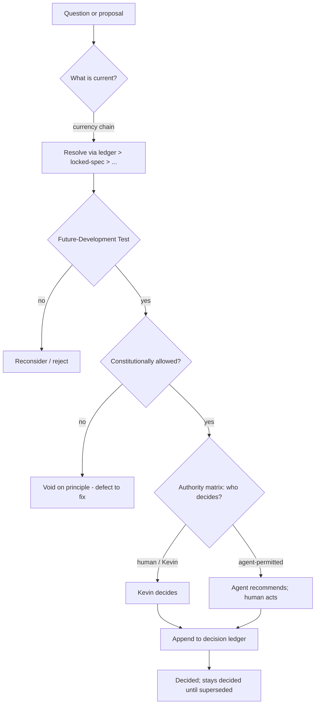

# MOMENTUM DECISION FRAMEWORK

## How Every Decision in Momentum Creation System V2 Is Made and Recorded

**Version:** 1.0.0
**Authority:** Subordinate to `constitution/MOMENTUM_CONSTITUTION.md`. Where this document conflicts with the Constitution, the Constitution wins.
**Constitutional Authority:** Kevin L. Gardner — sole and final
**Status:** Canonical (governance layer). Part of the integrated governance package awaiting ratification.

---

## Reconciliation Basis

Lifecycle stages:
1. **Audit / Inventory** — recorded in `MOMENTUM_CONSTITUTIONAL_RECONCILIATION_REPORT.md`.
2. **Reconciliation** — the two precedence orders (constitutional vs. operational-currency) were resolved into the dual-authority model.
3. **Gap Analysis (decision-specific):** decision-making existed only in fragments — the currency chain in `AGENTS.md`, the 10-point test in Founding Charter Article XXI, the decision ledger (`momentum.decisions`), and the agent lifecycle. No single instrument held “how is any decision made and recorded.” This document is that gap closed.
4. **Canonical + Cross-reference:** the ledger schema and currency chain are owned by the operational layer (`AGENTS.md`); this document governs their *use*, not their definition.

---

## §1 — Purpose

This document answers one question for every actor, human or agent: **how is a decision made here, who makes it, and how is it recorded so it never has to be re-litigated?** Its goal is to end re-explaining — a decided question, once recorded, stays decided until explicitly superseded.

---

## §2 — The Dual-Authority Model (operative)

Two layers, two questions. *(Principle stated in Constitution Article VI; applied here.)*

- **Constitutional layer — *whether / why*.** Tests a decision against people, momentum, clarity, trust, community, human authority, and compliance. Can veto on principle.
- **Operational layer — *what is currently true*.** Resolves which version is current and what is built.

**The reconciling rule, applied:** first ask the operational layer *what is current*; then ask the constitutional layer *whether it is allowed*. A change that is current can still be void. A change that is allowed in principle still isn't real until the operational layer says it shipped. Kevin sits above both.

---

## §3 — The Operational-Currency Chain

When sources disagree about *what is current*, this is the precedence, highest first:

> **decision ledger** (currency) > `docs/locked-spec.md` (state) > design docs > `docs/build-registry.md` > git log > Gateway chat registry > handoffs

Backed by three Mongo collections, queried via the Universal Gateway (never read by hand when a list is needed):
- `momentum.decisions` — the append-only decision ledger.
- `momentum.work_queue_leaves` — one row per wireframe leaf; pull next work by `{status, surface}` sorted by `seq`.
- `momentum.agent_status` — heartbeat per parallel-batch agent.

*(Definitions owned by `AGENTS.md` / `CLAUDE.md`. If a handoff conflicts with the chat registry, the registry wins and the handoff is evidence to reconcile.)*

---

## §4 — The Decision Ledger

The ledger is the **currency** of the system — the top of the chain — because it records what was decided, not merely what was built.

- **Append-only.** Decisions are never edited in place; a new decision supersedes an old one.
- **Resolve current state** with `{topic: X, status: "active"}`. Exactly one active decision per topic.
- **Supersession is explicit.** A superseding decision names the decision it replaces; the prior decision's status becomes `superseded`, never deleted.
- **Kevin corrections are audited overrides,** recorded as such — not silent edits.

---

## §5 — The Future-Development Test

Every proposed feature, agent, schema, surface, or instrument passes this gate (Constitution Article X; Founding Charter Article XXI). A “no” on any item sends the proposal back.

1. Does it create momentum?
2. Does it help people grow?
3. Does it strengthen community?
4. Does it increase clarity?
5. Does it support leadership development?
6. Does it simplify the user experience?
7. Does it align with Team Magnificent values?
8. Does it support long-term sustainability?
9. Does it preserve human-centered principles?
10. Does it contribute to transformation?

**Applying it:** the test is a *veto*, not a score. It does not rank proposals or produce a number — doing so would violate the no-scoring principle applied to ideas the way Article VII.1 applies it to people. It only answers: may this proceed, or must it be reconsidered?

---

## §6 — The Authority Matrix

Who may decide what. Every row terminates, ultimately, in Kevin's authority to override.

| Decision type | Proposes | Reviews | Decides |
|---|---|---|---|
| Constitutional amendment | any agent / human | Constitution & Governance | **Kevin (ratifies)** |
| Priority / sequencing | Program Direction | Executive Command | **Kevin** (Executive frames) |
| Architecture / contracts | Architect | Program Direction + QA | **Kevin** via ACR |
| Schema change | Architect / owner | Architecture + AI-impact + reporting | **Kevin** for major; technical owner for minor *(per `SCHEMA_GOVERNANCE.md`)* |
| Prompt change | prompt owner | Compliance + agent governance | owner for minor; **Kevin** for mission/safety-level *(per `AGENT_PROMPT_GOVERNANCE.md`)* |
| Compliance ruling | Compliance | Constitution & Governance | Compliance (block is binding); **Kevin** resolves disputes |
| Release gate | QA | Program Direction | QA may block on evidence; **Kevin** merges |
| Sponsor / placement override | — | audited | **Kevin only** |
| Code-mint / access codes | — | — | **Kevin only**, from `/admin` |

No agent appears in a “Decides” cell for anything that affects people, compliance, money, or external communication. Those are human, and ultimately Kevin's.

---

## §7 — The Kevin Override Model (operative)

- Kevin may override any agent, recommendation, instrument, or prior decision at any time.
- An override is recorded in the decision ledger as an audited override with rationale where given — never a silent change.
- An override changes a *decision*; it does not amend the Constitution. Constitutional change follows Article XII.
- No agent overrides Kevin, approves its own expansion, or treats its output as his approval.
- Sponsorship (e.g. a network-marketing upline) confers no decision authority over the application. No decision is routed past a sponsor.

---

## §8 — Escalation and Conflict Resolution

1. **Source conflict** — apply the currency chain (§3). If still unresolved, escalate.
2. **Principle conflict** — the constitutional layer vetoes; the change is a defect to fix.
3. **Two agents disagree** — preserve both rationales, auto-execute nothing, route to the right human.
4. **Anything affecting people / compliance / money / external comms** — escalate to Kevin.
5. **Uncertainty or missing evidence** — say what is missing; do not invent a conclusion.

---

## §9 — Decision Record Shape

Every durable decision carries: **topic · status** (`active` / `superseded`) **· source · context · alternatives considered · Kevin's answer · the active rule · superseded rules · implementation impact**. This shape is what lets a future session resolve “which version is current?” without re-asking Kevin.

---

## §10 — Decision Flow

---

## §11 — Cross-Reference

| For | See |
|---|---|
| The principle behind dual authority | `MOMENTUM_CONSTITUTION.md` Art. VI |
| Who staffs the authority matrix | `MOMENTUM_GOVERNANCE.md` |
| How the platform's shape changes | `MOMENTUM_ACR_SYSTEM.md` |
| Currency chain + ledger definitions | `AGENTS.md` / `CLAUDE.md` |
| Schema / prompt change approval detail | `SCHEMA_GOVERNANCE.md`, `AGENT_PROMPT_GOVERNANCE.md` |

*The Constitution Agent warns. Kevin decides.*
