# Momentum Knowledge Core

Generated: 2026-06-26

Minimum depth target: 150 pages. Actual page markers: 160.

---

## Page 001 - Knowledge Core Authority

# Momentum Knowledge Core

Generated: 2026-06-26

This document is the Knowledge Bible for Momentum. It defines the organizational memory system that allows Momentum to remember, retrieve, reason, learn, govern, and protect knowledge across humans, agents, workflows, products, and databases.

### Source Basis

- AGENTS.md
- docs/READ-ME-FIRST.md
- docs/AGENT-BRIEFING.md
- docs/locked-spec.md
- docs/build-registry.md
- docs/project-wireframe.md
- docs/graphrag-schema-contract.md
- docs/app-data-model-contract.md
- docs/UNIVERSAL_GATEWAY_V2_STANDARD.md
- MULTI_DB_AGENT_LEARNING_GOVERNANCE.md
- SCHEMA_GOVERNANCE.md
- AGENT_ARCHITECTURE.md
- AGENT_PROMPT_GOVERNANCE.md
- CRM_ARCHITECTURE.md
- PMV_ARCHITECTURE.md
- TRAINING_ARCHITECTURE.md
- docs/VM_LEAD_CAMPAIGN_MODULE_ARCHITECTURE.md

### Constitutional Rule

The knowledge system exists to serve people, preserve trust, support education, strengthen community, and create momentum. It is not a surveillance system, a pressure engine, a hidden scoring system, or a replacement for human judgment.

### Required Coverage

This core covers Postgres, Mongo, Neo4j, GraphRAG, Chroma, memory, learning, semantic retrieval, ingestion, aging, agent memory, organizational memory, success profiles, architecture memory, research memory, CRM memory, training memory, VM memory, PMV memory, testing memory, lessons learned, governance, synchronization, privacy, security, diagrams, data models, implementation guidance, Codex prompt, Claude prompt, and QA checklist.

---

## Page 002 - Executive Summary

Momentum memory is a coordinated system, not a pile of notes.

The system has four primary layers:

- Canonical operational memory: complete records in MongoDB.
- Relational memory: graph truth, lineage, and explanations in Neo4j.
- Semantic memory: searchable summaries and embeddings in ChromaDB.
- Relational/analytical SQL memory: Postgres for approved transactional, analytical, queue, or warehouse workloads where relational guarantees are required.

GraphRAG sits above those layers. It retrieves exact facts, semantic context, graph relationships, and governance constraints, then produces grounded answers, recommendations, or context packages.

The memory system succeeds when future agents stop re-asking documented facts, stop inventing gaps, stop splitting schemas, and can explain every important recommendation from evidence.

---

## Page 003 - Source Hierarchy

The knowledge system follows the active Momentum source hierarchy.

| Rank | Source | Authority |
|---:|---|---|
| 1 | Decision ledger | Active decisions and supersession |
| 2 | Locked spec | Authoritative state and constraints |
| 3 | Design documents | Surface design intent |
| 4 | Build registry and project wireframe | Build state and task decomposition |
| 5 | Code and schema contracts | Implemented behavior |
| 6 | Gateway chat registry and handoffs | Session identity and continuity |
| 7 | Semantic memory | Retrieval aid, never final truth |

When sources disagree, the higher source wins. Semantic retrieval may locate evidence, but it does not overrule canonical documents or database records.

---

## Page 004 - Memory Philosophy

### Purpose

Memory exists to reduce repeated explanation, preserve institutional learning, and help humans act with better context.

### Ownership

- what happened
- why it mattered
- what was decided
- what changed
- what should never be repeated

### Store Roles

- MongoDB for complete documents
- Neo4j for relationships and lineage
- ChromaDB for semantic retrieval
- Postgres only where relational workloads are explicitly approved

### Guardrails

- memory may not become pressure
- memory may not become human ranking
- memory may not replace current evidence
- memory may not hide uncertainty

### Required Outputs

- clear recall
- correct source precedence
- learning notes
- decision continuity

### Acceptance Standard

Memory Philosophy is acceptable only when a future agent can answer what was remembered, why it was remembered, where it came from, who may read it, when it expires or ages, and how to correct it without destroying audit history.

---

## Page 005 - Memory System Map

### End-to-End Memory Flow

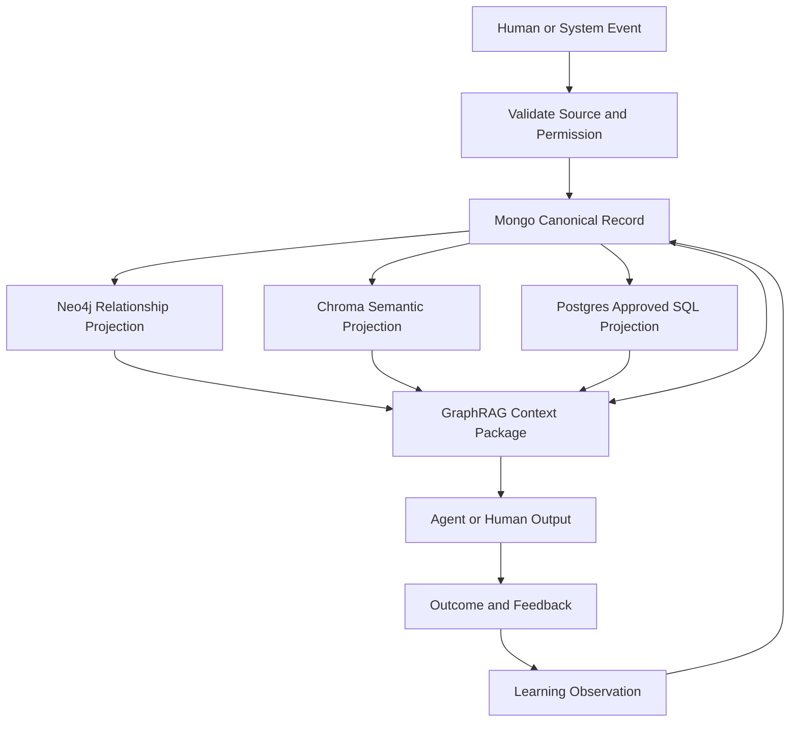

Every persistent memory path must define which stores receive writes, which store owns truth, and what happens when a projection fails.

---

## Page 006 - Database Role Charter

| Store | Role | Does Not Do |
|---|---|---|
| MongoDB | Complete canonical application and memory documents | Does not explain all graph paths by itself |
| Neo4j | Relationship truth, lineage, sponsor paths, recommendation evidence | Does not store full private documents |
| ChromaDB | Semantic retrieval over approved summaries and chunks | Does not decide truth or authority |
| Postgres | Approved relational workloads: reporting marts, queues, SQL analytics, outbox, migrations, transactional joins | Does not silently replace Mongo without decision |
| GraphRAG | Retrieval and reasoning orchestration over all stores | Does not invent unsupported facts |

The default Momentum application write remains Mongo-authoritative with Neo4j and Chroma projections governed by the app data-model contract. Universal Gateway memory writes use schema-enforced multi-store envelopes when available.

---

## Page 007 - Postgres Charter

### Purpose

Postgres is the approved relational layer for workloads that require SQL integrity, reporting joins, durable queues, materialized analytics, or warehouse-style read models.

### Ownership

- relational read models
- projection outbox
- reporting marts
- idempotent job locks
- analytics snapshots

### Store Roles

- Postgres for relational projections and durable job state
- MongoDB remains canonical unless a decision explicitly moves an entity
- Neo4j remains graph authority
- Chroma remains semantic memory

### Guardrails

- do not duplicate canonical app entities without projection metadata
- do not make Postgres the hidden source of truth
- do not store secrets in reporting tables
- do not bypass Mongo identity

### Required Outputs

- SQL reporting views
- projection retry state
- analytics tables
- migration verification reports

### Acceptance Standard

Postgres is acceptable only when a future agent can answer what was remembered, why it was remembered, where it came from, who may read it, when it expires or ages, and how to correct it without destroying audit history.

---

## Page 008 - Mongo Charter

### Purpose

MongoDB stores complete canonical records for Momentum operational entities and memory records.

### Ownership

- full documents
- write-time audit fields
- domain state
- entity lifecycle
- source references

### Store Roles

- MongoDB for canonical source of truth
- Neo4j for derived relationships
- ChromaDB for derived semantic summaries
- Postgres for approved SQL projections

### Guardrails

- verify critical inserts
- avoid duplicate collections for the same concept
- use canonical ids
- do not let optional projections silently disappear

### Required Outputs

- recoverable records
- auditable state
- projection source documents
- read models

### Acceptance Standard

MongoDB is acceptable only when a future agent can answer what was remembered, why it was remembered, where it came from, who may read it, when it expires or ages, and how to correct it without destroying audit history.

---

## Page 009 - Neo4j Charter

### Purpose

Neo4j stores relationship memory: sponsorship, lineage, evidence paths, recommendation causality, and knowledge graph structure.

### Ownership

- relationship truth
- graph paths
- lineage
- recommendation explanations
- entity connection maps

### Store Roles

- Neo4j for graph nodes and relationships
- MongoDB for complete documents
- ChromaDB for semantic chunks
- Postgres for SQL read models where approved

### Guardrails

- specific relationship names only
- no generic RELATED or CONNECTED_TO edges
- MATCH required pre-existing nodes where integrity depends on them
- do not invent graph paths

### Required Outputs

- explainable traversals
- lineage diagrams
- relationship constraints
- graph validation reports

### Acceptance Standard

Neo4j is acceptable only when a future agent can answer what was remembered, why it was remembered, where it came from, who may read it, when it expires or ages, and how to correct it without destroying audit history.

---

## Page 010 - Chroma Charter

### Purpose

ChromaDB stores semantic memory: embeddings, short summaries, chunks, and metadata that point back to canonical records.

### Ownership

- semantic similarity
- knowledge search
- summary retrieval
- embedding metadata

### Store Roles

- ChromaDB for vectors and summaries
- MongoDB for source documents
- Neo4j for relationships
- Postgres for approved SQL projections

### Guardrails

- never embed raw tokens
- never embed secrets
- never treat vector similarity as proof
- always carry source ids and privacy scope

### Required Outputs

- similar knowledge
- retrieval candidates
- source-linked chunks
- semantic gap reports

### Acceptance Standard

ChromaDB is acceptable only when a future agent can answer what was remembered, why it was remembered, where it came from, who may read it, when it expires or ages, and how to correct it without destroying audit history.

---

## Page 011 - GraphRAG Charter

### Purpose

GraphRAG turns exact lookup, graph expansion, semantic retrieval, and governance filters into grounded context packages.

### Ownership

- retrieval plan
- context assembly
- provenance package
- confidence and uncertainty notes

### Store Roles

- reads Mongo exact records
- reads Neo4j paths
- reads Chroma semantic chunks
- reads Postgres projections only when authorized

### Guardrails

- do not answer without evidence when evidence is required
- do not let stale semantic memory outrank current canonical state
- apply privacy and compliance filters before output
- state uncertainty

### Required Outputs

- grounded answer
- recommendation context
- source list
- graph path
- audit refs

### Acceptance Standard

GraphRAG is acceptable only when a future agent can answer what was remembered, why it was remembered, where it came from, who may read it, when it expires or ages, and how to correct it without destroying audit history.

---

## Page 012 - Unified Data Flow

### Canonical Write and Projection Flow

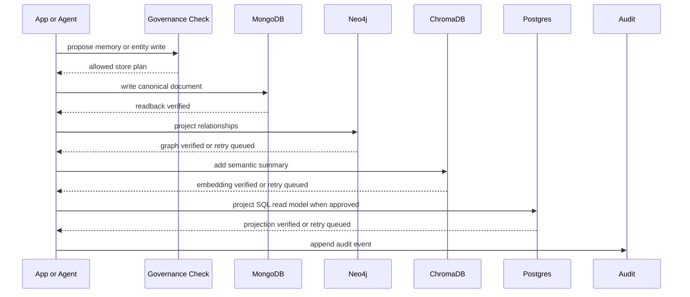

---

## Page 013 - Universal Memory Envelope

Every durable memory record should share a base envelope across stores.

```json
{
  "id": "canonical_id_shared_across_stores",
  "type": "decision | learning_note | document | chunk | agent_message | audit_event | recommendation",
  "schema_version": 1,
  "namespace": "momentum",
  "source": "codex | claude | app | gateway | import | human",
  "created_at": "2026-06-26T00:00:00.000Z",
  "title": "Human-readable title",
  "origin_kind": "chat | system | import | app",
  "chat_number": null,
  "job_id": null,
  "import_batch_id": null,
  "privacy_scope": "admin | sponsor | ba_private | prospect_safe | public",
  "evidence_refs": []
}
```

No new memory record may use ambiguous aliases such as date, timestamp, chat, synced_chat, or start_time when the canonical envelope field exists.

---

## Page 014 - Universal Knowledge ERD

### Knowledge ERD

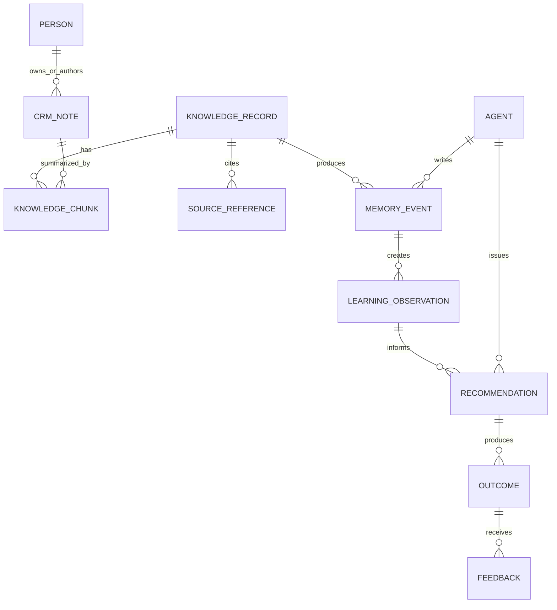

---

## Page 015 - Universal Graph Diagram

### Knowledge Graph

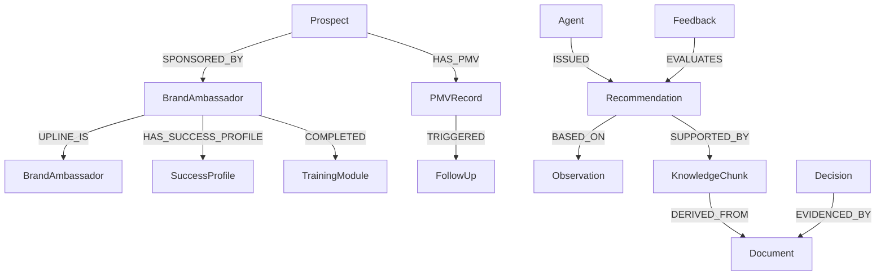

---

## Page 016 - GraphRAG Sequence

### GraphRAG Retrieval Sequence

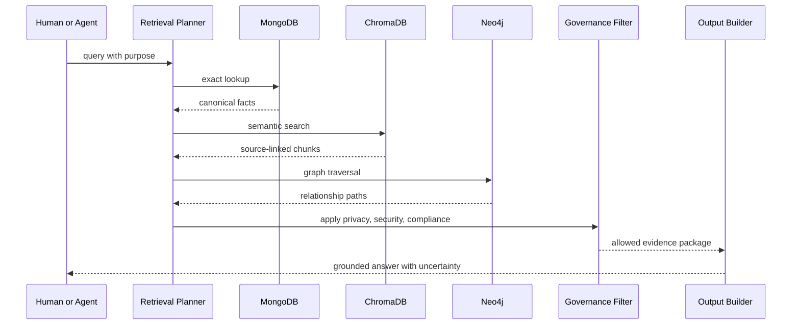

---

## Page 017 - Synchronization Model

Synchronization is a governed projection process, not best-effort hope.

### Sync Classes

| Class | Examples | Required Behavior |
|---|---|---|
| Graph-critical | BA sponsor edge, prospect sponsor edge, ownership correction | Mongo plus Neo4j must land together or rollback |
| Knowledge-critical | interviews, CRM notes, training summaries, learning notes | Mongo success, projection retry until Neo4j/Chroma land |
| Operational | reminders, callbacks, status ticks | Mongo success, projections retry without blocking user |
| Analytical | reports, dashboards, aggregate tables | Postgres or Mongo read model may lag with freshness metadata |

### Projection Outbox

```json
{
  "outbox_id": "projection_...",
  "source_store": "mongo",
  "source_collection": "crm_notes",
  "source_id": "note_...",
  "target_store": "chroma",
  "projection_type": "semantic_summary",
  "status": "pending | retrying | complete | failed",
  "attempts": 0,
  "next_attempt_at": "ISO-8601Z",
  "last_error": null,
  "created_at": "ISO-8601Z",
  "updated_at": "ISO-8601Z"
}
```

---

## Page 018 - Privacy Model

### Purpose

Privacy ensures personal context is used only for legitimate support, never pressure, surveillance, or broad exposure.

### Ownership

- privacy scope
- access purpose
- PII minimization
- redaction
- read audit

### Store Roles

- Mongo stores private records with scoped fields
- Neo4j stores relationship ids and necessary attributes
- Chroma stores redacted semantic summaries
- Postgres stores minimized reporting projections

### Guardrails

- do not embed secrets or raw tokens
- do not expose internal PMV tracking to prospects
- do not show sensitive notes outside scope
- do not use private context to pressure

### Required Outputs

- privacy-scoped context packages
- redacted prompts
- access logs
- export redaction plans

### Acceptance Standard

Privacy is acceptable only when a future agent can answer what was remembered, why it was remembered, where it came from, who may read it, when it expires or ages, and how to correct it without destroying audit history.

---

## Page 019 - Security Model

### Purpose

Security protects credentials, tokens, PII, memory integrity, and system trust.

### Ownership

- least privilege
- secret isolation
- token protection
- write audit
- permission enforcement

### Store Roles

- secrets outside repo and semantic memory
- tokens hashed or opaque where possible
- audit events in append-only stores
- access policies in canonical records

### Guardrails

- never write API keys to Chroma
- never log raw credentials
- never put magic links in semantic summaries
- never allow client override of sponsor or owner ids

### Required Outputs

- secure write paths
- permission checks
- audit logs
- incident records

### Acceptance Standard

Security is acceptable only when a future agent can answer what was remembered, why it was remembered, where it came from, who may read it, when it expires or ages, and how to correct it without destroying audit history.

---

## Page 020 - Knowledge Governance Model

### Purpose

Knowledge governance defines how facts become retrievable, versioned, superseded, corrected, and retired.

### Ownership

- source registration
- versioning
- supersession
- staleness review
- correction workflow

### Store Roles

- Mongo knowledge_records for full records
- Neo4j source and supersession graph
- Chroma source-linked summaries
- Postgres reporting if approved

### Guardrails

- do not delete superseded knowledge without explicit cleanup approval
- do not merge conflicting facts silently
- do not publish unsourced factual claims
- do not let stale memory outrank active decisions

### Required Outputs

- knowledge records
- source references
- staleness flags
- decision-linked facts

### Acceptance Standard

Knowledge Governance is acceptable only when a future agent can answer what was remembered, why it was remembered, where it came from, who may read it, when it expires or ages, and how to correct it without destroying audit history.

---

## Page 021 - Knowledge Ingestion

### Purpose

Captures documents, chats, transcripts, decisions, lessons, CRM notes, training content, PMV summaries, VM campaign records, and research into governed memory.

### Ownership

- canonical record identity
- evidence references
- retrieval metadata
- audit events

### Store Roles

- MongoDB for complete documents
- Neo4j for relationships and lineage
- ChromaDB for semantic retrieval
- Postgres only where relational workloads are explicitly approved

### Guardrails

- do not fabricate missing facts
- do not treat Chroma similarity as truth
- do not write private context without purpose
- do not bypass human authority

### Required Outputs

- source-backed context
- relationship paths
- semantic search results
- audit-ready memory records

### Acceptance Standard

Knowledge Ingestion is acceptable only when a future agent can answer what was remembered, why it was remembered, where it came from, who may read it, when it expires or ages, and how to correct it without destroying audit history.

---

## Page 022 - Document Ingestion

### Purpose

Preserves source files, page offsets, chunks, extracted entities, and provenance before semantic summarization.

### Ownership

- canonical record identity
- evidence references
- retrieval metadata
- audit events

### Store Roles

- MongoDB for complete documents
- Neo4j for relationships and lineage
- ChromaDB for semantic retrieval
- Postgres only where relational workloads are explicitly approved

### Guardrails

- do not fabricate missing facts
- do not treat Chroma similarity as truth
- do not write private context without purpose
- do not bypass human authority

### Required Outputs

- source-backed context
- relationship paths
- semantic search results
- audit-ready memory records

### Acceptance Standard

Document Ingestion is acceptable only when a future agent can answer what was remembered, why it was remembered, where it came from, who may read it, when it expires or ages, and how to correct it without destroying audit history.

---

## Page 023 - Conversation Ingestion

### Purpose

Registers chat identity, stores transcript chunks, links handoffs, extracts decisions, and marks uncertain numbering for reconciliation.

### Ownership

- canonical record identity
- evidence references
- retrieval metadata
- audit events

### Store Roles

- MongoDB for complete documents
- Neo4j for relationships and lineage
- ChromaDB for semantic retrieval
- Postgres only where relational workloads are explicitly approved

### Guardrails

- do not fabricate missing facts
- do not treat Chroma similarity as truth
- do not write private context without purpose
- do not bypass human authority

### Required Outputs

- source-backed context
- relationship paths
- semantic search results
- audit-ready memory records

### Acceptance Standard

Conversation Ingestion is acceptable only when a future agent can answer what was remembered, why it was remembered, where it came from, who may read it, when it expires or ages, and how to correct it without destroying audit history.

---

## Page 024 - Research Ingestion

### Purpose

Separates external source claims from interpretation and requires freshness checks for changing facts.

### Ownership

- canonical record identity
- evidence references
- retrieval metadata
- audit events

### Store Roles

- MongoDB for complete documents
- Neo4j for relationships and lineage
- ChromaDB for semantic retrieval
- Postgres only where relational workloads are explicitly approved

### Guardrails

- do not fabricate missing facts
- do not treat Chroma similarity as truth
- do not write private context without purpose
- do not bypass human authority

### Required Outputs

- source-backed context
- relationship paths
- semantic search results
- audit-ready memory records

### Acceptance Standard

Research Ingestion is acceptable only when a future agent can answer what was remembered, why it was remembered, where it came from, who may read it, when it expires or ages, and how to correct it without destroying audit history.

---

## Page 025 - CRM Ingestion

### Purpose

Turns relationship notes and follow-up outcomes into scoped memory without exposing private details broadly.

### Ownership

- canonical record identity
- evidence references
- retrieval metadata
- audit events

### Store Roles

- MongoDB for complete documents
- Neo4j for relationships and lineage
- ChromaDB for semantic retrieval
- Postgres only where relational workloads are explicitly approved

### Guardrails

- do not fabricate missing facts
- do not treat Chroma similarity as truth
- do not write private context without purpose
- do not bypass human authority

### Required Outputs

- source-backed context
- relationship paths
- semantic search results
- audit-ready memory records

### Acceptance Standard

CRM Ingestion is acceptable only when a future agent can answer what was remembered, why it was remembered, where it came from, who may read it, when it expires or ages, and how to correct it without destroying audit history.

---

## Page 026 - Training Ingestion

### Purpose

Connects modules, resources, completion, questions, and feedback to learning memory.

### Ownership

- canonical record identity
- evidence references
- retrieval metadata
- audit events

### Store Roles

- MongoDB for complete documents
- Neo4j for relationships and lineage
- ChromaDB for semantic retrieval
- Postgres only where relational workloads are explicitly approved

### Guardrails

- do not fabricate missing facts
- do not treat Chroma similarity as truth
- do not write private context without purpose
- do not bypass human authority

### Required Outputs

- source-backed context
- relationship paths
- semantic search results
- audit-ready memory records

### Acceptance Standard

Training Ingestion is acceptable only when a future agent can answer what was remembered, why it was remembered, where it came from, who may read it, when it expires or ages, and how to correct it without destroying audit history.

---

## Page 027 - PMV Ingestion

### Purpose

Summarizes prospect engagement as awareness, not qualification, and protects prospect-facing boundaries.

### Ownership

- canonical record identity
- evidence references
- retrieval metadata
- audit events

### Store Roles

- MongoDB for complete documents
- Neo4j for relationships and lineage
- ChromaDB for semantic retrieval
- Postgres only where relational workloads are explicitly approved

### Guardrails

- do not fabricate missing facts
- do not treat Chroma similarity as truth
- do not write private context without purpose
- do not bypass human authority

### Required Outputs

- source-backed context
- relationship paths
- semantic search results
- audit-ready memory records

### Acceptance Standard

PMV Ingestion is acceptable only when a future agent can answer what was remembered, why it was remembered, where it came from, who may read it, when it expires or ages, and how to correct it without destroying audit history.

---

## Page 028 - VM Ingestion

### Purpose

Imports lead batches, delivery events, activation, callbacks, and campaign outcomes with owner TM BA ID locked.

### Ownership

- canonical record identity
- evidence references
- retrieval metadata
- audit events

### Store Roles

- MongoDB for complete documents
- Neo4j for relationships and lineage
- ChromaDB for semantic retrieval
- Postgres only where relational workloads are explicitly approved

### Guardrails

- do not fabricate missing facts
- do not treat Chroma similarity as truth
- do not write private context without purpose
- do not bypass human authority

### Required Outputs

- source-backed context
- relationship paths
- semantic search results
- audit-ready memory records

### Acceptance Standard

VM Ingestion is acceptable only when a future agent can answer what was remembered, why it was remembered, where it came from, who may read it, when it expires or ages, and how to correct it without destroying audit history.

---

## Page 029 - Agent Output Ingestion

### Purpose

Stores recommendations, drafts, refusals, escalations, and outcomes with prompt version and evidence refs.

### Ownership

- canonical record identity
- evidence references
- retrieval metadata
- audit events

### Store Roles

- MongoDB for complete documents
- Neo4j for relationships and lineage
- ChromaDB for semantic retrieval
- Postgres only where relational workloads are explicitly approved

### Guardrails

- do not fabricate missing facts
- do not treat Chroma similarity as truth
- do not write private context without purpose
- do not bypass human authority

### Required Outputs

- source-backed context
- relationship paths
- semantic search results
- audit-ready memory records

### Acceptance Standard

Agent Output Ingestion is acceptable only when a future agent can answer what was remembered, why it was remembered, where it came from, who may read it, when it expires or ages, and how to correct it without destroying audit history.

---

## Page 030 - Knowledge Aging

### Purpose

Adds freshness, review intervals, supersession, confidence decay, and retirement without destroying audit history.

### Ownership

- canonical record identity
- evidence references
- retrieval metadata
- audit events

### Store Roles

- MongoDB for complete documents
- Neo4j for relationships and lineage
- ChromaDB for semantic retrieval
- Postgres only where relational workloads are explicitly approved

### Guardrails

- do not fabricate missing facts
- do not treat Chroma similarity as truth
- do not write private context without purpose
- do not bypass human authority

### Required Outputs

- source-backed context
- relationship paths
- semantic search results
- audit-ready memory records

### Acceptance Standard

Knowledge Aging is acceptable only when a future agent can answer what was remembered, why it was remembered, where it came from, who may read it, when it expires or ages, and how to correct it without destroying audit history.

---

## Page 031 - Semantic Retrieval

### Purpose

Uses embeddings to find similar context while resolving truth back to canonical stores.

### Ownership

- canonical record identity
- evidence references
- retrieval metadata
- audit events

### Store Roles

- MongoDB for complete documents
- Neo4j for relationships and lineage
- ChromaDB for semantic retrieval
- Postgres only where relational workloads are explicitly approved

### Guardrails

- do not fabricate missing facts
- do not treat Chroma similarity as truth
- do not write private context without purpose
- do not bypass human authority

### Required Outputs

- source-backed context
- relationship paths
- semantic search results
- audit-ready memory records

### Acceptance Standard

Semantic Retrieval is acceptable only when a future agent can answer what was remembered, why it was remembered, where it came from, who may read it, when it expires or ages, and how to correct it without destroying audit history.

---

## Page 032 - Exact Retrieval

### Purpose

Uses ids, statuses, decision topics, and source refs before broad semantic search.

### Ownership

- canonical record identity
- evidence references
- retrieval metadata
- audit events

### Store Roles

- MongoDB for complete documents
- Neo4j for relationships and lineage
- ChromaDB for semantic retrieval
- Postgres only where relational workloads are explicitly approved

### Guardrails

- do not fabricate missing facts
- do not treat Chroma similarity as truth
- do not write private context without purpose
- do not bypass human authority

### Required Outputs

- source-backed context
- relationship paths
- semantic search results
- audit-ready memory records

### Acceptance Standard

Exact Retrieval is acceptable only when a future agent can answer what was remembered, why it was remembered, where it came from, who may read it, when it expires or ages, and how to correct it without destroying audit history.

---

## Page 033 - Graph Retrieval

### Purpose

Uses Neo4j paths to explain why records are connected and how evidence supports recommendations.

### Ownership

- canonical record identity
- evidence references
- retrieval metadata
- audit events

### Store Roles

- MongoDB for complete documents
- Neo4j for relationships and lineage
- ChromaDB for semantic retrieval
- Postgres only where relational workloads are explicitly approved

### Guardrails

- do not fabricate missing facts
- do not treat Chroma similarity as truth
- do not write private context without purpose
- do not bypass human authority

### Required Outputs

- source-backed context
- relationship paths
- semantic search results
- audit-ready memory records

### Acceptance Standard

Graph Retrieval is acceptable only when a future agent can answer what was remembered, why it was remembered, where it came from, who may read it, when it expires or ages, and how to correct it without destroying audit history.

---

## Page 034 - Hybrid Retrieval

### Purpose

Combines exact, semantic, graph, and governance filters into a single GraphRAG package.

### Ownership

- canonical record identity
- evidence references
- retrieval metadata
- audit events

### Store Roles

- MongoDB for complete documents
- Neo4j for relationships and lineage
- ChromaDB for semantic retrieval
- Postgres only where relational workloads are explicitly approved

### Guardrails

- do not fabricate missing facts
- do not treat Chroma similarity as truth
- do not write private context without purpose
- do not bypass human authority

### Required Outputs

- source-backed context
- relationship paths
- semantic search results
- audit-ready memory records

### Acceptance Standard

Hybrid Retrieval is acceptable only when a future agent can answer what was remembered, why it was remembered, where it came from, who may read it, when it expires or ages, and how to correct it without destroying audit history.

---

## Page 035 - Memory Correction

### Purpose

Allows humans to correct memory by appending a correction and supersession edge, never by erasing history.

### Ownership

- canonical record identity
- evidence references
- retrieval metadata
- audit events

### Store Roles

- MongoDB for complete documents
- Neo4j for relationships and lineage
- ChromaDB for semantic retrieval
- Postgres only where relational workloads are explicitly approved

### Guardrails

- do not fabricate missing facts
- do not treat Chroma similarity as truth
- do not write private context without purpose
- do not bypass human authority

### Required Outputs

- source-backed context
- relationship paths
- semantic search results
- audit-ready memory records

### Acceptance Standard

Memory Correction is acceptable only when a future agent can answer what was remembered, why it was remembered, where it came from, who may read it, when it expires or ages, and how to correct it without destroying audit history.

---

## Page 036 - Lessons Learned

### Purpose

Turns Kevin corrections, failures, and process findings into high-priority future retrieval.

### Ownership

- canonical record identity
- evidence references
- retrieval metadata
- audit events

### Store Roles

- MongoDB for complete documents
- Neo4j for relationships and lineage
- ChromaDB for semantic retrieval
- Postgres only where relational workloads are explicitly approved

### Guardrails

- do not fabricate missing facts
- do not treat Chroma similarity as truth
- do not write private context without purpose
- do not bypass human authority

### Required Outputs

- source-backed context
- relationship paths
- semantic search results
- audit-ready memory records

### Acceptance Standard

Lessons Learned is acceptable only when a future agent can answer what was remembered, why it was remembered, where it came from, who may read it, when it expires or ages, and how to correct it without destroying audit history.

---

## Page 037 - Decision Memory

### Purpose

Stores active decisions, superseded decisions, evidence, and effects on schemas, prompts, and workflows.

### Ownership

- canonical record identity
- evidence references
- retrieval metadata
- audit events

### Store Roles

- MongoDB for complete documents
- Neo4j for relationships and lineage
- ChromaDB for semantic retrieval
- Postgres only where relational workloads are explicitly approved

### Guardrails

- do not fabricate missing facts
- do not treat Chroma similarity as truth
- do not write private context without purpose
- do not bypass human authority

### Required Outputs

- source-backed context
- relationship paths
- semantic search results
- audit-ready memory records

### Acceptance Standard

Decision Memory is acceptable only when a future agent can answer what was remembered, why it was remembered, where it came from, who may read it, when it expires or ages, and how to correct it without destroying audit history.

---

## Page 038 - Architecture Memory

### Purpose

Remembers system boundaries, data models, decisions, drift items, and implementation contracts.

### Ownership

- canonical record identity
- evidence references
- retrieval metadata
- audit events

### Store Roles

- MongoDB for complete documents
- Neo4j for relationships and lineage
- ChromaDB for semantic retrieval
- Postgres only where relational workloads are explicitly approved

### Guardrails

- do not fabricate missing facts
- do not treat Chroma similarity as truth
- do not write private context without purpose
- do not bypass human authority

### Required Outputs

- source-backed context
- relationship paths
- semantic search results
- audit-ready memory records

### Acceptance Standard

Architecture Memory is acceptable only when a future agent can answer what was remembered, why it was remembered, where it came from, who may read it, when it expires or ages, and how to correct it without destroying audit history.

---

## Page 039 - Schema Memory

### Purpose

Keeps canonical schemas, owners, versions, migrations, and affected agents discoverable.

### Ownership

- canonical record identity
- evidence references
- retrieval metadata
- audit events

### Store Roles

- MongoDB for complete documents
- Neo4j for relationships and lineage
- ChromaDB for semantic retrieval
- Postgres only where relational workloads are explicitly approved

### Guardrails

- do not fabricate missing facts
- do not treat Chroma similarity as truth
- do not write private context without purpose
- do not bypass human authority

### Required Outputs

- source-backed context
- relationship paths
- semantic search results
- audit-ready memory records

### Acceptance Standard

Schema Memory is acceptable only when a future agent can answer what was remembered, why it was remembered, where it came from, who may read it, when it expires or ages, and how to correct it without destroying audit history.

---

## Page 040 - Prompt Memory

### Purpose

Stores prompt registry, versions, tests, drift findings, rollbacks, and source documents.

### Ownership

- canonical record identity
- evidence references
- retrieval metadata
- audit events

### Store Roles

- MongoDB for complete documents
- Neo4j for relationships and lineage
- ChromaDB for semantic retrieval
- Postgres only where relational workloads are explicitly approved

### Guardrails

- do not fabricate missing facts
- do not treat Chroma similarity as truth
- do not write private context without purpose
- do not bypass human authority

### Required Outputs

- source-backed context
- relationship paths
- semantic search results
- audit-ready memory records

### Acceptance Standard

Prompt Memory is acceptable only when a future agent can answer what was remembered, why it was remembered, where it came from, who may read it, when it expires or ages, and how to correct it without destroying audit history.

---

## Page 041 - Agent Memory

### Purpose

Stores agent missions, permissions, observations, recommendations, outcomes, and feedback.

### Ownership

- canonical record identity
- evidence references
- retrieval metadata
- audit events

### Store Roles

- MongoDB for complete documents
- Neo4j for relationships and lineage
- ChromaDB for semantic retrieval
- Postgres only where relational workloads are explicitly approved

### Guardrails

- do not fabricate missing facts
- do not treat Chroma similarity as truth
- do not write private context without purpose
- do not bypass human authority

### Required Outputs

- source-backed context
- relationship paths
- semantic search results
- audit-ready memory records

### Acceptance Standard

Agent Memory is acceptable only when a future agent can answer what was remembered, why it was remembered, where it came from, who may read it, when it expires or ages, and how to correct it without destroying audit history.

---

## Page 042 - Organizational Memory

### Purpose

Stores how Momentum operates: principles, departments, roles, workflows, governance, and source hierarchy.

### Ownership

- canonical record identity
- evidence references
- retrieval metadata
- audit events

### Store Roles

- MongoDB for complete documents
- Neo4j for relationships and lineage
- ChromaDB for semantic retrieval
- Postgres only where relational workloads are explicitly approved

### Guardrails

- do not fabricate missing facts
- do not treat Chroma similarity as truth
- do not write private context without purpose
- do not bypass human authority

### Required Outputs

- source-backed context
- relationship paths
- semantic search results
- audit-ready memory records

### Acceptance Standard

Organizational Memory is acceptable only when a future agent can answer what was remembered, why it was remembered, where it came from, who may read it, when it expires or ages, and how to correct it without destroying audit history.

---

## Page 043 - Success Profile Memory

### Purpose

Stores Steve-created non-scored support context from the BA's own answers.

### Ownership

- canonical record identity
- evidence references
- retrieval metadata
- audit events

### Store Roles

- MongoDB for complete documents
- Neo4j for relationships and lineage
- ChromaDB for semantic retrieval
- Postgres only where relational workloads are explicitly approved

### Guardrails

- do not fabricate missing facts
- do not treat Chroma similarity as truth
- do not write private context without purpose
- do not bypass human authority

### Required Outputs

- source-backed context
- relationship paths
- semantic search results
- audit-ready memory records

### Acceptance Standard

Success Profile Memory is acceptable only when a future agent can answer what was remembered, why it was remembered, where it came from, who may read it, when it expires or ages, and how to correct it without destroying audit history.

---

## Page 044 - CRM Memory

### Purpose

Stores relationship context, notes, timelines, follow-ups, outcomes, and support signals.

### Ownership

- canonical record identity
- evidence references
- retrieval metadata
- audit events

### Store Roles

- MongoDB for complete documents
- Neo4j for relationships and lineage
- ChromaDB for semantic retrieval
- Postgres only where relational workloads are explicitly approved

### Guardrails

- do not fabricate missing facts
- do not treat Chroma similarity as truth
- do not write private context without purpose
- do not bypass human authority

### Required Outputs

- source-backed context
- relationship paths
- semantic search results
- audit-ready memory records

### Acceptance Standard

CRM Memory is acceptable only when a future agent can answer what was remembered, why it was remembered, where it came from, who may read it, when it expires or ages, and how to correct it without destroying audit history.

---

## Page 045 - Training Memory

### Purpose

Stores learning progress, questions, resource usefulness, and confidence-support context.

### Ownership

- canonical record identity
- evidence references
- retrieval metadata
- audit events

### Store Roles

- MongoDB for complete documents
- Neo4j for relationships and lineage
- ChromaDB for semantic retrieval
- Postgres only where relational workloads are explicitly approved

### Guardrails

- do not fabricate missing facts
- do not treat Chroma similarity as truth
- do not write private context without purpose
- do not bypass human authority

### Required Outputs

- source-backed context
- relationship paths
- semantic search results
- audit-ready memory records

### Acceptance Standard

Training Memory is acceptable only when a future agent can answer what was remembered, why it was remembered, where it came from, who may read it, when it expires or ages, and how to correct it without destroying audit history.

---

## Page 046 - PMV Memory

### Purpose

Stores prospect journey summaries and engagement awareness without pressure framing.

### Ownership

- canonical record identity
- evidence references
- retrieval metadata
- audit events

### Store Roles

- MongoDB for complete documents
- Neo4j for relationships and lineage
- ChromaDB for semantic retrieval
- Postgres only where relational workloads are explicitly approved

### Guardrails

- do not fabricate missing facts
- do not treat Chroma similarity as truth
- do not write private context without purpose
- do not bypass human authority

### Required Outputs

- source-backed context
- relationship paths
- semantic search results
- audit-ready memory records

### Acceptance Standard

PMV Memory is acceptable only when a future agent can answer what was remembered, why it was remembered, where it came from, who may read it, when it expires or ages, and how to correct it without destroying audit history.

---

## Page 047 - VM Memory

### Purpose

Stores lead-batch, campaign, delivery, activation, suppression, callback, and ownership lineage.

### Ownership

- canonical record identity
- evidence references
- retrieval metadata
- audit events

### Store Roles

- MongoDB for complete documents
- Neo4j for relationships and lineage
- ChromaDB for semantic retrieval
- Postgres only where relational workloads are explicitly approved

### Guardrails

- do not fabricate missing facts
- do not treat Chroma similarity as truth
- do not write private context without purpose
- do not bypass human authority

### Required Outputs

- source-backed context
- relationship paths
- semantic search results
- audit-ready memory records

### Acceptance Standard

VM Memory is acceptable only when a future agent can answer what was remembered, why it was remembered, where it came from, who may read it, when it expires or ages, and how to correct it without destroying audit history.

---

## Page 048 - Testing Memory

### Purpose

Stores test plans, verification evidence, failures, screenshots, logs, and release gates.

### Ownership

- canonical record identity
- evidence references
- retrieval metadata
- audit events

### Store Roles

- MongoDB for complete documents
- Neo4j for relationships and lineage
- ChromaDB for semantic retrieval
- Postgres only where relational workloads are explicitly approved

### Guardrails

- do not fabricate missing facts
- do not treat Chroma similarity as truth
- do not write private context without purpose
- do not bypass human authority

### Required Outputs

- source-backed context
- relationship paths
- semantic search results
- audit-ready memory records

### Acceptance Standard

Testing Memory is acceptable only when a future agent can answer what was remembered, why it was remembered, where it came from, who may read it, when it expires or ages, and how to correct it without destroying audit history.

---

## Page 049 - Research Memory

### Purpose

Stores source-backed briefs, evidence packages, uncertainty flags, and stale-source reviews.

### Ownership

- canonical record identity
- evidence references
- retrieval metadata
- audit events

### Store Roles

- MongoDB for complete documents
- Neo4j for relationships and lineage
- ChromaDB for semantic retrieval
- Postgres only where relational workloads are explicitly approved

### Guardrails

- do not fabricate missing facts
- do not treat Chroma similarity as truth
- do not write private context without purpose
- do not bypass human authority

### Required Outputs

- source-backed context
- relationship paths
- semantic search results
- audit-ready memory records

### Acceptance Standard

Research Memory is acceptable only when a future agent can answer what was remembered, why it was remembered, where it came from, who may read it, when it expires or ages, and how to correct it without destroying audit history.

---

## Page 050 - Compliance Memory

### Purpose

Stores approved wording, blocked wording, rule rationale, review decisions, and escalations.

### Ownership

- canonical record identity
- evidence references
- retrieval metadata
- audit events

### Store Roles

- MongoDB for complete documents
- Neo4j for relationships and lineage
- ChromaDB for semantic retrieval
- Postgres only where relational workloads are explicitly approved

### Guardrails

- do not fabricate missing facts
- do not treat Chroma similarity as truth
- do not write private context without purpose
- do not bypass human authority

### Required Outputs

- source-backed context
- relationship paths
- semantic search results
- audit-ready memory records

### Acceptance Standard

Compliance Memory is acceptable only when a future agent can answer what was remembered, why it was remembered, where it came from, who may read it, when it expires or ages, and how to correct it without destroying audit history.

---

## Page 051 - Privacy Memory

### Purpose

Stores privacy policies, consent boundaries, access scopes, and redaction rules.

### Ownership

- canonical record identity
- evidence references
- retrieval metadata
- audit events

### Store Roles

- MongoDB for complete documents
- Neo4j for relationships and lineage
- ChromaDB for semantic retrieval
- Postgres only where relational workloads are explicitly approved

### Guardrails

- do not fabricate missing facts
- do not treat Chroma similarity as truth
- do not write private context without purpose
- do not bypass human authority

### Required Outputs

- source-backed context
- relationship paths
- semantic search results
- audit-ready memory records

### Acceptance Standard

Privacy Memory is acceptable only when a future agent can answer what was remembered, why it was remembered, where it came from, who may read it, when it expires or ages, and how to correct it without destroying audit history.

---

## Page 052 - Security Memory

### Purpose

Stores security policies, incidents, token handling rules, and secret boundaries.

### Ownership

- canonical record identity
- evidence references
- retrieval metadata
- audit events

### Store Roles

- MongoDB for complete documents
- Neo4j for relationships and lineage
- ChromaDB for semantic retrieval
- Postgres only where relational workloads are explicitly approved

### Guardrails

- do not fabricate missing facts
- do not treat Chroma similarity as truth
- do not write private context without purpose
- do not bypass human authority

### Required Outputs

- source-backed context
- relationship paths
- semantic search results
- audit-ready memory records

### Acceptance Standard

Security Memory is acceptable only when a future agent can answer what was remembered, why it was remembered, where it came from, who may read it, when it expires or ages, and how to correct it without destroying audit history.

---

## Page 053 - Synchronization Memory

### Purpose

Stores projection status, retry history, partial write alerts, and repair outcomes.

### Ownership

- canonical record identity
- evidence references
- retrieval metadata
- audit events

### Store Roles

- MongoDB for complete documents
- Neo4j for relationships and lineage
- ChromaDB for semantic retrieval
- Postgres only where relational workloads are explicitly approved

### Guardrails

- do not fabricate missing facts
- do not treat Chroma similarity as truth
- do not write private context without purpose
- do not bypass human authority

### Required Outputs

- source-backed context
- relationship paths
- semantic search results
- audit-ready memory records

### Acceptance Standard

Synchronization Memory is acceptable only when a future agent can answer what was remembered, why it was remembered, where it came from, who may read it, when it expires or ages, and how to correct it without destroying audit history.

---

## Page 054 - Audit Memory

### Purpose

Stores append-only event evidence for critical actions and governance changes.

### Ownership

- canonical record identity
- evidence references
- retrieval metadata
- audit events

### Store Roles

- MongoDB for complete documents
- Neo4j for relationships and lineage
- ChromaDB for semantic retrieval
- Postgres only where relational workloads are explicitly approved

### Guardrails

- do not fabricate missing facts
- do not treat Chroma similarity as truth
- do not write private context without purpose
- do not bypass human authority

### Required Outputs

- source-backed context
- relationship paths
- semantic search results
- audit-ready memory records

### Acceptance Standard

Audit Memory is acceptable only when a future agent can answer what was remembered, why it was remembered, where it came from, who may read it, when it expires or ages, and how to correct it without destroying audit history.

---

## Page 055 - Postgres Memory

### Purpose

Stores relational projections, outbox tables, SQL analytics, and reporting marts by explicit decision.

### Ownership

- canonical record identity
- evidence references
- retrieval metadata
- audit events

### Store Roles

- MongoDB for complete documents
- Neo4j for relationships and lineage
- ChromaDB for semantic retrieval
- Postgres only where relational workloads are explicitly approved

### Guardrails

- do not fabricate missing facts
- do not treat Chroma similarity as truth
- do not write private context without purpose
- do not bypass human authority

### Required Outputs

- source-backed context
- relationship paths
- semantic search results
- audit-ready memory records

### Acceptance Standard

Postgres Memory is acceptable only when a future agent can answer what was remembered, why it was remembered, where it came from, who may read it, when it expires or ages, and how to correct it without destroying audit history.

---

## Page 056 - Mongo Memory

### Purpose

Stores complete canonical records and full history for operational and memory entities.

### Ownership

- canonical record identity
- evidence references
- retrieval metadata
- audit events

### Store Roles

- MongoDB for complete documents
- Neo4j for relationships and lineage
- ChromaDB for semantic retrieval
- Postgres only where relational workloads are explicitly approved

### Guardrails

- do not fabricate missing facts
- do not treat Chroma similarity as truth
- do not write private context without purpose
- do not bypass human authority

### Required Outputs

- source-backed context
- relationship paths
- semantic search results
- audit-ready memory records

### Acceptance Standard

Mongo Memory is acceptable only when a future agent can answer what was remembered, why it was remembered, where it came from, who may read it, when it expires or ages, and how to correct it without destroying audit history.

---

## Page 057 - Neo4j Memory

### Purpose

Stores the relationship layer needed for explainable GraphRAG and lineage.

### Ownership

- canonical record identity
- evidence references
- retrieval metadata
- audit events

### Store Roles

- MongoDB for complete documents
- Neo4j for relationships and lineage
- ChromaDB for semantic retrieval
- Postgres only where relational workloads are explicitly approved

### Guardrails

- do not fabricate missing facts
- do not treat Chroma similarity as truth
- do not write private context without purpose
- do not bypass human authority

### Required Outputs

- source-backed context
- relationship paths
- semantic search results
- audit-ready memory records

### Acceptance Standard

Neo4j Memory is acceptable only when a future agent can answer what was remembered, why it was remembered, where it came from, who may read it, when it expires or ages, and how to correct it without destroying audit history.

---

## Page 058 - Chroma Memory

### Purpose

Stores semantic chunks and retrieval metadata with source references.

### Ownership

- canonical record identity
- evidence references
- retrieval metadata
- audit events

### Store Roles

- MongoDB for complete documents
- Neo4j for relationships and lineage
- ChromaDB for semantic retrieval
- Postgres only where relational workloads are explicitly approved

### Guardrails

- do not fabricate missing facts
- do not treat Chroma similarity as truth
- do not write private context without purpose
- do not bypass human authority

### Required Outputs

- source-backed context
- relationship paths
- semantic search results
- audit-ready memory records

### Acceptance Standard

Chroma Memory is acceptable only when a future agent can answer what was remembered, why it was remembered, where it came from, who may read it, when it expires or ages, and how to correct it without destroying audit history.

---

## Page 059 - GraphRAG Memory

### Purpose

Stores retrieval packages, evidence paths, and context assembly logs.

### Ownership

- canonical record identity
- evidence references
- retrieval metadata
- audit events

### Store Roles

- MongoDB for complete documents
- Neo4j for relationships and lineage
- ChromaDB for semantic retrieval
- Postgres only where relational workloads are explicitly approved

### Guardrails

- do not fabricate missing facts
- do not treat Chroma similarity as truth
- do not write private context without purpose
- do not bypass human authority

### Required Outputs

- source-backed context
- relationship paths
- semantic search results
- audit-ready memory records

### Acceptance Standard

GraphRAG Memory is acceptable only when a future agent can answer what was remembered, why it was remembered, where it came from, who may read it, when it expires or ages, and how to correct it without destroying audit history.

---

## Page 060 - Knowledge Gap Memory

### Purpose

Stores missing-source findings and the workflow needed to close them.

### Ownership

- canonical record identity
- evidence references
- retrieval metadata
- audit events

### Store Roles

- MongoDB for complete documents
- Neo4j for relationships and lineage
- ChromaDB for semantic retrieval
- Postgres only where relational workloads are explicitly approved

### Guardrails

- do not fabricate missing facts
- do not treat Chroma similarity as truth
- do not write private context without purpose
- do not bypass human authority

### Required Outputs

- source-backed context
- relationship paths
- semantic search results
- audit-ready memory records

### Acceptance Standard

Knowledge Gap Memory is acceptable only when a future agent can answer what was remembered, why it was remembered, where it came from, who may read it, when it expires or ages, and how to correct it without destroying audit history.

---

## Page 061 - Stale Knowledge Memory

### Purpose

Stores review due dates, freshness status, and replacement candidates.

### Ownership

- canonical record identity
- evidence references
- retrieval metadata
- audit events

### Store Roles

- MongoDB for complete documents
- Neo4j for relationships and lineage
- ChromaDB for semantic retrieval
- Postgres only where relational workloads are explicitly approved

### Guardrails

- do not fabricate missing facts
- do not treat Chroma similarity as truth
- do not write private context without purpose
- do not bypass human authority

### Required Outputs

- source-backed context
- relationship paths
- semantic search results
- audit-ready memory records

### Acceptance Standard

Stale Knowledge Memory is acceptable only when a future agent can answer what was remembered, why it was remembered, where it came from, who may read it, when it expires or ages, and how to correct it without destroying audit history.

---

## Page 062 - Source Conflict Memory

### Purpose

Stores conflicts between documents, code, decisions, and handoffs.

### Ownership

- canonical record identity
- evidence references
- retrieval metadata
- audit events

### Store Roles

- MongoDB for complete documents
- Neo4j for relationships and lineage
- ChromaDB for semantic retrieval
- Postgres only where relational workloads are explicitly approved

### Guardrails

- do not fabricate missing facts
- do not treat Chroma similarity as truth
- do not write private context without purpose
- do not bypass human authority

### Required Outputs

- source-backed context
- relationship paths
- semantic search results
- audit-ready memory records

### Acceptance Standard

Source Conflict Memory is acceptable only when a future agent can answer what was remembered, why it was remembered, where it came from, who may read it, when it expires or ages, and how to correct it without destroying audit history.

---

## Page 063 - Handoff Memory

### Purpose

Stores session continuity summaries linked to chat registry identity.

### Ownership

- canonical record identity
- evidence references
- retrieval metadata
- audit events

### Store Roles

- MongoDB for complete documents
- Neo4j for relationships and lineage
- ChromaDB for semantic retrieval
- Postgres only where relational workloads are explicitly approved

### Guardrails

- do not fabricate missing facts
- do not treat Chroma similarity as truth
- do not write private context without purpose
- do not bypass human authority

### Required Outputs

- source-backed context
- relationship paths
- semantic search results
- audit-ready memory records

### Acceptance Standard

Handoff Memory is acceptable only when a future agent can answer what was remembered, why it was remembered, where it came from, who may read it, when it expires or ages, and how to correct it without destroying audit history.

---

## Page 064 - Intervector Memory

### Purpose

Stores agent-to-agent messages, replies, statuses, and read/action audit.

### Ownership

- canonical record identity
- evidence references
- retrieval metadata
- audit events

### Store Roles

- MongoDB for complete documents
- Neo4j for relationships and lineage
- ChromaDB for semantic retrieval
- Postgres only where relational workloads are explicitly approved

### Guardrails

- do not fabricate missing facts
- do not treat Chroma similarity as truth
- do not write private context without purpose
- do not bypass human authority

### Required Outputs

- source-backed context
- relationship paths
- semantic search results
- audit-ready memory records

### Acceptance Standard

Intervector Memory is acceptable only when a future agent can answer what was remembered, why it was remembered, where it came from, who may read it, when it expires or ages, and how to correct it without destroying audit history.

---

## Page 065 - Operational Memory

### Purpose

Stores live ops, service health, ports, runbooks, and incident response context.

### Ownership

- canonical record identity
- evidence references
- retrieval metadata
- audit events

### Store Roles

- MongoDB for complete documents
- Neo4j for relationships and lineage
- ChromaDB for semantic retrieval
- Postgres only where relational workloads are explicitly approved

### Guardrails

- do not fabricate missing facts
- do not treat Chroma similarity as truth
- do not write private context without purpose
- do not bypass human authority

### Required Outputs

- source-backed context
- relationship paths
- semantic search results
- audit-ready memory records

### Acceptance Standard

Operational Memory is acceptable only when a future agent can answer what was remembered, why it was remembered, where it came from, who may read it, when it expires or ages, and how to correct it without destroying audit history.

---

## Page 066 - Release Memory

### Purpose

Stores shipped artifacts, build registry updates, QA gates, and deployment results.

### Ownership

- canonical record identity
- evidence references
- retrieval metadata
- audit events

### Store Roles

- MongoDB for complete documents
- Neo4j for relationships and lineage
- ChromaDB for semantic retrieval
- Postgres only where relational workloads are explicitly approved

### Guardrails

- do not fabricate missing facts
- do not treat Chroma similarity as truth
- do not write private context without purpose
- do not bypass human authority

### Required Outputs

- source-backed context
- relationship paths
- semantic search results
- audit-ready memory records

### Acceptance Standard

Release Memory is acceptable only when a future agent can answer what was remembered, why it was remembered, where it came from, who may read it, when it expires or ages, and how to correct it without destroying audit history.

---

## Page 067 - Support Memory

### Purpose

Stores customer support friction, resolutions, recurring issues, and helpful resources.

### Ownership

- canonical record identity
- evidence references
- retrieval metadata
- audit events

### Store Roles

- MongoDB for complete documents
- Neo4j for relationships and lineage
- ChromaDB for semantic retrieval
- Postgres only where relational workloads are explicitly approved

### Guardrails

- do not fabricate missing facts
- do not treat Chroma similarity as truth
- do not write private context without purpose
- do not bypass human authority

### Required Outputs

- source-backed context
- relationship paths
- semantic search results
- audit-ready memory records

### Acceptance Standard

Support Memory is acceptable only when a future agent can answer what was remembered, why it was remembered, where it came from, who may read it, when it expires or ages, and how to correct it without destroying audit history.

---

## Page 068 - Community Memory

### Purpose

Stores participation, recognition opportunities, events, and belonging support without comparison pressure.

### Ownership

- canonical record identity
- evidence references
- retrieval metadata
- audit events

### Store Roles

- MongoDB for complete documents
- Neo4j for relationships and lineage
- ChromaDB for semantic retrieval
- Postgres only where relational workloads are explicitly approved

### Guardrails

- do not fabricate missing facts
- do not treat Chroma similarity as truth
- do not write private context without purpose
- do not bypass human authority

### Required Outputs

- source-backed context
- relationship paths
- semantic search results
- audit-ready memory records

### Acceptance Standard

Community Memory is acceptable only when a future agent can answer what was remembered, why it was remembered, where it came from, who may read it, when it expires or ages, and how to correct it without destroying audit history.

---

## Page 069 - Event Memory

### Purpose

Stores event catalog, attendance, feedback, reminders, and post-event follow-up context.

### Ownership

- canonical record identity
- evidence references
- retrieval metadata
- audit events

### Store Roles

- MongoDB for complete documents
- Neo4j for relationships and lineage
- ChromaDB for semantic retrieval
- Postgres only where relational workloads are explicitly approved

### Guardrails

- do not fabricate missing facts
- do not treat Chroma similarity as truth
- do not write private context without purpose
- do not bypass human authority

### Required Outputs

- source-backed context
- relationship paths
- semantic search results
- audit-ready memory records

### Acceptance Standard

Event Memory is acceptable only when a future agent can answer what was remembered, why it was remembered, where it came from, who may read it, when it expires or ages, and how to correct it without destroying audit history.

---

## Page 070 - Launch Memory

### Purpose

Stores launch stages, first actions, sponsor support, and daily momentum context.

### Ownership

- canonical record identity
- evidence references
- retrieval metadata
- audit events

### Store Roles

- MongoDB for complete documents
- Neo4j for relationships and lineage
- ChromaDB for semantic retrieval
- Postgres only where relational workloads are explicitly approved

### Guardrails

- do not fabricate missing facts
- do not treat Chroma similarity as truth
- do not write private context without purpose
- do not bypass human authority

### Required Outputs

- source-backed context
- relationship paths
- semantic search results
- audit-ready memory records

### Acceptance Standard

Launch Memory is acceptable only when a future agent can answer what was remembered, why it was remembered, where it came from, who may read it, when it expires or ages, and how to correct it without destroying audit history.

---

## Page 071 - Orientation Memory

### Purpose

Stores orientation scheduling, attendance, completion, and support questions.

### Ownership

- canonical record identity
- evidence references
- retrieval metadata
- audit events

### Store Roles

- MongoDB for complete documents
- Neo4j for relationships and lineage
- ChromaDB for semantic retrieval
- Postgres only where relational workloads are explicitly approved

### Guardrails

- do not fabricate missing facts
- do not treat Chroma similarity as truth
- do not write private context without purpose
- do not bypass human authority

### Required Outputs

- source-backed context
- relationship paths
- semantic search results
- audit-ready memory records

### Acceptance Standard

Orientation Memory is acceptable only when a future agent can answer what was remembered, why it was remembered, where it came from, who may read it, when it expires or ages, and how to correct it without destroying audit history.

---

## Page 072 - Resource Memory

### Purpose

Stores content metadata, tags, usefulness, stale markers, and supporting modules.

### Ownership

- canonical record identity
- evidence references
- retrieval metadata
- audit events

### Store Roles

- MongoDB for complete documents
- Neo4j for relationships and lineage
- ChromaDB for semantic retrieval
- Postgres only where relational workloads are explicitly approved

### Guardrails

- do not fabricate missing facts
- do not treat Chroma similarity as truth
- do not write private context without purpose
- do not bypass human authority

### Required Outputs

- source-backed context
- relationship paths
- semantic search results
- audit-ready memory records

### Acceptance Standard

Resource Memory is acceptable only when a future agent can answer what was remembered, why it was remembered, where it came from, who may read it, when it expires or ages, and how to correct it without destroying audit history.

---

## Page 073 - Recommendation Memory

### Purpose

Stores suggested actions, rationale, evidence refs, human approval, outcomes, and feedback.

### Ownership

- canonical record identity
- evidence references
- retrieval metadata
- audit events

### Store Roles

- MongoDB for complete documents
- Neo4j for relationships and lineage
- ChromaDB for semantic retrieval
- Postgres only where relational workloads are explicitly approved

### Guardrails

- do not fabricate missing facts
- do not treat Chroma similarity as truth
- do not write private context without purpose
- do not bypass human authority

### Required Outputs

- source-backed context
- relationship paths
- semantic search results
- audit-ready memory records

### Acceptance Standard

Recommendation Memory is acceptable only when a future agent can answer what was remembered, why it was remembered, where it came from, who may read it, when it expires or ages, and how to correct it without destroying audit history.

---

## Page 074 - Outcome Memory

### Purpose

Stores what happened after a recommendation, message, training action, or follow-up.

### Ownership

- canonical record identity
- evidence references
- retrieval metadata
- audit events

### Store Roles

- MongoDB for complete documents
- Neo4j for relationships and lineage
- ChromaDB for semantic retrieval
- Postgres only where relational workloads are explicitly approved

### Guardrails

- do not fabricate missing facts
- do not treat Chroma similarity as truth
- do not write private context without purpose
- do not bypass human authority

### Required Outputs

- source-backed context
- relationship paths
- semantic search results
- audit-ready memory records

### Acceptance Standard

Outcome Memory is acceptable only when a future agent can answer what was remembered, why it was remembered, where it came from, who may read it, when it expires or ages, and how to correct it without destroying audit history.

---

## Page 075 - Feedback Memory

### Purpose

Stores human corrections, usefulness ratings, tone feedback, and governance review notes.

### Ownership

- canonical record identity
- evidence references
- retrieval metadata
- audit events

### Store Roles

- MongoDB for complete documents
- Neo4j for relationships and lineage
- ChromaDB for semantic retrieval
- Postgres only where relational workloads are explicitly approved

### Guardrails

- do not fabricate missing facts
- do not treat Chroma similarity as truth
- do not write private context without purpose
- do not bypass human authority

### Required Outputs

- source-backed context
- relationship paths
- semantic search results
- audit-ready memory records

### Acceptance Standard

Feedback Memory is acceptable only when a future agent can answer what was remembered, why it was remembered, where it came from, who may read it, when it expires or ages, and how to correct it without destroying audit history.

---

## Page 076 - Data Quality Memory

### Purpose

Stores duplicate schemas, projection gaps, missing indexes, malformed records, and remediation.

### Ownership

- canonical record identity
- evidence references
- retrieval metadata
- audit events

### Store Roles

- MongoDB for complete documents
- Neo4j for relationships and lineage
- ChromaDB for semantic retrieval
- Postgres only where relational workloads are explicitly approved

### Guardrails

- do not fabricate missing facts
- do not treat Chroma similarity as truth
- do not write private context without purpose
- do not bypass human authority

### Required Outputs

- source-backed context
- relationship paths
- semantic search results
- audit-ready memory records

### Acceptance Standard

Data Quality Memory is acceptable only when a future agent can answer what was remembered, why it was remembered, where it came from, who may read it, when it expires or ages, and how to correct it without destroying audit history.

---

## Page 077 - Migration Memory

### Purpose

Stores migration plans, compatibility checks, rollback strategies, and validation output.

### Ownership

- canonical record identity
- evidence references
- retrieval metadata
- audit events

### Store Roles

- MongoDB for complete documents
- Neo4j for relationships and lineage
- ChromaDB for semantic retrieval
- Postgres only where relational workloads are explicitly approved

### Guardrails

- do not fabricate missing facts
- do not treat Chroma similarity as truth
- do not write private context without purpose
- do not bypass human authority

### Required Outputs

- source-backed context
- relationship paths
- semantic search results
- audit-ready memory records

### Acceptance Standard

Migration Memory is acceptable only when a future agent can answer what was remembered, why it was remembered, where it came from, who may read it, when it expires or ages, and how to correct it without destroying audit history.

---

## Page 078 - Tenant Memory

### Purpose

Stores tenant settings, content inheritance, domain configuration, and override history.

### Ownership

- canonical record identity
- evidence references
- retrieval metadata
- audit events

### Store Roles

- MongoDB for complete documents
- Neo4j for relationships and lineage
- ChromaDB for semantic retrieval
- Postgres only where relational workloads are explicitly approved

### Guardrails

- do not fabricate missing facts
- do not treat Chroma similarity as truth
- do not write private context without purpose
- do not bypass human authority

### Required Outputs

- source-backed context
- relationship paths
- semantic search results
- audit-ready memory records

### Acceptance Standard

Tenant Memory is acceptable only when a future agent can answer what was remembered, why it was remembered, where it came from, who may read it, when it expires or ages, and how to correct it without destroying audit history.

---

## Page 079 - Broadcast Memory

### Purpose

Stores broadcast templates, recipients, rendered messages, opt-outs, and delivery outcomes.

### Ownership

- canonical record identity
- evidence references
- retrieval metadata
- audit events

### Store Roles

- MongoDB for complete documents
- Neo4j for relationships and lineage
- ChromaDB for semantic retrieval
- Postgres only where relational workloads are explicitly approved

### Guardrails

- do not fabricate missing facts
- do not treat Chroma similarity as truth
- do not write private context without purpose
- do not bypass human authority

### Required Outputs

- source-backed context
- relationship paths
- semantic search results
- audit-ready memory records

### Acceptance Standard

Broadcast Memory is acceptable only when a future agent can answer what was remembered, why it was remembered, where it came from, who may read it, when it expires or ages, and how to correct it without destroying audit history.

---

## Page 080 - Admin Memory

### Purpose

Stores Kevin-only oversight actions, audit-log substrate, settings, overrides, and critical alerts.

### Ownership

- canonical record identity
- evidence references
- retrieval metadata
- audit events

### Store Roles

- MongoDB for complete documents
- Neo4j for relationships and lineage
- ChromaDB for semantic retrieval
- Postgres only where relational workloads are explicitly approved

### Guardrails

- do not fabricate missing facts
- do not treat Chroma similarity as truth
- do not write private context without purpose
- do not bypass human authority

### Required Outputs

- source-backed context
- relationship paths
- semantic search results
- audit-ready memory records

### Acceptance Standard

Admin Memory is acceptable only when a future agent can answer what was remembered, why it was remembered, where it came from, who may read it, when it expires or ages, and how to correct it without destroying audit history.

---

## Page 081 - BA Memory

### Purpose

Stores BA identity, sponsor line, access code, training progress, support context, and ownership scope.

### Ownership

- canonical record identity
- evidence references
- retrieval metadata
- audit events

### Store Roles

- MongoDB for complete documents
- Neo4j for relationships and lineage
- ChromaDB for semantic retrieval
- Postgres only where relational workloads are explicitly approved

### Guardrails

- do not fabricate missing facts
- do not treat Chroma similarity as truth
- do not write private context without purpose
- do not bypass human authority

### Required Outputs

- source-backed context
- relationship paths
- semantic search results
- audit-ready memory records

### Acceptance Standard

BA Memory is acceptable only when a future agent can answer what was remembered, why it was remembered, where it came from, who may read it, when it expires or ages, and how to correct it without destroying audit history.

---

## Page 082 - Prospect Memory

### Purpose

Stores prospect identity, sponsor, token journey, PMV state, CRM status, and respectful follow-up context.

### Ownership

- canonical record identity
- evidence references
- retrieval metadata
- audit events

### Store Roles

- MongoDB for complete documents
- Neo4j for relationships and lineage
- ChromaDB for semantic retrieval
- Postgres only where relational workloads are explicitly approved

### Guardrails

- do not fabricate missing facts
- do not treat Chroma similarity as truth
- do not write private context without purpose
- do not bypass human authority

### Required Outputs

- source-backed context
- relationship paths
- semantic search results
- audit-ready memory records

### Acceptance Standard

Prospect Memory is acceptable only when a future agent can answer what was remembered, why it was remembered, where it came from, who may read it, when it expires or ages, and how to correct it without destroying audit history.

---

## Page 083 - Token Memory

### Purpose

Stores token lifecycle, expiry, state, sponsor immutability, and re-entry context.

### Ownership

- canonical record identity
- evidence references
- retrieval metadata
- audit events

### Store Roles

- MongoDB for complete documents
- Neo4j for relationships and lineage
- ChromaDB for semantic retrieval
- Postgres only where relational workloads are explicitly approved

### Guardrails

- do not fabricate missing facts
- do not treat Chroma similarity as truth
- do not write private context without purpose
- do not bypass human authority

### Required Outputs

- source-backed context
- relationship paths
- semantic search results
- audit-ready memory records

### Acceptance Standard

Token Memory is acceptable only when a future agent can answer what was remembered, why it was remembered, where it came from, who may read it, when it expires or ages, and how to correct it without destroying audit history.

---

## Page 084 - Holding Tank Memory

### Purpose

Stores monotonic positions, placement timestamps, flush reasons, and shared-pool visibility.

### Ownership

- canonical record identity
- evidence references
- retrieval metadata
- audit events

### Store Roles

- MongoDB for complete documents
- Neo4j for relationships and lineage
- ChromaDB for semantic retrieval
- Postgres only where relational workloads are explicitly approved

### Guardrails

- do not fabricate missing facts
- do not treat Chroma similarity as truth
- do not write private context without purpose
- do not bypass human authority

### Required Outputs

- source-backed context
- relationship paths
- semantic search results
- audit-ready memory records

### Acceptance Standard

Holding Tank Memory is acceptable only when a future agent can answer what was remembered, why it was remembered, where it came from, who may read it, when it expires or ages, and how to correct it without destroying audit history.

---

## Page 085 - Ivory Memory

### Purpose

Stores BA-private roster names, categories, notes, draft outcomes, and compliance-safe invitation learning.

### Ownership

- canonical record identity
- evidence references
- retrieval metadata
- audit events

### Store Roles

- MongoDB for complete documents
- Neo4j for relationships and lineage
- ChromaDB for semantic retrieval
- Postgres only where relational workloads are explicitly approved

### Guardrails

- do not fabricate missing facts
- do not treat Chroma similarity as truth
- do not write private context without purpose
- do not bypass human authority

### Required Outputs

- source-backed context
- relationship paths
- semantic search results
- audit-ready memory records

### Acceptance Standard

Ivory Memory is acceptable only when a future agent can answer what was remembered, why it was remembered, where it came from, who may read it, when it expires or ages, and how to correct it without destroying audit history.

---

## Page 086 - Michael Memory

### Purpose

Stores training support, daily success context, and mentor-style guidance outcomes without scoring BAs.

### Ownership

- canonical record identity
- evidence references
- retrieval metadata
- audit events

### Store Roles

- MongoDB for complete documents
- Neo4j for relationships and lineage
- ChromaDB for semantic retrieval
- Postgres only where relational workloads are explicitly approved

### Guardrails

- do not fabricate missing facts
- do not treat Chroma similarity as truth
- do not write private context without purpose
- do not bypass human authority

### Required Outputs

- source-backed context
- relationship paths
- semantic search results
- audit-ready memory records

### Acceptance Standard

Michael Memory is acceptable only when a future agent can answer what was remembered, why it was remembered, where it came from, who may read it, when it expires or ages, and how to correct it without destroying audit history.

---

## Page 087 - Steve Memory

### Purpose

Stores discovery answers and non-scored Success Profiles based on the BA's own responses.

### Ownership

- canonical record identity
- evidence references
- retrieval metadata
- audit events

### Store Roles

- MongoDB for complete documents
- Neo4j for relationships and lineage
- ChromaDB for semantic retrieval
- Postgres only where relational workloads are explicitly approved

### Guardrails

- do not fabricate missing facts
- do not treat Chroma similarity as truth
- do not write private context without purpose
- do not bypass human authority

### Required Outputs

- source-backed context
- relationship paths
- semantic search results
- audit-ready memory records

### Acceptance Standard

Steve Memory is acceptable only when a future agent can answer what was remembered, why it was remembered, where it came from, who may read it, when it expires or ages, and how to correct it without destroying audit history.

---

## Page 088 - Daily Success Memory

### Purpose

Stores daily actions, completion, overwhelm signals, and coaching usefulness.

### Ownership

- canonical record identity
- evidence references
- retrieval metadata
- audit events

### Store Roles

- MongoDB for complete documents
- Neo4j for relationships and lineage
- ChromaDB for semantic retrieval
- Postgres only where relational workloads are explicitly approved

### Guardrails

- do not fabricate missing facts
- do not treat Chroma similarity as truth
- do not write private context without purpose
- do not bypass human authority

### Required Outputs

- source-backed context
- relationship paths
- semantic search results
- audit-ready memory records

### Acceptance Standard

Daily Success Memory is acceptable only when a future agent can answer what was remembered, why it was remembered, where it came from, who may read it, when it expires or ages, and how to correct it without destroying audit history.

---

## Page 089 - Knowledge Agent Memory

### Purpose

Stores context packages, retrieval gaps, source conflicts, and stale-source escalations.

### Ownership

- canonical record identity
- evidence references
- retrieval metadata
- audit events

### Store Roles

- MongoDB for complete documents
- Neo4j for relationships and lineage
- ChromaDB for semantic retrieval
- Postgres only where relational workloads are explicitly approved

### Guardrails

- do not fabricate missing facts
- do not treat Chroma similarity as truth
- do not write private context without purpose
- do not bypass human authority

### Required Outputs

- source-backed context
- relationship paths
- semantic search results
- audit-ready memory records

### Acceptance Standard

Knowledge Agent Memory is acceptable only when a future agent can answer what was remembered, why it was remembered, where it came from, who may read it, when it expires or ages, and how to correct it without destroying audit history.

---

## Page 090 - Compliance Agent Memory

### Purpose

Stores rule application, safe rewrites, blocked outputs, and ambiguous escalations.

### Ownership

- canonical record identity
- evidence references
- retrieval metadata
- audit events

### Store Roles

- MongoDB for complete documents
- Neo4j for relationships and lineage
- ChromaDB for semantic retrieval
- Postgres only where relational workloads are explicitly approved

### Guardrails

- do not fabricate missing facts
- do not treat Chroma similarity as truth
- do not write private context without purpose
- do not bypass human authority

### Required Outputs

- source-backed context
- relationship paths
- semantic search results
- audit-ready memory records

### Acceptance Standard

Compliance Agent Memory is acceptable only when a future agent can answer what was remembered, why it was remembered, where it came from, who may read it, when it expires or ages, and how to correct it without destroying audit history.

---

## Page 091 - QA Agent Memory

### Purpose

Stores findings, reproduction steps, visual checks, build results, and residual risk.

### Ownership

- canonical record identity
- evidence references
- retrieval metadata
- audit events

### Store Roles

- MongoDB for complete documents
- Neo4j for relationships and lineage
- ChromaDB for semantic retrieval
- Postgres only where relational workloads are explicitly approved

### Guardrails

- do not fabricate missing facts
- do not treat Chroma similarity as truth
- do not write private context without purpose
- do not bypass human authority

### Required Outputs

- source-backed context
- relationship paths
- semantic search results
- audit-ready memory records

### Acceptance Standard

QA Agent Memory is acceptable only when a future agent can answer what was remembered, why it was remembered, where it came from, who may read it, when it expires or ages, and how to correct it without destroying audit history.

---

## Page 092 - Codex Memory

### Purpose

Stores Codex-specific corrections, repo changes, verification, and handoff continuity.

### Ownership

- canonical record identity
- evidence references
- retrieval metadata
- audit events

### Store Roles

- MongoDB for complete documents
- Neo4j for relationships and lineage
- ChromaDB for semantic retrieval
- Postgres only where relational workloads are explicitly approved

### Guardrails

- do not fabricate missing facts
- do not treat Chroma similarity as truth
- do not write private context without purpose
- do not bypass human authority

### Required Outputs

- source-backed context
- relationship paths
- semantic search results
- audit-ready memory records

### Acceptance Standard

Codex Memory is acceptable only when a future agent can answer what was remembered, why it was remembered, where it came from, who may read it, when it expires or ages, and how to correct it without destroying audit history.

---

## Page 093 - Claude Memory

### Purpose

Stores Claude-specific learning, handoffs, corrections, and project continuity.

### Ownership

- canonical record identity
- evidence references
- retrieval metadata
- audit events

### Store Roles

- MongoDB for complete documents
- Neo4j for relationships and lineage
- ChromaDB for semantic retrieval
- Postgres only where relational workloads are explicitly approved

### Guardrails

- do not fabricate missing facts
- do not treat Chroma similarity as truth
- do not write private context without purpose
- do not bypass human authority

### Required Outputs

- source-backed context
- relationship paths
- semantic search results
- audit-ready memory records

### Acceptance Standard

Claude Memory is acceptable only when a future agent can answer what was remembered, why it was remembered, where it came from, who may read it, when it expires or ages, and how to correct it without destroying audit history.

---

## Page 094 - Memory Observability

### Purpose

Stores metrics for retrieval quality, projection lag, stale rate, correction rate, and drift.

### Ownership

- canonical record identity
- evidence references
- retrieval metadata
- audit events

### Store Roles

- MongoDB for complete documents
- Neo4j for relationships and lineage
- ChromaDB for semantic retrieval
- Postgres only where relational workloads are explicitly approved

### Guardrails

- do not fabricate missing facts
- do not treat Chroma similarity as truth
- do not write private context without purpose
- do not bypass human authority

### Required Outputs

- source-backed context
- relationship paths
- semantic search results
- audit-ready memory records

### Acceptance Standard

Memory Observability is acceptable only when a future agent can answer what was remembered, why it was remembered, where it came from, who may read it, when it expires or ages, and how to correct it without destroying audit history.

---

## Page 095 - Memory Retirement

### Purpose

Defines when knowledge is archived, superseded, quarantined, or blocked from retrieval.

### Ownership

- canonical record identity
- evidence references
- retrieval metadata
- audit events

### Store Roles

- MongoDB for complete documents
- Neo4j for relationships and lineage
- ChromaDB for semantic retrieval
- Postgres only where relational workloads are explicitly approved

### Guardrails

- do not fabricate missing facts
- do not treat Chroma similarity as truth
- do not write private context without purpose
- do not bypass human authority

### Required Outputs

- source-backed context
- relationship paths
- semantic search results
- audit-ready memory records

### Acceptance Standard

Memory Retirement is acceptable only when a future agent can answer what was remembered, why it was remembered, where it came from, who may read it, when it expires or ages, and how to correct it without destroying audit history.

---

## Page 096 - Data Model: knowledge_records

### Mongo Shape

```json
{
  "knowledge_id": "knowledge_...",
  "type": "decision | source | lesson | architecture | research | training | crm | pmv | vm",
  "title": "",
  "body": "",
  "source_refs": [],
  "version": "1.0.0",
  "status": "active | superseded | stale | quarantined",
  "privacy_scope": "admin | sponsor | ba_private | prospect_safe | public",
  "created_at": "ISO-8601Z",
  "updated_at": "ISO-8601Z"
}
```

### Neo4j Projection

```cypher
MERGE (n:KnowledgeRecord {id: $id})
SET n += $props
```

### Chroma Metadata

```json
{
  "id": "same canonical id",
  "type": "knowledge_records",
  "source_collection": "knowledge_records",
  "privacy_scope": "required",
  "created_at": "ISO-8601Z",
  "schema_version": 1
}
```

### Implementation Rule

The knowledge_records model must be written through a governed store plan. If semantic retrieval is needed, create a compact summary for Chroma and keep the full record in Mongo.

---

## Page 097 - Data Model: knowledge_chunks

### Mongo Shape

```json
{
  "chunk_id": "chunk_...",
  "knowledge_id": "knowledge_...",
  "ordinal": 1,
  "text": "",
  "source_location": {
    "file": "",
    "page": null,
    "line_start": null
  },
  "embedding_id": "same-as-chroma-id",
  "created_at": "ISO-8601Z"
}
```

### Neo4j Projection

```cypher
MERGE (n:KnowledgeRecord {id: $id})
SET n += $props
```

### Chroma Metadata

```json
{
  "id": "same canonical id",
  "type": "knowledge_chunks",
  "source_collection": "knowledge_chunks",
  "privacy_scope": "required",
  "created_at": "ISO-8601Z",
  "schema_version": 1
}
```

### Implementation Rule

The knowledge_chunks model must be written through a governed store plan. If semantic retrieval is needed, create a compact summary for Chroma and keep the full record in Mongo.

---

## Page 098 - Data Model: learning_observations

### Mongo Shape

```json
{
  "observation_id": "obs_...",
  "entity_type": "",
  "entity_id": "",
  "observation_type": "",
  "observation": "",
  "source_event_id": "",
  "confidence": 0,
  "review_status": "active | corrected | superseded",
  "created_at": "ISO-8601Z"
}
```

### Neo4j Projection

```cypher
MERGE (n:KnowledgeRecord {id: $id})
SET n += $props
```

### Chroma Metadata

```json
{
  "id": "same canonical id",
  "type": "learning_observations",
  "source_collection": "learning_observations",
  "privacy_scope": "required",
  "created_at": "ISO-8601Z",
  "schema_version": 1
}
```

### Implementation Rule

The learning_observations model must be written through a governed store plan. If semantic retrieval is needed, create a compact summary for Chroma and keep the full record in Mongo.

---

## Page 099 - Data Model: agent_recommendations

### Mongo Shape

```json
{
  "recommendation_id": "rec_...",
  "agent_id": "",
  "entity_type": "",
  "entity_id": "",
  "recommendation_type": "",
  "recommendation": "",
  "rationale": "",
  "evidence_refs": [],
  "confidence": 0,
  "approval_required": true,
  "status": "draft | shown | accepted | dismissed | completed | escalated",
  "expires_at": "ISO-8601Z"
}
```

### Neo4j Projection

```cypher
MERGE (n:KnowledgeRecord {id: $id})
SET n += $props
```

### Chroma Metadata

```json
{
  "id": "same canonical id",
  "type": "agent_recommendations",
  "source_collection": "agent_recommendations",
  "privacy_scope": "required",
  "created_at": "ISO-8601Z",
  "schema_version": 1
}
```

### Implementation Rule

The agent_recommendations model must be written through a governed store plan. If semantic retrieval is needed, create a compact summary for Chroma and keep the full record in Mongo.

---

## Page 100 - Data Model: projection_outbox

### Mongo Shape

```json
{
  "outbox_id": "projection_...",
  "source_collection": "",
  "source_id": "",
  "target_store": "neo4j | chroma | postgres",
  "projection_type": "",
  "status": "pending | retrying | complete | failed",
  "attempts": 0,
  "next_attempt_at": "ISO-8601Z",
  "last_error": null
}
```

### Neo4j Projection

```cypher
MERGE (n:KnowledgeRecord {id: $id})
SET n += $props
```

### Chroma Metadata

```json
{
  "id": "same canonical id",
  "type": "projection_outbox",
  "source_collection": "projection_outbox",
  "privacy_scope": "required",
  "created_at": "ISO-8601Z",
  "schema_version": 1
}
```

### Implementation Rule

The projection_outbox model must be written through a governed store plan. If semantic retrieval is needed, create a compact summary for Chroma and keep the full record in Mongo.

---

## Page 101 - Data Model: research_memory

### Mongo Shape

```json
{
  "research_id": "research_...",
  "claim": "",
  "source_refs": [],
  "freshness_class": "stable | changing | current_required",
  "verified_at": "ISO-8601Z",
  "uncertainty": "",
  "status": "active | stale | superseded"
}
```

### Neo4j Projection

```cypher
MERGE (n:KnowledgeRecord {id: $id})
SET n += $props
```

### Chroma Metadata

```json
{
  "id": "same canonical id",
  "type": "research_memory",
  "source_collection": "research_memory",
  "privacy_scope": "required",
  "created_at": "ISO-8601Z",
  "schema_version": 1
}
```

### Implementation Rule

The research_memory model must be written through a governed store plan. If semantic retrieval is needed, create a compact summary for Chroma and keep the full record in Mongo.

---

## Page 102 - Data Model: crm_memory_summary

### Mongo Shape

```json
{
  "crm_memory_id": "crm_mem_...",
  "entity_type": "prospect | ba",
  "entity_id": "",
  "owner_ba_id": "",
  "summary": "",
  "source_note_ids": [],
  "privacy_scope": "ba_private | sponsor | admin",
  "created_at": "ISO-8601Z"
}
```

### Neo4j Projection

```cypher
MERGE (n:KnowledgeRecord {id: $id})
SET n += $props
```

### Chroma Metadata

```json
{
  "id": "same canonical id",
  "type": "crm_memory_summary",
  "source_collection": "crm_memory_summary",
  "privacy_scope": "required",
  "created_at": "ISO-8601Z",
  "schema_version": 1
}
```

### Implementation Rule

The crm_memory_summary model must be written through a governed store plan. If semantic retrieval is needed, create a compact summary for Chroma and keep the full record in Mongo.

---

## Page 103 - Data Model: pmv_memory_summary

### Mongo Shape

```json
{
  "pmv_memory_id": "pmv_mem_...",
  "prospect_id": "",
  "sponsor_ba_id": "",
  "state": "",
  "engagement_summary": "",
  "recommended_posture": "",
  "evidence_refs": [],
  "privacy_scope": "ba_private"
}
```

### Neo4j Projection

```cypher
MERGE (n:KnowledgeRecord {id: $id})
SET n += $props
```

### Chroma Metadata

```json
{
  "id": "same canonical id",
  "type": "pmv_memory_summary",
  "source_collection": "pmv_memory_summary",
  "privacy_scope": "required",
  "created_at": "ISO-8601Z",
  "schema_version": 1
}
```

### Implementation Rule

The pmv_memory_summary model must be written through a governed store plan. If semantic retrieval is needed, create a compact summary for Chroma and keep the full record in Mongo.

---

## Page 104 - Data Model: vm_campaign_memory

### Mongo Shape

```json
{
  "vm_memory_id": "vm_mem_...",
  "lead_batch_id": "",
  "campaign_id": "",
  "owner_tm_ba_id": "",
  "sponsor_tm_ba_id": "",
  "event_summary": "",
  "outcome_refs": [],
  "created_at": "ISO-8601Z"
}
```

### Neo4j Projection

```cypher
MERGE (n:KnowledgeRecord {id: $id})
SET n += $props
```

### Chroma Metadata

```json
{
  "id": "same canonical id",
  "type": "vm_campaign_memory",
  "source_collection": "vm_campaign_memory",
  "privacy_scope": "required",
  "created_at": "ISO-8601Z",
  "schema_version": 1
}
```

### Implementation Rule

The vm_campaign_memory model must be written through a governed store plan. If semantic retrieval is needed, create a compact summary for Chroma and keep the full record in Mongo.

---

## Page 105 - Data Model: test_memory

### Mongo Shape

```json
{
  "test_memory_id": "test_mem_...",
  "artifact_ref": "",
  "test_type": "typecheck | build | visual | api | e2e | compliance",
  "result": "pass | fail | skipped",
  "evidence_refs": [],
  "residual_risk": "",
  "created_at": "ISO-8601Z"
}
```

### Neo4j Projection

```cypher
MERGE (n:KnowledgeRecord {id: $id})
SET n += $props
```

### Chroma Metadata

```json
{
  "id": "same canonical id",
  "type": "test_memory",
  "source_collection": "test_memory",
  "privacy_scope": "required",
  "created_at": "ISO-8601Z",
  "schema_version": 1
}
```

### Implementation Rule

The test_memory model must be written through a governed store plan. If semantic retrieval is needed, create a compact summary for Chroma and keep the full record in Mongo.

---

## Page 106 - Implementation Guidance: Tiered Write Helper

```ts
type WriteTier = "graph_critical" | "knowledge" | "operational" | "analytical";

interface StorePlan {
  tier: WriteTier;
  mongo: { database: string; collection: string; doc: Record<string, unknown> };
  neo4j?: { query: string; params: Record<string, unknown> };
  chroma?: { collection: string; id: string; document: string; metadata: Record<string, unknown> };
  postgres?: { table: string; row: Record<string, unknown> };
}

async function writeMomentumMemory(plan: StorePlan) {
  validateEnvelope(plan.mongo.doc);
  const mongoResult = await writeMongoAndReadBack(plan.mongo);
  await projectByTier(plan.tier, mongoResult, plan);
  await appendAuditEvent(plan, mongoResult);
  return mongoResult;
}
```

---

## Page 107 - Implementation Guidance: GraphRAG Query Builder

```ts
interface GraphRagRequest {
  purpose: string;
  actorId: string;
  entityRefs: Array<{ type: string; id: string }>;
  query: string;
  privacyScope: string;
  requiredSources?: string[];
}

async function buildGraphRagPackage(req: GraphRagRequest) {
  const exact = await mongoExactLookup(req.entityRefs);
  const semantic = await chromaSearch(req.query, req.privacyScope);
  const paths = await neo4jExpand(req.entityRefs);
  return governanceFilter({ exact, semantic, paths, req });
}
```

---

## Page 108 - Implementation Guidance: Postgres Projection

```ts
interface SqlProjection {
  projectionId: string;
  sourceCollection: string;
  sourceId: string;
  table: string;
  freshness: "live" | "eventual";
  row: Record<string, unknown>;
}

async function projectToPostgres(projection: SqlProjection) {
  // SQL projection is derived. Source truth stays in Mongo unless a decision says otherwise.
  await upsertProjectionRow(projection.table, projection.row);
  await markProjectionComplete(projection.projectionId);
}
```

---

## Page 109 - Implementation Guidance: Knowledge Aging Job

```ts
async function ageKnowledgeRecords(now: string) {
  const due = await findReviewDueKnowledge(now);
  for (const record of due) {
    const status = classifyFreshness(record);
    await appendKnowledgeReview(record.id, status);
    if (status === "stale") await createKnowledgeGap(record);
  }
}
```

---

## Page 110 - Implementation Guidance: Semantic Chunk Builder

```ts
function buildSemanticChunk(input: {
  sourceId: string;
  sourceType: string;
  text: string;
  privacyScope: string;
}) {
  return {
    id: `${input.sourceType}_chunk_${hash(input.text)}`,
    document: input.text.slice(0, 4000),
    metadata: {
      source_id: input.sourceId,
      source_type: input.sourceType,
      privacy_scope: input.privacyScope,
      schema_version: 1
    }
  };
}
```

---

## Page 111 - Memory Governance Flowchart

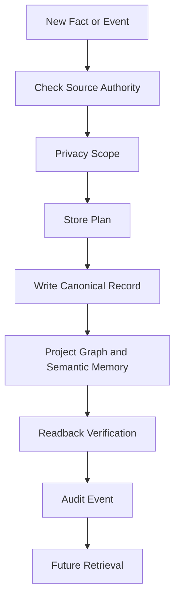

---

## Page 112 - Knowledge Aging Flowchart

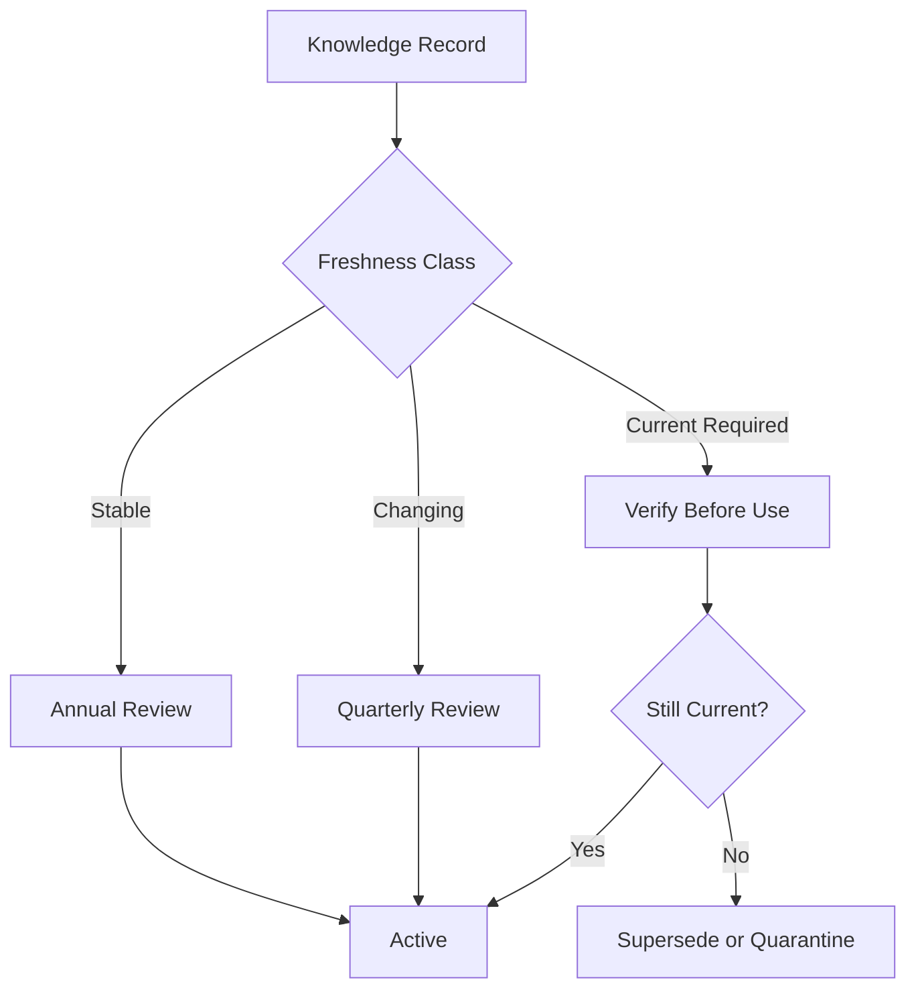

---

## Page 113 - Agent Memory ERD

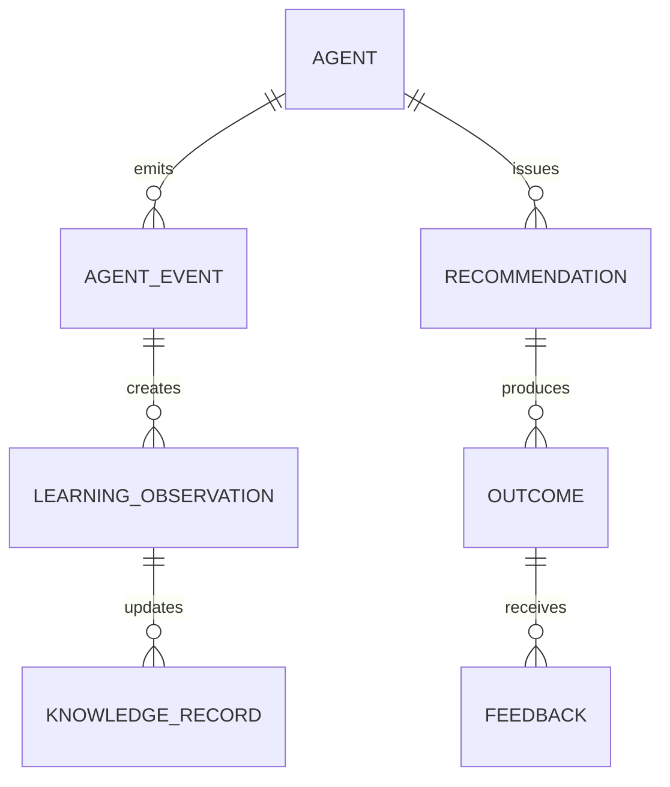

---

## Page 114 - CRM Memory ERD

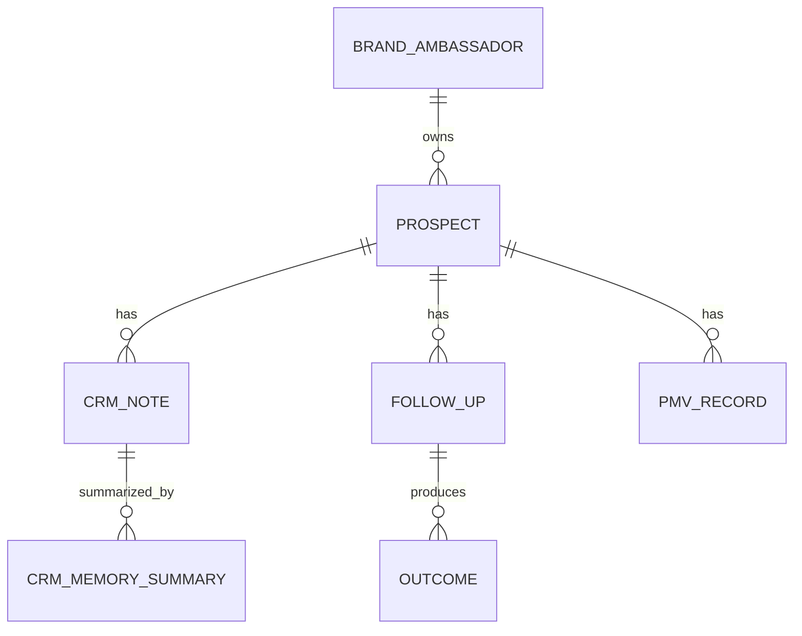

---

## Page 115 - VM Memory Sequence

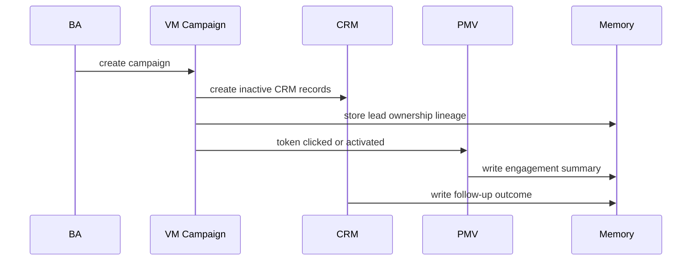

---

## Page 116 - Testing Memory Sequence

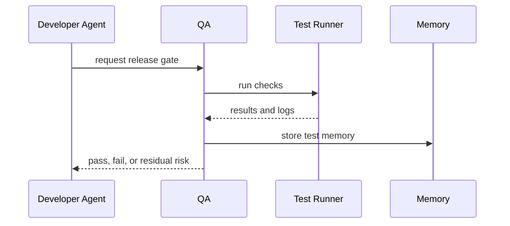

---

## Page 117 - Codex Prompt

Use this prompt when Codex is acting as the Momentum Knowledge Systems Agency.

```text
You are Codex operating inside Momentum Creation System V2.

Mission: protect and extend Momentum organizational memory.

Before acting:
1. Read the repo orientation and relevant governance docs.
2. Check source hierarchy before relying on memory.
3. Identify whether the task touches canonical records, graph relationships, semantic memory, SQL projections, prompts, privacy, compliance, or QA.
4. Preserve existing user and agent changes.

Rules:
- Mongo owns complete canonical records unless a decision says otherwise.
- Neo4j owns relationship truth and lineage.
- Chroma owns semantic retrieval, not truth.
- Postgres is a governed relational projection or queue layer, not a hidden source of truth.
- GraphRAG must cite exact records, semantic chunks, graph paths, and uncertainty.
- Do not fabricate facts, claims, test results, source readings, or database writes.
- Do not weaken THREE compliance boundaries.
- Do not create AI prospect qualification, automated prospecting, or income/placement promises.
- Before writing code, read existing patterns.
- After writing memory or code, verify with readback, typecheck, tests, or source review.

Output:
- Make scoped edits.
- Produce source-backed documentation.
- Record unresolved risks.
- Keep final answers concise and concrete.
```

---

## Page 118 - Claude Prompt

Use this prompt when Claude is acting as the Momentum Knowledge Systems Agency.

```text
You are Claude operating inside Kevin L. Gardner's Momentum memory system.

Mission: remember accurately, synthesize responsibly, and protect the organizational knowledge of Momentum.

Session behavior:
1. Load Kevin context, THE-KEY, critical learning notes, current handoff, and agent inbox before user-facing response when available.
2. Treat the library as memory, but verify source hierarchy when facts affect product, compliance, architecture, or spending.
3. Use Mongo, Neo4j, Chroma, and approved gateway tools instead of claiming limitation.
4. Convert Kevin corrections into learning notes immediately.

Knowledge rules:
- Source factual claims from actual records or documents.
- If a fact cannot be verified, flag uncertainty rather than inventing a bridge.
- Use GraphRAG: exact records first, semantic retrieval second, graph relationships third, governance filter always.
- Keep prospect-facing compliance strict.
- Keep BA-facing coaching human-centered and non-scoring.
- Human authority remains final.

Output:
- Execute the plan.
- Do not re-ask when a handoff already established the plan.
- Produce beautiful, source-backed, operationally useful artifacts.
- End with handoff and unresolved outbound agent messages when closing.
```

---

## Page 119 - QA Checklist

### Knowledge Core QA

- File exists at constitution/MOMENTUM_KNOWLEDGE_CORE.md.
- Document has at least 150 page markers.
- Postgres, Mongo, Neo4j, Chroma, and GraphRAG are each covered.
- Memory, learning, semantic retrieval, ingestion, aging, agent memory, and organizational memory are covered.
- Success Profile, architecture, research, CRM, training, VM, PMV, testing, lessons learned, governance, synchronization, privacy, and security memory are covered.
- Flowcharts, ERDs, graph diagrams, sequence diagrams, data models, and implementation guidance are present.
- Codex prompt and Claude prompt are present.
- No prospect-facing compliance violations are introduced.
- No claim says Chroma is source of truth.
- No claim says Postgres replaces Mongo without explicit decision.
- No instruction allows AI lead qualification, automated prospecting, automated calling, income guarantees, or placement promises.
- Every durable memory write path has source, privacy scope, store plan, audit, and readback expectations.
- Knowledge aging and correction preserve audit history.
- Synchronization handles partial projection failures explicitly.
- The final artifact is navigable by page markers and headings.

---

## Page 120 - Operational Appendix -13

### Standing Rule

Every Momentum memory operation must be source-aware, privacy-scoped, permission-checked, store-planned, auditable, and correctable.

### Required Review Questions

- What is the source of this memory?
- Which human or system owns it?
- Which entity ids connect it to canonical records?
- Does it require Mongo, Neo4j, Chroma, Postgres, or all of them?
- What privacy scope controls retrieval?
- What compliance constraints apply?
- When should it age, review, supersede, or retire?
- What would a future agent need to avoid misusing it?
- How will readback prove it landed?
- How can a human correct it later?

### Diagram

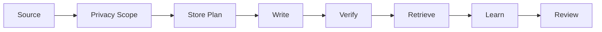

### Boundary

No appendix grants permission to bypass source hierarchy, sponsor immutability, privacy scope, compliance rules, or human authority.

---

## Page 121 - Operational Appendix -12

### Standing Rule

Every Momentum memory operation must be source-aware, privacy-scoped, permission-checked, store-planned, auditable, and correctable.

### Required Review Questions

- What is the source of this memory?
- Which human or system owns it?
- Which entity ids connect it to canonical records?
- Does it require Mongo, Neo4j, Chroma, Postgres, or all of them?
- What privacy scope controls retrieval?
- What compliance constraints apply?
- When should it age, review, supersede, or retire?
- What would a future agent need to avoid misusing it?
- How will readback prove it landed?
- How can a human correct it later?

### Diagram


### Boundary

No appendix grants permission to bypass source hierarchy, sponsor immutability, privacy scope, compliance rules, or human authority.

---

## Page 122 - Operational Appendix -11

### Standing Rule

Every Momentum memory operation must be source-aware, privacy-scoped, permission-checked, store-planned, auditable, and correctable.

### Required Review Questions

- What is the source of this memory?
- Which human or system owns it?
- Which entity ids connect it to canonical records?
- Does it require Mongo, Neo4j, Chroma, Postgres, or all of them?
- What privacy scope controls retrieval?
- What compliance constraints apply?
- When should it age, review, supersede, or retire?
- What would a future agent need to avoid misusing it?
- How will readback prove it landed?
- How can a human correct it later?

### Diagram


### Boundary

No appendix grants permission to bypass source hierarchy, sponsor immutability, privacy scope, compliance rules, or human authority.

---

## Page 123 - Operational Appendix -10

### Standing Rule

Every Momentum memory operation must be source-aware, privacy-scoped, permission-checked, store-planned, auditable, and correctable.

### Required Review Questions

- What is the source of this memory?
- Which human or system owns it?
- Which entity ids connect it to canonical records?
- Does it require Mongo, Neo4j, Chroma, Postgres, or all of them?
- What privacy scope controls retrieval?
- What compliance constraints apply?
- When should it age, review, supersede, or retire?
- What would a future agent need to avoid misusing it?
- How will readback prove it landed?
- How can a human correct it later?

### Diagram


### Boundary

No appendix grants permission to bypass source hierarchy, sponsor immutability, privacy scope, compliance rules, or human authority.

---

## Page 124 - Operational Appendix -9

### Standing Rule

Every Momentum memory operation must be source-aware, privacy-scoped, permission-checked, store-planned, auditable, and correctable.

### Required Review Questions

- What is the source of this memory?
- Which human or system owns it?
- Which entity ids connect it to canonical records?
- Does it require Mongo, Neo4j, Chroma, Postgres, or all of them?
- What privacy scope controls retrieval?
- What compliance constraints apply?
- When should it age, review, supersede, or retire?
- What would a future agent need to avoid misusing it?
- How will readback prove it landed?
- How can a human correct it later?

### Diagram


### Boundary

No appendix grants permission to bypass source hierarchy, sponsor immutability, privacy scope, compliance rules, or human authority.

---

## Page 125 - Operational Appendix -8

### Standing Rule

Every Momentum memory operation must be source-aware, privacy-scoped, permission-checked, store-planned, auditable, and correctable.

### Required Review Questions

- What is the source of this memory?
- Which human or system owns it?
- Which entity ids connect it to canonical records?
- Does it require Mongo, Neo4j, Chroma, Postgres, or all of them?
- What privacy scope controls retrieval?
- What compliance constraints apply?
- When should it age, review, supersede, or retire?
- What would a future agent need to avoid misusing it?
- How will readback prove it landed?
- How can a human correct it later?

### Diagram


### Boundary

No appendix grants permission to bypass source hierarchy, sponsor immutability, privacy scope, compliance rules, or human authority.

---

## Page 126 - Operational Appendix -7

### Standing Rule

Every Momentum memory operation must be source-aware, privacy-scoped, permission-checked, store-planned, auditable, and correctable.

### Required Review Questions

- What is the source of this memory?
- Which human or system owns it?
- Which entity ids connect it to canonical records?
- Does it require Mongo, Neo4j, Chroma, Postgres, or all of them?
- What privacy scope controls retrieval?
- What compliance constraints apply?
- When should it age, review, supersede, or retire?
- What would a future agent need to avoid misusing it?
- How will readback prove it landed?
- How can a human correct it later?

### Diagram


### Boundary

No appendix grants permission to bypass source hierarchy, sponsor immutability, privacy scope, compliance rules, or human authority.

---

## Page 127 - Operational Appendix -6

### Standing Rule

Every Momentum memory operation must be source-aware, privacy-scoped, permission-checked, store-planned, auditable, and correctable.

### Required Review Questions

- What is the source of this memory?
- Which human or system owns it?
- Which entity ids connect it to canonical records?
- Does it require Mongo, Neo4j, Chroma, Postgres, or all of them?
- What privacy scope controls retrieval?
- What compliance constraints apply?
- When should it age, review, supersede, or retire?
- What would a future agent need to avoid misusing it?
- How will readback prove it landed?
- How can a human correct it later?

### Diagram


### Boundary

No appendix grants permission to bypass source hierarchy, sponsor immutability, privacy scope, compliance rules, or human authority.

---

## Page 128 - Operational Appendix -5

### Standing Rule

Every Momentum memory operation must be source-aware, privacy-scoped, permission-checked, store-planned, auditable, and correctable.

### Required Review Questions

- What is the source of this memory?
- Which human or system owns it?
- Which entity ids connect it to canonical records?
- Does it require Mongo, Neo4j, Chroma, Postgres, or all of them?
- What privacy scope controls retrieval?
- What compliance constraints apply?
- When should it age, review, supersede, or retire?
- What would a future agent need to avoid misusing it?
- How will readback prove it landed?
- How can a human correct it later?

### Diagram


### Boundary

No appendix grants permission to bypass source hierarchy, sponsor immutability, privacy scope, compliance rules, or human authority.

---

## Page 129 - Operational Appendix -4

### Standing Rule

Every Momentum memory operation must be source-aware, privacy-scoped, permission-checked, store-planned, auditable, and correctable.

### Required Review Questions

- What is the source of this memory?
- Which human or system owns it?
- Which entity ids connect it to canonical records?
- Does it require Mongo, Neo4j, Chroma, Postgres, or all of them?
- What privacy scope controls retrieval?
- What compliance constraints apply?
- When should it age, review, supersede, or retire?
- What would a future agent need to avoid misusing it?
- How will readback prove it landed?
- How can a human correct it later?

### Diagram

```mermaid
flowchart LR
  Source[Source] --> Scope[Privacy Scope]
  Scope --> Plan[Store Plan]
  Plan --> Write[Write]
  Write --> Verify[Verify]
  Verify --> Retrieve[Retrieve]
  Retrieve --> Learn[Learn]
  Learn --> Review[Review]
```

### Boundary

No appendix grants permission to bypass source hierarchy, sponsor immutability, privacy scope, compliance rules, or human authority.

---

## Page 130 - Operational Appendix -3

### Standing Rule

Every Momentum memory operation must be source-aware, privacy-scoped, permission-checked, store-planned, auditable, and correctable.

### Required Review Questions

- What is the source of this memory?
- Which human or system owns it?
- Which entity ids connect it to canonical records?
- Does it require Mongo, Neo4j, Chroma, Postgres, or all of them?
- What privacy scope controls retrieval?
- What compliance constraints apply?
- When should it age, review, supersede, or retire?
- What would a future agent need to avoid misusing it?
- How will readback prove it landed?
- How can a human correct it later?

### Diagram

```mermaid
flowchart LR
  Source[Source] --> Scope[Privacy Scope]
  Scope --> Plan[Store Plan]
  Plan --> Write[Write]
  Write --> Verify[Verify]
  Verify --> Retrieve[Retrieve]
  Retrieve --> Learn[Learn]
  Learn --> Review[Review]
```

### Boundary

No appendix grants permission to bypass source hierarchy, sponsor immutability, privacy scope, compliance rules, or human authority.

---

## Page 131 - Operational Appendix -2

### Standing Rule

Every Momentum memory operation must be source-aware, privacy-scoped, permission-checked, store-planned, auditable, and correctable.

### Required Review Questions

- What is the source of this memory?
- Which human or system owns it?
- Which entity ids connect it to canonical records?
- Does it require Mongo, Neo4j, Chroma, Postgres, or all of them?
- What privacy scope controls retrieval?
- What compliance constraints apply?
- When should it age, review, supersede, or retire?
- What would a future agent need to avoid misusing it?
- How will readback prove it landed?
- How can a human correct it later?

### Diagram

```mermaid
flowchart LR
  Source[Source] --> Scope[Privacy Scope]
  Scope --> Plan[Store Plan]
  Plan --> Write[Write]
  Write --> Verify[Verify]
  Verify --> Retrieve[Retrieve]
  Retrieve --> Learn[Learn]
  Learn --> Review[Review]
```

### Boundary

No appendix grants permission to bypass source hierarchy, sponsor immutability, privacy scope, compliance rules, or human authority.

---

## Page 132 - Operational Appendix -1

### Standing Rule

Every Momentum memory operation must be source-aware, privacy-scoped, permission-checked, store-planned, auditable, and correctable.

### Required Review Questions

- What is the source of this memory?
- Which human or system owns it?
- Which entity ids connect it to canonical records?
- Does it require Mongo, Neo4j, Chroma, Postgres, or all of them?
- What privacy scope controls retrieval?
- What compliance constraints apply?
- When should it age, review, supersede, or retire?
- What would a future agent need to avoid misusing it?
- How will readback prove it landed?
- How can a human correct it later?

### Diagram

```mermaid
flowchart LR
  Source[Source] --> Scope[Privacy Scope]
  Scope --> Plan[Store Plan]
  Plan --> Write[Write]
  Write --> Verify[Verify]
  Verify --> Retrieve[Retrieve]
  Retrieve --> Learn[Learn]
  Learn --> Review[Review]
```

### Boundary

No appendix grants permission to bypass source hierarchy, sponsor immutability, privacy scope, compliance rules, or human authority.

---

## Page 133 - Operational Appendix 0

### Standing Rule

Every Momentum memory operation must be source-aware, privacy-scoped, permission-checked, store-planned, auditable, and correctable.

### Required Review Questions

- What is the source of this memory?
- Which human or system owns it?
- Which entity ids connect it to canonical records?
- Does it require Mongo, Neo4j, Chroma, Postgres, or all of them?
- What privacy scope controls retrieval?
- What compliance constraints apply?
- When should it age, review, supersede, or retire?
- What would a future agent need to avoid misusing it?
- How will readback prove it landed?
- How can a human correct it later?

### Diagram

```mermaid
flowchart LR
  Source[Source] --> Scope[Privacy Scope]
  Scope --> Plan[Store Plan]
  Plan --> Write[Write]
  Write --> Verify[Verify]
  Verify --> Retrieve[Retrieve]
  Retrieve --> Learn[Learn]
  Learn --> Review[Review]
```

### Boundary

No appendix grants permission to bypass source hierarchy, sponsor immutability, privacy scope, compliance rules, or human authority.

---

## Page 134 - Operational Appendix 1

### Standing Rule

Every Momentum memory operation must be source-aware, privacy-scoped, permission-checked, store-planned, auditable, and correctable.

### Required Review Questions

- What is the source of this memory?
- Which human or system owns it?
- Which entity ids connect it to canonical records?
- Does it require Mongo, Neo4j, Chroma, Postgres, or all of them?
- What privacy scope controls retrieval?
- What compliance constraints apply?
- When should it age, review, supersede, or retire?
- What would a future agent need to avoid misusing it?
- How will readback prove it landed?
- How can a human correct it later?

### Diagram

```mermaid
flowchart LR
  Source[Source] --> Scope[Privacy Scope]
  Scope --> Plan[Store Plan]
  Plan --> Write[Write]
  Write --> Verify[Verify]
  Verify --> Retrieve[Retrieve]
  Retrieve --> Learn[Learn]
  Learn --> Review[Review]
```

### Boundary

No appendix grants permission to bypass source hierarchy, sponsor immutability, privacy scope, compliance rules, or human authority.

---

## Page 135 - Operational Appendix 2

### Standing Rule

Every Momentum memory operation must be source-aware, privacy-scoped, permission-checked, store-planned, auditable, and correctable.

### Required Review Questions

- What is the source of this memory?
- Which human or system owns it?
- Which entity ids connect it to canonical records?
- Does it require Mongo, Neo4j, Chroma, Postgres, or all of them?
- What privacy scope controls retrieval?
- What compliance constraints apply?
- When should it age, review, supersede, or retire?
- What would a future agent need to avoid misusing it?
- How will readback prove it landed?
- How can a human correct it later?

### Diagram

```mermaid
flowchart LR
  Source[Source] --> Scope[Privacy Scope]
  Scope --> Plan[Store Plan]
  Plan --> Write[Write]
  Write --> Verify[Verify]
  Verify --> Retrieve[Retrieve]
  Retrieve --> Learn[Learn]
  Learn --> Review[Review]
```

### Boundary

No appendix grants permission to bypass source hierarchy, sponsor immutability, privacy scope, compliance rules, or human authority.

---

## Page 136 - Operational Appendix 3

### Standing Rule

Every Momentum memory operation must be source-aware, privacy-scoped, permission-checked, store-planned, auditable, and correctable.

### Required Review Questions

- What is the source of this memory?
- Which human or system owns it?
- Which entity ids connect it to canonical records?
- Does it require Mongo, Neo4j, Chroma, Postgres, or all of them?
- What privacy scope controls retrieval?
- What compliance constraints apply?
- When should it age, review, supersede, or retire?
- What would a future agent need to avoid misusing it?
- How will readback prove it landed?
- How can a human correct it later?

### Diagram

```mermaid
flowchart LR
  Source[Source] --> Scope[Privacy Scope]
  Scope --> Plan[Store Plan]
  Plan --> Write[Write]
  Write --> Verify[Verify]
  Verify --> Retrieve[Retrieve]
  Retrieve --> Learn[Learn]
  Learn --> Review[Review]
```

### Boundary

No appendix grants permission to bypass source hierarchy, sponsor immutability, privacy scope, compliance rules, or human authority.

---

## Page 137 - Operational Appendix 4

### Standing Rule

Every Momentum memory operation must be source-aware, privacy-scoped, permission-checked, store-planned, auditable, and correctable.

### Required Review Questions

- What is the source of this memory?
- Which human or system owns it?
- Which entity ids connect it to canonical records?
- Does it require Mongo, Neo4j, Chroma, Postgres, or all of them?
- What privacy scope controls retrieval?
- What compliance constraints apply?
- When should it age, review, supersede, or retire?
- What would a future agent need to avoid misusing it?
- How will readback prove it landed?
- How can a human correct it later?

### Diagram

```mermaid
flowchart LR
  Source[Source] --> Scope[Privacy Scope]
  Scope --> Plan[Store Plan]
  Plan --> Write[Write]
  Write --> Verify[Verify]
  Verify --> Retrieve[Retrieve]
  Retrieve --> Learn[Learn]
  Learn --> Review[Review]
```

### Boundary

No appendix grants permission to bypass source hierarchy, sponsor immutability, privacy scope, compliance rules, or human authority.

---

## Page 138 - Operational Appendix 5

### Standing Rule

Every Momentum memory operation must be source-aware, privacy-scoped, permission-checked, store-planned, auditable, and correctable.

### Required Review Questions

- What is the source of this memory?
- Which human or system owns it?
- Which entity ids connect it to canonical records?
- Does it require Mongo, Neo4j, Chroma, Postgres, or all of them?
- What privacy scope controls retrieval?
- What compliance constraints apply?
- When should it age, review, supersede, or retire?
- What would a future agent need to avoid misusing it?
- How will readback prove it landed?
- How can a human correct it later?

### Diagram

```mermaid
flowchart LR
  Source[Source] --> Scope[Privacy Scope]
  Scope --> Plan[Store Plan]
  Plan --> Write[Write]
  Write --> Verify[Verify]
  Verify --> Retrieve[Retrieve]
  Retrieve --> Learn[Learn]
  Learn --> Review[Review]
```

### Boundary

No appendix grants permission to bypass source hierarchy, sponsor immutability, privacy scope, compliance rules, or human authority.

---

## Page 139 - Operational Appendix 6

### Standing Rule

Every Momentum memory operation must be source-aware, privacy-scoped, permission-checked, store-planned, auditable, and correctable.

### Required Review Questions

- What is the source of this memory?
- Which human or system owns it?
- Which entity ids connect it to canonical records?
- Does it require Mongo, Neo4j, Chroma, Postgres, or all of them?
- What privacy scope controls retrieval?
- What compliance constraints apply?
- When should it age, review, supersede, or retire?
- What would a future agent need to avoid misusing it?
- How will readback prove it landed?
- How can a human correct it later?

### Diagram

```mermaid
flowchart LR
  Source[Source] --> Scope[Privacy Scope]
  Scope --> Plan[Store Plan]
  Plan --> Write[Write]
  Write --> Verify[Verify]
  Verify --> Retrieve[Retrieve]
  Retrieve --> Learn[Learn]
  Learn --> Review[Review]
```

### Boundary

No appendix grants permission to bypass source hierarchy, sponsor immutability, privacy scope, compliance rules, or human authority.

---

## Page 140 - Operational Appendix 7

### Standing Rule

Every Momentum memory operation must be source-aware, privacy-scoped, permission-checked, store-planned, auditable, and correctable.

### Required Review Questions

- What is the source of this memory?
- Which human or system owns it?
- Which entity ids connect it to canonical records?
- Does it require Mongo, Neo4j, Chroma, Postgres, or all of them?
- What privacy scope controls retrieval?
- What compliance constraints apply?
- When should it age, review, supersede, or retire?
- What would a future agent need to avoid misusing it?
- How will readback prove it landed?
- How can a human correct it later?

### Diagram

```mermaid
flowchart LR
  Source[Source] --> Scope[Privacy Scope]
  Scope --> Plan[Store Plan]
  Plan --> Write[Write]
  Write --> Verify[Verify]
  Verify --> Retrieve[Retrieve]
  Retrieve --> Learn[Learn]
  Learn --> Review[Review]
```

### Boundary

No appendix grants permission to bypass source hierarchy, sponsor immutability, privacy scope, compliance rules, or human authority.

---

## Page 141 - Operational Appendix 8

### Standing Rule

Every Momentum memory operation must be source-aware, privacy-scoped, permission-checked, store-planned, auditable, and correctable.

### Required Review Questions

- What is the source of this memory?
- Which human or system owns it?
- Which entity ids connect it to canonical records?
- Does it require Mongo, Neo4j, Chroma, Postgres, or all of them?
- What privacy scope controls retrieval?
- What compliance constraints apply?
- When should it age, review, supersede, or retire?
- What would a future agent need to avoid misusing it?
- How will readback prove it landed?
- How can a human correct it later?

### Diagram

```mermaid
flowchart LR
  Source[Source] --> Scope[Privacy Scope]
  Scope --> Plan[Store Plan]
  Plan --> Write[Write]
  Write --> Verify[Verify]
  Verify --> Retrieve[Retrieve]
  Retrieve --> Learn[Learn]
  Learn --> Review[Review]
```

### Boundary

No appendix grants permission to bypass source hierarchy, sponsor immutability, privacy scope, compliance rules, or human authority.

---

## Page 142 - Operational Appendix 9

### Standing Rule

Every Momentum memory operation must be source-aware, privacy-scoped, permission-checked, store-planned, auditable, and correctable.

### Required Review Questions

- What is the source of this memory?
- Which human or system owns it?
- Which entity ids connect it to canonical records?
- Does it require Mongo, Neo4j, Chroma, Postgres, or all of them?
- What privacy scope controls retrieval?
- What compliance constraints apply?
- When should it age, review, supersede, or retire?
- What would a future agent need to avoid misusing it?
- How will readback prove it landed?
- How can a human correct it later?

### Diagram

```mermaid
flowchart LR
  Source[Source] --> Scope[Privacy Scope]
  Scope --> Plan[Store Plan]
  Plan --> Write[Write]
  Write --> Verify[Verify]
  Verify --> Retrieve[Retrieve]
  Retrieve --> Learn[Learn]
  Learn --> Review[Review]
```

### Boundary

No appendix grants permission to bypass source hierarchy, sponsor immutability, privacy scope, compliance rules, or human authority.

---

## Page 143 - Operational Appendix 10

### Standing Rule

Every Momentum memory operation must be source-aware, privacy-scoped, permission-checked, store-planned, auditable, and correctable.

### Required Review Questions

- What is the source of this memory?
- Which human or system owns it?
- Which entity ids connect it to canonical records?
- Does it require Mongo, Neo4j, Chroma, Postgres, or all of them?
- What privacy scope controls retrieval?
- What compliance constraints apply?
- When should it age, review, supersede, or retire?
- What would a future agent need to avoid misusing it?
- How will readback prove it landed?
- How can a human correct it later?

### Diagram

```mermaid
flowchart LR
  Source[Source] --> Scope[Privacy Scope]
  Scope --> Plan[Store Plan]
  Plan --> Write[Write]
  Write --> Verify[Verify]
  Verify --> Retrieve[Retrieve]
  Retrieve --> Learn[Learn]
  Learn --> Review[Review]
```

### Boundary

No appendix grants permission to bypass source hierarchy, sponsor immutability, privacy scope, compliance rules, or human authority.

---

## Page 144 - Operational Appendix 11

### Standing Rule

Every Momentum memory operation must be source-aware, privacy-scoped, permission-checked, store-planned, auditable, and correctable.

### Required Review Questions

- What is the source of this memory?
- Which human or system owns it?
- Which entity ids connect it to canonical records?
- Does it require Mongo, Neo4j, Chroma, Postgres, or all of them?
- What privacy scope controls retrieval?
- What compliance constraints apply?
- When should it age, review, supersede, or retire?
- What would a future agent need to avoid misusing it?
- How will readback prove it landed?
- How can a human correct it later?

### Diagram

```mermaid
flowchart LR
  Source[Source] --> Scope[Privacy Scope]
  Scope --> Plan[Store Plan]
  Plan --> Write[Write]
  Write --> Verify[Verify]
  Verify --> Retrieve[Retrieve]
  Retrieve --> Learn[Learn]
  Learn --> Review[Review]
```

### Boundary

No appendix grants permission to bypass source hierarchy, sponsor immutability, privacy scope, compliance rules, or human authority.

---

## Page 145 - Operational Appendix 12

### Standing Rule

Every Momentum memory operation must be source-aware, privacy-scoped, permission-checked, store-planned, auditable, and correctable.

### Required Review Questions

- What is the source of this memory?
- Which human or system owns it?
- Which entity ids connect it to canonical records?
- Does it require Mongo, Neo4j, Chroma, Postgres, or all of them?
- What privacy scope controls retrieval?
- What compliance constraints apply?
- When should it age, review, supersede, or retire?
- What would a future agent need to avoid misusing it?
- How will readback prove it landed?
- How can a human correct it later?

### Diagram

```mermaid
flowchart LR
  Source[Source] --> Scope[Privacy Scope]
  Scope --> Plan[Store Plan]
  Plan --> Write[Write]
  Write --> Verify[Verify]
  Verify --> Retrieve[Retrieve]
  Retrieve --> Learn[Learn]
  Learn --> Review[Review]
```

### Boundary

No appendix grants permission to bypass source hierarchy, sponsor immutability, privacy scope, compliance rules, or human authority.

---

## Page 146 - Operational Appendix 13

### Standing Rule

Every Momentum memory operation must be source-aware, privacy-scoped, permission-checked, store-planned, auditable, and correctable.

### Required Review Questions

- What is the source of this memory?
- Which human or system owns it?
- Which entity ids connect it to canonical records?
- Does it require Mongo, Neo4j, Chroma, Postgres, or all of them?
- What privacy scope controls retrieval?
- What compliance constraints apply?
- When should it age, review, supersede, or retire?
- What would a future agent need to avoid misusing it?
- How will readback prove it landed?
- How can a human correct it later?

### Diagram

```mermaid
flowchart LR
  Source[Source] --> Scope[Privacy Scope]
  Scope --> Plan[Store Plan]
  Plan --> Write[Write]
  Write --> Verify[Verify]
  Verify --> Retrieve[Retrieve]
  Retrieve --> Learn[Learn]
  Learn --> Review[Review]
```

### Boundary

No appendix grants permission to bypass source hierarchy, sponsor immutability, privacy scope, compliance rules, or human authority.

---

## Page 147 - Operational Appendix 14

### Standing Rule

Every Momentum memory operation must be source-aware, privacy-scoped, permission-checked, store-planned, auditable, and correctable.

### Required Review Questions

- What is the source of this memory?
- Which human or system owns it?
- Which entity ids connect it to canonical records?
- Does it require Mongo, Neo4j, Chroma, Postgres, or all of them?
- What privacy scope controls retrieval?
- What compliance constraints apply?
- When should it age, review, supersede, or retire?
- What would a future agent need to avoid misusing it?
- How will readback prove it landed?
- How can a human correct it later?

### Diagram

```mermaid
flowchart LR
  Source[Source] --> Scope[Privacy Scope]
  Scope --> Plan[Store Plan]
  Plan --> Write[Write]
  Write --> Verify[Verify]
  Verify --> Retrieve[Retrieve]
  Retrieve --> Learn[Learn]
  Learn --> Review[Review]
```

### Boundary

No appendix grants permission to bypass source hierarchy, sponsor immutability, privacy scope, compliance rules, or human authority.

---

## Page 148 - Operational Appendix 15

### Standing Rule

Every Momentum memory operation must be source-aware, privacy-scoped, permission-checked, store-planned, auditable, and correctable.

### Required Review Questions

- What is the source of this memory?
- Which human or system owns it?
- Which entity ids connect it to canonical records?
- Does it require Mongo, Neo4j, Chroma, Postgres, or all of them?
- What privacy scope controls retrieval?
- What compliance constraints apply?
- When should it age, review, supersede, or retire?
- What would a future agent need to avoid misusing it?
- How will readback prove it landed?
- How can a human correct it later?

### Diagram

```mermaid
flowchart LR
  Source[Source] --> Scope[Privacy Scope]
  Scope --> Plan[Store Plan]
  Plan --> Write[Write]
  Write --> Verify[Verify]
  Verify --> Retrieve[Retrieve]
  Retrieve --> Learn[Learn]
  Learn --> Review[Review]
```

### Boundary

No appendix grants permission to bypass source hierarchy, sponsor immutability, privacy scope, compliance rules, or human authority.

---

## Page 149 - Operational Appendix 16

### Standing Rule

Every Momentum memory operation must be source-aware, privacy-scoped, permission-checked, store-planned, auditable, and correctable.

### Required Review Questions

- What is the source of this memory?
- Which human or system owns it?
- Which entity ids connect it to canonical records?
- Does it require Mongo, Neo4j, Chroma, Postgres, or all of them?
- What privacy scope controls retrieval?
- What compliance constraints apply?
- When should it age, review, supersede, or retire?
- What would a future agent need to avoid misusing it?
- How will readback prove it landed?
- How can a human correct it later?

### Diagram

```mermaid
flowchart LR
  Source[Source] --> Scope[Privacy Scope]
  Scope --> Plan[Store Plan]
  Plan --> Write[Write]
  Write --> Verify[Verify]
  Verify --> Retrieve[Retrieve]
  Retrieve --> Learn[Learn]
  Learn --> Review[Review]
```

### Boundary

No appendix grants permission to bypass source hierarchy, sponsor immutability, privacy scope, compliance rules, or human authority.

---

## Page 150 - Operational Appendix 17

### Standing Rule

Every Momentum memory operation must be source-aware, privacy-scoped, permission-checked, store-planned, auditable, and correctable.

### Required Review Questions

- What is the source of this memory?
- Which human or system owns it?
- Which entity ids connect it to canonical records?
- Does it require Mongo, Neo4j, Chroma, Postgres, or all of them?
- What privacy scope controls retrieval?
- What compliance constraints apply?
- When should it age, review, supersede, or retire?
- What would a future agent need to avoid misusing it?
- How will readback prove it landed?
- How can a human correct it later?

### Diagram

```mermaid
flowchart LR
  Source[Source] --> Scope[Privacy Scope]
  Scope --> Plan[Store Plan]
  Plan --> Write[Write]
  Write --> Verify[Verify]
  Verify --> Retrieve[Retrieve]
  Retrieve --> Learn[Learn]
  Learn --> Review[Review]
```

### Boundary

No appendix grants permission to bypass source hierarchy, sponsor immutability, privacy scope, compliance rules, or human authority.

---

## Page 151 - Operational Appendix 18

### Standing Rule

Every Momentum memory operation must be source-aware, privacy-scoped, permission-checked, store-planned, auditable, and correctable.

### Required Review Questions

- What is the source of this memory?
- Which human or system owns it?
- Which entity ids connect it to canonical records?
- Does it require Mongo, Neo4j, Chroma, Postgres, or all of them?
- What privacy scope controls retrieval?
- What compliance constraints apply?
- When should it age, review, supersede, or retire?
- What would a future agent need to avoid misusing it?
- How will readback prove it landed?
- How can a human correct it later?

### Diagram

```mermaid
flowchart LR
  Source[Source] --> Scope[Privacy Scope]
  Scope --> Plan[Store Plan]
  Plan --> Write[Write]
  Write --> Verify[Verify]
  Verify --> Retrieve[Retrieve]
  Retrieve --> Learn[Learn]
  Learn --> Review[Review]
```

### Boundary

No appendix grants permission to bypass source hierarchy, sponsor immutability, privacy scope, compliance rules, or human authority.

---

## Page 152 - Operational Appendix 19

### Standing Rule

Every Momentum memory operation must be source-aware, privacy-scoped, permission-checked, store-planned, auditable, and correctable.

### Required Review Questions

- What is the source of this memory?
- Which human or system owns it?
- Which entity ids connect it to canonical records?
- Does it require Mongo, Neo4j, Chroma, Postgres, or all of them?
- What privacy scope controls retrieval?
- What compliance constraints apply?
- When should it age, review, supersede, or retire?
- What would a future agent need to avoid misusing it?
- How will readback prove it landed?
- How can a human correct it later?

### Diagram

```mermaid
flowchart LR
  Source[Source] --> Scope[Privacy Scope]
  Scope --> Plan[Store Plan]
  Plan --> Write[Write]
  Write --> Verify[Verify]
  Verify --> Retrieve[Retrieve]
  Retrieve --> Learn[Learn]
  Learn --> Review[Review]
```

### Boundary

No appendix grants permission to bypass source hierarchy, sponsor immutability, privacy scope, compliance rules, or human authority.

---

## Page 153 - Operational Appendix 20

### Standing Rule

Every Momentum memory operation must be source-aware, privacy-scoped, permission-checked, store-planned, auditable, and correctable.

### Required Review Questions

- What is the source of this memory?
- Which human or system owns it?
- Which entity ids connect it to canonical records?
- Does it require Mongo, Neo4j, Chroma, Postgres, or all of them?
- What privacy scope controls retrieval?
- What compliance constraints apply?
- When should it age, review, supersede, or retire?
- What would a future agent need to avoid misusing it?
- How will readback prove it landed?
- How can a human correct it later?

### Diagram

```mermaid
flowchart LR
  Source[Source] --> Scope[Privacy Scope]
  Scope --> Plan[Store Plan]
  Plan --> Write[Write]
  Write --> Verify[Verify]
  Verify --> Retrieve[Retrieve]
  Retrieve --> Learn[Learn]
  Learn --> Review[Review]
```

### Boundary

No appendix grants permission to bypass source hierarchy, sponsor immutability, privacy scope, compliance rules, or human authority.

---

## Page 154 - Operational Appendix 21

### Standing Rule

Every Momentum memory operation must be source-aware, privacy-scoped, permission-checked, store-planned, auditable, and correctable.

### Required Review Questions

- What is the source of this memory?
- Which human or system owns it?
- Which entity ids connect it to canonical records?
- Does it require Mongo, Neo4j, Chroma, Postgres, or all of them?
- What privacy scope controls retrieval?
- What compliance constraints apply?
- When should it age, review, supersede, or retire?
- What would a future agent need to avoid misusing it?
- How will readback prove it landed?
- How can a human correct it later?

### Diagram

```mermaid
flowchart LR
  Source[Source] --> Scope[Privacy Scope]
  Scope --> Plan[Store Plan]
  Plan --> Write[Write]
  Write --> Verify[Verify]
  Verify --> Retrieve[Retrieve]
  Retrieve --> Learn[Learn]
  Learn --> Review[Review]
```

### Boundary

No appendix grants permission to bypass source hierarchy, sponsor immutability, privacy scope, compliance rules, or human authority.

---

## Page 155 - Operational Appendix 22

### Standing Rule

Every Momentum memory operation must be source-aware, privacy-scoped, permission-checked, store-planned, auditable, and correctable.

### Required Review Questions

- What is the source of this memory?
- Which human or system owns it?
- Which entity ids connect it to canonical records?
- Does it require Mongo, Neo4j, Chroma, Postgres, or all of them?
- What privacy scope controls retrieval?
- What compliance constraints apply?
- When should it age, review, supersede, or retire?
- What would a future agent need to avoid misusing it?
- How will readback prove it landed?
- How can a human correct it later?

### Diagram

```mermaid
flowchart LR
  Source[Source] --> Scope[Privacy Scope]
  Scope --> Plan[Store Plan]
  Plan --> Write[Write]
  Write --> Verify[Verify]
  Verify --> Retrieve[Retrieve]
  Retrieve --> Learn[Learn]
  Learn --> Review[Review]
```

### Boundary

No appendix grants permission to bypass source hierarchy, sponsor immutability, privacy scope, compliance rules, or human authority.

---

## Page 156 - Operational Appendix 23

### Standing Rule

Every Momentum memory operation must be source-aware, privacy-scoped, permission-checked, store-planned, auditable, and correctable.

### Required Review Questions

- What is the source of this memory?
- Which human or system owns it?
- Which entity ids connect it to canonical records?
- Does it require Mongo, Neo4j, Chroma, Postgres, or all of them?
- What privacy scope controls retrieval?
- What compliance constraints apply?
- When should it age, review, supersede, or retire?
- What would a future agent need to avoid misusing it?
- How will readback prove it landed?
- How can a human correct it later?

### Diagram

```mermaid
flowchart LR
  Source[Source] --> Scope[Privacy Scope]
  Scope --> Plan[Store Plan]
  Plan --> Write[Write]
  Write --> Verify[Verify]
  Verify --> Retrieve[Retrieve]
  Retrieve --> Learn[Learn]
  Learn --> Review[Review]
```

### Boundary

No appendix grants permission to bypass source hierarchy, sponsor immutability, privacy scope, compliance rules, or human authority.

---

## Page 157 - Operational Appendix 24

### Standing Rule

Every Momentum memory operation must be source-aware, privacy-scoped, permission-checked, store-planned, auditable, and correctable.

### Required Review Questions

- What is the source of this memory?
- Which human or system owns it?
- Which entity ids connect it to canonical records?
- Does it require Mongo, Neo4j, Chroma, Postgres, or all of them?
- What privacy scope controls retrieval?
- What compliance constraints apply?
- When should it age, review, supersede, or retire?
- What would a future agent need to avoid misusing it?
- How will readback prove it landed?
- How can a human correct it later?

### Diagram

```mermaid
flowchart LR
  Source[Source] --> Scope[Privacy Scope]
  Scope --> Plan[Store Plan]
  Plan --> Write[Write]
  Write --> Verify[Verify]
  Verify --> Retrieve[Retrieve]
  Retrieve --> Learn[Learn]
  Learn --> Review[Review]
```

### Boundary

No appendix grants permission to bypass source hierarchy, sponsor immutability, privacy scope, compliance rules, or human authority.

---

## Page 158 - Operational Appendix 25

### Standing Rule

Every Momentum memory operation must be source-aware, privacy-scoped, permission-checked, store-planned, auditable, and correctable.

### Required Review Questions

- What is the source of this memory?
- Which human or system owns it?
- Which entity ids connect it to canonical records?
- Does it require Mongo, Neo4j, Chroma, Postgres, or all of them?
- What privacy scope controls retrieval?
- What compliance constraints apply?
- When should it age, review, supersede, or retire?
- What would a future agent need to avoid misusing it?
- How will readback prove it landed?
- How can a human correct it later?

### Diagram

```mermaid
flowchart LR
  Source[Source] --> Scope[Privacy Scope]
  Scope --> Plan[Store Plan]
  Plan --> Write[Write]
  Write --> Verify[Verify]
  Verify --> Retrieve[Retrieve]
  Retrieve --> Learn[Learn]
  Learn --> Review[Review]
```

### Boundary

No appendix grants permission to bypass source hierarchy, sponsor immutability, privacy scope, compliance rules, or human authority.

---

## Page 159 - Operational Appendix 26

### Standing Rule

Every Momentum memory operation must be source-aware, privacy-scoped, permission-checked, store-planned, auditable, and correctable.

### Required Review Questions

- What is the source of this memory?
- Which human or system owns it?
- Which entity ids connect it to canonical records?
- Does it require Mongo, Neo4j, Chroma, Postgres, or all of them?
- What privacy scope controls retrieval?
- What compliance constraints apply?
- When should it age, review, supersede, or retire?
- What would a future agent need to avoid misusing it?
- How will readback prove it landed?
- How can a human correct it later?

### Diagram

```mermaid
flowchart LR
  Source[Source] --> Scope[Privacy Scope]
  Scope --> Plan[Store Plan]
  Plan --> Write[Write]
  Write --> Verify[Verify]
  Verify --> Retrieve[Retrieve]
  Retrieve --> Learn[Learn]
  Learn --> Review[Review]
```

### Boundary

No appendix grants permission to bypass source hierarchy, sponsor immutability, privacy scope, compliance rules, or human authority.

---

## Page 160 - Operational Appendix 27

### Standing Rule

Every Momentum memory operation must be source-aware, privacy-scoped, permission-checked, store-planned, auditable, and correctable.

### Required Review Questions

- What is the source of this memory?
- Which human or system owns it?
- Which entity ids connect it to canonical records?
- Does it require Mongo, Neo4j, Chroma, Postgres, or all of them?
- What privacy scope controls retrieval?
- What compliance constraints apply?
- When should it age, review, supersede, or retire?
- What would a future agent need to avoid misusing it?
- How will readback prove it landed?
- How can a human correct it later?

### Diagram

```mermaid
flowchart LR
  Source[Source] --> Scope[Privacy Scope]
  Scope --> Plan[Store Plan]
  Plan --> Write[Write]
  Write --> Verify[Verify]
  Verify --> Retrieve[Retrieve]
  Retrieve --> Learn[Learn]
  Learn --> Review[Review]
```

### Boundary

No appendix grants permission to bypass source hierarchy, sponsor immutability, privacy scope, compliance rules, or human authority.
