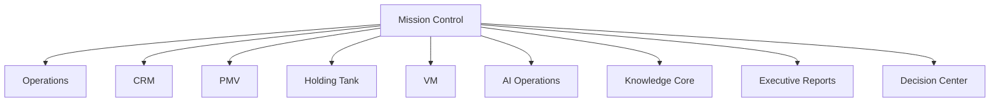
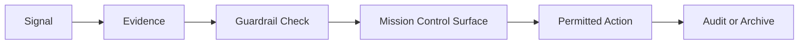

# Mission Control Architecture

Generated: 2026-06-26

<!-- PAGE 001 -->
# Page 1 - Mission Control Source Basis

This handbook is grounded in the governing source set read on 2026-06-26.

- AGENTS.md
- docs/READ-ME-FIRST.md
- docs/AGENT-BRIEFING.md
- docs/locked-spec.md
- docs/build-registry.md
- docs/project-wireframe.md
- apps/admin/src/App.tsx
- apps/admin/src/components/admin-shell.tsx
- apps/admin/src/routes/dashboard.tsx
- apps/admin/src/routes/live-ops.tsx
- apps/admin/src/routes/reports.tsx
- apps/admin/src/routes/agents.tsx
- apps/admin/src/routes/vm.tsx
- server/src/domain/adminMetrics.ts
- server/src/domain/liveOps.ts
- server/src/domain/adminVm.ts
- server/src/domain/auditLog.ts

The governing precedence is: decision ledger, locked spec, design documents, build registry, git log, Gateway chat registry, then handoffs. This handbook does not override those sources. It translates them into the Mission Control operating architecture Kevin requested.

The core command is explicit: do not create another dashboard. The existing Admin Dashboard becomes Mission Control.

Mission Control operating principles:

- Do not create another dashboard. The existing /dashboard route is renamed conceptually and promoted into Mission Control.
- The first screen must answer: what moved, what broke, who needs support, what decision is waiting, and what Kevin should inspect next.
- Every command card must have evidence, freshness, and an action path. If a card cannot produce action or decision, it should be a report footnote, not a Mission Control card.
- Admin authorization remains server-side. The UI can hide, guide, or explain, but requireAdmin and ADMIN_BA_IDS are the hard gate.
- The Mission Control surface must stay dense and operational. No marketing hero, no decorative card collage, no second "executive dashboard" page.
- Compliance boundaries do not loosen because the surface is executive. Prospect-facing rules still govern anything that can reach .com, ScriptMaker, Ivory, notifications, or public preview.

Actual admin surfaces that become Mission Control wings:

| Item | Anchor | Detail |
|---|---|---|
| Mission Control Home | /dashboard / apps/admin/src/routes/dashboard.tsx | Composes FilterBar, MetricsRow, DrilldownPanel, and LiveEventStream. This is the current Core Dashboard and becomes the Mission Control home. |
| BA Oversight | /bas / apps/admin/src/routes/bas.tsx | BA directory, profile drawer, sponsor override flow, leader tag, notes, create/edit/delete/restore. |
| Prospect Oversight | /prospects / apps/admin/src/routes/prospects.tsx | Cross-team prospect directory, detail panel, sandbox preview, notes, interventions, create/edit/delete/restore. |
| Queue Oversight | /queue / apps/admin/src/routes/queue.tsx | Queue depth, queue numbers, visible ticker window, queue rules, admin ticker mirror. |
| Live Operations | /live-ops / apps/admin/src/routes/live-ops.tsx | UsageStrip, GrowthCards, HoldingTankGrid, ConversionFunnel; current file has USE_MOCKS=true and should be flipped only when server endpoints are proven live. |
| Reports | /reports / apps/admin/src/routes/reports.tsx | ExportPanel for standard-report CSV exports with per-export PII redaction; Master Report PDF exists server-side. |
| Audit Log | /audit / apps/admin/src/routes/audit.tsx | Append-only audit view over mcs_audit_log. Audit entries are written by every admin mutation and important read. |
| Tenant Architecture | /tenant / apps/admin/src/routes/tenant.tsx | Master settings, permission matrix, master-content editor, compliance validation, inheritance controls. |
| Broadcast | /broadcast / apps/admin/src/routes/broadcast.tsx | Kevin-only broadcast composer, audience selector, channel selector, send-test-to-Kevin, queue status. |
| Orientation | /orientation / apps/admin/src/routes/orientation.tsx | Founder/admin roster and session creation for group orientation seats. |
| VM Campaigns | /vm / apps/admin/src/routes/vm.tsx | VM campaign oversight: cards, BA analytics, lead batches, campaigns, provider health, hooks, audited ownership-correction intake. |
| Agent Oversight | /agents / apps/admin/src/routes/agents.tsx | Success Profiles, agent interaction summary, memory health, and GraphRAG bridge drafts. |

Actual data contracts used by the second pass:

| Item | Anchor | Detail |
|---|---|---|
| Core metrics | server/src/domain/adminMetrics.ts | Reads brand_ambassadors, pool_placements, and fast_start_progress. Computes active BAs, total BAs, prospects in flow, queue movement 24h, enrollments 24h, and Fast Start completion percentage. |
| Live operations | server/src/domain/liveOps.ts | Reads in-memory SSE counters plus Mongo projections for growth cards, live grid, and prospect or BA-activation conversion funnels. |
| Audit substrate | server/src/domain/auditLog.ts | Append-only writer appendAuditEntry() triple-stacks entries to Mongo mcs_audit_log, Neo4j AuditEntry, and Chroma mcs_audit_log. No update/delete exports exist. |
| VM oversight | server/src/domain/adminVm.ts | Reads vm_lead_batches, vm_bulk_leads, vm_campaigns, vm_delivery_events, prospect_crm_records, and vm_suppression_list. Degrades with warnings when collections are absent. |
| Reports | server/src/domain/reports/* | Standard reports cover BA activation, training completion, invite funnel, queue velocity, enrollment completion, follow-up aging, leader scorecards, and CSV export. |
| Tenant architecture | server/src/domain/adminTenantArchitecture.ts | Controls tenant settings, permission display, master-content versions, validation, and inheritance. |
| BA oversight | server/src/domain/adminBaOversight.ts | Owns BA directory/profile read model, sponsor override audit path, curated leader tagging, and admin notes. |
| Prospect oversight | server/src/domain/adminProspectOversight.ts | Owns cross-team prospect read model, sponsor-routed URL inspection, notes, and intervention actions. |
| Queue oversight | server/src/domain/adminQueueOversight.ts | Owns queue summary, lookup, visible window, rules, and ticker mirror. |
| Broadcast | server/src/domain/broadcast.ts | Owns audience resolution, template interpolation, queue creation, per-recipient rows, STOP exclusion, and send-test flow. |

Coverage requirements included in this book:

- Executive Briefing
- Mission Control
- Operations
- CRM
- PMV
- Holding Tank
- VM
- Training
- Events
- Notifications
- Team News
- AI Operations
- Knowledge Core
- Research
- Testing
- System Health
- Release Status
- Governance
- Architecture
- Constitution
- Analytics
- Widgets
- Cards
- Tabs
- Dashboards
- Metrics
- KPIs
- Alerts
- Executive Reports
- Recommendations
- Morning Briefing
- Decision Center
- Wireframes
- UI Diagrams
- Flowcharts
- State Machines
- Implementation Guidance
- Codex Prompt
- Claude Prompt
- QA Checklist

---
<!-- PAGE 002 -->
# Page 2 - Executive Briefing

The first screen opens with what Kevin needs to know now: mission pulse, active risks, decisions waiting, and recommended next actions. It does not celebrate generic metrics. It briefs the operator.
## Concrete Mission Control Anchors
| Item | Anchor | Detail |
|---|---|---|
| Core Dashboard becomes Mission Control | /dashboard | Keep the route and data foundation; update product framing, home composition, and labels so this is the executive command center. |
| MetricsRow | apps/admin/src/components/dashboard/MetricsRow.tsx | Five current tiles become the first Mission Pulse strip: active BAs, prospects in flow, queue movement, enrollments, and training percentage. |
| LiveEventStream | apps/admin/src/components/dashboard/LiveEventStream.tsx | Placement and audit-tail stream become the right-now pulse inside Mission Control. |
## Command Intent
Mission Control treats "Executive Briefing" as an executive command area, not as a passive information block. The operator should be able to see the current state, inspect the evidence, and move to the next permitted action without leaving the command context unless a full route is needed. Primary drilldowns should preserve the current Mission Control context and then open the relevant existing admin route.
## Data Contract
The data behind this page must identify its source, freshness, owner, and failure mode. MongoDB remains the operational truth, Neo4j supplies relationship context, ChromaDB supplies semantic recall, and the audit log preserves accountable administrative actions. If the source is degraded, the card should show partial truth rather than false certainty.
## Operator Questions
- What changed since Kevin last looked?
- What is the evidence source and how fresh is it?
- What action is permitted from here?
## UI Contract
The UI should use dense admin composition: compact cards, readable tables, drilldown drawers, clear badges, restrained color, and source-aware empty states. Mission Control should use the current admin shell as the frame: left rail for command wings, top header for mission pulse, center lane for executive briefing, right lane for live actions and alerts.
## Operating Contract
The primary action is visible on the card and repeated in the drilldown. If an action changes a record, sends communication, exports data, overrides sponsor or placement state, or changes master content, it must be audited with actor, entity, route, before and after state when available, and severity.
## Implementation Notes
- Preserve current route access and server-side admin authorization while changing product language.
- Prefer composition over rewrites: promote current widgets into Mission Control lanes before inventing new data models.
- Every card needs loading, empty, stale, partial-failure, and drilldown states.
## Compliance Contract
Prospect-facing boundaries remain hard: no income claims, no placement promises, no AI prospecting, no automated prospect calling, no current team head count, and no THREE branding on .com. BA-facing and admin-only surfaces may include training and internal metrics when they remain properly scoped.
## QA Checks
- Auth: non-admin BA receives server-side 403, not just hidden navigation.
- Source: card shows current data source or clear degraded state.
- Action: primary action routes to an existing surface or audited mutation.
- Layout: dense desktop view has no overlapping text and remains readable.

---

<!-- PAGE 003 -->
# Page 3 - Mission Control Doctrine

The existing Admin Dashboard becomes Mission Control. The system must not create a second dashboard, duplicate navigation, or split Kevin attention across parallel command centers.
## Concrete Mission Control Anchors
| Item | Anchor | Detail |
|---|---|---|
| Core Dashboard becomes Mission Control | /dashboard | Keep the route and data foundation; update product framing, home composition, and labels so this is the executive command center. |
| MetricsRow | apps/admin/src/components/dashboard/MetricsRow.tsx | Five current tiles become the first Mission Pulse strip: active BAs, prospects in flow, queue movement, enrollments, and training percentage. |
| LiveEventStream | apps/admin/src/components/dashboard/LiveEventStream.tsx | Placement and audit-tail stream become the right-now pulse inside Mission Control. |
## Command Intent
Mission Control treats "Mission Control Doctrine" as an executive command area, not as a passive information block. The operator should be able to see the current state, inspect the evidence, and move to the next permitted action without leaving the command context unless a full route is needed. Primary drilldowns should preserve the current Mission Control context and then open the relevant existing admin route.
## Data Contract
The data behind this page must identify its source, freshness, owner, and failure mode. MongoDB remains the operational truth, Neo4j supplies relationship context, ChromaDB supplies semantic recall, and the audit log preserves accountable administrative actions. If the source is degraded, the card should show partial truth rather than false certainty.
## Operator Questions
- What changed since Kevin last looked?
- What is the evidence source and how fresh is it?
- What action is permitted from here?
## UI Contract
The UI should use dense admin composition: compact cards, readable tables, drilldown drawers, clear badges, restrained color, and source-aware empty states. Mission Control should use the current admin shell as the frame: left rail for command wings, top header for mission pulse, center lane for executive briefing, right lane for live actions and alerts.
## Operating Contract
The primary action is visible on the card and repeated in the drilldown. If an action changes a record, sends communication, exports data, overrides sponsor or placement state, or changes master content, it must be audited with actor, entity, route, before and after state when available, and severity.
## Implementation Notes
- Preserve current route access and server-side admin authorization while changing product language.
- Prefer composition over rewrites: promote current widgets into Mission Control lanes before inventing new data models.
- Every card needs loading, empty, stale, partial-failure, and drilldown states.
## Compliance Contract
Prospect-facing boundaries remain hard: no income claims, no placement promises, no AI prospecting, no automated prospect calling, no current team head count, and no THREE branding on .com. BA-facing and admin-only surfaces may include training and internal metrics when they remain properly scoped.
## QA Checks
- Auth: non-admin BA receives server-side 403, not just hidden navigation.
- Source: card shows current data source or clear degraded state.
- Action: primary action routes to an existing surface or audited mutation.
- Layout: dense desktop view has no overlapping text and remains readable.

---

<!-- PAGE 004 -->
# Page 4 - Admin Surface Renaming Rule

The route may stay /dashboard during implementation, but the product language changes to Mission Control. Legacy labels are technical aliases only.
## Concrete Mission Control Anchors
| Item | Anchor | Detail |
|---|---|---|
| Mission Control Home | /dashboard | apps/admin/src/routes/dashboard.tsx |
| BA Oversight | /bas | apps/admin/src/routes/bas.tsx |
| Prospect Oversight | /prospects | apps/admin/src/routes/prospects.tsx |
## Command Intent
Mission Control treats "Admin Surface Renaming Rule" as an executive command area, not as a passive information block. The operator should be able to see the current state, inspect the evidence, and move to the next permitted action without leaving the command context unless a full route is needed. Primary drilldowns should preserve the current Mission Control context and then open the relevant existing admin route.
## Data Contract
The data behind this page must identify its source, freshness, owner, and failure mode. MongoDB remains the operational truth, Neo4j supplies relationship context, ChromaDB supplies semantic recall, and the audit log preserves accountable administrative actions. If the source is degraded, the card should show partial truth rather than false certainty.
## Operator Questions
- What changed since Kevin last looked?
- What is the evidence source and how fresh is it?
- What action is permitted from here?
## UI Contract
The UI should use dense admin composition: compact cards, readable tables, drilldown drawers, clear badges, restrained color, and source-aware empty states. Mission Control should use the current admin shell as the frame: left rail for command wings, top header for mission pulse, center lane for executive briefing, right lane for live actions and alerts.
## Operating Contract
The primary action is visible on the card and repeated in the drilldown. If an action changes a record, sends communication, exports data, overrides sponsor or placement state, or changes master content, it must be audited with actor, entity, route, before and after state when available, and severity.
## Implementation Notes
- Preserve current route access and server-side admin authorization while changing product language.
- Prefer composition over rewrites: promote current widgets into Mission Control lanes before inventing new data models.
- Every card needs loading, empty, stale, partial-failure, and drilldown states.
## Compliance Contract
Prospect-facing boundaries remain hard: no income claims, no placement promises, no AI prospecting, no automated prospect calling, no current team head count, and no THREE branding on .com. BA-facing and admin-only surfaces may include training and internal metrics when they remain properly scoped.
## QA Checks
- Auth: non-admin BA receives server-side 403, not just hidden navigation.
- Source: card shows current data source or clear degraded state.
- Action: primary action routes to an existing surface or audited mutation.
- Layout: dense desktop view has no overlapping text and remains readable.

---

<!-- PAGE 005 -->
# Page 5 - North Star

Mission Control exists to help Kevin see who is sharing, who needs help, what is moving, what is stuck, and what decision would create the most momentum today.
## Concrete Mission Control Anchors
| Item | Anchor | Detail |
|---|---|---|
| Mission Control Home | /dashboard | apps/admin/src/routes/dashboard.tsx |
| BA Oversight | /bas | apps/admin/src/routes/bas.tsx |
| Prospect Oversight | /prospects | apps/admin/src/routes/prospects.tsx |
## Command Intent
Mission Control treats "North Star" as an executive command area, not as a passive information block. The operator should be able to see the current state, inspect the evidence, and move to the next permitted action without leaving the command context unless a full route is needed. Primary drilldowns should preserve the current Mission Control context and then open the relevant existing admin route.
## Data Contract
The data behind this page must identify its source, freshness, owner, and failure mode. MongoDB remains the operational truth, Neo4j supplies relationship context, ChromaDB supplies semantic recall, and the audit log preserves accountable administrative actions. If the source is degraded, the card should show partial truth rather than false certainty.
## Operator Questions
- What changed since Kevin last looked?
- What is the evidence source and how fresh is it?
- What action is permitted from here?
## UI Contract
The UI should use dense admin composition: compact cards, readable tables, drilldown drawers, clear badges, restrained color, and source-aware empty states. Mission Control should use the current admin shell as the frame: left rail for command wings, top header for mission pulse, center lane for executive briefing, right lane for live actions and alerts.
## Operating Contract
The primary action is visible on the card and repeated in the drilldown. If an action changes a record, sends communication, exports data, overrides sponsor or placement state, or changes master content, it must be audited with actor, entity, route, before and after state when available, and severity.
## Implementation Notes
- Preserve current route access and server-side admin authorization while changing product language.
- Prefer composition over rewrites: promote current widgets into Mission Control lanes before inventing new data models.
- Every card needs loading, empty, stale, partial-failure, and drilldown states.
## Compliance Contract
Prospect-facing boundaries remain hard: no income claims, no placement promises, no AI prospecting, no automated prospect calling, no current team head count, and no THREE branding on .com. BA-facing and admin-only surfaces may include training and internal metrics when they remain properly scoped.
## QA Checks
- Auth: non-admin BA receives server-side 403, not just hidden navigation.
- Source: card shows current data source or clear degraded state.
- Action: primary action routes to an existing surface or audited mutation.
- Layout: dense desktop view has no overlapping text and remains readable.

---

<!-- PAGE 006 -->
# Page 6 - Authority Boundary

Kevin remains human authority. Mission Control recommends, summarizes, alerts, audits, and routes. It does not make business judgments that belong to Kevin.
## Concrete Mission Control Anchors
| Item | Anchor | Detail |
|---|---|---|
| Mission Control Home | /dashboard | apps/admin/src/routes/dashboard.tsx |
| BA Oversight | /bas | apps/admin/src/routes/bas.tsx |
| Prospect Oversight | /prospects | apps/admin/src/routes/prospects.tsx |
## Command Intent
Mission Control treats "Authority Boundary" as an executive command area, not as a passive information block. The operator should be able to see the current state, inspect the evidence, and move to the next permitted action without leaving the command context unless a full route is needed. Primary drilldowns should preserve the current Mission Control context and then open the relevant existing admin route.
## Data Contract
The data behind this page must identify its source, freshness, owner, and failure mode. MongoDB remains the operational truth, Neo4j supplies relationship context, ChromaDB supplies semantic recall, and the audit log preserves accountable administrative actions. If the source is degraded, the card should show partial truth rather than false certainty.
## Operator Questions
- What changed since Kevin last looked?
- What is the evidence source and how fresh is it?
- What action is permitted from here?
## UI Contract
The UI should use dense admin composition: compact cards, readable tables, drilldown drawers, clear badges, restrained color, and source-aware empty states. Mission Control should use the current admin shell as the frame: left rail for command wings, top header for mission pulse, center lane for executive briefing, right lane for live actions and alerts.
## Operating Contract
The primary action is visible on the card and repeated in the drilldown. If an action changes a record, sends communication, exports data, overrides sponsor or placement state, or changes master content, it must be audited with actor, entity, route, before and after state when available, and severity.
## Implementation Notes
- Preserve current route access and server-side admin authorization while changing product language.
- Prefer composition over rewrites: promote current widgets into Mission Control lanes before inventing new data models.
- Every card needs loading, empty, stale, partial-failure, and drilldown states.
## Compliance Contract
Prospect-facing boundaries remain hard: no income claims, no placement promises, no AI prospecting, no automated prospect calling, no current team head count, and no THREE branding on .com. BA-facing and admin-only surfaces may include training and internal metrics when they remain properly scoped.
## QA Checks
- Auth: non-admin BA receives server-side 403, not just hidden navigation.
- Source: card shows current data source or clear degraded state.
- Action: primary action routes to an existing surface or audited mutation.
- Layout: dense desktop view has no overlapping text and remains readable.

---

<!-- PAGE 007 -->
# Page 7 - Information Architecture

Mission Control becomes the top of the admin surface and links to every existing admin route as a command wing rather than a separate dashboard family.
## Concrete Mission Control Anchors
| Item | Anchor | Detail |
|---|---|---|
| Audit Log | /audit | Append-only operational evidence for admin requests, mutations, exports, overrides, content saves, and blocks. |
| Tenant Architecture | /tenant | Master content, tenant settings, permission matrix, and compliance validation live here. |
| Source hierarchy | docs/READ-ME-FIRST.md | Decision ledger > locked spec > design docs > build registry > git log > chat registry > handoffs. |
## Command Intent
Mission Control treats "Information Architecture" as an executive command area, not as a passive information block. The operator should be able to see the current state, inspect the evidence, and move to the next permitted action without leaving the command context unless a full route is needed. Primary drilldowns should preserve the current Mission Control context and then open the relevant existing admin route.
## Data Contract
The data behind this page must identify its source, freshness, owner, and failure mode. MongoDB remains the operational truth, Neo4j supplies relationship context, ChromaDB supplies semantic recall, and the audit log preserves accountable administrative actions. If the source is degraded, the card should show partial truth rather than false certainty.
## Operator Questions
- What changed since Kevin last looked?
- What is the evidence source and how fresh is it?
- What action is permitted from here?
## UI Contract
The UI should use dense admin composition: compact cards, readable tables, drilldown drawers, clear badges, restrained color, and source-aware empty states. Mission Control should use the current admin shell as the frame: left rail for command wings, top header for mission pulse, center lane for executive briefing, right lane for live actions and alerts.
## Operating Contract
The primary action is visible on the card and repeated in the drilldown. If an action changes a record, sends communication, exports data, overrides sponsor or placement state, or changes master content, it must be audited with actor, entity, route, before and after state when available, and severity.
## Implementation Notes
- Preserve current route access and server-side admin authorization while changing product language.
- Prefer composition over rewrites: promote current widgets into Mission Control lanes before inventing new data models.
- Every card needs loading, empty, stale, partial-failure, and drilldown states.
## Compliance Contract
Prospect-facing boundaries remain hard: no income claims, no placement promises, no AI prospecting, no automated prospect calling, no current team head count, and no THREE branding on .com. BA-facing and admin-only surfaces may include training and internal metrics when they remain properly scoped.
## QA Checks
- Auth: non-admin BA receives server-side 403, not just hidden navigation.
- Source: card shows current data source or clear degraded state.
- Action: primary action routes to an existing surface or audited mutation.
- Layout: dense desktop view has no overlapping text and remains readable.


---

<!-- PAGE 008 -->
# Page 8 - Command Map Diagram

Mission Control is the shell that connects operations, CRM, PMV, holding tank, VM, training, events, notifications, news, AI, knowledge, testing, health, releases, governance, analytics, reports, and decisions.
## Concrete Mission Control Anchors
| Item | Anchor | Detail |
|---|---|---|
| Mission Control Home | /dashboard | apps/admin/src/routes/dashboard.tsx |
| BA Oversight | /bas | apps/admin/src/routes/bas.tsx |
| Prospect Oversight | /prospects | apps/admin/src/routes/prospects.tsx |
## Command Intent
Mission Control treats "Command Map Diagram" as an executive command area, not as a passive information block. The operator should be able to see the current state, inspect the evidence, and move to the next permitted action without leaving the command context unless a full route is needed. Primary drilldowns should preserve the current Mission Control context and then open the relevant existing admin route.
## Data Contract
The data behind this page must identify its source, freshness, owner, and failure mode. MongoDB remains the operational truth, Neo4j supplies relationship context, ChromaDB supplies semantic recall, and the audit log preserves accountable administrative actions. If the source is degraded, the card should show partial truth rather than false certainty.
## Operator Questions
- What changed since Kevin last looked?
- What is the evidence source and how fresh is it?
- What action is permitted from here?
## UI Contract
The UI should use dense admin composition: compact cards, readable tables, drilldown drawers, clear badges, restrained color, and source-aware empty states. Mission Control should use the current admin shell as the frame: left rail for command wings, top header for mission pulse, center lane for executive briefing, right lane for live actions and alerts.
## Operating Contract
The primary action is visible on the card and repeated in the drilldown. If an action changes a record, sends communication, exports data, overrides sponsor or placement state, or changes master content, it must be audited with actor, entity, route, before and after state when available, and severity.
## Implementation Notes
- Preserve current route access and server-side admin authorization while changing product language.
- Prefer composition over rewrites: promote current widgets into Mission Control lanes before inventing new data models.
- Every card needs loading, empty, stale, partial-failure, and drilldown states.
## Compliance Contract
Prospect-facing boundaries remain hard: no income claims, no placement promises, no AI prospecting, no automated prospect calling, no current team head count, and no THREE branding on .com. BA-facing and admin-only surfaces may include training and internal metrics when they remain properly scoped.
## QA Checks
- Auth: non-admin BA receives server-side 403, not just hidden navigation.
- Source: card shows current data source or clear degraded state.
- Action: primary action routes to an existing surface or audited mutation.
- Layout: dense desktop view has no overlapping text and remains readable.

---

<!-- PAGE 009 -->
# Page 9 - Navigation Model

The left rail remains dense and operational. Labels should shift from back-office names to command names while preserving current routes and authorization.
## Concrete Mission Control Anchors
| Item | Anchor | Detail |
|---|---|---|
| Mission Control Home | /dashboard | apps/admin/src/routes/dashboard.tsx |
| BA Oversight | /bas | apps/admin/src/routes/bas.tsx |
| Prospect Oversight | /prospects | apps/admin/src/routes/prospects.tsx |
## Command Intent
Mission Control treats "Navigation Model" as an executive command area, not as a passive information block. The operator should be able to see the current state, inspect the evidence, and move to the next permitted action without leaving the command context unless a full route is needed. Primary drilldowns should preserve the current Mission Control context and then open the relevant existing admin route.
## Data Contract
The data behind this page must identify its source, freshness, owner, and failure mode. MongoDB remains the operational truth, Neo4j supplies relationship context, ChromaDB supplies semantic recall, and the audit log preserves accountable administrative actions. If the source is degraded, the card should show partial truth rather than false certainty.
## Operator Questions
- What changed since Kevin last looked?
- What is the evidence source and how fresh is it?
- What action is permitted from here?
## UI Contract
The UI should use dense admin composition: compact cards, readable tables, drilldown drawers, clear badges, restrained color, and source-aware empty states. Mission Control should use the current admin shell as the frame: left rail for command wings, top header for mission pulse, center lane for executive briefing, right lane for live actions and alerts.
## Operating Contract
The primary action is visible on the card and repeated in the drilldown. If an action changes a record, sends communication, exports data, overrides sponsor or placement state, or changes master content, it must be audited with actor, entity, route, before and after state when available, and severity.
## Implementation Notes
- Preserve current route access and server-side admin authorization while changing product language.
- Prefer composition over rewrites: promote current widgets into Mission Control lanes before inventing new data models.
- Every card needs loading, empty, stale, partial-failure, and drilldown states.
## Compliance Contract
Prospect-facing boundaries remain hard: no income claims, no placement promises, no AI prospecting, no automated prospect calling, no current team head count, and no THREE branding on .com. BA-facing and admin-only surfaces may include training and internal metrics when they remain properly scoped.
## QA Checks
- Auth: non-admin BA receives server-side 403, not just hidden navigation.
- Source: card shows current data source or clear degraded state.
- Action: primary action routes to an existing surface or audited mutation.
- Layout: dense desktop view has no overlapping text and remains readable.

---

<!-- PAGE 010 -->
# Page 10 - Home Grid

The Mission Control home grid combines executive briefing cards, live operations widgets, decision queue, alerts, and recommended actions.
## Concrete Mission Control Anchors
| Item | Anchor | Detail |
|---|---|---|
| Mission Control Home | /dashboard | apps/admin/src/routes/dashboard.tsx |
| BA Oversight | /bas | apps/admin/src/routes/bas.tsx |
| Prospect Oversight | /prospects | apps/admin/src/routes/prospects.tsx |
## Command Intent
Mission Control treats "Home Grid" as an executive command area, not as a passive information block. The operator should be able to see the current state, inspect the evidence, and move to the next permitted action without leaving the command context unless a full route is needed. Primary drilldowns should preserve the current Mission Control context and then open the relevant existing admin route.
## Data Contract
The data behind this page must identify its source, freshness, owner, and failure mode. MongoDB remains the operational truth, Neo4j supplies relationship context, ChromaDB supplies semantic recall, and the audit log preserves accountable administrative actions. If the source is degraded, the card should show partial truth rather than false certainty.
## Operator Questions
- What changed since Kevin last looked?
- What is the evidence source and how fresh is it?
- What action is permitted from here?
## UI Contract
The UI should use dense admin composition: compact cards, readable tables, drilldown drawers, clear badges, restrained color, and source-aware empty states. Mission Control should use the current admin shell as the frame: left rail for command wings, top header for mission pulse, center lane for executive briefing, right lane for live actions and alerts.
## Operating Contract
The primary action is visible on the card and repeated in the drilldown. If an action changes a record, sends communication, exports data, overrides sponsor or placement state, or changes master content, it must be audited with actor, entity, route, before and after state when available, and severity.
## Implementation Notes
- Preserve current route access and server-side admin authorization while changing product language.
- Prefer composition over rewrites: promote current widgets into Mission Control lanes before inventing new data models.
- Every card needs loading, empty, stale, partial-failure, and drilldown states.
## Compliance Contract
Prospect-facing boundaries remain hard: no income claims, no placement promises, no AI prospecting, no automated prospect calling, no current team head count, and no THREE branding on .com. BA-facing and admin-only surfaces may include training and internal metrics when they remain properly scoped.
## QA Checks
- Auth: non-admin BA receives server-side 403, not just hidden navigation.
- Source: card shows current data source or clear degraded state.
- Action: primary action routes to an existing surface or audited mutation.
- Layout: dense desktop view has no overlapping text and remains readable.

---

<!-- PAGE 011 -->
# Page 11 - Non-Dashboard Rule

A dashboard displays status. Mission Control commands action. Every component must answer: what should Kevin see, decide, ask, approve, or inspect next?
## Concrete Mission Control Anchors
| Item | Anchor | Detail |
|---|---|---|
| Core Dashboard becomes Mission Control | /dashboard | Keep the route and data foundation; update product framing, home composition, and labels so this is the executive command center. |
| MetricsRow | apps/admin/src/components/dashboard/MetricsRow.tsx | Five current tiles become the first Mission Pulse strip: active BAs, prospects in flow, queue movement, enrollments, and training percentage. |
| LiveEventStream | apps/admin/src/components/dashboard/LiveEventStream.tsx | Placement and audit-tail stream become the right-now pulse inside Mission Control. |
## Command Intent
Mission Control treats "Non-Dashboard Rule" as an executive command area, not as a passive information block. The operator should be able to see the current state, inspect the evidence, and move to the next permitted action without leaving the command context unless a full route is needed. Primary drilldowns should preserve the current Mission Control context and then open the relevant existing admin route.
## Data Contract
The data behind this page must identify its source, freshness, owner, and failure mode. MongoDB remains the operational truth, Neo4j supplies relationship context, ChromaDB supplies semantic recall, and the audit log preserves accountable administrative actions. If the source is degraded, the card should show partial truth rather than false certainty.
## Operator Questions
- What changed since Kevin last looked?
- What is the evidence source and how fresh is it?
- What action is permitted from here?
## UI Contract
The UI should use dense admin composition: compact cards, readable tables, drilldown drawers, clear badges, restrained color, and source-aware empty states. Mission Control should use the current admin shell as the frame: left rail for command wings, top header for mission pulse, center lane for executive briefing, right lane for live actions and alerts.
## Operating Contract
The primary action is visible on the card and repeated in the drilldown. If an action changes a record, sends communication, exports data, overrides sponsor or placement state, or changes master content, it must be audited with actor, entity, route, before and after state when available, and severity.
## Implementation Notes
- Preserve current route access and server-side admin authorization while changing product language.
- Prefer composition over rewrites: promote current widgets into Mission Control lanes before inventing new data models.
- Every card needs loading, empty, stale, partial-failure, and drilldown states.
## Compliance Contract
Prospect-facing boundaries remain hard: no income claims, no placement promises, no AI prospecting, no automated prospect calling, no current team head count, and no THREE branding on .com. BA-facing and admin-only surfaces may include training and internal metrics when they remain properly scoped.
## QA Checks
- Auth: non-admin BA receives server-side 403, not just hidden navigation.
- Source: card shows current data source or clear degraded state.
- Action: primary action routes to an existing surface or audited mutation.
- Layout: dense desktop view has no overlapping text and remains readable.

---

<!-- PAGE 012 -->
# Page 12 - Operations Wing

Operations covers live activity, daily execution, event flow, broadcast status, gateway health, and operational exceptions.
## Concrete Mission Control Anchors
| Item | Anchor | Detail |
|---|---|---|
| Live Operations | /live-ops | Usage strip, growth windows, holding-tank grid, and conversion funnels supply the live operating lane. |
| Gateway health | server/src/services/gatewayLatency.ts | p50/p95 latency feeds the usage strip and should graduate into System Health cards. |
| Mock warning | apps/admin/src/routes/live-ops.tsx | USE_MOCKS=true means the page must visibly disclose mock mode until live endpoints are proven. |
## Command Intent
Mission Control treats "Operations Wing" as an executive command area, not as a passive information block. The operator should be able to see the current state, inspect the evidence, and move to the next permitted action without leaving the command context unless a full route is needed. Primary drilldowns should preserve the current Mission Control context and then open the relevant existing admin route.
## Data Contract
The data behind this page must identify its source, freshness, owner, and failure mode. MongoDB remains the operational truth, Neo4j supplies relationship context, ChromaDB supplies semantic recall, and the audit log preserves accountable administrative actions. If the source is degraded, the card should show partial truth rather than false certainty.
## Operator Questions
- What changed since Kevin last looked?
- What is the evidence source and how fresh is it?
- What action is permitted from here?
## UI Contract
The UI should use dense admin composition: compact cards, readable tables, drilldown drawers, clear badges, restrained color, and source-aware empty states. Mission Control should use the current admin shell as the frame: left rail for command wings, top header for mission pulse, center lane for executive briefing, right lane for live actions and alerts.
## Operating Contract
The primary action is visible on the card and repeated in the drilldown. If an action changes a record, sends communication, exports data, overrides sponsor or placement state, or changes master content, it must be audited with actor, entity, route, before and after state when available, and severity.
## Implementation Notes
- Preserve current route access and server-side admin authorization while changing product language.
- Prefer composition over rewrites: promote current widgets into Mission Control lanes before inventing new data models.
- Every card needs loading, empty, stale, partial-failure, and drilldown states.
- Do not hide USE_MOCKS or provider dormant states; Mission Control must display degraded truth.
## Compliance Contract
Prospect-facing boundaries remain hard: no income claims, no placement promises, no AI prospecting, no automated prospect calling, no current team head count, and no THREE branding on .com. BA-facing and admin-only surfaces may include training and internal metrics when they remain properly scoped.
## QA Checks
- Auth: non-admin BA receives server-side 403, not just hidden navigation.
- Source: card shows current data source or clear degraded state.
- Action: primary action routes to an existing surface or audited mutation.
- Layout: dense desktop view has no overlapping text and remains readable.

---

<!-- PAGE 013 -->
# Page 13 - CRM Wing

CRM covers BA and prospect relationship memory, follow-up reminders, notes, tags, sponsor context, and respectful next steps.
## Concrete Mission Control Anchors
| Item | Anchor | Detail |
|---|---|---|
| BA Oversight | /bas | BA profile drawer, notes, sponsor override, leader tag, and lifecycle actions are the people command backbone. |
| Prospect Oversight | /prospects | Prospect detail, activity, notes, sponsor-routed URL inspection, and interventions are the prospect command backbone. |
| Cockpit CRM | server/src/domain/crm.ts | BA-facing CRM context must feed Mission Control support recommendations without violating sponsor boundaries. |
## Command Intent
Mission Control treats "CRM Wing" as an executive command area, not as a passive information block. The operator should be able to see the current state, inspect the evidence, and move to the next permitted action without leaving the command context unless a full route is needed. Primary drilldowns should route through /bas, /prospects, cockpit records, and CRM drawers.
## Data Contract
The data behind this page must identify its source, freshness, owner, and failure mode. MongoDB remains the operational truth, Neo4j supplies relationship context, ChromaDB supplies semantic recall, and the audit log preserves accountable administrative actions. If the source is degraded, the card should show partial truth rather than false certainty.
## Operator Questions
- What changed since Kevin last looked?
- What is the evidence source and how fresh is it?
- What action is permitted from here?
- Who needs human support, and who is the right human to provide it?
## UI Contract
The UI should use dense admin composition: compact cards, readable tables, drilldown drawers, clear badges, restrained color, and source-aware empty states. Mission Control should use the current admin shell as the frame: left rail for command wings, top header for mission pulse, center lane for executive briefing, right lane for live actions and alerts.
## Operating Contract
The primary action is to identify who needs human support and route that support through the correct sponsor or founder path. If an action changes a record, sends communication, exports data, overrides sponsor or placement state, or changes master content, it must be audited with actor, entity, route, before and after state when available, and severity.
## Implementation Notes
- Preserve current route access and server-side admin authorization while changing product language.
- Prefer composition over rewrites: promote current widgets into Mission Control lanes before inventing new data models.
- Every card needs loading, empty, stale, partial-failure, and drilldown states.
- Sponsor immutability survives every lookup, recommendation, and re-entry path.
## Compliance Contract
Prospect-facing boundaries remain hard: no income claims, no placement promises, no AI prospecting, no automated prospect calling, no current team head count, and no THREE branding on .com. BA-facing and admin-only surfaces may include training and internal metrics when they remain properly scoped.
## QA Checks
- Auth: non-admin BA receives server-side 403, not just hidden navigation.
- Source: card shows current data source or clear degraded state.
- Action: primary action routes to an existing surface or audited mutation.
- Layout: dense desktop view has no overlapping text and remains readable.

---

<!-- PAGE 014 -->
# Page 14 - PMV Wing

PMV frames the business engine as People -> Momentum -> Volume -> Checks. Prospect-facing surfaces never show checks, CV math, or income claims. Mission Control can inspect PMV internally.
## Concrete Mission Control Anchors
| Item | Anchor | Detail |
|---|---|---|
| People | brand_ambassadors and prospects | People are operational records, not AI-qualified leads. |
| Momentum | invitation_activity and pool_placements | Momentum is sharing, video movement, callbacks, reservations, and first invite progress. |
| Volume and Checks | THREE-authoritative mirror when available | Volume and checks are internal-only, clearly labeled, and never leak to .com. |
## Command Intent
Mission Control treats "PMV Wing" as an executive command area, not as a passive information block. The operator should be able to see the current state, inspect the evidence, and move to the next permitted action without leaving the command context unless a full route is needed. Primary drilldowns should preserve the current Mission Control context and then open the relevant existing admin route.
## Data Contract
The data behind this page must identify its source, freshness, owner, and failure mode. MongoDB remains the operational truth, Neo4j supplies relationship context, ChromaDB supplies semantic recall, and the audit log preserves accountable administrative actions. PMV metrics must label People, Momentum, Volume, and Checks distinctly; Checks never bleed to prospect-facing surfaces.
## Operator Questions
- What changed since Kevin last looked?
- What is the evidence source and how fresh is it?
- What action is permitted from here?
## UI Contract
The UI should use dense admin composition: compact cards, readable tables, drilldown drawers, clear badges, restrained color, and source-aware empty states. Mission Control should use the current admin shell as the frame: left rail for command wings, top header for mission pulse, center lane for executive briefing, right lane for live actions and alerts.
## Operating Contract
The primary action is visible on the card and repeated in the drilldown. If an action changes a record, sends communication, exports data, overrides sponsor or placement state, or changes master content, it must be audited with actor, entity, route, before and after state when available, and severity.
## Implementation Notes
- Preserve current route access and server-side admin authorization while changing product language.
- Prefer composition over rewrites: promote current widgets into Mission Control lanes before inventing new data models.
- Every card needs loading, empty, stale, partial-failure, and drilldown states.
## Compliance Contract
Prospect-facing boundaries remain hard: no income claims, no placement promises, no AI prospecting, no automated prospect calling, no current team head count, and no THREE branding on .com. BA-facing and admin-only surfaces may include training and internal metrics when they remain properly scoped.
## QA Checks
- Auth: non-admin BA receives server-side 403, not just hidden navigation.
- Source: card shows current data source or clear degraded state.
- Action: primary action routes to an existing surface or audited mutation.
- Layout: dense desktop view has no overlapping text and remains readable.

---

<!-- PAGE 015 -->
# Page 15 - Holding Tank Wing

Holding Tank command observes position movement, aging, flush windows, queue integrity, placement events, and intervention history without reshuffling monotonic positions.
## Concrete Mission Control Anchors
| Item | Anchor | Detail |
|---|---|---|
| Queue Oversight | /queue | Queue depth, fixed position lookup, visible-window config, rule management, and admin ticker mirror. |
| Placement model | server/src/domain/holdingTank.ts | Positions are monotonic at video_complete; flushes vacate slots and never renumber. |
| Live grid | /live-ops | HoldingTankGrid gives color-coded age buckets and deep-links to prospect detail. |
## Command Intent
Mission Control treats "Holding Tank Wing" as an executive command area, not as a passive information block. The operator should be able to see the current state, inspect the evidence, and move to the next permitted action without leaving the command context unless a full route is needed. Primary drilldowns should route through /queue, holding-tank records, placement history, and ticker mirrors.
## Data Contract
The data behind this page must identify its source, freshness, owner, and failure mode. MongoDB remains the operational truth, Neo4j supplies relationship context, ChromaDB supplies semantic recall, and the audit log preserves accountable administrative actions. If the source is degraded, the card should show partial truth rather than false certainty.
## Operator Questions
- What changed since Kevin last looked?
- What is the evidence source and how fresh is it?
- What action is permitted from here?
## UI Contract
The UI should use dense admin composition: compact cards, readable tables, drilldown drawers, clear badges, restrained color, and source-aware empty states. Mission Control should use the current admin shell as the frame: left rail for command wings, top header for mission pulse, center lane for executive briefing, right lane for live actions and alerts.
## Operating Contract
The primary action is visible on the card and repeated in the drilldown. If an action changes a record, sends communication, exports data, overrides sponsor or placement state, or changes master content, it must be audited with actor, entity, route, before and after state when available, and severity.
## Implementation Notes
- Preserve current route access and server-side admin authorization while changing product language.
- Prefer composition over rewrites: promote current widgets into Mission Control lanes before inventing new data models.
- Every card needs loading, empty, stale, partial-failure, and drilldown states.
## Compliance Contract
Prospect-facing boundaries remain hard: no income claims, no placement promises, no AI prospecting, no automated prospect calling, no current team head count, and no THREE branding on .com. BA-facing and admin-only surfaces may include training and internal metrics when they remain properly scoped.
## QA Checks
- Auth: non-admin BA receives server-side 403, not just hidden navigation.
- Source: card shows current data source or clear degraded state.
- Action: primary action routes to an existing surface or audited mutation.
- Layout: dense desktop view has no overlapping text and remains readable.

---

<!-- PAGE 016 -->
# Page 16 - VM Wing

VM command observes video message campaigns, import batches, ownership, notification hooks, provider queues, failures, and admin correction requests.
## Concrete Mission Control Anchors
| Item | Anchor | Detail |
|---|---|---|
| VM Campaigns | /vm | Campaign cards, BA analytics, lead batches, provider health, notification hooks, and team-news hooks. |
| Suppression summary | server/src/domain/adminVm.ts | Suppressed leads, opt-outs, DNC flags, invalid phones/emails, and compliance holds are explicit. |
| Ownership correction | /api/admin/vm/ownership-correction | Current flow logs a critical audit request; multi-record mutation waits for the ownership service. |
## Command Intent
Mission Control treats "VM Wing" as an executive command area, not as a passive information block. The operator should be able to see the current state, inspect the evidence, and move to the next permitted action without leaving the command context unless a full route is needed. Primary drilldowns should route through /vm, VM batches, provider queues, and ownership correction flows.
## Data Contract
The data behind this page must identify its source, freshness, owner, and failure mode. MongoDB remains the operational truth, Neo4j supplies relationship context, ChromaDB supplies semantic recall, and the audit log preserves accountable administrative actions. If the source is degraded, the card should show partial truth rather than false certainty.
## Operator Questions
- What changed since Kevin last looked?
- What is the evidence source and how fresh is it?
- What action is permitted from here?
## UI Contract
The UI should use dense admin composition: compact cards, readable tables, drilldown drawers, clear badges, restrained color, and source-aware empty states. Mission Control should use the current admin shell as the frame: left rail for command wings, top header for mission pulse, center lane for executive briefing, right lane for live actions and alerts.
## Operating Contract
The primary action is visible on the card and repeated in the drilldown. If an action changes a record, sends communication, exports data, overrides sponsor or placement state, or changes master content, it must be audited with actor, entity, route, before and after state when available, and severity.
## Implementation Notes
- Preserve current route access and server-side admin authorization while changing product language.
- Prefer composition over rewrites: promote current widgets into Mission Control lanes before inventing new data models.
- Every card needs loading, empty, stale, partial-failure, and drilldown states.
- STOP exclusions and suppression checks are server-side requirements, not UI conveniences.
## Compliance Contract
Prospect-facing boundaries remain hard: no income claims, no placement promises, no AI prospecting, no automated prospect calling, no current team head count, and no THREE branding on .com. BA-facing and admin-only surfaces may include training and internal metrics when they remain properly scoped.
## QA Checks
- Auth: non-admin BA receives server-side 403, not just hidden navigation.
- Source: card shows current data source or clear degraded state.
- Action: primary action routes to an existing surface or audited mutation.
- Layout: dense desktop view has no overlapping text and remains readable.

---

<!-- PAGE 017 -->
# Page 17 - Training Wing

Training command shows Fast Start, orientation, Michael support, Steve discovery, completion, friction, and readiness for action.
## Concrete Mission Control Anchors
| Item | Anchor | Detail |
|---|---|---|
| Training progress | fast_start_progress | Fast Start completion and first-invite requirement define activation movement. |
| Orientation | /orientation | Founder/admin group orientation sessions reuse event/reservation patterns and show rosters. |
| Agents | /agents | Success Profiles and Michael/Steve memory should support humans without classification or scoring. |
## Command Intent
Mission Control treats "Training Wing" as an executive command area, not as a passive information block. The operator should be able to see the current state, inspect the evidence, and move to the next permitted action without leaving the command context unless a full route is needed. Primary drilldowns should route through training, orientation, Steve, Michael, and cockpit support cards.
## Data Contract
The data behind this page must identify its source, freshness, owner, and failure mode. MongoDB remains the operational truth, Neo4j supplies relationship context, ChromaDB supplies semantic recall, and the audit log preserves accountable administrative actions. If the source is degraded, the card should show partial truth rather than false certainty.
## Operator Questions
- What changed since Kevin last looked?
- What is the evidence source and how fresh is it?
- What action is permitted from here?
- Who needs human support, and who is the right human to provide it?
## UI Contract
The UI should use dense admin composition: compact cards, readable tables, drilldown drawers, clear badges, restrained color, and source-aware empty states. Mission Control should use the current admin shell as the frame: left rail for command wings, top header for mission pulse, center lane for executive briefing, right lane for live actions and alerts.
## Operating Contract
The primary action is to identify who needs human support and route that support through the correct sponsor or founder path. If an action changes a record, sends communication, exports data, overrides sponsor or placement state, or changes master content, it must be audited with actor, entity, route, before and after state when available, and severity.
## Implementation Notes
- Preserve current route access and server-side admin authorization while changing product language.
- Prefer composition over rewrites: promote current widgets into Mission Control lanes before inventing new data models.
- Every card needs loading, empty, stale, partial-failure, and drilldown states.
## Compliance Contract
Prospect-facing boundaries remain hard: no income claims, no placement promises, no AI prospecting, no automated prospect calling, no current team head count, and no THREE branding on .com. BA-facing and admin-only surfaces may include training and internal metrics when they remain properly scoped.
## QA Checks
- Auth: non-admin BA receives server-side 403, not just hidden navigation.
- Source: card shows current data source or clear degraded state.
- Action: primary action routes to an existing surface or audited mutation.
- Layout: dense desktop view has no overlapping text and remains readable.

---

<!-- PAGE 018 -->
# Page 18 - Events Wing

Events command shows webinars, orientation sessions, rosters, reservations, capacity, upcoming sessions, host assignments, and follow-up signals.
## Concrete Mission Control Anchors
| Item | Anchor | Detail |
|---|---|---|
| Training progress | fast_start_progress | Fast Start completion and first-invite requirement define activation movement. |
| Orientation | /orientation | Founder/admin group orientation sessions reuse event/reservation patterns and show rosters. |
| Agents | /agents | Success Profiles and Michael/Steve memory should support humans without classification or scoring. |
## Command Intent
Mission Control treats "Events Wing" as an executive command area, not as a passive information block. The operator should be able to see the current state, inspect the evidence, and move to the next permitted action without leaving the command context unless a full route is needed. Primary drilldowns should preserve the current Mission Control context and then open the relevant existing admin route.
## Data Contract
The data behind this page must identify its source, freshness, owner, and failure mode. MongoDB remains the operational truth, Neo4j supplies relationship context, ChromaDB supplies semantic recall, and the audit log preserves accountable administrative actions. If the source is degraded, the card should show partial truth rather than false certainty.
## Operator Questions
- What changed since Kevin last looked?
- What is the evidence source and how fresh is it?
- What action is permitted from here?
## UI Contract
The UI should use dense admin composition: compact cards, readable tables, drilldown drawers, clear badges, restrained color, and source-aware empty states. Mission Control should use the current admin shell as the frame: left rail for command wings, top header for mission pulse, center lane for executive briefing, right lane for live actions and alerts.
## Operating Contract
The primary action is visible on the card and repeated in the drilldown. If an action changes a record, sends communication, exports data, overrides sponsor or placement state, or changes master content, it must be audited with actor, entity, route, before and after state when available, and severity.
## Implementation Notes
- Preserve current route access and server-side admin authorization while changing product language.
- Prefer composition over rewrites: promote current widgets into Mission Control lanes before inventing new data models.
- Every card needs loading, empty, stale, partial-failure, and drilldown states.
## Compliance Contract
Prospect-facing boundaries remain hard: no income claims, no placement promises, no AI prospecting, no automated prospect calling, no current team head count, and no THREE branding on .com. BA-facing and admin-only surfaces may include training and internal metrics when they remain properly scoped.
## QA Checks
- Auth: non-admin BA receives server-side 403, not just hidden navigation.
- Source: card shows current data source or clear degraded state.
- Action: primary action routes to an existing surface or audited mutation.
- Layout: dense desktop view has no overlapping text and remains readable.

---

<!-- PAGE 019 -->
# Page 19 - Notifications Wing

Notifications command governs operational alerts, SMS, email, in-app notices, opt-outs, STOP rules, dormant providers, and failed sends.
## Concrete Mission Control Anchors
| Item | Anchor | Detail |
|---|---|---|
| VM Campaigns | /vm | Campaign cards, BA analytics, lead batches, provider health, notification hooks, and team-news hooks. |
| Suppression summary | server/src/domain/adminVm.ts | Suppressed leads, opt-outs, DNC flags, invalid phones/emails, and compliance holds are explicit. |
| Ownership correction | /api/admin/vm/ownership-correction | Current flow logs a critical audit request; multi-record mutation waits for the ownership service. |
## Command Intent
Mission Control treats "Notifications Wing" as an executive command area, not as a passive information block. The operator should be able to see the current state, inspect the evidence, and move to the next permitted action without leaving the command context unless a full route is needed. Primary drilldowns should preserve the current Mission Control context and then open the relevant existing admin route.
## Data Contract
The data behind this page must identify its source, freshness, owner, and failure mode. MongoDB remains the operational truth, Neo4j supplies relationship context, ChromaDB supplies semantic recall, and the audit log preserves accountable administrative actions. If the source is degraded, the card should show partial truth rather than false certainty.
## Operator Questions
- What changed since Kevin last looked?
- What is the evidence source and how fresh is it?
- What action is permitted from here?
## UI Contract
The UI should use dense admin composition: compact cards, readable tables, drilldown drawers, clear badges, restrained color, and source-aware empty states. Mission Control should use the current admin shell as the frame: left rail for command wings, top header for mission pulse, center lane for executive briefing, right lane for live actions and alerts.
## Operating Contract
The primary action is visible on the card and repeated in the drilldown. If an action changes a record, sends communication, exports data, overrides sponsor or placement state, or changes master content, it must be audited with actor, entity, route, before and after state when available, and severity.
## Implementation Notes
- Preserve current route access and server-side admin authorization while changing product language.
- Prefer composition over rewrites: promote current widgets into Mission Control lanes before inventing new data models.
- Every card needs loading, empty, stale, partial-failure, and drilldown states.
- STOP exclusions and suppression checks are server-side requirements, not UI conveniences.
## Compliance Contract
Prospect-facing boundaries remain hard: no income claims, no placement promises, no AI prospecting, no automated prospect calling, no current team head count, and no THREE branding on .com. BA-facing and admin-only surfaces may include training and internal metrics when they remain properly scoped.
## QA Checks
- Auth: non-admin BA receives server-side 403, not just hidden navigation.
- Source: card shows current data source or clear degraded state.
- Action: primary action routes to an existing surface or audited mutation.
- Layout: dense desktop view has no overlapping text and remains readable.
- Alert: severity, owner, action, and close state are visible.

---

<!-- PAGE 020 -->
# Page 20 - Team News Wing

Team News turns verified milestones into internal news candidates. It never invents results and never promotes claims that compliance would block.
## Concrete Mission Control Anchors
| Item | Anchor | Detail |
|---|---|---|
| VM Campaigns | /vm | Campaign cards, BA analytics, lead batches, provider health, notification hooks, and team-news hooks. |
| Suppression summary | server/src/domain/adminVm.ts | Suppressed leads, opt-outs, DNC flags, invalid phones/emails, and compliance holds are explicit. |
| Ownership correction | /api/admin/vm/ownership-correction | Current flow logs a critical audit request; multi-record mutation waits for the ownership service. |
## Command Intent
Mission Control treats "Team News Wing" as an executive command area, not as a passive information block. The operator should be able to see the current state, inspect the evidence, and move to the next permitted action without leaving the command context unless a full route is needed. Primary drilldowns should preserve the current Mission Control context and then open the relevant existing admin route.
## Data Contract
The data behind this page must identify its source, freshness, owner, and failure mode. MongoDB remains the operational truth, Neo4j supplies relationship context, ChromaDB supplies semantic recall, and the audit log preserves accountable administrative actions. If the source is degraded, the card should show partial truth rather than false certainty.
## Operator Questions
- What changed since Kevin last looked?
- What is the evidence source and how fresh is it?
- What action is permitted from here?
## UI Contract
The UI should use dense admin composition: compact cards, readable tables, drilldown drawers, clear badges, restrained color, and source-aware empty states. Mission Control should use the current admin shell as the frame: left rail for command wings, top header for mission pulse, center lane for executive briefing, right lane for live actions and alerts.
## Operating Contract
The primary action is visible on the card and repeated in the drilldown. If an action changes a record, sends communication, exports data, overrides sponsor or placement state, or changes master content, it must be audited with actor, entity, route, before and after state when available, and severity.
## Implementation Notes
- Preserve current route access and server-side admin authorization while changing product language.
- Prefer composition over rewrites: promote current widgets into Mission Control lanes before inventing new data models.
- Every card needs loading, empty, stale, partial-failure, and drilldown states.
## Compliance Contract
Prospect-facing boundaries remain hard: no income claims, no placement promises, no AI prospecting, no automated prospect calling, no current team head count, and no THREE branding on .com. BA-facing and admin-only surfaces may include training and internal metrics when they remain properly scoped.
## QA Checks
- Auth: non-admin BA receives server-side 403, not just hidden navigation.
- Source: card shows current data source or clear degraded state.
- Action: primary action routes to an existing surface or audited mutation.
- Layout: dense desktop view has no overlapping text and remains readable.

---

<!-- PAGE 021 -->
# Page 21 - AI Operations Wing

AI Operations shows agent status, prompt versions, memory writes, handoffs, recommendation records, and escalation queues.
## Concrete Mission Control Anchors
| Item | Anchor | Detail |
|---|---|---|
| Live Operations | /live-ops | Usage strip, growth windows, holding-tank grid, and conversion funnels supply the live operating lane. |
| Gateway health | server/src/services/gatewayLatency.ts | p50/p95 latency feeds the usage strip and should graduate into System Health cards. |
| Mock warning | apps/admin/src/routes/live-ops.tsx | USE_MOCKS=true means the page must visibly disclose mock mode until live endpoints are proven. |
| Agent Oversight | /agents | Success Profiles, agent interaction summary, memory health, and GraphRAG bridge drafts. |
| Knowledge Core | decision ledger + locked spec + memory stores | Decision ledger and locked spec govern truth; Chroma helps recall but is not authority. |
| Prompt governance | AGENT_PROMPT_GOVERNANCE.md | Prompts are versioned operating assets and must preserve compliance, evidence, and human approval boundaries. |
## Command Intent
Mission Control treats "AI Operations Wing" as an executive command area, not as a passive information block. The operator should be able to see the current state, inspect the evidence, and move to the next permitted action without leaving the command context unless a full route is needed. Primary drilldowns should route through /agents, Knowledge Core, research records, memory lineage, and recommendation queues.
## Data Contract
The data behind this page must identify its source, freshness, owner, and failure mode. MongoDB remains the operational truth, Neo4j supplies relationship context, ChromaDB supplies semantic recall, and the audit log preserves accountable administrative actions. If the source is degraded, the card should show partial truth rather than false certainty.
## Operator Questions
- What changed since Kevin last looked?
- What is the evidence source and how fresh is it?
- What action is permitted from here?
- Which claim is sourced, which is inferred, and which is uncertain?
## UI Contract
The UI should use dense admin composition: compact cards, readable tables, drilldown drawers, clear badges, restrained color, and source-aware empty states. Mission Control should use the current admin shell as the frame: left rail for command wings, top header for mission pulse, center lane for executive briefing, right lane for live actions and alerts.
## Operating Contract
The primary action is visible on the card and repeated in the drilldown. If an action changes a record, sends communication, exports data, overrides sponsor or placement state, or changes master content, it must be audited with actor, entity, route, before and after state when available, and severity.
## Implementation Notes
- Preserve current route access and server-side admin authorization while changing product language.
- Prefer composition over rewrites: promote current widgets into Mission Control lanes before inventing new data models.
- Every card needs loading, empty, stale, partial-failure, and drilldown states.
- Do not hide USE_MOCKS or provider dormant states; Mission Control must display degraded truth.
- AI output must enter as a draft, recommendation, or evidence package unless a human-approved automation already exists.
## Compliance Contract
Prospect-facing boundaries remain hard: no income claims, no placement promises, no AI prospecting, no automated prospect calling, no current team head count, and no THREE branding on .com. BA-facing and admin-only surfaces may include training and internal metrics when they remain properly scoped.
## QA Checks
- Auth: non-admin BA receives server-side 403, not just hidden navigation.
- Source: card shows current data source or clear degraded state.
- Action: primary action routes to an existing surface or audited mutation.
- Layout: dense desktop view has no overlapping text and remains readable.
- Prompt: no fabrication, no autonomous prospecting, no hidden policy, and uncertainty is explicit.

---

<!-- PAGE 022 -->
# Page 22 - Knowledge Core Wing

Knowledge Core exposes source authority, memory freshness, decision lineage, Chroma semantic recall, Neo4j relationships, Mongo operational truth, and schema enforcement.
## Concrete Mission Control Anchors
| Item | Anchor | Detail |
|---|---|---|
| Agent Oversight | /agents | Success Profiles, agent interaction summary, memory health, and GraphRAG bridge drafts. |
| Knowledge Core | decision ledger + locked spec + memory stores | Decision ledger and locked spec govern truth; Chroma helps recall but is not authority. |
| Prompt governance | AGENT_PROMPT_GOVERNANCE.md | Prompts are versioned operating assets and must preserve compliance, evidence, and human approval boundaries. |
## Command Intent
Mission Control treats "Knowledge Core Wing" as an executive command area, not as a passive information block. The operator should be able to see the current state, inspect the evidence, and move to the next permitted action without leaving the command context unless a full route is needed. Primary drilldowns should route through /agents, Knowledge Core, research records, memory lineage, and recommendation queues.
## Data Contract
The data behind this page must identify its source, freshness, owner, and failure mode. MongoDB remains the operational truth, Neo4j supplies relationship context, ChromaDB supplies semantic recall, and the audit log preserves accountable administrative actions. If the source is degraded, the card should show partial truth rather than false certainty.
## Operator Questions
- What changed since Kevin last looked?
- What is the evidence source and how fresh is it?
- What action is permitted from here?
- Which claim is sourced, which is inferred, and which is uncertain?
## UI Contract
The UI should use dense admin composition: compact cards, readable tables, drilldown drawers, clear badges, restrained color, and source-aware empty states. Mission Control should use the current admin shell as the frame: left rail for command wings, top header for mission pulse, center lane for executive briefing, right lane for live actions and alerts.
## Operating Contract
The primary action is visible on the card and repeated in the drilldown. If an action changes a record, sends communication, exports data, overrides sponsor or placement state, or changes master content, it must be audited with actor, entity, route, before and after state when available, and severity.
## Implementation Notes
- Preserve current route access and server-side admin authorization while changing product language.
- Prefer composition over rewrites: promote current widgets into Mission Control lanes before inventing new data models.
- Every card needs loading, empty, stale, partial-failure, and drilldown states.
## Compliance Contract
Prospect-facing boundaries remain hard: no income claims, no placement promises, no AI prospecting, no automated prospect calling, no current team head count, and no THREE branding on .com. BA-facing and admin-only surfaces may include training and internal metrics when they remain properly scoped.
## QA Checks
- Auth: non-admin BA receives server-side 403, not just hidden navigation.
- Source: card shows current data source or clear degraded state.
- Action: primary action routes to an existing surface or audited mutation.
- Layout: dense desktop view has no overlapping text and remains readable.

---

<!-- PAGE 023 -->
# Page 23 - Research Wing

Research command manages source packages, product claim audits, market fact refresh, uncertainty flags, and citation readiness.
## Concrete Mission Control Anchors
| Item | Anchor | Detail |
|---|---|---|
| Agent Oversight | /agents | Success Profiles, agent interaction summary, memory health, and GraphRAG bridge drafts. |
| Knowledge Core | decision ledger + locked spec + memory stores | Decision ledger and locked spec govern truth; Chroma helps recall but is not authority. |
| Prompt governance | AGENT_PROMPT_GOVERNANCE.md | Prompts are versioned operating assets and must preserve compliance, evidence, and human approval boundaries. |
## Command Intent
Mission Control treats "Research Wing" as an executive command area, not as a passive information block. The operator should be able to see the current state, inspect the evidence, and move to the next permitted action without leaving the command context unless a full route is needed. Primary drilldowns should route through /agents, Knowledge Core, research records, memory lineage, and recommendation queues.
## Data Contract
The data behind this page must identify its source, freshness, owner, and failure mode. MongoDB remains the operational truth, Neo4j supplies relationship context, ChromaDB supplies semantic recall, and the audit log preserves accountable administrative actions. If the source is degraded, the card should show partial truth rather than false certainty.
## Operator Questions
- What changed since Kevin last looked?
- What is the evidence source and how fresh is it?
- What action is permitted from here?
- Which claim is sourced, which is inferred, and which is uncertain?
## UI Contract
The UI should use dense admin composition: compact cards, readable tables, drilldown drawers, clear badges, restrained color, and source-aware empty states. Mission Control should use the current admin shell as the frame: left rail for command wings, top header for mission pulse, center lane for executive briefing, right lane for live actions and alerts.
## Operating Contract
The primary action is visible on the card and repeated in the drilldown. If an action changes a record, sends communication, exports data, overrides sponsor or placement state, or changes master content, it must be audited with actor, entity, route, before and after state when available, and severity.
## Implementation Notes
- Preserve current route access and server-side admin authorization while changing product language.
- Prefer composition over rewrites: promote current widgets into Mission Control lanes before inventing new data models.
- Every card needs loading, empty, stale, partial-failure, and drilldown states.
## Compliance Contract
Prospect-facing boundaries remain hard: no income claims, no placement promises, no AI prospecting, no automated prospect calling, no current team head count, and no THREE branding on .com. BA-facing and admin-only surfaces may include training and internal metrics when they remain properly scoped.
## QA Checks
- Auth: non-admin BA receives server-side 403, not just hidden navigation.
- Source: card shows current data source or clear degraded state.
- Action: primary action routes to an existing surface or audited mutation.
- Layout: dense desktop view has no overlapping text and remains readable.

---

<!-- PAGE 024 -->
# Page 24 - Testing Wing

Testing command holds manual flow checks, typecheck status, smoke runs, visual QA, regression risks, and release gates.
## Concrete Mission Control Anchors
| Item | Anchor | Detail |
|---|---|---|
| Live Operations | /live-ops | Usage strip, growth windows, holding-tank grid, and conversion funnels supply the live operating lane. |
| Gateway health | server/src/services/gatewayLatency.ts | p50/p95 latency feeds the usage strip and should graduate into System Health cards. |
| Mock warning | apps/admin/src/routes/live-ops.tsx | USE_MOCKS=true means the page must visibly disclose mock mode until live endpoints are proven. |
## Command Intent
Mission Control treats "Testing Wing" as an executive command area, not as a passive information block. The operator should be able to see the current state, inspect the evidence, and move to the next permitted action without leaving the command context unless a full route is needed. Primary drilldowns should route through system health, release status, test logs, and known-risk panels.
## Data Contract
The data behind this page must identify its source, freshness, owner, and failure mode. MongoDB remains the operational truth, Neo4j supplies relationship context, ChromaDB supplies semantic recall, and the audit log preserves accountable administrative actions. If the source is degraded, the card should show partial truth rather than false certainty.
## Operator Questions
- What changed since Kevin last looked?
- What is the evidence source and how fresh is it?
- What action is permitted from here?
- What verification exists, what risk remains, and what must be held?
## UI Contract
The UI should use dense admin composition: compact cards, readable tables, drilldown drawers, clear badges, restrained color, and source-aware empty states. Mission Control should use the current admin shell as the frame: left rail for command wings, top header for mission pulse, center lane for executive briefing, right lane for live actions and alerts.
## Operating Contract
The primary action is visible on the card and repeated in the drilldown. If an action changes a record, sends communication, exports data, overrides sponsor or placement state, or changes master content, it must be audited with actor, entity, route, before and after state when available, and severity.
## Implementation Notes
- Preserve current route access and server-side admin authorization while changing product language.
- Prefer composition over rewrites: promote current widgets into Mission Control lanes before inventing new data models.
- Every card needs loading, empty, stale, partial-failure, and drilldown states.
## Compliance Contract
Prospect-facing boundaries remain hard: no income claims, no placement promises, no AI prospecting, no automated prospect calling, no current team head count, and no THREE branding on .com. BA-facing and admin-only surfaces may include training and internal metrics when they remain properly scoped.
## QA Checks
- Auth: non-admin BA receives server-side 403, not just hidden navigation.
- Source: card shows current data source or clear degraded state.
- Action: primary action routes to an existing surface or audited mutation.
- Layout: dense desktop view has no overlapping text and remains readable.

---

<!-- PAGE 025 -->
# Page 25 - System Health Wing

System Health shows gateway, Mongo, Neo4j, Chroma, Surreal, Telnyx, Resend, Anthropic, SSE, background workers, and port status.
## Concrete Mission Control Anchors
| Item | Anchor | Detail |
|---|---|---|
| Live Operations | /live-ops | Usage strip, growth windows, holding-tank grid, and conversion funnels supply the live operating lane. |
| Gateway health | server/src/services/gatewayLatency.ts | p50/p95 latency feeds the usage strip and should graduate into System Health cards. |
| Mock warning | apps/admin/src/routes/live-ops.tsx | USE_MOCKS=true means the page must visibly disclose mock mode until live endpoints are proven. |
## Command Intent
Mission Control treats "System Health Wing" as an executive command area, not as a passive information block. The operator should be able to see the current state, inspect the evidence, and move to the next permitted action without leaving the command context unless a full route is needed. Primary drilldowns should route through system health, release status, test logs, and known-risk panels.
## Data Contract
The data behind this page must identify its source, freshness, owner, and failure mode. MongoDB remains the operational truth, Neo4j supplies relationship context, ChromaDB supplies semantic recall, and the audit log preserves accountable administrative actions. If the source is degraded, the card should show partial truth rather than false certainty.
## Operator Questions
- What changed since Kevin last looked?
- What is the evidence source and how fresh is it?
- What action is permitted from here?
- What is broken, who owns mitigation, and what is the close condition?
## UI Contract
The UI should use dense admin composition: compact cards, readable tables, drilldown drawers, clear badges, restrained color, and source-aware empty states. Mission Control should use the current admin shell as the frame: left rail for command wings, top header for mission pulse, center lane for executive briefing, right lane for live actions and alerts.
## Operating Contract
The primary action is visible on the card and repeated in the drilldown. If an action changes a record, sends communication, exports data, overrides sponsor or placement state, or changes master content, it must be audited with actor, entity, route, before and after state when available, and severity.
## Implementation Notes
- Preserve current route access and server-side admin authorization while changing product language.
- Prefer composition over rewrites: promote current widgets into Mission Control lanes before inventing new data models.
- Every card needs loading, empty, stale, partial-failure, and drilldown states.
- Do not hide USE_MOCKS or provider dormant states; Mission Control must display degraded truth.
## Compliance Contract
Prospect-facing boundaries remain hard: no income claims, no placement promises, no AI prospecting, no automated prospect calling, no current team head count, and no THREE branding on .com. BA-facing and admin-only surfaces may include training and internal metrics when they remain properly scoped.
## QA Checks
- Auth: non-admin BA receives server-side 403, not just hidden navigation.
- Source: card shows current data source or clear degraded state.
- Action: primary action routes to an existing surface or audited mutation.
- Layout: dense desktop view has no overlapping text and remains readable.

---

<!-- PAGE 026 -->
# Page 26 - Release Status Wing

Release Status tracks branches, commits, PRs, deployments, version notes, known gaps, rollback posture, and build readiness.
## Concrete Mission Control Anchors
| Item | Anchor | Detail |
|---|---|---|
| Live Operations | /live-ops | Usage strip, growth windows, holding-tank grid, and conversion funnels supply the live operating lane. |
| Gateway health | server/src/services/gatewayLatency.ts | p50/p95 latency feeds the usage strip and should graduate into System Health cards. |
| Mock warning | apps/admin/src/routes/live-ops.tsx | USE_MOCKS=true means the page must visibly disclose mock mode until live endpoints are proven. |
## Command Intent
Mission Control treats "Release Status Wing" as an executive command area, not as a passive information block. The operator should be able to see the current state, inspect the evidence, and move to the next permitted action without leaving the command context unless a full route is needed. Primary drilldowns should route through system health, release status, test logs, and known-risk panels.
## Data Contract
The data behind this page must identify its source, freshness, owner, and failure mode. MongoDB remains the operational truth, Neo4j supplies relationship context, ChromaDB supplies semantic recall, and the audit log preserves accountable administrative actions. If the source is degraded, the card should show partial truth rather than false certainty.
## Operator Questions
- What changed since Kevin last looked?
- What is the evidence source and how fresh is it?
- What action is permitted from here?
- What verification exists, what risk remains, and what must be held?
## UI Contract
The UI should use dense admin composition: compact cards, readable tables, drilldown drawers, clear badges, restrained color, and source-aware empty states. Mission Control should use the current admin shell as the frame: left rail for command wings, top header for mission pulse, center lane for executive briefing, right lane for live actions and alerts.
## Operating Contract
The primary action is to verify release readiness, hold the release, or mark the release ready for Kevin-directed merge. If an action changes a record, sends communication, exports data, overrides sponsor or placement state, or changes master content, it must be audited with actor, entity, route, before and after state when available, and severity.
## Implementation Notes
- Preserve current route access and server-side admin authorization while changing product language.
- Prefer composition over rewrites: promote current widgets into Mission Control lanes before inventing new data models.
- Every card needs loading, empty, stale, partial-failure, and drilldown states.
## Compliance Contract
Prospect-facing boundaries remain hard: no income claims, no placement promises, no AI prospecting, no automated prospect calling, no current team head count, and no THREE branding on .com. BA-facing and admin-only surfaces may include training and internal metrics when they remain properly scoped.
## QA Checks
- Auth: non-admin BA receives server-side 403, not just hidden navigation.
- Source: card shows current data source or clear degraded state.
- Action: primary action routes to an existing surface or audited mutation.
- Layout: dense desktop view has no overlapping text and remains readable.

---

<!-- PAGE 027 -->
# Page 27 - Governance Wing

Governance holds decisions, constitutional rules, compliance severity, data boundaries, admin overrides, and source hierarchy.
## Concrete Mission Control Anchors
| Item | Anchor | Detail |
|---|---|---|
| Audit Log | /audit | Append-only operational evidence for admin requests, mutations, exports, overrides, content saves, and blocks. |
| Tenant Architecture | /tenant | Master content, tenant settings, permission matrix, and compliance validation live here. |
| Source hierarchy | docs/READ-ME-FIRST.md | Decision ledger > locked spec > design docs > build registry > git log > chat registry > handoffs. |
## Command Intent
Mission Control treats "Governance Wing" as an executive command area, not as a passive information block. The operator should be able to see the current state, inspect the evidence, and move to the next permitted action without leaving the command context unless a full route is needed. Primary drilldowns should preserve the current Mission Control context and then open the relevant existing admin route.
## Data Contract
The data behind this page must identify its source, freshness, owner, and failure mode. MongoDB remains the operational truth, Neo4j supplies relationship context, ChromaDB supplies semantic recall, and the audit log preserves accountable administrative actions. If the source is degraded, the card should show partial truth rather than false certainty.
## Operator Questions
- What changed since Kevin last looked?
- What is the evidence source and how fresh is it?
- What action is permitted from here?
## UI Contract
The UI should use dense admin composition: compact cards, readable tables, drilldown drawers, clear badges, restrained color, and source-aware empty states. Mission Control should use the current admin shell as the frame: left rail for command wings, top header for mission pulse, center lane for executive briefing, right lane for live actions and alerts.
## Operating Contract
The primary action is visible on the card and repeated in the drilldown. If an action changes a record, sends communication, exports data, overrides sponsor or placement state, or changes master content, it must be audited with actor, entity, route, before and after state when available, and severity.
## Implementation Notes
- Preserve current route access and server-side admin authorization while changing product language.
- Prefer composition over rewrites: promote current widgets into Mission Control lanes before inventing new data models.
- Every card needs loading, empty, stale, partial-failure, and drilldown states.
- If a rule conflicts with code, surface the conflict; do not silently make code the precedent.
## Compliance Contract
Prospect-facing boundaries remain hard: no income claims, no placement promises, no AI prospecting, no automated prospect calling, no current team head count, and no THREE branding on .com. BA-facing and admin-only surfaces may include training and internal metrics when they remain properly scoped.
## QA Checks
- Auth: non-admin BA receives server-side 403, not just hidden navigation.
- Source: card shows current data source or clear degraded state.
- Action: primary action routes to an existing surface or audited mutation.
- Layout: dense desktop view has no overlapping text and remains readable.

---

<!-- PAGE 028 -->
# Page 28 - Architecture Wing

Architecture maps domains, routes, shared contracts, state machines, event streams, and persistence paths.
## Concrete Mission Control Anchors
| Item | Anchor | Detail |
|---|---|---|
| Audit Log | /audit | Append-only operational evidence for admin requests, mutations, exports, overrides, content saves, and blocks. |
| Tenant Architecture | /tenant | Master content, tenant settings, permission matrix, and compliance validation live here. |
| Source hierarchy | docs/READ-ME-FIRST.md | Decision ledger > locked spec > design docs > build registry > git log > chat registry > handoffs. |
## Command Intent
Mission Control treats "Architecture Wing" as an executive command area, not as a passive information block. The operator should be able to see the current state, inspect the evidence, and move to the next permitted action without leaving the command context unless a full route is needed. Primary drilldowns should preserve the current Mission Control context and then open the relevant existing admin route.
## Data Contract
The data behind this page must identify its source, freshness, owner, and failure mode. MongoDB remains the operational truth, Neo4j supplies relationship context, ChromaDB supplies semantic recall, and the audit log preserves accountable administrative actions. If the source is degraded, the card should show partial truth rather than false certainty.
## Operator Questions
- What changed since Kevin last looked?
- What is the evidence source and how fresh is it?
- What action is permitted from here?
## UI Contract
The UI should use dense admin composition: compact cards, readable tables, drilldown drawers, clear badges, restrained color, and source-aware empty states. Mission Control should use the current admin shell as the frame: left rail for command wings, top header for mission pulse, center lane for executive briefing, right lane for live actions and alerts.
## Operating Contract
The primary action is visible on the card and repeated in the drilldown. If an action changes a record, sends communication, exports data, overrides sponsor or placement state, or changes master content, it must be audited with actor, entity, route, before and after state when available, and severity.
## Implementation Notes
- Preserve current route access and server-side admin authorization while changing product language.
- Prefer composition over rewrites: promote current widgets into Mission Control lanes before inventing new data models.
- Every card needs loading, empty, stale, partial-failure, and drilldown states.
## Compliance Contract
Prospect-facing boundaries remain hard: no income claims, no placement promises, no AI prospecting, no automated prospect calling, no current team head count, and no THREE branding on .com. BA-facing and admin-only surfaces may include training and internal metrics when they remain properly scoped.
## QA Checks
- Auth: non-admin BA receives server-side 403, not just hidden navigation.
- Source: card shows current data source or clear degraded state.
- Action: primary action routes to an existing surface or audited mutation.
- Layout: dense desktop view has no overlapping text and remains readable.

---

<!-- PAGE 029 -->
# Page 29 - Constitution Wing

Constitution turns Kevin rules into durable operating law. It does not override locked spec or the decision ledger.
## Concrete Mission Control Anchors
| Item | Anchor | Detail |
|---|---|---|
| Audit Log | /audit | Append-only operational evidence for admin requests, mutations, exports, overrides, content saves, and blocks. |
| Tenant Architecture | /tenant | Master content, tenant settings, permission matrix, and compliance validation live here. |
| Source hierarchy | docs/READ-ME-FIRST.md | Decision ledger > locked spec > design docs > build registry > git log > chat registry > handoffs. |
## Command Intent
Mission Control treats "Constitution Wing" as an executive command area, not as a passive information block. The operator should be able to see the current state, inspect the evidence, and move to the next permitted action without leaving the command context unless a full route is needed. Primary drilldowns should preserve the current Mission Control context and then open the relevant existing admin route.
## Data Contract
The data behind this page must identify its source, freshness, owner, and failure mode. MongoDB remains the operational truth, Neo4j supplies relationship context, ChromaDB supplies semantic recall, and the audit log preserves accountable administrative actions. If the source is degraded, the card should show partial truth rather than false certainty.
## Operator Questions
- What changed since Kevin last looked?
- What is the evidence source and how fresh is it?
- What action is permitted from here?
## UI Contract
The UI should use dense admin composition: compact cards, readable tables, drilldown drawers, clear badges, restrained color, and source-aware empty states. Mission Control should use the current admin shell as the frame: left rail for command wings, top header for mission pulse, center lane for executive briefing, right lane for live actions and alerts.
## Operating Contract
The primary action is visible on the card and repeated in the drilldown. If an action changes a record, sends communication, exports data, overrides sponsor or placement state, or changes master content, it must be audited with actor, entity, route, before and after state when available, and severity.
## Implementation Notes
- Preserve current route access and server-side admin authorization while changing product language.
- Prefer composition over rewrites: promote current widgets into Mission Control lanes before inventing new data models.
- Every card needs loading, empty, stale, partial-failure, and drilldown states.
- If a rule conflicts with code, surface the conflict; do not silently make code the precedent.
## Compliance Contract
Prospect-facing boundaries remain hard: no income claims, no placement promises, no AI prospecting, no automated prospect calling, no current team head count, and no THREE branding on .com. BA-facing and admin-only surfaces may include training and internal metrics when they remain properly scoped.
## QA Checks
- Auth: non-admin BA receives server-side 403, not just hidden navigation.
- Source: card shows current data source or clear degraded state.
- Action: primary action routes to an existing surface or audited mutation.
- Layout: dense desktop view has no overlapping text and remains readable.

---

<!-- PAGE 030 -->
# Page 30 - Analytics Wing

Analytics converts operational events into answerable questions: share velocity, activation, presentation completion, callback, enrollment, and follow-up aging.
## Concrete Mission Control Anchors
| Item | Anchor | Detail |
|---|---|---|
| People | brand_ambassadors and prospects | People are operational records, not AI-qualified leads. |
| Momentum | invitation_activity and pool_placements | Momentum is sharing, video movement, callbacks, reservations, and first invite progress. |
| Volume and Checks | THREE-authoritative mirror when available | Volume and checks are internal-only, clearly labeled, and never leak to .com. |
## Command Intent
Mission Control treats "Analytics Wing" as an executive command area, not as a passive information block. The operator should be able to see the current state, inspect the evidence, and move to the next permitted action without leaving the command context unless a full route is needed. Primary drilldowns should route through /reports, report exports, master report PDFs, and analytics projections.
## Data Contract
The data behind this page must identify its source, freshness, owner, and failure mode. MongoDB remains the operational truth, Neo4j supplies relationship context, ChromaDB supplies semantic recall, and the audit log preserves accountable administrative actions. Every number needs a numerator, denominator, time window, filter scope, and source collection.
## Operator Questions
- What changed since Kevin last looked?
- What is the evidence source and how fresh is it?
- What action is permitted from here?
- What does this number cause Kevin to do differently today?
## UI Contract
The UI should use dense admin composition: compact cards, readable tables, drilldown drawers, clear badges, restrained color, and source-aware empty states. Mission Control should use the current admin shell as the frame: left rail for command wings, top header for mission pulse, center lane for executive briefing, right lane for live actions and alerts.
## Operating Contract
The primary action is visible on the card and repeated in the drilldown. If an action changes a record, sends communication, exports data, overrides sponsor or placement state, or changes master content, it must be audited with actor, entity, route, before and after state when available, and severity.
## Implementation Notes
- Preserve current route access and server-side admin authorization while changing product language.
- Prefer composition over rewrites: promote current widgets into Mission Control lanes before inventing new data models.
- Every card needs loading, empty, stale, partial-failure, and drilldown states.
## Compliance Contract
Prospect-facing boundaries remain hard: no income claims, no placement promises, no AI prospecting, no automated prospect calling, no current team head count, and no THREE branding on .com. BA-facing and admin-only surfaces may include training and internal metrics when they remain properly scoped.
## QA Checks
- Auth: non-admin BA receives server-side 403, not just hidden navigation.
- Source: card shows current data source or clear degraded state.
- Action: primary action routes to an existing surface or audited mutation.
- Layout: dense desktop view has no overlapping text and remains readable.
- Math: numerator, denominator, time window, filter scope, and null behavior are documented.

---

<!-- PAGE 031 -->
# Page 31 - Widget System

Widgets are small command instruments with a source, freshness, action, confidence, and drilldown path.
## Concrete Mission Control Anchors
| Item | Anchor | Detail |
|---|---|---|
| Admin shell | apps/admin/src/components/admin-shell.tsx | Persistent left rail and dense main slot are the frame for Mission Control. |
| Drilldown pattern | apps/admin/src/components/dashboard/DrilldownPanel.tsx | High-level cards open drilldowns before forcing route changes. |
| Shared contracts | packages/shared/src | Admin contracts should live in shared types when both server and UI consume them. |
## Command Intent
Mission Control treats "Widget System" as an executive command area, not as a passive information block. The operator should be able to see the current state, inspect the evidence, and move to the next permitted action without leaving the command context unless a full route is needed. Primary drilldowns should preserve the current Mission Control context and then open the relevant existing admin route.
## Data Contract
The data behind this page must identify its source, freshness, owner, and failure mode. MongoDB remains the operational truth, Neo4j supplies relationship context, ChromaDB supplies semantic recall, and the audit log preserves accountable administrative actions. If the source is degraded, the card should show partial truth rather than false certainty.
## Operator Questions
- What changed since Kevin last looked?
- What is the evidence source and how fresh is it?
- What action is permitted from here?
## UI Contract
The UI should use dense admin composition: compact cards, readable tables, drilldown drawers, clear badges, restrained color, and source-aware empty states. Mission Control should use the current admin shell as the frame: left rail for command wings, top header for mission pulse, center lane for executive briefing, right lane for live actions and alerts.
## Operating Contract
The primary action is visible on the card and repeated in the drilldown. If an action changes a record, sends communication, exports data, overrides sponsor or placement state, or changes master content, it must be audited with actor, entity, route, before and after state when available, and severity.
## Implementation Notes
- Preserve current route access and server-side admin authorization while changing product language.
- Prefer composition over rewrites: promote current widgets into Mission Control lanes before inventing new data models.
- Every card needs loading, empty, stale, partial-failure, and drilldown states.
## Compliance Contract
Prospect-facing boundaries remain hard: no income claims, no placement promises, no AI prospecting, no automated prospect calling, no current team head count, and no THREE branding on .com. BA-facing and admin-only surfaces may include training and internal metrics when they remain properly scoped.
## QA Checks
- Auth: non-admin BA receives server-side 403, not just hidden navigation.
- Source: card shows current data source or clear degraded state.
- Action: primary action routes to an existing surface or audited mutation.
- Layout: dense desktop view has no overlapping text and remains readable.

---

<!-- PAGE 032 -->
# Page 32 - Card System

Cards summarize one operational truth and one next action. They should never become decorative status tiles.
## Concrete Mission Control Anchors
| Item | Anchor | Detail |
|---|---|---|
| Admin shell | apps/admin/src/components/admin-shell.tsx | Persistent left rail and dense main slot are the frame for Mission Control. |
| Drilldown pattern | apps/admin/src/components/dashboard/DrilldownPanel.tsx | High-level cards open drilldowns before forcing route changes. |
| Shared contracts | packages/shared/src | Admin contracts should live in shared types when both server and UI consume them. |
## Command Intent
Mission Control treats "Card System" as an executive command area, not as a passive information block. The operator should be able to see the current state, inspect the evidence, and move to the next permitted action without leaving the command context unless a full route is needed. Primary drilldowns should preserve the current Mission Control context and then open the relevant existing admin route.
## Data Contract
The data behind this page must identify its source, freshness, owner, and failure mode. MongoDB remains the operational truth, Neo4j supplies relationship context, ChromaDB supplies semantic recall, and the audit log preserves accountable administrative actions. If the source is degraded, the card should show partial truth rather than false certainty.
## Operator Questions
- What changed since Kevin last looked?
- What is the evidence source and how fresh is it?
- What action is permitted from here?
## UI Contract
The UI should use dense admin composition: compact cards, readable tables, drilldown drawers, clear badges, restrained color, and source-aware empty states. Mission Control should use the current admin shell as the frame: left rail for command wings, top header for mission pulse, center lane for executive briefing, right lane for live actions and alerts.
## Operating Contract
The primary action is visible on the card and repeated in the drilldown. If an action changes a record, sends communication, exports data, overrides sponsor or placement state, or changes master content, it must be audited with actor, entity, route, before and after state when available, and severity.
## Implementation Notes
- Preserve current route access and server-side admin authorization while changing product language.
- Prefer composition over rewrites: promote current widgets into Mission Control lanes before inventing new data models.
- Every card needs loading, empty, stale, partial-failure, and drilldown states.
## Compliance Contract
Prospect-facing boundaries remain hard: no income claims, no placement promises, no AI prospecting, no automated prospect calling, no current team head count, and no THREE branding on .com. BA-facing and admin-only surfaces may include training and internal metrics when they remain properly scoped.
## QA Checks
- Auth: non-admin BA receives server-side 403, not just hidden navigation.
- Source: card shows current data source or clear degraded state.
- Action: primary action routes to an existing surface or audited mutation.
- Layout: dense desktop view has no overlapping text and remains readable.

---

<!-- PAGE 033 -->
# Page 33 - Tab System

Tabs divide mental modes inside a wing: overview, queue, exceptions, history, recommendations, and reports.
## Concrete Mission Control Anchors
| Item | Anchor | Detail |
|---|---|---|
| Admin shell | apps/admin/src/components/admin-shell.tsx | Persistent left rail and dense main slot are the frame for Mission Control. |
| Drilldown pattern | apps/admin/src/components/dashboard/DrilldownPanel.tsx | High-level cards open drilldowns before forcing route changes. |
| Shared contracts | packages/shared/src | Admin contracts should live in shared types when both server and UI consume them. |
## Command Intent
Mission Control treats "Tab System" as an executive command area, not as a passive information block. The operator should be able to see the current state, inspect the evidence, and move to the next permitted action without leaving the command context unless a full route is needed. Primary drilldowns should preserve the current Mission Control context and then open the relevant existing admin route.
## Data Contract
The data behind this page must identify its source, freshness, owner, and failure mode. MongoDB remains the operational truth, Neo4j supplies relationship context, ChromaDB supplies semantic recall, and the audit log preserves accountable administrative actions. If the source is degraded, the card should show partial truth rather than false certainty.
## Operator Questions
- What changed since Kevin last looked?
- What is the evidence source and how fresh is it?
- What action is permitted from here?
## UI Contract
The UI should use dense admin composition: compact cards, readable tables, drilldown drawers, clear badges, restrained color, and source-aware empty states. Mission Control should use the current admin shell as the frame: left rail for command wings, top header for mission pulse, center lane for executive briefing, right lane for live actions and alerts.
## Operating Contract
The primary action is visible on the card and repeated in the drilldown. If an action changes a record, sends communication, exports data, overrides sponsor or placement state, or changes master content, it must be audited with actor, entity, route, before and after state when available, and severity.
## Implementation Notes
- Preserve current route access and server-side admin authorization while changing product language.
- Prefer composition over rewrites: promote current widgets into Mission Control lanes before inventing new data models.
- Every card needs loading, empty, stale, partial-failure, and drilldown states.
## Compliance Contract
Prospect-facing boundaries remain hard: no income claims, no placement promises, no AI prospecting, no automated prospect calling, no current team head count, and no THREE branding on .com. BA-facing and admin-only surfaces may include training and internal metrics when they remain properly scoped.
## QA Checks
- Auth: non-admin BA receives server-side 403, not just hidden navigation.
- Source: card shows current data source or clear degraded state.
- Action: primary action routes to an existing surface or audited mutation.
- Layout: dense desktop view has no overlapping text and remains readable.

---

<!-- PAGE 034 -->
# Page 34 - Dashboard Legacy Handling

The word Dashboard may remain in file names where useful. The product concept is Mission Control, and new copy should say Mission Control.
## Concrete Mission Control Anchors
| Item | Anchor | Detail |
|---|---|---|
| Core Dashboard becomes Mission Control | /dashboard | Keep the route and data foundation; update product framing, home composition, and labels so this is the executive command center. |
| MetricsRow | apps/admin/src/components/dashboard/MetricsRow.tsx | Five current tiles become the first Mission Pulse strip: active BAs, prospects in flow, queue movement, enrollments, and training percentage. |
| LiveEventStream | apps/admin/src/components/dashboard/LiveEventStream.tsx | Placement and audit-tail stream become the right-now pulse inside Mission Control. |
## Command Intent
Mission Control treats "Dashboard Legacy Handling" as an executive command area, not as a passive information block. The operator should be able to see the current state, inspect the evidence, and move to the next permitted action without leaving the command context unless a full route is needed. Primary drilldowns should preserve the current Mission Control context and then open the relevant existing admin route.
## Data Contract
The data behind this page must identify its source, freshness, owner, and failure mode. MongoDB remains the operational truth, Neo4j supplies relationship context, ChromaDB supplies semantic recall, and the audit log preserves accountable administrative actions. If the source is degraded, the card should show partial truth rather than false certainty.
## Operator Questions
- What changed since Kevin last looked?
- What is the evidence source and how fresh is it?
- What action is permitted from here?
## UI Contract
The UI should use dense admin composition: compact cards, readable tables, drilldown drawers, clear badges, restrained color, and source-aware empty states. Mission Control should use the current admin shell as the frame: left rail for command wings, top header for mission pulse, center lane for executive briefing, right lane for live actions and alerts.
## Operating Contract
The primary action is visible on the card and repeated in the drilldown. If an action changes a record, sends communication, exports data, overrides sponsor or placement state, or changes master content, it must be audited with actor, entity, route, before and after state when available, and severity.
## Implementation Notes
- Preserve current route access and server-side admin authorization while changing product language.
- Prefer composition over rewrites: promote current widgets into Mission Control lanes before inventing new data models.
- Every card needs loading, empty, stale, partial-failure, and drilldown states.
## Compliance Contract
Prospect-facing boundaries remain hard: no income claims, no placement promises, no AI prospecting, no automated prospect calling, no current team head count, and no THREE branding on .com. BA-facing and admin-only surfaces may include training and internal metrics when they remain properly scoped.
## QA Checks
- Auth: non-admin BA receives server-side 403, not just hidden navigation.
- Source: card shows current data source or clear degraded state.
- Action: primary action routes to an existing surface or audited mutation.
- Layout: dense desktop view has no overlapping text and remains readable.

---

<!-- PAGE 035 -->
# Page 35 - Metric Contract

Every metric must declare owner, numerator, denominator, time window, source collection, refresh mode, and whether it is leading or lagging.
## Concrete Mission Control Anchors
| Item | Anchor | Detail |
|---|---|---|
| People | brand_ambassadors and prospects | People are operational records, not AI-qualified leads. |
| Momentum | invitation_activity and pool_placements | Momentum is sharing, video movement, callbacks, reservations, and first invite progress. |
| Volume and Checks | THREE-authoritative mirror when available | Volume and checks are internal-only, clearly labeled, and never leak to .com. |
## Command Intent
Mission Control treats "Metric Contract" as an executive command area, not as a passive information block. The operator should be able to see the current state, inspect the evidence, and move to the next permitted action without leaving the command context unless a full route is needed. Primary drilldowns should route through /reports, report exports, master report PDFs, and analytics projections.
## Data Contract
The data behind this page must identify its source, freshness, owner, and failure mode. MongoDB remains the operational truth, Neo4j supplies relationship context, ChromaDB supplies semantic recall, and the audit log preserves accountable administrative actions. Every number needs a numerator, denominator, time window, filter scope, and source collection.
## Operator Questions
- What changed since Kevin last looked?
- What is the evidence source and how fresh is it?
- What action is permitted from here?
- What does this number cause Kevin to do differently today?
## UI Contract
The UI should use dense admin composition: compact cards, readable tables, drilldown drawers, clear badges, restrained color, and source-aware empty states. Mission Control should use the current admin shell as the frame: left rail for command wings, top header for mission pulse, center lane for executive briefing, right lane for live actions and alerts.
## Operating Contract
The primary action is visible on the card and repeated in the drilldown. If an action changes a record, sends communication, exports data, overrides sponsor or placement state, or changes master content, it must be audited with actor, entity, route, before and after state when available, and severity.
## Implementation Notes
- Preserve current route access and server-side admin authorization while changing product language.
- Prefer composition over rewrites: promote current widgets into Mission Control lanes before inventing new data models.
- Every card needs loading, empty, stale, partial-failure, and drilldown states.
## Compliance Contract
Prospect-facing boundaries remain hard: no income claims, no placement promises, no AI prospecting, no automated prospect calling, no current team head count, and no THREE branding on .com. BA-facing and admin-only surfaces may include training and internal metrics when they remain properly scoped.
## QA Checks
- Auth: non-admin BA receives server-side 403, not just hidden navigation.
- Source: card shows current data source or clear degraded state.
- Action: primary action routes to an existing surface or audited mutation.
- Layout: dense desktop view has no overlapping text and remains readable.
- Math: numerator, denominator, time window, filter scope, and null behavior are documented.

---

<!-- PAGE 036 -->
# Page 36 - KPI Contract

KPIs are promoted metrics that Kevin uses to steer action. Leading KPIs outrank vanity numbers. Invitations sent per day remains the primary BA action metric.
## Concrete Mission Control Anchors
| Item | Anchor | Detail |
|---|---|---|
| People | brand_ambassadors and prospects | People are operational records, not AI-qualified leads. |
| Momentum | invitation_activity and pool_placements | Momentum is sharing, video movement, callbacks, reservations, and first invite progress. |
| Volume and Checks | THREE-authoritative mirror when available | Volume and checks are internal-only, clearly labeled, and never leak to .com. |
## Command Intent
Mission Control treats "KPI Contract" as an executive command area, not as a passive information block. The operator should be able to see the current state, inspect the evidence, and move to the next permitted action without leaving the command context unless a full route is needed. Primary drilldowns should route through /reports, report exports, master report PDFs, and analytics projections.
## Data Contract
The data behind this page must identify its source, freshness, owner, and failure mode. MongoDB remains the operational truth, Neo4j supplies relationship context, ChromaDB supplies semantic recall, and the audit log preserves accountable administrative actions. Every number needs a numerator, denominator, time window, filter scope, and source collection.
## Operator Questions
- What changed since Kevin last looked?
- What is the evidence source and how fresh is it?
- What action is permitted from here?
- What does this number cause Kevin to do differently today?
## UI Contract
The UI should use dense admin composition: compact cards, readable tables, drilldown drawers, clear badges, restrained color, and source-aware empty states. Mission Control should use the current admin shell as the frame: left rail for command wings, top header for mission pulse, center lane for executive briefing, right lane for live actions and alerts.
## Operating Contract
The primary action is visible on the card and repeated in the drilldown. If an action changes a record, sends communication, exports data, overrides sponsor or placement state, or changes master content, it must be audited with actor, entity, route, before and after state when available, and severity.
## Implementation Notes
- Preserve current route access and server-side admin authorization while changing product language.
- Prefer composition over rewrites: promote current widgets into Mission Control lanes before inventing new data models.
- Every card needs loading, empty, stale, partial-failure, and drilldown states.
## Compliance Contract
Prospect-facing boundaries remain hard: no income claims, no placement promises, no AI prospecting, no automated prospect calling, no current team head count, and no THREE branding on .com. BA-facing and admin-only surfaces may include training and internal metrics when they remain properly scoped.
## QA Checks
- Auth: non-admin BA receives server-side 403, not just hidden navigation.
- Source: card shows current data source or clear degraded state.
- Action: primary action routes to an existing surface or audited mutation.
- Layout: dense desktop view has no overlapping text and remains readable.
- Math: numerator, denominator, time window, filter scope, and null behavior are documented.

---

<!-- PAGE 037 -->
# Page 37 - Alert Contract

Alerts must say what happened, why it matters, who owns it, how urgent it is, and what action is permitted. Alerts do not imply income, placement promises, or automated outreach.
## Concrete Mission Control Anchors
| Item | Anchor | Detail |
|---|---|---|
| Mission Control Home | /dashboard | apps/admin/src/routes/dashboard.tsx |
| BA Oversight | /bas | apps/admin/src/routes/bas.tsx |
| Prospect Oversight | /prospects | apps/admin/src/routes/prospects.tsx |
## Command Intent
Mission Control treats "Alert Contract" as an executive command area, not as a passive information block. The operator should be able to see the current state, inspect the evidence, and move to the next permitted action without leaving the command context unless a full route is needed. Primary drilldowns should preserve the current Mission Control context and then open the relevant existing admin route.
## Data Contract
The data behind this page must identify its source, freshness, owner, and failure mode. MongoDB remains the operational truth, Neo4j supplies relationship context, ChromaDB supplies semantic recall, and the audit log preserves accountable administrative actions. Every alert needs severity, owner, permitted action, and close condition.
## Operator Questions
- What changed since Kevin last looked?
- What is the evidence source and how fresh is it?
- What action is permitted from here?
- What is broken, who owns mitigation, and what is the close condition?
## UI Contract
The UI should use dense admin composition: compact cards, readable tables, drilldown drawers, clear badges, restrained color, and source-aware empty states. Mission Control should use the current admin shell as the frame: left rail for command wings, top header for mission pulse, center lane for executive briefing, right lane for live actions and alerts.
## Operating Contract
The primary action is to acknowledge, assign, mitigate, close, or escalate the alert. If an action changes a record, sends communication, exports data, overrides sponsor or placement state, or changes master content, it must be audited with actor, entity, route, before and after state when available, and severity.
## Implementation Notes
- Preserve current route access and server-side admin authorization while changing product language.
- Prefer composition over rewrites: promote current widgets into Mission Control lanes before inventing new data models.
- Every card needs loading, empty, stale, partial-failure, and drilldown states.
## Compliance Contract
Prospect-facing boundaries remain hard: no income claims, no placement promises, no AI prospecting, no automated prospect calling, no current team head count, and no THREE branding on .com. BA-facing and admin-only surfaces may include training and internal metrics when they remain properly scoped.
## QA Checks
- Auth: non-admin BA receives server-side 403, not just hidden navigation.
- Source: card shows current data source or clear degraded state.
- Action: primary action routes to an existing surface or audited mutation.
- Layout: dense desktop view has no overlapping text and remains readable.
- Alert: severity, owner, action, and close state are visible.

---

<!-- PAGE 038 -->
# Page 38 - Executive Reports

Reports must be printable, source-hashed where appropriate, and written in decision language rather than dashboard language.
## Concrete Mission Control Anchors
| Item | Anchor | Detail |
|---|---|---|
| Core Dashboard becomes Mission Control | /dashboard | Keep the route and data foundation; update product framing, home composition, and labels so this is the executive command center. |
| MetricsRow | apps/admin/src/components/dashboard/MetricsRow.tsx | Five current tiles become the first Mission Pulse strip: active BAs, prospects in flow, queue movement, enrollments, and training percentage. |
| LiveEventStream | apps/admin/src/components/dashboard/LiveEventStream.tsx | Placement and audit-tail stream become the right-now pulse inside Mission Control. |
| Reports | /reports | ExportPanel issues CSV exports for standard reports. Redaction choice is required every export. |
| Master Report | /api/admin/reporting/master-report.pdf | PDF composites the core dashboard and report library with verifiability footer. |
| PII redaction | server/src/services/piiRedact.ts | Prospect first/last name, phone, and email are redacted when Kevin chooses redacted export. |
## Command Intent
Mission Control treats "Executive Reports" as an executive command area, not as a passive information block. The operator should be able to see the current state, inspect the evidence, and move to the next permitted action without leaving the command context unless a full route is needed. Primary drilldowns should route through /reports, report exports, master report PDFs, and analytics projections.
## Data Contract
The data behind this page must identify its source, freshness, owner, and failure mode. MongoDB remains the operational truth, Neo4j supplies relationship context, ChromaDB supplies semantic recall, and the audit log preserves accountable administrative actions. Every report needs filter scope, generated time, redaction state when applicable, and audit proof.
## Operator Questions
- What changed since Kevin last looked?
- What is the evidence source and how fresh is it?
- What action is permitted from here?
- What does this number cause Kevin to do differently today?
## UI Contract
The UI should use dense admin composition: compact cards, readable tables, drilldown drawers, clear badges, restrained color, and source-aware empty states. Mission Control should use the current admin shell as the frame: left rail for command wings, top header for mission pulse, center lane for executive briefing, right lane for live actions and alerts.
## Operating Contract
The primary action is to generate, inspect, print, export, or archive the report with the correct redaction choice. If an action changes a record, sends communication, exports data, overrides sponsor or placement state, or changes master content, it must be audited with actor, entity, route, before and after state when available, and severity.
## Implementation Notes
- Preserve current route access and server-side admin authorization while changing product language.
- Prefer composition over rewrites: promote current widgets into Mission Control lanes before inventing new data models.
- Every card needs loading, empty, stale, partial-failure, and drilldown states.
- Keep the per-export redaction modal; never persist a raw-export preference.
## Compliance Contract
Prospect-facing boundaries remain hard: no income claims, no placement promises, no AI prospecting, no automated prospect calling, no current team head count, and no THREE branding on .com. BA-facing and admin-only surfaces may include training and internal metrics when they remain properly scoped.
## QA Checks
- Auth: non-admin BA receives server-side 403, not just hidden navigation.
- Source: card shows current data source or clear degraded state.
- Action: primary action routes to an existing surface or audited mutation.
- Layout: dense desktop view has no overlapping text and remains readable.
- Export: redaction choice is audited and CSV/PDF output opens cleanly.

---

<!-- PAGE 039 -->
# Page 39 - Recommendations

Recommendations are evidence-backed proposals. They carry confidence, evidence, risk, reversible path, and required human approval.
## Concrete Mission Control Anchors
| Item | Anchor | Detail |
|---|---|---|
| Core Dashboard becomes Mission Control | /dashboard | Keep the route and data foundation; update product framing, home composition, and labels so this is the executive command center. |
| MetricsRow | apps/admin/src/components/dashboard/MetricsRow.tsx | Five current tiles become the first Mission Pulse strip: active BAs, prospects in flow, queue movement, enrollments, and training percentage. |
| LiveEventStream | apps/admin/src/components/dashboard/LiveEventStream.tsx | Placement and audit-tail stream become the right-now pulse inside Mission Control. |
## Command Intent
Mission Control treats "Recommendations" as an executive command area, not as a passive information block. The operator should be able to see the current state, inspect the evidence, and move to the next permitted action without leaving the command context unless a full route is needed. Primary drilldowns should preserve the current Mission Control context and then open the relevant existing admin route.
## Data Contract
The data behind this page must identify its source, freshness, owner, and failure mode. MongoDB remains the operational truth, Neo4j supplies relationship context, ChromaDB supplies semantic recall, and the audit log preserves accountable administrative actions. Every decision or recommendation needs evidence references, confidence, risk, and disposition.
## Operator Questions
- What changed since Kevin last looked?
- What is the evidence source and how fresh is it?
- What action is permitted from here?
## UI Contract
The UI should use dense admin composition: compact cards, readable tables, drilldown drawers, clear badges, restrained color, and source-aware empty states. Mission Control should use the current admin shell as the frame: left rail for command wings, top header for mission pulse, center lane for executive briefing, right lane for live actions and alerts.
## Operating Contract
The primary action is to review the evidence, approve a next step, dismiss it, or request more research. If an action changes a record, sends communication, exports data, overrides sponsor or placement state, or changes master content, it must be audited with actor, entity, route, before and after state when available, and severity.
## Implementation Notes
- Preserve current route access and server-side admin authorization while changing product language.
- Prefer composition over rewrites: promote current widgets into Mission Control lanes before inventing new data models.
- Every card needs loading, empty, stale, partial-failure, and drilldown states.
- AI output must enter as a draft, recommendation, or evidence package unless a human-approved automation already exists.
## Compliance Contract
Prospect-facing boundaries remain hard: no income claims, no placement promises, no AI prospecting, no automated prospect calling, no current team head count, and no THREE branding on .com. BA-facing and admin-only surfaces may include training and internal metrics when they remain properly scoped.
## QA Checks
- Auth: non-admin BA receives server-side 403, not just hidden navigation.
- Source: card shows current data source or clear degraded state.
- Action: primary action routes to an existing surface or audited mutation.
- Layout: dense desktop view has no overlapping text and remains readable.

---

<!-- PAGE 040 -->
# Page 40 - Morning Briefing

Morning Briefing is the daily executive package: overnight movement, today priorities, people needing support, live events, risks, and decisions.
## Concrete Mission Control Anchors
| Item | Anchor | Detail |
|---|---|---|
| Core Dashboard becomes Mission Control | /dashboard | Keep the route and data foundation; update product framing, home composition, and labels so this is the executive command center. |
| MetricsRow | apps/admin/src/components/dashboard/MetricsRow.tsx | Five current tiles become the first Mission Pulse strip: active BAs, prospects in flow, queue movement, enrollments, and training percentage. |
| LiveEventStream | apps/admin/src/components/dashboard/LiveEventStream.tsx | Placement and audit-tail stream become the right-now pulse inside Mission Control. |
## Command Intent
Mission Control treats "Morning Briefing" as an executive command area, not as a passive information block. The operator should be able to see the current state, inspect the evidence, and move to the next permitted action without leaving the command context unless a full route is needed. Primary drilldowns should preserve the current Mission Control context and then open the relevant existing admin route.
## Data Contract
The data behind this page must identify its source, freshness, owner, and failure mode. MongoDB remains the operational truth, Neo4j supplies relationship context, ChromaDB supplies semantic recall, and the audit log preserves accountable administrative actions. If the source is degraded, the card should show partial truth rather than false certainty.
## Operator Questions
- What changed since Kevin last looked?
- What is the evidence source and how fresh is it?
- What action is permitted from here?
## UI Contract
The UI should use dense admin composition: compact cards, readable tables, drilldown drawers, clear badges, restrained color, and source-aware empty states. Mission Control should use the current admin shell as the frame: left rail for command wings, top header for mission pulse, center lane for executive briefing, right lane for live actions and alerts.
## Operating Contract
The primary action is visible on the card and repeated in the drilldown. If an action changes a record, sends communication, exports data, overrides sponsor or placement state, or changes master content, it must be audited with actor, entity, route, before and after state when available, and severity.
## Implementation Notes
- Preserve current route access and server-side admin authorization while changing product language.
- Prefer composition over rewrites: promote current widgets into Mission Control lanes before inventing new data models.
- Every card needs loading, empty, stale, partial-failure, and drilldown states.
## Compliance Contract
Prospect-facing boundaries remain hard: no income claims, no placement promises, no AI prospecting, no automated prospect calling, no current team head count, and no THREE branding on .com. BA-facing and admin-only surfaces may include training and internal metrics when they remain properly scoped.
## QA Checks
- Auth: non-admin BA receives server-side 403, not just hidden navigation.
- Source: card shows current data source or clear degraded state.
- Action: primary action routes to an existing surface or audited mutation.
- Layout: dense desktop view has no overlapping text and remains readable.

---

<!-- PAGE 041 -->
# Page 41 - Decision Center

Decision Center is the queue where Mission Control asks Kevin for decisions with context, options, evidence, recommendation, and consequence.
## Concrete Mission Control Anchors
| Item | Anchor | Detail |
|---|---|---|
| Core Dashboard becomes Mission Control | /dashboard | Keep the route and data foundation; update product framing, home composition, and labels so this is the executive command center. |
| MetricsRow | apps/admin/src/components/dashboard/MetricsRow.tsx | Five current tiles become the first Mission Pulse strip: active BAs, prospects in flow, queue movement, enrollments, and training percentage. |
| LiveEventStream | apps/admin/src/components/dashboard/LiveEventStream.tsx | Placement and audit-tail stream become the right-now pulse inside Mission Control. |
## Command Intent
Mission Control treats "Decision Center" as an executive command area, not as a passive information block. The operator should be able to see the current state, inspect the evidence, and move to the next permitted action without leaving the command context unless a full route is needed. Primary drilldowns should preserve the current Mission Control context and then open the relevant existing admin route.
## Data Contract
The data behind this page must identify its source, freshness, owner, and failure mode. MongoDB remains the operational truth, Neo4j supplies relationship context, ChromaDB supplies semantic recall, and the audit log preserves accountable administrative actions. Every decision or recommendation needs evidence references, confidence, risk, and disposition.
## Operator Questions
- What changed since Kevin last looked?
- What is the evidence source and how fresh is it?
- What action is permitted from here?
- What answer is needed from Kevin, and what happens if it is deferred?
## UI Contract
The UI should use dense admin composition: compact cards, readable tables, drilldown drawers, clear badges, restrained color, and source-aware empty states. Mission Control should use the current admin shell as the frame: left rail for command wings, top header for mission pulse, center lane for executive briefing, right lane for live actions and alerts.
## Operating Contract
The primary action is to accept, reject, amend, or defer a decision and write the result to the decision ledger. If an action changes a record, sends communication, exports data, overrides sponsor or placement state, or changes master content, it must be audited with actor, entity, route, before and after state when available, and severity.
## Implementation Notes
- Preserve current route access and server-side admin authorization while changing product language.
- Prefer composition over rewrites: promote current widgets into Mission Control lanes before inventing new data models.
- Every card needs loading, empty, stale, partial-failure, and drilldown states.
## Compliance Contract
Prospect-facing boundaries remain hard: no income claims, no placement promises, no AI prospecting, no automated prospect calling, no current team head count, and no THREE branding on .com. BA-facing and admin-only surfaces may include training and internal metrics when they remain properly scoped.
## QA Checks
- Auth: non-admin BA receives server-side 403, not just hidden navigation.
- Source: card shows current data source or clear degraded state.
- Action: primary action routes to an existing surface or audited mutation.
- Layout: dense desktop view has no overlapping text and remains readable.

---

<!-- PAGE 042 -->
# Page 42 - Wireframe Overview

Mission Control uses a command header, left rail, briefing lane, action lane, live lane, and drilldown drawers.
## Concrete Mission Control Anchors
| Item | Anchor | Detail |
|---|---|---|
| Admin shell | apps/admin/src/components/admin-shell.tsx | Persistent left rail and dense main slot are the frame for Mission Control. |
| Drilldown pattern | apps/admin/src/components/dashboard/DrilldownPanel.tsx | High-level cards open drilldowns before forcing route changes. |
| Shared contracts | packages/shared/src | Admin contracts should live in shared types when both server and UI consume them. |
## Command Intent
Mission Control treats "Wireframe Overview" as an executive command area, not as a passive information block. The operator should be able to see the current state, inspect the evidence, and move to the next permitted action without leaving the command context unless a full route is needed. Primary drilldowns should preserve the current Mission Control context and then open the relevant existing admin route.
## Data Contract
The data behind this page must identify its source, freshness, owner, and failure mode. MongoDB remains the operational truth, Neo4j supplies relationship context, ChromaDB supplies semantic recall, and the audit log preserves accountable administrative actions. If the source is degraded, the card should show partial truth rather than false certainty.
## Operator Questions
- What changed since Kevin last looked?
- What is the evidence source and how fresh is it?
- What action is permitted from here?
## UI Contract
The UI should use dense admin composition: compact cards, readable tables, drilldown drawers, clear badges, restrained color, and source-aware empty states. Mission Control should use the current admin shell as the frame: left rail for command wings, top header for mission pulse, center lane for executive briefing, right lane for live actions and alerts.
## Operating Contract
The primary action is visible on the card and repeated in the drilldown. If an action changes a record, sends communication, exports data, overrides sponsor or placement state, or changes master content, it must be audited with actor, entity, route, before and after state when available, and severity.
## Implementation Notes
- Preserve current route access and server-side admin authorization while changing product language.
- Prefer composition over rewrites: promote current widgets into Mission Control lanes before inventing new data models.
- Every card needs loading, empty, stale, partial-failure, and drilldown states.
## Compliance Contract
Prospect-facing boundaries remain hard: no income claims, no placement promises, no AI prospecting, no automated prospect calling, no current team head count, and no THREE branding on .com. BA-facing and admin-only surfaces may include training and internal metrics when they remain properly scoped.
## QA Checks
- Auth: non-admin BA receives server-side 403, not just hidden navigation.
- Source: card shows current data source or clear degraded state.
- Action: primary action routes to an existing surface or audited mutation.
- Layout: dense desktop view has no overlapping text and remains readable.
```text
+--------------------------------------------------------------+
| Mission Header: pulse | critical alerts | decisions | action |
+----------------------+-------------------+-------------------+
| Briefing Lane        | Action Lane       | Live Lane         |
| Morning Brief        | Decision Center   | Operations        |
| Mission Pulse        | Recommendations   | Holding Tank      |
| People Support       | Alerts            | Health            |
+----------------------+-------------------+-------------------+
```

---

<!-- PAGE 043 -->
# Page 43 - UI Diagram

The layout should remain dense, adult, operational, and quiet. It should not use marketing hero structure inside admin.
## Concrete Mission Control Anchors
| Item | Anchor | Detail |
|---|---|---|
| Admin shell | apps/admin/src/components/admin-shell.tsx | Persistent left rail and dense main slot are the frame for Mission Control. |
| Drilldown pattern | apps/admin/src/components/dashboard/DrilldownPanel.tsx | High-level cards open drilldowns before forcing route changes. |
| Shared contracts | packages/shared/src | Admin contracts should live in shared types when both server and UI consume them. |
## Command Intent
Mission Control treats "UI Diagram" as an executive command area, not as a passive information block. The operator should be able to see the current state, inspect the evidence, and move to the next permitted action without leaving the command context unless a full route is needed. Primary drilldowns should preserve the current Mission Control context and then open the relevant existing admin route.
## Data Contract
The data behind this page must identify its source, freshness, owner, and failure mode. MongoDB remains the operational truth, Neo4j supplies relationship context, ChromaDB supplies semantic recall, and the audit log preserves accountable administrative actions. If the source is degraded, the card should show partial truth rather than false certainty.
## Operator Questions
- What changed since Kevin last looked?
- What is the evidence source and how fresh is it?
- What action is permitted from here?
## UI Contract
The UI should use dense admin composition: compact cards, readable tables, drilldown drawers, clear badges, restrained color, and source-aware empty states. Mission Control should use the current admin shell as the frame: left rail for command wings, top header for mission pulse, center lane for executive briefing, right lane for live actions and alerts.
## Operating Contract
The primary action is visible on the card and repeated in the drilldown. If an action changes a record, sends communication, exports data, overrides sponsor or placement state, or changes master content, it must be audited with actor, entity, route, before and after state when available, and severity.
## Implementation Notes
- Preserve current route access and server-side admin authorization while changing product language.
- Prefer composition over rewrites: promote current widgets into Mission Control lanes before inventing new data models.
- Every card needs loading, empty, stale, partial-failure, and drilldown states.
## Compliance Contract
Prospect-facing boundaries remain hard: no income claims, no placement promises, no AI prospecting, no automated prospect calling, no current team head count, and no THREE branding on .com. BA-facing and admin-only surfaces may include training and internal metrics when they remain properly scoped.
## QA Checks
- Auth: non-admin BA receives server-side 403, not just hidden navigation.
- Source: card shows current data source or clear degraded state.
- Action: primary action routes to an existing surface or audited mutation.
- Layout: dense desktop view has no overlapping text and remains readable.
```text
+--------------------------------------------------------------+
| Mission Header: pulse | critical alerts | decisions | action |
+----------------------+-------------------+-------------------+
| Briefing Lane        | Action Lane       | Live Lane         |
| Morning Brief        | Decision Center   | Operations        |
| Mission Pulse        | Recommendations   | Holding Tank      |
| People Support       | Alerts            | Health            |
+----------------------+-------------------+-------------------+
```

---

<!-- PAGE 044 -->
# Page 44 - Flowchart Overview

Flows begin with an observed event, pass through classification and compliance checks, then surface as briefings, alerts, or recommendations.
## Concrete Mission Control Anchors
| Item | Anchor | Detail |
|---|---|---|
| Admin shell | apps/admin/src/components/admin-shell.tsx | Persistent left rail and dense main slot are the frame for Mission Control. |
| Drilldown pattern | apps/admin/src/components/dashboard/DrilldownPanel.tsx | High-level cards open drilldowns before forcing route changes. |
| Shared contracts | packages/shared/src | Admin contracts should live in shared types when both server and UI consume them. |
## Command Intent
Mission Control treats "Flowchart Overview" as an executive command area, not as a passive information block. The operator should be able to see the current state, inspect the evidence, and move to the next permitted action without leaving the command context unless a full route is needed. Primary drilldowns should preserve the current Mission Control context and then open the relevant existing admin route.
## Data Contract
The data behind this page must identify its source, freshness, owner, and failure mode. MongoDB remains the operational truth, Neo4j supplies relationship context, ChromaDB supplies semantic recall, and the audit log preserves accountable administrative actions. If the source is degraded, the card should show partial truth rather than false certainty.
## Operator Questions
- What changed since Kevin last looked?
- What is the evidence source and how fresh is it?
- What action is permitted from here?
## UI Contract
The UI should use dense admin composition: compact cards, readable tables, drilldown drawers, clear badges, restrained color, and source-aware empty states. Mission Control should use the current admin shell as the frame: left rail for command wings, top header for mission pulse, center lane for executive briefing, right lane for live actions and alerts.
## Operating Contract
The primary action is visible on the card and repeated in the drilldown. If an action changes a record, sends communication, exports data, overrides sponsor or placement state, or changes master content, it must be audited with actor, entity, route, before and after state when available, and severity.
## Implementation Notes
- Preserve current route access and server-side admin authorization while changing product language.
- Prefer composition over rewrites: promote current widgets into Mission Control lanes before inventing new data models.
- Every card needs loading, empty, stale, partial-failure, and drilldown states.
## Compliance Contract
Prospect-facing boundaries remain hard: no income claims, no placement promises, no AI prospecting, no automated prospect calling, no current team head count, and no THREE branding on .com. BA-facing and admin-only surfaces may include training and internal metrics when they remain properly scoped.
## QA Checks
- Auth: non-admin BA receives server-side 403, not just hidden navigation.
- Source: card shows current data source or clear degraded state.
- Action: primary action routes to an existing surface or audited mutation.
- Layout: dense desktop view has no overlapping text and remains readable.


---

<!-- PAGE 045 -->
# Page 45 - State Machine Overview

State machines govern tokens, placements, alerts, recommendations, releases, tests, reports, broadcasts, and agent messages.
## Concrete Mission Control Anchors
| Item | Anchor | Detail |
|---|---|---|
| Admin shell | apps/admin/src/components/admin-shell.tsx | Persistent left rail and dense main slot are the frame for Mission Control. |
| Drilldown pattern | apps/admin/src/components/dashboard/DrilldownPanel.tsx | High-level cards open drilldowns before forcing route changes. |
| Shared contracts | packages/shared/src | Admin contracts should live in shared types when both server and UI consume them. |
## Command Intent
Mission Control treats "State Machine Overview" as an executive command area, not as a passive information block. The operator should be able to see the current state, inspect the evidence, and move to the next permitted action without leaving the command context unless a full route is needed. Primary drilldowns should preserve the current Mission Control context and then open the relevant existing admin route.
## Data Contract
The data behind this page must identify its source, freshness, owner, and failure mode. MongoDB remains the operational truth, Neo4j supplies relationship context, ChromaDB supplies semantic recall, and the audit log preserves accountable administrative actions. If the source is degraded, the card should show partial truth rather than false certainty.
## Operator Questions
- What changed since Kevin last looked?
- What is the evidence source and how fresh is it?
- What action is permitted from here?
## UI Contract
The UI should use dense admin composition: compact cards, readable tables, drilldown drawers, clear badges, restrained color, and source-aware empty states. Mission Control should use the current admin shell as the frame: left rail for command wings, top header for mission pulse, center lane for executive briefing, right lane for live actions and alerts.
## Operating Contract
The primary action is visible on the card and repeated in the drilldown. If an action changes a record, sends communication, exports data, overrides sponsor or placement state, or changes master content, it must be audited with actor, entity, route, before and after state when available, and severity.
## Implementation Notes
- Preserve current route access and server-side admin authorization while changing product language.
- Prefer composition over rewrites: promote current widgets into Mission Control lanes before inventing new data models.
- Every card needs loading, empty, stale, partial-failure, and drilldown states.
## Compliance Contract
Prospect-facing boundaries remain hard: no income claims, no placement promises, no AI prospecting, no automated prospect calling, no current team head count, and no THREE branding on .com. BA-facing and admin-only surfaces may include training and internal metrics when they remain properly scoped.
## QA Checks
- Auth: non-admin BA receives server-side 403, not just hidden navigation.
- Source: card shows current data source or clear degraded state.
- Action: primary action routes to an existing surface or audited mutation.
- Layout: dense desktop view has no overlapping text and remains readable.
- States: every terminal, retry, stale, and error state has a named behavior.


---

<!-- PAGE 046 -->
# Page 46 - Implementation Guidance

Implementation should reuse existing admin routes and components. Add a Mission Control layer by composition before inventing new data models.
## Concrete Mission Control Anchors
| Item | Anchor | Detail |
|---|---|---|
| Mission Control Home | /dashboard | apps/admin/src/routes/dashboard.tsx |
| BA Oversight | /bas | apps/admin/src/routes/bas.tsx |
| Prospect Oversight | /prospects | apps/admin/src/routes/prospects.tsx |
## Command Intent
Mission Control treats "Implementation Guidance" as an executive command area, not as a passive information block. The operator should be able to see the current state, inspect the evidence, and move to the next permitted action without leaving the command context unless a full route is needed. Primary drilldowns should preserve the current Mission Control context and then open the relevant existing admin route.
## Data Contract
The data behind this page must identify its source, freshness, owner, and failure mode. MongoDB remains the operational truth, Neo4j supplies relationship context, ChromaDB supplies semantic recall, and the audit log preserves accountable administrative actions. If the source is degraded, the card should show partial truth rather than false certainty.
## Operator Questions
- What changed since Kevin last looked?
- What is the evidence source and how fresh is it?
- What action is permitted from here?
## UI Contract
The UI should use dense admin composition: compact cards, readable tables, drilldown drawers, clear badges, restrained color, and source-aware empty states. Mission Control should use the current admin shell as the frame: left rail for command wings, top header for mission pulse, center lane for executive briefing, right lane for live actions and alerts.
## Operating Contract
The primary action is visible on the card and repeated in the drilldown. If an action changes a record, sends communication, exports data, overrides sponsor or placement state, or changes master content, it must be audited with actor, entity, route, before and after state when available, and severity.
## Implementation Notes
- Preserve current route access and server-side admin authorization while changing product language.
- Prefer composition over rewrites: promote current widgets into Mission Control lanes before inventing new data models.
- Every card needs loading, empty, stale, partial-failure, and drilldown states.
## Compliance Contract
Prospect-facing boundaries remain hard: no income claims, no placement promises, no AI prospecting, no automated prospect calling, no current team head count, and no THREE branding on .com. BA-facing and admin-only surfaces may include training and internal metrics when they remain properly scoped.
## QA Checks
- Auth: non-admin BA receives server-side 403, not just hidden navigation.
- Source: card shows current data source or clear degraded state.
- Action: primary action routes to an existing surface or audited mutation.
- Layout: dense desktop view has no overlapping text and remains readable.

---

<!-- PAGE 047 -->
# Page 47 - Codex Prompt

Codex should inspect existing routes, preserve dirty worktree changes, rename and compose cautiously, run typecheck where feasible, and avoid broad refactors.
## Concrete Mission Control Anchors
| Item | Anchor | Detail |
|---|---|---|
| Agent Oversight | /agents | Success Profiles, agent interaction summary, memory health, and GraphRAG bridge drafts. |
| Knowledge Core | decision ledger + locked spec + memory stores | Decision ledger and locked spec govern truth; Chroma helps recall but is not authority. |
| Prompt governance | AGENT_PROMPT_GOVERNANCE.md | Prompts are versioned operating assets and must preserve compliance, evidence, and human approval boundaries. |
## Command Intent
Mission Control treats "Codex Prompt" as an executive command area, not as a passive information block. The operator should be able to see the current state, inspect the evidence, and move to the next permitted action without leaving the command context unless a full route is needed. Primary drilldowns should preserve the current Mission Control context and then open the relevant existing admin route.
## Data Contract
The data behind this page must identify its source, freshness, owner, and failure mode. MongoDB remains the operational truth, Neo4j supplies relationship context, ChromaDB supplies semantic recall, and the audit log preserves accountable administrative actions. If the source is degraded, the card should show partial truth rather than false certainty.
## Operator Questions
- What changed since Kevin last looked?
- What is the evidence source and how fresh is it?
- What action is permitted from here?
## UI Contract
The UI should use dense admin composition: compact cards, readable tables, drilldown drawers, clear badges, restrained color, and source-aware empty states. Mission Control should use the current admin shell as the frame: left rail for command wings, top header for mission pulse, center lane for executive briefing, right lane for live actions and alerts.
## Operating Contract
The primary action is visible on the card and repeated in the drilldown. If an action changes a record, sends communication, exports data, overrides sponsor or placement state, or changes master content, it must be audited with actor, entity, route, before and after state when available, and severity.
## Implementation Notes
- Preserve current route access and server-side admin authorization while changing product language.
- Prefer composition over rewrites: promote current widgets into Mission Control lanes before inventing new data models.
- Every card needs loading, empty, stale, partial-failure, and drilldown states.
- AI output must enter as a draft, recommendation, or evidence package unless a human-approved automation already exists.
## Compliance Contract
Prospect-facing boundaries remain hard: no income claims, no placement promises, no AI prospecting, no automated prospect calling, no current team head count, and no THREE branding on .com. BA-facing and admin-only surfaces may include training and internal metrics when they remain properly scoped.
## QA Checks
- Auth: non-admin BA receives server-side 403, not just hidden navigation.
- Source: card shows current data source or clear degraded state.
- Action: primary action routes to an existing surface or audited mutation.
- Layout: dense desktop view has no overlapping text and remains readable.
- Prompt: no fabrication, no autonomous prospecting, no hidden policy, and uncertainty is explicit.

---

<!-- PAGE 048 -->
# Page 48 - Claude Prompt

Claude should use memory, decision ledger, locked spec, and Kevin context to preserve continuity, then produce executive synthesis without inventing facts.
## Concrete Mission Control Anchors
| Item | Anchor | Detail |
|---|---|---|
| Agent Oversight | /agents | Success Profiles, agent interaction summary, memory health, and GraphRAG bridge drafts. |
| Knowledge Core | decision ledger + locked spec + memory stores | Decision ledger and locked spec govern truth; Chroma helps recall but is not authority. |
| Prompt governance | AGENT_PROMPT_GOVERNANCE.md | Prompts are versioned operating assets and must preserve compliance, evidence, and human approval boundaries. |
## Command Intent
Mission Control treats "Claude Prompt" as an executive command area, not as a passive information block. The operator should be able to see the current state, inspect the evidence, and move to the next permitted action without leaving the command context unless a full route is needed. Primary drilldowns should preserve the current Mission Control context and then open the relevant existing admin route.
## Data Contract
The data behind this page must identify its source, freshness, owner, and failure mode. MongoDB remains the operational truth, Neo4j supplies relationship context, ChromaDB supplies semantic recall, and the audit log preserves accountable administrative actions. If the source is degraded, the card should show partial truth rather than false certainty.
## Operator Questions
- What changed since Kevin last looked?
- What is the evidence source and how fresh is it?
- What action is permitted from here?
## UI Contract
The UI should use dense admin composition: compact cards, readable tables, drilldown drawers, clear badges, restrained color, and source-aware empty states. Mission Control should use the current admin shell as the frame: left rail for command wings, top header for mission pulse, center lane for executive briefing, right lane for live actions and alerts.
## Operating Contract
The primary action is visible on the card and repeated in the drilldown. If an action changes a record, sends communication, exports data, overrides sponsor or placement state, or changes master content, it must be audited with actor, entity, route, before and after state when available, and severity.
## Implementation Notes
- Preserve current route access and server-side admin authorization while changing product language.
- Prefer composition over rewrites: promote current widgets into Mission Control lanes before inventing new data models.
- Every card needs loading, empty, stale, partial-failure, and drilldown states.
- AI output must enter as a draft, recommendation, or evidence package unless a human-approved automation already exists.
## Compliance Contract
Prospect-facing boundaries remain hard: no income claims, no placement promises, no AI prospecting, no automated prospect calling, no current team head count, and no THREE branding on .com. BA-facing and admin-only surfaces may include training and internal metrics when they remain properly scoped.
## QA Checks
- Auth: non-admin BA receives server-side 403, not just hidden navigation.
- Source: card shows current data source or clear degraded state.
- Action: primary action routes to an existing surface or audited mutation.
- Layout: dense desktop view has no overlapping text and remains readable.
- Prompt: no fabrication, no autonomous prospecting, no hidden policy, and uncertainty is explicit.

---

<!-- PAGE 049 -->
# Page 49 - QA Checklist

QA verifies route preservation, admin gate, data freshness, no duplicate dashboard, compliance language, alert actions, mobile overflow, and report integrity.
## Concrete Mission Control Anchors
| Item | Anchor | Detail |
|---|---|---|
| Admin shell | apps/admin/src/components/admin-shell.tsx | Persistent left rail and dense main slot are the frame for Mission Control. |
| Drilldown pattern | apps/admin/src/components/dashboard/DrilldownPanel.tsx | High-level cards open drilldowns before forcing route changes. |
| Shared contracts | packages/shared/src | Admin contracts should live in shared types when both server and UI consume them. |
## Command Intent
Mission Control treats "QA Checklist" as an executive command area, not as a passive information block. The operator should be able to see the current state, inspect the evidence, and move to the next permitted action without leaving the command context unless a full route is needed. Primary drilldowns should preserve the current Mission Control context and then open the relevant existing admin route.
## Data Contract
The data behind this page must identify its source, freshness, owner, and failure mode. MongoDB remains the operational truth, Neo4j supplies relationship context, ChromaDB supplies semantic recall, and the audit log preserves accountable administrative actions. If the source is degraded, the card should show partial truth rather than false certainty.
## Operator Questions
- What changed since Kevin last looked?
- What is the evidence source and how fresh is it?
- What action is permitted from here?
## UI Contract
The UI should use dense admin composition: compact cards, readable tables, drilldown drawers, clear badges, restrained color, and source-aware empty states. Mission Control should use the current admin shell as the frame: left rail for command wings, top header for mission pulse, center lane for executive briefing, right lane for live actions and alerts.
## Operating Contract
The primary action is visible on the card and repeated in the drilldown. If an action changes a record, sends communication, exports data, overrides sponsor or placement state, or changes master content, it must be audited with actor, entity, route, before and after state when available, and severity.
## Implementation Notes
- Preserve current route access and server-side admin authorization while changing product language.
- Prefer composition over rewrites: promote current widgets into Mission Control lanes before inventing new data models.
- Every card needs loading, empty, stale, partial-failure, and drilldown states.
## Compliance Contract
Prospect-facing boundaries remain hard: no income claims, no placement promises, no AI prospecting, no automated prospect calling, no current team head count, and no THREE branding on .com. BA-facing and admin-only surfaces may include training and internal metrics when they remain properly scoped.
## QA Checks
- Auth: non-admin BA receives server-side 403, not just hidden navigation.
- Source: card shows current data source or clear degraded state.
- Action: primary action routes to an existing surface or audited mutation.
- Layout: dense desktop view has no overlapping text and remains readable.

---

<!-- PAGE 050 -->
# Page 50 - Executive Header Wireframe

Header contains mission date, system pulse, critical alert count, decision count, and one primary recommended action.
## Concrete Mission Control Anchors
| Item | Anchor | Detail |
|---|---|---|
| Core Dashboard becomes Mission Control | /dashboard | Keep the route and data foundation; update product framing, home composition, and labels so this is the executive command center. |
| MetricsRow | apps/admin/src/components/dashboard/MetricsRow.tsx | Five current tiles become the first Mission Pulse strip: active BAs, prospects in flow, queue movement, enrollments, and training percentage. |
| LiveEventStream | apps/admin/src/components/dashboard/LiveEventStream.tsx | Placement and audit-tail stream become the right-now pulse inside Mission Control. |
| Admin shell | apps/admin/src/components/admin-shell.tsx | Persistent left rail and dense main slot are the frame for Mission Control. |
| Drilldown pattern | apps/admin/src/components/dashboard/DrilldownPanel.tsx | High-level cards open drilldowns before forcing route changes. |
| Shared contracts | packages/shared/src | Admin contracts should live in shared types when both server and UI consume them. |
## Command Intent
Mission Control treats "Executive Header Wireframe" as an executive command area, not as a passive information block. The operator should be able to see the current state, inspect the evidence, and move to the next permitted action without leaving the command context unless a full route is needed. Primary drilldowns should preserve the current Mission Control context and then open the relevant existing admin route.
## Data Contract
The data behind this page must identify its source, freshness, owner, and failure mode. MongoDB remains the operational truth, Neo4j supplies relationship context, ChromaDB supplies semantic recall, and the audit log preserves accountable administrative actions. If the source is degraded, the card should show partial truth rather than false certainty.
## Operator Questions
- What changed since Kevin last looked?
- What is the evidence source and how fresh is it?
- What action is permitted from here?
## UI Contract
The UI should use dense admin composition: compact cards, readable tables, drilldown drawers, clear badges, restrained color, and source-aware empty states. Mission Control should use the current admin shell as the frame: left rail for command wings, top header for mission pulse, center lane for executive briefing, right lane for live actions and alerts.
## Operating Contract
The primary action is visible on the card and repeated in the drilldown. If an action changes a record, sends communication, exports data, overrides sponsor or placement state, or changes master content, it must be audited with actor, entity, route, before and after state when available, and severity.
## Implementation Notes
- Preserve current route access and server-side admin authorization while changing product language.
- Prefer composition over rewrites: promote current widgets into Mission Control lanes before inventing new data models.
- Every card needs loading, empty, stale, partial-failure, and drilldown states.
## Compliance Contract
Prospect-facing boundaries remain hard: no income claims, no placement promises, no AI prospecting, no automated prospect calling, no current team head count, and no THREE branding on .com. BA-facing and admin-only surfaces may include training and internal metrics when they remain properly scoped.
## QA Checks
- Auth: non-admin BA receives server-side 403, not just hidden navigation.
- Source: card shows current data source or clear degraded state.
- Action: primary action routes to an existing surface or audited mutation.
- Layout: dense desktop view has no overlapping text and remains readable.
```text
+--------------------------------------------------------------+
| Mission Header: pulse | critical alerts | decisions | action |
+----------------------+-------------------+-------------------+
| Briefing Lane        | Action Lane       | Live Lane         |
| Morning Brief        | Decision Center   | Operations        |
| Mission Pulse        | Recommendations   | Holding Tank      |
| People Support       | Alerts            | Health            |
+----------------------+-------------------+-------------------+
```

---

<!-- PAGE 051 -->
# Page 51 - Briefing Lane Wireframe

Briefing lane stacks Morning Briefing, Mission Pulse, People Needing Support, and Release Status.
## Concrete Mission Control Anchors
| Item | Anchor | Detail |
|---|---|---|
| Core Dashboard becomes Mission Control | /dashboard | Keep the route and data foundation; update product framing, home composition, and labels so this is the executive command center. |
| MetricsRow | apps/admin/src/components/dashboard/MetricsRow.tsx | Five current tiles become the first Mission Pulse strip: active BAs, prospects in flow, queue movement, enrollments, and training percentage. |
| LiveEventStream | apps/admin/src/components/dashboard/LiveEventStream.tsx | Placement and audit-tail stream become the right-now pulse inside Mission Control. |
| Admin shell | apps/admin/src/components/admin-shell.tsx | Persistent left rail and dense main slot are the frame for Mission Control. |
| Drilldown pattern | apps/admin/src/components/dashboard/DrilldownPanel.tsx | High-level cards open drilldowns before forcing route changes. |
| Shared contracts | packages/shared/src | Admin contracts should live in shared types when both server and UI consume them. |
## Command Intent
Mission Control treats "Briefing Lane Wireframe" as an executive command area, not as a passive information block. The operator should be able to see the current state, inspect the evidence, and move to the next permitted action without leaving the command context unless a full route is needed. Primary drilldowns should preserve the current Mission Control context and then open the relevant existing admin route.
## Data Contract
The data behind this page must identify its source, freshness, owner, and failure mode. MongoDB remains the operational truth, Neo4j supplies relationship context, ChromaDB supplies semantic recall, and the audit log preserves accountable administrative actions. If the source is degraded, the card should show partial truth rather than false certainty.
## Operator Questions
- What changed since Kevin last looked?
- What is the evidence source and how fresh is it?
- What action is permitted from here?
## UI Contract
The UI should use dense admin composition: compact cards, readable tables, drilldown drawers, clear badges, restrained color, and source-aware empty states. Mission Control should use the current admin shell as the frame: left rail for command wings, top header for mission pulse, center lane for executive briefing, right lane for live actions and alerts.
## Operating Contract
The primary action is visible on the card and repeated in the drilldown. If an action changes a record, sends communication, exports data, overrides sponsor or placement state, or changes master content, it must be audited with actor, entity, route, before and after state when available, and severity.
## Implementation Notes
- Preserve current route access and server-side admin authorization while changing product language.
- Prefer composition over rewrites: promote current widgets into Mission Control lanes before inventing new data models.
- Every card needs loading, empty, stale, partial-failure, and drilldown states.
## Compliance Contract
Prospect-facing boundaries remain hard: no income claims, no placement promises, no AI prospecting, no automated prospect calling, no current team head count, and no THREE branding on .com. BA-facing and admin-only surfaces may include training and internal metrics when they remain properly scoped.
## QA Checks
- Auth: non-admin BA receives server-side 403, not just hidden navigation.
- Source: card shows current data source or clear degraded state.
- Action: primary action routes to an existing surface or audited mutation.
- Layout: dense desktop view has no overlapping text and remains readable.
```text
+--------------------------------------------------------------+
| Mission Header: pulse | critical alerts | decisions | action |
+----------------------+-------------------+-------------------+
| Briefing Lane        | Action Lane       | Live Lane         |
| Morning Brief        | Decision Center   | Operations        |
| Mission Pulse        | Recommendations   | Holding Tank      |
| People Support       | Alerts            | Health            |
+----------------------+-------------------+-------------------+
```

---

<!-- PAGE 052 -->
# Page 52 - Action Lane Wireframe

Action lane stacks Decision Center, Recommendations, Alerts, and Approvals.
## Concrete Mission Control Anchors
| Item | Anchor | Detail |
|---|---|---|
| Admin shell | apps/admin/src/components/admin-shell.tsx | Persistent left rail and dense main slot are the frame for Mission Control. |
| Drilldown pattern | apps/admin/src/components/dashboard/DrilldownPanel.tsx | High-level cards open drilldowns before forcing route changes. |
| Shared contracts | packages/shared/src | Admin contracts should live in shared types when both server and UI consume them. |
## Command Intent
Mission Control treats "Action Lane Wireframe" as an executive command area, not as a passive information block. The operator should be able to see the current state, inspect the evidence, and move to the next permitted action without leaving the command context unless a full route is needed. Primary drilldowns should preserve the current Mission Control context and then open the relevant existing admin route.
## Data Contract
The data behind this page must identify its source, freshness, owner, and failure mode. MongoDB remains the operational truth, Neo4j supplies relationship context, ChromaDB supplies semantic recall, and the audit log preserves accountable administrative actions. If the source is degraded, the card should show partial truth rather than false certainty.
## Operator Questions
- What changed since Kevin last looked?
- What is the evidence source and how fresh is it?
- What action is permitted from here?
## UI Contract
The UI should use dense admin composition: compact cards, readable tables, drilldown drawers, clear badges, restrained color, and source-aware empty states. Mission Control should use the current admin shell as the frame: left rail for command wings, top header for mission pulse, center lane for executive briefing, right lane for live actions and alerts.
## Operating Contract
The primary action is visible on the card and repeated in the drilldown. If an action changes a record, sends communication, exports data, overrides sponsor or placement state, or changes master content, it must be audited with actor, entity, route, before and after state when available, and severity.
## Implementation Notes
- Preserve current route access and server-side admin authorization while changing product language.
- Prefer composition over rewrites: promote current widgets into Mission Control lanes before inventing new data models.
- Every card needs loading, empty, stale, partial-failure, and drilldown states.
## Compliance Contract
Prospect-facing boundaries remain hard: no income claims, no placement promises, no AI prospecting, no automated prospect calling, no current team head count, and no THREE branding on .com. BA-facing and admin-only surfaces may include training and internal metrics when they remain properly scoped.
## QA Checks
- Auth: non-admin BA receives server-side 403, not just hidden navigation.
- Source: card shows current data source or clear degraded state.
- Action: primary action routes to an existing surface or audited mutation.
- Layout: dense desktop view has no overlapping text and remains readable.
```text
+--------------------------------------------------------------+
| Mission Header: pulse | critical alerts | decisions | action |
+----------------------+-------------------+-------------------+
| Briefing Lane        | Action Lane       | Live Lane         |
| Morning Brief        | Decision Center   | Operations        |
| Mission Pulse        | Recommendations   | Holding Tank      |
| People Support       | Alerts            | Health            |
+----------------------+-------------------+-------------------+
```

---

<!-- PAGE 053 -->
# Page 53 - Live Lane Wireframe

Live lane stacks Live Operations, Holding Tank, Events, Notifications, and System Health.
## Concrete Mission Control Anchors
| Item | Anchor | Detail |
|---|---|---|
| Live Operations | /live-ops | Usage strip, growth windows, holding-tank grid, and conversion funnels supply the live operating lane. |
| Gateway health | server/src/services/gatewayLatency.ts | p50/p95 latency feeds the usage strip and should graduate into System Health cards. |
| Mock warning | apps/admin/src/routes/live-ops.tsx | USE_MOCKS=true means the page must visibly disclose mock mode until live endpoints are proven. |
| Admin shell | apps/admin/src/components/admin-shell.tsx | Persistent left rail and dense main slot are the frame for Mission Control. |
| Drilldown pattern | apps/admin/src/components/dashboard/DrilldownPanel.tsx | High-level cards open drilldowns before forcing route changes. |
| Shared contracts | packages/shared/src | Admin contracts should live in shared types when both server and UI consume them. |
## Command Intent
Mission Control treats "Live Lane Wireframe" as an executive command area, not as a passive information block. The operator should be able to see the current state, inspect the evidence, and move to the next permitted action without leaving the command context unless a full route is needed. Primary drilldowns should preserve the current Mission Control context and then open the relevant existing admin route.
## Data Contract
The data behind this page must identify its source, freshness, owner, and failure mode. MongoDB remains the operational truth, Neo4j supplies relationship context, ChromaDB supplies semantic recall, and the audit log preserves accountable administrative actions. If the source is degraded, the card should show partial truth rather than false certainty.
## Operator Questions
- What changed since Kevin last looked?
- What is the evidence source and how fresh is it?
- What action is permitted from here?
## UI Contract
The UI should use dense admin composition: compact cards, readable tables, drilldown drawers, clear badges, restrained color, and source-aware empty states. Mission Control should use the current admin shell as the frame: left rail for command wings, top header for mission pulse, center lane for executive briefing, right lane for live actions and alerts.
## Operating Contract
The primary action is visible on the card and repeated in the drilldown. If an action changes a record, sends communication, exports data, overrides sponsor or placement state, or changes master content, it must be audited with actor, entity, route, before and after state when available, and severity.
## Implementation Notes
- Preserve current route access and server-side admin authorization while changing product language.
- Prefer composition over rewrites: promote current widgets into Mission Control lanes before inventing new data models.
- Every card needs loading, empty, stale, partial-failure, and drilldown states.
## Compliance Contract
Prospect-facing boundaries remain hard: no income claims, no placement promises, no AI prospecting, no automated prospect calling, no current team head count, and no THREE branding on .com. BA-facing and admin-only surfaces may include training and internal metrics when they remain properly scoped.
## QA Checks
- Auth: non-admin BA receives server-side 403, not just hidden navigation.
- Source: card shows current data source or clear degraded state.
- Action: primary action routes to an existing surface or audited mutation.
- Layout: dense desktop view has no overlapping text and remains readable.
```text
+--------------------------------------------------------------+
| Mission Header: pulse | critical alerts | decisions | action |
+----------------------+-------------------+-------------------+
| Briefing Lane        | Action Lane       | Live Lane         |
| Morning Brief        | Decision Center   | Operations        |
| Mission Pulse        | Recommendations   | Holding Tank      |
| People Support       | Alerts            | Health            |
+----------------------+-------------------+-------------------+
```

---

<!-- PAGE 054 -->
# Page 54 - Drilldown Drawer Pattern

Every high-level card opens a drawer before a full route jump. Drawers preserve context and prevent page churn.
## Concrete Mission Control Anchors
| Item | Anchor | Detail |
|---|---|---|
| Mission Control Home | /dashboard | apps/admin/src/routes/dashboard.tsx |
| BA Oversight | /bas | apps/admin/src/routes/bas.tsx |
| Prospect Oversight | /prospects | apps/admin/src/routes/prospects.tsx |
## Command Intent
Mission Control treats "Drilldown Drawer Pattern" as an executive command area, not as a passive information block. The operator should be able to see the current state, inspect the evidence, and move to the next permitted action without leaving the command context unless a full route is needed. Primary drilldowns should preserve the current Mission Control context and then open the relevant existing admin route.
## Data Contract
The data behind this page must identify its source, freshness, owner, and failure mode. MongoDB remains the operational truth, Neo4j supplies relationship context, ChromaDB supplies semantic recall, and the audit log preserves accountable administrative actions. If the source is degraded, the card should show partial truth rather than false certainty.
## Operator Questions
- What changed since Kevin last looked?
- What is the evidence source and how fresh is it?
- What action is permitted from here?
## UI Contract
The UI should use dense admin composition: compact cards, readable tables, drilldown drawers, clear badges, restrained color, and source-aware empty states. Mission Control should use the current admin shell as the frame: left rail for command wings, top header for mission pulse, center lane for executive briefing, right lane for live actions and alerts.
## Operating Contract
The primary action is visible on the card and repeated in the drilldown. If an action changes a record, sends communication, exports data, overrides sponsor or placement state, or changes master content, it must be audited with actor, entity, route, before and after state when available, and severity.
## Implementation Notes
- Preserve current route access and server-side admin authorization while changing product language.
- Prefer composition over rewrites: promote current widgets into Mission Control lanes before inventing new data models.
- Every card needs loading, empty, stale, partial-failure, and drilldown states.
## Compliance Contract
Prospect-facing boundaries remain hard: no income claims, no placement promises, no AI prospecting, no automated prospect calling, no current team head count, and no THREE branding on .com. BA-facing and admin-only surfaces may include training and internal metrics when they remain properly scoped.
## QA Checks
- Auth: non-admin BA receives server-side 403, not just hidden navigation.
- Source: card shows current data source or clear degraded state.
- Action: primary action routes to an existing surface or audited mutation.
- Layout: dense desktop view has no overlapping text and remains readable.

---

<!-- PAGE 055 -->
# Page 55 - Mission Pulse Card

Mission Pulse shows share velocity, active BAs, prospects in flow, video completions, callbacks, enrollments, and training movement.
## Concrete Mission Control Anchors
| Item | Anchor | Detail |
|---|---|---|
| Admin shell | apps/admin/src/components/admin-shell.tsx | Persistent left rail and dense main slot are the frame for Mission Control. |
| Drilldown pattern | apps/admin/src/components/dashboard/DrilldownPanel.tsx | High-level cards open drilldowns before forcing route changes. |
| Shared contracts | packages/shared/src | Admin contracts should live in shared types when both server and UI consume them. |
## Command Intent
Mission Control treats "Mission Pulse Card" as an executive command area, not as a passive information block. The operator should be able to see the current state, inspect the evidence, and move to the next permitted action without leaving the command context unless a full route is needed. Primary drilldowns should preserve the current Mission Control context and then open the relevant existing admin route.
## Data Contract
The data behind this page must identify its source, freshness, owner, and failure mode. MongoDB remains the operational truth, Neo4j supplies relationship context, ChromaDB supplies semantic recall, and the audit log preserves accountable administrative actions. If the source is degraded, the card should show partial truth rather than false certainty.
## Operator Questions
- What changed since Kevin last looked?
- What is the evidence source and how fresh is it?
- What action is permitted from here?
## UI Contract
The UI should use dense admin composition: compact cards, readable tables, drilldown drawers, clear badges, restrained color, and source-aware empty states. Mission Control should use the current admin shell as the frame: left rail for command wings, top header for mission pulse, center lane for executive briefing, right lane for live actions and alerts.
## Operating Contract
The primary action is visible on the card and repeated in the drilldown. If an action changes a record, sends communication, exports data, overrides sponsor or placement state, or changes master content, it must be audited with actor, entity, route, before and after state when available, and severity.
## Implementation Notes
- Preserve current route access and server-side admin authorization while changing product language.
- Prefer composition over rewrites: promote current widgets into Mission Control lanes before inventing new data models.
- Every card needs loading, empty, stale, partial-failure, and drilldown states.
## Compliance Contract
Prospect-facing boundaries remain hard: no income claims, no placement promises, no AI prospecting, no automated prospect calling, no current team head count, and no THREE branding on .com. BA-facing and admin-only surfaces may include training and internal metrics when they remain properly scoped.
## QA Checks
- Auth: non-admin BA receives server-side 403, not just hidden navigation.
- Source: card shows current data source or clear degraded state.
- Action: primary action routes to an existing surface or audited mutation.
- Layout: dense desktop view has no overlapping text and remains readable.

---

<!-- PAGE 056 -->
# Page 56 - Share Velocity Card

Share velocity is the operating heartbeat. It answers whether the team is doing the primary action today.
## Concrete Mission Control Anchors
| Item | Anchor | Detail |
|---|---|---|
| Admin shell | apps/admin/src/components/admin-shell.tsx | Persistent left rail and dense main slot are the frame for Mission Control. |
| Drilldown pattern | apps/admin/src/components/dashboard/DrilldownPanel.tsx | High-level cards open drilldowns before forcing route changes. |
| Shared contracts | packages/shared/src | Admin contracts should live in shared types when both server and UI consume them. |
## Command Intent
Mission Control treats "Share Velocity Card" as an executive command area, not as a passive information block. The operator should be able to see the current state, inspect the evidence, and move to the next permitted action without leaving the command context unless a full route is needed. Primary drilldowns should preserve the current Mission Control context and then open the relevant existing admin route.
## Data Contract
The data behind this page must identify its source, freshness, owner, and failure mode. MongoDB remains the operational truth, Neo4j supplies relationship context, ChromaDB supplies semantic recall, and the audit log preserves accountable administrative actions. If the source is degraded, the card should show partial truth rather than false certainty.
## Operator Questions
- What changed since Kevin last looked?
- What is the evidence source and how fresh is it?
- What action is permitted from here?
## UI Contract
The UI should use dense admin composition: compact cards, readable tables, drilldown drawers, clear badges, restrained color, and source-aware empty states. Mission Control should use the current admin shell as the frame: left rail for command wings, top header for mission pulse, center lane for executive briefing, right lane for live actions and alerts.
## Operating Contract
The primary action is visible on the card and repeated in the drilldown. If an action changes a record, sends communication, exports data, overrides sponsor or placement state, or changes master content, it must be audited with actor, entity, route, before and after state when available, and severity.
## Implementation Notes
- Preserve current route access and server-side admin authorization while changing product language.
- Prefer composition over rewrites: promote current widgets into Mission Control lanes before inventing new data models.
- Every card needs loading, empty, stale, partial-failure, and drilldown states.
## Compliance Contract
Prospect-facing boundaries remain hard: no income claims, no placement promises, no AI prospecting, no automated prospect calling, no current team head count, and no THREE branding on .com. BA-facing and admin-only surfaces may include training and internal metrics when they remain properly scoped.
## QA Checks
- Auth: non-admin BA receives server-side 403, not just hidden navigation.
- Source: card shows current data source or clear degraded state.
- Action: primary action routes to an existing surface or audited mutation.
- Layout: dense desktop view has no overlapping text and remains readable.

---

<!-- PAGE 057 -->
# Page 57 - People Needing Support Card

This card merges CRM, training, Michael, Steve, and follow-up signals to identify who needs human support.
## Concrete Mission Control Anchors
| Item | Anchor | Detail |
|---|---|---|
| BA Oversight | /bas | BA profile drawer, notes, sponsor override, leader tag, and lifecycle actions are the people command backbone. |
| Prospect Oversight | /prospects | Prospect detail, activity, notes, sponsor-routed URL inspection, and interventions are the prospect command backbone. |
| Cockpit CRM | server/src/domain/crm.ts | BA-facing CRM context must feed Mission Control support recommendations without violating sponsor boundaries. |
| Admin shell | apps/admin/src/components/admin-shell.tsx | Persistent left rail and dense main slot are the frame for Mission Control. |
| Drilldown pattern | apps/admin/src/components/dashboard/DrilldownPanel.tsx | High-level cards open drilldowns before forcing route changes. |
| Shared contracts | packages/shared/src | Admin contracts should live in shared types when both server and UI consume them. |
## Command Intent
Mission Control treats "People Needing Support Card" as an executive command area, not as a passive information block. The operator should be able to see the current state, inspect the evidence, and move to the next permitted action without leaving the command context unless a full route is needed. Primary drilldowns should route through /bas, /prospects, cockpit records, and CRM drawers.
## Data Contract
The data behind this page must identify its source, freshness, owner, and failure mode. MongoDB remains the operational truth, Neo4j supplies relationship context, ChromaDB supplies semantic recall, and the audit log preserves accountable administrative actions. If the source is degraded, the card should show partial truth rather than false certainty.
## Operator Questions
- What changed since Kevin last looked?
- What is the evidence source and how fresh is it?
- What action is permitted from here?
- Who needs human support, and who is the right human to provide it?
## UI Contract
The UI should use dense admin composition: compact cards, readable tables, drilldown drawers, clear badges, restrained color, and source-aware empty states. Mission Control should use the current admin shell as the frame: left rail for command wings, top header for mission pulse, center lane for executive briefing, right lane for live actions and alerts.
## Operating Contract
The primary action is to identify who needs human support and route that support through the correct sponsor or founder path. If an action changes a record, sends communication, exports data, overrides sponsor or placement state, or changes master content, it must be audited with actor, entity, route, before and after state when available, and severity.
## Implementation Notes
- Preserve current route access and server-side admin authorization while changing product language.
- Prefer composition over rewrites: promote current widgets into Mission Control lanes before inventing new data models.
- Every card needs loading, empty, stale, partial-failure, and drilldown states.
## Compliance Contract
Prospect-facing boundaries remain hard: no income claims, no placement promises, no AI prospecting, no automated prospect calling, no current team head count, and no THREE branding on .com. BA-facing and admin-only surfaces may include training and internal metrics when they remain properly scoped.
## QA Checks
- Auth: non-admin BA receives server-side 403, not just hidden navigation.
- Source: card shows current data source or clear degraded state.
- Action: primary action routes to an existing surface or audited mutation.
- Layout: dense desktop view has no overlapping text and remains readable.

---

<!-- PAGE 058 -->
# Page 58 - Risk Register Card

Risks include stale prospects, aging holding tank, failed sends, dormant providers, open decisions, release blockers, and memory drift.
## Concrete Mission Control Anchors
| Item | Anchor | Detail |
|---|---|---|
| Admin shell | apps/admin/src/components/admin-shell.tsx | Persistent left rail and dense main slot are the frame for Mission Control. |
| Drilldown pattern | apps/admin/src/components/dashboard/DrilldownPanel.tsx | High-level cards open drilldowns before forcing route changes. |
| Shared contracts | packages/shared/src | Admin contracts should live in shared types when both server and UI consume them. |
## Command Intent
Mission Control treats "Risk Register Card" as an executive command area, not as a passive information block. The operator should be able to see the current state, inspect the evidence, and move to the next permitted action without leaving the command context unless a full route is needed. Primary drilldowns should preserve the current Mission Control context and then open the relevant existing admin route.
## Data Contract
The data behind this page must identify its source, freshness, owner, and failure mode. MongoDB remains the operational truth, Neo4j supplies relationship context, ChromaDB supplies semantic recall, and the audit log preserves accountable administrative actions. If the source is degraded, the card should show partial truth rather than false certainty.
## Operator Questions
- What changed since Kevin last looked?
- What is the evidence source and how fresh is it?
- What action is permitted from here?
## UI Contract
The UI should use dense admin composition: compact cards, readable tables, drilldown drawers, clear badges, restrained color, and source-aware empty states. Mission Control should use the current admin shell as the frame: left rail for command wings, top header for mission pulse, center lane for executive briefing, right lane for live actions and alerts.
## Operating Contract
The primary action is visible on the card and repeated in the drilldown. If an action changes a record, sends communication, exports data, overrides sponsor or placement state, or changes master content, it must be audited with actor, entity, route, before and after state when available, and severity.
## Implementation Notes
- Preserve current route access and server-side admin authorization while changing product language.
- Prefer composition over rewrites: promote current widgets into Mission Control lanes before inventing new data models.
- Every card needs loading, empty, stale, partial-failure, and drilldown states.
## Compliance Contract
Prospect-facing boundaries remain hard: no income claims, no placement promises, no AI prospecting, no automated prospect calling, no current team head count, and no THREE branding on .com. BA-facing and admin-only surfaces may include training and internal metrics when they remain properly scoped.
## QA Checks
- Auth: non-admin BA receives server-side 403, not just hidden navigation.
- Source: card shows current data source or clear degraded state.
- Action: primary action routes to an existing surface or audited mutation.
- Layout: dense desktop view has no overlapping text and remains readable.

---

<!-- PAGE 059 -->
# Page 59 - Opportunity Card

Opportunity surfaces momentum pockets: a BA sharing consistently, an event filling, a VM batch converting, or a product angle producing response.
## Concrete Mission Control Anchors
| Item | Anchor | Detail |
|---|---|---|
| Admin shell | apps/admin/src/components/admin-shell.tsx | Persistent left rail and dense main slot are the frame for Mission Control. |
| Drilldown pattern | apps/admin/src/components/dashboard/DrilldownPanel.tsx | High-level cards open drilldowns before forcing route changes. |
| Shared contracts | packages/shared/src | Admin contracts should live in shared types when both server and UI consume them. |
## Command Intent
Mission Control treats "Opportunity Card" as an executive command area, not as a passive information block. The operator should be able to see the current state, inspect the evidence, and move to the next permitted action without leaving the command context unless a full route is needed. Primary drilldowns should preserve the current Mission Control context and then open the relevant existing admin route.
## Data Contract
The data behind this page must identify its source, freshness, owner, and failure mode. MongoDB remains the operational truth, Neo4j supplies relationship context, ChromaDB supplies semantic recall, and the audit log preserves accountable administrative actions. If the source is degraded, the card should show partial truth rather than false certainty.
## Operator Questions
- What changed since Kevin last looked?
- What is the evidence source and how fresh is it?
- What action is permitted from here?
## UI Contract
The UI should use dense admin composition: compact cards, readable tables, drilldown drawers, clear badges, restrained color, and source-aware empty states. Mission Control should use the current admin shell as the frame: left rail for command wings, top header for mission pulse, center lane for executive briefing, right lane for live actions and alerts.
## Operating Contract
The primary action is visible on the card and repeated in the drilldown. If an action changes a record, sends communication, exports data, overrides sponsor or placement state, or changes master content, it must be audited with actor, entity, route, before and after state when available, and severity.
## Implementation Notes
- Preserve current route access and server-side admin authorization while changing product language.
- Prefer composition over rewrites: promote current widgets into Mission Control lanes before inventing new data models.
- Every card needs loading, empty, stale, partial-failure, and drilldown states.
## Compliance Contract
Prospect-facing boundaries remain hard: no income claims, no placement promises, no AI prospecting, no automated prospect calling, no current team head count, and no THREE branding on .com. BA-facing and admin-only surfaces may include training and internal metrics when they remain properly scoped.
## QA Checks
- Auth: non-admin BA receives server-side 403, not just hidden navigation.
- Source: card shows current data source or clear degraded state.
- Action: primary action routes to an existing surface or audited mutation.
- Layout: dense desktop view has no overlapping text and remains readable.

---

<!-- PAGE 060 -->
# Page 60 - Decision Card

A decision card has context, evidence, recommended answer, defer consequence, and owner. It never presents six unfocused choices.
## Concrete Mission Control Anchors
| Item | Anchor | Detail |
|---|---|---|
| Core Dashboard becomes Mission Control | /dashboard | Keep the route and data foundation; update product framing, home composition, and labels so this is the executive command center. |
| MetricsRow | apps/admin/src/components/dashboard/MetricsRow.tsx | Five current tiles become the first Mission Pulse strip: active BAs, prospects in flow, queue movement, enrollments, and training percentage. |
| LiveEventStream | apps/admin/src/components/dashboard/LiveEventStream.tsx | Placement and audit-tail stream become the right-now pulse inside Mission Control. |
| Admin shell | apps/admin/src/components/admin-shell.tsx | Persistent left rail and dense main slot are the frame for Mission Control. |
| Drilldown pattern | apps/admin/src/components/dashboard/DrilldownPanel.tsx | High-level cards open drilldowns before forcing route changes. |
| Shared contracts | packages/shared/src | Admin contracts should live in shared types when both server and UI consume them. |
## Command Intent
Mission Control treats "Decision Card" as an executive command area, not as a passive information block. The operator should be able to see the current state, inspect the evidence, and move to the next permitted action without leaving the command context unless a full route is needed. Primary drilldowns should preserve the current Mission Control context and then open the relevant existing admin route.
## Data Contract
The data behind this page must identify its source, freshness, owner, and failure mode. MongoDB remains the operational truth, Neo4j supplies relationship context, ChromaDB supplies semantic recall, and the audit log preserves accountable administrative actions. Every decision or recommendation needs evidence references, confidence, risk, and disposition.
## Operator Questions
- What changed since Kevin last looked?
- What is the evidence source and how fresh is it?
- What action is permitted from here?
- What answer is needed from Kevin, and what happens if it is deferred?
## UI Contract
The UI should use dense admin composition: compact cards, readable tables, drilldown drawers, clear badges, restrained color, and source-aware empty states. Mission Control should use the current admin shell as the frame: left rail for command wings, top header for mission pulse, center lane for executive briefing, right lane for live actions and alerts.
## Operating Contract
The primary action is to accept, reject, amend, or defer a decision and write the result to the decision ledger. If an action changes a record, sends communication, exports data, overrides sponsor or placement state, or changes master content, it must be audited with actor, entity, route, before and after state when available, and severity.
## Implementation Notes
- Preserve current route access and server-side admin authorization while changing product language.
- Prefer composition over rewrites: promote current widgets into Mission Control lanes before inventing new data models.
- Every card needs loading, empty, stale, partial-failure, and drilldown states.
## Compliance Contract
Prospect-facing boundaries remain hard: no income claims, no placement promises, no AI prospecting, no automated prospect calling, no current team head count, and no THREE branding on .com. BA-facing and admin-only surfaces may include training and internal metrics when they remain properly scoped.
## QA Checks
- Auth: non-admin BA receives server-side 403, not just hidden navigation.
- Source: card shows current data source or clear degraded state.
- Action: primary action routes to an existing surface or audited mutation.
- Layout: dense desktop view has no overlapping text and remains readable.

---

<!-- PAGE 061 -->
# Page 61 - Recommendation Card

A recommendation card includes why now, expected impact, reversible path, compliance check, and next step.
## Concrete Mission Control Anchors
| Item | Anchor | Detail |
|---|---|---|
| Core Dashboard becomes Mission Control | /dashboard | Keep the route and data foundation; update product framing, home composition, and labels so this is the executive command center. |
| MetricsRow | apps/admin/src/components/dashboard/MetricsRow.tsx | Five current tiles become the first Mission Pulse strip: active BAs, prospects in flow, queue movement, enrollments, and training percentage. |
| LiveEventStream | apps/admin/src/components/dashboard/LiveEventStream.tsx | Placement and audit-tail stream become the right-now pulse inside Mission Control. |
| Admin shell | apps/admin/src/components/admin-shell.tsx | Persistent left rail and dense main slot are the frame for Mission Control. |
| Drilldown pattern | apps/admin/src/components/dashboard/DrilldownPanel.tsx | High-level cards open drilldowns before forcing route changes. |
| Shared contracts | packages/shared/src | Admin contracts should live in shared types when both server and UI consume them. |
## Command Intent
Mission Control treats "Recommendation Card" as an executive command area, not as a passive information block. The operator should be able to see the current state, inspect the evidence, and move to the next permitted action without leaving the command context unless a full route is needed. Primary drilldowns should preserve the current Mission Control context and then open the relevant existing admin route.
## Data Contract
The data behind this page must identify its source, freshness, owner, and failure mode. MongoDB remains the operational truth, Neo4j supplies relationship context, ChromaDB supplies semantic recall, and the audit log preserves accountable administrative actions. Every decision or recommendation needs evidence references, confidence, risk, and disposition.
## Operator Questions
- What changed since Kevin last looked?
- What is the evidence source and how fresh is it?
- What action is permitted from here?
## UI Contract
The UI should use dense admin composition: compact cards, readable tables, drilldown drawers, clear badges, restrained color, and source-aware empty states. Mission Control should use the current admin shell as the frame: left rail for command wings, top header for mission pulse, center lane for executive briefing, right lane for live actions and alerts.
## Operating Contract
The primary action is to review the evidence, approve a next step, dismiss it, or request more research. If an action changes a record, sends communication, exports data, overrides sponsor or placement state, or changes master content, it must be audited with actor, entity, route, before and after state when available, and severity.
## Implementation Notes
- Preserve current route access and server-side admin authorization while changing product language.
- Prefer composition over rewrites: promote current widgets into Mission Control lanes before inventing new data models.
- Every card needs loading, empty, stale, partial-failure, and drilldown states.
- AI output must enter as a draft, recommendation, or evidence package unless a human-approved automation already exists.
## Compliance Contract
Prospect-facing boundaries remain hard: no income claims, no placement promises, no AI prospecting, no automated prospect calling, no current team head count, and no THREE branding on .com. BA-facing and admin-only surfaces may include training and internal metrics when they remain properly scoped.
## QA Checks
- Auth: non-admin BA receives server-side 403, not just hidden navigation.
- Source: card shows current data source or clear degraded state.
- Action: primary action routes to an existing surface or audited mutation.
- Layout: dense desktop view has no overlapping text and remains readable.

---

<!-- PAGE 062 -->
# Page 62 - Alert Card

An alert card is operational, not theatrical. It names severity, action, owner, and deadline if the deadline comes from real policy.
## Concrete Mission Control Anchors
| Item | Anchor | Detail |
|---|---|---|
| Admin shell | apps/admin/src/components/admin-shell.tsx | Persistent left rail and dense main slot are the frame for Mission Control. |
| Drilldown pattern | apps/admin/src/components/dashboard/DrilldownPanel.tsx | High-level cards open drilldowns before forcing route changes. |
| Shared contracts | packages/shared/src | Admin contracts should live in shared types when both server and UI consume them. |
## Command Intent
Mission Control treats "Alert Card" as an executive command area, not as a passive information block. The operator should be able to see the current state, inspect the evidence, and move to the next permitted action without leaving the command context unless a full route is needed. Primary drilldowns should preserve the current Mission Control context and then open the relevant existing admin route.
## Data Contract
The data behind this page must identify its source, freshness, owner, and failure mode. MongoDB remains the operational truth, Neo4j supplies relationship context, ChromaDB supplies semantic recall, and the audit log preserves accountable administrative actions. Every alert needs severity, owner, permitted action, and close condition.
## Operator Questions
- What changed since Kevin last looked?
- What is the evidence source and how fresh is it?
- What action is permitted from here?
- What is broken, who owns mitigation, and what is the close condition?
## UI Contract
The UI should use dense admin composition: compact cards, readable tables, drilldown drawers, clear badges, restrained color, and source-aware empty states. Mission Control should use the current admin shell as the frame: left rail for command wings, top header for mission pulse, center lane for executive briefing, right lane for live actions and alerts.
## Operating Contract
The primary action is to acknowledge, assign, mitigate, close, or escalate the alert. If an action changes a record, sends communication, exports data, overrides sponsor or placement state, or changes master content, it must be audited with actor, entity, route, before and after state when available, and severity.
## Implementation Notes
- Preserve current route access and server-side admin authorization while changing product language.
- Prefer composition over rewrites: promote current widgets into Mission Control lanes before inventing new data models.
- Every card needs loading, empty, stale, partial-failure, and drilldown states.
## Compliance Contract
Prospect-facing boundaries remain hard: no income claims, no placement promises, no AI prospecting, no automated prospect calling, no current team head count, and no THREE branding on .com. BA-facing and admin-only surfaces may include training and internal metrics when they remain properly scoped.
## QA Checks
- Auth: non-admin BA receives server-side 403, not just hidden navigation.
- Source: card shows current data source or clear degraded state.
- Action: primary action routes to an existing surface or audited mutation.
- Layout: dense desktop view has no overlapping text and remains readable.
- Alert: severity, owner, action, and close state are visible.

---

<!-- PAGE 063 -->
# Page 63 - KPI Strip

The KPI strip is compact: invitations today, video completions today, callbacks open, new BAs, training progress, system health.
## Concrete Mission Control Anchors
| Item | Anchor | Detail |
|---|---|---|
| People | brand_ambassadors and prospects | People are operational records, not AI-qualified leads. |
| Momentum | invitation_activity and pool_placements | Momentum is sharing, video movement, callbacks, reservations, and first invite progress. |
| Volume and Checks | THREE-authoritative mirror when available | Volume and checks are internal-only, clearly labeled, and never leak to .com. |
## Command Intent
Mission Control treats "KPI Strip" as an executive command area, not as a passive information block. The operator should be able to see the current state, inspect the evidence, and move to the next permitted action without leaving the command context unless a full route is needed. Primary drilldowns should route through /reports, report exports, master report PDFs, and analytics projections.
## Data Contract
The data behind this page must identify its source, freshness, owner, and failure mode. MongoDB remains the operational truth, Neo4j supplies relationship context, ChromaDB supplies semantic recall, and the audit log preserves accountable administrative actions. Every number needs a numerator, denominator, time window, filter scope, and source collection.
## Operator Questions
- What changed since Kevin last looked?
- What is the evidence source and how fresh is it?
- What action is permitted from here?
- What does this number cause Kevin to do differently today?
## UI Contract
The UI should use dense admin composition: compact cards, readable tables, drilldown drawers, clear badges, restrained color, and source-aware empty states. Mission Control should use the current admin shell as the frame: left rail for command wings, top header for mission pulse, center lane for executive briefing, right lane for live actions and alerts.
## Operating Contract
The primary action is visible on the card and repeated in the drilldown. If an action changes a record, sends communication, exports data, overrides sponsor or placement state, or changes master content, it must be audited with actor, entity, route, before and after state when available, and severity.
## Implementation Notes
- Preserve current route access and server-side admin authorization while changing product language.
- Prefer composition over rewrites: promote current widgets into Mission Control lanes before inventing new data models.
- Every card needs loading, empty, stale, partial-failure, and drilldown states.
## Compliance Contract
Prospect-facing boundaries remain hard: no income claims, no placement promises, no AI prospecting, no automated prospect calling, no current team head count, and no THREE branding on .com. BA-facing and admin-only surfaces may include training and internal metrics when they remain properly scoped.
## QA Checks
- Auth: non-admin BA receives server-side 403, not just hidden navigation.
- Source: card shows current data source or clear degraded state.
- Action: primary action routes to an existing surface or audited mutation.
- Layout: dense desktop view has no overlapping text and remains readable.
- Math: numerator, denominator, time window, filter scope, and null behavior are documented.

---

<!-- PAGE 064 -->
# Page 64 - Executive Report Index

Mission Control links master report, BA activation, invite funnel, queue velocity, training completion, follow-up aging, and leader scorecards.
## Concrete Mission Control Anchors
| Item | Anchor | Detail |
|---|---|---|
| Core Dashboard becomes Mission Control | /dashboard | Keep the route and data foundation; update product framing, home composition, and labels so this is the executive command center. |
| MetricsRow | apps/admin/src/components/dashboard/MetricsRow.tsx | Five current tiles become the first Mission Pulse strip: active BAs, prospects in flow, queue movement, enrollments, and training percentage. |
| LiveEventStream | apps/admin/src/components/dashboard/LiveEventStream.tsx | Placement and audit-tail stream become the right-now pulse inside Mission Control. |
| Reports | /reports | ExportPanel issues CSV exports for standard reports. Redaction choice is required every export. |
| Master Report | /api/admin/reporting/master-report.pdf | PDF composites the core dashboard and report library with verifiability footer. |
| PII redaction | server/src/services/piiRedact.ts | Prospect first/last name, phone, and email are redacted when Kevin chooses redacted export. |
## Command Intent
Mission Control treats "Executive Report Index" as an executive command area, not as a passive information block. The operator should be able to see the current state, inspect the evidence, and move to the next permitted action without leaving the command context unless a full route is needed. Primary drilldowns should route through /reports, report exports, master report PDFs, and analytics projections.
## Data Contract
The data behind this page must identify its source, freshness, owner, and failure mode. MongoDB remains the operational truth, Neo4j supplies relationship context, ChromaDB supplies semantic recall, and the audit log preserves accountable administrative actions. Every report needs filter scope, generated time, redaction state when applicable, and audit proof.
## Operator Questions
- What changed since Kevin last looked?
- What is the evidence source and how fresh is it?
- What action is permitted from here?
- What does this number cause Kevin to do differently today?
## UI Contract
The UI should use dense admin composition: compact cards, readable tables, drilldown drawers, clear badges, restrained color, and source-aware empty states. Mission Control should use the current admin shell as the frame: left rail for command wings, top header for mission pulse, center lane for executive briefing, right lane for live actions and alerts.
## Operating Contract
The primary action is to generate, inspect, print, export, or archive the report with the correct redaction choice. If an action changes a record, sends communication, exports data, overrides sponsor or placement state, or changes master content, it must be audited with actor, entity, route, before and after state when available, and severity.
## Implementation Notes
- Preserve current route access and server-side admin authorization while changing product language.
- Prefer composition over rewrites: promote current widgets into Mission Control lanes before inventing new data models.
- Every card needs loading, empty, stale, partial-failure, and drilldown states.
- Keep the per-export redaction modal; never persist a raw-export preference.
## Compliance Contract
Prospect-facing boundaries remain hard: no income claims, no placement promises, no AI prospecting, no automated prospect calling, no current team head count, and no THREE branding on .com. BA-facing and admin-only surfaces may include training and internal metrics when they remain properly scoped.
## QA Checks
- Auth: non-admin BA receives server-side 403, not just hidden navigation.
- Source: card shows current data source or clear degraded state.
- Action: primary action routes to an existing surface or audited mutation.
- Layout: dense desktop view has no overlapping text and remains readable.
- Export: redaction choice is audited and CSV/PDF output opens cleanly.

---

<!-- PAGE 065 -->
# Page 65 - Report Builder Boundary

Report building may filter and export. It must not expose raw PII without the existing redaction modal every export.
## Concrete Mission Control Anchors
| Item | Anchor | Detail |
|---|---|---|
| Reports | /reports | ExportPanel issues CSV exports for standard reports. Redaction choice is required every export. |
| Master Report | /api/admin/reporting/master-report.pdf | PDF composites the core dashboard and report library with verifiability footer. |
| PII redaction | server/src/services/piiRedact.ts | Prospect first/last name, phone, and email are redacted when Kevin chooses redacted export. |
## Command Intent
Mission Control treats "Report Builder Boundary" as an executive command area, not as a passive information block. The operator should be able to see the current state, inspect the evidence, and move to the next permitted action without leaving the command context unless a full route is needed. Primary drilldowns should route through /reports, report exports, master report PDFs, and analytics projections.
## Data Contract
The data behind this page must identify its source, freshness, owner, and failure mode. MongoDB remains the operational truth, Neo4j supplies relationship context, ChromaDB supplies semantic recall, and the audit log preserves accountable administrative actions. Every report needs filter scope, generated time, redaction state when applicable, and audit proof.
## Operator Questions
- What changed since Kevin last looked?
- What is the evidence source and how fresh is it?
- What action is permitted from here?
- What does this number cause Kevin to do differently today?
## UI Contract
The UI should use dense admin composition: compact cards, readable tables, drilldown drawers, clear badges, restrained color, and source-aware empty states. Mission Control should use the current admin shell as the frame: left rail for command wings, top header for mission pulse, center lane for executive briefing, right lane for live actions and alerts.
## Operating Contract
The primary action is to generate, inspect, print, export, or archive the report with the correct redaction choice. If an action changes a record, sends communication, exports data, overrides sponsor or placement state, or changes master content, it must be audited with actor, entity, route, before and after state when available, and severity.
## Implementation Notes
- Preserve current route access and server-side admin authorization while changing product language.
- Prefer composition over rewrites: promote current widgets into Mission Control lanes before inventing new data models.
- Every card needs loading, empty, stale, partial-failure, and drilldown states.
- Keep the per-export redaction modal; never persist a raw-export preference.
## Compliance Contract
Prospect-facing boundaries remain hard: no income claims, no placement promises, no AI prospecting, no automated prospect calling, no current team head count, and no THREE branding on .com. BA-facing and admin-only surfaces may include training and internal metrics when they remain properly scoped.
## QA Checks
- Auth: non-admin BA receives server-side 403, not just hidden navigation.
- Source: card shows current data source or clear degraded state.
- Action: primary action routes to an existing surface or audited mutation.
- Layout: dense desktop view has no overlapping text and remains readable.
- Export: redaction choice is audited and CSV/PDF output opens cleanly.

---

<!-- PAGE 066 -->
# Page 66 - PMV Analytics

PMV analytics is internal only. People are BAs and prospects. Momentum is sharing and video completion. Volume is mirrored from THREE when available. Checks are never prospect-facing.
## Concrete Mission Control Anchors
| Item | Anchor | Detail |
|---|---|---|
| People | brand_ambassadors and prospects | People are operational records, not AI-qualified leads. |
| Momentum | invitation_activity and pool_placements | Momentum is sharing, video movement, callbacks, reservations, and first invite progress. |
| Volume and Checks | THREE-authoritative mirror when available | Volume and checks are internal-only, clearly labeled, and never leak to .com. |
## Command Intent
Mission Control treats "PMV Analytics" as an executive command area, not as a passive information block. The operator should be able to see the current state, inspect the evidence, and move to the next permitted action without leaving the command context unless a full route is needed. Primary drilldowns should route through /reports, report exports, master report PDFs, and analytics projections.
## Data Contract
The data behind this page must identify its source, freshness, owner, and failure mode. MongoDB remains the operational truth, Neo4j supplies relationship context, ChromaDB supplies semantic recall, and the audit log preserves accountable administrative actions. PMV metrics must label People, Momentum, Volume, and Checks distinctly; Checks never bleed to prospect-facing surfaces.
## Operator Questions
- What changed since Kevin last looked?
- What is the evidence source and how fresh is it?
- What action is permitted from here?
- What does this number cause Kevin to do differently today?
## UI Contract
The UI should use dense admin composition: compact cards, readable tables, drilldown drawers, clear badges, restrained color, and source-aware empty states. Mission Control should use the current admin shell as the frame: left rail for command wings, top header for mission pulse, center lane for executive briefing, right lane for live actions and alerts.
## Operating Contract
The primary action is visible on the card and repeated in the drilldown. If an action changes a record, sends communication, exports data, overrides sponsor or placement state, or changes master content, it must be audited with actor, entity, route, before and after state when available, and severity.
## Implementation Notes
- Preserve current route access and server-side admin authorization while changing product language.
- Prefer composition over rewrites: promote current widgets into Mission Control lanes before inventing new data models.
- Every card needs loading, empty, stale, partial-failure, and drilldown states.
## Compliance Contract
Prospect-facing boundaries remain hard: no income claims, no placement promises, no AI prospecting, no automated prospect calling, no current team head count, and no THREE branding on .com. BA-facing and admin-only surfaces may include training and internal metrics when they remain properly scoped.
## QA Checks
- Auth: non-admin BA receives server-side 403, not just hidden navigation.
- Source: card shows current data source or clear degraded state.
- Action: primary action routes to an existing surface or audited mutation.
- Layout: dense desktop view has no overlapping text and remains readable.
- Math: numerator, denominator, time window, filter scope, and null behavior are documented.

---

<!-- PAGE 067 -->
# Page 67 - CRM Analytics

CRM analytics covers due follow-ups, stale notes, tag distribution, open callbacks, re-invite scripts, and conversion by relationship source.
## Concrete Mission Control Anchors
| Item | Anchor | Detail |
|---|---|---|
| BA Oversight | /bas | BA profile drawer, notes, sponsor override, leader tag, and lifecycle actions are the people command backbone. |
| Prospect Oversight | /prospects | Prospect detail, activity, notes, sponsor-routed URL inspection, and interventions are the prospect command backbone. |
| Cockpit CRM | server/src/domain/crm.ts | BA-facing CRM context must feed Mission Control support recommendations without violating sponsor boundaries. |
| People | brand_ambassadors and prospects | People are operational records, not AI-qualified leads. |
| Momentum | invitation_activity and pool_placements | Momentum is sharing, video movement, callbacks, reservations, and first invite progress. |
| Volume and Checks | THREE-authoritative mirror when available | Volume and checks are internal-only, clearly labeled, and never leak to .com. |
## Command Intent
Mission Control treats "CRM Analytics" as an executive command area, not as a passive information block. The operator should be able to see the current state, inspect the evidence, and move to the next permitted action without leaving the command context unless a full route is needed. Primary drilldowns should route through /bas, /prospects, cockpit records, and CRM drawers.
## Data Contract
The data behind this page must identify its source, freshness, owner, and failure mode. MongoDB remains the operational truth, Neo4j supplies relationship context, ChromaDB supplies semantic recall, and the audit log preserves accountable administrative actions. Every number needs a numerator, denominator, time window, filter scope, and source collection.
## Operator Questions
- What changed since Kevin last looked?
- What is the evidence source and how fresh is it?
- What action is permitted from here?
- Who needs human support, and who is the right human to provide it?
- What does this number cause Kevin to do differently today?
## UI Contract
The UI should use dense admin composition: compact cards, readable tables, drilldown drawers, clear badges, restrained color, and source-aware empty states. Mission Control should use the current admin shell as the frame: left rail for command wings, top header for mission pulse, center lane for executive briefing, right lane for live actions and alerts.
## Operating Contract
The primary action is to identify who needs human support and route that support through the correct sponsor or founder path. If an action changes a record, sends communication, exports data, overrides sponsor or placement state, or changes master content, it must be audited with actor, entity, route, before and after state when available, and severity.
## Implementation Notes
- Preserve current route access and server-side admin authorization while changing product language.
- Prefer composition over rewrites: promote current widgets into Mission Control lanes before inventing new data models.
- Every card needs loading, empty, stale, partial-failure, and drilldown states.
- Sponsor immutability survives every lookup, recommendation, and re-entry path.
## Compliance Contract
Prospect-facing boundaries remain hard: no income claims, no placement promises, no AI prospecting, no automated prospect calling, no current team head count, and no THREE branding on .com. BA-facing and admin-only surfaces may include training and internal metrics when they remain properly scoped.
## QA Checks
- Auth: non-admin BA receives server-side 403, not just hidden navigation.
- Source: card shows current data source or clear degraded state.
- Action: primary action routes to an existing surface or audited mutation.
- Layout: dense desktop view has no overlapping text and remains readable.
- Math: numerator, denominator, time window, filter scope, and null behavior are documented.

---

<!-- PAGE 068 -->
# Page 68 - Holding Tank Analytics

Holding Tank analytics covers age buckets, flush candidates, movement, ticker window, vacant positions, and intervention history.
## Concrete Mission Control Anchors
| Item | Anchor | Detail |
|---|---|---|
| People | brand_ambassadors and prospects | People are operational records, not AI-qualified leads. |
| Momentum | invitation_activity and pool_placements | Momentum is sharing, video movement, callbacks, reservations, and first invite progress. |
| Volume and Checks | THREE-authoritative mirror when available | Volume and checks are internal-only, clearly labeled, and never leak to .com. |
| Queue Oversight | /queue | Queue depth, fixed position lookup, visible-window config, rule management, and admin ticker mirror. |
| Placement model | server/src/domain/holdingTank.ts | Positions are monotonic at video_complete; flushes vacate slots and never renumber. |
| Live grid | /live-ops | HoldingTankGrid gives color-coded age buckets and deep-links to prospect detail. |
## Command Intent
Mission Control treats "Holding Tank Analytics" as an executive command area, not as a passive information block. The operator should be able to see the current state, inspect the evidence, and move to the next permitted action without leaving the command context unless a full route is needed. Primary drilldowns should route through /queue, holding-tank records, placement history, and ticker mirrors.
## Data Contract
The data behind this page must identify its source, freshness, owner, and failure mode. MongoDB remains the operational truth, Neo4j supplies relationship context, ChromaDB supplies semantic recall, and the audit log preserves accountable administrative actions. Every number needs a numerator, denominator, time window, filter scope, and source collection.
## Operator Questions
- What changed since Kevin last looked?
- What is the evidence source and how fresh is it?
- What action is permitted from here?
- What does this number cause Kevin to do differently today?
## UI Contract
The UI should use dense admin composition: compact cards, readable tables, drilldown drawers, clear badges, restrained color, and source-aware empty states. Mission Control should use the current admin shell as the frame: left rail for command wings, top header for mission pulse, center lane for executive briefing, right lane for live actions and alerts.
## Operating Contract
The primary action is visible on the card and repeated in the drilldown. If an action changes a record, sends communication, exports data, overrides sponsor or placement state, or changes master content, it must be audited with actor, entity, route, before and after state when available, and severity.
## Implementation Notes
- Preserve current route access and server-side admin authorization while changing product language.
- Prefer composition over rewrites: promote current widgets into Mission Control lanes before inventing new data models.
- Every card needs loading, empty, stale, partial-failure, and drilldown states.
## Compliance Contract
Prospect-facing boundaries remain hard: no income claims, no placement promises, no AI prospecting, no automated prospect calling, no current team head count, and no THREE branding on .com. BA-facing and admin-only surfaces may include training and internal metrics when they remain properly scoped.
## QA Checks
- Auth: non-admin BA receives server-side 403, not just hidden navigation.
- Source: card shows current data source or clear degraded state.
- Action: primary action routes to an existing surface or audited mutation.
- Layout: dense desktop view has no overlapping text and remains readable.
- Math: numerator, denominator, time window, filter scope, and null behavior are documented.

---

<!-- PAGE 069 -->
# Page 69 - Training Analytics

Training analytics covers modules started, modules completed, first invite after training, orientation seats, Michael support, and Steve profile completion.
## Concrete Mission Control Anchors
| Item | Anchor | Detail |
|---|---|---|
| People | brand_ambassadors and prospects | People are operational records, not AI-qualified leads. |
| Momentum | invitation_activity and pool_placements | Momentum is sharing, video movement, callbacks, reservations, and first invite progress. |
| Volume and Checks | THREE-authoritative mirror when available | Volume and checks are internal-only, clearly labeled, and never leak to .com. |
| Training progress | fast_start_progress | Fast Start completion and first-invite requirement define activation movement. |
| Orientation | /orientation | Founder/admin group orientation sessions reuse event/reservation patterns and show rosters. |
| Agents | /agents | Success Profiles and Michael/Steve memory should support humans without classification or scoring. |
## Command Intent
Mission Control treats "Training Analytics" as an executive command area, not as a passive information block. The operator should be able to see the current state, inspect the evidence, and move to the next permitted action without leaving the command context unless a full route is needed. Primary drilldowns should route through training, orientation, Steve, Michael, and cockpit support cards.
## Data Contract
The data behind this page must identify its source, freshness, owner, and failure mode. MongoDB remains the operational truth, Neo4j supplies relationship context, ChromaDB supplies semantic recall, and the audit log preserves accountable administrative actions. Every number needs a numerator, denominator, time window, filter scope, and source collection.
## Operator Questions
- What changed since Kevin last looked?
- What is the evidence source and how fresh is it?
- What action is permitted from here?
- Who needs human support, and who is the right human to provide it?
- What does this number cause Kevin to do differently today?
## UI Contract
The UI should use dense admin composition: compact cards, readable tables, drilldown drawers, clear badges, restrained color, and source-aware empty states. Mission Control should use the current admin shell as the frame: left rail for command wings, top header for mission pulse, center lane for executive briefing, right lane for live actions and alerts.
## Operating Contract
The primary action is to identify who needs human support and route that support through the correct sponsor or founder path. If an action changes a record, sends communication, exports data, overrides sponsor or placement state, or changes master content, it must be audited with actor, entity, route, before and after state when available, and severity.
## Implementation Notes
- Preserve current route access and server-side admin authorization while changing product language.
- Prefer composition over rewrites: promote current widgets into Mission Control lanes before inventing new data models.
- Every card needs loading, empty, stale, partial-failure, and drilldown states.
## Compliance Contract
Prospect-facing boundaries remain hard: no income claims, no placement promises, no AI prospecting, no automated prospect calling, no current team head count, and no THREE branding on .com. BA-facing and admin-only surfaces may include training and internal metrics when they remain properly scoped.
## QA Checks
- Auth: non-admin BA receives server-side 403, not just hidden navigation.
- Source: card shows current data source or clear degraded state.
- Action: primary action routes to an existing surface or audited mutation.
- Layout: dense desktop view has no overlapping text and remains readable.
- Math: numerator, denominator, time window, filter scope, and null behavior are documented.

---

<!-- PAGE 070 -->
# Page 70 - VM Analytics

VM analytics covers batches imported, send readiness, provider queue state, failed hooks, ownership conflicts, and admin correction requests.
## Concrete Mission Control Anchors
| Item | Anchor | Detail |
|---|---|---|
| People | brand_ambassadors and prospects | People are operational records, not AI-qualified leads. |
| Momentum | invitation_activity and pool_placements | Momentum is sharing, video movement, callbacks, reservations, and first invite progress. |
| Volume and Checks | THREE-authoritative mirror when available | Volume and checks are internal-only, clearly labeled, and never leak to .com. |
| VM Campaigns | /vm | Campaign cards, BA analytics, lead batches, provider health, notification hooks, and team-news hooks. |
| Suppression summary | server/src/domain/adminVm.ts | Suppressed leads, opt-outs, DNC flags, invalid phones/emails, and compliance holds are explicit. |
| Ownership correction | /api/admin/vm/ownership-correction | Current flow logs a critical audit request; multi-record mutation waits for the ownership service. |
## Command Intent
Mission Control treats "VM Analytics" as an executive command area, not as a passive information block. The operator should be able to see the current state, inspect the evidence, and move to the next permitted action without leaving the command context unless a full route is needed. Primary drilldowns should route through /vm, VM batches, provider queues, and ownership correction flows.
## Data Contract
The data behind this page must identify its source, freshness, owner, and failure mode. MongoDB remains the operational truth, Neo4j supplies relationship context, ChromaDB supplies semantic recall, and the audit log preserves accountable administrative actions. Every number needs a numerator, denominator, time window, filter scope, and source collection.
## Operator Questions
- What changed since Kevin last looked?
- What is the evidence source and how fresh is it?
- What action is permitted from here?
- What does this number cause Kevin to do differently today?
## UI Contract
The UI should use dense admin composition: compact cards, readable tables, drilldown drawers, clear badges, restrained color, and source-aware empty states. Mission Control should use the current admin shell as the frame: left rail for command wings, top header for mission pulse, center lane for executive briefing, right lane for live actions and alerts.
## Operating Contract
The primary action is visible on the card and repeated in the drilldown. If an action changes a record, sends communication, exports data, overrides sponsor or placement state, or changes master content, it must be audited with actor, entity, route, before and after state when available, and severity.
## Implementation Notes
- Preserve current route access and server-side admin authorization while changing product language.
- Prefer composition over rewrites: promote current widgets into Mission Control lanes before inventing new data models.
- Every card needs loading, empty, stale, partial-failure, and drilldown states.
- STOP exclusions and suppression checks are server-side requirements, not UI conveniences.
## Compliance Contract
Prospect-facing boundaries remain hard: no income claims, no placement promises, no AI prospecting, no automated prospect calling, no current team head count, and no THREE branding on .com. BA-facing and admin-only surfaces may include training and internal metrics when they remain properly scoped.
## QA Checks
- Auth: non-admin BA receives server-side 403, not just hidden navigation.
- Source: card shows current data source or clear degraded state.
- Action: primary action routes to an existing surface or audited mutation.
- Layout: dense desktop view has no overlapping text and remains readable.
- Math: numerator, denominator, time window, filter scope, and null behavior are documented.

---

<!-- PAGE 071 -->
# Page 71 - AI Operations Analytics

AI analytics covers prompt versions, agent outputs, memory writes, failed tool calls, blocked recommendations, and escalated uncertainties.
## Concrete Mission Control Anchors
| Item | Anchor | Detail |
|---|---|---|
| Live Operations | /live-ops | Usage strip, growth windows, holding-tank grid, and conversion funnels supply the live operating lane. |
| Gateway health | server/src/services/gatewayLatency.ts | p50/p95 latency feeds the usage strip and should graduate into System Health cards. |
| Mock warning | apps/admin/src/routes/live-ops.tsx | USE_MOCKS=true means the page must visibly disclose mock mode until live endpoints are proven. |
| People | brand_ambassadors and prospects | People are operational records, not AI-qualified leads. |
| Momentum | invitation_activity and pool_placements | Momentum is sharing, video movement, callbacks, reservations, and first invite progress. |
| Volume and Checks | THREE-authoritative mirror when available | Volume and checks are internal-only, clearly labeled, and never leak to .com. |
| Agent Oversight | /agents | Success Profiles, agent interaction summary, memory health, and GraphRAG bridge drafts. |
| Knowledge Core | decision ledger + locked spec + memory stores | Decision ledger and locked spec govern truth; Chroma helps recall but is not authority. |
| Prompt governance | AGENT_PROMPT_GOVERNANCE.md | Prompts are versioned operating assets and must preserve compliance, evidence, and human approval boundaries. |
## Command Intent
Mission Control treats "AI Operations Analytics" as an executive command area, not as a passive information block. The operator should be able to see the current state, inspect the evidence, and move to the next permitted action without leaving the command context unless a full route is needed. Primary drilldowns should route through /reports, report exports, master report PDFs, and analytics projections.
## Data Contract
The data behind this page must identify its source, freshness, owner, and failure mode. MongoDB remains the operational truth, Neo4j supplies relationship context, ChromaDB supplies semantic recall, and the audit log preserves accountable administrative actions. Every number needs a numerator, denominator, time window, filter scope, and source collection.
## Operator Questions
- What changed since Kevin last looked?
- What is the evidence source and how fresh is it?
- What action is permitted from here?
- What does this number cause Kevin to do differently today?
- Which claim is sourced, which is inferred, and which is uncertain?
## UI Contract
The UI should use dense admin composition: compact cards, readable tables, drilldown drawers, clear badges, restrained color, and source-aware empty states. Mission Control should use the current admin shell as the frame: left rail for command wings, top header for mission pulse, center lane for executive briefing, right lane for live actions and alerts.
## Operating Contract
The primary action is visible on the card and repeated in the drilldown. If an action changes a record, sends communication, exports data, overrides sponsor or placement state, or changes master content, it must be audited with actor, entity, route, before and after state when available, and severity.
## Implementation Notes
- Preserve current route access and server-side admin authorization while changing product language.
- Prefer composition over rewrites: promote current widgets into Mission Control lanes before inventing new data models.
- Every card needs loading, empty, stale, partial-failure, and drilldown states.
- Do not hide USE_MOCKS or provider dormant states; Mission Control must display degraded truth.
- AI output must enter as a draft, recommendation, or evidence package unless a human-approved automation already exists.
## Compliance Contract
Prospect-facing boundaries remain hard: no income claims, no placement promises, no AI prospecting, no automated prospect calling, no current team head count, and no THREE branding on .com. BA-facing and admin-only surfaces may include training and internal metrics when they remain properly scoped.
## QA Checks
- Auth: non-admin BA receives server-side 403, not just hidden navigation.
- Source: card shows current data source or clear degraded state.
- Action: primary action routes to an existing surface or audited mutation.
- Layout: dense desktop view has no overlapping text and remains readable.
- Math: numerator, denominator, time window, filter scope, and null behavior are documented.
- Prompt: no fabrication, no autonomous prospecting, no hidden policy, and uncertainty is explicit.

---

<!-- PAGE 072 -->
# Page 72 - Knowledge Core Analytics

Knowledge analytics covers stale source records, schema failures, unlinked decisions, Chroma gaps, Neo4j relationship drift, and unreconciled handoffs.
## Concrete Mission Control Anchors
| Item | Anchor | Detail |
|---|---|---|
| People | brand_ambassadors and prospects | People are operational records, not AI-qualified leads. |
| Momentum | invitation_activity and pool_placements | Momentum is sharing, video movement, callbacks, reservations, and first invite progress. |
| Volume and Checks | THREE-authoritative mirror when available | Volume and checks are internal-only, clearly labeled, and never leak to .com. |
| Agent Oversight | /agents | Success Profiles, agent interaction summary, memory health, and GraphRAG bridge drafts. |
| Knowledge Core | decision ledger + locked spec + memory stores | Decision ledger and locked spec govern truth; Chroma helps recall but is not authority. |
| Prompt governance | AGENT_PROMPT_GOVERNANCE.md | Prompts are versioned operating assets and must preserve compliance, evidence, and human approval boundaries. |
## Command Intent
Mission Control treats "Knowledge Core Analytics" as an executive command area, not as a passive information block. The operator should be able to see the current state, inspect the evidence, and move to the next permitted action without leaving the command context unless a full route is needed. Primary drilldowns should route through /reports, report exports, master report PDFs, and analytics projections.
## Data Contract
The data behind this page must identify its source, freshness, owner, and failure mode. MongoDB remains the operational truth, Neo4j supplies relationship context, ChromaDB supplies semantic recall, and the audit log preserves accountable administrative actions. Every number needs a numerator, denominator, time window, filter scope, and source collection.
## Operator Questions
- What changed since Kevin last looked?
- What is the evidence source and how fresh is it?
- What action is permitted from here?
- What does this number cause Kevin to do differently today?
- Which claim is sourced, which is inferred, and which is uncertain?
## UI Contract
The UI should use dense admin composition: compact cards, readable tables, drilldown drawers, clear badges, restrained color, and source-aware empty states. Mission Control should use the current admin shell as the frame: left rail for command wings, top header for mission pulse, center lane for executive briefing, right lane for live actions and alerts.
## Operating Contract
The primary action is visible on the card and repeated in the drilldown. If an action changes a record, sends communication, exports data, overrides sponsor or placement state, or changes master content, it must be audited with actor, entity, route, before and after state when available, and severity.
## Implementation Notes
- Preserve current route access and server-side admin authorization while changing product language.
- Prefer composition over rewrites: promote current widgets into Mission Control lanes before inventing new data models.
- Every card needs loading, empty, stale, partial-failure, and drilldown states.
## Compliance Contract
Prospect-facing boundaries remain hard: no income claims, no placement promises, no AI prospecting, no automated prospect calling, no current team head count, and no THREE branding on .com. BA-facing and admin-only surfaces may include training and internal metrics when they remain properly scoped.
## QA Checks
- Auth: non-admin BA receives server-side 403, not just hidden navigation.
- Source: card shows current data source or clear degraded state.
- Action: primary action routes to an existing surface or audited mutation.
- Layout: dense desktop view has no overlapping text and remains readable.
- Math: numerator, denominator, time window, filter scope, and null behavior are documented.

---

<!-- PAGE 073 -->
# Page 73 - Research Analytics

Research analytics covers source age, claim verification, product fact status, policy source status, and open uncertainty.
## Concrete Mission Control Anchors
| Item | Anchor | Detail |
|---|---|---|
| People | brand_ambassadors and prospects | People are operational records, not AI-qualified leads. |
| Momentum | invitation_activity and pool_placements | Momentum is sharing, video movement, callbacks, reservations, and first invite progress. |
| Volume and Checks | THREE-authoritative mirror when available | Volume and checks are internal-only, clearly labeled, and never leak to .com. |
| Agent Oversight | /agents | Success Profiles, agent interaction summary, memory health, and GraphRAG bridge drafts. |
| Knowledge Core | decision ledger + locked spec + memory stores | Decision ledger and locked spec govern truth; Chroma helps recall but is not authority. |
| Prompt governance | AGENT_PROMPT_GOVERNANCE.md | Prompts are versioned operating assets and must preserve compliance, evidence, and human approval boundaries. |
## Command Intent
Mission Control treats "Research Analytics" as an executive command area, not as a passive information block. The operator should be able to see the current state, inspect the evidence, and move to the next permitted action without leaving the command context unless a full route is needed. Primary drilldowns should route through /reports, report exports, master report PDFs, and analytics projections.
## Data Contract
The data behind this page must identify its source, freshness, owner, and failure mode. MongoDB remains the operational truth, Neo4j supplies relationship context, ChromaDB supplies semantic recall, and the audit log preserves accountable administrative actions. Every number needs a numerator, denominator, time window, filter scope, and source collection.
## Operator Questions
- What changed since Kevin last looked?
- What is the evidence source and how fresh is it?
- What action is permitted from here?
- What does this number cause Kevin to do differently today?
- Which claim is sourced, which is inferred, and which is uncertain?
## UI Contract
The UI should use dense admin composition: compact cards, readable tables, drilldown drawers, clear badges, restrained color, and source-aware empty states. Mission Control should use the current admin shell as the frame: left rail for command wings, top header for mission pulse, center lane for executive briefing, right lane for live actions and alerts.
## Operating Contract
The primary action is visible on the card and repeated in the drilldown. If an action changes a record, sends communication, exports data, overrides sponsor or placement state, or changes master content, it must be audited with actor, entity, route, before and after state when available, and severity.
## Implementation Notes
- Preserve current route access and server-side admin authorization while changing product language.
- Prefer composition over rewrites: promote current widgets into Mission Control lanes before inventing new data models.
- Every card needs loading, empty, stale, partial-failure, and drilldown states.
## Compliance Contract
Prospect-facing boundaries remain hard: no income claims, no placement promises, no AI prospecting, no automated prospect calling, no current team head count, and no THREE branding on .com. BA-facing and admin-only surfaces may include training and internal metrics when they remain properly scoped.
## QA Checks
- Auth: non-admin BA receives server-side 403, not just hidden navigation.
- Source: card shows current data source or clear degraded state.
- Action: primary action routes to an existing surface or audited mutation.
- Layout: dense desktop view has no overlapping text and remains readable.
- Math: numerator, denominator, time window, filter scope, and null behavior are documented.

---

<!-- PAGE 074 -->
# Page 74 - Testing Analytics

Testing analytics covers green/red checks, smoke runs, manual verifications, visual QA, regression clusters, and release readiness.
## Concrete Mission Control Anchors
| Item | Anchor | Detail |
|---|---|---|
| Live Operations | /live-ops | Usage strip, growth windows, holding-tank grid, and conversion funnels supply the live operating lane. |
| Gateway health | server/src/services/gatewayLatency.ts | p50/p95 latency feeds the usage strip and should graduate into System Health cards. |
| Mock warning | apps/admin/src/routes/live-ops.tsx | USE_MOCKS=true means the page must visibly disclose mock mode until live endpoints are proven. |
| People | brand_ambassadors and prospects | People are operational records, not AI-qualified leads. |
| Momentum | invitation_activity and pool_placements | Momentum is sharing, video movement, callbacks, reservations, and first invite progress. |
| Volume and Checks | THREE-authoritative mirror when available | Volume and checks are internal-only, clearly labeled, and never leak to .com. |
## Command Intent
Mission Control treats "Testing Analytics" as an executive command area, not as a passive information block. The operator should be able to see the current state, inspect the evidence, and move to the next permitted action without leaving the command context unless a full route is needed. Primary drilldowns should route through /reports, report exports, master report PDFs, and analytics projections.
## Data Contract
The data behind this page must identify its source, freshness, owner, and failure mode. MongoDB remains the operational truth, Neo4j supplies relationship context, ChromaDB supplies semantic recall, and the audit log preserves accountable administrative actions. Every number needs a numerator, denominator, time window, filter scope, and source collection.
## Operator Questions
- What changed since Kevin last looked?
- What is the evidence source and how fresh is it?
- What action is permitted from here?
- What does this number cause Kevin to do differently today?
- What verification exists, what risk remains, and what must be held?
## UI Contract
The UI should use dense admin composition: compact cards, readable tables, drilldown drawers, clear badges, restrained color, and source-aware empty states. Mission Control should use the current admin shell as the frame: left rail for command wings, top header for mission pulse, center lane for executive briefing, right lane for live actions and alerts.
## Operating Contract
The primary action is visible on the card and repeated in the drilldown. If an action changes a record, sends communication, exports data, overrides sponsor or placement state, or changes master content, it must be audited with actor, entity, route, before and after state when available, and severity.
## Implementation Notes
- Preserve current route access and server-side admin authorization while changing product language.
- Prefer composition over rewrites: promote current widgets into Mission Control lanes before inventing new data models.
- Every card needs loading, empty, stale, partial-failure, and drilldown states.
## Compliance Contract
Prospect-facing boundaries remain hard: no income claims, no placement promises, no AI prospecting, no automated prospect calling, no current team head count, and no THREE branding on .com. BA-facing and admin-only surfaces may include training and internal metrics when they remain properly scoped.
## QA Checks
- Auth: non-admin BA receives server-side 403, not just hidden navigation.
- Source: card shows current data source or clear degraded state.
- Action: primary action routes to an existing surface or audited mutation.
- Layout: dense desktop view has no overlapping text and remains readable.
- Math: numerator, denominator, time window, filter scope, and null behavior are documented.

---

<!-- PAGE 075 -->
# Page 75 - System Health Analytics

Health analytics covers latency, error rates, gateway stores, providers, stream subscribers, worker queues, and collection guards.
## Concrete Mission Control Anchors
| Item | Anchor | Detail |
|---|---|---|
| Live Operations | /live-ops | Usage strip, growth windows, holding-tank grid, and conversion funnels supply the live operating lane. |
| Gateway health | server/src/services/gatewayLatency.ts | p50/p95 latency feeds the usage strip and should graduate into System Health cards. |
| Mock warning | apps/admin/src/routes/live-ops.tsx | USE_MOCKS=true means the page must visibly disclose mock mode until live endpoints are proven. |
| People | brand_ambassadors and prospects | People are operational records, not AI-qualified leads. |
| Momentum | invitation_activity and pool_placements | Momentum is sharing, video movement, callbacks, reservations, and first invite progress. |
| Volume and Checks | THREE-authoritative mirror when available | Volume and checks are internal-only, clearly labeled, and never leak to .com. |
## Command Intent
Mission Control treats "System Health Analytics" as an executive command area, not as a passive information block. The operator should be able to see the current state, inspect the evidence, and move to the next permitted action without leaving the command context unless a full route is needed. Primary drilldowns should route through /reports, report exports, master report PDFs, and analytics projections.
## Data Contract
The data behind this page must identify its source, freshness, owner, and failure mode. MongoDB remains the operational truth, Neo4j supplies relationship context, ChromaDB supplies semantic recall, and the audit log preserves accountable administrative actions. Every number needs a numerator, denominator, time window, filter scope, and source collection.
## Operator Questions
- What changed since Kevin last looked?
- What is the evidence source and how fresh is it?
- What action is permitted from here?
- What is broken, who owns mitigation, and what is the close condition?
- What does this number cause Kevin to do differently today?
## UI Contract
The UI should use dense admin composition: compact cards, readable tables, drilldown drawers, clear badges, restrained color, and source-aware empty states. Mission Control should use the current admin shell as the frame: left rail for command wings, top header for mission pulse, center lane for executive briefing, right lane for live actions and alerts.
## Operating Contract
The primary action is visible on the card and repeated in the drilldown. If an action changes a record, sends communication, exports data, overrides sponsor or placement state, or changes master content, it must be audited with actor, entity, route, before and after state when available, and severity.
## Implementation Notes
- Preserve current route access and server-side admin authorization while changing product language.
- Prefer composition over rewrites: promote current widgets into Mission Control lanes before inventing new data models.
- Every card needs loading, empty, stale, partial-failure, and drilldown states.
- Do not hide USE_MOCKS or provider dormant states; Mission Control must display degraded truth.
## Compliance Contract
Prospect-facing boundaries remain hard: no income claims, no placement promises, no AI prospecting, no automated prospect calling, no current team head count, and no THREE branding on .com. BA-facing and admin-only surfaces may include training and internal metrics when they remain properly scoped.
## QA Checks
- Auth: non-admin BA receives server-side 403, not just hidden navigation.
- Source: card shows current data source or clear degraded state.
- Action: primary action routes to an existing surface or audited mutation.
- Layout: dense desktop view has no overlapping text and remains readable.
- Math: numerator, denominator, time window, filter scope, and null behavior are documented.

---

<!-- PAGE 076 -->
# Page 76 - Release Analytics

Release analytics covers branch status, merged changes, pending migrations, open defects, and deploy notes.
## Concrete Mission Control Anchors
| Item | Anchor | Detail |
|---|---|---|
| Live Operations | /live-ops | Usage strip, growth windows, holding-tank grid, and conversion funnels supply the live operating lane. |
| Gateway health | server/src/services/gatewayLatency.ts | p50/p95 latency feeds the usage strip and should graduate into System Health cards. |
| Mock warning | apps/admin/src/routes/live-ops.tsx | USE_MOCKS=true means the page must visibly disclose mock mode until live endpoints are proven. |
| People | brand_ambassadors and prospects | People are operational records, not AI-qualified leads. |
| Momentum | invitation_activity and pool_placements | Momentum is sharing, video movement, callbacks, reservations, and first invite progress. |
| Volume and Checks | THREE-authoritative mirror when available | Volume and checks are internal-only, clearly labeled, and never leak to .com. |
## Command Intent
Mission Control treats "Release Analytics" as an executive command area, not as a passive information block. The operator should be able to see the current state, inspect the evidence, and move to the next permitted action without leaving the command context unless a full route is needed. Primary drilldowns should route through /reports, report exports, master report PDFs, and analytics projections.
## Data Contract
The data behind this page must identify its source, freshness, owner, and failure mode. MongoDB remains the operational truth, Neo4j supplies relationship context, ChromaDB supplies semantic recall, and the audit log preserves accountable administrative actions. Every number needs a numerator, denominator, time window, filter scope, and source collection.
## Operator Questions
- What changed since Kevin last looked?
- What is the evidence source and how fresh is it?
- What action is permitted from here?
- What does this number cause Kevin to do differently today?
- What verification exists, what risk remains, and what must be held?
## UI Contract
The UI should use dense admin composition: compact cards, readable tables, drilldown drawers, clear badges, restrained color, and source-aware empty states. Mission Control should use the current admin shell as the frame: left rail for command wings, top header for mission pulse, center lane for executive briefing, right lane for live actions and alerts.
## Operating Contract
The primary action is to verify release readiness, hold the release, or mark the release ready for Kevin-directed merge. If an action changes a record, sends communication, exports data, overrides sponsor or placement state, or changes master content, it must be audited with actor, entity, route, before and after state when available, and severity.
## Implementation Notes
- Preserve current route access and server-side admin authorization while changing product language.
- Prefer composition over rewrites: promote current widgets into Mission Control lanes before inventing new data models.
- Every card needs loading, empty, stale, partial-failure, and drilldown states.
## Compliance Contract
Prospect-facing boundaries remain hard: no income claims, no placement promises, no AI prospecting, no automated prospect calling, no current team head count, and no THREE branding on .com. BA-facing and admin-only surfaces may include training and internal metrics when they remain properly scoped.
## QA Checks
- Auth: non-admin BA receives server-side 403, not just hidden navigation.
- Source: card shows current data source or clear degraded state.
- Action: primary action routes to an existing surface or audited mutation.
- Layout: dense desktop view has no overlapping text and remains readable.
- Math: numerator, denominator, time window, filter scope, and null behavior are documented.

---

<!-- PAGE 077 -->
# Page 77 - Governance Analytics

Governance analytics covers overrides, policy blocks, export events, admin mutations, decisions, and constitutional amendments.
## Concrete Mission Control Anchors
| Item | Anchor | Detail |
|---|---|---|
| People | brand_ambassadors and prospects | People are operational records, not AI-qualified leads. |
| Momentum | invitation_activity and pool_placements | Momentum is sharing, video movement, callbacks, reservations, and first invite progress. |
| Volume and Checks | THREE-authoritative mirror when available | Volume and checks are internal-only, clearly labeled, and never leak to .com. |
| Audit Log | /audit | Append-only operational evidence for admin requests, mutations, exports, overrides, content saves, and blocks. |
| Tenant Architecture | /tenant | Master content, tenant settings, permission matrix, and compliance validation live here. |
| Source hierarchy | docs/READ-ME-FIRST.md | Decision ledger > locked spec > design docs > build registry > git log > chat registry > handoffs. |
## Command Intent
Mission Control treats "Governance Analytics" as an executive command area, not as a passive information block. The operator should be able to see the current state, inspect the evidence, and move to the next permitted action without leaving the command context unless a full route is needed. Primary drilldowns should route through /reports, report exports, master report PDFs, and analytics projections.
## Data Contract
The data behind this page must identify its source, freshness, owner, and failure mode. MongoDB remains the operational truth, Neo4j supplies relationship context, ChromaDB supplies semantic recall, and the audit log preserves accountable administrative actions. Every number needs a numerator, denominator, time window, filter scope, and source collection.
## Operator Questions
- What changed since Kevin last looked?
- What is the evidence source and how fresh is it?
- What action is permitted from here?
- What does this number cause Kevin to do differently today?
## UI Contract
The UI should use dense admin composition: compact cards, readable tables, drilldown drawers, clear badges, restrained color, and source-aware empty states. Mission Control should use the current admin shell as the frame: left rail for command wings, top header for mission pulse, center lane for executive briefing, right lane for live actions and alerts.
## Operating Contract
The primary action is visible on the card and repeated in the drilldown. If an action changes a record, sends communication, exports data, overrides sponsor or placement state, or changes master content, it must be audited with actor, entity, route, before and after state when available, and severity.
## Implementation Notes
- Preserve current route access and server-side admin authorization while changing product language.
- Prefer composition over rewrites: promote current widgets into Mission Control lanes before inventing new data models.
- Every card needs loading, empty, stale, partial-failure, and drilldown states.
- If a rule conflicts with code, surface the conflict; do not silently make code the precedent.
## Compliance Contract
Prospect-facing boundaries remain hard: no income claims, no placement promises, no AI prospecting, no automated prospect calling, no current team head count, and no THREE branding on .com. BA-facing and admin-only surfaces may include training and internal metrics when they remain properly scoped.
## QA Checks
- Auth: non-admin BA receives server-side 403, not just hidden navigation.
- Source: card shows current data source or clear degraded state.
- Action: primary action routes to an existing surface or audited mutation.
- Layout: dense desktop view has no overlapping text and remains readable.
- Math: numerator, denominator, time window, filter scope, and null behavior are documented.

---

<!-- PAGE 078 -->
# Page 78 - Architecture Analytics

Architecture analytics covers route coverage, shared contract drift, duplicated logic, state machine gaps, and unowned domains.
## Concrete Mission Control Anchors
| Item | Anchor | Detail |
|---|---|---|
| People | brand_ambassadors and prospects | People are operational records, not AI-qualified leads. |
| Momentum | invitation_activity and pool_placements | Momentum is sharing, video movement, callbacks, reservations, and first invite progress. |
| Volume and Checks | THREE-authoritative mirror when available | Volume and checks are internal-only, clearly labeled, and never leak to .com. |
| Audit Log | /audit | Append-only operational evidence for admin requests, mutations, exports, overrides, content saves, and blocks. |
| Tenant Architecture | /tenant | Master content, tenant settings, permission matrix, and compliance validation live here. |
| Source hierarchy | docs/READ-ME-FIRST.md | Decision ledger > locked spec > design docs > build registry > git log > chat registry > handoffs. |
## Command Intent
Mission Control treats "Architecture Analytics" as an executive command area, not as a passive information block. The operator should be able to see the current state, inspect the evidence, and move to the next permitted action without leaving the command context unless a full route is needed. Primary drilldowns should route through /reports, report exports, master report PDFs, and analytics projections.
## Data Contract
The data behind this page must identify its source, freshness, owner, and failure mode. MongoDB remains the operational truth, Neo4j supplies relationship context, ChromaDB supplies semantic recall, and the audit log preserves accountable administrative actions. Every number needs a numerator, denominator, time window, filter scope, and source collection.
## Operator Questions
- What changed since Kevin last looked?
- What is the evidence source and how fresh is it?
- What action is permitted from here?
- What does this number cause Kevin to do differently today?
## UI Contract
The UI should use dense admin composition: compact cards, readable tables, drilldown drawers, clear badges, restrained color, and source-aware empty states. Mission Control should use the current admin shell as the frame: left rail for command wings, top header for mission pulse, center lane for executive briefing, right lane for live actions and alerts.
## Operating Contract
The primary action is visible on the card and repeated in the drilldown. If an action changes a record, sends communication, exports data, overrides sponsor or placement state, or changes master content, it must be audited with actor, entity, route, before and after state when available, and severity.
## Implementation Notes
- Preserve current route access and server-side admin authorization while changing product language.
- Prefer composition over rewrites: promote current widgets into Mission Control lanes before inventing new data models.
- Every card needs loading, empty, stale, partial-failure, and drilldown states.
## Compliance Contract
Prospect-facing boundaries remain hard: no income claims, no placement promises, no AI prospecting, no automated prospect calling, no current team head count, and no THREE branding on .com. BA-facing and admin-only surfaces may include training and internal metrics when they remain properly scoped.
## QA Checks
- Auth: non-admin BA receives server-side 403, not just hidden navigation.
- Source: card shows current data source or clear degraded state.
- Action: primary action routes to an existing surface or audited mutation.
- Layout: dense desktop view has no overlapping text and remains readable.
- Math: numerator, denominator, time window, filter scope, and null behavior are documented.

---

<!-- PAGE 079 -->
# Page 79 - Mission Control Data Flow

Events land in operational stores, are projected into domain summaries, flow into cards and reports, and generate recommendations or alerts when rules match.
## Concrete Mission Control Anchors
| Item | Anchor | Detail |
|---|---|---|
| Core Dashboard becomes Mission Control | /dashboard | Keep the route and data foundation; update product framing, home composition, and labels so this is the executive command center. |
| MetricsRow | apps/admin/src/components/dashboard/MetricsRow.tsx | Five current tiles become the first Mission Pulse strip: active BAs, prospects in flow, queue movement, enrollments, and training percentage. |
| LiveEventStream | apps/admin/src/components/dashboard/LiveEventStream.tsx | Placement and audit-tail stream become the right-now pulse inside Mission Control. |
## Command Intent
Mission Control treats "Mission Control Data Flow" as an executive command area, not as a passive information block. The operator should be able to see the current state, inspect the evidence, and move to the next permitted action without leaving the command context unless a full route is needed. Primary drilldowns should preserve the current Mission Control context and then open the relevant existing admin route.
## Data Contract
The data behind this page must identify its source, freshness, owner, and failure mode. MongoDB remains the operational truth, Neo4j supplies relationship context, ChromaDB supplies semantic recall, and the audit log preserves accountable administrative actions. If the source is degraded, the card should show partial truth rather than false certainty.
## Operator Questions
- What changed since Kevin last looked?
- What is the evidence source and how fresh is it?
- What action is permitted from here?
## UI Contract
The UI should use dense admin composition: compact cards, readable tables, drilldown drawers, clear badges, restrained color, and source-aware empty states. Mission Control should use the current admin shell as the frame: left rail for command wings, top header for mission pulse, center lane for executive briefing, right lane for live actions and alerts.
## Operating Contract
The primary action is visible on the card and repeated in the drilldown. If an action changes a record, sends communication, exports data, overrides sponsor or placement state, or changes master content, it must be audited with actor, entity, route, before and after state when available, and severity.
## Implementation Notes
- Preserve current route access and server-side admin authorization while changing product language.
- Prefer composition over rewrites: promote current widgets into Mission Control lanes before inventing new data models.
- Every card needs loading, empty, stale, partial-failure, and drilldown states.
## Compliance Contract
Prospect-facing boundaries remain hard: no income claims, no placement promises, no AI prospecting, no automated prospect calling, no current team head count, and no THREE branding on .com. BA-facing and admin-only surfaces may include training and internal metrics when they remain properly scoped.
## QA Checks
- Auth: non-admin BA receives server-side 403, not just hidden navigation.
- Source: card shows current data source or clear degraded state.
- Action: primary action routes to an existing surface or audited mutation.
- Layout: dense desktop view has no overlapping text and remains readable.


---

<!-- PAGE 080 -->
# Page 80 - Triple Stack Flow

Persistent writes must preserve Mongo operational truth, Neo4j relationship truth, and Chroma semantic recall through the governed gateway path.
## Concrete Mission Control Anchors
| Item | Anchor | Detail |
|---|---|---|
| Mission Control Home | /dashboard | apps/admin/src/routes/dashboard.tsx |
| BA Oversight | /bas | apps/admin/src/routes/bas.tsx |
| Prospect Oversight | /prospects | apps/admin/src/routes/prospects.tsx |
## Command Intent
Mission Control treats "Triple Stack Flow" as an executive command area, not as a passive information block. The operator should be able to see the current state, inspect the evidence, and move to the next permitted action without leaving the command context unless a full route is needed. Primary drilldowns should preserve the current Mission Control context and then open the relevant existing admin route.
## Data Contract
The data behind this page must identify its source, freshness, owner, and failure mode. MongoDB remains the operational truth, Neo4j supplies relationship context, ChromaDB supplies semantic recall, and the audit log preserves accountable administrative actions. If the source is degraded, the card should show partial truth rather than false certainty.
## Operator Questions
- What changed since Kevin last looked?
- What is the evidence source and how fresh is it?
- What action is permitted from here?
## UI Contract
The UI should use dense admin composition: compact cards, readable tables, drilldown drawers, clear badges, restrained color, and source-aware empty states. Mission Control should use the current admin shell as the frame: left rail for command wings, top header for mission pulse, center lane for executive briefing, right lane for live actions and alerts.
## Operating Contract
The primary action is visible on the card and repeated in the drilldown. If an action changes a record, sends communication, exports data, overrides sponsor or placement state, or changes master content, it must be audited with actor, entity, route, before and after state when available, and severity.
## Implementation Notes
- Preserve current route access and server-side admin authorization while changing product language.
- Prefer composition over rewrites: promote current widgets into Mission Control lanes before inventing new data models.
- Every card needs loading, empty, stale, partial-failure, and drilldown states.
## Compliance Contract
Prospect-facing boundaries remain hard: no income claims, no placement promises, no AI prospecting, no automated prospect calling, no current team head count, and no THREE branding on .com. BA-facing and admin-only surfaces may include training and internal metrics when they remain properly scoped.
## QA Checks
- Auth: non-admin BA receives server-side 403, not just hidden navigation.
- Source: card shows current data source or clear degraded state.
- Action: primary action routes to an existing surface or audited mutation.
- Layout: dense desktop view has no overlapping text and remains readable.


---

<!-- PAGE 081 -->
# Page 81 - SSE Flow

Live streams feed prospect dashboards, queue mirrors, live operations, and Mission Control health without turning every card into a polling loop.
## Concrete Mission Control Anchors
| Item | Anchor | Detail |
|---|---|---|
| Mission Control Home | /dashboard | apps/admin/src/routes/dashboard.tsx |
| BA Oversight | /bas | apps/admin/src/routes/bas.tsx |
| Prospect Oversight | /prospects | apps/admin/src/routes/prospects.tsx |
## Command Intent
Mission Control treats "SSE Flow" as an executive command area, not as a passive information block. The operator should be able to see the current state, inspect the evidence, and move to the next permitted action without leaving the command context unless a full route is needed. Primary drilldowns should preserve the current Mission Control context and then open the relevant existing admin route.
## Data Contract
The data behind this page must identify its source, freshness, owner, and failure mode. MongoDB remains the operational truth, Neo4j supplies relationship context, ChromaDB supplies semantic recall, and the audit log preserves accountable administrative actions. If the source is degraded, the card should show partial truth rather than false certainty.
## Operator Questions
- What changed since Kevin last looked?
- What is the evidence source and how fresh is it?
- What action is permitted from here?
## UI Contract
The UI should use dense admin composition: compact cards, readable tables, drilldown drawers, clear badges, restrained color, and source-aware empty states. Mission Control should use the current admin shell as the frame: left rail for command wings, top header for mission pulse, center lane for executive briefing, right lane for live actions and alerts.
## Operating Contract
The primary action is visible on the card and repeated in the drilldown. If an action changes a record, sends communication, exports data, overrides sponsor or placement state, or changes master content, it must be audited with actor, entity, route, before and after state when available, and severity.
## Implementation Notes
- Preserve current route access and server-side admin authorization while changing product language.
- Prefer composition over rewrites: promote current widgets into Mission Control lanes before inventing new data models.
- Every card needs loading, empty, stale, partial-failure, and drilldown states.
## Compliance Contract
Prospect-facing boundaries remain hard: no income claims, no placement promises, no AI prospecting, no automated prospect calling, no current team head count, and no THREE branding on .com. BA-facing and admin-only surfaces may include training and internal metrics when they remain properly scoped.
## QA Checks
- Auth: non-admin BA receives server-side 403, not just hidden navigation.
- Source: card shows current data source or clear degraded state.
- Action: primary action routes to an existing surface or audited mutation.
- Layout: dense desktop view has no overlapping text and remains readable.


---

<!-- PAGE 082 -->
# Page 82 - Audit Flow

Every admin mutation, export, override, broadcast, and critical recommendation writes audit evidence with actor, entity, before, after, route, and severity.
## Concrete Mission Control Anchors
| Item | Anchor | Detail |
|---|---|---|
| Audit Log | /audit | Append-only operational evidence for admin requests, mutations, exports, overrides, content saves, and blocks. |
| Tenant Architecture | /tenant | Master content, tenant settings, permission matrix, and compliance validation live here. |
| Source hierarchy | docs/READ-ME-FIRST.md | Decision ledger > locked spec > design docs > build registry > git log > chat registry > handoffs. |
## Command Intent
Mission Control treats "Audit Flow" as an executive command area, not as a passive information block. The operator should be able to see the current state, inspect the evidence, and move to the next permitted action without leaving the command context unless a full route is needed. Primary drilldowns should preserve the current Mission Control context and then open the relevant existing admin route.
## Data Contract
The data behind this page must identify its source, freshness, owner, and failure mode. MongoDB remains the operational truth, Neo4j supplies relationship context, ChromaDB supplies semantic recall, and the audit log preserves accountable administrative actions. If the source is degraded, the card should show partial truth rather than false certainty.
## Operator Questions
- What changed since Kevin last looked?
- What is the evidence source and how fresh is it?
- What action is permitted from here?
## UI Contract
The UI should use dense admin composition: compact cards, readable tables, drilldown drawers, clear badges, restrained color, and source-aware empty states. Mission Control should use the current admin shell as the frame: left rail for command wings, top header for mission pulse, center lane for executive briefing, right lane for live actions and alerts.
## Operating Contract
The primary action is visible on the card and repeated in the drilldown. If an action changes a record, sends communication, exports data, overrides sponsor or placement state, or changes master content, it must be audited with actor, entity, route, before and after state when available, and severity.
## Implementation Notes
- Preserve current route access and server-side admin authorization while changing product language.
- Prefer composition over rewrites: promote current widgets into Mission Control lanes before inventing new data models.
- Every card needs loading, empty, stale, partial-failure, and drilldown states.
- If a rule conflicts with code, surface the conflict; do not silently make code the precedent.
## Compliance Contract
Prospect-facing boundaries remain hard: no income claims, no placement promises, no AI prospecting, no automated prospect calling, no current team head count, and no THREE branding on .com. BA-facing and admin-only surfaces may include training and internal metrics when they remain properly scoped.
## QA Checks
- Auth: non-admin BA receives server-side 403, not just hidden navigation.
- Source: card shows current data source or clear degraded state.
- Action: primary action routes to an existing surface or audited mutation.
- Layout: dense desktop view has no overlapping text and remains readable.


---

<!-- PAGE 083 -->
# Page 83 - Notification Flow

Notifications move from event to channel eligibility to compliance guard to provider to delivery status to audit.
## Concrete Mission Control Anchors
| Item | Anchor | Detail |
|---|---|---|
| Mission Control Home | /dashboard | apps/admin/src/routes/dashboard.tsx |
| BA Oversight | /bas | apps/admin/src/routes/bas.tsx |
| Prospect Oversight | /prospects | apps/admin/src/routes/prospects.tsx |
## Command Intent
Mission Control treats "Notification Flow" as an executive command area, not as a passive information block. The operator should be able to see the current state, inspect the evidence, and move to the next permitted action without leaving the command context unless a full route is needed. Primary drilldowns should preserve the current Mission Control context and then open the relevant existing admin route.
## Data Contract
The data behind this page must identify its source, freshness, owner, and failure mode. MongoDB remains the operational truth, Neo4j supplies relationship context, ChromaDB supplies semantic recall, and the audit log preserves accountable administrative actions. If the source is degraded, the card should show partial truth rather than false certainty.
## Operator Questions
- What changed since Kevin last looked?
- What is the evidence source and how fresh is it?
- What action is permitted from here?
## UI Contract
The UI should use dense admin composition: compact cards, readable tables, drilldown drawers, clear badges, restrained color, and source-aware empty states. Mission Control should use the current admin shell as the frame: left rail for command wings, top header for mission pulse, center lane for executive briefing, right lane for live actions and alerts.
## Operating Contract
The primary action is visible on the card and repeated in the drilldown. If an action changes a record, sends communication, exports data, overrides sponsor or placement state, or changes master content, it must be audited with actor, entity, route, before and after state when available, and severity.
## Implementation Notes
- Preserve current route access and server-side admin authorization while changing product language.
- Prefer composition over rewrites: promote current widgets into Mission Control lanes before inventing new data models.
- Every card needs loading, empty, stale, partial-failure, and drilldown states.
## Compliance Contract
Prospect-facing boundaries remain hard: no income claims, no placement promises, no AI prospecting, no automated prospect calling, no current team head count, and no THREE branding on .com. BA-facing and admin-only surfaces may include training and internal metrics when they remain properly scoped.
## QA Checks
- Auth: non-admin BA receives server-side 403, not just hidden navigation.
- Source: card shows current data source or clear degraded state.
- Action: primary action routes to an existing surface or audited mutation.
- Layout: dense desktop view has no overlapping text and remains readable.
- Alert: severity, owner, action, and close state are visible.


---

<!-- PAGE 084 -->
# Page 84 - Recommendation Flow

Recommendations move from signal to evidence package to risk check to human decision to action or dismissal.
## Concrete Mission Control Anchors
| Item | Anchor | Detail |
|---|---|---|
| Core Dashboard becomes Mission Control | /dashboard | Keep the route and data foundation; update product framing, home composition, and labels so this is the executive command center. |
| MetricsRow | apps/admin/src/components/dashboard/MetricsRow.tsx | Five current tiles become the first Mission Pulse strip: active BAs, prospects in flow, queue movement, enrollments, and training percentage. |
| LiveEventStream | apps/admin/src/components/dashboard/LiveEventStream.tsx | Placement and audit-tail stream become the right-now pulse inside Mission Control. |
## Command Intent
Mission Control treats "Recommendation Flow" as an executive command area, not as a passive information block. The operator should be able to see the current state, inspect the evidence, and move to the next permitted action without leaving the command context unless a full route is needed. Primary drilldowns should preserve the current Mission Control context and then open the relevant existing admin route.
## Data Contract
The data behind this page must identify its source, freshness, owner, and failure mode. MongoDB remains the operational truth, Neo4j supplies relationship context, ChromaDB supplies semantic recall, and the audit log preserves accountable administrative actions. Every decision or recommendation needs evidence references, confidence, risk, and disposition.
## Operator Questions
- What changed since Kevin last looked?
- What is the evidence source and how fresh is it?
- What action is permitted from here?
## UI Contract
The UI should use dense admin composition: compact cards, readable tables, drilldown drawers, clear badges, restrained color, and source-aware empty states. Mission Control should use the current admin shell as the frame: left rail for command wings, top header for mission pulse, center lane for executive briefing, right lane for live actions and alerts.
## Operating Contract
The primary action is to review the evidence, approve a next step, dismiss it, or request more research. If an action changes a record, sends communication, exports data, overrides sponsor or placement state, or changes master content, it must be audited with actor, entity, route, before and after state when available, and severity.
## Implementation Notes
- Preserve current route access and server-side admin authorization while changing product language.
- Prefer composition over rewrites: promote current widgets into Mission Control lanes before inventing new data models.
- Every card needs loading, empty, stale, partial-failure, and drilldown states.
- AI output must enter as a draft, recommendation, or evidence package unless a human-approved automation already exists.
## Compliance Contract
Prospect-facing boundaries remain hard: no income claims, no placement promises, no AI prospecting, no automated prospect calling, no current team head count, and no THREE branding on .com. BA-facing and admin-only surfaces may include training and internal metrics when they remain properly scoped.
## QA Checks
- Auth: non-admin BA receives server-side 403, not just hidden navigation.
- Source: card shows current data source or clear degraded state.
- Action: primary action routes to an existing surface or audited mutation.
- Layout: dense desktop view has no overlapping text and remains readable.


---

<!-- PAGE 085 -->
# Page 85 - Decision Flow

Decisions move from open question to framed choice to Kevin answer to decision ledger to implementation task.
## Concrete Mission Control Anchors
| Item | Anchor | Detail |
|---|---|---|
| Core Dashboard becomes Mission Control | /dashboard | Keep the route and data foundation; update product framing, home composition, and labels so this is the executive command center. |
| MetricsRow | apps/admin/src/components/dashboard/MetricsRow.tsx | Five current tiles become the first Mission Pulse strip: active BAs, prospects in flow, queue movement, enrollments, and training percentage. |
| LiveEventStream | apps/admin/src/components/dashboard/LiveEventStream.tsx | Placement and audit-tail stream become the right-now pulse inside Mission Control. |
## Command Intent
Mission Control treats "Decision Flow" as an executive command area, not as a passive information block. The operator should be able to see the current state, inspect the evidence, and move to the next permitted action without leaving the command context unless a full route is needed. Primary drilldowns should preserve the current Mission Control context and then open the relevant existing admin route.
## Data Contract
The data behind this page must identify its source, freshness, owner, and failure mode. MongoDB remains the operational truth, Neo4j supplies relationship context, ChromaDB supplies semantic recall, and the audit log preserves accountable administrative actions. Every decision or recommendation needs evidence references, confidence, risk, and disposition.
## Operator Questions
- What changed since Kevin last looked?
- What is the evidence source and how fresh is it?
- What action is permitted from here?
- What answer is needed from Kevin, and what happens if it is deferred?
## UI Contract
The UI should use dense admin composition: compact cards, readable tables, drilldown drawers, clear badges, restrained color, and source-aware empty states. Mission Control should use the current admin shell as the frame: left rail for command wings, top header for mission pulse, center lane for executive briefing, right lane for live actions and alerts.
## Operating Contract
The primary action is to accept, reject, amend, or defer a decision and write the result to the decision ledger. If an action changes a record, sends communication, exports data, overrides sponsor or placement state, or changes master content, it must be audited with actor, entity, route, before and after state when available, and severity.
## Implementation Notes
- Preserve current route access and server-side admin authorization while changing product language.
- Prefer composition over rewrites: promote current widgets into Mission Control lanes before inventing new data models.
- Every card needs loading, empty, stale, partial-failure, and drilldown states.
## Compliance Contract
Prospect-facing boundaries remain hard: no income claims, no placement promises, no AI prospecting, no automated prospect calling, no current team head count, and no THREE branding on .com. BA-facing and admin-only surfaces may include training and internal metrics when they remain properly scoped.
## QA Checks
- Auth: non-admin BA receives server-side 403, not just hidden navigation.
- Source: card shows current data source or clear degraded state.
- Action: primary action routes to an existing surface or audited mutation.
- Layout: dense desktop view has no overlapping text and remains readable.


---

<!-- PAGE 086 -->
# Page 86 - Report Flow

Reports move from domain query to scoped filter to PDF or CSV rendering to audit record to executive archive.
## Concrete Mission Control Anchors
| Item | Anchor | Detail |
|---|---|---|
| Reports | /reports | ExportPanel issues CSV exports for standard reports. Redaction choice is required every export. |
| Master Report | /api/admin/reporting/master-report.pdf | PDF composites the core dashboard and report library with verifiability footer. |
| PII redaction | server/src/services/piiRedact.ts | Prospect first/last name, phone, and email are redacted when Kevin chooses redacted export. |
## Command Intent
Mission Control treats "Report Flow" as an executive command area, not as a passive information block. The operator should be able to see the current state, inspect the evidence, and move to the next permitted action without leaving the command context unless a full route is needed. Primary drilldowns should route through /reports, report exports, master report PDFs, and analytics projections.
## Data Contract
The data behind this page must identify its source, freshness, owner, and failure mode. MongoDB remains the operational truth, Neo4j supplies relationship context, ChromaDB supplies semantic recall, and the audit log preserves accountable administrative actions. Every report needs filter scope, generated time, redaction state when applicable, and audit proof.
## Operator Questions
- What changed since Kevin last looked?
- What is the evidence source and how fresh is it?
- What action is permitted from here?
- What does this number cause Kevin to do differently today?
## UI Contract
The UI should use dense admin composition: compact cards, readable tables, drilldown drawers, clear badges, restrained color, and source-aware empty states. Mission Control should use the current admin shell as the frame: left rail for command wings, top header for mission pulse, center lane for executive briefing, right lane for live actions and alerts.
## Operating Contract
The primary action is to generate, inspect, print, export, or archive the report with the correct redaction choice. If an action changes a record, sends communication, exports data, overrides sponsor or placement state, or changes master content, it must be audited with actor, entity, route, before and after state when available, and severity.
## Implementation Notes
- Preserve current route access and server-side admin authorization while changing product language.
- Prefer composition over rewrites: promote current widgets into Mission Control lanes before inventing new data models.
- Every card needs loading, empty, stale, partial-failure, and drilldown states.
- Keep the per-export redaction modal; never persist a raw-export preference.
## Compliance Contract
Prospect-facing boundaries remain hard: no income claims, no placement promises, no AI prospecting, no automated prospect calling, no current team head count, and no THREE branding on .com. BA-facing and admin-only surfaces may include training and internal metrics when they remain properly scoped.
## QA Checks
- Auth: non-admin BA receives server-side 403, not just hidden navigation.
- Source: card shows current data source or clear degraded state.
- Action: primary action routes to an existing surface or audited mutation.
- Layout: dense desktop view has no overlapping text and remains readable.
- Export: redaction choice is audited and CSV/PDF output opens cleanly.


---

<!-- PAGE 087 -->
# Page 87 - Release Flow

Release status moves from branch diff to typecheck to QA to known risks to commit or PR state to deployment readiness.
## Concrete Mission Control Anchors
| Item | Anchor | Detail |
|---|---|---|
| Live Operations | /live-ops | Usage strip, growth windows, holding-tank grid, and conversion funnels supply the live operating lane. |
| Gateway health | server/src/services/gatewayLatency.ts | p50/p95 latency feeds the usage strip and should graduate into System Health cards. |
| Mock warning | apps/admin/src/routes/live-ops.tsx | USE_MOCKS=true means the page must visibly disclose mock mode until live endpoints are proven. |
## Command Intent
Mission Control treats "Release Flow" as an executive command area, not as a passive information block. The operator should be able to see the current state, inspect the evidence, and move to the next permitted action without leaving the command context unless a full route is needed. Primary drilldowns should route through system health, release status, test logs, and known-risk panels.
## Data Contract
The data behind this page must identify its source, freshness, owner, and failure mode. MongoDB remains the operational truth, Neo4j supplies relationship context, ChromaDB supplies semantic recall, and the audit log preserves accountable administrative actions. If the source is degraded, the card should show partial truth rather than false certainty.
## Operator Questions
- What changed since Kevin last looked?
- What is the evidence source and how fresh is it?
- What action is permitted from here?
- What verification exists, what risk remains, and what must be held?
## UI Contract
The UI should use dense admin composition: compact cards, readable tables, drilldown drawers, clear badges, restrained color, and source-aware empty states. Mission Control should use the current admin shell as the frame: left rail for command wings, top header for mission pulse, center lane for executive briefing, right lane for live actions and alerts.
## Operating Contract
The primary action is to verify release readiness, hold the release, or mark the release ready for Kevin-directed merge. If an action changes a record, sends communication, exports data, overrides sponsor or placement state, or changes master content, it must be audited with actor, entity, route, before and after state when available, and severity.
## Implementation Notes
- Preserve current route access and server-side admin authorization while changing product language.
- Prefer composition over rewrites: promote current widgets into Mission Control lanes before inventing new data models.
- Every card needs loading, empty, stale, partial-failure, and drilldown states.
## Compliance Contract
Prospect-facing boundaries remain hard: no income claims, no placement promises, no AI prospecting, no automated prospect calling, no current team head count, and no THREE branding on .com. BA-facing and admin-only surfaces may include training and internal metrics when they remain properly scoped.
## QA Checks
- Auth: non-admin BA receives server-side 403, not just hidden navigation.
- Source: card shows current data source or clear degraded state.
- Action: primary action routes to an existing surface or audited mutation.
- Layout: dense desktop view has no overlapping text and remains readable.


---

<!-- PAGE 088 -->
# Page 88 - Incident Flow

Incidents move from health signal to severity to containment action to owner to after-action note to constitutional lesson if needed.
## Concrete Mission Control Anchors
| Item | Anchor | Detail |
|---|---|---|
| Live Operations | /live-ops | Usage strip, growth windows, holding-tank grid, and conversion funnels supply the live operating lane. |
| Gateway health | server/src/services/gatewayLatency.ts | p50/p95 latency feeds the usage strip and should graduate into System Health cards. |
| Mock warning | apps/admin/src/routes/live-ops.tsx | USE_MOCKS=true means the page must visibly disclose mock mode until live endpoints are proven. |
## Command Intent
Mission Control treats "Incident Flow" as an executive command area, not as a passive information block. The operator should be able to see the current state, inspect the evidence, and move to the next permitted action without leaving the command context unless a full route is needed. Primary drilldowns should route through system health, release status, test logs, and known-risk panels.
## Data Contract
The data behind this page must identify its source, freshness, owner, and failure mode. MongoDB remains the operational truth, Neo4j supplies relationship context, ChromaDB supplies semantic recall, and the audit log preserves accountable administrative actions. Every alert needs severity, owner, permitted action, and close condition.
## Operator Questions
- What changed since Kevin last looked?
- What is the evidence source and how fresh is it?
- What action is permitted from here?
- What is broken, who owns mitigation, and what is the close condition?
## UI Contract
The UI should use dense admin composition: compact cards, readable tables, drilldown drawers, clear badges, restrained color, and source-aware empty states. Mission Control should use the current admin shell as the frame: left rail for command wings, top header for mission pulse, center lane for executive briefing, right lane for live actions and alerts.
## Operating Contract
The primary action is to acknowledge, assign, mitigate, close, or escalate the alert. If an action changes a record, sends communication, exports data, overrides sponsor or placement state, or changes master content, it must be audited with actor, entity, route, before and after state when available, and severity.
## Implementation Notes
- Preserve current route access and server-side admin authorization while changing product language.
- Prefer composition over rewrites: promote current widgets into Mission Control lanes before inventing new data models.
- Every card needs loading, empty, stale, partial-failure, and drilldown states.
## Compliance Contract
Prospect-facing boundaries remain hard: no income claims, no placement promises, no AI prospecting, no automated prospect calling, no current team head count, and no THREE branding on .com. BA-facing and admin-only surfaces may include training and internal metrics when they remain properly scoped.
## QA Checks
- Auth: non-admin BA receives server-side 403, not just hidden navigation.
- Source: card shows current data source or clear degraded state.
- Action: primary action routes to an existing surface or audited mutation.
- Layout: dense desktop view has no overlapping text and remains readable.


---

<!-- PAGE 089 -->
# Page 89 - Token State Machine

Mission Control observes minted, clicked, video_started, video milestones, video_complete, callback, webinar, enrolled, and expired without mutating sponsor identity.
## Concrete Mission Control Anchors
| Item | Anchor | Detail |
|---|---|---|
| Admin shell | apps/admin/src/components/admin-shell.tsx | Persistent left rail and dense main slot are the frame for Mission Control. |
| Drilldown pattern | apps/admin/src/components/dashboard/DrilldownPanel.tsx | High-level cards open drilldowns before forcing route changes. |
| Shared contracts | packages/shared/src | Admin contracts should live in shared types when both server and UI consume them. |
## Command Intent
Mission Control treats "Token State Machine" as an executive command area, not as a passive information block. The operator should be able to see the current state, inspect the evidence, and move to the next permitted action without leaving the command context unless a full route is needed. Primary drilldowns should preserve the current Mission Control context and then open the relevant existing admin route.
## Data Contract
The data behind this page must identify its source, freshness, owner, and failure mode. MongoDB remains the operational truth, Neo4j supplies relationship context, ChromaDB supplies semantic recall, and the audit log preserves accountable administrative actions. If the source is degraded, the card should show partial truth rather than false certainty.
## Operator Questions
- What changed since Kevin last looked?
- What is the evidence source and how fresh is it?
- What action is permitted from here?
## UI Contract
The UI should use dense admin composition: compact cards, readable tables, drilldown drawers, clear badges, restrained color, and source-aware empty states. Mission Control should use the current admin shell as the frame: left rail for command wings, top header for mission pulse, center lane for executive briefing, right lane for live actions and alerts.
## Operating Contract
The primary action is visible on the card and repeated in the drilldown. If an action changes a record, sends communication, exports data, overrides sponsor or placement state, or changes master content, it must be audited with actor, entity, route, before and after state when available, and severity.
## Implementation Notes
- Preserve current route access and server-side admin authorization while changing product language.
- Prefer composition over rewrites: promote current widgets into Mission Control lanes before inventing new data models.
- Every card needs loading, empty, stale, partial-failure, and drilldown states.
## Compliance Contract
Prospect-facing boundaries remain hard: no income claims, no placement promises, no AI prospecting, no automated prospect calling, no current team head count, and no THREE branding on .com. BA-facing and admin-only surfaces may include training and internal metrics when they remain properly scoped.
## QA Checks
- Auth: non-admin BA receives server-side 403, not just hidden navigation.
- Source: card shows current data source or clear degraded state.
- Action: primary action routes to an existing surface or audited mutation.
- Layout: dense desktop view has no overlapping text and remains readable.
- States: every terminal, retry, stale, and error state has a named behavior.


---

<!-- PAGE 090 -->
# Page 90 - Placement State Machine

Placement begins at video_complete, receives monotonic position, can enroll or expire, and never renumbers after flush.
## Concrete Mission Control Anchors
| Item | Anchor | Detail |
|---|---|---|
| Queue Oversight | /queue | Queue depth, fixed position lookup, visible-window config, rule management, and admin ticker mirror. |
| Placement model | server/src/domain/holdingTank.ts | Positions are monotonic at video_complete; flushes vacate slots and never renumber. |
| Live grid | /live-ops | HoldingTankGrid gives color-coded age buckets and deep-links to prospect detail. |
| Admin shell | apps/admin/src/components/admin-shell.tsx | Persistent left rail and dense main slot are the frame for Mission Control. |
| Drilldown pattern | apps/admin/src/components/dashboard/DrilldownPanel.tsx | High-level cards open drilldowns before forcing route changes. |
| Shared contracts | packages/shared/src | Admin contracts should live in shared types when both server and UI consume them. |
## Command Intent
Mission Control treats "Placement State Machine" as an executive command area, not as a passive information block. The operator should be able to see the current state, inspect the evidence, and move to the next permitted action without leaving the command context unless a full route is needed. Primary drilldowns should route through /queue, holding-tank records, placement history, and ticker mirrors.
## Data Contract
The data behind this page must identify its source, freshness, owner, and failure mode. MongoDB remains the operational truth, Neo4j supplies relationship context, ChromaDB supplies semantic recall, and the audit log preserves accountable administrative actions. If the source is degraded, the card should show partial truth rather than false certainty.
## Operator Questions
- What changed since Kevin last looked?
- What is the evidence source and how fresh is it?
- What action is permitted from here?
## UI Contract
The UI should use dense admin composition: compact cards, readable tables, drilldown drawers, clear badges, restrained color, and source-aware empty states. Mission Control should use the current admin shell as the frame: left rail for command wings, top header for mission pulse, center lane for executive briefing, right lane for live actions and alerts.
## Operating Contract
The primary action is visible on the card and repeated in the drilldown. If an action changes a record, sends communication, exports data, overrides sponsor or placement state, or changes master content, it must be audited with actor, entity, route, before and after state when available, and severity.
## Implementation Notes
- Preserve current route access and server-side admin authorization while changing product language.
- Prefer composition over rewrites: promote current widgets into Mission Control lanes before inventing new data models.
- Every card needs loading, empty, stale, partial-failure, and drilldown states.
## Compliance Contract
Prospect-facing boundaries remain hard: no income claims, no placement promises, no AI prospecting, no automated prospect calling, no current team head count, and no THREE branding on .com. BA-facing and admin-only surfaces may include training and internal metrics when they remain properly scoped.
## QA Checks
- Auth: non-admin BA receives server-side 403, not just hidden navigation.
- Source: card shows current data source or clear degraded state.
- Action: primary action routes to an existing surface or audited mutation.
- Layout: dense desktop view has no overlapping text and remains readable.
- States: every terminal, retry, stale, and error state has a named behavior.


---

<!-- PAGE 091 -->
# Page 91 - Alert State Machine

Alerts move from new to acknowledged to assigned to actioned to closed or stale, with critical alerts requiring explicit disposition.
## Concrete Mission Control Anchors
| Item | Anchor | Detail |
|---|---|---|
| Admin shell | apps/admin/src/components/admin-shell.tsx | Persistent left rail and dense main slot are the frame for Mission Control. |
| Drilldown pattern | apps/admin/src/components/dashboard/DrilldownPanel.tsx | High-level cards open drilldowns before forcing route changes. |
| Shared contracts | packages/shared/src | Admin contracts should live in shared types when both server and UI consume them. |
## Command Intent
Mission Control treats "Alert State Machine" as an executive command area, not as a passive information block. The operator should be able to see the current state, inspect the evidence, and move to the next permitted action without leaving the command context unless a full route is needed. Primary drilldowns should preserve the current Mission Control context and then open the relevant existing admin route.
## Data Contract
The data behind this page must identify its source, freshness, owner, and failure mode. MongoDB remains the operational truth, Neo4j supplies relationship context, ChromaDB supplies semantic recall, and the audit log preserves accountable administrative actions. Every alert needs severity, owner, permitted action, and close condition.
## Operator Questions
- What changed since Kevin last looked?
- What is the evidence source and how fresh is it?
- What action is permitted from here?
- What is broken, who owns mitigation, and what is the close condition?
## UI Contract
The UI should use dense admin composition: compact cards, readable tables, drilldown drawers, clear badges, restrained color, and source-aware empty states. Mission Control should use the current admin shell as the frame: left rail for command wings, top header for mission pulse, center lane for executive briefing, right lane for live actions and alerts.
## Operating Contract
The primary action is to acknowledge, assign, mitigate, close, or escalate the alert. If an action changes a record, sends communication, exports data, overrides sponsor or placement state, or changes master content, it must be audited with actor, entity, route, before and after state when available, and severity.
## Implementation Notes
- Preserve current route access and server-side admin authorization while changing product language.
- Prefer composition over rewrites: promote current widgets into Mission Control lanes before inventing new data models.
- Every card needs loading, empty, stale, partial-failure, and drilldown states.
## Compliance Contract
Prospect-facing boundaries remain hard: no income claims, no placement promises, no AI prospecting, no automated prospect calling, no current team head count, and no THREE branding on .com. BA-facing and admin-only surfaces may include training and internal metrics when they remain properly scoped.
## QA Checks
- Auth: non-admin BA receives server-side 403, not just hidden navigation.
- Source: card shows current data source or clear degraded state.
- Action: primary action routes to an existing surface or audited mutation.
- Layout: dense desktop view has no overlapping text and remains readable.
- Alert: severity, owner, action, and close state are visible.
- States: every terminal, retry, stale, and error state has a named behavior.


---

<!-- PAGE 092 -->
# Page 92 - Recommendation State Machine

Recommendations move from drafted to reviewed to accepted, rejected, deferred, actioned, or archived.
## Concrete Mission Control Anchors
| Item | Anchor | Detail |
|---|---|---|
| Core Dashboard becomes Mission Control | /dashboard | Keep the route and data foundation; update product framing, home composition, and labels so this is the executive command center. |
| MetricsRow | apps/admin/src/components/dashboard/MetricsRow.tsx | Five current tiles become the first Mission Pulse strip: active BAs, prospects in flow, queue movement, enrollments, and training percentage. |
| LiveEventStream | apps/admin/src/components/dashboard/LiveEventStream.tsx | Placement and audit-tail stream become the right-now pulse inside Mission Control. |
| Admin shell | apps/admin/src/components/admin-shell.tsx | Persistent left rail and dense main slot are the frame for Mission Control. |
| Drilldown pattern | apps/admin/src/components/dashboard/DrilldownPanel.tsx | High-level cards open drilldowns before forcing route changes. |
| Shared contracts | packages/shared/src | Admin contracts should live in shared types when both server and UI consume them. |
## Command Intent
Mission Control treats "Recommendation State Machine" as an executive command area, not as a passive information block. The operator should be able to see the current state, inspect the evidence, and move to the next permitted action without leaving the command context unless a full route is needed. Primary drilldowns should preserve the current Mission Control context and then open the relevant existing admin route.
## Data Contract
The data behind this page must identify its source, freshness, owner, and failure mode. MongoDB remains the operational truth, Neo4j supplies relationship context, ChromaDB supplies semantic recall, and the audit log preserves accountable administrative actions. Every decision or recommendation needs evidence references, confidence, risk, and disposition.
## Operator Questions
- What changed since Kevin last looked?
- What is the evidence source and how fresh is it?
- What action is permitted from here?
## UI Contract
The UI should use dense admin composition: compact cards, readable tables, drilldown drawers, clear badges, restrained color, and source-aware empty states. Mission Control should use the current admin shell as the frame: left rail for command wings, top header for mission pulse, center lane for executive briefing, right lane for live actions and alerts.
## Operating Contract
The primary action is to review the evidence, approve a next step, dismiss it, or request more research. If an action changes a record, sends communication, exports data, overrides sponsor or placement state, or changes master content, it must be audited with actor, entity, route, before and after state when available, and severity.
## Implementation Notes
- Preserve current route access and server-side admin authorization while changing product language.
- Prefer composition over rewrites: promote current widgets into Mission Control lanes before inventing new data models.
- Every card needs loading, empty, stale, partial-failure, and drilldown states.
- AI output must enter as a draft, recommendation, or evidence package unless a human-approved automation already exists.
## Compliance Contract
Prospect-facing boundaries remain hard: no income claims, no placement promises, no AI prospecting, no automated prospect calling, no current team head count, and no THREE branding on .com. BA-facing and admin-only surfaces may include training and internal metrics when they remain properly scoped.
## QA Checks
- Auth: non-admin BA receives server-side 403, not just hidden navigation.
- Source: card shows current data source or clear degraded state.
- Action: primary action routes to an existing surface or audited mutation.
- Layout: dense desktop view has no overlapping text and remains readable.
- States: every terminal, retry, stale, and error state has a named behavior.


---

<!-- PAGE 093 -->
# Page 93 - Decision State Machine

Decisions move from proposed to pending Kevin to active, superseded, declined, or needs reconciliation.
## Concrete Mission Control Anchors
| Item | Anchor | Detail |
|---|---|---|
| Core Dashboard becomes Mission Control | /dashboard | Keep the route and data foundation; update product framing, home composition, and labels so this is the executive command center. |
| MetricsRow | apps/admin/src/components/dashboard/MetricsRow.tsx | Five current tiles become the first Mission Pulse strip: active BAs, prospects in flow, queue movement, enrollments, and training percentage. |
| LiveEventStream | apps/admin/src/components/dashboard/LiveEventStream.tsx | Placement and audit-tail stream become the right-now pulse inside Mission Control. |
| Admin shell | apps/admin/src/components/admin-shell.tsx | Persistent left rail and dense main slot are the frame for Mission Control. |
| Drilldown pattern | apps/admin/src/components/dashboard/DrilldownPanel.tsx | High-level cards open drilldowns before forcing route changes. |
| Shared contracts | packages/shared/src | Admin contracts should live in shared types when both server and UI consume them. |
## Command Intent
Mission Control treats "Decision State Machine" as an executive command area, not as a passive information block. The operator should be able to see the current state, inspect the evidence, and move to the next permitted action without leaving the command context unless a full route is needed. Primary drilldowns should preserve the current Mission Control context and then open the relevant existing admin route.
## Data Contract
The data behind this page must identify its source, freshness, owner, and failure mode. MongoDB remains the operational truth, Neo4j supplies relationship context, ChromaDB supplies semantic recall, and the audit log preserves accountable administrative actions. Every decision or recommendation needs evidence references, confidence, risk, and disposition.
## Operator Questions
- What changed since Kevin last looked?
- What is the evidence source and how fresh is it?
- What action is permitted from here?
- What answer is needed from Kevin, and what happens if it is deferred?
## UI Contract
The UI should use dense admin composition: compact cards, readable tables, drilldown drawers, clear badges, restrained color, and source-aware empty states. Mission Control should use the current admin shell as the frame: left rail for command wings, top header for mission pulse, center lane for executive briefing, right lane for live actions and alerts.
## Operating Contract
The primary action is to accept, reject, amend, or defer a decision and write the result to the decision ledger. If an action changes a record, sends communication, exports data, overrides sponsor or placement state, or changes master content, it must be audited with actor, entity, route, before and after state when available, and severity.
## Implementation Notes
- Preserve current route access and server-side admin authorization while changing product language.
- Prefer composition over rewrites: promote current widgets into Mission Control lanes before inventing new data models.
- Every card needs loading, empty, stale, partial-failure, and drilldown states.
## Compliance Contract
Prospect-facing boundaries remain hard: no income claims, no placement promises, no AI prospecting, no automated prospect calling, no current team head count, and no THREE branding on .com. BA-facing and admin-only surfaces may include training and internal metrics when they remain properly scoped.
## QA Checks
- Auth: non-admin BA receives server-side 403, not just hidden navigation.
- Source: card shows current data source or clear degraded state.
- Action: primary action routes to an existing surface or audited mutation.
- Layout: dense desktop view has no overlapping text and remains readable.
- States: every terminal, retry, stale, and error state has a named behavior.


---

<!-- PAGE 094 -->
# Page 94 - Release State Machine

Releases move from scoped to implemented to verified to ready to merge to merged to deployed to observed.
## Concrete Mission Control Anchors
| Item | Anchor | Detail |
|---|---|---|
| Live Operations | /live-ops | Usage strip, growth windows, holding-tank grid, and conversion funnels supply the live operating lane. |
| Gateway health | server/src/services/gatewayLatency.ts | p50/p95 latency feeds the usage strip and should graduate into System Health cards. |
| Mock warning | apps/admin/src/routes/live-ops.tsx | USE_MOCKS=true means the page must visibly disclose mock mode until live endpoints are proven. |
| Admin shell | apps/admin/src/components/admin-shell.tsx | Persistent left rail and dense main slot are the frame for Mission Control. |
| Drilldown pattern | apps/admin/src/components/dashboard/DrilldownPanel.tsx | High-level cards open drilldowns before forcing route changes. |
| Shared contracts | packages/shared/src | Admin contracts should live in shared types when both server and UI consume them. |
## Command Intent
Mission Control treats "Release State Machine" as an executive command area, not as a passive information block. The operator should be able to see the current state, inspect the evidence, and move to the next permitted action without leaving the command context unless a full route is needed. Primary drilldowns should route through system health, release status, test logs, and known-risk panels.
## Data Contract
The data behind this page must identify its source, freshness, owner, and failure mode. MongoDB remains the operational truth, Neo4j supplies relationship context, ChromaDB supplies semantic recall, and the audit log preserves accountable administrative actions. If the source is degraded, the card should show partial truth rather than false certainty.
## Operator Questions
- What changed since Kevin last looked?
- What is the evidence source and how fresh is it?
- What action is permitted from here?
- What verification exists, what risk remains, and what must be held?
## UI Contract
The UI should use dense admin composition: compact cards, readable tables, drilldown drawers, clear badges, restrained color, and source-aware empty states. Mission Control should use the current admin shell as the frame: left rail for command wings, top header for mission pulse, center lane for executive briefing, right lane for live actions and alerts.
## Operating Contract
The primary action is to verify release readiness, hold the release, or mark the release ready for Kevin-directed merge. If an action changes a record, sends communication, exports data, overrides sponsor or placement state, or changes master content, it must be audited with actor, entity, route, before and after state when available, and severity.
## Implementation Notes
- Preserve current route access and server-side admin authorization while changing product language.
- Prefer composition over rewrites: promote current widgets into Mission Control lanes before inventing new data models.
- Every card needs loading, empty, stale, partial-failure, and drilldown states.
## Compliance Contract
Prospect-facing boundaries remain hard: no income claims, no placement promises, no AI prospecting, no automated prospect calling, no current team head count, and no THREE branding on .com. BA-facing and admin-only surfaces may include training and internal metrics when they remain properly scoped.
## QA Checks
- Auth: non-admin BA receives server-side 403, not just hidden navigation.
- Source: card shows current data source or clear degraded state.
- Action: primary action routes to an existing surface or audited mutation.
- Layout: dense desktop view has no overlapping text and remains readable.
- States: every terminal, retry, stale, and error state has a named behavior.


---

<!-- PAGE 095 -->
# Page 95 - Report State Machine

Reports move from requested to generated to verified to delivered to archived, with PII choice recorded per export.
## Concrete Mission Control Anchors
| Item | Anchor | Detail |
|---|---|---|
| Reports | /reports | ExportPanel issues CSV exports for standard reports. Redaction choice is required every export. |
| Master Report | /api/admin/reporting/master-report.pdf | PDF composites the core dashboard and report library with verifiability footer. |
| PII redaction | server/src/services/piiRedact.ts | Prospect first/last name, phone, and email are redacted when Kevin chooses redacted export. |
| Admin shell | apps/admin/src/components/admin-shell.tsx | Persistent left rail and dense main slot are the frame for Mission Control. |
| Drilldown pattern | apps/admin/src/components/dashboard/DrilldownPanel.tsx | High-level cards open drilldowns before forcing route changes. |
| Shared contracts | packages/shared/src | Admin contracts should live in shared types when both server and UI consume them. |
## Command Intent
Mission Control treats "Report State Machine" as an executive command area, not as a passive information block. The operator should be able to see the current state, inspect the evidence, and move to the next permitted action without leaving the command context unless a full route is needed. Primary drilldowns should route through /reports, report exports, master report PDFs, and analytics projections.
## Data Contract
The data behind this page must identify its source, freshness, owner, and failure mode. MongoDB remains the operational truth, Neo4j supplies relationship context, ChromaDB supplies semantic recall, and the audit log preserves accountable administrative actions. Every report needs filter scope, generated time, redaction state when applicable, and audit proof.
## Operator Questions
- What changed since Kevin last looked?
- What is the evidence source and how fresh is it?
- What action is permitted from here?
- What does this number cause Kevin to do differently today?
## UI Contract
The UI should use dense admin composition: compact cards, readable tables, drilldown drawers, clear badges, restrained color, and source-aware empty states. Mission Control should use the current admin shell as the frame: left rail for command wings, top header for mission pulse, center lane for executive briefing, right lane for live actions and alerts.
## Operating Contract
The primary action is to generate, inspect, print, export, or archive the report with the correct redaction choice. If an action changes a record, sends communication, exports data, overrides sponsor or placement state, or changes master content, it must be audited with actor, entity, route, before and after state when available, and severity.
## Implementation Notes
- Preserve current route access and server-side admin authorization while changing product language.
- Prefer composition over rewrites: promote current widgets into Mission Control lanes before inventing new data models.
- Every card needs loading, empty, stale, partial-failure, and drilldown states.
- Keep the per-export redaction modal; never persist a raw-export preference.
## Compliance Contract
Prospect-facing boundaries remain hard: no income claims, no placement promises, no AI prospecting, no automated prospect calling, no current team head count, and no THREE branding on .com. BA-facing and admin-only surfaces may include training and internal metrics when they remain properly scoped.
## QA Checks
- Auth: non-admin BA receives server-side 403, not just hidden navigation.
- Source: card shows current data source or clear degraded state.
- Action: primary action routes to an existing surface or audited mutation.
- Layout: dense desktop view has no overlapping text and remains readable.
- Export: redaction choice is audited and CSV/PDF output opens cleanly.
- States: every terminal, retry, stale, and error state has a named behavior.


---

<!-- PAGE 096 -->
# Page 96 - Agent Message State Machine

Agent messages move from unread to read to actioned or stale, with replies as new messages rather than parent mutation.
## Concrete Mission Control Anchors
| Item | Anchor | Detail |
|---|---|---|
| Agent Oversight | /agents | Success Profiles, agent interaction summary, memory health, and GraphRAG bridge drafts. |
| Knowledge Core | decision ledger + locked spec + memory stores | Decision ledger and locked spec govern truth; Chroma helps recall but is not authority. |
| Prompt governance | AGENT_PROMPT_GOVERNANCE.md | Prompts are versioned operating assets and must preserve compliance, evidence, and human approval boundaries. |
| Admin shell | apps/admin/src/components/admin-shell.tsx | Persistent left rail and dense main slot are the frame for Mission Control. |
| Drilldown pattern | apps/admin/src/components/dashboard/DrilldownPanel.tsx | High-level cards open drilldowns before forcing route changes. |
| Shared contracts | packages/shared/src | Admin contracts should live in shared types when both server and UI consume them. |
## Command Intent
Mission Control treats "Agent Message State Machine" as an executive command area, not as a passive information block. The operator should be able to see the current state, inspect the evidence, and move to the next permitted action without leaving the command context unless a full route is needed. Primary drilldowns should route through /agents, Knowledge Core, research records, memory lineage, and recommendation queues.
## Data Contract
The data behind this page must identify its source, freshness, owner, and failure mode. MongoDB remains the operational truth, Neo4j supplies relationship context, ChromaDB supplies semantic recall, and the audit log preserves accountable administrative actions. If the source is degraded, the card should show partial truth rather than false certainty.
## Operator Questions
- What changed since Kevin last looked?
- What is the evidence source and how fresh is it?
- What action is permitted from here?
## UI Contract
The UI should use dense admin composition: compact cards, readable tables, drilldown drawers, clear badges, restrained color, and source-aware empty states. Mission Control should use the current admin shell as the frame: left rail for command wings, top header for mission pulse, center lane for executive briefing, right lane for live actions and alerts.
## Operating Contract
The primary action is visible on the card and repeated in the drilldown. If an action changes a record, sends communication, exports data, overrides sponsor or placement state, or changes master content, it must be audited with actor, entity, route, before and after state when available, and severity.
## Implementation Notes
- Preserve current route access and server-side admin authorization while changing product language.
- Prefer composition over rewrites: promote current widgets into Mission Control lanes before inventing new data models.
- Every card needs loading, empty, stale, partial-failure, and drilldown states.
## Compliance Contract
Prospect-facing boundaries remain hard: no income claims, no placement promises, no AI prospecting, no automated prospect calling, no current team head count, and no THREE branding on .com. BA-facing and admin-only surfaces may include training and internal metrics when they remain properly scoped.
## QA Checks
- Auth: non-admin BA receives server-side 403, not just hidden navigation.
- Source: card shows current data source or clear degraded state.
- Action: primary action routes to an existing surface or audited mutation.
- Layout: dense desktop view has no overlapping text and remains readable.
- States: every terminal, retry, stale, and error state has a named behavior.
```mermaid
flowchart LR
  Signal[Signal] --> Evidence[Evidence]
  Evidence --> Guardrail[Guardrail Check]
  Guardrail --> Surface[Mission Control Surface]
  Surface --> Action[Permitted Action]
  Action --> Audit[Audit or Archive]
```

---

<!-- PAGE 097 -->
# Page 97 - Mission Control API Map

API map preserves existing /api/admin/dashboard, /bas, /prospects, /queue, /live-ops, /reporting, /tenant, /broadcast, /vm, and /agents routes.
## Concrete Mission Control Anchors
| Item | Anchor | Detail |
|---|---|---|
| Core Dashboard becomes Mission Control | /dashboard | Keep the route and data foundation; update product framing, home composition, and labels so this is the executive command center. |
| MetricsRow | apps/admin/src/components/dashboard/MetricsRow.tsx | Five current tiles become the first Mission Pulse strip: active BAs, prospects in flow, queue movement, enrollments, and training percentage. |
| LiveEventStream | apps/admin/src/components/dashboard/LiveEventStream.tsx | Placement and audit-tail stream become the right-now pulse inside Mission Control. |
## Command Intent
Mission Control treats "Mission Control API Map" as an executive command area, not as a passive information block. The operator should be able to see the current state, inspect the evidence, and move to the next permitted action without leaving the command context unless a full route is needed. Primary drilldowns should preserve the current Mission Control context and then open the relevant existing admin route.
## Data Contract
The data behind this page must identify its source, freshness, owner, and failure mode. MongoDB remains the operational truth, Neo4j supplies relationship context, ChromaDB supplies semantic recall, and the audit log preserves accountable administrative actions. If the source is degraded, the card should show partial truth rather than false certainty.
## Operator Questions
- What changed since Kevin last looked?
- What is the evidence source and how fresh is it?
- What action is permitted from here?
## UI Contract
The UI should use dense admin composition: compact cards, readable tables, drilldown drawers, clear badges, restrained color, and source-aware empty states. Mission Control should use the current admin shell as the frame: left rail for command wings, top header for mission pulse, center lane for executive briefing, right lane for live actions and alerts.
## Operating Contract
The primary action is visible on the card and repeated in the drilldown. If an action changes a record, sends communication, exports data, overrides sponsor or placement state, or changes master content, it must be audited with actor, entity, route, before and after state when available, and severity.
## Implementation Notes
- Preserve current route access and server-side admin authorization while changing product language.
- Prefer composition over rewrites: promote current widgets into Mission Control lanes before inventing new data models.
- Every card needs loading, empty, stale, partial-failure, and drilldown states.
## Compliance Contract
Prospect-facing boundaries remain hard: no income claims, no placement promises, no AI prospecting, no automated prospect calling, no current team head count, and no THREE branding on .com. BA-facing and admin-only surfaces may include training and internal metrics when they remain properly scoped.
## QA Checks
- Auth: non-admin BA receives server-side 403, not just hidden navigation.
- Source: card shows current data source or clear degraded state.
- Action: primary action routes to an existing surface or audited mutation.
- Layout: dense desktop view has no overlapping text and remains readable.

---

<!-- PAGE 098 -->
# Page 98 - Mission Control Component Map

Component map reuses MetricsRow, FilterBar, LiveEventStream, live-ops widgets, report export panels, and oversight drawers.
## Concrete Mission Control Anchors
| Item | Anchor | Detail |
|---|---|---|
| Core Dashboard becomes Mission Control | /dashboard | Keep the route and data foundation; update product framing, home composition, and labels so this is the executive command center. |
| MetricsRow | apps/admin/src/components/dashboard/MetricsRow.tsx | Five current tiles become the first Mission Pulse strip: active BAs, prospects in flow, queue movement, enrollments, and training percentage. |
| LiveEventStream | apps/admin/src/components/dashboard/LiveEventStream.tsx | Placement and audit-tail stream become the right-now pulse inside Mission Control. |
## Command Intent
Mission Control treats "Mission Control Component Map" as an executive command area, not as a passive information block. The operator should be able to see the current state, inspect the evidence, and move to the next permitted action without leaving the command context unless a full route is needed. Primary drilldowns should preserve the current Mission Control context and then open the relevant existing admin route.
## Data Contract
The data behind this page must identify its source, freshness, owner, and failure mode. MongoDB remains the operational truth, Neo4j supplies relationship context, ChromaDB supplies semantic recall, and the audit log preserves accountable administrative actions. If the source is degraded, the card should show partial truth rather than false certainty.
## Operator Questions
- What changed since Kevin last looked?
- What is the evidence source and how fresh is it?
- What action is permitted from here?
## UI Contract
The UI should use dense admin composition: compact cards, readable tables, drilldown drawers, clear badges, restrained color, and source-aware empty states. Mission Control should use the current admin shell as the frame: left rail for command wings, top header for mission pulse, center lane for executive briefing, right lane for live actions and alerts.
## Operating Contract
The primary action is visible on the card and repeated in the drilldown. If an action changes a record, sends communication, exports data, overrides sponsor or placement state, or changes master content, it must be audited with actor, entity, route, before and after state when available, and severity.
## Implementation Notes
- Preserve current route access and server-side admin authorization while changing product language.
- Prefer composition over rewrites: promote current widgets into Mission Control lanes before inventing new data models.
- Every card needs loading, empty, stale, partial-failure, and drilldown states.
## Compliance Contract
Prospect-facing boundaries remain hard: no income claims, no placement promises, no AI prospecting, no automated prospect calling, no current team head count, and no THREE branding on .com. BA-facing and admin-only surfaces may include training and internal metrics when they remain properly scoped.
## QA Checks
- Auth: non-admin BA receives server-side 403, not just hidden navigation.
- Source: card shows current data source or clear degraded state.
- Action: primary action routes to an existing surface or audited mutation.
- Layout: dense desktop view has no overlapping text and remains readable.

---

<!-- PAGE 099 -->
# Page 99 - Mission Control Schema Map

Schema map connects operational collections, audit collections, report projections, master content, VM entities, and agent memory records.
## Concrete Mission Control Anchors
| Item | Anchor | Detail |
|---|---|---|
| Core Dashboard becomes Mission Control | /dashboard | Keep the route and data foundation; update product framing, home composition, and labels so this is the executive command center. |
| MetricsRow | apps/admin/src/components/dashboard/MetricsRow.tsx | Five current tiles become the first Mission Pulse strip: active BAs, prospects in flow, queue movement, enrollments, and training percentage. |
| LiveEventStream | apps/admin/src/components/dashboard/LiveEventStream.tsx | Placement and audit-tail stream become the right-now pulse inside Mission Control. |
## Command Intent
Mission Control treats "Mission Control Schema Map" as an executive command area, not as a passive information block. The operator should be able to see the current state, inspect the evidence, and move to the next permitted action without leaving the command context unless a full route is needed. Primary drilldowns should preserve the current Mission Control context and then open the relevant existing admin route.
## Data Contract
The data behind this page must identify its source, freshness, owner, and failure mode. MongoDB remains the operational truth, Neo4j supplies relationship context, ChromaDB supplies semantic recall, and the audit log preserves accountable administrative actions. If the source is degraded, the card should show partial truth rather than false certainty.
## Operator Questions
- What changed since Kevin last looked?
- What is the evidence source and how fresh is it?
- What action is permitted from here?
## UI Contract
The UI should use dense admin composition: compact cards, readable tables, drilldown drawers, clear badges, restrained color, and source-aware empty states. Mission Control should use the current admin shell as the frame: left rail for command wings, top header for mission pulse, center lane for executive briefing, right lane for live actions and alerts.
## Operating Contract
The primary action is visible on the card and repeated in the drilldown. If an action changes a record, sends communication, exports data, overrides sponsor or placement state, or changes master content, it must be audited with actor, entity, route, before and after state when available, and severity.
## Implementation Notes
- Preserve current route access and server-side admin authorization while changing product language.
- Prefer composition over rewrites: promote current widgets into Mission Control lanes before inventing new data models.
- Every card needs loading, empty, stale, partial-failure, and drilldown states.
## Compliance Contract
Prospect-facing boundaries remain hard: no income claims, no placement promises, no AI prospecting, no automated prospect calling, no current team head count, and no THREE branding on .com. BA-facing and admin-only surfaces may include training and internal metrics when they remain properly scoped.
## QA Checks
- Auth: non-admin BA receives server-side 403, not just hidden navigation.
- Source: card shows current data source or clear degraded state.
- Action: primary action routes to an existing surface or audited mutation.
- Layout: dense desktop view has no overlapping text and remains readable.

---

<!-- PAGE 100 -->
# Page 100 - Mission Control Permissions

Permissions remain server-side. ADMIN_BA_IDS and requireAdmin are the hard gate. UI affordances are not authorization.
## Concrete Mission Control Anchors
| Item | Anchor | Detail |
|---|---|---|
| Core Dashboard becomes Mission Control | /dashboard | Keep the route and data foundation; update product framing, home composition, and labels so this is the executive command center. |
| MetricsRow | apps/admin/src/components/dashboard/MetricsRow.tsx | Five current tiles become the first Mission Pulse strip: active BAs, prospects in flow, queue movement, enrollments, and training percentage. |
| LiveEventStream | apps/admin/src/components/dashboard/LiveEventStream.tsx | Placement and audit-tail stream become the right-now pulse inside Mission Control. |
## Command Intent
Mission Control treats "Mission Control Permissions" as an executive command area, not as a passive information block. The operator should be able to see the current state, inspect the evidence, and move to the next permitted action without leaving the command context unless a full route is needed. Primary drilldowns should preserve the current Mission Control context and then open the relevant existing admin route.
## Data Contract
The data behind this page must identify its source, freshness, owner, and failure mode. MongoDB remains the operational truth, Neo4j supplies relationship context, ChromaDB supplies semantic recall, and the audit log preserves accountable administrative actions. If the source is degraded, the card should show partial truth rather than false certainty.
## Operator Questions
- What changed since Kevin last looked?
- What is the evidence source and how fresh is it?
- What action is permitted from here?
## UI Contract
The UI should use dense admin composition: compact cards, readable tables, drilldown drawers, clear badges, restrained color, and source-aware empty states. Mission Control should use the current admin shell as the frame: left rail for command wings, top header for mission pulse, center lane for executive briefing, right lane for live actions and alerts.
## Operating Contract
The primary action is visible on the card and repeated in the drilldown. If an action changes a record, sends communication, exports data, overrides sponsor or placement state, or changes master content, it must be audited with actor, entity, route, before and after state when available, and severity.
## Implementation Notes
- Preserve current route access and server-side admin authorization while changing product language.
- Prefer composition over rewrites: promote current widgets into Mission Control lanes before inventing new data models.
- Every card needs loading, empty, stale, partial-failure, and drilldown states.
## Compliance Contract
Prospect-facing boundaries remain hard: no income claims, no placement promises, no AI prospecting, no automated prospect calling, no current team head count, and no THREE branding on .com. BA-facing and admin-only surfaces may include training and internal metrics when they remain properly scoped.
## QA Checks
- Auth: non-admin BA receives server-side 403, not just hidden navigation.
- Source: card shows current data source or clear degraded state.
- Action: primary action routes to an existing surface or audited mutation.
- Layout: dense desktop view has no overlapping text and remains readable.

---

<!-- PAGE 101 -->
# Page 101 - Mission Control Compliance

Compliance blocks prospect-facing risk, AI prospecting, automated outreach, income claims, placement promises, and unsupported product claims.
## Concrete Mission Control Anchors
| Item | Anchor | Detail |
|---|---|---|
| Core Dashboard becomes Mission Control | /dashboard | Keep the route and data foundation; update product framing, home composition, and labels so this is the executive command center. |
| MetricsRow | apps/admin/src/components/dashboard/MetricsRow.tsx | Five current tiles become the first Mission Pulse strip: active BAs, prospects in flow, queue movement, enrollments, and training percentage. |
| LiveEventStream | apps/admin/src/components/dashboard/LiveEventStream.tsx | Placement and audit-tail stream become the right-now pulse inside Mission Control. |
| Audit Log | /audit | Append-only operational evidence for admin requests, mutations, exports, overrides, content saves, and blocks. |
| Tenant Architecture | /tenant | Master content, tenant settings, permission matrix, and compliance validation live here. |
| Source hierarchy | docs/READ-ME-FIRST.md | Decision ledger > locked spec > design docs > build registry > git log > chat registry > handoffs. |
## Command Intent
Mission Control treats "Mission Control Compliance" as an executive command area, not as a passive information block. The operator should be able to see the current state, inspect the evidence, and move to the next permitted action without leaving the command context unless a full route is needed. Primary drilldowns should preserve the current Mission Control context and then open the relevant existing admin route.
## Data Contract
The data behind this page must identify its source, freshness, owner, and failure mode. MongoDB remains the operational truth, Neo4j supplies relationship context, ChromaDB supplies semantic recall, and the audit log preserves accountable administrative actions. If the source is degraded, the card should show partial truth rather than false certainty.
## Operator Questions
- What changed since Kevin last looked?
- What is the evidence source and how fresh is it?
- What action is permitted from here?
## UI Contract
The UI should use dense admin composition: compact cards, readable tables, drilldown drawers, clear badges, restrained color, and source-aware empty states. Mission Control should use the current admin shell as the frame: left rail for command wings, top header for mission pulse, center lane for executive briefing, right lane for live actions and alerts.
## Operating Contract
The primary action is visible on the card and repeated in the drilldown. If an action changes a record, sends communication, exports data, overrides sponsor or placement state, or changes master content, it must be audited with actor, entity, route, before and after state when available, and severity.
## Implementation Notes
- Preserve current route access and server-side admin authorization while changing product language.
- Prefer composition over rewrites: promote current widgets into Mission Control lanes before inventing new data models.
- Every card needs loading, empty, stale, partial-failure, and drilldown states.
## Compliance Contract
Prospect-facing boundaries remain hard: no income claims, no placement promises, no AI prospecting, no automated prospect calling, no current team head count, and no THREE branding on .com. BA-facing and admin-only surfaces may include training and internal metrics when they remain properly scoped.
## QA Checks
- Auth: non-admin BA receives server-side 403, not just hidden navigation.
- Source: card shows current data source or clear degraded state.
- Action: primary action routes to an existing surface or audited mutation.
- Layout: dense desktop view has no overlapping text and remains readable.

---

<!-- PAGE 102 -->
# Page 102 - Mission Control Privacy

Privacy preserves PII redaction, audit visibility, sponsor immutability, BA-private Ivory names, and role-appropriate access.
## Concrete Mission Control Anchors
| Item | Anchor | Detail |
|---|---|---|
| Core Dashboard becomes Mission Control | /dashboard | Keep the route and data foundation; update product framing, home composition, and labels so this is the executive command center. |
| MetricsRow | apps/admin/src/components/dashboard/MetricsRow.tsx | Five current tiles become the first Mission Pulse strip: active BAs, prospects in flow, queue movement, enrollments, and training percentage. |
| LiveEventStream | apps/admin/src/components/dashboard/LiveEventStream.tsx | Placement and audit-tail stream become the right-now pulse inside Mission Control. |
## Command Intent
Mission Control treats "Mission Control Privacy" as an executive command area, not as a passive information block. The operator should be able to see the current state, inspect the evidence, and move to the next permitted action without leaving the command context unless a full route is needed. Primary drilldowns should preserve the current Mission Control context and then open the relevant existing admin route.
## Data Contract
The data behind this page must identify its source, freshness, owner, and failure mode. MongoDB remains the operational truth, Neo4j supplies relationship context, ChromaDB supplies semantic recall, and the audit log preserves accountable administrative actions. If the source is degraded, the card should show partial truth rather than false certainty.
## Operator Questions
- What changed since Kevin last looked?
- What is the evidence source and how fresh is it?
- What action is permitted from here?
## UI Contract
The UI should use dense admin composition: compact cards, readable tables, drilldown drawers, clear badges, restrained color, and source-aware empty states. Mission Control should use the current admin shell as the frame: left rail for command wings, top header for mission pulse, center lane for executive briefing, right lane for live actions and alerts.
## Operating Contract
The primary action is visible on the card and repeated in the drilldown. If an action changes a record, sends communication, exports data, overrides sponsor or placement state, or changes master content, it must be audited with actor, entity, route, before and after state when available, and severity.
## Implementation Notes
- Preserve current route access and server-side admin authorization while changing product language.
- Prefer composition over rewrites: promote current widgets into Mission Control lanes before inventing new data models.
- Every card needs loading, empty, stale, partial-failure, and drilldown states.
## Compliance Contract
Prospect-facing boundaries remain hard: no income claims, no placement promises, no AI prospecting, no automated prospect calling, no current team head count, and no THREE branding on .com. BA-facing and admin-only surfaces may include training and internal metrics when they remain properly scoped.
## QA Checks
- Auth: non-admin BA receives server-side 403, not just hidden navigation.
- Source: card shows current data source or clear degraded state.
- Action: primary action routes to an existing surface or audited mutation.
- Layout: dense desktop view has no overlapping text and remains readable.

---

<!-- PAGE 103 -->
# Page 103 - Mission Control Accessibility

Dense admin UI still needs readable type, strong contrast, keyboard reachability, focus states, and non-overlapping text.
## Concrete Mission Control Anchors
| Item | Anchor | Detail |
|---|---|---|
| Core Dashboard becomes Mission Control | /dashboard | Keep the route and data foundation; update product framing, home composition, and labels so this is the executive command center. |
| MetricsRow | apps/admin/src/components/dashboard/MetricsRow.tsx | Five current tiles become the first Mission Pulse strip: active BAs, prospects in flow, queue movement, enrollments, and training percentage. |
| LiveEventStream | apps/admin/src/components/dashboard/LiveEventStream.tsx | Placement and audit-tail stream become the right-now pulse inside Mission Control. |
## Command Intent
Mission Control treats "Mission Control Accessibility" as an executive command area, not as a passive information block. The operator should be able to see the current state, inspect the evidence, and move to the next permitted action without leaving the command context unless a full route is needed. Primary drilldowns should preserve the current Mission Control context and then open the relevant existing admin route.
## Data Contract
The data behind this page must identify its source, freshness, owner, and failure mode. MongoDB remains the operational truth, Neo4j supplies relationship context, ChromaDB supplies semantic recall, and the audit log preserves accountable administrative actions. If the source is degraded, the card should show partial truth rather than false certainty.
## Operator Questions
- What changed since Kevin last looked?
- What is the evidence source and how fresh is it?
- What action is permitted from here?
## UI Contract
The UI should use dense admin composition: compact cards, readable tables, drilldown drawers, clear badges, restrained color, and source-aware empty states. Mission Control should use the current admin shell as the frame: left rail for command wings, top header for mission pulse, center lane for executive briefing, right lane for live actions and alerts.
## Operating Contract
The primary action is visible on the card and repeated in the drilldown. If an action changes a record, sends communication, exports data, overrides sponsor or placement state, or changes master content, it must be audited with actor, entity, route, before and after state when available, and severity.
## Implementation Notes
- Preserve current route access and server-side admin authorization while changing product language.
- Prefer composition over rewrites: promote current widgets into Mission Control lanes before inventing new data models.
- Every card needs loading, empty, stale, partial-failure, and drilldown states.
## Compliance Contract
Prospect-facing boundaries remain hard: no income claims, no placement promises, no AI prospecting, no automated prospect calling, no current team head count, and no THREE branding on .com. BA-facing and admin-only surfaces may include training and internal metrics when they remain properly scoped.
## QA Checks
- Auth: non-admin BA receives server-side 403, not just hidden navigation.
- Source: card shows current data source or clear degraded state.
- Action: primary action routes to an existing surface or audited mutation.
- Layout: dense desktop view has no overlapping text and remains readable.

---

<!-- PAGE 104 -->
# Page 104 - Mission Control Mobile Posture

Mission Control is primarily desktop, but emergency mobile review must preserve card readability and critical action access.
## Concrete Mission Control Anchors
| Item | Anchor | Detail |
|---|---|---|
| Core Dashboard becomes Mission Control | /dashboard | Keep the route and data foundation; update product framing, home composition, and labels so this is the executive command center. |
| MetricsRow | apps/admin/src/components/dashboard/MetricsRow.tsx | Five current tiles become the first Mission Pulse strip: active BAs, prospects in flow, queue movement, enrollments, and training percentage. |
| LiveEventStream | apps/admin/src/components/dashboard/LiveEventStream.tsx | Placement and audit-tail stream become the right-now pulse inside Mission Control. |
## Command Intent
Mission Control treats "Mission Control Mobile Posture" as an executive command area, not as a passive information block. The operator should be able to see the current state, inspect the evidence, and move to the next permitted action without leaving the command context unless a full route is needed. Primary drilldowns should preserve the current Mission Control context and then open the relevant existing admin route.
## Data Contract
The data behind this page must identify its source, freshness, owner, and failure mode. MongoDB remains the operational truth, Neo4j supplies relationship context, ChromaDB supplies semantic recall, and the audit log preserves accountable administrative actions. If the source is degraded, the card should show partial truth rather than false certainty.
## Operator Questions
- What changed since Kevin last looked?
- What is the evidence source and how fresh is it?
- What action is permitted from here?
## UI Contract
The UI should use dense admin composition: compact cards, readable tables, drilldown drawers, clear badges, restrained color, and source-aware empty states. Mission Control should use the current admin shell as the frame: left rail for command wings, top header for mission pulse, center lane for executive briefing, right lane for live actions and alerts.
## Operating Contract
The primary action is visible on the card and repeated in the drilldown. If an action changes a record, sends communication, exports data, overrides sponsor or placement state, or changes master content, it must be audited with actor, entity, route, before and after state when available, and severity.
## Implementation Notes
- Preserve current route access and server-side admin authorization while changing product language.
- Prefer composition over rewrites: promote current widgets into Mission Control lanes before inventing new data models.
- Every card needs loading, empty, stale, partial-failure, and drilldown states.
## Compliance Contract
Prospect-facing boundaries remain hard: no income claims, no placement promises, no AI prospecting, no automated prospect calling, no current team head count, and no THREE branding on .com. BA-facing and admin-only surfaces may include training and internal metrics when they remain properly scoped.
## QA Checks
- Auth: non-admin BA receives server-side 403, not just hidden navigation.
- Source: card shows current data source or clear degraded state.
- Action: primary action routes to an existing surface or audited mutation.
- Layout: dense desktop view has no overlapping text and remains readable.

---

<!-- PAGE 105 -->
# Page 105 - Mission Control Visual System

Use ink, gold, teal, cream, quiet lines, compact rows, and purposeful icon buttons. Avoid decorative marketing treatment.
## Concrete Mission Control Anchors
| Item | Anchor | Detail |
|---|---|---|
| Core Dashboard becomes Mission Control | /dashboard | Keep the route and data foundation; update product framing, home composition, and labels so this is the executive command center. |
| MetricsRow | apps/admin/src/components/dashboard/MetricsRow.tsx | Five current tiles become the first Mission Pulse strip: active BAs, prospects in flow, queue movement, enrollments, and training percentage. |
| LiveEventStream | apps/admin/src/components/dashboard/LiveEventStream.tsx | Placement and audit-tail stream become the right-now pulse inside Mission Control. |
## Command Intent
Mission Control treats "Mission Control Visual System" as an executive command area, not as a passive information block. The operator should be able to see the current state, inspect the evidence, and move to the next permitted action without leaving the command context unless a full route is needed. Primary drilldowns should preserve the current Mission Control context and then open the relevant existing admin route.
## Data Contract
The data behind this page must identify its source, freshness, owner, and failure mode. MongoDB remains the operational truth, Neo4j supplies relationship context, ChromaDB supplies semantic recall, and the audit log preserves accountable administrative actions. If the source is degraded, the card should show partial truth rather than false certainty.
## Operator Questions
- What changed since Kevin last looked?
- What is the evidence source and how fresh is it?
- What action is permitted from here?
## UI Contract
The UI should use dense admin composition: compact cards, readable tables, drilldown drawers, clear badges, restrained color, and source-aware empty states. Mission Control should use the current admin shell as the frame: left rail for command wings, top header for mission pulse, center lane for executive briefing, right lane for live actions and alerts.
## Operating Contract
The primary action is visible on the card and repeated in the drilldown. If an action changes a record, sends communication, exports data, overrides sponsor or placement state, or changes master content, it must be audited with actor, entity, route, before and after state when available, and severity.
## Implementation Notes
- Preserve current route access and server-side admin authorization while changing product language.
- Prefer composition over rewrites: promote current widgets into Mission Control lanes before inventing new data models.
- Every card needs loading, empty, stale, partial-failure, and drilldown states.
## Compliance Contract
Prospect-facing boundaries remain hard: no income claims, no placement promises, no AI prospecting, no automated prospect calling, no current team head count, and no THREE branding on .com. BA-facing and admin-only surfaces may include training and internal metrics when they remain properly scoped.
## QA Checks
- Auth: non-admin BA receives server-side 403, not just hidden navigation.
- Source: card shows current data source or clear degraded state.
- Action: primary action routes to an existing surface or audited mutation.
- Layout: dense desktop view has no overlapping text and remains readable.

---

<!-- PAGE 106 -->
# Page 106 - Mission Control Empty States

Empty states should tell Kevin whether nothing happened, data is loading, a provider is dormant, or the filter is too narrow.
## Concrete Mission Control Anchors
| Item | Anchor | Detail |
|---|---|---|
| Core Dashboard becomes Mission Control | /dashboard | Keep the route and data foundation; update product framing, home composition, and labels so this is the executive command center. |
| MetricsRow | apps/admin/src/components/dashboard/MetricsRow.tsx | Five current tiles become the first Mission Pulse strip: active BAs, prospects in flow, queue movement, enrollments, and training percentage. |
| LiveEventStream | apps/admin/src/components/dashboard/LiveEventStream.tsx | Placement and audit-tail stream become the right-now pulse inside Mission Control. |
## Command Intent
Mission Control treats "Mission Control Empty States" as an executive command area, not as a passive information block. The operator should be able to see the current state, inspect the evidence, and move to the next permitted action without leaving the command context unless a full route is needed. Primary drilldowns should preserve the current Mission Control context and then open the relevant existing admin route.
## Data Contract
The data behind this page must identify its source, freshness, owner, and failure mode. MongoDB remains the operational truth, Neo4j supplies relationship context, ChromaDB supplies semantic recall, and the audit log preserves accountable administrative actions. If the source is degraded, the card should show partial truth rather than false certainty.
## Operator Questions
- What changed since Kevin last looked?
- What is the evidence source and how fresh is it?
- What action is permitted from here?
## UI Contract
The UI should use dense admin composition: compact cards, readable tables, drilldown drawers, clear badges, restrained color, and source-aware empty states. Mission Control should use the current admin shell as the frame: left rail for command wings, top header for mission pulse, center lane for executive briefing, right lane for live actions and alerts.
## Operating Contract
The primary action is visible on the card and repeated in the drilldown. If an action changes a record, sends communication, exports data, overrides sponsor or placement state, or changes master content, it must be audited with actor, entity, route, before and after state when available, and severity.
## Implementation Notes
- Preserve current route access and server-side admin authorization while changing product language.
- Prefer composition over rewrites: promote current widgets into Mission Control lanes before inventing new data models.
- Every card needs loading, empty, stale, partial-failure, and drilldown states.
## Compliance Contract
Prospect-facing boundaries remain hard: no income claims, no placement promises, no AI prospecting, no automated prospect calling, no current team head count, and no THREE branding on .com. BA-facing and admin-only surfaces may include training and internal metrics when they remain properly scoped.
## QA Checks
- Auth: non-admin BA receives server-side 403, not just hidden navigation.
- Source: card shows current data source or clear degraded state.
- Action: primary action routes to an existing surface or audited mutation.
- Layout: dense desktop view has no overlapping text and remains readable.

---

<!-- PAGE 107 -->
# Page 107 - Mission Control Loading States

Loading states should preserve layout dimensions so the command surface does not jump while live data arrives.
## Concrete Mission Control Anchors
| Item | Anchor | Detail |
|---|---|---|
| Core Dashboard becomes Mission Control | /dashboard | Keep the route and data foundation; update product framing, home composition, and labels so this is the executive command center. |
| MetricsRow | apps/admin/src/components/dashboard/MetricsRow.tsx | Five current tiles become the first Mission Pulse strip: active BAs, prospects in flow, queue movement, enrollments, and training percentage. |
| LiveEventStream | apps/admin/src/components/dashboard/LiveEventStream.tsx | Placement and audit-tail stream become the right-now pulse inside Mission Control. |
## Command Intent
Mission Control treats "Mission Control Loading States" as an executive command area, not as a passive information block. The operator should be able to see the current state, inspect the evidence, and move to the next permitted action without leaving the command context unless a full route is needed. Primary drilldowns should preserve the current Mission Control context and then open the relevant existing admin route.
## Data Contract
The data behind this page must identify its source, freshness, owner, and failure mode. MongoDB remains the operational truth, Neo4j supplies relationship context, ChromaDB supplies semantic recall, and the audit log preserves accountable administrative actions. If the source is degraded, the card should show partial truth rather than false certainty.
## Operator Questions
- What changed since Kevin last looked?
- What is the evidence source and how fresh is it?
- What action is permitted from here?
## UI Contract
The UI should use dense admin composition: compact cards, readable tables, drilldown drawers, clear badges, restrained color, and source-aware empty states. Mission Control should use the current admin shell as the frame: left rail for command wings, top header for mission pulse, center lane for executive briefing, right lane for live actions and alerts.
## Operating Contract
The primary action is visible on the card and repeated in the drilldown. If an action changes a record, sends communication, exports data, overrides sponsor or placement state, or changes master content, it must be audited with actor, entity, route, before and after state when available, and severity.
## Implementation Notes
- Preserve current route access and server-side admin authorization while changing product language.
- Prefer composition over rewrites: promote current widgets into Mission Control lanes before inventing new data models.
- Every card needs loading, empty, stale, partial-failure, and drilldown states.
## Compliance Contract
Prospect-facing boundaries remain hard: no income claims, no placement promises, no AI prospecting, no automated prospect calling, no current team head count, and no THREE branding on .com. BA-facing and admin-only surfaces may include training and internal metrics when they remain properly scoped.
## QA Checks
- Auth: non-admin BA receives server-side 403, not just hidden navigation.
- Source: card shows current data source or clear degraded state.
- Action: primary action routes to an existing surface or audited mutation.
- Layout: dense desktop view has no overlapping text and remains readable.

---

<!-- PAGE 108 -->
# Page 108 - Mission Control Error States

Error states should name the failed source and offer a safe retry or investigation path without hiding partial truth.
## Concrete Mission Control Anchors
| Item | Anchor | Detail |
|---|---|---|
| Core Dashboard becomes Mission Control | /dashboard | Keep the route and data foundation; update product framing, home composition, and labels so this is the executive command center. |
| MetricsRow | apps/admin/src/components/dashboard/MetricsRow.tsx | Five current tiles become the first Mission Pulse strip: active BAs, prospects in flow, queue movement, enrollments, and training percentage. |
| LiveEventStream | apps/admin/src/components/dashboard/LiveEventStream.tsx | Placement and audit-tail stream become the right-now pulse inside Mission Control. |
## Command Intent
Mission Control treats "Mission Control Error States" as an executive command area, not as a passive information block. The operator should be able to see the current state, inspect the evidence, and move to the next permitted action without leaving the command context unless a full route is needed. Primary drilldowns should preserve the current Mission Control context and then open the relevant existing admin route.
## Data Contract
The data behind this page must identify its source, freshness, owner, and failure mode. MongoDB remains the operational truth, Neo4j supplies relationship context, ChromaDB supplies semantic recall, and the audit log preserves accountable administrative actions. If the source is degraded, the card should show partial truth rather than false certainty.
## Operator Questions
- What changed since Kevin last looked?
- What is the evidence source and how fresh is it?
- What action is permitted from here?
## UI Contract
The UI should use dense admin composition: compact cards, readable tables, drilldown drawers, clear badges, restrained color, and source-aware empty states. Mission Control should use the current admin shell as the frame: left rail for command wings, top header for mission pulse, center lane for executive briefing, right lane for live actions and alerts.
## Operating Contract
The primary action is visible on the card and repeated in the drilldown. If an action changes a record, sends communication, exports data, overrides sponsor or placement state, or changes master content, it must be audited with actor, entity, route, before and after state when available, and severity.
## Implementation Notes
- Preserve current route access and server-side admin authorization while changing product language.
- Prefer composition over rewrites: promote current widgets into Mission Control lanes before inventing new data models.
- Every card needs loading, empty, stale, partial-failure, and drilldown states.
## Compliance Contract
Prospect-facing boundaries remain hard: no income claims, no placement promises, no AI prospecting, no automated prospect calling, no current team head count, and no THREE branding on .com. BA-facing and admin-only surfaces may include training and internal metrics when they remain properly scoped.
## QA Checks
- Auth: non-admin BA receives server-side 403, not just hidden navigation.
- Source: card shows current data source or clear degraded state.
- Action: primary action routes to an existing surface or audited mutation.
- Layout: dense desktop view has no overlapping text and remains readable.

---

<!-- PAGE 109 -->
# Page 109 - Mission Control Freshness States

Every major card needs last refreshed time, stream status, or data currency indicator.
## Concrete Mission Control Anchors
| Item | Anchor | Detail |
|---|---|---|
| Core Dashboard becomes Mission Control | /dashboard | Keep the route and data foundation; update product framing, home composition, and labels so this is the executive command center. |
| MetricsRow | apps/admin/src/components/dashboard/MetricsRow.tsx | Five current tiles become the first Mission Pulse strip: active BAs, prospects in flow, queue movement, enrollments, and training percentage. |
| LiveEventStream | apps/admin/src/components/dashboard/LiveEventStream.tsx | Placement and audit-tail stream become the right-now pulse inside Mission Control. |
## Command Intent
Mission Control treats "Mission Control Freshness States" as an executive command area, not as a passive information block. The operator should be able to see the current state, inspect the evidence, and move to the next permitted action without leaving the command context unless a full route is needed. Primary drilldowns should preserve the current Mission Control context and then open the relevant existing admin route.
## Data Contract
The data behind this page must identify its source, freshness, owner, and failure mode. MongoDB remains the operational truth, Neo4j supplies relationship context, ChromaDB supplies semantic recall, and the audit log preserves accountable administrative actions. If the source is degraded, the card should show partial truth rather than false certainty.
## Operator Questions
- What changed since Kevin last looked?
- What is the evidence source and how fresh is it?
- What action is permitted from here?
## UI Contract
The UI should use dense admin composition: compact cards, readable tables, drilldown drawers, clear badges, restrained color, and source-aware empty states. Mission Control should use the current admin shell as the frame: left rail for command wings, top header for mission pulse, center lane for executive briefing, right lane for live actions and alerts.
## Operating Contract
The primary action is visible on the card and repeated in the drilldown. If an action changes a record, sends communication, exports data, overrides sponsor or placement state, or changes master content, it must be audited with actor, entity, route, before and after state when available, and severity.
## Implementation Notes
- Preserve current route access and server-side admin authorization while changing product language.
- Prefer composition over rewrites: promote current widgets into Mission Control lanes before inventing new data models.
- Every card needs loading, empty, stale, partial-failure, and drilldown states.
## Compliance Contract
Prospect-facing boundaries remain hard: no income claims, no placement promises, no AI prospecting, no automated prospect calling, no current team head count, and no THREE branding on .com. BA-facing and admin-only surfaces may include training and internal metrics when they remain properly scoped.
## QA Checks
- Auth: non-admin BA receives server-side 403, not just hidden navigation.
- Source: card shows current data source or clear degraded state.
- Action: primary action routes to an existing surface or audited mutation.
- Layout: dense desktop view has no overlapping text and remains readable.

---

<!-- PAGE 110 -->
# Page 110 - Mission Control Search

Search spans BAs, prospects, tokens, audit entries, decisions, reports, VM batches, and knowledge references with scoped permissions.
## Concrete Mission Control Anchors
| Item | Anchor | Detail |
|---|---|---|
| Core Dashboard becomes Mission Control | /dashboard | Keep the route and data foundation; update product framing, home composition, and labels so this is the executive command center. |
| MetricsRow | apps/admin/src/components/dashboard/MetricsRow.tsx | Five current tiles become the first Mission Pulse strip: active BAs, prospects in flow, queue movement, enrollments, and training percentage. |
| LiveEventStream | apps/admin/src/components/dashboard/LiveEventStream.tsx | Placement and audit-tail stream become the right-now pulse inside Mission Control. |
## Command Intent
Mission Control treats "Mission Control Search" as an executive command area, not as a passive information block. The operator should be able to see the current state, inspect the evidence, and move to the next permitted action without leaving the command context unless a full route is needed. Primary drilldowns should preserve the current Mission Control context and then open the relevant existing admin route.
## Data Contract
The data behind this page must identify its source, freshness, owner, and failure mode. MongoDB remains the operational truth, Neo4j supplies relationship context, ChromaDB supplies semantic recall, and the audit log preserves accountable administrative actions. If the source is degraded, the card should show partial truth rather than false certainty.
## Operator Questions
- What changed since Kevin last looked?
- What is the evidence source and how fresh is it?
- What action is permitted from here?
## UI Contract
The UI should use dense admin composition: compact cards, readable tables, drilldown drawers, clear badges, restrained color, and source-aware empty states. Mission Control should use the current admin shell as the frame: left rail for command wings, top header for mission pulse, center lane for executive briefing, right lane for live actions and alerts.
## Operating Contract
The primary action is visible on the card and repeated in the drilldown. If an action changes a record, sends communication, exports data, overrides sponsor or placement state, or changes master content, it must be audited with actor, entity, route, before and after state when available, and severity.
## Implementation Notes
- Preserve current route access and server-side admin authorization while changing product language.
- Prefer composition over rewrites: promote current widgets into Mission Control lanes before inventing new data models.
- Every card needs loading, empty, stale, partial-failure, and drilldown states.
## Compliance Contract
Prospect-facing boundaries remain hard: no income claims, no placement promises, no AI prospecting, no automated prospect calling, no current team head count, and no THREE branding on .com. BA-facing and admin-only surfaces may include training and internal metrics when they remain properly scoped.
## QA Checks
- Auth: non-admin BA receives server-side 403, not just hidden navigation.
- Source: card shows current data source or clear degraded state.
- Action: primary action routes to an existing surface or audited mutation.
- Layout: dense desktop view has no overlapping text and remains readable.

---

<!-- PAGE 111 -->
# Page 111 - Mission Control Command Palette

Command palette gives Kevin quick access to report generation, BA lookup, prospect lookup, event creation, broadcast draft, and knowledge search.
## Concrete Mission Control Anchors
| Item | Anchor | Detail |
|---|---|---|
| Core Dashboard becomes Mission Control | /dashboard | Keep the route and data foundation; update product framing, home composition, and labels so this is the executive command center. |
| MetricsRow | apps/admin/src/components/dashboard/MetricsRow.tsx | Five current tiles become the first Mission Pulse strip: active BAs, prospects in flow, queue movement, enrollments, and training percentage. |
| LiveEventStream | apps/admin/src/components/dashboard/LiveEventStream.tsx | Placement and audit-tail stream become the right-now pulse inside Mission Control. |
## Command Intent
Mission Control treats "Mission Control Command Palette" as an executive command area, not as a passive information block. The operator should be able to see the current state, inspect the evidence, and move to the next permitted action without leaving the command context unless a full route is needed. Primary drilldowns should preserve the current Mission Control context and then open the relevant existing admin route.
## Data Contract
The data behind this page must identify its source, freshness, owner, and failure mode. MongoDB remains the operational truth, Neo4j supplies relationship context, ChromaDB supplies semantic recall, and the audit log preserves accountable administrative actions. If the source is degraded, the card should show partial truth rather than false certainty.
## Operator Questions
- What changed since Kevin last looked?
- What is the evidence source and how fresh is it?
- What action is permitted from here?
## UI Contract
The UI should use dense admin composition: compact cards, readable tables, drilldown drawers, clear badges, restrained color, and source-aware empty states. Mission Control should use the current admin shell as the frame: left rail for command wings, top header for mission pulse, center lane for executive briefing, right lane for live actions and alerts.
## Operating Contract
The primary action is visible on the card and repeated in the drilldown. If an action changes a record, sends communication, exports data, overrides sponsor or placement state, or changes master content, it must be audited with actor, entity, route, before and after state when available, and severity.
## Implementation Notes
- Preserve current route access and server-side admin authorization while changing product language.
- Prefer composition over rewrites: promote current widgets into Mission Control lanes before inventing new data models.
- Every card needs loading, empty, stale, partial-failure, and drilldown states.
## Compliance Contract
Prospect-facing boundaries remain hard: no income claims, no placement promises, no AI prospecting, no automated prospect calling, no current team head count, and no THREE branding on .com. BA-facing and admin-only surfaces may include training and internal metrics when they remain properly scoped.
## QA Checks
- Auth: non-admin BA receives server-side 403, not just hidden navigation.
- Source: card shows current data source or clear degraded state.
- Action: primary action routes to an existing surface or audited mutation.
- Layout: dense desktop view has no overlapping text and remains readable.

---

<!-- PAGE 112 -->
# Page 112 - Mission Control Morning Mode

Morning Mode compresses the whole system into the day-start brief and what needs action before anything else.
## Concrete Mission Control Anchors
| Item | Anchor | Detail |
|---|---|---|
| Core Dashboard becomes Mission Control | /dashboard | Keep the route and data foundation; update product framing, home composition, and labels so this is the executive command center. |
| MetricsRow | apps/admin/src/components/dashboard/MetricsRow.tsx | Five current tiles become the first Mission Pulse strip: active BAs, prospects in flow, queue movement, enrollments, and training percentage. |
| LiveEventStream | apps/admin/src/components/dashboard/LiveEventStream.tsx | Placement and audit-tail stream become the right-now pulse inside Mission Control. |
## Command Intent
Mission Control treats "Mission Control Morning Mode" as an executive command area, not as a passive information block. The operator should be able to see the current state, inspect the evidence, and move to the next permitted action without leaving the command context unless a full route is needed. Primary drilldowns should preserve the current Mission Control context and then open the relevant existing admin route.
## Data Contract
The data behind this page must identify its source, freshness, owner, and failure mode. MongoDB remains the operational truth, Neo4j supplies relationship context, ChromaDB supplies semantic recall, and the audit log preserves accountable administrative actions. If the source is degraded, the card should show partial truth rather than false certainty.
## Operator Questions
- What changed since Kevin last looked?
- What is the evidence source and how fresh is it?
- What action is permitted from here?
## UI Contract
The UI should use dense admin composition: compact cards, readable tables, drilldown drawers, clear badges, restrained color, and source-aware empty states. Mission Control should use the current admin shell as the frame: left rail for command wings, top header for mission pulse, center lane for executive briefing, right lane for live actions and alerts.
## Operating Contract
The primary action is visible on the card and repeated in the drilldown. If an action changes a record, sends communication, exports data, overrides sponsor or placement state, or changes master content, it must be audited with actor, entity, route, before and after state when available, and severity.
## Implementation Notes
- Preserve current route access and server-side admin authorization while changing product language.
- Prefer composition over rewrites: promote current widgets into Mission Control lanes before inventing new data models.
- Every card needs loading, empty, stale, partial-failure, and drilldown states.
## Compliance Contract
Prospect-facing boundaries remain hard: no income claims, no placement promises, no AI prospecting, no automated prospect calling, no current team head count, and no THREE branding on .com. BA-facing and admin-only surfaces may include training and internal metrics when they remain properly scoped.
## QA Checks
- Auth: non-admin BA receives server-side 403, not just hidden navigation.
- Source: card shows current data source or clear degraded state.
- Action: primary action routes to an existing surface or audited mutation.
- Layout: dense desktop view has no overlapping text and remains readable.

---

<!-- PAGE 113 -->
# Page 113 - Mission Control Evening Mode

Evening Mode summarizes what moved, what did not, what remains open, and what tomorrow should watch.
## Concrete Mission Control Anchors
| Item | Anchor | Detail |
|---|---|---|
| Core Dashboard becomes Mission Control | /dashboard | Keep the route and data foundation; update product framing, home composition, and labels so this is the executive command center. |
| MetricsRow | apps/admin/src/components/dashboard/MetricsRow.tsx | Five current tiles become the first Mission Pulse strip: active BAs, prospects in flow, queue movement, enrollments, and training percentage. |
| LiveEventStream | apps/admin/src/components/dashboard/LiveEventStream.tsx | Placement and audit-tail stream become the right-now pulse inside Mission Control. |
## Command Intent
Mission Control treats "Mission Control Evening Mode" as an executive command area, not as a passive information block. The operator should be able to see the current state, inspect the evidence, and move to the next permitted action without leaving the command context unless a full route is needed. Primary drilldowns should preserve the current Mission Control context and then open the relevant existing admin route.
## Data Contract
The data behind this page must identify its source, freshness, owner, and failure mode. MongoDB remains the operational truth, Neo4j supplies relationship context, ChromaDB supplies semantic recall, and the audit log preserves accountable administrative actions. If the source is degraded, the card should show partial truth rather than false certainty.
## Operator Questions
- What changed since Kevin last looked?
- What is the evidence source and how fresh is it?
- What action is permitted from here?
## UI Contract
The UI should use dense admin composition: compact cards, readable tables, drilldown drawers, clear badges, restrained color, and source-aware empty states. Mission Control should use the current admin shell as the frame: left rail for command wings, top header for mission pulse, center lane for executive briefing, right lane for live actions and alerts.
## Operating Contract
The primary action is visible on the card and repeated in the drilldown. If an action changes a record, sends communication, exports data, overrides sponsor or placement state, or changes master content, it must be audited with actor, entity, route, before and after state when available, and severity.
## Implementation Notes
- Preserve current route access and server-side admin authorization while changing product language.
- Prefer composition over rewrites: promote current widgets into Mission Control lanes before inventing new data models.
- Every card needs loading, empty, stale, partial-failure, and drilldown states.
## Compliance Contract
Prospect-facing boundaries remain hard: no income claims, no placement promises, no AI prospecting, no automated prospect calling, no current team head count, and no THREE branding on .com. BA-facing and admin-only surfaces may include training and internal metrics when they remain properly scoped.
## QA Checks
- Auth: non-admin BA receives server-side 403, not just hidden navigation.
- Source: card shows current data source or clear degraded state.
- Action: primary action routes to an existing surface or audited mutation.
- Layout: dense desktop view has no overlapping text and remains readable.

---

<!-- PAGE 114 -->
# Page 114 - Mission Control Review Mode

Review Mode supports weekly analysis, report printouts, release review, training progress, and leader support planning.
## Concrete Mission Control Anchors
| Item | Anchor | Detail |
|---|---|---|
| Core Dashboard becomes Mission Control | /dashboard | Keep the route and data foundation; update product framing, home composition, and labels so this is the executive command center. |
| MetricsRow | apps/admin/src/components/dashboard/MetricsRow.tsx | Five current tiles become the first Mission Pulse strip: active BAs, prospects in flow, queue movement, enrollments, and training percentage. |
| LiveEventStream | apps/admin/src/components/dashboard/LiveEventStream.tsx | Placement and audit-tail stream become the right-now pulse inside Mission Control. |
## Command Intent
Mission Control treats "Mission Control Review Mode" as an executive command area, not as a passive information block. The operator should be able to see the current state, inspect the evidence, and move to the next permitted action without leaving the command context unless a full route is needed. Primary drilldowns should preserve the current Mission Control context and then open the relevant existing admin route.
## Data Contract
The data behind this page must identify its source, freshness, owner, and failure mode. MongoDB remains the operational truth, Neo4j supplies relationship context, ChromaDB supplies semantic recall, and the audit log preserves accountable administrative actions. If the source is degraded, the card should show partial truth rather than false certainty.
## Operator Questions
- What changed since Kevin last looked?
- What is the evidence source and how fresh is it?
- What action is permitted from here?
## UI Contract
The UI should use dense admin composition: compact cards, readable tables, drilldown drawers, clear badges, restrained color, and source-aware empty states. Mission Control should use the current admin shell as the frame: left rail for command wings, top header for mission pulse, center lane for executive briefing, right lane for live actions and alerts.
## Operating Contract
The primary action is visible on the card and repeated in the drilldown. If an action changes a record, sends communication, exports data, overrides sponsor or placement state, or changes master content, it must be audited with actor, entity, route, before and after state when available, and severity.
## Implementation Notes
- Preserve current route access and server-side admin authorization while changing product language.
- Prefer composition over rewrites: promote current widgets into Mission Control lanes before inventing new data models.
- Every card needs loading, empty, stale, partial-failure, and drilldown states.
## Compliance Contract
Prospect-facing boundaries remain hard: no income claims, no placement promises, no AI prospecting, no automated prospect calling, no current team head count, and no THREE branding on .com. BA-facing and admin-only surfaces may include training and internal metrics when they remain properly scoped.
## QA Checks
- Auth: non-admin BA receives server-side 403, not just hidden navigation.
- Source: card shows current data source or clear degraded state.
- Action: primary action routes to an existing surface or audited mutation.
- Layout: dense desktop view has no overlapping text and remains readable.

---

<!-- PAGE 115 -->
# Page 115 - Mission Control Incident Mode

Incident Mode suppresses decorative panels and foregrounds health, errors, owner, mitigation, and communication.
## Concrete Mission Control Anchors
| Item | Anchor | Detail |
|---|---|---|
| Core Dashboard becomes Mission Control | /dashboard | Keep the route and data foundation; update product framing, home composition, and labels so this is the executive command center. |
| MetricsRow | apps/admin/src/components/dashboard/MetricsRow.tsx | Five current tiles become the first Mission Pulse strip: active BAs, prospects in flow, queue movement, enrollments, and training percentage. |
| LiveEventStream | apps/admin/src/components/dashboard/LiveEventStream.tsx | Placement and audit-tail stream become the right-now pulse inside Mission Control. |
| Live Operations | /live-ops | Usage strip, growth windows, holding-tank grid, and conversion funnels supply the live operating lane. |
| Gateway health | server/src/services/gatewayLatency.ts | p50/p95 latency feeds the usage strip and should graduate into System Health cards. |
| Mock warning | apps/admin/src/routes/live-ops.tsx | USE_MOCKS=true means the page must visibly disclose mock mode until live endpoints are proven. |
## Command Intent
Mission Control treats "Mission Control Incident Mode" as an executive command area, not as a passive information block. The operator should be able to see the current state, inspect the evidence, and move to the next permitted action without leaving the command context unless a full route is needed. Primary drilldowns should route through system health, release status, test logs, and known-risk panels.
## Data Contract
The data behind this page must identify its source, freshness, owner, and failure mode. MongoDB remains the operational truth, Neo4j supplies relationship context, ChromaDB supplies semantic recall, and the audit log preserves accountable administrative actions. Every alert needs severity, owner, permitted action, and close condition.
## Operator Questions
- What changed since Kevin last looked?
- What is the evidence source and how fresh is it?
- What action is permitted from here?
- What is broken, who owns mitigation, and what is the close condition?
## UI Contract
The UI should use dense admin composition: compact cards, readable tables, drilldown drawers, clear badges, restrained color, and source-aware empty states. Mission Control should use the current admin shell as the frame: left rail for command wings, top header for mission pulse, center lane for executive briefing, right lane for live actions and alerts.
## Operating Contract
The primary action is to acknowledge, assign, mitigate, close, or escalate the alert. If an action changes a record, sends communication, exports data, overrides sponsor or placement state, or changes master content, it must be audited with actor, entity, route, before and after state when available, and severity.
## Implementation Notes
- Preserve current route access and server-side admin authorization while changing product language.
- Prefer composition over rewrites: promote current widgets into Mission Control lanes before inventing new data models.
- Every card needs loading, empty, stale, partial-failure, and drilldown states.
## Compliance Contract
Prospect-facing boundaries remain hard: no income claims, no placement promises, no AI prospecting, no automated prospect calling, no current team head count, and no THREE branding on .com. BA-facing and admin-only surfaces may include training and internal metrics when they remain properly scoped.
## QA Checks
- Auth: non-admin BA receives server-side 403, not just hidden navigation.
- Source: card shows current data source or clear degraded state.
- Action: primary action routes to an existing surface or audited mutation.
- Layout: dense desktop view has no overlapping text and remains readable.

---

<!-- PAGE 116 -->
# Page 116 - Mission Control Research Mode

Research Mode turns source updates into claim reviews and content amendment proposals.
## Concrete Mission Control Anchors
| Item | Anchor | Detail |
|---|---|---|
| Core Dashboard becomes Mission Control | /dashboard | Keep the route and data foundation; update product framing, home composition, and labels so this is the executive command center. |
| MetricsRow | apps/admin/src/components/dashboard/MetricsRow.tsx | Five current tiles become the first Mission Pulse strip: active BAs, prospects in flow, queue movement, enrollments, and training percentage. |
| LiveEventStream | apps/admin/src/components/dashboard/LiveEventStream.tsx | Placement and audit-tail stream become the right-now pulse inside Mission Control. |
| Agent Oversight | /agents | Success Profiles, agent interaction summary, memory health, and GraphRAG bridge drafts. |
| Knowledge Core | decision ledger + locked spec + memory stores | Decision ledger and locked spec govern truth; Chroma helps recall but is not authority. |
| Prompt governance | AGENT_PROMPT_GOVERNANCE.md | Prompts are versioned operating assets and must preserve compliance, evidence, and human approval boundaries. |
## Command Intent
Mission Control treats "Mission Control Research Mode" as an executive command area, not as a passive information block. The operator should be able to see the current state, inspect the evidence, and move to the next permitted action without leaving the command context unless a full route is needed. Primary drilldowns should route through /agents, Knowledge Core, research records, memory lineage, and recommendation queues.
## Data Contract
The data behind this page must identify its source, freshness, owner, and failure mode. MongoDB remains the operational truth, Neo4j supplies relationship context, ChromaDB supplies semantic recall, and the audit log preserves accountable administrative actions. If the source is degraded, the card should show partial truth rather than false certainty.
## Operator Questions
- What changed since Kevin last looked?
- What is the evidence source and how fresh is it?
- What action is permitted from here?
- Which claim is sourced, which is inferred, and which is uncertain?
## UI Contract
The UI should use dense admin composition: compact cards, readable tables, drilldown drawers, clear badges, restrained color, and source-aware empty states. Mission Control should use the current admin shell as the frame: left rail for command wings, top header for mission pulse, center lane for executive briefing, right lane for live actions and alerts.
## Operating Contract
The primary action is visible on the card and repeated in the drilldown. If an action changes a record, sends communication, exports data, overrides sponsor or placement state, or changes master content, it must be audited with actor, entity, route, before and after state when available, and severity.
## Implementation Notes
- Preserve current route access and server-side admin authorization while changing product language.
- Prefer composition over rewrites: promote current widgets into Mission Control lanes before inventing new data models.
- Every card needs loading, empty, stale, partial-failure, and drilldown states.
## Compliance Contract
Prospect-facing boundaries remain hard: no income claims, no placement promises, no AI prospecting, no automated prospect calling, no current team head count, and no THREE branding on .com. BA-facing and admin-only surfaces may include training and internal metrics when they remain properly scoped.
## QA Checks
- Auth: non-admin BA receives server-side 403, not just hidden navigation.
- Source: card shows current data source or clear degraded state.
- Action: primary action routes to an existing surface or audited mutation.
- Layout: dense desktop view has no overlapping text and remains readable.

---

<!-- PAGE 117 -->
# Page 117 - Mission Control AI Mode

AI Mode shows agent work, prompts, memory status, recommendations, and handoff state without hiding uncertainty.
## Concrete Mission Control Anchors
| Item | Anchor | Detail |
|---|---|---|
| Core Dashboard becomes Mission Control | /dashboard | Keep the route and data foundation; update product framing, home composition, and labels so this is the executive command center. |
| MetricsRow | apps/admin/src/components/dashboard/MetricsRow.tsx | Five current tiles become the first Mission Pulse strip: active BAs, prospects in flow, queue movement, enrollments, and training percentage. |
| LiveEventStream | apps/admin/src/components/dashboard/LiveEventStream.tsx | Placement and audit-tail stream become the right-now pulse inside Mission Control. |
| Agent Oversight | /agents | Success Profiles, agent interaction summary, memory health, and GraphRAG bridge drafts. |
| Knowledge Core | decision ledger + locked spec + memory stores | Decision ledger and locked spec govern truth; Chroma helps recall but is not authority. |
| Prompt governance | AGENT_PROMPT_GOVERNANCE.md | Prompts are versioned operating assets and must preserve compliance, evidence, and human approval boundaries. |
## Command Intent
Mission Control treats "Mission Control AI Mode" as an executive command area, not as a passive information block. The operator should be able to see the current state, inspect the evidence, and move to the next permitted action without leaving the command context unless a full route is needed. Primary drilldowns should route through /agents, Knowledge Core, research records, memory lineage, and recommendation queues.
## Data Contract
The data behind this page must identify its source, freshness, owner, and failure mode. MongoDB remains the operational truth, Neo4j supplies relationship context, ChromaDB supplies semantic recall, and the audit log preserves accountable administrative actions. If the source is degraded, the card should show partial truth rather than false certainty.
## Operator Questions
- What changed since Kevin last looked?
- What is the evidence source and how fresh is it?
- What action is permitted from here?
- Which claim is sourced, which is inferred, and which is uncertain?
## UI Contract
The UI should use dense admin composition: compact cards, readable tables, drilldown drawers, clear badges, restrained color, and source-aware empty states. Mission Control should use the current admin shell as the frame: left rail for command wings, top header for mission pulse, center lane for executive briefing, right lane for live actions and alerts.
## Operating Contract
The primary action is visible on the card and repeated in the drilldown. If an action changes a record, sends communication, exports data, overrides sponsor or placement state, or changes master content, it must be audited with actor, entity, route, before and after state when available, and severity.
## Implementation Notes
- Preserve current route access and server-side admin authorization while changing product language.
- Prefer composition over rewrites: promote current widgets into Mission Control lanes before inventing new data models.
- Every card needs loading, empty, stale, partial-failure, and drilldown states.
- AI output must enter as a draft, recommendation, or evidence package unless a human-approved automation already exists.
## Compliance Contract
Prospect-facing boundaries remain hard: no income claims, no placement promises, no AI prospecting, no automated prospect calling, no current team head count, and no THREE branding on .com. BA-facing and admin-only surfaces may include training and internal metrics when they remain properly scoped.
## QA Checks
- Auth: non-admin BA receives server-side 403, not just hidden navigation.
- Source: card shows current data source or clear degraded state.
- Action: primary action routes to an existing surface or audited mutation.
- Layout: dense desktop view has no overlapping text and remains readable.
- Prompt: no fabrication, no autonomous prospecting, no hidden policy, and uncertainty is explicit.

---

<!-- PAGE 118 -->
# Page 118 - Mission Control Knowledge Mode

Knowledge Mode lets Kevin inspect what the system believes, where it came from, and whether it is current.
## Concrete Mission Control Anchors
| Item | Anchor | Detail |
|---|---|---|
| Core Dashboard becomes Mission Control | /dashboard | Keep the route and data foundation; update product framing, home composition, and labels so this is the executive command center. |
| MetricsRow | apps/admin/src/components/dashboard/MetricsRow.tsx | Five current tiles become the first Mission Pulse strip: active BAs, prospects in flow, queue movement, enrollments, and training percentage. |
| LiveEventStream | apps/admin/src/components/dashboard/LiveEventStream.tsx | Placement and audit-tail stream become the right-now pulse inside Mission Control. |
| Agent Oversight | /agents | Success Profiles, agent interaction summary, memory health, and GraphRAG bridge drafts. |
| Knowledge Core | decision ledger + locked spec + memory stores | Decision ledger and locked spec govern truth; Chroma helps recall but is not authority. |
| Prompt governance | AGENT_PROMPT_GOVERNANCE.md | Prompts are versioned operating assets and must preserve compliance, evidence, and human approval boundaries. |
## Command Intent
Mission Control treats "Mission Control Knowledge Mode" as an executive command area, not as a passive information block. The operator should be able to see the current state, inspect the evidence, and move to the next permitted action without leaving the command context unless a full route is needed. Primary drilldowns should route through /agents, Knowledge Core, research records, memory lineage, and recommendation queues.
## Data Contract
The data behind this page must identify its source, freshness, owner, and failure mode. MongoDB remains the operational truth, Neo4j supplies relationship context, ChromaDB supplies semantic recall, and the audit log preserves accountable administrative actions. If the source is degraded, the card should show partial truth rather than false certainty.
## Operator Questions
- What changed since Kevin last looked?
- What is the evidence source and how fresh is it?
- What action is permitted from here?
- Which claim is sourced, which is inferred, and which is uncertain?
## UI Contract
The UI should use dense admin composition: compact cards, readable tables, drilldown drawers, clear badges, restrained color, and source-aware empty states. Mission Control should use the current admin shell as the frame: left rail for command wings, top header for mission pulse, center lane for executive briefing, right lane for live actions and alerts.
## Operating Contract
The primary action is visible on the card and repeated in the drilldown. If an action changes a record, sends communication, exports data, overrides sponsor or placement state, or changes master content, it must be audited with actor, entity, route, before and after state when available, and severity.
## Implementation Notes
- Preserve current route access and server-side admin authorization while changing product language.
- Prefer composition over rewrites: promote current widgets into Mission Control lanes before inventing new data models.
- Every card needs loading, empty, stale, partial-failure, and drilldown states.
## Compliance Contract
Prospect-facing boundaries remain hard: no income claims, no placement promises, no AI prospecting, no automated prospect calling, no current team head count, and no THREE branding on .com. BA-facing and admin-only surfaces may include training and internal metrics when they remain properly scoped.
## QA Checks
- Auth: non-admin BA receives server-side 403, not just hidden navigation.
- Source: card shows current data source or clear degraded state.
- Action: primary action routes to an existing surface or audited mutation.
- Layout: dense desktop view has no overlapping text and remains readable.

---

<!-- PAGE 119 -->
# Page 119 - Mission Control Release Mode

Release Mode supports build readiness, QA evidence, pending docs, migration notes, and rollback posture.
## Concrete Mission Control Anchors
| Item | Anchor | Detail |
|---|---|---|
| Core Dashboard becomes Mission Control | /dashboard | Keep the route and data foundation; update product framing, home composition, and labels so this is the executive command center. |
| MetricsRow | apps/admin/src/components/dashboard/MetricsRow.tsx | Five current tiles become the first Mission Pulse strip: active BAs, prospects in flow, queue movement, enrollments, and training percentage. |
| LiveEventStream | apps/admin/src/components/dashboard/LiveEventStream.tsx | Placement and audit-tail stream become the right-now pulse inside Mission Control. |
| Live Operations | /live-ops | Usage strip, growth windows, holding-tank grid, and conversion funnels supply the live operating lane. |
| Gateway health | server/src/services/gatewayLatency.ts | p50/p95 latency feeds the usage strip and should graduate into System Health cards. |
| Mock warning | apps/admin/src/routes/live-ops.tsx | USE_MOCKS=true means the page must visibly disclose mock mode until live endpoints are proven. |
## Command Intent
Mission Control treats "Mission Control Release Mode" as an executive command area, not as a passive information block. The operator should be able to see the current state, inspect the evidence, and move to the next permitted action without leaving the command context unless a full route is needed. Primary drilldowns should route through system health, release status, test logs, and known-risk panels.
## Data Contract
The data behind this page must identify its source, freshness, owner, and failure mode. MongoDB remains the operational truth, Neo4j supplies relationship context, ChromaDB supplies semantic recall, and the audit log preserves accountable administrative actions. If the source is degraded, the card should show partial truth rather than false certainty.
## Operator Questions
- What changed since Kevin last looked?
- What is the evidence source and how fresh is it?
- What action is permitted from here?
- What verification exists, what risk remains, and what must be held?
## UI Contract
The UI should use dense admin composition: compact cards, readable tables, drilldown drawers, clear badges, restrained color, and source-aware empty states. Mission Control should use the current admin shell as the frame: left rail for command wings, top header for mission pulse, center lane for executive briefing, right lane for live actions and alerts.
## Operating Contract
The primary action is to verify release readiness, hold the release, or mark the release ready for Kevin-directed merge. If an action changes a record, sends communication, exports data, overrides sponsor or placement state, or changes master content, it must be audited with actor, entity, route, before and after state when available, and severity.
## Implementation Notes
- Preserve current route access and server-side admin authorization while changing product language.
- Prefer composition over rewrites: promote current widgets into Mission Control lanes before inventing new data models.
- Every card needs loading, empty, stale, partial-failure, and drilldown states.
## Compliance Contract
Prospect-facing boundaries remain hard: no income claims, no placement promises, no AI prospecting, no automated prospect calling, no current team head count, and no THREE branding on .com. BA-facing and admin-only surfaces may include training and internal metrics when they remain properly scoped.
## QA Checks
- Auth: non-admin BA receives server-side 403, not just hidden navigation.
- Source: card shows current data source or clear degraded state.
- Action: primary action routes to an existing surface or audited mutation.
- Layout: dense desktop view has no overlapping text and remains readable.

---

<!-- PAGE 120 -->
# Page 120 - Mission Control Constitution Mode

Constitution Mode shows durable rules, amendments, open conflicts, and source hierarchy decisions.
## Concrete Mission Control Anchors
| Item | Anchor | Detail |
|---|---|---|
| Core Dashboard becomes Mission Control | /dashboard | Keep the route and data foundation; update product framing, home composition, and labels so this is the executive command center. |
| MetricsRow | apps/admin/src/components/dashboard/MetricsRow.tsx | Five current tiles become the first Mission Pulse strip: active BAs, prospects in flow, queue movement, enrollments, and training percentage. |
| LiveEventStream | apps/admin/src/components/dashboard/LiveEventStream.tsx | Placement and audit-tail stream become the right-now pulse inside Mission Control. |
| Audit Log | /audit | Append-only operational evidence for admin requests, mutations, exports, overrides, content saves, and blocks. |
| Tenant Architecture | /tenant | Master content, tenant settings, permission matrix, and compliance validation live here. |
| Source hierarchy | docs/READ-ME-FIRST.md | Decision ledger > locked spec > design docs > build registry > git log > chat registry > handoffs. |
## Command Intent
Mission Control treats "Mission Control Constitution Mode" as an executive command area, not as a passive information block. The operator should be able to see the current state, inspect the evidence, and move to the next permitted action without leaving the command context unless a full route is needed. Primary drilldowns should preserve the current Mission Control context and then open the relevant existing admin route.
## Data Contract
The data behind this page must identify its source, freshness, owner, and failure mode. MongoDB remains the operational truth, Neo4j supplies relationship context, ChromaDB supplies semantic recall, and the audit log preserves accountable administrative actions. If the source is degraded, the card should show partial truth rather than false certainty.
## Operator Questions
- What changed since Kevin last looked?
- What is the evidence source and how fresh is it?
- What action is permitted from here?
## UI Contract
The UI should use dense admin composition: compact cards, readable tables, drilldown drawers, clear badges, restrained color, and source-aware empty states. Mission Control should use the current admin shell as the frame: left rail for command wings, top header for mission pulse, center lane for executive briefing, right lane for live actions and alerts.
## Operating Contract
The primary action is visible on the card and repeated in the drilldown. If an action changes a record, sends communication, exports data, overrides sponsor or placement state, or changes master content, it must be audited with actor, entity, route, before and after state when available, and severity.
## Implementation Notes
- Preserve current route access and server-side admin authorization while changing product language.
- Prefer composition over rewrites: promote current widgets into Mission Control lanes before inventing new data models.
- Every card needs loading, empty, stale, partial-failure, and drilldown states.
- If a rule conflicts with code, surface the conflict; do not silently make code the precedent.
## Compliance Contract
Prospect-facing boundaries remain hard: no income claims, no placement promises, no AI prospecting, no automated prospect calling, no current team head count, and no THREE branding on .com. BA-facing and admin-only surfaces may include training and internal metrics when they remain properly scoped.
## QA Checks
- Auth: non-admin BA receives server-side 403, not just hidden navigation.
- Source: card shows current data source or clear degraded state.
- Action: primary action routes to an existing surface or audited mutation.
- Layout: dense desktop view has no overlapping text and remains readable.

---

<!-- PAGE 121 -->
# Page 121 - Mission Control Build Sequence

First rename and compose existing admin dashboard. Second add executive briefing data. Third add decision center. Fourth deepen knowledge and recommendation loops.
## Concrete Mission Control Anchors
| Item | Anchor | Detail |
|---|---|---|
| Core Dashboard becomes Mission Control | /dashboard | Keep the route and data foundation; update product framing, home composition, and labels so this is the executive command center. |
| MetricsRow | apps/admin/src/components/dashboard/MetricsRow.tsx | Five current tiles become the first Mission Pulse strip: active BAs, prospects in flow, queue movement, enrollments, and training percentage. |
| LiveEventStream | apps/admin/src/components/dashboard/LiveEventStream.tsx | Placement and audit-tail stream become the right-now pulse inside Mission Control. |
## Command Intent
Mission Control treats "Mission Control Build Sequence" as an executive command area, not as a passive information block. The operator should be able to see the current state, inspect the evidence, and move to the next permitted action without leaving the command context unless a full route is needed. Primary drilldowns should preserve the current Mission Control context and then open the relevant existing admin route.
## Data Contract
The data behind this page must identify its source, freshness, owner, and failure mode. MongoDB remains the operational truth, Neo4j supplies relationship context, ChromaDB supplies semantic recall, and the audit log preserves accountable administrative actions. If the source is degraded, the card should show partial truth rather than false certainty.
## Operator Questions
- What changed since Kevin last looked?
- What is the evidence source and how fresh is it?
- What action is permitted from here?
## UI Contract
The UI should use dense admin composition: compact cards, readable tables, drilldown drawers, clear badges, restrained color, and source-aware empty states. Mission Control should use the current admin shell as the frame: left rail for command wings, top header for mission pulse, center lane for executive briefing, right lane for live actions and alerts.
## Operating Contract
The primary action is visible on the card and repeated in the drilldown. If an action changes a record, sends communication, exports data, overrides sponsor or placement state, or changes master content, it must be audited with actor, entity, route, before and after state when available, and severity.
## Implementation Notes
- Preserve current route access and server-side admin authorization while changing product language.
- Prefer composition over rewrites: promote current widgets into Mission Control lanes before inventing new data models.
- Every card needs loading, empty, stale, partial-failure, and drilldown states.
## Compliance Contract
Prospect-facing boundaries remain hard: no income claims, no placement promises, no AI prospecting, no automated prospect calling, no current team head count, and no THREE branding on .com. BA-facing and admin-only surfaces may include training and internal metrics when they remain properly scoped.
## QA Checks
- Auth: non-admin BA receives server-side 403, not just hidden navigation.
- Source: card shows current data source or clear degraded state.
- Action: primary action routes to an existing surface or audited mutation.
- Layout: dense desktop view has no overlapping text and remains readable.

---

<!-- PAGE 122 -->
# Page 122 - Mission Control Migration Plan

Migration should not delete existing surfaces. It should reframe them under one command center, then gradually promote high-value cards.
## Concrete Mission Control Anchors
| Item | Anchor | Detail |
|---|---|---|
| Core Dashboard becomes Mission Control | /dashboard | Keep the route and data foundation; update product framing, home composition, and labels so this is the executive command center. |
| MetricsRow | apps/admin/src/components/dashboard/MetricsRow.tsx | Five current tiles become the first Mission Pulse strip: active BAs, prospects in flow, queue movement, enrollments, and training percentage. |
| LiveEventStream | apps/admin/src/components/dashboard/LiveEventStream.tsx | Placement and audit-tail stream become the right-now pulse inside Mission Control. |
## Command Intent
Mission Control treats "Mission Control Migration Plan" as an executive command area, not as a passive information block. The operator should be able to see the current state, inspect the evidence, and move to the next permitted action without leaving the command context unless a full route is needed. Primary drilldowns should preserve the current Mission Control context and then open the relevant existing admin route.
## Data Contract
The data behind this page must identify its source, freshness, owner, and failure mode. MongoDB remains the operational truth, Neo4j supplies relationship context, ChromaDB supplies semantic recall, and the audit log preserves accountable administrative actions. If the source is degraded, the card should show partial truth rather than false certainty.
## Operator Questions
- What changed since Kevin last looked?
- What is the evidence source and how fresh is it?
- What action is permitted from here?
## UI Contract
The UI should use dense admin composition: compact cards, readable tables, drilldown drawers, clear badges, restrained color, and source-aware empty states. Mission Control should use the current admin shell as the frame: left rail for command wings, top header for mission pulse, center lane for executive briefing, right lane for live actions and alerts.
## Operating Contract
The primary action is visible on the card and repeated in the drilldown. If an action changes a record, sends communication, exports data, overrides sponsor or placement state, or changes master content, it must be audited with actor, entity, route, before and after state when available, and severity.
## Implementation Notes
- Preserve current route access and server-side admin authorization while changing product language.
- Prefer composition over rewrites: promote current widgets into Mission Control lanes before inventing new data models.
- Every card needs loading, empty, stale, partial-failure, and drilldown states.
## Compliance Contract
Prospect-facing boundaries remain hard: no income claims, no placement promises, no AI prospecting, no automated prospect calling, no current team head count, and no THREE branding on .com. BA-facing and admin-only surfaces may include training and internal metrics when they remain properly scoped.
## QA Checks
- Auth: non-admin BA receives server-side 403, not just hidden navigation.
- Source: card shows current data source or clear degraded state.
- Action: primary action routes to an existing surface or audited mutation.
- Layout: dense desktop view has no overlapping text and remains readable.

---

<!-- PAGE 123 -->
# Page 123 - Mission Control Acceptance Criteria

Acceptance requires no duplicate dashboard, all admin routes reachable, briefing useful, alerts actionable, reports linked, and compliance preserved.
## Concrete Mission Control Anchors
| Item | Anchor | Detail |
|---|---|---|
| Core Dashboard becomes Mission Control | /dashboard | Keep the route and data foundation; update product framing, home composition, and labels so this is the executive command center. |
| MetricsRow | apps/admin/src/components/dashboard/MetricsRow.tsx | Five current tiles become the first Mission Pulse strip: active BAs, prospects in flow, queue movement, enrollments, and training percentage. |
| LiveEventStream | apps/admin/src/components/dashboard/LiveEventStream.tsx | Placement and audit-tail stream become the right-now pulse inside Mission Control. |
## Command Intent
Mission Control treats "Mission Control Acceptance Criteria" as an executive command area, not as a passive information block. The operator should be able to see the current state, inspect the evidence, and move to the next permitted action without leaving the command context unless a full route is needed. Primary drilldowns should preserve the current Mission Control context and then open the relevant existing admin route.
## Data Contract
The data behind this page must identify its source, freshness, owner, and failure mode. MongoDB remains the operational truth, Neo4j supplies relationship context, ChromaDB supplies semantic recall, and the audit log preserves accountable administrative actions. If the source is degraded, the card should show partial truth rather than false certainty.
## Operator Questions
- What changed since Kevin last looked?
- What is the evidence source and how fresh is it?
- What action is permitted from here?
## UI Contract
The UI should use dense admin composition: compact cards, readable tables, drilldown drawers, clear badges, restrained color, and source-aware empty states. Mission Control should use the current admin shell as the frame: left rail for command wings, top header for mission pulse, center lane for executive briefing, right lane for live actions and alerts.
## Operating Contract
The primary action is visible on the card and repeated in the drilldown. If an action changes a record, sends communication, exports data, overrides sponsor or placement state, or changes master content, it must be audited with actor, entity, route, before and after state when available, and severity.
## Implementation Notes
- Preserve current route access and server-side admin authorization while changing product language.
- Prefer composition over rewrites: promote current widgets into Mission Control lanes before inventing new data models.
- Every card needs loading, empty, stale, partial-failure, and drilldown states.
## Compliance Contract
Prospect-facing boundaries remain hard: no income claims, no placement promises, no AI prospecting, no automated prospect calling, no current team head count, and no THREE branding on .com. BA-facing and admin-only surfaces may include training and internal metrics when they remain properly scoped.
## QA Checks
- Auth: non-admin BA receives server-side 403, not just hidden navigation.
- Source: card shows current data source or clear degraded state.
- Action: primary action routes to an existing surface or audited mutation.
- Layout: dense desktop view has no overlapping text and remains readable.

---

<!-- PAGE 124 -->
# Page 124 - Mission Control QA Matrix

QA covers auth, routing, card data, drilldowns, stream behavior, report exports, PII redaction, provider dormant states, and audit logging.
## Concrete Mission Control Anchors
| Item | Anchor | Detail |
|---|---|---|
| Core Dashboard becomes Mission Control | /dashboard | Keep the route and data foundation; update product framing, home composition, and labels so this is the executive command center. |
| MetricsRow | apps/admin/src/components/dashboard/MetricsRow.tsx | Five current tiles become the first Mission Pulse strip: active BAs, prospects in flow, queue movement, enrollments, and training percentage. |
| LiveEventStream | apps/admin/src/components/dashboard/LiveEventStream.tsx | Placement and audit-tail stream become the right-now pulse inside Mission Control. |
| Admin shell | apps/admin/src/components/admin-shell.tsx | Persistent left rail and dense main slot are the frame for Mission Control. |
| Drilldown pattern | apps/admin/src/components/dashboard/DrilldownPanel.tsx | High-level cards open drilldowns before forcing route changes. |
| Shared contracts | packages/shared/src | Admin contracts should live in shared types when both server and UI consume them. |
## Command Intent
Mission Control treats "Mission Control QA Matrix" as an executive command area, not as a passive information block. The operator should be able to see the current state, inspect the evidence, and move to the next permitted action without leaving the command context unless a full route is needed. Primary drilldowns should preserve the current Mission Control context and then open the relevant existing admin route.
## Data Contract
The data behind this page must identify its source, freshness, owner, and failure mode. MongoDB remains the operational truth, Neo4j supplies relationship context, ChromaDB supplies semantic recall, and the audit log preserves accountable administrative actions. If the source is degraded, the card should show partial truth rather than false certainty.
## Operator Questions
- What changed since Kevin last looked?
- What is the evidence source and how fresh is it?
- What action is permitted from here?
## UI Contract
The UI should use dense admin composition: compact cards, readable tables, drilldown drawers, clear badges, restrained color, and source-aware empty states. Mission Control should use the current admin shell as the frame: left rail for command wings, top header for mission pulse, center lane for executive briefing, right lane for live actions and alerts.
## Operating Contract
The primary action is visible on the card and repeated in the drilldown. If an action changes a record, sends communication, exports data, overrides sponsor or placement state, or changes master content, it must be audited with actor, entity, route, before and after state when available, and severity.
## Implementation Notes
- Preserve current route access and server-side admin authorization while changing product language.
- Prefer composition over rewrites: promote current widgets into Mission Control lanes before inventing new data models.
- Every card needs loading, empty, stale, partial-failure, and drilldown states.
## Compliance Contract
Prospect-facing boundaries remain hard: no income claims, no placement promises, no AI prospecting, no automated prospect calling, no current team head count, and no THREE branding on .com. BA-facing and admin-only surfaces may include training and internal metrics when they remain properly scoped.
## QA Checks
- Auth: non-admin BA receives server-side 403, not just hidden navigation.
- Source: card shows current data source or clear degraded state.
- Action: primary action routes to an existing surface or audited mutation.
- Layout: dense desktop view has no overlapping text and remains readable.

---

<!-- PAGE 125 -->
# Page 125 - Mission Control Launch Checklist

Launch checklist verifies copy, routes, data sources, visual density, responsiveness, error states, morning brief, decision center, and final Kevin review.
## Concrete Mission Control Anchors
| Item | Anchor | Detail |
|---|---|---|
| Core Dashboard becomes Mission Control | /dashboard | Keep the route and data foundation; update product framing, home composition, and labels so this is the executive command center. |
| MetricsRow | apps/admin/src/components/dashboard/MetricsRow.tsx | Five current tiles become the first Mission Pulse strip: active BAs, prospects in flow, queue movement, enrollments, and training percentage. |
| LiveEventStream | apps/admin/src/components/dashboard/LiveEventStream.tsx | Placement and audit-tail stream become the right-now pulse inside Mission Control. |
## Command Intent
Mission Control treats "Mission Control Launch Checklist" as an executive command area, not as a passive information block. The operator should be able to see the current state, inspect the evidence, and move to the next permitted action without leaving the command context unless a full route is needed. Primary drilldowns should preserve the current Mission Control context and then open the relevant existing admin route.
## Data Contract
The data behind this page must identify its source, freshness, owner, and failure mode. MongoDB remains the operational truth, Neo4j supplies relationship context, ChromaDB supplies semantic recall, and the audit log preserves accountable administrative actions. If the source is degraded, the card should show partial truth rather than false certainty.
## Operator Questions
- What changed since Kevin last looked?
- What is the evidence source and how fresh is it?
- What action is permitted from here?
## UI Contract
The UI should use dense admin composition: compact cards, readable tables, drilldown drawers, clear badges, restrained color, and source-aware empty states. Mission Control should use the current admin shell as the frame: left rail for command wings, top header for mission pulse, center lane for executive briefing, right lane for live actions and alerts.
## Operating Contract
The primary action is visible on the card and repeated in the drilldown. If an action changes a record, sends communication, exports data, overrides sponsor or placement state, or changes master content, it must be audited with actor, entity, route, before and after state when available, and severity.
## Implementation Notes
- Preserve current route access and server-side admin authorization while changing product language.
- Prefer composition over rewrites: promote current widgets into Mission Control lanes before inventing new data models.
- Every card needs loading, empty, stale, partial-failure, and drilldown states.
## Compliance Contract
Prospect-facing boundaries remain hard: no income claims, no placement promises, no AI prospecting, no automated prospect calling, no current team head count, and no THREE branding on .com. BA-facing and admin-only surfaces may include training and internal metrics when they remain properly scoped.
## QA Checks
- Auth: non-admin BA receives server-side 403, not just hidden navigation.
- Source: card shows current data source or clear degraded state.
- Action: primary action routes to an existing surface or audited mutation.
- Layout: dense desktop view has no overlapping text and remains readable.

---

<!-- PAGE 126 -->
# Page 126 - Mission Control Future Expansion

Future expansion may add command palette, saved briefings, executive report archive, research watch, and AI recommendation scoring with human approval.
## Concrete Mission Control Anchors
| Item | Anchor | Detail |
|---|---|---|
| Core Dashboard becomes Mission Control | /dashboard | Keep the route and data foundation; update product framing, home composition, and labels so this is the executive command center. |
| MetricsRow | apps/admin/src/components/dashboard/MetricsRow.tsx | Five current tiles become the first Mission Pulse strip: active BAs, prospects in flow, queue movement, enrollments, and training percentage. |
| LiveEventStream | apps/admin/src/components/dashboard/LiveEventStream.tsx | Placement and audit-tail stream become the right-now pulse inside Mission Control. |
## Command Intent
Mission Control treats "Mission Control Future Expansion" as an executive command area, not as a passive information block. The operator should be able to see the current state, inspect the evidence, and move to the next permitted action without leaving the command context unless a full route is needed. Primary drilldowns should preserve the current Mission Control context and then open the relevant existing admin route.
## Data Contract
The data behind this page must identify its source, freshness, owner, and failure mode. MongoDB remains the operational truth, Neo4j supplies relationship context, ChromaDB supplies semantic recall, and the audit log preserves accountable administrative actions. If the source is degraded, the card should show partial truth rather than false certainty.
## Operator Questions
- What changed since Kevin last looked?
- What is the evidence source and how fresh is it?
- What action is permitted from here?
## UI Contract
The UI should use dense admin composition: compact cards, readable tables, drilldown drawers, clear badges, restrained color, and source-aware empty states. Mission Control should use the current admin shell as the frame: left rail for command wings, top header for mission pulse, center lane for executive briefing, right lane for live actions and alerts.
## Operating Contract
The primary action is visible on the card and repeated in the drilldown. If an action changes a record, sends communication, exports data, overrides sponsor or placement state, or changes master content, it must be audited with actor, entity, route, before and after state when available, and severity.
## Implementation Notes
- Preserve current route access and server-side admin authorization while changing product language.
- Prefer composition over rewrites: promote current widgets into Mission Control lanes before inventing new data models.
- Every card needs loading, empty, stale, partial-failure, and drilldown states.
## Compliance Contract
Prospect-facing boundaries remain hard: no income claims, no placement promises, no AI prospecting, no automated prospect calling, no current team head count, and no THREE branding on .com. BA-facing and admin-only surfaces may include training and internal metrics when they remain properly scoped.
## QA Checks
- Auth: non-admin BA receives server-side 403, not just hidden navigation.
- Source: card shows current data source or clear degraded state.
- Action: primary action routes to an existing surface or audited mutation.
- Layout: dense desktop view has no overlapping text and remains readable.

---

<!-- PAGE 127 -->
# Page 127 - Mission Control Constitutional Lock

The constitutional lock is simple: this is Kevin Gardner Mission Control. Existing Admin Dashboard becomes Mission Control. Do not build another dashboard.
## Concrete Mission Control Anchors
| Item | Anchor | Detail |
|---|---|---|
| Core Dashboard becomes Mission Control | /dashboard | Keep the route and data foundation; update product framing, home composition, and labels so this is the executive command center. |
| MetricsRow | apps/admin/src/components/dashboard/MetricsRow.tsx | Five current tiles become the first Mission Pulse strip: active BAs, prospects in flow, queue movement, enrollments, and training percentage. |
| LiveEventStream | apps/admin/src/components/dashboard/LiveEventStream.tsx | Placement and audit-tail stream become the right-now pulse inside Mission Control. |
| Audit Log | /audit | Append-only operational evidence for admin requests, mutations, exports, overrides, content saves, and blocks. |
| Tenant Architecture | /tenant | Master content, tenant settings, permission matrix, and compliance validation live here. |
| Source hierarchy | docs/READ-ME-FIRST.md | Decision ledger > locked spec > design docs > build registry > git log > chat registry > handoffs. |
## Command Intent
Mission Control treats "Mission Control Constitutional Lock" as an executive command area, not as a passive information block. The operator should be able to see the current state, inspect the evidence, and move to the next permitted action without leaving the command context unless a full route is needed. Primary drilldowns should preserve the current Mission Control context and then open the relevant existing admin route.
## Data Contract
The data behind this page must identify its source, freshness, owner, and failure mode. MongoDB remains the operational truth, Neo4j supplies relationship context, ChromaDB supplies semantic recall, and the audit log preserves accountable administrative actions. If the source is degraded, the card should show partial truth rather than false certainty.
## Operator Questions
- What changed since Kevin last looked?
- What is the evidence source and how fresh is it?
- What action is permitted from here?
## UI Contract
The UI should use dense admin composition: compact cards, readable tables, drilldown drawers, clear badges, restrained color, and source-aware empty states. Mission Control should use the current admin shell as the frame: left rail for command wings, top header for mission pulse, center lane for executive briefing, right lane for live actions and alerts.
## Operating Contract
The primary action is visible on the card and repeated in the drilldown. If an action changes a record, sends communication, exports data, overrides sponsor or placement state, or changes master content, it must be audited with actor, entity, route, before and after state when available, and severity.
## Implementation Notes
- Preserve current route access and server-side admin authorization while changing product language.
- Prefer composition over rewrites: promote current widgets into Mission Control lanes before inventing new data models.
- Every card needs loading, empty, stale, partial-failure, and drilldown states.
- If a rule conflicts with code, surface the conflict; do not silently make code the precedent.
## Compliance Contract
Prospect-facing boundaries remain hard: no income claims, no placement promises, no AI prospecting, no automated prospect calling, no current team head count, and no THREE branding on .com. BA-facing and admin-only surfaces may include training and internal metrics when they remain properly scoped.
## QA Checks
- Auth: non-admin BA receives server-side 403, not just hidden navigation.
- Source: card shows current data source or clear degraded state.
- Action: primary action routes to an existing surface or audited mutation.
- Layout: dense desktop view has no overlapping text and remains readable.

---

