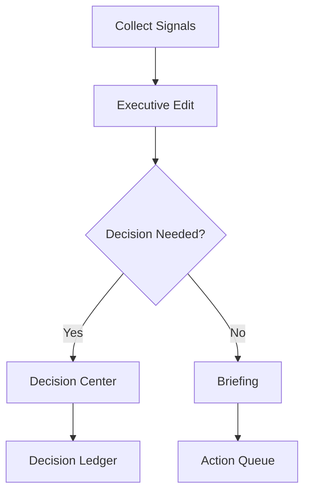
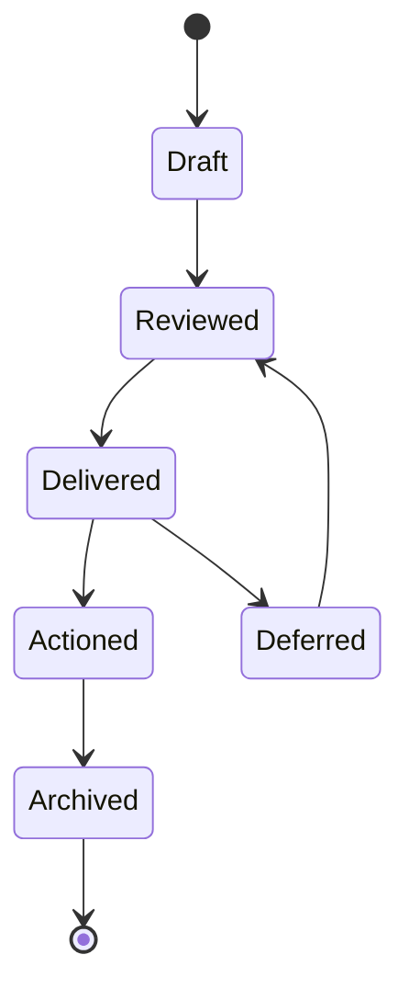

# Momentum Executive System

Generated: 2026-06-26

<!-- PAGE 001 -->
# Page 1 - Executive System Source Basis

This handbook is grounded in the governing source set read on 2026-06-26.

- AGENTS.md
- docs/READ-ME-FIRST.md
- docs/AGENT-BRIEFING.md
- docs/locked-spec.md
- docs/build-registry.md
- docs/project-wireframe.md
- apps/admin/src/App.tsx
- apps/admin/src/components/admin-shell.tsx
- apps/admin/src/routes/dashboard.tsx
- apps/admin/src/routes/live-ops.tsx
- apps/admin/src/routes/reports.tsx
- apps/admin/src/routes/agents.tsx
- apps/admin/src/routes/vm.tsx
- server/src/domain/adminMetrics.ts
- server/src/domain/liveOps.ts
- server/src/domain/adminVm.ts
- server/src/domain/auditLog.ts

The governing precedence is: decision ledger, locked spec, design documents, build registry, git log, Gateway chat registry, then handoffs. This handbook does not override those sources. It translates them into the Mission Control operating architecture Kevin requested.

The core command is explicit: do not create another dashboard. The existing Admin Dashboard becomes Mission Control.

Mission Control operating principles:

- Do not create another dashboard. The existing /dashboard route is renamed conceptually and promoted into Mission Control.
- The first screen must answer: what moved, what broke, who needs support, what decision is waiting, and what Kevin should inspect next.
- Every command card must have evidence, freshness, and an action path. If a card cannot produce action or decision, it should be a report footnote, not a Mission Control card.
- Admin authorization remains server-side. The UI can hide, guide, or explain, but requireAdmin and ADMIN_BA_IDS are the hard gate.
- The Mission Control surface must stay dense and operational. No marketing hero, no decorative card collage, no second "executive dashboard" page.
- Compliance boundaries do not loosen because the surface is executive. Prospect-facing rules still govern anything that can reach .com, ScriptMaker, Ivory, notifications, or public preview.

Actual admin surfaces that become Mission Control wings:

| Item | Anchor | Detail |
|---|---|---|
| Mission Control Home | /dashboard / apps/admin/src/routes/dashboard.tsx | Composes FilterBar, MetricsRow, DrilldownPanel, and LiveEventStream. This is the current Core Dashboard and becomes the Mission Control home. |
| BA Oversight | /bas / apps/admin/src/routes/bas.tsx | BA directory, profile drawer, sponsor override flow, leader tag, notes, create/edit/delete/restore. |
| Prospect Oversight | /prospects / apps/admin/src/routes/prospects.tsx | Cross-team prospect directory, detail panel, sandbox preview, notes, interventions, create/edit/delete/restore. |
| Queue Oversight | /queue / apps/admin/src/routes/queue.tsx | Queue depth, queue numbers, visible ticker window, queue rules, admin ticker mirror. |
| Live Operations | /live-ops / apps/admin/src/routes/live-ops.tsx | UsageStrip, GrowthCards, HoldingTankGrid, ConversionFunnel; current file has USE_MOCKS=true and should be flipped only when server endpoints are proven live. |
| Reports | /reports / apps/admin/src/routes/reports.tsx | ExportPanel for standard-report CSV exports with per-export PII redaction; Master Report PDF exists server-side. |
| Audit Log | /audit / apps/admin/src/routes/audit.tsx | Append-only audit view over mcs_audit_log. Audit entries are written by every admin mutation and important read. |
| Tenant Architecture | /tenant / apps/admin/src/routes/tenant.tsx | Master settings, permission matrix, master-content editor, compliance validation, inheritance controls. |
| Broadcast | /broadcast / apps/admin/src/routes/broadcast.tsx | Kevin-only broadcast composer, audience selector, channel selector, send-test-to-Kevin, queue status. |
| Orientation | /orientation / apps/admin/src/routes/orientation.tsx | Founder/admin roster and session creation for group orientation seats. |
| VM Campaigns | /vm / apps/admin/src/routes/vm.tsx | VM campaign oversight: cards, BA analytics, lead batches, campaigns, provider health, hooks, audited ownership-correction intake. |
| Agent Oversight | /agents / apps/admin/src/routes/agents.tsx | Success Profiles, agent interaction summary, memory health, and GraphRAG bridge drafts. |

Actual data contracts used by the second pass:

| Item | Anchor | Detail |
|---|---|---|
| Core metrics | server/src/domain/adminMetrics.ts | Reads brand_ambassadors, pool_placements, and fast_start_progress. Computes active BAs, total BAs, prospects in flow, queue movement 24h, enrollments 24h, and Fast Start completion percentage. |
| Live operations | server/src/domain/liveOps.ts | Reads in-memory SSE counters plus Mongo projections for growth cards, live grid, and prospect or BA-activation conversion funnels. |
| Audit substrate | server/src/domain/auditLog.ts | Append-only writer appendAuditEntry() triple-stacks entries to Mongo mcs_audit_log, Neo4j AuditEntry, and Chroma mcs_audit_log. No update/delete exports exist. |
| VM oversight | server/src/domain/adminVm.ts | Reads vm_lead_batches, vm_bulk_leads, vm_campaigns, vm_delivery_events, prospect_crm_records, and vm_suppression_list. Degrades with warnings when collections are absent. |
| Reports | server/src/domain/reports/* | Standard reports cover BA activation, training completion, invite funnel, queue velocity, enrollment completion, follow-up aging, leader scorecards, and CSV export. |
| Tenant architecture | server/src/domain/adminTenantArchitecture.ts | Controls tenant settings, permission display, master-content versions, validation, and inheritance. |
| BA oversight | server/src/domain/adminBaOversight.ts | Owns BA directory/profile read model, sponsor override audit path, curated leader tagging, and admin notes. |
| Prospect oversight | server/src/domain/adminProspectOversight.ts | Owns cross-team prospect read model, sponsor-routed URL inspection, notes, and intervention actions. |
| Queue oversight | server/src/domain/adminQueueOversight.ts | Owns queue summary, lookup, visible window, rules, and ticker mirror. |
| Broadcast | server/src/domain/broadcast.ts | Owns audience resolution, template interpolation, queue creation, per-recipient rows, STOP exclusion, and send-test flow. |

Coverage requirements included in this book:

- Executive Briefing
- Mission Control
- Operations
- CRM
- PMV
- Holding Tank
- VM
- Training
- Events
- Notifications
- Team News
- AI Operations
- Knowledge Core
- Research
- Testing
- System Health
- Release Status
- Governance
- Architecture
- Constitution
- Analytics
- Widgets
- Cards
- Tabs
- Dashboards
- Metrics
- KPIs
- Alerts
- Executive Reports
- Recommendations
- Morning Briefing
- Decision Center
- Wireframes
- UI Diagrams
- Flowcharts
- State Machines
- Implementation Guidance
- Codex Prompt
- Claude Prompt
- QA Checklist

---
<!-- PAGE 002 -->
# Page 2 - Executive System Preamble

The Momentum Executive System is the daily operating system Kevin uses to command Mission Control without drowning in panels. It converts data into rhythm, rhythm into decisions, and decisions into motion.
## Mission Control Inputs
| Item | Anchor | Detail |
|---|---|---|
| Core Dashboard becomes Mission Control | /dashboard | Keep the route and data foundation; update product framing, home composition, and labels so this is the executive command center. |
| MetricsRow | apps/admin/src/components/dashboard/MetricsRow.tsx | Five current tiles become the first Mission Pulse strip: active BAs, prospects in flow, queue movement, enrollments, and training percentage. |
| LiveEventStream | apps/admin/src/components/dashboard/LiveEventStream.tsx | Placement and audit-tail stream become the right-now pulse inside Mission Control. |
## Executive Purpose
The executive purpose of "Executive System Preamble" is to reduce Kevin's cognitive load while preserving control. It should surface the smallest useful set of facts, frame the decision or action, and make the next move clear.
## Executive Questions
- What changed since Kevin last looked?
- What is the evidence source and how fresh is it?
- What action is permitted from here?
## Inputs
Inputs may include admin metrics, CRM records, holding-tank state, VM state, training progress, event reservations, notification outcomes, AI operations, knowledge records, tests, health checks, release data, governance records, and audit entries. Inputs should be scoped to the current executive cadence: morning, midday, evening, weekly, incident, release, or research mode.
## Output
The output is a concise executive artifact stored or linked where future sessions can retrieve it. The output must distinguish observed fact from inference. When confidence is low, the system should say what is missing rather than inventing a conclusion.
## Operating Notes
- Preserve current route access and server-side admin authorization while changing product language.
- Prefer composition over rewrites: promote current widgets into Mission Control lanes before inventing new data models.
- Every card needs loading, empty, stale, partial-failure, and drilldown states.
## Review Rule
Human judgment remains final. Recommendations, reports, alerts, and briefings support Kevin; they do not replace Kevin. Any action that affects people, compliance, data integrity, or external communication must stay inside its permission boundary.
## QA Rule
QA verifies source accuracy, permission boundaries, compliance boundaries, audit requirements, and whether the artifact actually helps Kevin decide or act.
## Page-Level QA
- Auth: non-admin BA receives server-side 403, not just hidden navigation.
- Source: card shows current data source or clear degraded state.
- Action: primary action routes to an existing surface or audited mutation.
- Layout: dense desktop view has no overlapping text and remains readable.

---

<!-- PAGE 003 -->
# Page 3 - Executive Briefing Doctrine

A briefing is not a report dump. It is an edited executive readout: what changed, why it matters, what decision is needed, and what action is recommended.
## Mission Control Inputs
| Item | Anchor | Detail |
|---|---|---|
| Core Dashboard becomes Mission Control | /dashboard | Keep the route and data foundation; update product framing, home composition, and labels so this is the executive command center. |
| MetricsRow | apps/admin/src/components/dashboard/MetricsRow.tsx | Five current tiles become the first Mission Pulse strip: active BAs, prospects in flow, queue movement, enrollments, and training percentage. |
| LiveEventStream | apps/admin/src/components/dashboard/LiveEventStream.tsx | Placement and audit-tail stream become the right-now pulse inside Mission Control. |
## Executive Purpose
The executive purpose of "Executive Briefing Doctrine" is to reduce Kevin's cognitive load while preserving control. It should surface the smallest useful set of facts, frame the decision or action, and make the next move clear.
## Executive Questions
- What changed since Kevin last looked?
- What is the evidence source and how fresh is it?
- What action is permitted from here?
## Inputs
Inputs may include admin metrics, CRM records, holding-tank state, VM state, training progress, event reservations, notification outcomes, AI operations, knowledge records, tests, health checks, release data, governance records, and audit entries. Inputs should be scoped to the current executive cadence: morning, midday, evening, weekly, incident, release, or research mode.
## Output
The output is an executive briefing with facts, implications, decisions, and recommended actions. The output must distinguish observed fact from inference. When confidence is low, the system should say what is missing rather than inventing a conclusion.
## Operating Notes
- Preserve current route access and server-side admin authorization while changing product language.
- Prefer composition over rewrites: promote current widgets into Mission Control lanes before inventing new data models.
- Every card needs loading, empty, stale, partial-failure, and drilldown states.
## Review Rule
Human judgment remains final. Recommendations, reports, alerts, and briefings support Kevin; they do not replace Kevin. Any action that affects people, compliance, data integrity, or external communication must stay inside its permission boundary.
## QA Rule
QA verifies source accuracy, permission boundaries, compliance boundaries, audit requirements, and whether the artifact actually helps Kevin decide or act.
## Page-Level QA
- Auth: non-admin BA receives server-side 403, not just hidden navigation.
- Source: card shows current data source or clear degraded state.
- Action: primary action routes to an existing surface or audited mutation.
- Layout: dense desktop view has no overlapping text and remains readable.

---

<!-- PAGE 004 -->
# Page 4 - Daily Operating Rhythm

The system runs morning briefing, midday pulse, evening closeout, weekly review, release review, and incident review as repeatable operating loops.
## Mission Control Inputs
| Item | Anchor | Detail |
|---|---|---|
| Mission Control Home | /dashboard | apps/admin/src/routes/dashboard.tsx |
| BA Oversight | /bas | apps/admin/src/routes/bas.tsx |
| Prospect Oversight | /prospects | apps/admin/src/routes/prospects.tsx |
## Executive Purpose
The executive purpose of "Daily Operating Rhythm" is to reduce Kevin's cognitive load while preserving control. It should surface the smallest useful set of facts, frame the decision or action, and make the next move clear.
## Executive Questions
- What changed since Kevin last looked?
- What is the evidence source and how fresh is it?
- What action is permitted from here?
## Inputs
Inputs may include admin metrics, CRM records, holding-tank state, VM state, training progress, event reservations, notification outcomes, AI operations, knowledge records, tests, health checks, release data, governance records, and audit entries. Inputs should be scoped to the current executive cadence: morning, midday, evening, weekly, incident, release, or research mode.
## Output
The output is a concise executive artifact stored or linked where future sessions can retrieve it. The output must distinguish observed fact from inference. When confidence is low, the system should say what is missing rather than inventing a conclusion.
## Operating Notes
- Preserve current route access and server-side admin authorization while changing product language.
- Prefer composition over rewrites: promote current widgets into Mission Control lanes before inventing new data models.
- Every card needs loading, empty, stale, partial-failure, and drilldown states.
## Review Rule
Human judgment remains final. Recommendations, reports, alerts, and briefings support Kevin; they do not replace Kevin. Any action that affects people, compliance, data integrity, or external communication must stay inside its permission boundary.
## QA Rule
QA verifies source accuracy, permission boundaries, compliance boundaries, audit requirements, and whether the artifact actually helps Kevin decide or act.
## Page-Level QA
- Auth: non-admin BA receives server-side 403, not just hidden navigation.
- Source: card shows current data source or clear degraded state.
- Action: primary action routes to an existing surface or audited mutation.
- Layout: dense desktop view has no overlapping text and remains readable.

---

<!-- PAGE 005 -->
# Page 5 - Morning Briefing Canon

Morning Briefing contains overnight movement, today events, top risks, people needing support, AI recommendations, release status, and the decision queue.
## Mission Control Inputs
| Item | Anchor | Detail |
|---|---|---|
| Core Dashboard becomes Mission Control | /dashboard | Keep the route and data foundation; update product framing, home composition, and labels so this is the executive command center. |
| MetricsRow | apps/admin/src/components/dashboard/MetricsRow.tsx | Five current tiles become the first Mission Pulse strip: active BAs, prospects in flow, queue movement, enrollments, and training percentage. |
| LiveEventStream | apps/admin/src/components/dashboard/LiveEventStream.tsx | Placement and audit-tail stream become the right-now pulse inside Mission Control. |
## Executive Purpose
The executive purpose of "Morning Briefing Canon" is to reduce Kevin's cognitive load while preserving control. It should surface the smallest useful set of facts, frame the decision or action, and make the next move clear.
## Executive Questions
- What changed since Kevin last looked?
- What is the evidence source and how fresh is it?
- What action is permitted from here?
## Inputs
Inputs may include admin metrics, CRM records, holding-tank state, VM state, training progress, event reservations, notification outcomes, AI operations, knowledge records, tests, health checks, release data, governance records, and audit entries. Morning inputs should be collected before any optional analysis so the daily brief is ready first.
## Output
The output is an executive briefing with facts, implications, decisions, and recommended actions. The output must distinguish observed fact from inference. When confidence is low, the system should say what is missing rather than inventing a conclusion.
## Operating Notes
- Preserve current route access and server-side admin authorization while changing product language.
- Prefer composition over rewrites: promote current widgets into Mission Control lanes before inventing new data models.
- Every card needs loading, empty, stale, partial-failure, and drilldown states.
## Review Rule
Human judgment remains final. Recommendations, reports, alerts, and briefings support Kevin; they do not replace Kevin. Any action that affects people, compliance, data integrity, or external communication must stay inside its permission boundary.
## QA Rule
QA verifies source accuracy, permission boundaries, compliance boundaries, audit requirements, and whether the artifact actually helps Kevin decide or act.
## Page-Level QA
- Auth: non-admin BA receives server-side 403, not just hidden navigation.
- Source: card shows current data source or clear degraded state.
- Action: primary action routes to an existing surface or audited mutation.
- Layout: dense desktop view has no overlapping text and remains readable.

---

<!-- PAGE 006 -->
# Page 6 - Midday Pulse

Midday Pulse focuses on whether the primary action is happening: invitations sent, videos completed, callbacks raised, and BAs needing support.
## Mission Control Inputs
| Item | Anchor | Detail |
|---|---|---|
| Mission Control Home | /dashboard | apps/admin/src/routes/dashboard.tsx |
| BA Oversight | /bas | apps/admin/src/routes/bas.tsx |
| Prospect Oversight | /prospects | apps/admin/src/routes/prospects.tsx |
## Executive Purpose
The executive purpose of "Midday Pulse" is to reduce Kevin's cognitive load while preserving control. It should surface the smallest useful set of facts, frame the decision or action, and make the next move clear.
## Executive Questions
- What changed since Kevin last looked?
- What is the evidence source and how fresh is it?
- What action is permitted from here?
## Inputs
Inputs may include admin metrics, CRM records, holding-tank state, VM state, training progress, event reservations, notification outcomes, AI operations, knowledge records, tests, health checks, release data, governance records, and audit entries. Inputs should be scoped to the current executive cadence: morning, midday, evening, weekly, incident, release, or research mode.
## Output
The output is a concise executive artifact stored or linked where future sessions can retrieve it. The output must distinguish observed fact from inference. When confidence is low, the system should say what is missing rather than inventing a conclusion.
## Operating Notes
- Preserve current route access and server-side admin authorization while changing product language.
- Prefer composition over rewrites: promote current widgets into Mission Control lanes before inventing new data models.
- Every card needs loading, empty, stale, partial-failure, and drilldown states.
## Review Rule
Human judgment remains final. Recommendations, reports, alerts, and briefings support Kevin; they do not replace Kevin. Any action that affects people, compliance, data integrity, or external communication must stay inside its permission boundary.
## QA Rule
QA verifies source accuracy, permission boundaries, compliance boundaries, audit requirements, and whether the artifact actually helps Kevin decide or act.
## Page-Level QA
- Auth: non-admin BA receives server-side 403, not just hidden navigation.
- Source: card shows current data source or clear degraded state.
- Action: primary action routes to an existing surface or audited mutation.
- Layout: dense desktop view has no overlapping text and remains readable.

---

<!-- PAGE 007 -->
# Page 7 - Evening Closeout

Evening Closeout captures what moved, what stalled, which alerts remain open, which decisions were made, and what tomorrow should open with.
## Mission Control Inputs
| Item | Anchor | Detail |
|---|---|---|
| Mission Control Home | /dashboard | apps/admin/src/routes/dashboard.tsx |
| BA Oversight | /bas | apps/admin/src/routes/bas.tsx |
| Prospect Oversight | /prospects | apps/admin/src/routes/prospects.tsx |
## Executive Purpose
The executive purpose of "Evening Closeout" is to reduce Kevin's cognitive load while preserving control. It should surface the smallest useful set of facts, frame the decision or action, and make the next move clear.
## Executive Questions
- What changed since Kevin last looked?
- What is the evidence source and how fresh is it?
- What action is permitted from here?
## Inputs
Inputs may include admin metrics, CRM records, holding-tank state, VM state, training progress, event reservations, notification outcomes, AI operations, knowledge records, tests, health checks, release data, governance records, and audit entries. Inputs should be scoped to the current executive cadence: morning, midday, evening, weekly, incident, release, or research mode.
## Output
The output is a concise executive artifact stored or linked where future sessions can retrieve it. The output must distinguish observed fact from inference. When confidence is low, the system should say what is missing rather than inventing a conclusion.
## Operating Notes
- Preserve current route access and server-side admin authorization while changing product language.
- Prefer composition over rewrites: promote current widgets into Mission Control lanes before inventing new data models.
- Every card needs loading, empty, stale, partial-failure, and drilldown states.
## Review Rule
Human judgment remains final. Recommendations, reports, alerts, and briefings support Kevin; they do not replace Kevin. Any action that affects people, compliance, data integrity, or external communication must stay inside its permission boundary.
## QA Rule
QA verifies source accuracy, permission boundaries, compliance boundaries, audit requirements, and whether the artifact actually helps Kevin decide or act.
## Page-Level QA
- Auth: non-admin BA receives server-side 403, not just hidden navigation.
- Source: card shows current data source or clear degraded state.
- Action: primary action routes to an existing surface or audited mutation.
- Layout: dense desktop view has no overlapping text and remains readable.

---

<!-- PAGE 008 -->
# Page 8 - Weekly Executive Review

Weekly Review compares share velocity, BA activation, training movement, holding-tank flow, event performance, release movement, and recommendations actioned.
## Mission Control Inputs
| Item | Anchor | Detail |
|---|---|---|
| Core Dashboard becomes Mission Control | /dashboard | Keep the route and data foundation; update product framing, home composition, and labels so this is the executive command center. |
| MetricsRow | apps/admin/src/components/dashboard/MetricsRow.tsx | Five current tiles become the first Mission Pulse strip: active BAs, prospects in flow, queue movement, enrollments, and training percentage. |
| LiveEventStream | apps/admin/src/components/dashboard/LiveEventStream.tsx | Placement and audit-tail stream become the right-now pulse inside Mission Control. |
## Executive Purpose
The executive purpose of "Weekly Executive Review" is to reduce Kevin's cognitive load while preserving control. It should surface the smallest useful set of facts, frame the decision or action, and make the next move clear.
## Executive Questions
- What changed since Kevin last looked?
- What is the evidence source and how fresh is it?
- What action is permitted from here?
## Inputs
Inputs may include admin metrics, CRM records, holding-tank state, VM state, training progress, event reservations, notification outcomes, AI operations, knowledge records, tests, health checks, release data, governance records, and audit entries. Weekly inputs compare this week with the prior relevant window and explain variance.
## Output
The output is a concise executive artifact stored or linked where future sessions can retrieve it. The output must distinguish observed fact from inference. When confidence is low, the system should say what is missing rather than inventing a conclusion.
## Operating Notes
- Preserve current route access and server-side admin authorization while changing product language.
- Prefer composition over rewrites: promote current widgets into Mission Control lanes before inventing new data models.
- Every card needs loading, empty, stale, partial-failure, and drilldown states.
## Review Rule
Human judgment remains final. Recommendations, reports, alerts, and briefings support Kevin; they do not replace Kevin. Any action that affects people, compliance, data integrity, or external communication must stay inside its permission boundary.
## QA Rule
QA verifies source accuracy, permission boundaries, compliance boundaries, audit requirements, and whether the artifact actually helps Kevin decide or act.
## Page-Level QA
- Auth: non-admin BA receives server-side 403, not just hidden navigation.
- Source: card shows current data source or clear degraded state.
- Action: primary action routes to an existing surface or audited mutation.
- Layout: dense desktop view has no overlapping text and remains readable.

---

<!-- PAGE 009 -->
# Page 9 - Decision Center Canon

Decision Center exists to reduce re-explaining. It packages the facts, the options, the recommended answer, and the consequence of delay.
## Mission Control Inputs
| Item | Anchor | Detail |
|---|---|---|
| Core Dashboard becomes Mission Control | /dashboard | Keep the route and data foundation; update product framing, home composition, and labels so this is the executive command center. |
| MetricsRow | apps/admin/src/components/dashboard/MetricsRow.tsx | Five current tiles become the first Mission Pulse strip: active BAs, prospects in flow, queue movement, enrollments, and training percentage. |
| LiveEventStream | apps/admin/src/components/dashboard/LiveEventStream.tsx | Placement and audit-tail stream become the right-now pulse inside Mission Control. |
## Executive Purpose
The executive purpose of "Decision Center Canon" is to reduce Kevin's cognitive load while preserving control. It should surface the smallest useful set of facts, frame the decision or action, and make the next move clear.
## Executive Questions
- What changed since Kevin last looked?
- What is the evidence source and how fresh is it?
- What action is permitted from here?
- What answer is needed from Kevin, and what happens if it is deferred?
## Inputs
Inputs may include admin metrics, CRM records, holding-tank state, VM state, training progress, event reservations, notification outcomes, AI operations, knowledge records, tests, health checks, release data, governance records, and audit entries. Inputs should be scoped to the current executive cadence: morning, midday, evening, weekly, incident, release, or research mode.
## Output
The output is a decision card ready for Kevin with context, options, recommendation, and impact. The output must distinguish observed fact from inference. When confidence is low, the system should say what is missing rather than inventing a conclusion.
## Operating Notes
- Preserve current route access and server-side admin authorization while changing product language.
- Prefer composition over rewrites: promote current widgets into Mission Control lanes before inventing new data models.
- Every card needs loading, empty, stale, partial-failure, and drilldown states.
## Review Rule
Human judgment remains final. Recommendations, reports, alerts, and briefings support Kevin; they do not replace Kevin. Any action that affects people, compliance, data integrity, or external communication must stay inside its permission boundary.
## QA Rule
QA verifies source accuracy, permission boundaries, compliance boundaries, audit requirements, and whether the artifact actually helps Kevin decide or act.
## Page-Level QA
- Auth: non-admin BA receives server-side 403, not just hidden navigation.
- Source: card shows current data source or clear degraded state.
- Action: primary action routes to an existing surface or audited mutation.
- Layout: dense desktop view has no overlapping text and remains readable.

---

<!-- PAGE 010 -->
# Page 10 - Decision Record Shape

Every decision record has topic, status, source, context, alternatives, Kevin answer, active rule, superseded rules, and implementation impact.
## Mission Control Inputs
| Item | Anchor | Detail |
|---|---|---|
| Core Dashboard becomes Mission Control | /dashboard | Keep the route and data foundation; update product framing, home composition, and labels so this is the executive command center. |
| MetricsRow | apps/admin/src/components/dashboard/MetricsRow.tsx | Five current tiles become the first Mission Pulse strip: active BAs, prospects in flow, queue movement, enrollments, and training percentage. |
| LiveEventStream | apps/admin/src/components/dashboard/LiveEventStream.tsx | Placement and audit-tail stream become the right-now pulse inside Mission Control. |
## Executive Purpose
The executive purpose of "Decision Record Shape" is to reduce Kevin's cognitive load while preserving control. It should surface the smallest useful set of facts, frame the decision or action, and make the next move clear.
## Executive Questions
- What changed since Kevin last looked?
- What is the evidence source and how fresh is it?
- What action is permitted from here?
- What answer is needed from Kevin, and what happens if it is deferred?
## Inputs
Inputs may include admin metrics, CRM records, holding-tank state, VM state, training progress, event reservations, notification outcomes, AI operations, knowledge records, tests, health checks, release data, governance records, and audit entries. Inputs should be scoped to the current executive cadence: morning, midday, evening, weekly, incident, release, or research mode.
## Output
The output is a decision card ready for Kevin with context, options, recommendation, and impact. The output must distinguish observed fact from inference. When confidence is low, the system should say what is missing rather than inventing a conclusion.
## Operating Notes
- Preserve current route access and server-side admin authorization while changing product language.
- Prefer composition over rewrites: promote current widgets into Mission Control lanes before inventing new data models.
- Every card needs loading, empty, stale, partial-failure, and drilldown states.
## Review Rule
Human judgment remains final. Recommendations, reports, alerts, and briefings support Kevin; they do not replace Kevin. Any action that affects people, compliance, data integrity, or external communication must stay inside its permission boundary.
## QA Rule
QA verifies source accuracy, permission boundaries, compliance boundaries, audit requirements, and whether the artifact actually helps Kevin decide or act.
## Page-Level QA
- Auth: non-admin BA receives server-side 403, not just hidden navigation.
- Source: card shows current data source or clear degraded state.
- Action: primary action routes to an existing surface or audited mutation.
- Layout: dense desktop view has no overlapping text and remains readable.

---

<!-- PAGE 011 -->
# Page 11 - Recommendation Doctrine

Recommendations assist Kevin. They do not command Kevin. Every recommendation must show evidence, uncertainty, risk, and reversible action.
## Mission Control Inputs
| Item | Anchor | Detail |
|---|---|---|
| Core Dashboard becomes Mission Control | /dashboard | Keep the route and data foundation; update product framing, home composition, and labels so this is the executive command center. |
| MetricsRow | apps/admin/src/components/dashboard/MetricsRow.tsx | Five current tiles become the first Mission Pulse strip: active BAs, prospects in flow, queue movement, enrollments, and training percentage. |
| LiveEventStream | apps/admin/src/components/dashboard/LiveEventStream.tsx | Placement and audit-tail stream become the right-now pulse inside Mission Control. |
## Executive Purpose
The executive purpose of "Recommendation Doctrine" is to reduce Kevin's cognitive load while preserving control. It should surface the smallest useful set of facts, frame the decision or action, and make the next move clear.
## Executive Questions
- What changed since Kevin last looked?
- What is the evidence source and how fresh is it?
- What action is permitted from here?
## Inputs
Inputs may include admin metrics, CRM records, holding-tank state, VM state, training progress, event reservations, notification outcomes, AI operations, knowledge records, tests, health checks, release data, governance records, and audit entries. Inputs should be scoped to the current executive cadence: morning, midday, evening, weekly, incident, release, or research mode.
## Output
The output is a recommendation card with evidence, confidence, risk, and a safe next action. The output must distinguish observed fact from inference. When confidence is low, the system should say what is missing rather than inventing a conclusion.
## Operating Notes
- Preserve current route access and server-side admin authorization while changing product language.
- Prefer composition over rewrites: promote current widgets into Mission Control lanes before inventing new data models.
- Every card needs loading, empty, stale, partial-failure, and drilldown states.
- AI output must enter as a draft, recommendation, or evidence package unless a human-approved automation already exists.
## Review Rule
Human judgment remains final. Recommendations, reports, alerts, and briefings support Kevin; they do not replace Kevin. Any action that affects people, compliance, data integrity, or external communication must stay inside its permission boundary.
## QA Rule
QA verifies source accuracy, permission boundaries, compliance boundaries, audit requirements, and whether the artifact actually helps Kevin decide or act.
## Page-Level QA
- Auth: non-admin BA receives server-side 403, not just hidden navigation.
- Source: card shows current data source or clear degraded state.
- Action: primary action routes to an existing surface or audited mutation.
- Layout: dense desktop view has no overlapping text and remains readable.

---

<!-- PAGE 012 -->
# Page 12 - Executive Reports Doctrine

Executive reports serve leadership judgment. They should print cleanly, source themselves, and state what is known without filling gaps.
## Mission Control Inputs
| Item | Anchor | Detail |
|---|---|---|
| Core Dashboard becomes Mission Control | /dashboard | Keep the route and data foundation; update product framing, home composition, and labels so this is the executive command center. |
| MetricsRow | apps/admin/src/components/dashboard/MetricsRow.tsx | Five current tiles become the first Mission Pulse strip: active BAs, prospects in flow, queue movement, enrollments, and training percentage. |
| LiveEventStream | apps/admin/src/components/dashboard/LiveEventStream.tsx | Placement and audit-tail stream become the right-now pulse inside Mission Control. |
| Reports | /reports | ExportPanel issues CSV exports for standard reports. Redaction choice is required every export. |
| Master Report | /api/admin/reporting/master-report.pdf | PDF composites the core dashboard and report library with verifiability footer. |
| PII redaction | server/src/services/piiRedact.ts | Prospect first/last name, phone, and email are redacted when Kevin chooses redacted export. |
## Executive Purpose
The executive purpose of "Executive Reports Doctrine" is to reduce Kevin's cognitive load while preserving control. It should surface the smallest useful set of facts, frame the decision or action, and make the next move clear.
## Executive Questions
- What changed since Kevin last looked?
- What is the evidence source and how fresh is it?
- What action is permitted from here?
- What does this number cause Kevin to do differently today?
## Inputs
Inputs may include admin metrics, CRM records, holding-tank state, VM state, training progress, event reservations, notification outcomes, AI operations, knowledge records, tests, health checks, release data, governance records, and audit entries. Inputs should be scoped to the current executive cadence: morning, midday, evening, weekly, incident, release, or research mode.
## Output
The output is a report or export package that can be printed, audited, and revisited. The output must distinguish observed fact from inference. When confidence is low, the system should say what is missing rather than inventing a conclusion.
## Operating Notes
- Preserve current route access and server-side admin authorization while changing product language.
- Prefer composition over rewrites: promote current widgets into Mission Control lanes before inventing new data models.
- Every card needs loading, empty, stale, partial-failure, and drilldown states.
- Keep the per-export redaction modal; never persist a raw-export preference.
## Review Rule
Human judgment remains final. Recommendations, reports, alerts, and briefings support Kevin; they do not replace Kevin. Any action that affects people, compliance, data integrity, or external communication must stay inside its permission boundary.
## QA Rule
Report QA verifies filter scope, source calculation, redaction, generated timestamp, export audit, and print quality.
## Page-Level QA
- Auth: non-admin BA receives server-side 403, not just hidden navigation.
- Source: card shows current data source or clear degraded state.
- Action: primary action routes to an existing surface or audited mutation.
- Layout: dense desktop view has no overlapping text and remains readable.
- Export: redaction choice is audited and CSV/PDF output opens cleanly.

---

<!-- PAGE 013 -->
# Page 13 - Mission Control Relationship

Mission Control is the command surface. The Executive System is the operating cadence that tells Mission Control what to surface and when.
## Mission Control Inputs
| Item | Anchor | Detail |
|---|---|---|
| Core Dashboard becomes Mission Control | /dashboard | Keep the route and data foundation; update product framing, home composition, and labels so this is the executive command center. |
| MetricsRow | apps/admin/src/components/dashboard/MetricsRow.tsx | Five current tiles become the first Mission Pulse strip: active BAs, prospects in flow, queue movement, enrollments, and training percentage. |
| LiveEventStream | apps/admin/src/components/dashboard/LiveEventStream.tsx | Placement and audit-tail stream become the right-now pulse inside Mission Control. |
## Executive Purpose
The executive purpose of "Mission Control Relationship" is to reduce Kevin's cognitive load while preserving control. It should surface the smallest useful set of facts, frame the decision or action, and make the next move clear.
## Executive Questions
- What changed since Kevin last looked?
- What is the evidence source and how fresh is it?
- What action is permitted from here?
## Inputs
Inputs may include admin metrics, CRM records, holding-tank state, VM state, training progress, event reservations, notification outcomes, AI operations, knowledge records, tests, health checks, release data, governance records, and audit entries. Inputs should be scoped to the current executive cadence: morning, midday, evening, weekly, incident, release, or research mode.
## Output
The output is a concise executive artifact stored or linked where future sessions can retrieve it. The output must distinguish observed fact from inference. When confidence is low, the system should say what is missing rather than inventing a conclusion.
## Operating Notes
- Preserve current route access and server-side admin authorization while changing product language.
- Prefer composition over rewrites: promote current widgets into Mission Control lanes before inventing new data models.
- Every card needs loading, empty, stale, partial-failure, and drilldown states.
## Review Rule
Human judgment remains final. Recommendations, reports, alerts, and briefings support Kevin; they do not replace Kevin. Any action that affects people, compliance, data integrity, or external communication must stay inside its permission boundary.
## QA Rule
QA verifies source accuracy, permission boundaries, compliance boundaries, audit requirements, and whether the artifact actually helps Kevin decide or act.
## Page-Level QA
- Auth: non-admin BA receives server-side 403, not just hidden navigation.
- Source: card shows current data source or clear degraded state.
- Action: primary action routes to an existing surface or audited mutation.
- Layout: dense desktop view has no overlapping text and remains readable.

---

<!-- PAGE 014 -->
# Page 14 - Operations Rhythm

Operations rhythm watches live activity, gateway health, provider state, broadcasts, events, and daily execution.
## Mission Control Inputs
| Item | Anchor | Detail |
|---|---|---|
| Live Operations | /live-ops | Usage strip, growth windows, holding-tank grid, and conversion funnels supply the live operating lane. |
| Gateway health | server/src/services/gatewayLatency.ts | p50/p95 latency feeds the usage strip and should graduate into System Health cards. |
| Mock warning | apps/admin/src/routes/live-ops.tsx | USE_MOCKS=true means the page must visibly disclose mock mode until live endpoints are proven. |
## Executive Purpose
The executive purpose of "Operations Rhythm" is to reduce Kevin's cognitive load while preserving control. It should surface the smallest useful set of facts, frame the decision or action, and make the next move clear.
## Executive Questions
- What changed since Kevin last looked?
- What is the evidence source and how fresh is it?
- What action is permitted from here?
## Inputs
Inputs may include admin metrics, CRM records, holding-tank state, VM state, training progress, event reservations, notification outcomes, AI operations, knowledge records, tests, health checks, release data, governance records, and audit entries. Inputs should be scoped to the current executive cadence: morning, midday, evening, weekly, incident, release, or research mode.
## Output
The output is a concise executive artifact stored or linked where future sessions can retrieve it. The output must distinguish observed fact from inference. When confidence is low, the system should say what is missing rather than inventing a conclusion.
## Operating Notes
- Preserve current route access and server-side admin authorization while changing product language.
- Prefer composition over rewrites: promote current widgets into Mission Control lanes before inventing new data models.
- Every card needs loading, empty, stale, partial-failure, and drilldown states.
- Do not hide USE_MOCKS or provider dormant states; Mission Control must display degraded truth.
## Review Rule
Human judgment remains final. Recommendations, reports, alerts, and briefings support Kevin; they do not replace Kevin. Any action that affects people, compliance, data integrity, or external communication must stay inside its permission boundary.
## QA Rule
QA verifies source accuracy, permission boundaries, compliance boundaries, audit requirements, and whether the artifact actually helps Kevin decide or act.
## Page-Level QA
- Auth: non-admin BA receives server-side 403, not just hidden navigation.
- Source: card shows current data source or clear degraded state.
- Action: primary action routes to an existing surface or audited mutation.
- Layout: dense desktop view has no overlapping text and remains readable.

---

<!-- PAGE 015 -->
# Page 15 - CRM Rhythm

CRM rhythm watches who needs follow-up, who needs sponsor support, which relationships are moving, and which records are stale.
## Mission Control Inputs
| Item | Anchor | Detail |
|---|---|---|
| BA Oversight | /bas | BA profile drawer, notes, sponsor override, leader tag, and lifecycle actions are the people command backbone. |
| Prospect Oversight | /prospects | Prospect detail, activity, notes, sponsor-routed URL inspection, and interventions are the prospect command backbone. |
| Cockpit CRM | server/src/domain/crm.ts | BA-facing CRM context must feed Mission Control support recommendations without violating sponsor boundaries. |
## Executive Purpose
The executive purpose of "CRM Rhythm" is to reduce Kevin's cognitive load while preserving control. It should surface the smallest useful set of facts, frame the decision or action, and make the next move clear.
## Executive Questions
- What changed since Kevin last looked?
- What is the evidence source and how fresh is it?
- What action is permitted from here?
- Who needs human support, and who is the right human to provide it?
## Inputs
Inputs may include admin metrics, CRM records, holding-tank state, VM state, training progress, event reservations, notification outcomes, AI operations, knowledge records, tests, health checks, release data, governance records, and audit entries. Inputs should be scoped to the current executive cadence: morning, midday, evening, weekly, incident, release, or research mode.
## Output
The output is a concise executive artifact stored or linked where future sessions can retrieve it. The output must distinguish observed fact from inference. When confidence is low, the system should say what is missing rather than inventing a conclusion.
## Operating Notes
- Preserve current route access and server-side admin authorization while changing product language.
- Prefer composition over rewrites: promote current widgets into Mission Control lanes before inventing new data models.
- Every card needs loading, empty, stale, partial-failure, and drilldown states.
- Sponsor immutability survives every lookup, recommendation, and re-entry path.
## Review Rule
Human judgment remains final. Recommendations, reports, alerts, and briefings support Kevin; they do not replace Kevin. Any action that affects people, compliance, data integrity, or external communication must stay inside its permission boundary.
## QA Rule
QA verifies source accuracy, permission boundaries, compliance boundaries, audit requirements, and whether the artifact actually helps Kevin decide or act.
## Page-Level QA
- Auth: non-admin BA receives server-side 403, not just hidden navigation.
- Source: card shows current data source or clear degraded state.
- Action: primary action routes to an existing surface or audited mutation.
- Layout: dense desktop view has no overlapping text and remains readable.

---

<!-- PAGE 016 -->
# Page 16 - PMV Rhythm

PMV rhythm observes People -> Momentum -> Volume -> Checks internally while protecting prospect-facing compliance boundaries.
## Mission Control Inputs
| Item | Anchor | Detail |
|---|---|---|
| People | brand_ambassadors and prospects | People are operational records, not AI-qualified leads. |
| Momentum | invitation_activity and pool_placements | Momentum is sharing, video movement, callbacks, reservations, and first invite progress. |
| Volume and Checks | THREE-authoritative mirror when available | Volume and checks are internal-only, clearly labeled, and never leak to .com. |
## Executive Purpose
The executive purpose of "PMV Rhythm" is to reduce Kevin's cognitive load while preserving control. It should surface the smallest useful set of facts, frame the decision or action, and make the next move clear.
## Executive Questions
- What changed since Kevin last looked?
- What is the evidence source and how fresh is it?
- What action is permitted from here?
## Inputs
Inputs may include admin metrics, CRM records, holding-tank state, VM state, training progress, event reservations, notification outcomes, AI operations, knowledge records, tests, health checks, release data, governance records, and audit entries. Inputs should be scoped to the current executive cadence: morning, midday, evening, weekly, incident, release, or research mode.
## Output
The output is a concise executive artifact stored or linked where future sessions can retrieve it. The output must distinguish observed fact from inference. When confidence is low, the system should say what is missing rather than inventing a conclusion.
## Operating Notes
- Preserve current route access and server-side admin authorization while changing product language.
- Prefer composition over rewrites: promote current widgets into Mission Control lanes before inventing new data models.
- Every card needs loading, empty, stale, partial-failure, and drilldown states.
## Review Rule
Human judgment remains final. Recommendations, reports, alerts, and briefings support Kevin; they do not replace Kevin. Any action that affects people, compliance, data integrity, or external communication must stay inside its permission boundary.
## QA Rule
QA verifies source accuracy, permission boundaries, compliance boundaries, audit requirements, and whether the artifact actually helps Kevin decide or act.
## Page-Level QA
- Auth: non-admin BA receives server-side 403, not just hidden navigation.
- Source: card shows current data source or clear degraded state.
- Action: primary action routes to an existing surface or audited mutation.
- Layout: dense desktop view has no overlapping text and remains readable.

---

<!-- PAGE 017 -->
# Page 17 - Holding Tank Rhythm

Holding Tank rhythm watches age, movement, flush candidates, placement integrity, and intervention history.
## Mission Control Inputs
| Item | Anchor | Detail |
|---|---|---|
| Queue Oversight | /queue | Queue depth, fixed position lookup, visible-window config, rule management, and admin ticker mirror. |
| Placement model | server/src/domain/holdingTank.ts | Positions are monotonic at video_complete; flushes vacate slots and never renumber. |
| Live grid | /live-ops | HoldingTankGrid gives color-coded age buckets and deep-links to prospect detail. |
## Executive Purpose
The executive purpose of "Holding Tank Rhythm" is to reduce Kevin's cognitive load while preserving control. It should surface the smallest useful set of facts, frame the decision or action, and make the next move clear.
## Executive Questions
- What changed since Kevin last looked?
- What is the evidence source and how fresh is it?
- What action is permitted from here?
## Inputs
Inputs may include admin metrics, CRM records, holding-tank state, VM state, training progress, event reservations, notification outcomes, AI operations, knowledge records, tests, health checks, release data, governance records, and audit entries. Inputs should be scoped to the current executive cadence: morning, midday, evening, weekly, incident, release, or research mode.
## Output
The output is a concise executive artifact stored or linked where future sessions can retrieve it. The output must distinguish observed fact from inference. When confidence is low, the system should say what is missing rather than inventing a conclusion.
## Operating Notes
- Preserve current route access and server-side admin authorization while changing product language.
- Prefer composition over rewrites: promote current widgets into Mission Control lanes before inventing new data models.
- Every card needs loading, empty, stale, partial-failure, and drilldown states.
## Review Rule
Human judgment remains final. Recommendations, reports, alerts, and briefings support Kevin; they do not replace Kevin. Any action that affects people, compliance, data integrity, or external communication must stay inside its permission boundary.
## QA Rule
QA verifies source accuracy, permission boundaries, compliance boundaries, audit requirements, and whether the artifact actually helps Kevin decide or act.
## Page-Level QA
- Auth: non-admin BA receives server-side 403, not just hidden navigation.
- Source: card shows current data source or clear degraded state.
- Action: primary action routes to an existing surface or audited mutation.
- Layout: dense desktop view has no overlapping text and remains readable.

---

<!-- PAGE 018 -->
# Page 18 - VM Rhythm

VM rhythm watches campaigns, imports, ownership, queues, failed notifications, and correction requests.
## Mission Control Inputs
| Item | Anchor | Detail |
|---|---|---|
| VM Campaigns | /vm | Campaign cards, BA analytics, lead batches, provider health, notification hooks, and team-news hooks. |
| Suppression summary | server/src/domain/adminVm.ts | Suppressed leads, opt-outs, DNC flags, invalid phones/emails, and compliance holds are explicit. |
| Ownership correction | /api/admin/vm/ownership-correction | Current flow logs a critical audit request; multi-record mutation waits for the ownership service. |
## Executive Purpose
The executive purpose of "VM Rhythm" is to reduce Kevin's cognitive load while preserving control. It should surface the smallest useful set of facts, frame the decision or action, and make the next move clear.
## Executive Questions
- What changed since Kevin last looked?
- What is the evidence source and how fresh is it?
- What action is permitted from here?
## Inputs
Inputs may include admin metrics, CRM records, holding-tank state, VM state, training progress, event reservations, notification outcomes, AI operations, knowledge records, tests, health checks, release data, governance records, and audit entries. Inputs should be scoped to the current executive cadence: morning, midday, evening, weekly, incident, release, or research mode.
## Output
The output is a concise executive artifact stored or linked where future sessions can retrieve it. The output must distinguish observed fact from inference. When confidence is low, the system should say what is missing rather than inventing a conclusion.
## Operating Notes
- Preserve current route access and server-side admin authorization while changing product language.
- Prefer composition over rewrites: promote current widgets into Mission Control lanes before inventing new data models.
- Every card needs loading, empty, stale, partial-failure, and drilldown states.
- STOP exclusions and suppression checks are server-side requirements, not UI conveniences.
## Review Rule
Human judgment remains final. Recommendations, reports, alerts, and briefings support Kevin; they do not replace Kevin. Any action that affects people, compliance, data integrity, or external communication must stay inside its permission boundary.
## QA Rule
QA verifies source accuracy, permission boundaries, compliance boundaries, audit requirements, and whether the artifact actually helps Kevin decide or act.
## Page-Level QA
- Auth: non-admin BA receives server-side 403, not just hidden navigation.
- Source: card shows current data source or clear degraded state.
- Action: primary action routes to an existing surface or audited mutation.
- Layout: dense desktop view has no overlapping text and remains readable.

---

<!-- PAGE 019 -->
# Page 19 - Training Rhythm

Training rhythm watches Fast Start, orientation, Steve discovery, Michael support, first invitation, and first duplication signals.
## Mission Control Inputs
| Item | Anchor | Detail |
|---|---|---|
| Training progress | fast_start_progress | Fast Start completion and first-invite requirement define activation movement. |
| Orientation | /orientation | Founder/admin group orientation sessions reuse event/reservation patterns and show rosters. |
| Agents | /agents | Success Profiles and Michael/Steve memory should support humans without classification or scoring. |
## Executive Purpose
The executive purpose of "Training Rhythm" is to reduce Kevin's cognitive load while preserving control. It should surface the smallest useful set of facts, frame the decision or action, and make the next move clear.
## Executive Questions
- What changed since Kevin last looked?
- What is the evidence source and how fresh is it?
- What action is permitted from here?
- Who needs human support, and who is the right human to provide it?
## Inputs
Inputs may include admin metrics, CRM records, holding-tank state, VM state, training progress, event reservations, notification outcomes, AI operations, knowledge records, tests, health checks, release data, governance records, and audit entries. Inputs should be scoped to the current executive cadence: morning, midday, evening, weekly, incident, release, or research mode.
## Output
The output is a concise executive artifact stored or linked where future sessions can retrieve it. The output must distinguish observed fact from inference. When confidence is low, the system should say what is missing rather than inventing a conclusion.
## Operating Notes
- Preserve current route access and server-side admin authorization while changing product language.
- Prefer composition over rewrites: promote current widgets into Mission Control lanes before inventing new data models.
- Every card needs loading, empty, stale, partial-failure, and drilldown states.
## Review Rule
Human judgment remains final. Recommendations, reports, alerts, and briefings support Kevin; they do not replace Kevin. Any action that affects people, compliance, data integrity, or external communication must stay inside its permission boundary.
## QA Rule
QA verifies source accuracy, permission boundaries, compliance boundaries, audit requirements, and whether the artifact actually helps Kevin decide or act.
## Page-Level QA
- Auth: non-admin BA receives server-side 403, not just hidden navigation.
- Source: card shows current data source or clear degraded state.
- Action: primary action routes to an existing surface or audited mutation.
- Layout: dense desktop view has no overlapping text and remains readable.

---

<!-- PAGE 020 -->
# Page 20 - Events Rhythm

Events rhythm watches upcoming webinars, orientation sessions, rosters, capacity, no-shows, and follow-up after attendance.
## Mission Control Inputs
| Item | Anchor | Detail |
|---|---|---|
| Training progress | fast_start_progress | Fast Start completion and first-invite requirement define activation movement. |
| Orientation | /orientation | Founder/admin group orientation sessions reuse event/reservation patterns and show rosters. |
| Agents | /agents | Success Profiles and Michael/Steve memory should support humans without classification or scoring. |
## Executive Purpose
The executive purpose of "Events Rhythm" is to reduce Kevin's cognitive load while preserving control. It should surface the smallest useful set of facts, frame the decision or action, and make the next move clear.
## Executive Questions
- What changed since Kevin last looked?
- What is the evidence source and how fresh is it?
- What action is permitted from here?
## Inputs
Inputs may include admin metrics, CRM records, holding-tank state, VM state, training progress, event reservations, notification outcomes, AI operations, knowledge records, tests, health checks, release data, governance records, and audit entries. Inputs should be scoped to the current executive cadence: morning, midday, evening, weekly, incident, release, or research mode.
## Output
The output is a concise executive artifact stored or linked where future sessions can retrieve it. The output must distinguish observed fact from inference. When confidence is low, the system should say what is missing rather than inventing a conclusion.
## Operating Notes
- Preserve current route access and server-side admin authorization while changing product language.
- Prefer composition over rewrites: promote current widgets into Mission Control lanes before inventing new data models.
- Every card needs loading, empty, stale, partial-failure, and drilldown states.
## Review Rule
Human judgment remains final. Recommendations, reports, alerts, and briefings support Kevin; they do not replace Kevin. Any action that affects people, compliance, data integrity, or external communication must stay inside its permission boundary.
## QA Rule
QA verifies source accuracy, permission boundaries, compliance boundaries, audit requirements, and whether the artifact actually helps Kevin decide or act.
## Page-Level QA
- Auth: non-admin BA receives server-side 403, not just hidden navigation.
- Source: card shows current data source or clear degraded state.
- Action: primary action routes to an existing surface or audited mutation.
- Layout: dense desktop view has no overlapping text and remains readable.

---

<!-- PAGE 021 -->
# Page 21 - Notifications Rhythm

Notifications rhythm watches failed sends, STOP exclusions, dormant email, live SMS, unread alerts, and provider queues.
## Mission Control Inputs
| Item | Anchor | Detail |
|---|---|---|
| VM Campaigns | /vm | Campaign cards, BA analytics, lead batches, provider health, notification hooks, and team-news hooks. |
| Suppression summary | server/src/domain/adminVm.ts | Suppressed leads, opt-outs, DNC flags, invalid phones/emails, and compliance holds are explicit. |
| Ownership correction | /api/admin/vm/ownership-correction | Current flow logs a critical audit request; multi-record mutation waits for the ownership service. |
## Executive Purpose
The executive purpose of "Notifications Rhythm" is to reduce Kevin's cognitive load while preserving control. It should surface the smallest useful set of facts, frame the decision or action, and make the next move clear.
## Executive Questions
- What changed since Kevin last looked?
- What is the evidence source and how fresh is it?
- What action is permitted from here?
## Inputs
Inputs may include admin metrics, CRM records, holding-tank state, VM state, training progress, event reservations, notification outcomes, AI operations, knowledge records, tests, health checks, release data, governance records, and audit entries. Inputs should be scoped to the current executive cadence: morning, midday, evening, weekly, incident, release, or research mode.
## Output
The output is a concise executive artifact stored or linked where future sessions can retrieve it. The output must distinguish observed fact from inference. When confidence is low, the system should say what is missing rather than inventing a conclusion.
## Operating Notes
- Preserve current route access and server-side admin authorization while changing product language.
- Prefer composition over rewrites: promote current widgets into Mission Control lanes before inventing new data models.
- Every card needs loading, empty, stale, partial-failure, and drilldown states.
- STOP exclusions and suppression checks are server-side requirements, not UI conveniences.
## Review Rule
Human judgment remains final. Recommendations, reports, alerts, and briefings support Kevin; they do not replace Kevin. Any action that affects people, compliance, data integrity, or external communication must stay inside its permission boundary.
## QA Rule
QA verifies source accuracy, permission boundaries, compliance boundaries, audit requirements, and whether the artifact actually helps Kevin decide or act.
## Page-Level QA
- Auth: non-admin BA receives server-side 403, not just hidden navigation.
- Source: card shows current data source or clear degraded state.
- Action: primary action routes to an existing surface or audited mutation.
- Layout: dense desktop view has no overlapping text and remains readable.
- Alert: severity, owner, action, and close state are visible.

---

<!-- PAGE 022 -->
# Page 22 - Team News Rhythm

Team News rhythm watches verified milestones that may deserve internal celebration or leadership attention.
## Mission Control Inputs
| Item | Anchor | Detail |
|---|---|---|
| VM Campaigns | /vm | Campaign cards, BA analytics, lead batches, provider health, notification hooks, and team-news hooks. |
| Suppression summary | server/src/domain/adminVm.ts | Suppressed leads, opt-outs, DNC flags, invalid phones/emails, and compliance holds are explicit. |
| Ownership correction | /api/admin/vm/ownership-correction | Current flow logs a critical audit request; multi-record mutation waits for the ownership service. |
## Executive Purpose
The executive purpose of "Team News Rhythm" is to reduce Kevin's cognitive load while preserving control. It should surface the smallest useful set of facts, frame the decision or action, and make the next move clear.
## Executive Questions
- What changed since Kevin last looked?
- What is the evidence source and how fresh is it?
- What action is permitted from here?
## Inputs
Inputs may include admin metrics, CRM records, holding-tank state, VM state, training progress, event reservations, notification outcomes, AI operations, knowledge records, tests, health checks, release data, governance records, and audit entries. Inputs should be scoped to the current executive cadence: morning, midday, evening, weekly, incident, release, or research mode.
## Output
The output is a concise executive artifact stored or linked where future sessions can retrieve it. The output must distinguish observed fact from inference. When confidence is low, the system should say what is missing rather than inventing a conclusion.
## Operating Notes
- Preserve current route access and server-side admin authorization while changing product language.
- Prefer composition over rewrites: promote current widgets into Mission Control lanes before inventing new data models.
- Every card needs loading, empty, stale, partial-failure, and drilldown states.
## Review Rule
Human judgment remains final. Recommendations, reports, alerts, and briefings support Kevin; they do not replace Kevin. Any action that affects people, compliance, data integrity, or external communication must stay inside its permission boundary.
## QA Rule
QA verifies source accuracy, permission boundaries, compliance boundaries, audit requirements, and whether the artifact actually helps Kevin decide or act.
## Page-Level QA
- Auth: non-admin BA receives server-side 403, not just hidden navigation.
- Source: card shows current data source or clear degraded state.
- Action: primary action routes to an existing surface or audited mutation.
- Layout: dense desktop view has no overlapping text and remains readable.

---

<!-- PAGE 023 -->
# Page 23 - AI Operations Rhythm

AI Operations rhythm watches agent outputs, memory writes, prompt changes, tool failures, and escalations.
## Mission Control Inputs
| Item | Anchor | Detail |
|---|---|---|
| Live Operations | /live-ops | Usage strip, growth windows, holding-tank grid, and conversion funnels supply the live operating lane. |
| Gateway health | server/src/services/gatewayLatency.ts | p50/p95 latency feeds the usage strip and should graduate into System Health cards. |
| Mock warning | apps/admin/src/routes/live-ops.tsx | USE_MOCKS=true means the page must visibly disclose mock mode until live endpoints are proven. |
| Agent Oversight | /agents | Success Profiles, agent interaction summary, memory health, and GraphRAG bridge drafts. |
| Knowledge Core | decision ledger + locked spec + memory stores | Decision ledger and locked spec govern truth; Chroma helps recall but is not authority. |
| Prompt governance | AGENT_PROMPT_GOVERNANCE.md | Prompts are versioned operating assets and must preserve compliance, evidence, and human approval boundaries. |
## Executive Purpose
The executive purpose of "AI Operations Rhythm" is to reduce Kevin's cognitive load while preserving control. It should surface the smallest useful set of facts, frame the decision or action, and make the next move clear.
## Executive Questions
- What changed since Kevin last looked?
- What is the evidence source and how fresh is it?
- What action is permitted from here?
- Which claim is sourced, which is inferred, and which is uncertain?
## Inputs
Inputs may include admin metrics, CRM records, holding-tank state, VM state, training progress, event reservations, notification outcomes, AI operations, knowledge records, tests, health checks, release data, governance records, and audit entries. Inputs should be scoped to the current executive cadence: morning, midday, evening, weekly, incident, release, or research mode.
## Output
The output is a concise executive artifact stored or linked where future sessions can retrieve it. The output must distinguish observed fact from inference. When confidence is low, the system should say what is missing rather than inventing a conclusion.
## Operating Notes
- Preserve current route access and server-side admin authorization while changing product language.
- Prefer composition over rewrites: promote current widgets into Mission Control lanes before inventing new data models.
- Every card needs loading, empty, stale, partial-failure, and drilldown states.
- Do not hide USE_MOCKS or provider dormant states; Mission Control must display degraded truth.
- AI output must enter as a draft, recommendation, or evidence package unless a human-approved automation already exists.
## Review Rule
Human judgment remains final. Recommendations, reports, alerts, and briefings support Kevin; they do not replace Kevin. Any action that affects people, compliance, data integrity, or external communication must stay inside its permission boundary.
## QA Rule
QA verifies source accuracy, permission boundaries, compliance boundaries, audit requirements, and whether the artifact actually helps Kevin decide or act.
## Page-Level QA
- Auth: non-admin BA receives server-side 403, not just hidden navigation.
- Source: card shows current data source or clear degraded state.
- Action: primary action routes to an existing surface or audited mutation.
- Layout: dense desktop view has no overlapping text and remains readable.
- Prompt: no fabrication, no autonomous prospecting, no hidden policy, and uncertainty is explicit.

---

<!-- PAGE 024 -->
# Page 24 - Knowledge Core Rhythm

Knowledge Core rhythm watches stale sources, schema enforcement, unlinked records, and cross-store drift.
## Mission Control Inputs
| Item | Anchor | Detail |
|---|---|---|
| Agent Oversight | /agents | Success Profiles, agent interaction summary, memory health, and GraphRAG bridge drafts. |
| Knowledge Core | decision ledger + locked spec + memory stores | Decision ledger and locked spec govern truth; Chroma helps recall but is not authority. |
| Prompt governance | AGENT_PROMPT_GOVERNANCE.md | Prompts are versioned operating assets and must preserve compliance, evidence, and human approval boundaries. |
## Executive Purpose
The executive purpose of "Knowledge Core Rhythm" is to reduce Kevin's cognitive load while preserving control. It should surface the smallest useful set of facts, frame the decision or action, and make the next move clear.
## Executive Questions
- What changed since Kevin last looked?
- What is the evidence source and how fresh is it?
- What action is permitted from here?
- Which claim is sourced, which is inferred, and which is uncertain?
## Inputs
Inputs may include admin metrics, CRM records, holding-tank state, VM state, training progress, event reservations, notification outcomes, AI operations, knowledge records, tests, health checks, release data, governance records, and audit entries. Inputs should be scoped to the current executive cadence: morning, midday, evening, weekly, incident, release, or research mode.
## Output
The output is a concise executive artifact stored or linked where future sessions can retrieve it. The output must distinguish observed fact from inference. When confidence is low, the system should say what is missing rather than inventing a conclusion.
## Operating Notes
- Preserve current route access and server-side admin authorization while changing product language.
- Prefer composition over rewrites: promote current widgets into Mission Control lanes before inventing new data models.
- Every card needs loading, empty, stale, partial-failure, and drilldown states.
## Review Rule
Human judgment remains final. Recommendations, reports, alerts, and briefings support Kevin; they do not replace Kevin. Any action that affects people, compliance, data integrity, or external communication must stay inside its permission boundary.
## QA Rule
QA verifies source accuracy, permission boundaries, compliance boundaries, audit requirements, and whether the artifact actually helps Kevin decide or act.
## Page-Level QA
- Auth: non-admin BA receives server-side 403, not just hidden navigation.
- Source: card shows current data source or clear degraded state.
- Action: primary action routes to an existing surface or audited mutation.
- Layout: dense desktop view has no overlapping text and remains readable.

---

<!-- PAGE 025 -->
# Page 25 - Research Rhythm

Research rhythm watches product claims, policy changes, market facts, and source age.
## Mission Control Inputs
| Item | Anchor | Detail |
|---|---|---|
| Agent Oversight | /agents | Success Profiles, agent interaction summary, memory health, and GraphRAG bridge drafts. |
| Knowledge Core | decision ledger + locked spec + memory stores | Decision ledger and locked spec govern truth; Chroma helps recall but is not authority. |
| Prompt governance | AGENT_PROMPT_GOVERNANCE.md | Prompts are versioned operating assets and must preserve compliance, evidence, and human approval boundaries. |
## Executive Purpose
The executive purpose of "Research Rhythm" is to reduce Kevin's cognitive load while preserving control. It should surface the smallest useful set of facts, frame the decision or action, and make the next move clear.
## Executive Questions
- What changed since Kevin last looked?
- What is the evidence source and how fresh is it?
- What action is permitted from here?
- Which claim is sourced, which is inferred, and which is uncertain?
## Inputs
Inputs may include admin metrics, CRM records, holding-tank state, VM state, training progress, event reservations, notification outcomes, AI operations, knowledge records, tests, health checks, release data, governance records, and audit entries. Inputs should be scoped to the current executive cadence: morning, midday, evening, weekly, incident, release, or research mode.
## Output
The output is a concise executive artifact stored or linked where future sessions can retrieve it. The output must distinguish observed fact from inference. When confidence is low, the system should say what is missing rather than inventing a conclusion.
## Operating Notes
- Preserve current route access and server-side admin authorization while changing product language.
- Prefer composition over rewrites: promote current widgets into Mission Control lanes before inventing new data models.
- Every card needs loading, empty, stale, partial-failure, and drilldown states.
## Review Rule
Human judgment remains final. Recommendations, reports, alerts, and briefings support Kevin; they do not replace Kevin. Any action that affects people, compliance, data integrity, or external communication must stay inside its permission boundary.
## QA Rule
QA verifies source accuracy, permission boundaries, compliance boundaries, audit requirements, and whether the artifact actually helps Kevin decide or act.
## Page-Level QA
- Auth: non-admin BA receives server-side 403, not just hidden navigation.
- Source: card shows current data source or clear degraded state.
- Action: primary action routes to an existing surface or audited mutation.
- Layout: dense desktop view has no overlapping text and remains readable.

---

<!-- PAGE 026 -->
# Page 26 - Testing Rhythm

Testing rhythm watches typecheck, smoke tests, QA checklists, manual flows, visual verification, and release gates.
## Mission Control Inputs
| Item | Anchor | Detail |
|---|---|---|
| Live Operations | /live-ops | Usage strip, growth windows, holding-tank grid, and conversion funnels supply the live operating lane. |
| Gateway health | server/src/services/gatewayLatency.ts | p50/p95 latency feeds the usage strip and should graduate into System Health cards. |
| Mock warning | apps/admin/src/routes/live-ops.tsx | USE_MOCKS=true means the page must visibly disclose mock mode until live endpoints are proven. |
## Executive Purpose
The executive purpose of "Testing Rhythm" is to reduce Kevin's cognitive load while preserving control. It should surface the smallest useful set of facts, frame the decision or action, and make the next move clear.
## Executive Questions
- What changed since Kevin last looked?
- What is the evidence source and how fresh is it?
- What action is permitted from here?
- What verification exists, what risk remains, and what must be held?
## Inputs
Inputs may include admin metrics, CRM records, holding-tank state, VM state, training progress, event reservations, notification outcomes, AI operations, knowledge records, tests, health checks, release data, governance records, and audit entries. Inputs should be scoped to the current executive cadence: morning, midday, evening, weekly, incident, release, or research mode.
## Output
The output is a concise executive artifact stored or linked where future sessions can retrieve it. The output must distinguish observed fact from inference. When confidence is low, the system should say what is missing rather than inventing a conclusion.
## Operating Notes
- Preserve current route access and server-side admin authorization while changing product language.
- Prefer composition over rewrites: promote current widgets into Mission Control lanes before inventing new data models.
- Every card needs loading, empty, stale, partial-failure, and drilldown states.
## Review Rule
Human judgment remains final. Recommendations, reports, alerts, and briefings support Kevin; they do not replace Kevin. Any action that affects people, compliance, data integrity, or external communication must stay inside its permission boundary.
## QA Rule
QA verifies source accuracy, permission boundaries, compliance boundaries, audit requirements, and whether the artifact actually helps Kevin decide or act.
## Page-Level QA
- Auth: non-admin BA receives server-side 403, not just hidden navigation.
- Source: card shows current data source or clear degraded state.
- Action: primary action routes to an existing surface or audited mutation.
- Layout: dense desktop view has no overlapping text and remains readable.

---

<!-- PAGE 027 -->
# Page 27 - System Health Rhythm

System Health rhythm watches ports, providers, queues, latency, streams, stores, and background workers.
## Mission Control Inputs
| Item | Anchor | Detail |
|---|---|---|
| Live Operations | /live-ops | Usage strip, growth windows, holding-tank grid, and conversion funnels supply the live operating lane. |
| Gateway health | server/src/services/gatewayLatency.ts | p50/p95 latency feeds the usage strip and should graduate into System Health cards. |
| Mock warning | apps/admin/src/routes/live-ops.tsx | USE_MOCKS=true means the page must visibly disclose mock mode until live endpoints are proven. |
## Executive Purpose
The executive purpose of "System Health Rhythm" is to reduce Kevin's cognitive load while preserving control. It should surface the smallest useful set of facts, frame the decision or action, and make the next move clear.
## Executive Questions
- What changed since Kevin last looked?
- What is the evidence source and how fresh is it?
- What action is permitted from here?
- What is broken, who owns mitigation, and what is the close condition?
## Inputs
Inputs may include admin metrics, CRM records, holding-tank state, VM state, training progress, event reservations, notification outcomes, AI operations, knowledge records, tests, health checks, release data, governance records, and audit entries. Incident and health inputs must prioritize live status over historical summary.
## Output
The output is a concise executive artifact stored or linked where future sessions can retrieve it. The output must distinguish observed fact from inference. When confidence is low, the system should say what is missing rather than inventing a conclusion.
## Operating Notes
- Preserve current route access and server-side admin authorization while changing product language.
- Prefer composition over rewrites: promote current widgets into Mission Control lanes before inventing new data models.
- Every card needs loading, empty, stale, partial-failure, and drilldown states.
- Do not hide USE_MOCKS or provider dormant states; Mission Control must display degraded truth.
## Review Rule
Human judgment remains final. Recommendations, reports, alerts, and briefings support Kevin; they do not replace Kevin. Any action that affects people, compliance, data integrity, or external communication must stay inside its permission boundary.
## QA Rule
QA verifies source accuracy, permission boundaries, compliance boundaries, audit requirements, and whether the artifact actually helps Kevin decide or act.
## Page-Level QA
- Auth: non-admin BA receives server-side 403, not just hidden navigation.
- Source: card shows current data source or clear degraded state.
- Action: primary action routes to an existing surface or audited mutation.
- Layout: dense desktop view has no overlapping text and remains readable.

---

<!-- PAGE 028 -->
# Page 28 - Release Status Rhythm

Release Status rhythm watches branches, commits, pending files, build status, deploy notes, and rollback readiness.
## Mission Control Inputs
| Item | Anchor | Detail |
|---|---|---|
| Live Operations | /live-ops | Usage strip, growth windows, holding-tank grid, and conversion funnels supply the live operating lane. |
| Gateway health | server/src/services/gatewayLatency.ts | p50/p95 latency feeds the usage strip and should graduate into System Health cards. |
| Mock warning | apps/admin/src/routes/live-ops.tsx | USE_MOCKS=true means the page must visibly disclose mock mode until live endpoints are proven. |
## Executive Purpose
The executive purpose of "Release Status Rhythm" is to reduce Kevin's cognitive load while preserving control. It should surface the smallest useful set of facts, frame the decision or action, and make the next move clear.
## Executive Questions
- What changed since Kevin last looked?
- What is the evidence source and how fresh is it?
- What action is permitted from here?
- What verification exists, what risk remains, and what must be held?
## Inputs
Inputs may include admin metrics, CRM records, holding-tank state, VM state, training progress, event reservations, notification outcomes, AI operations, knowledge records, tests, health checks, release data, governance records, and audit entries. Release inputs must include dirty worktree awareness and verification evidence.
## Output
The output is a concise executive artifact stored or linked where future sessions can retrieve it. The output must distinguish observed fact from inference. When confidence is low, the system should say what is missing rather than inventing a conclusion.
## Operating Notes
- Preserve current route access and server-side admin authorization while changing product language.
- Prefer composition over rewrites: promote current widgets into Mission Control lanes before inventing new data models.
- Every card needs loading, empty, stale, partial-failure, and drilldown states.
## Review Rule
Human judgment remains final. Recommendations, reports, alerts, and briefings support Kevin; they do not replace Kevin. Any action that affects people, compliance, data integrity, or external communication must stay inside its permission boundary.
## QA Rule
QA verifies source accuracy, permission boundaries, compliance boundaries, audit requirements, and whether the artifact actually helps Kevin decide or act.
## Page-Level QA
- Auth: non-admin BA receives server-side 403, not just hidden navigation.
- Source: card shows current data source or clear degraded state.
- Action: primary action routes to an existing surface or audited mutation.
- Layout: dense desktop view has no overlapping text and remains readable.

---

<!-- PAGE 029 -->
# Page 29 - Governance Rhythm

Governance rhythm watches decisions, overrides, compliance events, constitutional amendments, and source conflicts.
## Mission Control Inputs
| Item | Anchor | Detail |
|---|---|---|
| Audit Log | /audit | Append-only operational evidence for admin requests, mutations, exports, overrides, content saves, and blocks. |
| Tenant Architecture | /tenant | Master content, tenant settings, permission matrix, and compliance validation live here. |
| Source hierarchy | docs/READ-ME-FIRST.md | Decision ledger > locked spec > design docs > build registry > git log > chat registry > handoffs. |
## Executive Purpose
The executive purpose of "Governance Rhythm" is to reduce Kevin's cognitive load while preserving control. It should surface the smallest useful set of facts, frame the decision or action, and make the next move clear.
## Executive Questions
- What changed since Kevin last looked?
- What is the evidence source and how fresh is it?
- What action is permitted from here?
## Inputs
Inputs may include admin metrics, CRM records, holding-tank state, VM state, training progress, event reservations, notification outcomes, AI operations, knowledge records, tests, health checks, release data, governance records, and audit entries. Inputs should be scoped to the current executive cadence: morning, midday, evening, weekly, incident, release, or research mode.
## Output
The output is a concise executive artifact stored or linked where future sessions can retrieve it. The output must distinguish observed fact from inference. When confidence is low, the system should say what is missing rather than inventing a conclusion.
## Operating Notes
- Preserve current route access and server-side admin authorization while changing product language.
- Prefer composition over rewrites: promote current widgets into Mission Control lanes before inventing new data models.
- Every card needs loading, empty, stale, partial-failure, and drilldown states.
- If a rule conflicts with code, surface the conflict; do not silently make code the precedent.
## Review Rule
Human judgment remains final. Recommendations, reports, alerts, and briefings support Kevin; they do not replace Kevin. Any action that affects people, compliance, data integrity, or external communication must stay inside its permission boundary.
## QA Rule
QA verifies source accuracy, permission boundaries, compliance boundaries, audit requirements, and whether the artifact actually helps Kevin decide or act.
## Page-Level QA
- Auth: non-admin BA receives server-side 403, not just hidden navigation.
- Source: card shows current data source or clear degraded state.
- Action: primary action routes to an existing surface or audited mutation.
- Layout: dense desktop view has no overlapping text and remains readable.

---

<!-- PAGE 030 -->
# Page 30 - Architecture Rhythm

Architecture rhythm watches domains, contracts, state machines, routes, duplicated logic, and unresolved drift.
## Mission Control Inputs
| Item | Anchor | Detail |
|---|---|---|
| Audit Log | /audit | Append-only operational evidence for admin requests, mutations, exports, overrides, content saves, and blocks. |
| Tenant Architecture | /tenant | Master content, tenant settings, permission matrix, and compliance validation live here. |
| Source hierarchy | docs/READ-ME-FIRST.md | Decision ledger > locked spec > design docs > build registry > git log > chat registry > handoffs. |
## Executive Purpose
The executive purpose of "Architecture Rhythm" is to reduce Kevin's cognitive load while preserving control. It should surface the smallest useful set of facts, frame the decision or action, and make the next move clear.
## Executive Questions
- What changed since Kevin last looked?
- What is the evidence source and how fresh is it?
- What action is permitted from here?
## Inputs
Inputs may include admin metrics, CRM records, holding-tank state, VM state, training progress, event reservations, notification outcomes, AI operations, knowledge records, tests, health checks, release data, governance records, and audit entries. Inputs should be scoped to the current executive cadence: morning, midday, evening, weekly, incident, release, or research mode.
## Output
The output is a concise executive artifact stored or linked where future sessions can retrieve it. The output must distinguish observed fact from inference. When confidence is low, the system should say what is missing rather than inventing a conclusion.
## Operating Notes
- Preserve current route access and server-side admin authorization while changing product language.
- Prefer composition over rewrites: promote current widgets into Mission Control lanes before inventing new data models.
- Every card needs loading, empty, stale, partial-failure, and drilldown states.
## Review Rule
Human judgment remains final. Recommendations, reports, alerts, and briefings support Kevin; they do not replace Kevin. Any action that affects people, compliance, data integrity, or external communication must stay inside its permission boundary.
## QA Rule
QA verifies source accuracy, permission boundaries, compliance boundaries, audit requirements, and whether the artifact actually helps Kevin decide or act.
## Page-Level QA
- Auth: non-admin BA receives server-side 403, not just hidden navigation.
- Source: card shows current data source or clear degraded state.
- Action: primary action routes to an existing surface or audited mutation.
- Layout: dense desktop view has no overlapping text and remains readable.

---

<!-- PAGE 031 -->
# Page 31 - Constitution Rhythm

Constitution rhythm watches whether operating rules are being followed and whether new rules need to be written.
## Mission Control Inputs
| Item | Anchor | Detail |
|---|---|---|
| Audit Log | /audit | Append-only operational evidence for admin requests, mutations, exports, overrides, content saves, and blocks. |
| Tenant Architecture | /tenant | Master content, tenant settings, permission matrix, and compliance validation live here. |
| Source hierarchy | docs/READ-ME-FIRST.md | Decision ledger > locked spec > design docs > build registry > git log > chat registry > handoffs. |
## Executive Purpose
The executive purpose of "Constitution Rhythm" is to reduce Kevin's cognitive load while preserving control. It should surface the smallest useful set of facts, frame the decision or action, and make the next move clear.
## Executive Questions
- What changed since Kevin last looked?
- What is the evidence source and how fresh is it?
- What action is permitted from here?
## Inputs
Inputs may include admin metrics, CRM records, holding-tank state, VM state, training progress, event reservations, notification outcomes, AI operations, knowledge records, tests, health checks, release data, governance records, and audit entries. Inputs should be scoped to the current executive cadence: morning, midday, evening, weekly, incident, release, or research mode.
## Output
The output is a concise executive artifact stored or linked where future sessions can retrieve it. The output must distinguish observed fact from inference. When confidence is low, the system should say what is missing rather than inventing a conclusion.
## Operating Notes
- Preserve current route access and server-side admin authorization while changing product language.
- Prefer composition over rewrites: promote current widgets into Mission Control lanes before inventing new data models.
- Every card needs loading, empty, stale, partial-failure, and drilldown states.
- If a rule conflicts with code, surface the conflict; do not silently make code the precedent.
## Review Rule
Human judgment remains final. Recommendations, reports, alerts, and briefings support Kevin; they do not replace Kevin. Any action that affects people, compliance, data integrity, or external communication must stay inside its permission boundary.
## QA Rule
QA verifies source accuracy, permission boundaries, compliance boundaries, audit requirements, and whether the artifact actually helps Kevin decide or act.
## Page-Level QA
- Auth: non-admin BA receives server-side 403, not just hidden navigation.
- Source: card shows current data source or clear degraded state.
- Action: primary action routes to an existing surface or audited mutation.
- Layout: dense desktop view has no overlapping text and remains readable.

---

<!-- PAGE 032 -->
# Page 32 - Analytics Rhythm

Analytics rhythm separates leading signals from lagging proof and keeps Kevin focused on action-producing data.
## Mission Control Inputs
| Item | Anchor | Detail |
|---|---|---|
| People | brand_ambassadors and prospects | People are operational records, not AI-qualified leads. |
| Momentum | invitation_activity and pool_placements | Momentum is sharing, video movement, callbacks, reservations, and first invite progress. |
| Volume and Checks | THREE-authoritative mirror when available | Volume and checks are internal-only, clearly labeled, and never leak to .com. |
## Executive Purpose
The executive purpose of "Analytics Rhythm" is to reduce Kevin's cognitive load while preserving control. It should surface the smallest useful set of facts, frame the decision or action, and make the next move clear.
## Executive Questions
- What changed since Kevin last looked?
- What is the evidence source and how fresh is it?
- What action is permitted from here?
- What does this number cause Kevin to do differently today?
## Inputs
Inputs may include admin metrics, CRM records, holding-tank state, VM state, training progress, event reservations, notification outcomes, AI operations, knowledge records, tests, health checks, release data, governance records, and audit entries. Inputs should be scoped to the current executive cadence: morning, midday, evening, weekly, incident, release, or research mode.
## Output
The output is a concise executive artifact stored or linked where future sessions can retrieve it. The output must distinguish observed fact from inference. When confidence is low, the system should say what is missing rather than inventing a conclusion.
## Operating Notes
- Preserve current route access and server-side admin authorization while changing product language.
- Prefer composition over rewrites: promote current widgets into Mission Control lanes before inventing new data models.
- Every card needs loading, empty, stale, partial-failure, and drilldown states.
## Review Rule
Human judgment remains final. Recommendations, reports, alerts, and briefings support Kevin; they do not replace Kevin. Any action that affects people, compliance, data integrity, or external communication must stay inside its permission boundary.
## QA Rule
QA verifies source accuracy, permission boundaries, compliance boundaries, audit requirements, and whether the artifact actually helps Kevin decide or act.
## Page-Level QA
- Auth: non-admin BA receives server-side 403, not just hidden navigation.
- Source: card shows current data source or clear degraded state.
- Action: primary action routes to an existing surface or audited mutation.
- Layout: dense desktop view has no overlapping text and remains readable.
- Math: numerator, denominator, time window, filter scope, and null behavior are documented.

---

<!-- PAGE 033 -->
# Page 33 - Widget Governance

Widgets must have purpose, source, freshness, action, and owner. A widget without a decision or action path is noise.
## Mission Control Inputs
| Item | Anchor | Detail |
|---|---|---|
| Audit Log | /audit | Append-only operational evidence for admin requests, mutations, exports, overrides, content saves, and blocks. |
| Tenant Architecture | /tenant | Master content, tenant settings, permission matrix, and compliance validation live here. |
| Source hierarchy | docs/READ-ME-FIRST.md | Decision ledger > locked spec > design docs > build registry > git log > chat registry > handoffs. |
| Admin shell | apps/admin/src/components/admin-shell.tsx | Persistent left rail and dense main slot are the frame for Mission Control. |
| Drilldown pattern | apps/admin/src/components/dashboard/DrilldownPanel.tsx | High-level cards open drilldowns before forcing route changes. |
| Shared contracts | packages/shared/src | Admin contracts should live in shared types when both server and UI consume them. |
## Executive Purpose
The executive purpose of "Widget Governance" is to reduce Kevin's cognitive load while preserving control. It should surface the smallest useful set of facts, frame the decision or action, and make the next move clear.
## Executive Questions
- What changed since Kevin last looked?
- What is the evidence source and how fresh is it?
- What action is permitted from here?
## Inputs
Inputs may include admin metrics, CRM records, holding-tank state, VM state, training progress, event reservations, notification outcomes, AI operations, knowledge records, tests, health checks, release data, governance records, and audit entries. Inputs should be scoped to the current executive cadence: morning, midday, evening, weekly, incident, release, or research mode.
## Output
The output is a concise executive artifact stored or linked where future sessions can retrieve it. The output must distinguish observed fact from inference. When confidence is low, the system should say what is missing rather than inventing a conclusion.
## Operating Notes
- Preserve current route access and server-side admin authorization while changing product language.
- Prefer composition over rewrites: promote current widgets into Mission Control lanes before inventing new data models.
- Every card needs loading, empty, stale, partial-failure, and drilldown states.
- If a rule conflicts with code, surface the conflict; do not silently make code the precedent.
## Review Rule
Human judgment remains final. Recommendations, reports, alerts, and briefings support Kevin; they do not replace Kevin. Any action that affects people, compliance, data integrity, or external communication must stay inside its permission boundary.
## QA Rule
QA verifies source accuracy, permission boundaries, compliance boundaries, audit requirements, and whether the artifact actually helps Kevin decide or act.
## Page-Level QA
- Auth: non-admin BA receives server-side 403, not just hidden navigation.
- Source: card shows current data source or clear degraded state.
- Action: primary action routes to an existing surface or audited mutation.
- Layout: dense desktop view has no overlapping text and remains readable.

---

<!-- PAGE 034 -->
# Page 34 - Card Governance

Cards must summarize one truth. If a card needs six unrelated metrics, it is a section, not a card.
## Mission Control Inputs
| Item | Anchor | Detail |
|---|---|---|
| Audit Log | /audit | Append-only operational evidence for admin requests, mutations, exports, overrides, content saves, and blocks. |
| Tenant Architecture | /tenant | Master content, tenant settings, permission matrix, and compliance validation live here. |
| Source hierarchy | docs/READ-ME-FIRST.md | Decision ledger > locked spec > design docs > build registry > git log > chat registry > handoffs. |
| Admin shell | apps/admin/src/components/admin-shell.tsx | Persistent left rail and dense main slot are the frame for Mission Control. |
| Drilldown pattern | apps/admin/src/components/dashboard/DrilldownPanel.tsx | High-level cards open drilldowns before forcing route changes. |
| Shared contracts | packages/shared/src | Admin contracts should live in shared types when both server and UI consume them. |
## Executive Purpose
The executive purpose of "Card Governance" is to reduce Kevin's cognitive load while preserving control. It should surface the smallest useful set of facts, frame the decision or action, and make the next move clear.
## Executive Questions
- What changed since Kevin last looked?
- What is the evidence source and how fresh is it?
- What action is permitted from here?
## Inputs
Inputs may include admin metrics, CRM records, holding-tank state, VM state, training progress, event reservations, notification outcomes, AI operations, knowledge records, tests, health checks, release data, governance records, and audit entries. Inputs should be scoped to the current executive cadence: morning, midday, evening, weekly, incident, release, or research mode.
## Output
The output is a concise executive artifact stored or linked where future sessions can retrieve it. The output must distinguish observed fact from inference. When confidence is low, the system should say what is missing rather than inventing a conclusion.
## Operating Notes
- Preserve current route access and server-side admin authorization while changing product language.
- Prefer composition over rewrites: promote current widgets into Mission Control lanes before inventing new data models.
- Every card needs loading, empty, stale, partial-failure, and drilldown states.
- If a rule conflicts with code, surface the conflict; do not silently make code the precedent.
## Review Rule
Human judgment remains final. Recommendations, reports, alerts, and briefings support Kevin; they do not replace Kevin. Any action that affects people, compliance, data integrity, or external communication must stay inside its permission boundary.
## QA Rule
QA verifies source accuracy, permission boundaries, compliance boundaries, audit requirements, and whether the artifact actually helps Kevin decide or act.
## Page-Level QA
- Auth: non-admin BA receives server-side 403, not just hidden navigation.
- Source: card shows current data source or clear degraded state.
- Action: primary action routes to an existing surface or audited mutation.
- Layout: dense desktop view has no overlapping text and remains readable.

---

<!-- PAGE 035 -->
# Page 35 - Tab Governance

Tabs are for mode changes, not hiding unrelated tools. Tabs should reflect how Kevin thinks during command.
## Mission Control Inputs
| Item | Anchor | Detail |
|---|---|---|
| Audit Log | /audit | Append-only operational evidence for admin requests, mutations, exports, overrides, content saves, and blocks. |
| Tenant Architecture | /tenant | Master content, tenant settings, permission matrix, and compliance validation live here. |
| Source hierarchy | docs/READ-ME-FIRST.md | Decision ledger > locked spec > design docs > build registry > git log > chat registry > handoffs. |
| Admin shell | apps/admin/src/components/admin-shell.tsx | Persistent left rail and dense main slot are the frame for Mission Control. |
| Drilldown pattern | apps/admin/src/components/dashboard/DrilldownPanel.tsx | High-level cards open drilldowns before forcing route changes. |
| Shared contracts | packages/shared/src | Admin contracts should live in shared types when both server and UI consume them. |
## Executive Purpose
The executive purpose of "Tab Governance" is to reduce Kevin's cognitive load while preserving control. It should surface the smallest useful set of facts, frame the decision or action, and make the next move clear.
## Executive Questions
- What changed since Kevin last looked?
- What is the evidence source and how fresh is it?
- What action is permitted from here?
## Inputs
Inputs may include admin metrics, CRM records, holding-tank state, VM state, training progress, event reservations, notification outcomes, AI operations, knowledge records, tests, health checks, release data, governance records, and audit entries. Inputs should be scoped to the current executive cadence: morning, midday, evening, weekly, incident, release, or research mode.
## Output
The output is a concise executive artifact stored or linked where future sessions can retrieve it. The output must distinguish observed fact from inference. When confidence is low, the system should say what is missing rather than inventing a conclusion.
## Operating Notes
- Preserve current route access and server-side admin authorization while changing product language.
- Prefer composition over rewrites: promote current widgets into Mission Control lanes before inventing new data models.
- Every card needs loading, empty, stale, partial-failure, and drilldown states.
- If a rule conflicts with code, surface the conflict; do not silently make code the precedent.
## Review Rule
Human judgment remains final. Recommendations, reports, alerts, and briefings support Kevin; they do not replace Kevin. Any action that affects people, compliance, data integrity, or external communication must stay inside its permission boundary.
## QA Rule
QA verifies source accuracy, permission boundaries, compliance boundaries, audit requirements, and whether the artifact actually helps Kevin decide or act.
## Page-Level QA
- Auth: non-admin BA receives server-side 403, not just hidden navigation.
- Source: card shows current data source or clear degraded state.
- Action: primary action routes to an existing surface or audited mutation.
- Layout: dense desktop view has no overlapping text and remains readable.

---

<!-- PAGE 036 -->
# Page 36 - Dashboard Governance

The old dashboard becomes one Mission Control mode. The word dashboard should not create a second product idea.
## Mission Control Inputs
| Item | Anchor | Detail |
|---|---|---|
| Core Dashboard becomes Mission Control | /dashboard | Keep the route and data foundation; update product framing, home composition, and labels so this is the executive command center. |
| MetricsRow | apps/admin/src/components/dashboard/MetricsRow.tsx | Five current tiles become the first Mission Pulse strip: active BAs, prospects in flow, queue movement, enrollments, and training percentage. |
| LiveEventStream | apps/admin/src/components/dashboard/LiveEventStream.tsx | Placement and audit-tail stream become the right-now pulse inside Mission Control. |
| Audit Log | /audit | Append-only operational evidence for admin requests, mutations, exports, overrides, content saves, and blocks. |
| Tenant Architecture | /tenant | Master content, tenant settings, permission matrix, and compliance validation live here. |
| Source hierarchy | docs/READ-ME-FIRST.md | Decision ledger > locked spec > design docs > build registry > git log > chat registry > handoffs. |
## Executive Purpose
The executive purpose of "Dashboard Governance" is to reduce Kevin's cognitive load while preserving control. It should surface the smallest useful set of facts, frame the decision or action, and make the next move clear.
## Executive Questions
- What changed since Kevin last looked?
- What is the evidence source and how fresh is it?
- What action is permitted from here?
## Inputs
Inputs may include admin metrics, CRM records, holding-tank state, VM state, training progress, event reservations, notification outcomes, AI operations, knowledge records, tests, health checks, release data, governance records, and audit entries. Inputs should be scoped to the current executive cadence: morning, midday, evening, weekly, incident, release, or research mode.
## Output
The output is a concise executive artifact stored or linked where future sessions can retrieve it. The output must distinguish observed fact from inference. When confidence is low, the system should say what is missing rather than inventing a conclusion.
## Operating Notes
- Preserve current route access and server-side admin authorization while changing product language.
- Prefer composition over rewrites: promote current widgets into Mission Control lanes before inventing new data models.
- Every card needs loading, empty, stale, partial-failure, and drilldown states.
- If a rule conflicts with code, surface the conflict; do not silently make code the precedent.
## Review Rule
Human judgment remains final. Recommendations, reports, alerts, and briefings support Kevin; they do not replace Kevin. Any action that affects people, compliance, data integrity, or external communication must stay inside its permission boundary.
## QA Rule
QA verifies source accuracy, permission boundaries, compliance boundaries, audit requirements, and whether the artifact actually helps Kevin decide or act.
## Page-Level QA
- Auth: non-admin BA receives server-side 403, not just hidden navigation.
- Source: card shows current data source or clear degraded state.
- Action: primary action routes to an existing surface or audited mutation.
- Layout: dense desktop view has no overlapping text and remains readable.

---

<!-- PAGE 037 -->
# Page 37 - Metrics Governance

Metrics must be named, sourced, scoped, time-boxed, and interpreted. Ambiguous counts do not belong in executive briefings.
## Mission Control Inputs
| Item | Anchor | Detail |
|---|---|---|
| People | brand_ambassadors and prospects | People are operational records, not AI-qualified leads. |
| Momentum | invitation_activity and pool_placements | Momentum is sharing, video movement, callbacks, reservations, and first invite progress. |
| Volume and Checks | THREE-authoritative mirror when available | Volume and checks are internal-only, clearly labeled, and never leak to .com. |
| Audit Log | /audit | Append-only operational evidence for admin requests, mutations, exports, overrides, content saves, and blocks. |
| Tenant Architecture | /tenant | Master content, tenant settings, permission matrix, and compliance validation live here. |
| Source hierarchy | docs/READ-ME-FIRST.md | Decision ledger > locked spec > design docs > build registry > git log > chat registry > handoffs. |
## Executive Purpose
The executive purpose of "Metrics Governance" is to reduce Kevin's cognitive load while preserving control. It should surface the smallest useful set of facts, frame the decision or action, and make the next move clear.
## Executive Questions
- What changed since Kevin last looked?
- What is the evidence source and how fresh is it?
- What action is permitted from here?
- What does this number cause Kevin to do differently today?
## Inputs
Inputs may include admin metrics, CRM records, holding-tank state, VM state, training progress, event reservations, notification outcomes, AI operations, knowledge records, tests, health checks, release data, governance records, and audit entries. Inputs should be scoped to the current executive cadence: morning, midday, evening, weekly, incident, release, or research mode.
## Output
The output is a concise executive artifact stored or linked where future sessions can retrieve it. The output must distinguish observed fact from inference. When confidence is low, the system should say what is missing rather than inventing a conclusion.
## Operating Notes
- Preserve current route access and server-side admin authorization while changing product language.
- Prefer composition over rewrites: promote current widgets into Mission Control lanes before inventing new data models.
- Every card needs loading, empty, stale, partial-failure, and drilldown states.
- If a rule conflicts with code, surface the conflict; do not silently make code the precedent.
## Review Rule
Human judgment remains final. Recommendations, reports, alerts, and briefings support Kevin; they do not replace Kevin. Any action that affects people, compliance, data integrity, or external communication must stay inside its permission boundary.
## QA Rule
QA verifies source accuracy, permission boundaries, compliance boundaries, audit requirements, and whether the artifact actually helps Kevin decide or act.
## Page-Level QA
- Auth: non-admin BA receives server-side 403, not just hidden navigation.
- Source: card shows current data source or clear degraded state.
- Action: primary action routes to an existing surface or audited mutation.
- Layout: dense desktop view has no overlapping text and remains readable.
- Math: numerator, denominator, time window, filter scope, and null behavior are documented.

---

<!-- PAGE 038 -->
# Page 38 - KPI Governance

KPIs are few. The leading KPI is invitation activity because the system exists to help BAs share.
## Mission Control Inputs
| Item | Anchor | Detail |
|---|---|---|
| People | brand_ambassadors and prospects | People are operational records, not AI-qualified leads. |
| Momentum | invitation_activity and pool_placements | Momentum is sharing, video movement, callbacks, reservations, and first invite progress. |
| Volume and Checks | THREE-authoritative mirror when available | Volume and checks are internal-only, clearly labeled, and never leak to .com. |
| Audit Log | /audit | Append-only operational evidence for admin requests, mutations, exports, overrides, content saves, and blocks. |
| Tenant Architecture | /tenant | Master content, tenant settings, permission matrix, and compliance validation live here. |
| Source hierarchy | docs/READ-ME-FIRST.md | Decision ledger > locked spec > design docs > build registry > git log > chat registry > handoffs. |
## Executive Purpose
The executive purpose of "KPI Governance" is to reduce Kevin's cognitive load while preserving control. It should surface the smallest useful set of facts, frame the decision or action, and make the next move clear.
## Executive Questions
- What changed since Kevin last looked?
- What is the evidence source and how fresh is it?
- What action is permitted from here?
- What does this number cause Kevin to do differently today?
## Inputs
Inputs may include admin metrics, CRM records, holding-tank state, VM state, training progress, event reservations, notification outcomes, AI operations, knowledge records, tests, health checks, release data, governance records, and audit entries. Inputs should be scoped to the current executive cadence: morning, midday, evening, weekly, incident, release, or research mode.
## Output
The output is a concise executive artifact stored or linked where future sessions can retrieve it. The output must distinguish observed fact from inference. When confidence is low, the system should say what is missing rather than inventing a conclusion.
## Operating Notes
- Preserve current route access and server-side admin authorization while changing product language.
- Prefer composition over rewrites: promote current widgets into Mission Control lanes before inventing new data models.
- Every card needs loading, empty, stale, partial-failure, and drilldown states.
- If a rule conflicts with code, surface the conflict; do not silently make code the precedent.
## Review Rule
Human judgment remains final. Recommendations, reports, alerts, and briefings support Kevin; they do not replace Kevin. Any action that affects people, compliance, data integrity, or external communication must stay inside its permission boundary.
## QA Rule
QA verifies source accuracy, permission boundaries, compliance boundaries, audit requirements, and whether the artifact actually helps Kevin decide or act.
## Page-Level QA
- Auth: non-admin BA receives server-side 403, not just hidden navigation.
- Source: card shows current data source or clear degraded state.
- Action: primary action routes to an existing surface or audited mutation.
- Layout: dense desktop view has no overlapping text and remains readable.
- Math: numerator, denominator, time window, filter scope, and null behavior are documented.

---

<!-- PAGE 039 -->
# Page 39 - Alert Governance

Alerts must be actionable and classified. Critical means Kevin must know or the system may harm trust, data, compliance, or momentum.
## Mission Control Inputs
| Item | Anchor | Detail |
|---|---|---|
| Audit Log | /audit | Append-only operational evidence for admin requests, mutations, exports, overrides, content saves, and blocks. |
| Tenant Architecture | /tenant | Master content, tenant settings, permission matrix, and compliance validation live here. |
| Source hierarchy | docs/READ-ME-FIRST.md | Decision ledger > locked spec > design docs > build registry > git log > chat registry > handoffs. |
## Executive Purpose
The executive purpose of "Alert Governance" is to reduce Kevin's cognitive load while preserving control. It should surface the smallest useful set of facts, frame the decision or action, and make the next move clear.
## Executive Questions
- What changed since Kevin last looked?
- What is the evidence source and how fresh is it?
- What action is permitted from here?
- What is broken, who owns mitigation, and what is the close condition?
## Inputs
Inputs may include admin metrics, CRM records, holding-tank state, VM state, training progress, event reservations, notification outcomes, AI operations, knowledge records, tests, health checks, release data, governance records, and audit entries. Inputs should be scoped to the current executive cadence: morning, midday, evening, weekly, incident, release, or research mode.
## Output
The output is a concise executive artifact stored or linked where future sessions can retrieve it. The output must distinguish observed fact from inference. When confidence is low, the system should say what is missing rather than inventing a conclusion.
## Operating Notes
- Preserve current route access and server-side admin authorization while changing product language.
- Prefer composition over rewrites: promote current widgets into Mission Control lanes before inventing new data models.
- Every card needs loading, empty, stale, partial-failure, and drilldown states.
- If a rule conflicts with code, surface the conflict; do not silently make code the precedent.
## Review Rule
Human judgment remains final. Recommendations, reports, alerts, and briefings support Kevin; they do not replace Kevin. Any action that affects people, compliance, data integrity, or external communication must stay inside its permission boundary.
## QA Rule
Alert QA verifies severity, owner, action, close condition, and that alert volume does not dilute critical signals.
## Page-Level QA
- Auth: non-admin BA receives server-side 403, not just hidden navigation.
- Source: card shows current data source or clear degraded state.
- Action: primary action routes to an existing surface or audited mutation.
- Layout: dense desktop view has no overlapping text and remains readable.
- Alert: severity, owner, action, and close state are visible.

---

<!-- PAGE 040 -->
# Page 40 - Report Governance

Reports are evidence packages. They must avoid narrative inflation and preserve redaction, source hash, and filter scope.
## Mission Control Inputs
| Item | Anchor | Detail |
|---|---|---|
| Reports | /reports | ExportPanel issues CSV exports for standard reports. Redaction choice is required every export. |
| Master Report | /api/admin/reporting/master-report.pdf | PDF composites the core dashboard and report library with verifiability footer. |
| PII redaction | server/src/services/piiRedact.ts | Prospect first/last name, phone, and email are redacted when Kevin chooses redacted export. |
| Audit Log | /audit | Append-only operational evidence for admin requests, mutations, exports, overrides, content saves, and blocks. |
| Tenant Architecture | /tenant | Master content, tenant settings, permission matrix, and compliance validation live here. |
| Source hierarchy | docs/READ-ME-FIRST.md | Decision ledger > locked spec > design docs > build registry > git log > chat registry > handoffs. |
## Executive Purpose
The executive purpose of "Report Governance" is to reduce Kevin's cognitive load while preserving control. It should surface the smallest useful set of facts, frame the decision or action, and make the next move clear.
## Executive Questions
- What changed since Kevin last looked?
- What is the evidence source and how fresh is it?
- What action is permitted from here?
- What does this number cause Kevin to do differently today?
## Inputs
Inputs may include admin metrics, CRM records, holding-tank state, VM state, training progress, event reservations, notification outcomes, AI operations, knowledge records, tests, health checks, release data, governance records, and audit entries. Inputs should be scoped to the current executive cadence: morning, midday, evening, weekly, incident, release, or research mode.
## Output
The output is a report or export package that can be printed, audited, and revisited. The output must distinguish observed fact from inference. When confidence is low, the system should say what is missing rather than inventing a conclusion.
## Operating Notes
- Preserve current route access and server-side admin authorization while changing product language.
- Prefer composition over rewrites: promote current widgets into Mission Control lanes before inventing new data models.
- Every card needs loading, empty, stale, partial-failure, and drilldown states.
- Keep the per-export redaction modal; never persist a raw-export preference.
- If a rule conflicts with code, surface the conflict; do not silently make code the precedent.
## Review Rule
Human judgment remains final. Recommendations, reports, alerts, and briefings support Kevin; they do not replace Kevin. Any action that affects people, compliance, data integrity, or external communication must stay inside its permission boundary.
## QA Rule
Report QA verifies filter scope, source calculation, redaction, generated timestamp, export audit, and print quality.
## Page-Level QA
- Auth: non-admin BA receives server-side 403, not just hidden navigation.
- Source: card shows current data source or clear degraded state.
- Action: primary action routes to an existing surface or audited mutation.
- Layout: dense desktop view has no overlapping text and remains readable.
- Export: redaction choice is audited and CSV/PDF output opens cleanly.

---

<!-- PAGE 041 -->
# Page 41 - Morning Briefing Flowchart

Morning Briefing pulls from operations, CRM, PMV, holding tank, training, events, health, releases, AI, and decisions, then edits down to the executive readout.
## Mission Control Inputs
| Item | Anchor | Detail |
|---|---|---|
| Core Dashboard becomes Mission Control | /dashboard | Keep the route and data foundation; update product framing, home composition, and labels so this is the executive command center. |
| MetricsRow | apps/admin/src/components/dashboard/MetricsRow.tsx | Five current tiles become the first Mission Pulse strip: active BAs, prospects in flow, queue movement, enrollments, and training percentage. |
| LiveEventStream | apps/admin/src/components/dashboard/LiveEventStream.tsx | Placement and audit-tail stream become the right-now pulse inside Mission Control. |
| Admin shell | apps/admin/src/components/admin-shell.tsx | Persistent left rail and dense main slot are the frame for Mission Control. |
| Drilldown pattern | apps/admin/src/components/dashboard/DrilldownPanel.tsx | High-level cards open drilldowns before forcing route changes. |
| Shared contracts | packages/shared/src | Admin contracts should live in shared types when both server and UI consume them. |
## Executive Purpose
The executive purpose of "Morning Briefing Flowchart" is to reduce Kevin's cognitive load while preserving control. It should surface the smallest useful set of facts, frame the decision or action, and make the next move clear.
## Executive Questions
- What changed since Kevin last looked?
- What is the evidence source and how fresh is it?
- What action is permitted from here?
## Inputs
Inputs may include admin metrics, CRM records, holding-tank state, VM state, training progress, event reservations, notification outcomes, AI operations, knowledge records, tests, health checks, release data, governance records, and audit entries. Morning inputs should be collected before any optional analysis so the daily brief is ready first.
## Output
The output is an executive briefing with facts, implications, decisions, and recommended actions. The output must distinguish observed fact from inference. When confidence is low, the system should say what is missing rather than inventing a conclusion.
## Operating Notes
- Preserve current route access and server-side admin authorization while changing product language.
- Prefer composition over rewrites: promote current widgets into Mission Control lanes before inventing new data models.
- Every card needs loading, empty, stale, partial-failure, and drilldown states.
## Review Rule
Human judgment remains final. Recommendations, reports, alerts, and briefings support Kevin; they do not replace Kevin. Any action that affects people, compliance, data integrity, or external communication must stay inside its permission boundary.
## QA Rule
Process QA verifies all start states, terminal states, retries, stale states, audit paths, and owner transitions.
## Page-Level QA
- Auth: non-admin BA receives server-side 403, not just hidden navigation.
- Source: card shows current data source or clear degraded state.
- Action: primary action routes to an existing surface or audited mutation.
- Layout: dense desktop view has no overlapping text and remains readable.


---

<!-- PAGE 042 -->
# Page 42 - Decision Flowchart

Decision flow begins with an open question or conflict, gathers evidence, produces a recommendation, records Kevin answer, and updates implementation work.
## Mission Control Inputs
| Item | Anchor | Detail |
|---|---|---|
| Core Dashboard becomes Mission Control | /dashboard | Keep the route and data foundation; update product framing, home composition, and labels so this is the executive command center. |
| MetricsRow | apps/admin/src/components/dashboard/MetricsRow.tsx | Five current tiles become the first Mission Pulse strip: active BAs, prospects in flow, queue movement, enrollments, and training percentage. |
| LiveEventStream | apps/admin/src/components/dashboard/LiveEventStream.tsx | Placement and audit-tail stream become the right-now pulse inside Mission Control. |
| Admin shell | apps/admin/src/components/admin-shell.tsx | Persistent left rail and dense main slot are the frame for Mission Control. |
| Drilldown pattern | apps/admin/src/components/dashboard/DrilldownPanel.tsx | High-level cards open drilldowns before forcing route changes. |
| Shared contracts | packages/shared/src | Admin contracts should live in shared types when both server and UI consume them. |
## Executive Purpose
The executive purpose of "Decision Flowchart" is to reduce Kevin's cognitive load while preserving control. It should surface the smallest useful set of facts, frame the decision or action, and make the next move clear.
## Executive Questions
- What changed since Kevin last looked?
- What is the evidence source and how fresh is it?
- What action is permitted from here?
- What answer is needed from Kevin, and what happens if it is deferred?
## Inputs
Inputs may include admin metrics, CRM records, holding-tank state, VM state, training progress, event reservations, notification outcomes, AI operations, knowledge records, tests, health checks, release data, governance records, and audit entries. Inputs should be scoped to the current executive cadence: morning, midday, evening, weekly, incident, release, or research mode.
## Output
The output is a decision card ready for Kevin with context, options, recommendation, and impact. The output must distinguish observed fact from inference. When confidence is low, the system should say what is missing rather than inventing a conclusion.
## Operating Notes
- Preserve current route access and server-side admin authorization while changing product language.
- Prefer composition over rewrites: promote current widgets into Mission Control lanes before inventing new data models.
- Every card needs loading, empty, stale, partial-failure, and drilldown states.
## Review Rule
Human judgment remains final. Recommendations, reports, alerts, and briefings support Kevin; they do not replace Kevin. Any action that affects people, compliance, data integrity, or external communication must stay inside its permission boundary.
## QA Rule
Process QA verifies all start states, terminal states, retries, stale states, audit paths, and owner transitions.
## Page-Level QA
- Auth: non-admin BA receives server-side 403, not just hidden navigation.
- Source: card shows current data source or clear degraded state.
- Action: primary action routes to an existing surface or audited mutation.
- Layout: dense desktop view has no overlapping text and remains readable.


---

<!-- PAGE 043 -->
# Page 43 - Recommendation Flowchart

Recommendation flow begins with signal detection, moves through evidence and risk checks, then enters Decision Center or direct action if already authorized.
## Mission Control Inputs
| Item | Anchor | Detail |
|---|---|---|
| Core Dashboard becomes Mission Control | /dashboard | Keep the route and data foundation; update product framing, home composition, and labels so this is the executive command center. |
| MetricsRow | apps/admin/src/components/dashboard/MetricsRow.tsx | Five current tiles become the first Mission Pulse strip: active BAs, prospects in flow, queue movement, enrollments, and training percentage. |
| LiveEventStream | apps/admin/src/components/dashboard/LiveEventStream.tsx | Placement and audit-tail stream become the right-now pulse inside Mission Control. |
| Admin shell | apps/admin/src/components/admin-shell.tsx | Persistent left rail and dense main slot are the frame for Mission Control. |
| Drilldown pattern | apps/admin/src/components/dashboard/DrilldownPanel.tsx | High-level cards open drilldowns before forcing route changes. |
| Shared contracts | packages/shared/src | Admin contracts should live in shared types when both server and UI consume them. |
## Executive Purpose
The executive purpose of "Recommendation Flowchart" is to reduce Kevin's cognitive load while preserving control. It should surface the smallest useful set of facts, frame the decision or action, and make the next move clear.
## Executive Questions
- What changed since Kevin last looked?
- What is the evidence source and how fresh is it?
- What action is permitted from here?
## Inputs
Inputs may include admin metrics, CRM records, holding-tank state, VM state, training progress, event reservations, notification outcomes, AI operations, knowledge records, tests, health checks, release data, governance records, and audit entries. Inputs should be scoped to the current executive cadence: morning, midday, evening, weekly, incident, release, or research mode.
## Output
The output is a recommendation card with evidence, confidence, risk, and a safe next action. The output must distinguish observed fact from inference. When confidence is low, the system should say what is missing rather than inventing a conclusion.
## Operating Notes
- Preserve current route access and server-side admin authorization while changing product language.
- Prefer composition over rewrites: promote current widgets into Mission Control lanes before inventing new data models.
- Every card needs loading, empty, stale, partial-failure, and drilldown states.
- AI output must enter as a draft, recommendation, or evidence package unless a human-approved automation already exists.
## Review Rule
Human judgment remains final. Recommendations, reports, alerts, and briefings support Kevin; they do not replace Kevin. Any action that affects people, compliance, data integrity, or external communication must stay inside its permission boundary.
## QA Rule
Process QA verifies all start states, terminal states, retries, stale states, audit paths, and owner transitions.
## Page-Level QA
- Auth: non-admin BA receives server-side 403, not just hidden navigation.
- Source: card shows current data source or clear degraded state.
- Action: primary action routes to an existing surface or audited mutation.
- Layout: dense desktop view has no overlapping text and remains readable.


---

<!-- PAGE 044 -->
# Page 44 - Executive Report Flowchart

Report flow begins with a question, resolves scope, queries domain data, renders PDF or CSV, audits export, and archives result.
## Mission Control Inputs
| Item | Anchor | Detail |
|---|---|---|
| Core Dashboard becomes Mission Control | /dashboard | Keep the route and data foundation; update product framing, home composition, and labels so this is the executive command center. |
| MetricsRow | apps/admin/src/components/dashboard/MetricsRow.tsx | Five current tiles become the first Mission Pulse strip: active BAs, prospects in flow, queue movement, enrollments, and training percentage. |
| LiveEventStream | apps/admin/src/components/dashboard/LiveEventStream.tsx | Placement and audit-tail stream become the right-now pulse inside Mission Control. |
| Reports | /reports | ExportPanel issues CSV exports for standard reports. Redaction choice is required every export. |
| Master Report | /api/admin/reporting/master-report.pdf | PDF composites the core dashboard and report library with verifiability footer. |
| PII redaction | server/src/services/piiRedact.ts | Prospect first/last name, phone, and email are redacted when Kevin chooses redacted export. |
| Admin shell | apps/admin/src/components/admin-shell.tsx | Persistent left rail and dense main slot are the frame for Mission Control. |
| Drilldown pattern | apps/admin/src/components/dashboard/DrilldownPanel.tsx | High-level cards open drilldowns before forcing route changes. |
| Shared contracts | packages/shared/src | Admin contracts should live in shared types when both server and UI consume them. |
## Executive Purpose
The executive purpose of "Executive Report Flowchart" is to reduce Kevin's cognitive load while preserving control. It should surface the smallest useful set of facts, frame the decision or action, and make the next move clear.
## Executive Questions
- What changed since Kevin last looked?
- What is the evidence source and how fresh is it?
- What action is permitted from here?
- What does this number cause Kevin to do differently today?
## Inputs
Inputs may include admin metrics, CRM records, holding-tank state, VM state, training progress, event reservations, notification outcomes, AI operations, knowledge records, tests, health checks, release data, governance records, and audit entries. Inputs should be scoped to the current executive cadence: morning, midday, evening, weekly, incident, release, or research mode.
## Output
The output is a report or export package that can be printed, audited, and revisited. The output must distinguish observed fact from inference. When confidence is low, the system should say what is missing rather than inventing a conclusion.
## Operating Notes
- Preserve current route access and server-side admin authorization while changing product language.
- Prefer composition over rewrites: promote current widgets into Mission Control lanes before inventing new data models.
- Every card needs loading, empty, stale, partial-failure, and drilldown states.
- Keep the per-export redaction modal; never persist a raw-export preference.
## Review Rule
Human judgment remains final. Recommendations, reports, alerts, and briefings support Kevin; they do not replace Kevin. Any action that affects people, compliance, data integrity, or external communication must stay inside its permission boundary.
## QA Rule
Process QA verifies all start states, terminal states, retries, stale states, audit paths, and owner transitions.
## Page-Level QA
- Auth: non-admin BA receives server-side 403, not just hidden navigation.
- Source: card shows current data source or clear degraded state.
- Action: primary action routes to an existing surface or audited mutation.
- Layout: dense desktop view has no overlapping text and remains readable.
- Export: redaction choice is audited and CSV/PDF output opens cleanly.


---

<!-- PAGE 045 -->
# Page 45 - Incident Flowchart

Incident flow begins with health or user signal, classifies severity, assigns owner, communicates impact, fixes, verifies, and records lesson.
## Mission Control Inputs
| Item | Anchor | Detail |
|---|---|---|
| Live Operations | /live-ops | Usage strip, growth windows, holding-tank grid, and conversion funnels supply the live operating lane. |
| Gateway health | server/src/services/gatewayLatency.ts | p50/p95 latency feeds the usage strip and should graduate into System Health cards. |
| Mock warning | apps/admin/src/routes/live-ops.tsx | USE_MOCKS=true means the page must visibly disclose mock mode until live endpoints are proven. |
| Admin shell | apps/admin/src/components/admin-shell.tsx | Persistent left rail and dense main slot are the frame for Mission Control. |
| Drilldown pattern | apps/admin/src/components/dashboard/DrilldownPanel.tsx | High-level cards open drilldowns before forcing route changes. |
| Shared contracts | packages/shared/src | Admin contracts should live in shared types when both server and UI consume them. |
## Executive Purpose
The executive purpose of "Incident Flowchart" is to reduce Kevin's cognitive load while preserving control. It should surface the smallest useful set of facts, frame the decision or action, and make the next move clear.
## Executive Questions
- What changed since Kevin last looked?
- What is the evidence source and how fresh is it?
- What action is permitted from here?
- What is broken, who owns mitigation, and what is the close condition?
## Inputs
Inputs may include admin metrics, CRM records, holding-tank state, VM state, training progress, event reservations, notification outcomes, AI operations, knowledge records, tests, health checks, release data, governance records, and audit entries. Incident and health inputs must prioritize live status over historical summary.
## Output
The output is a concise executive artifact stored or linked where future sessions can retrieve it. The output must distinguish observed fact from inference. When confidence is low, the system should say what is missing rather than inventing a conclusion.
## Operating Notes
- Preserve current route access and server-side admin authorization while changing product language.
- Prefer composition over rewrites: promote current widgets into Mission Control lanes before inventing new data models.
- Every card needs loading, empty, stale, partial-failure, and drilldown states.
## Review Rule
Human judgment remains final. Recommendations, reports, alerts, and briefings support Kevin; they do not replace Kevin. Any action that affects people, compliance, data integrity, or external communication must stay inside its permission boundary.
## QA Rule
Process QA verifies all start states, terminal states, retries, stale states, audit paths, and owner transitions.
## Page-Level QA
- Auth: non-admin BA receives server-side 403, not just hidden navigation.
- Source: card shows current data source or clear degraded state.
- Action: primary action routes to an existing surface or audited mutation.
- Layout: dense desktop view has no overlapping text and remains readable.


---

<!-- PAGE 046 -->
# Page 46 - Release Flowchart

Release flow begins with scoped change, passes implementation, verification, docs, commit, merge readiness, deploy, and observation.
## Mission Control Inputs
| Item | Anchor | Detail |
|---|---|---|
| Live Operations | /live-ops | Usage strip, growth windows, holding-tank grid, and conversion funnels supply the live operating lane. |
| Gateway health | server/src/services/gatewayLatency.ts | p50/p95 latency feeds the usage strip and should graduate into System Health cards. |
| Mock warning | apps/admin/src/routes/live-ops.tsx | USE_MOCKS=true means the page must visibly disclose mock mode until live endpoints are proven. |
| Admin shell | apps/admin/src/components/admin-shell.tsx | Persistent left rail and dense main slot are the frame for Mission Control. |
| Drilldown pattern | apps/admin/src/components/dashboard/DrilldownPanel.tsx | High-level cards open drilldowns before forcing route changes. |
| Shared contracts | packages/shared/src | Admin contracts should live in shared types when both server and UI consume them. |
## Executive Purpose
The executive purpose of "Release Flowchart" is to reduce Kevin's cognitive load while preserving control. It should surface the smallest useful set of facts, frame the decision or action, and make the next move clear.
## Executive Questions
- What changed since Kevin last looked?
- What is the evidence source and how fresh is it?
- What action is permitted from here?
- What verification exists, what risk remains, and what must be held?
## Inputs
Inputs may include admin metrics, CRM records, holding-tank state, VM state, training progress, event reservations, notification outcomes, AI operations, knowledge records, tests, health checks, release data, governance records, and audit entries. Release inputs must include dirty worktree awareness and verification evidence.
## Output
The output is a concise executive artifact stored or linked where future sessions can retrieve it. The output must distinguish observed fact from inference. When confidence is low, the system should say what is missing rather than inventing a conclusion.
## Operating Notes
- Preserve current route access and server-side admin authorization while changing product language.
- Prefer composition over rewrites: promote current widgets into Mission Control lanes before inventing new data models.
- Every card needs loading, empty, stale, partial-failure, and drilldown states.
## Review Rule
Human judgment remains final. Recommendations, reports, alerts, and briefings support Kevin; they do not replace Kevin. Any action that affects people, compliance, data integrity, or external communication must stay inside its permission boundary.
## QA Rule
Process QA verifies all start states, terminal states, retries, stale states, audit paths, and owner transitions.
## Page-Level QA
- Auth: non-admin BA receives server-side 403, not just hidden navigation.
- Source: card shows current data source or clear degraded state.
- Action: primary action routes to an existing surface or audited mutation.
- Layout: dense desktop view has no overlapping text and remains readable.


---

<!-- PAGE 047 -->
# Page 47 - Governance Flowchart

Governance flow begins with rule conflict, source hierarchy check, Kevin decision, constitutional amendment, and task update.
## Mission Control Inputs
| Item | Anchor | Detail |
|---|---|---|
| Audit Log | /audit | Append-only operational evidence for admin requests, mutations, exports, overrides, content saves, and blocks. |
| Tenant Architecture | /tenant | Master content, tenant settings, permission matrix, and compliance validation live here. |
| Source hierarchy | docs/READ-ME-FIRST.md | Decision ledger > locked spec > design docs > build registry > git log > chat registry > handoffs. |
| Admin shell | apps/admin/src/components/admin-shell.tsx | Persistent left rail and dense main slot are the frame for Mission Control. |
| Drilldown pattern | apps/admin/src/components/dashboard/DrilldownPanel.tsx | High-level cards open drilldowns before forcing route changes. |
| Shared contracts | packages/shared/src | Admin contracts should live in shared types when both server and UI consume them. |
## Executive Purpose
The executive purpose of "Governance Flowchart" is to reduce Kevin's cognitive load while preserving control. It should surface the smallest useful set of facts, frame the decision or action, and make the next move clear.
## Executive Questions
- What changed since Kevin last looked?
- What is the evidence source and how fresh is it?
- What action is permitted from here?
## Inputs
Inputs may include admin metrics, CRM records, holding-tank state, VM state, training progress, event reservations, notification outcomes, AI operations, knowledge records, tests, health checks, release data, governance records, and audit entries. Inputs should be scoped to the current executive cadence: morning, midday, evening, weekly, incident, release, or research mode.
## Output
The output is a concise executive artifact stored or linked where future sessions can retrieve it. The output must distinguish observed fact from inference. When confidence is low, the system should say what is missing rather than inventing a conclusion.
## Operating Notes
- Preserve current route access and server-side admin authorization while changing product language.
- Prefer composition over rewrites: promote current widgets into Mission Control lanes before inventing new data models.
- Every card needs loading, empty, stale, partial-failure, and drilldown states.
- If a rule conflicts with code, surface the conflict; do not silently make code the precedent.
## Review Rule
Human judgment remains final. Recommendations, reports, alerts, and briefings support Kevin; they do not replace Kevin. Any action that affects people, compliance, data integrity, or external communication must stay inside its permission boundary.
## QA Rule
Process QA verifies all start states, terminal states, retries, stale states, audit paths, and owner transitions.
## Page-Level QA
- Auth: non-admin BA receives server-side 403, not just hidden navigation.
- Source: card shows current data source or clear degraded state.
- Action: primary action routes to an existing surface or audited mutation.
- Layout: dense desktop view has no overlapping text and remains readable.


---

<!-- PAGE 048 -->
# Page 48 - Knowledge Flowchart

Knowledge flow begins with source intake, authority classification, schema write, relationship edges, retrieval, and freshness review.
## Mission Control Inputs
| Item | Anchor | Detail |
|---|---|---|
| Agent Oversight | /agents | Success Profiles, agent interaction summary, memory health, and GraphRAG bridge drafts. |
| Knowledge Core | decision ledger + locked spec + memory stores | Decision ledger and locked spec govern truth; Chroma helps recall but is not authority. |
| Prompt governance | AGENT_PROMPT_GOVERNANCE.md | Prompts are versioned operating assets and must preserve compliance, evidence, and human approval boundaries. |
| Admin shell | apps/admin/src/components/admin-shell.tsx | Persistent left rail and dense main slot are the frame for Mission Control. |
| Drilldown pattern | apps/admin/src/components/dashboard/DrilldownPanel.tsx | High-level cards open drilldowns before forcing route changes. |
| Shared contracts | packages/shared/src | Admin contracts should live in shared types when both server and UI consume them. |
## Executive Purpose
The executive purpose of "Knowledge Flowchart" is to reduce Kevin's cognitive load while preserving control. It should surface the smallest useful set of facts, frame the decision or action, and make the next move clear.
## Executive Questions
- What changed since Kevin last looked?
- What is the evidence source and how fresh is it?
- What action is permitted from here?
- Which claim is sourced, which is inferred, and which is uncertain?
## Inputs
Inputs may include admin metrics, CRM records, holding-tank state, VM state, training progress, event reservations, notification outcomes, AI operations, knowledge records, tests, health checks, release data, governance records, and audit entries. Inputs should be scoped to the current executive cadence: morning, midday, evening, weekly, incident, release, or research mode.
## Output
The output is a concise executive artifact stored or linked where future sessions can retrieve it. The output must distinguish observed fact from inference. When confidence is low, the system should say what is missing rather than inventing a conclusion.
## Operating Notes
- Preserve current route access and server-side admin authorization while changing product language.
- Prefer composition over rewrites: promote current widgets into Mission Control lanes before inventing new data models.
- Every card needs loading, empty, stale, partial-failure, and drilldown states.
## Review Rule
Human judgment remains final. Recommendations, reports, alerts, and briefings support Kevin; they do not replace Kevin. Any action that affects people, compliance, data integrity, or external communication must stay inside its permission boundary.
## QA Rule
Process QA verifies all start states, terminal states, retries, stale states, audit paths, and owner transitions.
## Page-Level QA
- Auth: non-admin BA receives server-side 403, not just hidden navigation.
- Source: card shows current data source or clear degraded state.
- Action: primary action routes to an existing surface or audited mutation.
- Layout: dense desktop view has no overlapping text and remains readable.


---

<!-- PAGE 049 -->
# Page 49 - Morning Briefing State Machine

Morning Briefing moves from collecting to drafting to reviewed to delivered to actioned to archived.
## Mission Control Inputs
| Item | Anchor | Detail |
|---|---|---|
| Core Dashboard becomes Mission Control | /dashboard | Keep the route and data foundation; update product framing, home composition, and labels so this is the executive command center. |
| MetricsRow | apps/admin/src/components/dashboard/MetricsRow.tsx | Five current tiles become the first Mission Pulse strip: active BAs, prospects in flow, queue movement, enrollments, and training percentage. |
| LiveEventStream | apps/admin/src/components/dashboard/LiveEventStream.tsx | Placement and audit-tail stream become the right-now pulse inside Mission Control. |
| Admin shell | apps/admin/src/components/admin-shell.tsx | Persistent left rail and dense main slot are the frame for Mission Control. |
| Drilldown pattern | apps/admin/src/components/dashboard/DrilldownPanel.tsx | High-level cards open drilldowns before forcing route changes. |
| Shared contracts | packages/shared/src | Admin contracts should live in shared types when both server and UI consume them. |
## Executive Purpose
The executive purpose of "Morning Briefing State Machine" is to reduce Kevin's cognitive load while preserving control. It should surface the smallest useful set of facts, frame the decision or action, and make the next move clear.
## Executive Questions
- What changed since Kevin last looked?
- What is the evidence source and how fresh is it?
- What action is permitted from here?
## Inputs
Inputs may include admin metrics, CRM records, holding-tank state, VM state, training progress, event reservations, notification outcomes, AI operations, knowledge records, tests, health checks, release data, governance records, and audit entries. Morning inputs should be collected before any optional analysis so the daily brief is ready first.
## Output
The output is an executive briefing with facts, implications, decisions, and recommended actions. The output must distinguish observed fact from inference. When confidence is low, the system should say what is missing rather than inventing a conclusion.
## Operating Notes
- Preserve current route access and server-side admin authorization while changing product language.
- Prefer composition over rewrites: promote current widgets into Mission Control lanes before inventing new data models.
- Every card needs loading, empty, stale, partial-failure, and drilldown states.
## Review Rule
Human judgment remains final. Recommendations, reports, alerts, and briefings support Kevin; they do not replace Kevin. Any action that affects people, compliance, data integrity, or external communication must stay inside its permission boundary.
## QA Rule
Process QA verifies all start states, terminal states, retries, stale states, audit paths, and owner transitions.
## Page-Level QA
- Auth: non-admin BA receives server-side 403, not just hidden navigation.
- Source: card shows current data source or clear degraded state.
- Action: primary action routes to an existing surface or audited mutation.
- Layout: dense desktop view has no overlapping text and remains readable.
- States: every terminal, retry, stale, and error state has a named behavior.


---

<!-- PAGE 050 -->
# Page 50 - Decision State Machine

Decision records move from proposed to pending to active, declined, superseded, or needs reconciliation.
## Mission Control Inputs
| Item | Anchor | Detail |
|---|---|---|
| Core Dashboard becomes Mission Control | /dashboard | Keep the route and data foundation; update product framing, home composition, and labels so this is the executive command center. |
| MetricsRow | apps/admin/src/components/dashboard/MetricsRow.tsx | Five current tiles become the first Mission Pulse strip: active BAs, prospects in flow, queue movement, enrollments, and training percentage. |
| LiveEventStream | apps/admin/src/components/dashboard/LiveEventStream.tsx | Placement and audit-tail stream become the right-now pulse inside Mission Control. |
| Admin shell | apps/admin/src/components/admin-shell.tsx | Persistent left rail and dense main slot are the frame for Mission Control. |
| Drilldown pattern | apps/admin/src/components/dashboard/DrilldownPanel.tsx | High-level cards open drilldowns before forcing route changes. |
| Shared contracts | packages/shared/src | Admin contracts should live in shared types when both server and UI consume them. |
## Executive Purpose
The executive purpose of "Decision State Machine" is to reduce Kevin's cognitive load while preserving control. It should surface the smallest useful set of facts, frame the decision or action, and make the next move clear.
## Executive Questions
- What changed since Kevin last looked?
- What is the evidence source and how fresh is it?
- What action is permitted from here?
- What answer is needed from Kevin, and what happens if it is deferred?
## Inputs
Inputs may include admin metrics, CRM records, holding-tank state, VM state, training progress, event reservations, notification outcomes, AI operations, knowledge records, tests, health checks, release data, governance records, and audit entries. Inputs should be scoped to the current executive cadence: morning, midday, evening, weekly, incident, release, or research mode.
## Output
The output is a decision card ready for Kevin with context, options, recommendation, and impact. The output must distinguish observed fact from inference. When confidence is low, the system should say what is missing rather than inventing a conclusion.
## Operating Notes
- Preserve current route access and server-side admin authorization while changing product language.
- Prefer composition over rewrites: promote current widgets into Mission Control lanes before inventing new data models.
- Every card needs loading, empty, stale, partial-failure, and drilldown states.
## Review Rule
Human judgment remains final. Recommendations, reports, alerts, and briefings support Kevin; they do not replace Kevin. Any action that affects people, compliance, data integrity, or external communication must stay inside its permission boundary.
## QA Rule
Process QA verifies all start states, terminal states, retries, stale states, audit paths, and owner transitions.
## Page-Level QA
- Auth: non-admin BA receives server-side 403, not just hidden navigation.
- Source: card shows current data source or clear degraded state.
- Action: primary action routes to an existing surface or audited mutation.
- Layout: dense desktop view has no overlapping text and remains readable.
- States: every terminal, retry, stale, and error state has a named behavior.


---

<!-- PAGE 051 -->
# Page 51 - Recommendation State Machine

Recommendations move from generated to evidence-checked to presented to accepted, rejected, deferred, or actioned.
## Mission Control Inputs
| Item | Anchor | Detail |
|---|---|---|
| Core Dashboard becomes Mission Control | /dashboard | Keep the route and data foundation; update product framing, home composition, and labels so this is the executive command center. |
| MetricsRow | apps/admin/src/components/dashboard/MetricsRow.tsx | Five current tiles become the first Mission Pulse strip: active BAs, prospects in flow, queue movement, enrollments, and training percentage. |
| LiveEventStream | apps/admin/src/components/dashboard/LiveEventStream.tsx | Placement and audit-tail stream become the right-now pulse inside Mission Control. |
| Admin shell | apps/admin/src/components/admin-shell.tsx | Persistent left rail and dense main slot are the frame for Mission Control. |
| Drilldown pattern | apps/admin/src/components/dashboard/DrilldownPanel.tsx | High-level cards open drilldowns before forcing route changes. |
| Shared contracts | packages/shared/src | Admin contracts should live in shared types when both server and UI consume them. |
## Executive Purpose
The executive purpose of "Recommendation State Machine" is to reduce Kevin's cognitive load while preserving control. It should surface the smallest useful set of facts, frame the decision or action, and make the next move clear.
## Executive Questions
- What changed since Kevin last looked?
- What is the evidence source and how fresh is it?
- What action is permitted from here?
## Inputs
Inputs may include admin metrics, CRM records, holding-tank state, VM state, training progress, event reservations, notification outcomes, AI operations, knowledge records, tests, health checks, release data, governance records, and audit entries. Inputs should be scoped to the current executive cadence: morning, midday, evening, weekly, incident, release, or research mode.
## Output
The output is a recommendation card with evidence, confidence, risk, and a safe next action. The output must distinguish observed fact from inference. When confidence is low, the system should say what is missing rather than inventing a conclusion.
## Operating Notes
- Preserve current route access and server-side admin authorization while changing product language.
- Prefer composition over rewrites: promote current widgets into Mission Control lanes before inventing new data models.
- Every card needs loading, empty, stale, partial-failure, and drilldown states.
- AI output must enter as a draft, recommendation, or evidence package unless a human-approved automation already exists.
## Review Rule
Human judgment remains final. Recommendations, reports, alerts, and briefings support Kevin; they do not replace Kevin. Any action that affects people, compliance, data integrity, or external communication must stay inside its permission boundary.
## QA Rule
Process QA verifies all start states, terminal states, retries, stale states, audit paths, and owner transitions.
## Page-Level QA
- Auth: non-admin BA receives server-side 403, not just hidden navigation.
- Source: card shows current data source or clear degraded state.
- Action: primary action routes to an existing surface or audited mutation.
- Layout: dense desktop view has no overlapping text and remains readable.
- States: every terminal, retry, stale, and error state has a named behavior.


---

<!-- PAGE 052 -->
# Page 52 - Alert State Machine

Alerts move from detected to acknowledged to assigned to mitigated to closed, escalated, or stale.
## Mission Control Inputs
| Item | Anchor | Detail |
|---|---|---|
| Admin shell | apps/admin/src/components/admin-shell.tsx | Persistent left rail and dense main slot are the frame for Mission Control. |
| Drilldown pattern | apps/admin/src/components/dashboard/DrilldownPanel.tsx | High-level cards open drilldowns before forcing route changes. |
| Shared contracts | packages/shared/src | Admin contracts should live in shared types when both server and UI consume them. |
## Executive Purpose
The executive purpose of "Alert State Machine" is to reduce Kevin's cognitive load while preserving control. It should surface the smallest useful set of facts, frame the decision or action, and make the next move clear.
## Executive Questions
- What changed since Kevin last looked?
- What is the evidence source and how fresh is it?
- What action is permitted from here?
- What is broken, who owns mitigation, and what is the close condition?
## Inputs
Inputs may include admin metrics, CRM records, holding-tank state, VM state, training progress, event reservations, notification outcomes, AI operations, knowledge records, tests, health checks, release data, governance records, and audit entries. Inputs should be scoped to the current executive cadence: morning, midday, evening, weekly, incident, release, or research mode.
## Output
The output is a concise executive artifact stored or linked where future sessions can retrieve it. The output must distinguish observed fact from inference. When confidence is low, the system should say what is missing rather than inventing a conclusion.
## Operating Notes
- Preserve current route access and server-side admin authorization while changing product language.
- Prefer composition over rewrites: promote current widgets into Mission Control lanes before inventing new data models.
- Every card needs loading, empty, stale, partial-failure, and drilldown states.
## Review Rule
Human judgment remains final. Recommendations, reports, alerts, and briefings support Kevin; they do not replace Kevin. Any action that affects people, compliance, data integrity, or external communication must stay inside its permission boundary.
## QA Rule
Process QA verifies all start states, terminal states, retries, stale states, audit paths, and owner transitions.
## Page-Level QA
- Auth: non-admin BA receives server-side 403, not just hidden navigation.
- Source: card shows current data source or clear degraded state.
- Action: primary action routes to an existing surface or audited mutation.
- Layout: dense desktop view has no overlapping text and remains readable.
- Alert: severity, owner, action, and close state are visible.
- States: every terminal, retry, stale, and error state has a named behavior.


---

<!-- PAGE 053 -->
# Page 53 - Report State Machine

Reports move from requested to generated to verified to delivered to archived.
## Mission Control Inputs
| Item | Anchor | Detail |
|---|---|---|
| Reports | /reports | ExportPanel issues CSV exports for standard reports. Redaction choice is required every export. |
| Master Report | /api/admin/reporting/master-report.pdf | PDF composites the core dashboard and report library with verifiability footer. |
| PII redaction | server/src/services/piiRedact.ts | Prospect first/last name, phone, and email are redacted when Kevin chooses redacted export. |
| Admin shell | apps/admin/src/components/admin-shell.tsx | Persistent left rail and dense main slot are the frame for Mission Control. |
| Drilldown pattern | apps/admin/src/components/dashboard/DrilldownPanel.tsx | High-level cards open drilldowns before forcing route changes. |
| Shared contracts | packages/shared/src | Admin contracts should live in shared types when both server and UI consume them. |
## Executive Purpose
The executive purpose of "Report State Machine" is to reduce Kevin's cognitive load while preserving control. It should surface the smallest useful set of facts, frame the decision or action, and make the next move clear.
## Executive Questions
- What changed since Kevin last looked?
- What is the evidence source and how fresh is it?
- What action is permitted from here?
- What does this number cause Kevin to do differently today?
## Inputs
Inputs may include admin metrics, CRM records, holding-tank state, VM state, training progress, event reservations, notification outcomes, AI operations, knowledge records, tests, health checks, release data, governance records, and audit entries. Inputs should be scoped to the current executive cadence: morning, midday, evening, weekly, incident, release, or research mode.
## Output
The output is a report or export package that can be printed, audited, and revisited. The output must distinguish observed fact from inference. When confidence is low, the system should say what is missing rather than inventing a conclusion.
## Operating Notes
- Preserve current route access and server-side admin authorization while changing product language.
- Prefer composition over rewrites: promote current widgets into Mission Control lanes before inventing new data models.
- Every card needs loading, empty, stale, partial-failure, and drilldown states.
- Keep the per-export redaction modal; never persist a raw-export preference.
## Review Rule
Human judgment remains final. Recommendations, reports, alerts, and briefings support Kevin; they do not replace Kevin. Any action that affects people, compliance, data integrity, or external communication must stay inside its permission boundary.
## QA Rule
Process QA verifies all start states, terminal states, retries, stale states, audit paths, and owner transitions.
## Page-Level QA
- Auth: non-admin BA receives server-side 403, not just hidden navigation.
- Source: card shows current data source or clear degraded state.
- Action: primary action routes to an existing surface or audited mutation.
- Layout: dense desktop view has no overlapping text and remains readable.
- Export: redaction choice is audited and CSV/PDF output opens cleanly.
- States: every terminal, retry, stale, and error state has a named behavior.


---

<!-- PAGE 054 -->
# Page 54 - Release State Machine

Releases move from planning to implementation to verification to ready to merge to deployed to monitored.
## Mission Control Inputs
| Item | Anchor | Detail |
|---|---|---|
| Live Operations | /live-ops | Usage strip, growth windows, holding-tank grid, and conversion funnels supply the live operating lane. |
| Gateway health | server/src/services/gatewayLatency.ts | p50/p95 latency feeds the usage strip and should graduate into System Health cards. |
| Mock warning | apps/admin/src/routes/live-ops.tsx | USE_MOCKS=true means the page must visibly disclose mock mode until live endpoints are proven. |
| Admin shell | apps/admin/src/components/admin-shell.tsx | Persistent left rail and dense main slot are the frame for Mission Control. |
| Drilldown pattern | apps/admin/src/components/dashboard/DrilldownPanel.tsx | High-level cards open drilldowns before forcing route changes. |
| Shared contracts | packages/shared/src | Admin contracts should live in shared types when both server and UI consume them. |
## Executive Purpose
The executive purpose of "Release State Machine" is to reduce Kevin's cognitive load while preserving control. It should surface the smallest useful set of facts, frame the decision or action, and make the next move clear.
## Executive Questions
- What changed since Kevin last looked?
- What is the evidence source and how fresh is it?
- What action is permitted from here?
- What verification exists, what risk remains, and what must be held?
## Inputs
Inputs may include admin metrics, CRM records, holding-tank state, VM state, training progress, event reservations, notification outcomes, AI operations, knowledge records, tests, health checks, release data, governance records, and audit entries. Release inputs must include dirty worktree awareness and verification evidence.
## Output
The output is a concise executive artifact stored or linked where future sessions can retrieve it. The output must distinguish observed fact from inference. When confidence is low, the system should say what is missing rather than inventing a conclusion.
## Operating Notes
- Preserve current route access and server-side admin authorization while changing product language.
- Prefer composition over rewrites: promote current widgets into Mission Control lanes before inventing new data models.
- Every card needs loading, empty, stale, partial-failure, and drilldown states.
## Review Rule
Human judgment remains final. Recommendations, reports, alerts, and briefings support Kevin; they do not replace Kevin. Any action that affects people, compliance, data integrity, or external communication must stay inside its permission boundary.
## QA Rule
Process QA verifies all start states, terminal states, retries, stale states, audit paths, and owner transitions.
## Page-Level QA
- Auth: non-admin BA receives server-side 403, not just hidden navigation.
- Source: card shows current data source or clear degraded state.
- Action: primary action routes to an existing surface or audited mutation.
- Layout: dense desktop view has no overlapping text and remains readable.
- States: every terminal, retry, stale, and error state has a named behavior.


---

<!-- PAGE 055 -->
# Page 55 - Testing State Machine

Tests move from planned to running to pass, fail, blocked, or waived with reason.
## Mission Control Inputs
| Item | Anchor | Detail |
|---|---|---|
| Live Operations | /live-ops | Usage strip, growth windows, holding-tank grid, and conversion funnels supply the live operating lane. |
| Gateway health | server/src/services/gatewayLatency.ts | p50/p95 latency feeds the usage strip and should graduate into System Health cards. |
| Mock warning | apps/admin/src/routes/live-ops.tsx | USE_MOCKS=true means the page must visibly disclose mock mode until live endpoints are proven. |
| Admin shell | apps/admin/src/components/admin-shell.tsx | Persistent left rail and dense main slot are the frame for Mission Control. |
| Drilldown pattern | apps/admin/src/components/dashboard/DrilldownPanel.tsx | High-level cards open drilldowns before forcing route changes. |
| Shared contracts | packages/shared/src | Admin contracts should live in shared types when both server and UI consume them. |
## Executive Purpose
The executive purpose of "Testing State Machine" is to reduce Kevin's cognitive load while preserving control. It should surface the smallest useful set of facts, frame the decision or action, and make the next move clear.
## Executive Questions
- What changed since Kevin last looked?
- What is the evidence source and how fresh is it?
- What action is permitted from here?
- What verification exists, what risk remains, and what must be held?
## Inputs
Inputs may include admin metrics, CRM records, holding-tank state, VM state, training progress, event reservations, notification outcomes, AI operations, knowledge records, tests, health checks, release data, governance records, and audit entries. Inputs should be scoped to the current executive cadence: morning, midday, evening, weekly, incident, release, or research mode.
## Output
The output is a concise executive artifact stored or linked where future sessions can retrieve it. The output must distinguish observed fact from inference. When confidence is low, the system should say what is missing rather than inventing a conclusion.
## Operating Notes
- Preserve current route access and server-side admin authorization while changing product language.
- Prefer composition over rewrites: promote current widgets into Mission Control lanes before inventing new data models.
- Every card needs loading, empty, stale, partial-failure, and drilldown states.
## Review Rule
Human judgment remains final. Recommendations, reports, alerts, and briefings support Kevin; they do not replace Kevin. Any action that affects people, compliance, data integrity, or external communication must stay inside its permission boundary.
## QA Rule
Process QA verifies all start states, terminal states, retries, stale states, audit paths, and owner transitions.
## Page-Level QA
- Auth: non-admin BA receives server-side 403, not just hidden navigation.
- Source: card shows current data source or clear degraded state.
- Action: primary action routes to an existing surface or audited mutation.
- Layout: dense desktop view has no overlapping text and remains readable.
- States: every terminal, retry, stale, and error state has a named behavior.


---

<!-- PAGE 056 -->
# Page 56 - Knowledge State Machine

Knowledge items move from candidate to sourced to stored to linked to active, stale, superseded, or rejected.
## Mission Control Inputs
| Item | Anchor | Detail |
|---|---|---|
| Agent Oversight | /agents | Success Profiles, agent interaction summary, memory health, and GraphRAG bridge drafts. |
| Knowledge Core | decision ledger + locked spec + memory stores | Decision ledger and locked spec govern truth; Chroma helps recall but is not authority. |
| Prompt governance | AGENT_PROMPT_GOVERNANCE.md | Prompts are versioned operating assets and must preserve compliance, evidence, and human approval boundaries. |
| Admin shell | apps/admin/src/components/admin-shell.tsx | Persistent left rail and dense main slot are the frame for Mission Control. |
| Drilldown pattern | apps/admin/src/components/dashboard/DrilldownPanel.tsx | High-level cards open drilldowns before forcing route changes. |
| Shared contracts | packages/shared/src | Admin contracts should live in shared types when both server and UI consume them. |
## Executive Purpose
The executive purpose of "Knowledge State Machine" is to reduce Kevin's cognitive load while preserving control. It should surface the smallest useful set of facts, frame the decision or action, and make the next move clear.
## Executive Questions
- What changed since Kevin last looked?
- What is the evidence source and how fresh is it?
- What action is permitted from here?
- Which claim is sourced, which is inferred, and which is uncertain?
## Inputs
Inputs may include admin metrics, CRM records, holding-tank state, VM state, training progress, event reservations, notification outcomes, AI operations, knowledge records, tests, health checks, release data, governance records, and audit entries. Inputs should be scoped to the current executive cadence: morning, midday, evening, weekly, incident, release, or research mode.
## Output
The output is a concise executive artifact stored or linked where future sessions can retrieve it. The output must distinguish observed fact from inference. When confidence is low, the system should say what is missing rather than inventing a conclusion.
## Operating Notes
- Preserve current route access and server-side admin authorization while changing product language.
- Prefer composition over rewrites: promote current widgets into Mission Control lanes before inventing new data models.
- Every card needs loading, empty, stale, partial-failure, and drilldown states.
## Review Rule
Human judgment remains final. Recommendations, reports, alerts, and briefings support Kevin; they do not replace Kevin. Any action that affects people, compliance, data integrity, or external communication must stay inside its permission boundary.
## QA Rule
Process QA verifies all start states, terminal states, retries, stale states, audit paths, and owner transitions.
## Page-Level QA
- Auth: non-admin BA receives server-side 403, not just hidden navigation.
- Source: card shows current data source or clear degraded state.
- Action: primary action routes to an existing surface or audited mutation.
- Layout: dense desktop view has no overlapping text and remains readable.
- States: every terminal, retry, stale, and error state has a named behavior.


---

<!-- PAGE 057 -->
# Page 57 - AI Agent State Machine

Agent tasks move from assigned to in progress to tool verified to recommendation to escalation or complete.
## Mission Control Inputs
| Item | Anchor | Detail |
|---|---|---|
| Agent Oversight | /agents | Success Profiles, agent interaction summary, memory health, and GraphRAG bridge drafts. |
| Knowledge Core | decision ledger + locked spec + memory stores | Decision ledger and locked spec govern truth; Chroma helps recall but is not authority. |
| Prompt governance | AGENT_PROMPT_GOVERNANCE.md | Prompts are versioned operating assets and must preserve compliance, evidence, and human approval boundaries. |
| Admin shell | apps/admin/src/components/admin-shell.tsx | Persistent left rail and dense main slot are the frame for Mission Control. |
| Drilldown pattern | apps/admin/src/components/dashboard/DrilldownPanel.tsx | High-level cards open drilldowns before forcing route changes. |
| Shared contracts | packages/shared/src | Admin contracts should live in shared types when both server and UI consume them. |
## Executive Purpose
The executive purpose of "AI Agent State Machine" is to reduce Kevin's cognitive load while preserving control. It should surface the smallest useful set of facts, frame the decision or action, and make the next move clear.
## Executive Questions
- What changed since Kevin last looked?
- What is the evidence source and how fresh is it?
- What action is permitted from here?
- Which claim is sourced, which is inferred, and which is uncertain?
## Inputs
Inputs may include admin metrics, CRM records, holding-tank state, VM state, training progress, event reservations, notification outcomes, AI operations, knowledge records, tests, health checks, release data, governance records, and audit entries. Inputs should be scoped to the current executive cadence: morning, midday, evening, weekly, incident, release, or research mode.
## Output
The output is a concise executive artifact stored or linked where future sessions can retrieve it. The output must distinguish observed fact from inference. When confidence is low, the system should say what is missing rather than inventing a conclusion.
## Operating Notes
- Preserve current route access and server-side admin authorization while changing product language.
- Prefer composition over rewrites: promote current widgets into Mission Control lanes before inventing new data models.
- Every card needs loading, empty, stale, partial-failure, and drilldown states.
- AI output must enter as a draft, recommendation, or evidence package unless a human-approved automation already exists.
## Review Rule
Human judgment remains final. Recommendations, reports, alerts, and briefings support Kevin; they do not replace Kevin. Any action that affects people, compliance, data integrity, or external communication must stay inside its permission boundary.
## QA Rule
Process QA verifies all start states, terminal states, retries, stale states, audit paths, and owner transitions.
## Page-Level QA
- Auth: non-admin BA receives server-side 403, not just hidden navigation.
- Source: card shows current data source or clear degraded state.
- Action: primary action routes to an existing surface or audited mutation.
- Layout: dense desktop view has no overlapping text and remains readable.
- States: every terminal, retry, stale, and error state has a named behavior.
- Prompt: no fabrication, no autonomous prospecting, no hidden policy, and uncertainty is explicit.


---

<!-- PAGE 058 -->
# Page 58 - Executive Briefing Wireframe

Briefing page uses a top summary, three critical cards, decision queue, people support lane, operations pulse, and release strip.
## Mission Control Inputs
| Item | Anchor | Detail |
|---|---|---|
| Core Dashboard becomes Mission Control | /dashboard | Keep the route and data foundation; update product framing, home composition, and labels so this is the executive command center. |
| MetricsRow | apps/admin/src/components/dashboard/MetricsRow.tsx | Five current tiles become the first Mission Pulse strip: active BAs, prospects in flow, queue movement, enrollments, and training percentage. |
| LiveEventStream | apps/admin/src/components/dashboard/LiveEventStream.tsx | Placement and audit-tail stream become the right-now pulse inside Mission Control. |
| Admin shell | apps/admin/src/components/admin-shell.tsx | Persistent left rail and dense main slot are the frame for Mission Control. |
| Drilldown pattern | apps/admin/src/components/dashboard/DrilldownPanel.tsx | High-level cards open drilldowns before forcing route changes. |
| Shared contracts | packages/shared/src | Admin contracts should live in shared types when both server and UI consume them. |
## Executive Purpose
The executive purpose of "Executive Briefing Wireframe" is to reduce Kevin's cognitive load while preserving control. It should surface the smallest useful set of facts, frame the decision or action, and make the next move clear.
## Executive Questions
- What changed since Kevin last looked?
- What is the evidence source and how fresh is it?
- What action is permitted from here?
## Inputs
Inputs may include admin metrics, CRM records, holding-tank state, VM state, training progress, event reservations, notification outcomes, AI operations, knowledge records, tests, health checks, release data, governance records, and audit entries. Inputs should be scoped to the current executive cadence: morning, midday, evening, weekly, incident, release, or research mode.
## Output
The output is an executive briefing with facts, implications, decisions, and recommended actions. The output must distinguish observed fact from inference. When confidence is low, the system should say what is missing rather than inventing a conclusion.
## Operating Notes
- Preserve current route access and server-side admin authorization while changing product language.
- Prefer composition over rewrites: promote current widgets into Mission Control lanes before inventing new data models.
- Every card needs loading, empty, stale, partial-failure, and drilldown states.
## Review Rule
Human judgment remains final. Recommendations, reports, alerts, and briefings support Kevin; they do not replace Kevin. Any action that affects people, compliance, data integrity, or external communication must stay inside its permission boundary.
## QA Rule
UI QA verifies text fit, no overlap, keyboard reachability, desktop density, emergency mobile readability, and no duplicate dashboard.
## Page-Level QA
- Auth: non-admin BA receives server-side 403, not just hidden navigation.
- Source: card shows current data source or clear degraded state.
- Action: primary action routes to an existing surface or audited mutation.
- Layout: dense desktop view has no overlapping text and remains readable.
```text
+------------------------------------------------------------+
| Executive Mode                                             |
+------------------+------------------+----------------------+
| What changed     | What matters     | What Kevin decides   |
| People support   | System risks     | Recommended actions  |
| Reports          | Release status   | Governance notes     |
+------------------+------------------+----------------------+
```

---

<!-- PAGE 059 -->
# Page 59 - Morning Briefing Wireframe

Morning page orders information by urgency: overnight exceptions, today schedule, people, growth, systems, decisions, recommendations.
## Mission Control Inputs
| Item | Anchor | Detail |
|---|---|---|
| Core Dashboard becomes Mission Control | /dashboard | Keep the route and data foundation; update product framing, home composition, and labels so this is the executive command center. |
| MetricsRow | apps/admin/src/components/dashboard/MetricsRow.tsx | Five current tiles become the first Mission Pulse strip: active BAs, prospects in flow, queue movement, enrollments, and training percentage. |
| LiveEventStream | apps/admin/src/components/dashboard/LiveEventStream.tsx | Placement and audit-tail stream become the right-now pulse inside Mission Control. |
| Admin shell | apps/admin/src/components/admin-shell.tsx | Persistent left rail and dense main slot are the frame for Mission Control. |
| Drilldown pattern | apps/admin/src/components/dashboard/DrilldownPanel.tsx | High-level cards open drilldowns before forcing route changes. |
| Shared contracts | packages/shared/src | Admin contracts should live in shared types when both server and UI consume them. |
## Executive Purpose
The executive purpose of "Morning Briefing Wireframe" is to reduce Kevin's cognitive load while preserving control. It should surface the smallest useful set of facts, frame the decision or action, and make the next move clear.
## Executive Questions
- What changed since Kevin last looked?
- What is the evidence source and how fresh is it?
- What action is permitted from here?
## Inputs
Inputs may include admin metrics, CRM records, holding-tank state, VM state, training progress, event reservations, notification outcomes, AI operations, knowledge records, tests, health checks, release data, governance records, and audit entries. Morning inputs should be collected before any optional analysis so the daily brief is ready first.
## Output
The output is an executive briefing with facts, implications, decisions, and recommended actions. The output must distinguish observed fact from inference. When confidence is low, the system should say what is missing rather than inventing a conclusion.
## Operating Notes
- Preserve current route access and server-side admin authorization while changing product language.
- Prefer composition over rewrites: promote current widgets into Mission Control lanes before inventing new data models.
- Every card needs loading, empty, stale, partial-failure, and drilldown states.
## Review Rule
Human judgment remains final. Recommendations, reports, alerts, and briefings support Kevin; they do not replace Kevin. Any action that affects people, compliance, data integrity, or external communication must stay inside its permission boundary.
## QA Rule
UI QA verifies text fit, no overlap, keyboard reachability, desktop density, emergency mobile readability, and no duplicate dashboard.
## Page-Level QA
- Auth: non-admin BA receives server-side 403, not just hidden navigation.
- Source: card shows current data source or clear degraded state.
- Action: primary action routes to an existing surface or audited mutation.
- Layout: dense desktop view has no overlapping text and remains readable.
```text
+------------------------------------------------------------+
| Executive Mode                                             |
+------------------+------------------+----------------------+
| What changed     | What matters     | What Kevin decides   |
| People support   | System risks     | Recommended actions  |
| Reports          | Release status   | Governance notes     |
+------------------+------------------+----------------------+
```

---

<!-- PAGE 060 -->
# Page 60 - Decision Center Wireframe

Decision Center uses one decision per row with status, topic, evidence count, recommended answer, impact, and due context.
## Mission Control Inputs
| Item | Anchor | Detail |
|---|---|---|
| Core Dashboard becomes Mission Control | /dashboard | Keep the route and data foundation; update product framing, home composition, and labels so this is the executive command center. |
| MetricsRow | apps/admin/src/components/dashboard/MetricsRow.tsx | Five current tiles become the first Mission Pulse strip: active BAs, prospects in flow, queue movement, enrollments, and training percentage. |
| LiveEventStream | apps/admin/src/components/dashboard/LiveEventStream.tsx | Placement and audit-tail stream become the right-now pulse inside Mission Control. |
| Admin shell | apps/admin/src/components/admin-shell.tsx | Persistent left rail and dense main slot are the frame for Mission Control. |
| Drilldown pattern | apps/admin/src/components/dashboard/DrilldownPanel.tsx | High-level cards open drilldowns before forcing route changes. |
| Shared contracts | packages/shared/src | Admin contracts should live in shared types when both server and UI consume them. |
## Executive Purpose
The executive purpose of "Decision Center Wireframe" is to reduce Kevin's cognitive load while preserving control. It should surface the smallest useful set of facts, frame the decision or action, and make the next move clear.
## Executive Questions
- What changed since Kevin last looked?
- What is the evidence source and how fresh is it?
- What action is permitted from here?
- What answer is needed from Kevin, and what happens if it is deferred?
## Inputs
Inputs may include admin metrics, CRM records, holding-tank state, VM state, training progress, event reservations, notification outcomes, AI operations, knowledge records, tests, health checks, release data, governance records, and audit entries. Inputs should be scoped to the current executive cadence: morning, midday, evening, weekly, incident, release, or research mode.
## Output
The output is a decision card ready for Kevin with context, options, recommendation, and impact. The output must distinguish observed fact from inference. When confidence is low, the system should say what is missing rather than inventing a conclusion.
## Operating Notes
- Preserve current route access and server-side admin authorization while changing product language.
- Prefer composition over rewrites: promote current widgets into Mission Control lanes before inventing new data models.
- Every card needs loading, empty, stale, partial-failure, and drilldown states.
## Review Rule
Human judgment remains final. Recommendations, reports, alerts, and briefings support Kevin; they do not replace Kevin. Any action that affects people, compliance, data integrity, or external communication must stay inside its permission boundary.
## QA Rule
UI QA verifies text fit, no overlap, keyboard reachability, desktop density, emergency mobile readability, and no duplicate dashboard.
## Page-Level QA
- Auth: non-admin BA receives server-side 403, not just hidden navigation.
- Source: card shows current data source or clear degraded state.
- Action: primary action routes to an existing surface or audited mutation.
- Layout: dense desktop view has no overlapping text and remains readable.
```text
+------------------------------------------------------------+
| Executive Mode                                             |
+------------------+------------------+----------------------+
| What changed     | What matters     | What Kevin decides   |
| People support   | System risks     | Recommended actions  |
| Reports          | Release status   | Governance notes     |
+------------------+------------------+----------------------+
```

---

<!-- PAGE 061 -->
# Page 61 - Reports Wireframe

Reports page groups standard reports, master report, exports, redaction choice, and archive.
## Mission Control Inputs
| Item | Anchor | Detail |
|---|---|---|
| Reports | /reports | ExportPanel issues CSV exports for standard reports. Redaction choice is required every export. |
| Master Report | /api/admin/reporting/master-report.pdf | PDF composites the core dashboard and report library with verifiability footer. |
| PII redaction | server/src/services/piiRedact.ts | Prospect first/last name, phone, and email are redacted when Kevin chooses redacted export. |
| Admin shell | apps/admin/src/components/admin-shell.tsx | Persistent left rail and dense main slot are the frame for Mission Control. |
| Drilldown pattern | apps/admin/src/components/dashboard/DrilldownPanel.tsx | High-level cards open drilldowns before forcing route changes. |
| Shared contracts | packages/shared/src | Admin contracts should live in shared types when both server and UI consume them. |
## Executive Purpose
The executive purpose of "Reports Wireframe" is to reduce Kevin's cognitive load while preserving control. It should surface the smallest useful set of facts, frame the decision or action, and make the next move clear.
## Executive Questions
- What changed since Kevin last looked?
- What is the evidence source and how fresh is it?
- What action is permitted from here?
- What does this number cause Kevin to do differently today?
## Inputs
Inputs may include admin metrics, CRM records, holding-tank state, VM state, training progress, event reservations, notification outcomes, AI operations, knowledge records, tests, health checks, release data, governance records, and audit entries. Inputs should be scoped to the current executive cadence: morning, midday, evening, weekly, incident, release, or research mode.
## Output
The output is a report or export package that can be printed, audited, and revisited. The output must distinguish observed fact from inference. When confidence is low, the system should say what is missing rather than inventing a conclusion.
## Operating Notes
- Preserve current route access and server-side admin authorization while changing product language.
- Prefer composition over rewrites: promote current widgets into Mission Control lanes before inventing new data models.
- Every card needs loading, empty, stale, partial-failure, and drilldown states.
- Keep the per-export redaction modal; never persist a raw-export preference.
## Review Rule
Human judgment remains final. Recommendations, reports, alerts, and briefings support Kevin; they do not replace Kevin. Any action that affects people, compliance, data integrity, or external communication must stay inside its permission boundary.
## QA Rule
UI QA verifies text fit, no overlap, keyboard reachability, desktop density, emergency mobile readability, and no duplicate dashboard.
## Page-Level QA
- Auth: non-admin BA receives server-side 403, not just hidden navigation.
- Source: card shows current data source or clear degraded state.
- Action: primary action routes to an existing surface or audited mutation.
- Layout: dense desktop view has no overlapping text and remains readable.
- Export: redaction choice is audited and CSV/PDF output opens cleanly.
```text
+------------------------------------------------------------+
| Executive Mode                                             |
+------------------+------------------+----------------------+
| What changed     | What matters     | What Kevin decides   |
| People support   | System risks     | Recommended actions  |
| Reports          | Release status   | Governance notes     |
+------------------+------------------+----------------------+
```

---

<!-- PAGE 062 -->
# Page 62 - Recommendations Wireframe

Recommendations page groups by action type: support a BA, inspect a prospect, run a report, fix a system, make a decision.
## Mission Control Inputs
| Item | Anchor | Detail |
|---|---|---|
| Core Dashboard becomes Mission Control | /dashboard | Keep the route and data foundation; update product framing, home composition, and labels so this is the executive command center. |
| MetricsRow | apps/admin/src/components/dashboard/MetricsRow.tsx | Five current tiles become the first Mission Pulse strip: active BAs, prospects in flow, queue movement, enrollments, and training percentage. |
| LiveEventStream | apps/admin/src/components/dashboard/LiveEventStream.tsx | Placement and audit-tail stream become the right-now pulse inside Mission Control. |
| Admin shell | apps/admin/src/components/admin-shell.tsx | Persistent left rail and dense main slot are the frame for Mission Control. |
| Drilldown pattern | apps/admin/src/components/dashboard/DrilldownPanel.tsx | High-level cards open drilldowns before forcing route changes. |
| Shared contracts | packages/shared/src | Admin contracts should live in shared types when both server and UI consume them. |
## Executive Purpose
The executive purpose of "Recommendations Wireframe" is to reduce Kevin's cognitive load while preserving control. It should surface the smallest useful set of facts, frame the decision or action, and make the next move clear.
## Executive Questions
- What changed since Kevin last looked?
- What is the evidence source and how fresh is it?
- What action is permitted from here?
## Inputs
Inputs may include admin metrics, CRM records, holding-tank state, VM state, training progress, event reservations, notification outcomes, AI operations, knowledge records, tests, health checks, release data, governance records, and audit entries. Inputs should be scoped to the current executive cadence: morning, midday, evening, weekly, incident, release, or research mode.
## Output
The output is a recommendation card with evidence, confidence, risk, and a safe next action. The output must distinguish observed fact from inference. When confidence is low, the system should say what is missing rather than inventing a conclusion.
## Operating Notes
- Preserve current route access and server-side admin authorization while changing product language.
- Prefer composition over rewrites: promote current widgets into Mission Control lanes before inventing new data models.
- Every card needs loading, empty, stale, partial-failure, and drilldown states.
- AI output must enter as a draft, recommendation, or evidence package unless a human-approved automation already exists.
## Review Rule
Human judgment remains final. Recommendations, reports, alerts, and briefings support Kevin; they do not replace Kevin. Any action that affects people, compliance, data integrity, or external communication must stay inside its permission boundary.
## QA Rule
UI QA verifies text fit, no overlap, keyboard reachability, desktop density, emergency mobile readability, and no duplicate dashboard.
## Page-Level QA
- Auth: non-admin BA receives server-side 403, not just hidden navigation.
- Source: card shows current data source or clear degraded state.
- Action: primary action routes to an existing surface or audited mutation.
- Layout: dense desktop view has no overlapping text and remains readable.
```text
+------------------------------------------------------------+
| Executive Mode                                             |
+------------------+------------------+----------------------+
| What changed     | What matters     | What Kevin decides   |
| People support   | System risks     | Recommended actions  |
| Reports          | Release status   | Governance notes     |
+------------------+------------------+----------------------+
```

---

<!-- PAGE 063 -->
# Page 63 - Alerts Wireframe

Alerts page groups critical, high, medium, and info with owner, action, entity, and age.
## Mission Control Inputs
| Item | Anchor | Detail |
|---|---|---|
| Admin shell | apps/admin/src/components/admin-shell.tsx | Persistent left rail and dense main slot are the frame for Mission Control. |
| Drilldown pattern | apps/admin/src/components/dashboard/DrilldownPanel.tsx | High-level cards open drilldowns before forcing route changes. |
| Shared contracts | packages/shared/src | Admin contracts should live in shared types when both server and UI consume them. |
## Executive Purpose
The executive purpose of "Alerts Wireframe" is to reduce Kevin's cognitive load while preserving control. It should surface the smallest useful set of facts, frame the decision or action, and make the next move clear.
## Executive Questions
- What changed since Kevin last looked?
- What is the evidence source and how fresh is it?
- What action is permitted from here?
- What is broken, who owns mitigation, and what is the close condition?
## Inputs
Inputs may include admin metrics, CRM records, holding-tank state, VM state, training progress, event reservations, notification outcomes, AI operations, knowledge records, tests, health checks, release data, governance records, and audit entries. Inputs should be scoped to the current executive cadence: morning, midday, evening, weekly, incident, release, or research mode.
## Output
The output is a concise executive artifact stored or linked where future sessions can retrieve it. The output must distinguish observed fact from inference. When confidence is low, the system should say what is missing rather than inventing a conclusion.
## Operating Notes
- Preserve current route access and server-side admin authorization while changing product language.
- Prefer composition over rewrites: promote current widgets into Mission Control lanes before inventing new data models.
- Every card needs loading, empty, stale, partial-failure, and drilldown states.
## Review Rule
Human judgment remains final. Recommendations, reports, alerts, and briefings support Kevin; they do not replace Kevin. Any action that affects people, compliance, data integrity, or external communication must stay inside its permission boundary.
## QA Rule
UI QA verifies text fit, no overlap, keyboard reachability, desktop density, emergency mobile readability, and no duplicate dashboard.
## Page-Level QA
- Auth: non-admin BA receives server-side 403, not just hidden navigation.
- Source: card shows current data source or clear degraded state.
- Action: primary action routes to an existing surface or audited mutation.
- Layout: dense desktop view has no overlapping text and remains readable.
- Alert: severity, owner, action, and close state are visible.
```text
+------------------------------------------------------------+
| Executive Mode                                             |
+------------------+------------------+----------------------+
| What changed     | What matters     | What Kevin decides   |
| People support   | System risks     | Recommended actions  |
| Reports          | Release status   | Governance notes     |
+------------------+------------------+----------------------+
```

---

<!-- PAGE 064 -->
# Page 64 - People Support Wireframe

People support combines CRM, training, follow-up, Michael, Steve, and sponsor context.
## Mission Control Inputs
| Item | Anchor | Detail |
|---|---|---|
| BA Oversight | /bas | BA profile drawer, notes, sponsor override, leader tag, and lifecycle actions are the people command backbone. |
| Prospect Oversight | /prospects | Prospect detail, activity, notes, sponsor-routed URL inspection, and interventions are the prospect command backbone. |
| Cockpit CRM | server/src/domain/crm.ts | BA-facing CRM context must feed Mission Control support recommendations without violating sponsor boundaries. |
| Admin shell | apps/admin/src/components/admin-shell.tsx | Persistent left rail and dense main slot are the frame for Mission Control. |
| Drilldown pattern | apps/admin/src/components/dashboard/DrilldownPanel.tsx | High-level cards open drilldowns before forcing route changes. |
| Shared contracts | packages/shared/src | Admin contracts should live in shared types when both server and UI consume them. |
## Executive Purpose
The executive purpose of "People Support Wireframe" is to reduce Kevin's cognitive load while preserving control. It should surface the smallest useful set of facts, frame the decision or action, and make the next move clear.
## Executive Questions
- What changed since Kevin last looked?
- What is the evidence source and how fresh is it?
- What action is permitted from here?
- Who needs human support, and who is the right human to provide it?
## Inputs
Inputs may include admin metrics, CRM records, holding-tank state, VM state, training progress, event reservations, notification outcomes, AI operations, knowledge records, tests, health checks, release data, governance records, and audit entries. Inputs should be scoped to the current executive cadence: morning, midday, evening, weekly, incident, release, or research mode.
## Output
The output is a concise executive artifact stored or linked where future sessions can retrieve it. The output must distinguish observed fact from inference. When confidence is low, the system should say what is missing rather than inventing a conclusion.
## Operating Notes
- Preserve current route access and server-side admin authorization while changing product language.
- Prefer composition over rewrites: promote current widgets into Mission Control lanes before inventing new data models.
- Every card needs loading, empty, stale, partial-failure, and drilldown states.
## Review Rule
Human judgment remains final. Recommendations, reports, alerts, and briefings support Kevin; they do not replace Kevin. Any action that affects people, compliance, data integrity, or external communication must stay inside its permission boundary.
## QA Rule
UI QA verifies text fit, no overlap, keyboard reachability, desktop density, emergency mobile readability, and no duplicate dashboard.
## Page-Level QA
- Auth: non-admin BA receives server-side 403, not just hidden navigation.
- Source: card shows current data source or clear degraded state.
- Action: primary action routes to an existing surface or audited mutation.
- Layout: dense desktop view has no overlapping text and remains readable.
```text
+------------------------------------------------------------+
| Executive Mode                                             |
+------------------+------------------+----------------------+
| What changed     | What matters     | What Kevin decides   |
| People support   | System risks     | Recommended actions  |
| Reports          | Release status   | Governance notes     |
+------------------+------------------+----------------------+
```

---

<!-- PAGE 065 -->
# Page 65 - Operations Wireframe

Operations combines live usage, event stream, queue movement, provider status, and broadcast status.
## Mission Control Inputs
| Item | Anchor | Detail |
|---|---|---|
| Live Operations | /live-ops | Usage strip, growth windows, holding-tank grid, and conversion funnels supply the live operating lane. |
| Gateway health | server/src/services/gatewayLatency.ts | p50/p95 latency feeds the usage strip and should graduate into System Health cards. |
| Mock warning | apps/admin/src/routes/live-ops.tsx | USE_MOCKS=true means the page must visibly disclose mock mode until live endpoints are proven. |
| Admin shell | apps/admin/src/components/admin-shell.tsx | Persistent left rail and dense main slot are the frame for Mission Control. |
| Drilldown pattern | apps/admin/src/components/dashboard/DrilldownPanel.tsx | High-level cards open drilldowns before forcing route changes. |
| Shared contracts | packages/shared/src | Admin contracts should live in shared types when both server and UI consume them. |
## Executive Purpose
The executive purpose of "Operations Wireframe" is to reduce Kevin's cognitive load while preserving control. It should surface the smallest useful set of facts, frame the decision or action, and make the next move clear.
## Executive Questions
- What changed since Kevin last looked?
- What is the evidence source and how fresh is it?
- What action is permitted from here?
## Inputs
Inputs may include admin metrics, CRM records, holding-tank state, VM state, training progress, event reservations, notification outcomes, AI operations, knowledge records, tests, health checks, release data, governance records, and audit entries. Inputs should be scoped to the current executive cadence: morning, midday, evening, weekly, incident, release, or research mode.
## Output
The output is a concise executive artifact stored or linked where future sessions can retrieve it. The output must distinguish observed fact from inference. When confidence is low, the system should say what is missing rather than inventing a conclusion.
## Operating Notes
- Preserve current route access and server-side admin authorization while changing product language.
- Prefer composition over rewrites: promote current widgets into Mission Control lanes before inventing new data models.
- Every card needs loading, empty, stale, partial-failure, and drilldown states.
- Do not hide USE_MOCKS or provider dormant states; Mission Control must display degraded truth.
## Review Rule
Human judgment remains final. Recommendations, reports, alerts, and briefings support Kevin; they do not replace Kevin. Any action that affects people, compliance, data integrity, or external communication must stay inside its permission boundary.
## QA Rule
UI QA verifies text fit, no overlap, keyboard reachability, desktop density, emergency mobile readability, and no duplicate dashboard.
## Page-Level QA
- Auth: non-admin BA receives server-side 403, not just hidden navigation.
- Source: card shows current data source or clear degraded state.
- Action: primary action routes to an existing surface or audited mutation.
- Layout: dense desktop view has no overlapping text and remains readable.
```text
+------------------------------------------------------------+
| Executive Mode                                             |
+------------------+------------------+----------------------+
| What changed     | What matters     | What Kevin decides   |
| People support   | System risks     | Recommended actions  |
| Reports          | Release status   | Governance notes     |
+------------------+------------------+----------------------+
```

---

<!-- PAGE 066 -->
# Page 66 - Knowledge Wireframe

Knowledge combines source hierarchy, memory health, decision lineage, and search.
## Mission Control Inputs
| Item | Anchor | Detail |
|---|---|---|
| Agent Oversight | /agents | Success Profiles, agent interaction summary, memory health, and GraphRAG bridge drafts. |
| Knowledge Core | decision ledger + locked spec + memory stores | Decision ledger and locked spec govern truth; Chroma helps recall but is not authority. |
| Prompt governance | AGENT_PROMPT_GOVERNANCE.md | Prompts are versioned operating assets and must preserve compliance, evidence, and human approval boundaries. |
| Admin shell | apps/admin/src/components/admin-shell.tsx | Persistent left rail and dense main slot are the frame for Mission Control. |
| Drilldown pattern | apps/admin/src/components/dashboard/DrilldownPanel.tsx | High-level cards open drilldowns before forcing route changes. |
| Shared contracts | packages/shared/src | Admin contracts should live in shared types when both server and UI consume them. |
## Executive Purpose
The executive purpose of "Knowledge Wireframe" is to reduce Kevin's cognitive load while preserving control. It should surface the smallest useful set of facts, frame the decision or action, and make the next move clear.
## Executive Questions
- What changed since Kevin last looked?
- What is the evidence source and how fresh is it?
- What action is permitted from here?
- Which claim is sourced, which is inferred, and which is uncertain?
## Inputs
Inputs may include admin metrics, CRM records, holding-tank state, VM state, training progress, event reservations, notification outcomes, AI operations, knowledge records, tests, health checks, release data, governance records, and audit entries. Inputs should be scoped to the current executive cadence: morning, midday, evening, weekly, incident, release, or research mode.
## Output
The output is a concise executive artifact stored or linked where future sessions can retrieve it. The output must distinguish observed fact from inference. When confidence is low, the system should say what is missing rather than inventing a conclusion.
## Operating Notes
- Preserve current route access and server-side admin authorization while changing product language.
- Prefer composition over rewrites: promote current widgets into Mission Control lanes before inventing new data models.
- Every card needs loading, empty, stale, partial-failure, and drilldown states.
## Review Rule
Human judgment remains final. Recommendations, reports, alerts, and briefings support Kevin; they do not replace Kevin. Any action that affects people, compliance, data integrity, or external communication must stay inside its permission boundary.
## QA Rule
UI QA verifies text fit, no overlap, keyboard reachability, desktop density, emergency mobile readability, and no duplicate dashboard.
## Page-Level QA
- Auth: non-admin BA receives server-side 403, not just hidden navigation.
- Source: card shows current data source or clear degraded state.
- Action: primary action routes to an existing surface or audited mutation.
- Layout: dense desktop view has no overlapping text and remains readable.
```text
+------------------------------------------------------------+
| Executive Mode                                             |
+------------------+------------------+----------------------+
| What changed     | What matters     | What Kevin decides   |
| People support   | System risks     | Recommended actions  |
| Reports          | Release status   | Governance notes     |
+------------------+------------------+----------------------+
```

---

<!-- PAGE 067 -->
# Page 67 - Research Wireframe

Research combines claim registry, source age, open uncertainty, and approved source packages.
## Mission Control Inputs
| Item | Anchor | Detail |
|---|---|---|
| Agent Oversight | /agents | Success Profiles, agent interaction summary, memory health, and GraphRAG bridge drafts. |
| Knowledge Core | decision ledger + locked spec + memory stores | Decision ledger and locked spec govern truth; Chroma helps recall but is not authority. |
| Prompt governance | AGENT_PROMPT_GOVERNANCE.md | Prompts are versioned operating assets and must preserve compliance, evidence, and human approval boundaries. |
| Admin shell | apps/admin/src/components/admin-shell.tsx | Persistent left rail and dense main slot are the frame for Mission Control. |
| Drilldown pattern | apps/admin/src/components/dashboard/DrilldownPanel.tsx | High-level cards open drilldowns before forcing route changes. |
| Shared contracts | packages/shared/src | Admin contracts should live in shared types when both server and UI consume them. |
## Executive Purpose
The executive purpose of "Research Wireframe" is to reduce Kevin's cognitive load while preserving control. It should surface the smallest useful set of facts, frame the decision or action, and make the next move clear.
## Executive Questions
- What changed since Kevin last looked?
- What is the evidence source and how fresh is it?
- What action is permitted from here?
- Which claim is sourced, which is inferred, and which is uncertain?
## Inputs
Inputs may include admin metrics, CRM records, holding-tank state, VM state, training progress, event reservations, notification outcomes, AI operations, knowledge records, tests, health checks, release data, governance records, and audit entries. Inputs should be scoped to the current executive cadence: morning, midday, evening, weekly, incident, release, or research mode.
## Output
The output is a concise executive artifact stored or linked where future sessions can retrieve it. The output must distinguish observed fact from inference. When confidence is low, the system should say what is missing rather than inventing a conclusion.
## Operating Notes
- Preserve current route access and server-side admin authorization while changing product language.
- Prefer composition over rewrites: promote current widgets into Mission Control lanes before inventing new data models.
- Every card needs loading, empty, stale, partial-failure, and drilldown states.
## Review Rule
Human judgment remains final. Recommendations, reports, alerts, and briefings support Kevin; they do not replace Kevin. Any action that affects people, compliance, data integrity, or external communication must stay inside its permission boundary.
## QA Rule
UI QA verifies text fit, no overlap, keyboard reachability, desktop density, emergency mobile readability, and no duplicate dashboard.
## Page-Level QA
- Auth: non-admin BA receives server-side 403, not just hidden navigation.
- Source: card shows current data source or clear degraded state.
- Action: primary action routes to an existing surface or audited mutation.
- Layout: dense desktop view has no overlapping text and remains readable.
```text
+------------------------------------------------------------+
| Executive Mode                                             |
+------------------+------------------+----------------------+
| What changed     | What matters     | What Kevin decides   |
| People support   | System risks     | Recommended actions  |
| Reports          | Release status   | Governance notes     |
+------------------+------------------+----------------------+
```

---

<!-- PAGE 068 -->
# Page 68 - Testing Wireframe

Testing combines current checks, manual QA, failed flows, release gates, and regression inventory.
## Mission Control Inputs
| Item | Anchor | Detail |
|---|---|---|
| Live Operations | /live-ops | Usage strip, growth windows, holding-tank grid, and conversion funnels supply the live operating lane. |
| Gateway health | server/src/services/gatewayLatency.ts | p50/p95 latency feeds the usage strip and should graduate into System Health cards. |
| Mock warning | apps/admin/src/routes/live-ops.tsx | USE_MOCKS=true means the page must visibly disclose mock mode until live endpoints are proven. |
| Admin shell | apps/admin/src/components/admin-shell.tsx | Persistent left rail and dense main slot are the frame for Mission Control. |
| Drilldown pattern | apps/admin/src/components/dashboard/DrilldownPanel.tsx | High-level cards open drilldowns before forcing route changes. |
| Shared contracts | packages/shared/src | Admin contracts should live in shared types when both server and UI consume them. |
## Executive Purpose
The executive purpose of "Testing Wireframe" is to reduce Kevin's cognitive load while preserving control. It should surface the smallest useful set of facts, frame the decision or action, and make the next move clear.
## Executive Questions
- What changed since Kevin last looked?
- What is the evidence source and how fresh is it?
- What action is permitted from here?
- What verification exists, what risk remains, and what must be held?
## Inputs
Inputs may include admin metrics, CRM records, holding-tank state, VM state, training progress, event reservations, notification outcomes, AI operations, knowledge records, tests, health checks, release data, governance records, and audit entries. Inputs should be scoped to the current executive cadence: morning, midday, evening, weekly, incident, release, or research mode.
## Output
The output is a concise executive artifact stored or linked where future sessions can retrieve it. The output must distinguish observed fact from inference. When confidence is low, the system should say what is missing rather than inventing a conclusion.
## Operating Notes
- Preserve current route access and server-side admin authorization while changing product language.
- Prefer composition over rewrites: promote current widgets into Mission Control lanes before inventing new data models.
- Every card needs loading, empty, stale, partial-failure, and drilldown states.
## Review Rule
Human judgment remains final. Recommendations, reports, alerts, and briefings support Kevin; they do not replace Kevin. Any action that affects people, compliance, data integrity, or external communication must stay inside its permission boundary.
## QA Rule
UI QA verifies text fit, no overlap, keyboard reachability, desktop density, emergency mobile readability, and no duplicate dashboard.
## Page-Level QA
- Auth: non-admin BA receives server-side 403, not just hidden navigation.
- Source: card shows current data source or clear degraded state.
- Action: primary action routes to an existing surface or audited mutation.
- Layout: dense desktop view has no overlapping text and remains readable.
```text
+------------------------------------------------------------+
| Executive Mode                                             |
+------------------+------------------+----------------------+
| What changed     | What matters     | What Kevin decides   |
| People support   | System risks     | Recommended actions  |
| Reports          | Release status   | Governance notes     |
+------------------+------------------+----------------------+
```

---

<!-- PAGE 069 -->
# Page 69 - System Health Wireframe

Health combines gateway, stores, providers, streams, queues, workers, and port registry.
## Mission Control Inputs
| Item | Anchor | Detail |
|---|---|---|
| Live Operations | /live-ops | Usage strip, growth windows, holding-tank grid, and conversion funnels supply the live operating lane. |
| Gateway health | server/src/services/gatewayLatency.ts | p50/p95 latency feeds the usage strip and should graduate into System Health cards. |
| Mock warning | apps/admin/src/routes/live-ops.tsx | USE_MOCKS=true means the page must visibly disclose mock mode until live endpoints are proven. |
| Admin shell | apps/admin/src/components/admin-shell.tsx | Persistent left rail and dense main slot are the frame for Mission Control. |
| Drilldown pattern | apps/admin/src/components/dashboard/DrilldownPanel.tsx | High-level cards open drilldowns before forcing route changes. |
| Shared contracts | packages/shared/src | Admin contracts should live in shared types when both server and UI consume them. |
## Executive Purpose
The executive purpose of "System Health Wireframe" is to reduce Kevin's cognitive load while preserving control. It should surface the smallest useful set of facts, frame the decision or action, and make the next move clear.
## Executive Questions
- What changed since Kevin last looked?
- What is the evidence source and how fresh is it?
- What action is permitted from here?
- What is broken, who owns mitigation, and what is the close condition?
## Inputs
Inputs may include admin metrics, CRM records, holding-tank state, VM state, training progress, event reservations, notification outcomes, AI operations, knowledge records, tests, health checks, release data, governance records, and audit entries. Incident and health inputs must prioritize live status over historical summary.
## Output
The output is a concise executive artifact stored or linked where future sessions can retrieve it. The output must distinguish observed fact from inference. When confidence is low, the system should say what is missing rather than inventing a conclusion.
## Operating Notes
- Preserve current route access and server-side admin authorization while changing product language.
- Prefer composition over rewrites: promote current widgets into Mission Control lanes before inventing new data models.
- Every card needs loading, empty, stale, partial-failure, and drilldown states.
- Do not hide USE_MOCKS or provider dormant states; Mission Control must display degraded truth.
## Review Rule
Human judgment remains final. Recommendations, reports, alerts, and briefings support Kevin; they do not replace Kevin. Any action that affects people, compliance, data integrity, or external communication must stay inside its permission boundary.
## QA Rule
UI QA verifies text fit, no overlap, keyboard reachability, desktop density, emergency mobile readability, and no duplicate dashboard.
## Page-Level QA
- Auth: non-admin BA receives server-side 403, not just hidden navigation.
- Source: card shows current data source or clear degraded state.
- Action: primary action routes to an existing surface or audited mutation.
- Layout: dense desktop view has no overlapping text and remains readable.
```text
+------------------------------------------------------------+
| Executive Mode                                             |
+------------------+------------------+----------------------+
| What changed     | What matters     | What Kevin decides   |
| People support   | System risks     | Recommended actions  |
| Reports          | Release status   | Governance notes     |
+------------------+------------------+----------------------+
```

---

<!-- PAGE 070 -->
# Page 70 - Release Status Wireframe

Release combines branch, diff, typecheck, QA, docs, migration, risks, and ready flag.
## Mission Control Inputs
| Item | Anchor | Detail |
|---|---|---|
| Live Operations | /live-ops | Usage strip, growth windows, holding-tank grid, and conversion funnels supply the live operating lane. |
| Gateway health | server/src/services/gatewayLatency.ts | p50/p95 latency feeds the usage strip and should graduate into System Health cards. |
| Mock warning | apps/admin/src/routes/live-ops.tsx | USE_MOCKS=true means the page must visibly disclose mock mode until live endpoints are proven. |
| Admin shell | apps/admin/src/components/admin-shell.tsx | Persistent left rail and dense main slot are the frame for Mission Control. |
| Drilldown pattern | apps/admin/src/components/dashboard/DrilldownPanel.tsx | High-level cards open drilldowns before forcing route changes. |
| Shared contracts | packages/shared/src | Admin contracts should live in shared types when both server and UI consume them. |
## Executive Purpose
The executive purpose of "Release Status Wireframe" is to reduce Kevin's cognitive load while preserving control. It should surface the smallest useful set of facts, frame the decision or action, and make the next move clear.
## Executive Questions
- What changed since Kevin last looked?
- What is the evidence source and how fresh is it?
- What action is permitted from here?
- What verification exists, what risk remains, and what must be held?
## Inputs
Inputs may include admin metrics, CRM records, holding-tank state, VM state, training progress, event reservations, notification outcomes, AI operations, knowledge records, tests, health checks, release data, governance records, and audit entries. Release inputs must include dirty worktree awareness and verification evidence.
## Output
The output is a concise executive artifact stored or linked where future sessions can retrieve it. The output must distinguish observed fact from inference. When confidence is low, the system should say what is missing rather than inventing a conclusion.
## Operating Notes
- Preserve current route access and server-side admin authorization while changing product language.
- Prefer composition over rewrites: promote current widgets into Mission Control lanes before inventing new data models.
- Every card needs loading, empty, stale, partial-failure, and drilldown states.
## Review Rule
Human judgment remains final. Recommendations, reports, alerts, and briefings support Kevin; they do not replace Kevin. Any action that affects people, compliance, data integrity, or external communication must stay inside its permission boundary.
## QA Rule
UI QA verifies text fit, no overlap, keyboard reachability, desktop density, emergency mobile readability, and no duplicate dashboard.
## Page-Level QA
- Auth: non-admin BA receives server-side 403, not just hidden navigation.
- Source: card shows current data source or clear degraded state.
- Action: primary action routes to an existing surface or audited mutation.
- Layout: dense desktop view has no overlapping text and remains readable.
```text
+------------------------------------------------------------+
| Executive Mode                                             |
+------------------+------------------+----------------------+
| What changed     | What matters     | What Kevin decides   |
| People support   | System risks     | Recommended actions  |
| Reports          | Release status   | Governance notes     |
+------------------+------------------+----------------------+
```

---

<!-- PAGE 071 -->
# Page 71 - Governance Wireframe

Governance combines rules, decisions, overrides, compliance events, amendments, and source conflicts.
## Mission Control Inputs
| Item | Anchor | Detail |
|---|---|---|
| Audit Log | /audit | Append-only operational evidence for admin requests, mutations, exports, overrides, content saves, and blocks. |
| Tenant Architecture | /tenant | Master content, tenant settings, permission matrix, and compliance validation live here. |
| Source hierarchy | docs/READ-ME-FIRST.md | Decision ledger > locked spec > design docs > build registry > git log > chat registry > handoffs. |
| Admin shell | apps/admin/src/components/admin-shell.tsx | Persistent left rail and dense main slot are the frame for Mission Control. |
| Drilldown pattern | apps/admin/src/components/dashboard/DrilldownPanel.tsx | High-level cards open drilldowns before forcing route changes. |
| Shared contracts | packages/shared/src | Admin contracts should live in shared types when both server and UI consume them. |
## Executive Purpose
The executive purpose of "Governance Wireframe" is to reduce Kevin's cognitive load while preserving control. It should surface the smallest useful set of facts, frame the decision or action, and make the next move clear.
## Executive Questions
- What changed since Kevin last looked?
- What is the evidence source and how fresh is it?
- What action is permitted from here?
## Inputs
Inputs may include admin metrics, CRM records, holding-tank state, VM state, training progress, event reservations, notification outcomes, AI operations, knowledge records, tests, health checks, release data, governance records, and audit entries. Inputs should be scoped to the current executive cadence: morning, midday, evening, weekly, incident, release, or research mode.
## Output
The output is a concise executive artifact stored or linked where future sessions can retrieve it. The output must distinguish observed fact from inference. When confidence is low, the system should say what is missing rather than inventing a conclusion.
## Operating Notes
- Preserve current route access and server-side admin authorization while changing product language.
- Prefer composition over rewrites: promote current widgets into Mission Control lanes before inventing new data models.
- Every card needs loading, empty, stale, partial-failure, and drilldown states.
- If a rule conflicts with code, surface the conflict; do not silently make code the precedent.
## Review Rule
Human judgment remains final. Recommendations, reports, alerts, and briefings support Kevin; they do not replace Kevin. Any action that affects people, compliance, data integrity, or external communication must stay inside its permission boundary.
## QA Rule
UI QA verifies text fit, no overlap, keyboard reachability, desktop density, emergency mobile readability, and no duplicate dashboard.
## Page-Level QA
- Auth: non-admin BA receives server-side 403, not just hidden navigation.
- Source: card shows current data source or clear degraded state.
- Action: primary action routes to an existing surface or audited mutation.
- Layout: dense desktop view has no overlapping text and remains readable.
```text
+------------------------------------------------------------+
| Executive Mode                                             |
+------------------+------------------+----------------------+
| What changed     | What matters     | What Kevin decides   |
| People support   | System risks     | Recommended actions  |
| Reports          | Release status   | Governance notes     |
+------------------+------------------+----------------------+
```

---

<!-- PAGE 072 -->
# Page 72 - Constitution Wireframe

Constitution combines constitutional docs, amendments, rule lookup, and enforcement notes.
## Mission Control Inputs
| Item | Anchor | Detail |
|---|---|---|
| Audit Log | /audit | Append-only operational evidence for admin requests, mutations, exports, overrides, content saves, and blocks. |
| Tenant Architecture | /tenant | Master content, tenant settings, permission matrix, and compliance validation live here. |
| Source hierarchy | docs/READ-ME-FIRST.md | Decision ledger > locked spec > design docs > build registry > git log > chat registry > handoffs. |
| Admin shell | apps/admin/src/components/admin-shell.tsx | Persistent left rail and dense main slot are the frame for Mission Control. |
| Drilldown pattern | apps/admin/src/components/dashboard/DrilldownPanel.tsx | High-level cards open drilldowns before forcing route changes. |
| Shared contracts | packages/shared/src | Admin contracts should live in shared types when both server and UI consume them. |
## Executive Purpose
The executive purpose of "Constitution Wireframe" is to reduce Kevin's cognitive load while preserving control. It should surface the smallest useful set of facts, frame the decision or action, and make the next move clear.
## Executive Questions
- What changed since Kevin last looked?
- What is the evidence source and how fresh is it?
- What action is permitted from here?
## Inputs
Inputs may include admin metrics, CRM records, holding-tank state, VM state, training progress, event reservations, notification outcomes, AI operations, knowledge records, tests, health checks, release data, governance records, and audit entries. Inputs should be scoped to the current executive cadence: morning, midday, evening, weekly, incident, release, or research mode.
## Output
The output is a concise executive artifact stored or linked where future sessions can retrieve it. The output must distinguish observed fact from inference. When confidence is low, the system should say what is missing rather than inventing a conclusion.
## Operating Notes
- Preserve current route access and server-side admin authorization while changing product language.
- Prefer composition over rewrites: promote current widgets into Mission Control lanes before inventing new data models.
- Every card needs loading, empty, stale, partial-failure, and drilldown states.
- If a rule conflicts with code, surface the conflict; do not silently make code the precedent.
## Review Rule
Human judgment remains final. Recommendations, reports, alerts, and briefings support Kevin; they do not replace Kevin. Any action that affects people, compliance, data integrity, or external communication must stay inside its permission boundary.
## QA Rule
UI QA verifies text fit, no overlap, keyboard reachability, desktop density, emergency mobile readability, and no duplicate dashboard.
## Page-Level QA
- Auth: non-admin BA receives server-side 403, not just hidden navigation.
- Source: card shows current data source or clear degraded state.
- Action: primary action routes to an existing surface or audited mutation.
- Layout: dense desktop view has no overlapping text and remains readable.
```text
+------------------------------------------------------------+
| Executive Mode                                             |
+------------------+------------------+----------------------+
| What changed     | What matters     | What Kevin decides   |
| People support   | System risks     | Recommended actions  |
| Reports          | Release status   | Governance notes     |
+------------------+------------------+----------------------+
```

---

<!-- PAGE 073 -->
# Page 73 - Analytics Wireframe

Analytics combines KPI strips, trend cards, report links, and action notes.
## Mission Control Inputs
| Item | Anchor | Detail |
|---|---|---|
| People | brand_ambassadors and prospects | People are operational records, not AI-qualified leads. |
| Momentum | invitation_activity and pool_placements | Momentum is sharing, video movement, callbacks, reservations, and first invite progress. |
| Volume and Checks | THREE-authoritative mirror when available | Volume and checks are internal-only, clearly labeled, and never leak to .com. |
| Admin shell | apps/admin/src/components/admin-shell.tsx | Persistent left rail and dense main slot are the frame for Mission Control. |
| Drilldown pattern | apps/admin/src/components/dashboard/DrilldownPanel.tsx | High-level cards open drilldowns before forcing route changes. |
| Shared contracts | packages/shared/src | Admin contracts should live in shared types when both server and UI consume them. |
## Executive Purpose
The executive purpose of "Analytics Wireframe" is to reduce Kevin's cognitive load while preserving control. It should surface the smallest useful set of facts, frame the decision or action, and make the next move clear.
## Executive Questions
- What changed since Kevin last looked?
- What is the evidence source and how fresh is it?
- What action is permitted from here?
- What does this number cause Kevin to do differently today?
## Inputs
Inputs may include admin metrics, CRM records, holding-tank state, VM state, training progress, event reservations, notification outcomes, AI operations, knowledge records, tests, health checks, release data, governance records, and audit entries. Inputs should be scoped to the current executive cadence: morning, midday, evening, weekly, incident, release, or research mode.
## Output
The output is a concise executive artifact stored or linked where future sessions can retrieve it. The output must distinguish observed fact from inference. When confidence is low, the system should say what is missing rather than inventing a conclusion.
## Operating Notes
- Preserve current route access and server-side admin authorization while changing product language.
- Prefer composition over rewrites: promote current widgets into Mission Control lanes before inventing new data models.
- Every card needs loading, empty, stale, partial-failure, and drilldown states.
## Review Rule
Human judgment remains final. Recommendations, reports, alerts, and briefings support Kevin; they do not replace Kevin. Any action that affects people, compliance, data integrity, or external communication must stay inside its permission boundary.
## QA Rule
UI QA verifies text fit, no overlap, keyboard reachability, desktop density, emergency mobile readability, and no duplicate dashboard.
## Page-Level QA
- Auth: non-admin BA receives server-side 403, not just hidden navigation.
- Source: card shows current data source or clear degraded state.
- Action: primary action routes to an existing surface or audited mutation.
- Layout: dense desktop view has no overlapping text and remains readable.
- Math: numerator, denominator, time window, filter scope, and null behavior are documented.
```text
+------------------------------------------------------------+
| Executive Mode                                             |
+------------------+------------------+----------------------+
| What changed     | What matters     | What Kevin decides   |
| People support   | System risks     | Recommended actions  |
| Reports          | Release status   | Governance notes     |
+------------------+------------------+----------------------+
```

---

<!-- PAGE 074 -->
# Page 74 - Executive Metrics Library

Metrics library defines invitation velocity, video completion, callback response, BA activation, training completion, queue movement, and system health.
## Mission Control Inputs
| Item | Anchor | Detail |
|---|---|---|
| Core Dashboard becomes Mission Control | /dashboard | Keep the route and data foundation; update product framing, home composition, and labels so this is the executive command center. |
| MetricsRow | apps/admin/src/components/dashboard/MetricsRow.tsx | Five current tiles become the first Mission Pulse strip: active BAs, prospects in flow, queue movement, enrollments, and training percentage. |
| LiveEventStream | apps/admin/src/components/dashboard/LiveEventStream.tsx | Placement and audit-tail stream become the right-now pulse inside Mission Control. |
| People | brand_ambassadors and prospects | People are operational records, not AI-qualified leads. |
| Momentum | invitation_activity and pool_placements | Momentum is sharing, video movement, callbacks, reservations, and first invite progress. |
| Volume and Checks | THREE-authoritative mirror when available | Volume and checks are internal-only, clearly labeled, and never leak to .com. |
## Executive Purpose
The executive purpose of "Executive Metrics Library" is to reduce Kevin's cognitive load while preserving control. It should surface the smallest useful set of facts, frame the decision or action, and make the next move clear.
## Executive Questions
- What changed since Kevin last looked?
- What is the evidence source and how fresh is it?
- What action is permitted from here?
- What does this number cause Kevin to do differently today?
## Inputs
Inputs may include admin metrics, CRM records, holding-tank state, VM state, training progress, event reservations, notification outcomes, AI operations, knowledge records, tests, health checks, release data, governance records, and audit entries. Inputs should be scoped to the current executive cadence: morning, midday, evening, weekly, incident, release, or research mode.
## Output
The output is a concise executive artifact stored or linked where future sessions can retrieve it. The output must distinguish observed fact from inference. When confidence is low, the system should say what is missing rather than inventing a conclusion.
## Operating Notes
- Preserve current route access and server-side admin authorization while changing product language.
- Prefer composition over rewrites: promote current widgets into Mission Control lanes before inventing new data models.
- Every card needs loading, empty, stale, partial-failure, and drilldown states.
## Review Rule
Human judgment remains final. Recommendations, reports, alerts, and briefings support Kevin; they do not replace Kevin. Any action that affects people, compliance, data integrity, or external communication must stay inside its permission boundary.
## QA Rule
QA verifies source accuracy, permission boundaries, compliance boundaries, audit requirements, and whether the artifact actually helps Kevin decide or act.
## Page-Level QA
- Auth: non-admin BA receives server-side 403, not just hidden navigation.
- Source: card shows current data source or clear degraded state.
- Action: primary action routes to an existing surface or audited mutation.
- Layout: dense desktop view has no overlapping text and remains readable.
- Math: numerator, denominator, time window, filter scope, and null behavior are documented.

---

<!-- PAGE 075 -->
# Page 75 - Executive KPI Library

KPI library promotes invitation velocity, first invite completion, follow-up aging, video completion, active sharers, and release readiness.
## Mission Control Inputs
| Item | Anchor | Detail |
|---|---|---|
| Core Dashboard becomes Mission Control | /dashboard | Keep the route and data foundation; update product framing, home composition, and labels so this is the executive command center. |
| MetricsRow | apps/admin/src/components/dashboard/MetricsRow.tsx | Five current tiles become the first Mission Pulse strip: active BAs, prospects in flow, queue movement, enrollments, and training percentage. |
| LiveEventStream | apps/admin/src/components/dashboard/LiveEventStream.tsx | Placement and audit-tail stream become the right-now pulse inside Mission Control. |
| People | brand_ambassadors and prospects | People are operational records, not AI-qualified leads. |
| Momentum | invitation_activity and pool_placements | Momentum is sharing, video movement, callbacks, reservations, and first invite progress. |
| Volume and Checks | THREE-authoritative mirror when available | Volume and checks are internal-only, clearly labeled, and never leak to .com. |
## Executive Purpose
The executive purpose of "Executive KPI Library" is to reduce Kevin's cognitive load while preserving control. It should surface the smallest useful set of facts, frame the decision or action, and make the next move clear.
## Executive Questions
- What changed since Kevin last looked?
- What is the evidence source and how fresh is it?
- What action is permitted from here?
- What does this number cause Kevin to do differently today?
## Inputs
Inputs may include admin metrics, CRM records, holding-tank state, VM state, training progress, event reservations, notification outcomes, AI operations, knowledge records, tests, health checks, release data, governance records, and audit entries. Inputs should be scoped to the current executive cadence: morning, midday, evening, weekly, incident, release, or research mode.
## Output
The output is a concise executive artifact stored or linked where future sessions can retrieve it. The output must distinguish observed fact from inference. When confidence is low, the system should say what is missing rather than inventing a conclusion.
## Operating Notes
- Preserve current route access and server-side admin authorization while changing product language.
- Prefer composition over rewrites: promote current widgets into Mission Control lanes before inventing new data models.
- Every card needs loading, empty, stale, partial-failure, and drilldown states.
## Review Rule
Human judgment remains final. Recommendations, reports, alerts, and briefings support Kevin; they do not replace Kevin. Any action that affects people, compliance, data integrity, or external communication must stay inside its permission boundary.
## QA Rule
QA verifies source accuracy, permission boundaries, compliance boundaries, audit requirements, and whether the artifact actually helps Kevin decide or act.
## Page-Level QA
- Auth: non-admin BA receives server-side 403, not just hidden navigation.
- Source: card shows current data source or clear degraded state.
- Action: primary action routes to an existing surface or audited mutation.
- Layout: dense desktop view has no overlapping text and remains readable.
- Math: numerator, denominator, time window, filter scope, and null behavior are documented.

---

<!-- PAGE 076 -->
# Page 76 - Executive Alert Library

Alert library includes critical provider failure, missing Chroma collection, failed audit write, stale follow-up, aged placement, failed broadcast, and unresolved decision.
## Mission Control Inputs
| Item | Anchor | Detail |
|---|---|---|
| Core Dashboard becomes Mission Control | /dashboard | Keep the route and data foundation; update product framing, home composition, and labels so this is the executive command center. |
| MetricsRow | apps/admin/src/components/dashboard/MetricsRow.tsx | Five current tiles become the first Mission Pulse strip: active BAs, prospects in flow, queue movement, enrollments, and training percentage. |
| LiveEventStream | apps/admin/src/components/dashboard/LiveEventStream.tsx | Placement and audit-tail stream become the right-now pulse inside Mission Control. |
## Executive Purpose
The executive purpose of "Executive Alert Library" is to reduce Kevin's cognitive load while preserving control. It should surface the smallest useful set of facts, frame the decision or action, and make the next move clear.
## Executive Questions
- What changed since Kevin last looked?
- What is the evidence source and how fresh is it?
- What action is permitted from here?
- What is broken, who owns mitigation, and what is the close condition?
## Inputs
Inputs may include admin metrics, CRM records, holding-tank state, VM state, training progress, event reservations, notification outcomes, AI operations, knowledge records, tests, health checks, release data, governance records, and audit entries. Inputs should be scoped to the current executive cadence: morning, midday, evening, weekly, incident, release, or research mode.
## Output
The output is a concise executive artifact stored or linked where future sessions can retrieve it. The output must distinguish observed fact from inference. When confidence is low, the system should say what is missing rather than inventing a conclusion.
## Operating Notes
- Preserve current route access and server-side admin authorization while changing product language.
- Prefer composition over rewrites: promote current widgets into Mission Control lanes before inventing new data models.
- Every card needs loading, empty, stale, partial-failure, and drilldown states.
## Review Rule
Human judgment remains final. Recommendations, reports, alerts, and briefings support Kevin; they do not replace Kevin. Any action that affects people, compliance, data integrity, or external communication must stay inside its permission boundary.
## QA Rule
Alert QA verifies severity, owner, action, close condition, and that alert volume does not dilute critical signals.
## Page-Level QA
- Auth: non-admin BA receives server-side 403, not just hidden navigation.
- Source: card shows current data source or clear degraded state.
- Action: primary action routes to an existing surface or audited mutation.
- Layout: dense desktop view has no overlapping text and remains readable.
- Alert: severity, owner, action, and close state are visible.

---

<!-- PAGE 077 -->
# Page 77 - Executive Report Library

Report library includes master report, BA activation, training completion, invite funnel, queue velocity, enrollment completion, follow-up aging, and leader scorecards.
## Mission Control Inputs
| Item | Anchor | Detail |
|---|---|---|
| Core Dashboard becomes Mission Control | /dashboard | Keep the route and data foundation; update product framing, home composition, and labels so this is the executive command center. |
| MetricsRow | apps/admin/src/components/dashboard/MetricsRow.tsx | Five current tiles become the first Mission Pulse strip: active BAs, prospects in flow, queue movement, enrollments, and training percentage. |
| LiveEventStream | apps/admin/src/components/dashboard/LiveEventStream.tsx | Placement and audit-tail stream become the right-now pulse inside Mission Control. |
| Reports | /reports | ExportPanel issues CSV exports for standard reports. Redaction choice is required every export. |
| Master Report | /api/admin/reporting/master-report.pdf | PDF composites the core dashboard and report library with verifiability footer. |
| PII redaction | server/src/services/piiRedact.ts | Prospect first/last name, phone, and email are redacted when Kevin chooses redacted export. |
## Executive Purpose
The executive purpose of "Executive Report Library" is to reduce Kevin's cognitive load while preserving control. It should surface the smallest useful set of facts, frame the decision or action, and make the next move clear.
## Executive Questions
- What changed since Kevin last looked?
- What is the evidence source and how fresh is it?
- What action is permitted from here?
- What does this number cause Kevin to do differently today?
## Inputs
Inputs may include admin metrics, CRM records, holding-tank state, VM state, training progress, event reservations, notification outcomes, AI operations, knowledge records, tests, health checks, release data, governance records, and audit entries. Inputs should be scoped to the current executive cadence: morning, midday, evening, weekly, incident, release, or research mode.
## Output
The output is a report or export package that can be printed, audited, and revisited. The output must distinguish observed fact from inference. When confidence is low, the system should say what is missing rather than inventing a conclusion.
## Operating Notes
- Preserve current route access and server-side admin authorization while changing product language.
- Prefer composition over rewrites: promote current widgets into Mission Control lanes before inventing new data models.
- Every card needs loading, empty, stale, partial-failure, and drilldown states.
- Keep the per-export redaction modal; never persist a raw-export preference.
## Review Rule
Human judgment remains final. Recommendations, reports, alerts, and briefings support Kevin; they do not replace Kevin. Any action that affects people, compliance, data integrity, or external communication must stay inside its permission boundary.
## QA Rule
Report QA verifies filter scope, source calculation, redaction, generated timestamp, export audit, and print quality.
## Page-Level QA
- Auth: non-admin BA receives server-side 403, not just hidden navigation.
- Source: card shows current data source or clear degraded state.
- Action: primary action routes to an existing surface or audited mutation.
- Layout: dense desktop view has no overlapping text and remains readable.
- Export: redaction choice is audited and CSV/PDF output opens cleanly.

---

<!-- PAGE 078 -->
# Page 78 - Executive Recommendation Library

Recommendation library includes support actions, content updates, training nudges, report requests, release holds, and data cleanup.
## Mission Control Inputs
| Item | Anchor | Detail |
|---|---|---|
| Core Dashboard becomes Mission Control | /dashboard | Keep the route and data foundation; update product framing, home composition, and labels so this is the executive command center. |
| MetricsRow | apps/admin/src/components/dashboard/MetricsRow.tsx | Five current tiles become the first Mission Pulse strip: active BAs, prospects in flow, queue movement, enrollments, and training percentage. |
| LiveEventStream | apps/admin/src/components/dashboard/LiveEventStream.tsx | Placement and audit-tail stream become the right-now pulse inside Mission Control. |
## Executive Purpose
The executive purpose of "Executive Recommendation Library" is to reduce Kevin's cognitive load while preserving control. It should surface the smallest useful set of facts, frame the decision or action, and make the next move clear.
## Executive Questions
- What changed since Kevin last looked?
- What is the evidence source and how fresh is it?
- What action is permitted from here?
## Inputs
Inputs may include admin metrics, CRM records, holding-tank state, VM state, training progress, event reservations, notification outcomes, AI operations, knowledge records, tests, health checks, release data, governance records, and audit entries. Inputs should be scoped to the current executive cadence: morning, midday, evening, weekly, incident, release, or research mode.
## Output
The output is a recommendation card with evidence, confidence, risk, and a safe next action. The output must distinguish observed fact from inference. When confidence is low, the system should say what is missing rather than inventing a conclusion.
## Operating Notes
- Preserve current route access and server-side admin authorization while changing product language.
- Prefer composition over rewrites: promote current widgets into Mission Control lanes before inventing new data models.
- Every card needs loading, empty, stale, partial-failure, and drilldown states.
- AI output must enter as a draft, recommendation, or evidence package unless a human-approved automation already exists.
## Review Rule
Human judgment remains final. Recommendations, reports, alerts, and briefings support Kevin; they do not replace Kevin. Any action that affects people, compliance, data integrity, or external communication must stay inside its permission boundary.
## QA Rule
QA verifies source accuracy, permission boundaries, compliance boundaries, audit requirements, and whether the artifact actually helps Kevin decide or act.
## Page-Level QA
- Auth: non-admin BA receives server-side 403, not just hidden navigation.
- Source: card shows current data source or clear degraded state.
- Action: primary action routes to an existing surface or audited mutation.
- Layout: dense desktop view has no overlapping text and remains readable.

---

<!-- PAGE 079 -->
# Page 79 - People Support Reports

People support reports show BA activation, sponsor support needs, CRM aging, first invite progress, and training support.
## Mission Control Inputs
| Item | Anchor | Detail |
|---|---|---|
| BA Oversight | /bas | BA profile drawer, notes, sponsor override, leader tag, and lifecycle actions are the people command backbone. |
| Prospect Oversight | /prospects | Prospect detail, activity, notes, sponsor-routed URL inspection, and interventions are the prospect command backbone. |
| Cockpit CRM | server/src/domain/crm.ts | BA-facing CRM context must feed Mission Control support recommendations without violating sponsor boundaries. |
| Reports | /reports | ExportPanel issues CSV exports for standard reports. Redaction choice is required every export. |
| Master Report | /api/admin/reporting/master-report.pdf | PDF composites the core dashboard and report library with verifiability footer. |
| PII redaction | server/src/services/piiRedact.ts | Prospect first/last name, phone, and email are redacted when Kevin chooses redacted export. |
## Executive Purpose
The executive purpose of "People Support Reports" is to reduce Kevin's cognitive load while preserving control. It should surface the smallest useful set of facts, frame the decision or action, and make the next move clear.
## Executive Questions
- What changed since Kevin last looked?
- What is the evidence source and how fresh is it?
- What action is permitted from here?
- Who needs human support, and who is the right human to provide it?
- What does this number cause Kevin to do differently today?
## Inputs
Inputs may include admin metrics, CRM records, holding-tank state, VM state, training progress, event reservations, notification outcomes, AI operations, knowledge records, tests, health checks, release data, governance records, and audit entries. Inputs should be scoped to the current executive cadence: morning, midday, evening, weekly, incident, release, or research mode.
## Output
The output is a report or export package that can be printed, audited, and revisited. The output must distinguish observed fact from inference. When confidence is low, the system should say what is missing rather than inventing a conclusion.
## Operating Notes
- Preserve current route access and server-side admin authorization while changing product language.
- Prefer composition over rewrites: promote current widgets into Mission Control lanes before inventing new data models.
- Every card needs loading, empty, stale, partial-failure, and drilldown states.
- Keep the per-export redaction modal; never persist a raw-export preference.
## Review Rule
Human judgment remains final. Recommendations, reports, alerts, and briefings support Kevin; they do not replace Kevin. Any action that affects people, compliance, data integrity, or external communication must stay inside its permission boundary.
## QA Rule
Report QA verifies filter scope, source calculation, redaction, generated timestamp, export audit, and print quality.
## Page-Level QA
- Auth: non-admin BA receives server-side 403, not just hidden navigation.
- Source: card shows current data source or clear degraded state.
- Action: primary action routes to an existing surface or audited mutation.
- Layout: dense desktop view has no overlapping text and remains readable.
- Export: redaction choice is audited and CSV/PDF output opens cleanly.

---

<!-- PAGE 080 -->
# Page 80 - Momentum Reports

Momentum reports show invitations, video completions, callbacks, webinar reservations, orientation seats, and position movement.
## Mission Control Inputs
| Item | Anchor | Detail |
|---|---|---|
| Reports | /reports | ExportPanel issues CSV exports for standard reports. Redaction choice is required every export. |
| Master Report | /api/admin/reporting/master-report.pdf | PDF composites the core dashboard and report library with verifiability footer. |
| PII redaction | server/src/services/piiRedact.ts | Prospect first/last name, phone, and email are redacted when Kevin chooses redacted export. |
## Executive Purpose
The executive purpose of "Momentum Reports" is to reduce Kevin's cognitive load while preserving control. It should surface the smallest useful set of facts, frame the decision or action, and make the next move clear.
## Executive Questions
- What changed since Kevin last looked?
- What is the evidence source and how fresh is it?
- What action is permitted from here?
- What does this number cause Kevin to do differently today?
## Inputs
Inputs may include admin metrics, CRM records, holding-tank state, VM state, training progress, event reservations, notification outcomes, AI operations, knowledge records, tests, health checks, release data, governance records, and audit entries. Inputs should be scoped to the current executive cadence: morning, midday, evening, weekly, incident, release, or research mode.
## Output
The output is a report or export package that can be printed, audited, and revisited. The output must distinguish observed fact from inference. When confidence is low, the system should say what is missing rather than inventing a conclusion.
## Operating Notes
- Preserve current route access and server-side admin authorization while changing product language.
- Prefer composition over rewrites: promote current widgets into Mission Control lanes before inventing new data models.
- Every card needs loading, empty, stale, partial-failure, and drilldown states.
- Keep the per-export redaction modal; never persist a raw-export preference.
## Review Rule
Human judgment remains final. Recommendations, reports, alerts, and briefings support Kevin; they do not replace Kevin. Any action that affects people, compliance, data integrity, or external communication must stay inside its permission boundary.
## QA Rule
Report QA verifies filter scope, source calculation, redaction, generated timestamp, export audit, and print quality.
## Page-Level QA
- Auth: non-admin BA receives server-side 403, not just hidden navigation.
- Source: card shows current data source or clear degraded state.
- Action: primary action routes to an existing surface or audited mutation.
- Layout: dense desktop view has no overlapping text and remains readable.
- Export: redaction choice is audited and CSV/PDF output opens cleanly.

---

<!-- PAGE 081 -->
# Page 81 - Volume Reports

Volume reports should mirror THREE-authoritative data when available and label any internal proxy clearly.
## Mission Control Inputs
| Item | Anchor | Detail |
|---|---|---|
| People | brand_ambassadors and prospects | People are operational records, not AI-qualified leads. |
| Momentum | invitation_activity and pool_placements | Momentum is sharing, video movement, callbacks, reservations, and first invite progress. |
| Volume and Checks | THREE-authoritative mirror when available | Volume and checks are internal-only, clearly labeled, and never leak to .com. |
| Reports | /reports | ExportPanel issues CSV exports for standard reports. Redaction choice is required every export. |
| Master Report | /api/admin/reporting/master-report.pdf | PDF composites the core dashboard and report library with verifiability footer. |
| PII redaction | server/src/services/piiRedact.ts | Prospect first/last name, phone, and email are redacted when Kevin chooses redacted export. |
## Executive Purpose
The executive purpose of "Volume Reports" is to reduce Kevin's cognitive load while preserving control. It should surface the smallest useful set of facts, frame the decision or action, and make the next move clear.
## Executive Questions
- What changed since Kevin last looked?
- What is the evidence source and how fresh is it?
- What action is permitted from here?
- What does this number cause Kevin to do differently today?
## Inputs
Inputs may include admin metrics, CRM records, holding-tank state, VM state, training progress, event reservations, notification outcomes, AI operations, knowledge records, tests, health checks, release data, governance records, and audit entries. Inputs should be scoped to the current executive cadence: morning, midday, evening, weekly, incident, release, or research mode.
## Output
The output is a report or export package that can be printed, audited, and revisited. The output must distinguish observed fact from inference. When confidence is low, the system should say what is missing rather than inventing a conclusion.
## Operating Notes
- Preserve current route access and server-side admin authorization while changing product language.
- Prefer composition over rewrites: promote current widgets into Mission Control lanes before inventing new data models.
- Every card needs loading, empty, stale, partial-failure, and drilldown states.
- Keep the per-export redaction modal; never persist a raw-export preference.
## Review Rule
Human judgment remains final. Recommendations, reports, alerts, and briefings support Kevin; they do not replace Kevin. Any action that affects people, compliance, data integrity, or external communication must stay inside its permission boundary.
## QA Rule
Report QA verifies filter scope, source calculation, redaction, generated timestamp, export audit, and print quality.
## Page-Level QA
- Auth: non-admin BA receives server-side 403, not just hidden navigation.
- Source: card shows current data source or clear degraded state.
- Action: primary action routes to an existing surface or audited mutation.
- Layout: dense desktop view has no overlapping text and remains readable.
- Export: redaction choice is audited and CSV/PDF output opens cleanly.

---

<!-- PAGE 082 -->
# Page 82 - Checks Reports Boundary

Checks remain internal and regulated. They never appear on prospect-facing pages and require careful context in BA-facing training.
## Mission Control Inputs
| Item | Anchor | Detail |
|---|---|---|
| People | brand_ambassadors and prospects | People are operational records, not AI-qualified leads. |
| Momentum | invitation_activity and pool_placements | Momentum is sharing, video movement, callbacks, reservations, and first invite progress. |
| Volume and Checks | THREE-authoritative mirror when available | Volume and checks are internal-only, clearly labeled, and never leak to .com. |
| Reports | /reports | ExportPanel issues CSV exports for standard reports. Redaction choice is required every export. |
| Master Report | /api/admin/reporting/master-report.pdf | PDF composites the core dashboard and report library with verifiability footer. |
| PII redaction | server/src/services/piiRedact.ts | Prospect first/last name, phone, and email are redacted when Kevin chooses redacted export. |
## Executive Purpose
The executive purpose of "Checks Reports Boundary" is to reduce Kevin's cognitive load while preserving control. It should surface the smallest useful set of facts, frame the decision or action, and make the next move clear.
## Executive Questions
- What changed since Kevin last looked?
- What is the evidence source and how fresh is it?
- What action is permitted from here?
- What does this number cause Kevin to do differently today?
## Inputs
Inputs may include admin metrics, CRM records, holding-tank state, VM state, training progress, event reservations, notification outcomes, AI operations, knowledge records, tests, health checks, release data, governance records, and audit entries. Inputs should be scoped to the current executive cadence: morning, midday, evening, weekly, incident, release, or research mode.
## Output
The output is a report or export package that can be printed, audited, and revisited. The output must distinguish observed fact from inference. When confidence is low, the system should say what is missing rather than inventing a conclusion.
## Operating Notes
- Preserve current route access and server-side admin authorization while changing product language.
- Prefer composition over rewrites: promote current widgets into Mission Control lanes before inventing new data models.
- Every card needs loading, empty, stale, partial-failure, and drilldown states.
- Keep the per-export redaction modal; never persist a raw-export preference.
## Review Rule
Human judgment remains final. Recommendations, reports, alerts, and briefings support Kevin; they do not replace Kevin. Any action that affects people, compliance, data integrity, or external communication must stay inside its permission boundary.
## QA Rule
Report QA verifies filter scope, source calculation, redaction, generated timestamp, export audit, and print quality.
## Page-Level QA
- Auth: non-admin BA receives server-side 403, not just hidden navigation.
- Source: card shows current data source or clear degraded state.
- Action: primary action routes to an existing surface or audited mutation.
- Layout: dense desktop view has no overlapping text and remains readable.
- Export: redaction choice is audited and CSV/PDF output opens cleanly.

---

<!-- PAGE 083 -->
# Page 83 - Compliance Reports

Compliance reports show blocked content, warnings, render-time guard activity, export redactions, and policy exceptions.
## Mission Control Inputs
| Item | Anchor | Detail |
|---|---|---|
| Reports | /reports | ExportPanel issues CSV exports for standard reports. Redaction choice is required every export. |
| Master Report | /api/admin/reporting/master-report.pdf | PDF composites the core dashboard and report library with verifiability footer. |
| PII redaction | server/src/services/piiRedact.ts | Prospect first/last name, phone, and email are redacted when Kevin chooses redacted export. |
| Audit Log | /audit | Append-only operational evidence for admin requests, mutations, exports, overrides, content saves, and blocks. |
| Tenant Architecture | /tenant | Master content, tenant settings, permission matrix, and compliance validation live here. |
| Source hierarchy | docs/READ-ME-FIRST.md | Decision ledger > locked spec > design docs > build registry > git log > chat registry > handoffs. |
## Executive Purpose
The executive purpose of "Compliance Reports" is to reduce Kevin's cognitive load while preserving control. It should surface the smallest useful set of facts, frame the decision or action, and make the next move clear.
## Executive Questions
- What changed since Kevin last looked?
- What is the evidence source and how fresh is it?
- What action is permitted from here?
- What does this number cause Kevin to do differently today?
## Inputs
Inputs may include admin metrics, CRM records, holding-tank state, VM state, training progress, event reservations, notification outcomes, AI operations, knowledge records, tests, health checks, release data, governance records, and audit entries. Inputs should be scoped to the current executive cadence: morning, midday, evening, weekly, incident, release, or research mode.
## Output
The output is a report or export package that can be printed, audited, and revisited. The output must distinguish observed fact from inference. When confidence is low, the system should say what is missing rather than inventing a conclusion.
## Operating Notes
- Preserve current route access and server-side admin authorization while changing product language.
- Prefer composition over rewrites: promote current widgets into Mission Control lanes before inventing new data models.
- Every card needs loading, empty, stale, partial-failure, and drilldown states.
- Keep the per-export redaction modal; never persist a raw-export preference.
## Review Rule
Human judgment remains final. Recommendations, reports, alerts, and briefings support Kevin; they do not replace Kevin. Any action that affects people, compliance, data integrity, or external communication must stay inside its permission boundary.
## QA Rule
Report QA verifies filter scope, source calculation, redaction, generated timestamp, export audit, and print quality.
## Page-Level QA
- Auth: non-admin BA receives server-side 403, not just hidden navigation.
- Source: card shows current data source or clear degraded state.
- Action: primary action routes to an existing surface or audited mutation.
- Layout: dense desktop view has no overlapping text and remains readable.
- Export: redaction choice is audited and CSV/PDF output opens cleanly.

---

<!-- PAGE 084 -->
# Page 84 - AI Reports

AI reports show agent outputs, memory writes, prompt versions, failed tools, escalations, and recommendation outcomes.
## Mission Control Inputs
| Item | Anchor | Detail |
|---|---|---|
| Agent Oversight | /agents | Success Profiles, agent interaction summary, memory health, and GraphRAG bridge drafts. |
| Knowledge Core | decision ledger + locked spec + memory stores | Decision ledger and locked spec govern truth; Chroma helps recall but is not authority. |
| Prompt governance | AGENT_PROMPT_GOVERNANCE.md | Prompts are versioned operating assets and must preserve compliance, evidence, and human approval boundaries. |
| Reports | /reports | ExportPanel issues CSV exports for standard reports. Redaction choice is required every export. |
| Master Report | /api/admin/reporting/master-report.pdf | PDF composites the core dashboard and report library with verifiability footer. |
| PII redaction | server/src/services/piiRedact.ts | Prospect first/last name, phone, and email are redacted when Kevin chooses redacted export. |
## Executive Purpose
The executive purpose of "AI Reports" is to reduce Kevin's cognitive load while preserving control. It should surface the smallest useful set of facts, frame the decision or action, and make the next move clear.
## Executive Questions
- What changed since Kevin last looked?
- What is the evidence source and how fresh is it?
- What action is permitted from here?
- What does this number cause Kevin to do differently today?
- Which claim is sourced, which is inferred, and which is uncertain?
## Inputs
Inputs may include admin metrics, CRM records, holding-tank state, VM state, training progress, event reservations, notification outcomes, AI operations, knowledge records, tests, health checks, release data, governance records, and audit entries. Inputs should be scoped to the current executive cadence: morning, midday, evening, weekly, incident, release, or research mode.
## Output
The output is a report or export package that can be printed, audited, and revisited. The output must distinguish observed fact from inference. When confidence is low, the system should say what is missing rather than inventing a conclusion.
## Operating Notes
- Preserve current route access and server-side admin authorization while changing product language.
- Prefer composition over rewrites: promote current widgets into Mission Control lanes before inventing new data models.
- Every card needs loading, empty, stale, partial-failure, and drilldown states.
- Keep the per-export redaction modal; never persist a raw-export preference.
- AI output must enter as a draft, recommendation, or evidence package unless a human-approved automation already exists.
## Review Rule
Human judgment remains final. Recommendations, reports, alerts, and briefings support Kevin; they do not replace Kevin. Any action that affects people, compliance, data integrity, or external communication must stay inside its permission boundary.
## QA Rule
Report QA verifies filter scope, source calculation, redaction, generated timestamp, export audit, and print quality.
## Page-Level QA
- Auth: non-admin BA receives server-side 403, not just hidden navigation.
- Source: card shows current data source or clear degraded state.
- Action: primary action routes to an existing surface or audited mutation.
- Layout: dense desktop view has no overlapping text and remains readable.
- Export: redaction choice is audited and CSV/PDF output opens cleanly.
- Prompt: no fabrication, no autonomous prospecting, no hidden policy, and uncertainty is explicit.

---

<!-- PAGE 085 -->
# Page 85 - Research Reports

Research reports show claim status, source dates, uncertainty, and needed refreshes.
## Mission Control Inputs
| Item | Anchor | Detail |
|---|---|---|
| Agent Oversight | /agents | Success Profiles, agent interaction summary, memory health, and GraphRAG bridge drafts. |
| Knowledge Core | decision ledger + locked spec + memory stores | Decision ledger and locked spec govern truth; Chroma helps recall but is not authority. |
| Prompt governance | AGENT_PROMPT_GOVERNANCE.md | Prompts are versioned operating assets and must preserve compliance, evidence, and human approval boundaries. |
| Reports | /reports | ExportPanel issues CSV exports for standard reports. Redaction choice is required every export. |
| Master Report | /api/admin/reporting/master-report.pdf | PDF composites the core dashboard and report library with verifiability footer. |
| PII redaction | server/src/services/piiRedact.ts | Prospect first/last name, phone, and email are redacted when Kevin chooses redacted export. |
## Executive Purpose
The executive purpose of "Research Reports" is to reduce Kevin's cognitive load while preserving control. It should surface the smallest useful set of facts, frame the decision or action, and make the next move clear.
## Executive Questions
- What changed since Kevin last looked?
- What is the evidence source and how fresh is it?
- What action is permitted from here?
- What does this number cause Kevin to do differently today?
- Which claim is sourced, which is inferred, and which is uncertain?
## Inputs
Inputs may include admin metrics, CRM records, holding-tank state, VM state, training progress, event reservations, notification outcomes, AI operations, knowledge records, tests, health checks, release data, governance records, and audit entries. Inputs should be scoped to the current executive cadence: morning, midday, evening, weekly, incident, release, or research mode.
## Output
The output is a report or export package that can be printed, audited, and revisited. The output must distinguish observed fact from inference. When confidence is low, the system should say what is missing rather than inventing a conclusion.
## Operating Notes
- Preserve current route access and server-side admin authorization while changing product language.
- Prefer composition over rewrites: promote current widgets into Mission Control lanes before inventing new data models.
- Every card needs loading, empty, stale, partial-failure, and drilldown states.
- Keep the per-export redaction modal; never persist a raw-export preference.
## Review Rule
Human judgment remains final. Recommendations, reports, alerts, and briefings support Kevin; they do not replace Kevin. Any action that affects people, compliance, data integrity, or external communication must stay inside its permission boundary.
## QA Rule
Report QA verifies filter scope, source calculation, redaction, generated timestamp, export audit, and print quality.
## Page-Level QA
- Auth: non-admin BA receives server-side 403, not just hidden navigation.
- Source: card shows current data source or clear degraded state.
- Action: primary action routes to an existing surface or audited mutation.
- Layout: dense desktop view has no overlapping text and remains readable.
- Export: redaction choice is audited and CSV/PDF output opens cleanly.

---

<!-- PAGE 086 -->
# Page 86 - Testing Reports

Testing reports show recent checks, failure history, affected surfaces, and release gate status.
## Mission Control Inputs
| Item | Anchor | Detail |
|---|---|---|
| Live Operations | /live-ops | Usage strip, growth windows, holding-tank grid, and conversion funnels supply the live operating lane. |
| Gateway health | server/src/services/gatewayLatency.ts | p50/p95 latency feeds the usage strip and should graduate into System Health cards. |
| Mock warning | apps/admin/src/routes/live-ops.tsx | USE_MOCKS=true means the page must visibly disclose mock mode until live endpoints are proven. |
| Reports | /reports | ExportPanel issues CSV exports for standard reports. Redaction choice is required every export. |
| Master Report | /api/admin/reporting/master-report.pdf | PDF composites the core dashboard and report library with verifiability footer. |
| PII redaction | server/src/services/piiRedact.ts | Prospect first/last name, phone, and email are redacted when Kevin chooses redacted export. |
## Executive Purpose
The executive purpose of "Testing Reports" is to reduce Kevin's cognitive load while preserving control. It should surface the smallest useful set of facts, frame the decision or action, and make the next move clear.
## Executive Questions
- What changed since Kevin last looked?
- What is the evidence source and how fresh is it?
- What action is permitted from here?
- What does this number cause Kevin to do differently today?
- What verification exists, what risk remains, and what must be held?
## Inputs
Inputs may include admin metrics, CRM records, holding-tank state, VM state, training progress, event reservations, notification outcomes, AI operations, knowledge records, tests, health checks, release data, governance records, and audit entries. Inputs should be scoped to the current executive cadence: morning, midday, evening, weekly, incident, release, or research mode.
## Output
The output is a report or export package that can be printed, audited, and revisited. The output must distinguish observed fact from inference. When confidence is low, the system should say what is missing rather than inventing a conclusion.
## Operating Notes
- Preserve current route access and server-side admin authorization while changing product language.
- Prefer composition over rewrites: promote current widgets into Mission Control lanes before inventing new data models.
- Every card needs loading, empty, stale, partial-failure, and drilldown states.
- Keep the per-export redaction modal; never persist a raw-export preference.
## Review Rule
Human judgment remains final. Recommendations, reports, alerts, and briefings support Kevin; they do not replace Kevin. Any action that affects people, compliance, data integrity, or external communication must stay inside its permission boundary.
## QA Rule
Report QA verifies filter scope, source calculation, redaction, generated timestamp, export audit, and print quality.
## Page-Level QA
- Auth: non-admin BA receives server-side 403, not just hidden navigation.
- Source: card shows current data source or clear degraded state.
- Action: primary action routes to an existing surface or audited mutation.
- Layout: dense desktop view has no overlapping text and remains readable.
- Export: redaction choice is audited and CSV/PDF output opens cleanly.

---

<!-- PAGE 087 -->
# Page 87 - Health Reports

Health reports show service status, latency, error rates, streams, queues, and data-store integrity.
## Mission Control Inputs
| Item | Anchor | Detail |
|---|---|---|
| Reports | /reports | ExportPanel issues CSV exports for standard reports. Redaction choice is required every export. |
| Master Report | /api/admin/reporting/master-report.pdf | PDF composites the core dashboard and report library with verifiability footer. |
| PII redaction | server/src/services/piiRedact.ts | Prospect first/last name, phone, and email are redacted when Kevin chooses redacted export. |
## Executive Purpose
The executive purpose of "Health Reports" is to reduce Kevin's cognitive load while preserving control. It should surface the smallest useful set of facts, frame the decision or action, and make the next move clear.
## Executive Questions
- What changed since Kevin last looked?
- What is the evidence source and how fresh is it?
- What action is permitted from here?
- What is broken, who owns mitigation, and what is the close condition?
- What does this number cause Kevin to do differently today?
## Inputs
Inputs may include admin metrics, CRM records, holding-tank state, VM state, training progress, event reservations, notification outcomes, AI operations, knowledge records, tests, health checks, release data, governance records, and audit entries. Incident and health inputs must prioritize live status over historical summary.
## Output
The output is a report or export package that can be printed, audited, and revisited. The output must distinguish observed fact from inference. When confidence is low, the system should say what is missing rather than inventing a conclusion.
## Operating Notes
- Preserve current route access and server-side admin authorization while changing product language.
- Prefer composition over rewrites: promote current widgets into Mission Control lanes before inventing new data models.
- Every card needs loading, empty, stale, partial-failure, and drilldown states.
- Do not hide USE_MOCKS or provider dormant states; Mission Control must display degraded truth.
- Keep the per-export redaction modal; never persist a raw-export preference.
## Review Rule
Human judgment remains final. Recommendations, reports, alerts, and briefings support Kevin; they do not replace Kevin. Any action that affects people, compliance, data integrity, or external communication must stay inside its permission boundary.
## QA Rule
Report QA verifies filter scope, source calculation, redaction, generated timestamp, export audit, and print quality.
## Page-Level QA
- Auth: non-admin BA receives server-side 403, not just hidden navigation.
- Source: card shows current data source or clear degraded state.
- Action: primary action routes to an existing surface or audited mutation.
- Layout: dense desktop view has no overlapping text and remains readable.
- Export: redaction choice is audited and CSV/PDF output opens cleanly.

---

<!-- PAGE 088 -->
# Page 88 - Release Reports

Release reports show what changed, verification, known risk, docs changed, and next release candidates.
## Mission Control Inputs
| Item | Anchor | Detail |
|---|---|---|
| Live Operations | /live-ops | Usage strip, growth windows, holding-tank grid, and conversion funnels supply the live operating lane. |
| Gateway health | server/src/services/gatewayLatency.ts | p50/p95 latency feeds the usage strip and should graduate into System Health cards. |
| Mock warning | apps/admin/src/routes/live-ops.tsx | USE_MOCKS=true means the page must visibly disclose mock mode until live endpoints are proven. |
| Reports | /reports | ExportPanel issues CSV exports for standard reports. Redaction choice is required every export. |
| Master Report | /api/admin/reporting/master-report.pdf | PDF composites the core dashboard and report library with verifiability footer. |
| PII redaction | server/src/services/piiRedact.ts | Prospect first/last name, phone, and email are redacted when Kevin chooses redacted export. |
## Executive Purpose
The executive purpose of "Release Reports" is to reduce Kevin's cognitive load while preserving control. It should surface the smallest useful set of facts, frame the decision or action, and make the next move clear.
## Executive Questions
- What changed since Kevin last looked?
- What is the evidence source and how fresh is it?
- What action is permitted from here?
- What does this number cause Kevin to do differently today?
- What verification exists, what risk remains, and what must be held?
## Inputs
Inputs may include admin metrics, CRM records, holding-tank state, VM state, training progress, event reservations, notification outcomes, AI operations, knowledge records, tests, health checks, release data, governance records, and audit entries. Release inputs must include dirty worktree awareness and verification evidence.
## Output
The output is a report or export package that can be printed, audited, and revisited. The output must distinguish observed fact from inference. When confidence is low, the system should say what is missing rather than inventing a conclusion.
## Operating Notes
- Preserve current route access and server-side admin authorization while changing product language.
- Prefer composition over rewrites: promote current widgets into Mission Control lanes before inventing new data models.
- Every card needs loading, empty, stale, partial-failure, and drilldown states.
- Keep the per-export redaction modal; never persist a raw-export preference.
## Review Rule
Human judgment remains final. Recommendations, reports, alerts, and briefings support Kevin; they do not replace Kevin. Any action that affects people, compliance, data integrity, or external communication must stay inside its permission boundary.
## QA Rule
Report QA verifies filter scope, source calculation, redaction, generated timestamp, export audit, and print quality.
## Page-Level QA
- Auth: non-admin BA receives server-side 403, not just hidden navigation.
- Source: card shows current data source or clear degraded state.
- Action: primary action routes to an existing surface or audited mutation.
- Layout: dense desktop view has no overlapping text and remains readable.
- Export: redaction choice is audited and CSV/PDF output opens cleanly.

---

<!-- PAGE 089 -->
# Page 89 - Governance Reports

Governance reports show decisions made, decisions open, overrides, amendments, and source conflicts.
## Mission Control Inputs
| Item | Anchor | Detail |
|---|---|---|
| Reports | /reports | ExportPanel issues CSV exports for standard reports. Redaction choice is required every export. |
| Master Report | /api/admin/reporting/master-report.pdf | PDF composites the core dashboard and report library with verifiability footer. |
| PII redaction | server/src/services/piiRedact.ts | Prospect first/last name, phone, and email are redacted when Kevin chooses redacted export. |
| Audit Log | /audit | Append-only operational evidence for admin requests, mutations, exports, overrides, content saves, and blocks. |
| Tenant Architecture | /tenant | Master content, tenant settings, permission matrix, and compliance validation live here. |
| Source hierarchy | docs/READ-ME-FIRST.md | Decision ledger > locked spec > design docs > build registry > git log > chat registry > handoffs. |
## Executive Purpose
The executive purpose of "Governance Reports" is to reduce Kevin's cognitive load while preserving control. It should surface the smallest useful set of facts, frame the decision or action, and make the next move clear.
## Executive Questions
- What changed since Kevin last looked?
- What is the evidence source and how fresh is it?
- What action is permitted from here?
- What does this number cause Kevin to do differently today?
## Inputs
Inputs may include admin metrics, CRM records, holding-tank state, VM state, training progress, event reservations, notification outcomes, AI operations, knowledge records, tests, health checks, release data, governance records, and audit entries. Inputs should be scoped to the current executive cadence: morning, midday, evening, weekly, incident, release, or research mode.
## Output
The output is a report or export package that can be printed, audited, and revisited. The output must distinguish observed fact from inference. When confidence is low, the system should say what is missing rather than inventing a conclusion.
## Operating Notes
- Preserve current route access and server-side admin authorization while changing product language.
- Prefer composition over rewrites: promote current widgets into Mission Control lanes before inventing new data models.
- Every card needs loading, empty, stale, partial-failure, and drilldown states.
- Keep the per-export redaction modal; never persist a raw-export preference.
- If a rule conflicts with code, surface the conflict; do not silently make code the precedent.
## Review Rule
Human judgment remains final. Recommendations, reports, alerts, and briefings support Kevin; they do not replace Kevin. Any action that affects people, compliance, data integrity, or external communication must stay inside its permission boundary.
## QA Rule
Report QA verifies filter scope, source calculation, redaction, generated timestamp, export audit, and print quality.
## Page-Level QA
- Auth: non-admin BA receives server-side 403, not just hidden navigation.
- Source: card shows current data source or clear degraded state.
- Action: primary action routes to an existing surface or audited mutation.
- Layout: dense desktop view has no overlapping text and remains readable.
- Export: redaction choice is audited and CSV/PDF output opens cleanly.

---

<!-- PAGE 090 -->
# Page 90 - Executive Report Tone

Tone is direct, plain, and source-grounded. No filler, no fake certainty, no invented narrative glue.
## Mission Control Inputs
| Item | Anchor | Detail |
|---|---|---|
| Core Dashboard becomes Mission Control | /dashboard | Keep the route and data foundation; update product framing, home composition, and labels so this is the executive command center. |
| MetricsRow | apps/admin/src/components/dashboard/MetricsRow.tsx | Five current tiles become the first Mission Pulse strip: active BAs, prospects in flow, queue movement, enrollments, and training percentage. |
| LiveEventStream | apps/admin/src/components/dashboard/LiveEventStream.tsx | Placement and audit-tail stream become the right-now pulse inside Mission Control. |
| Reports | /reports | ExportPanel issues CSV exports for standard reports. Redaction choice is required every export. |
| Master Report | /api/admin/reporting/master-report.pdf | PDF composites the core dashboard and report library with verifiability footer. |
| PII redaction | server/src/services/piiRedact.ts | Prospect first/last name, phone, and email are redacted when Kevin chooses redacted export. |
## Executive Purpose
The executive purpose of "Executive Report Tone" is to reduce Kevin's cognitive load while preserving control. It should surface the smallest useful set of facts, frame the decision or action, and make the next move clear.
## Executive Questions
- What changed since Kevin last looked?
- What is the evidence source and how fresh is it?
- What action is permitted from here?
- What does this number cause Kevin to do differently today?
## Inputs
Inputs may include admin metrics, CRM records, holding-tank state, VM state, training progress, event reservations, notification outcomes, AI operations, knowledge records, tests, health checks, release data, governance records, and audit entries. Inputs should be scoped to the current executive cadence: morning, midday, evening, weekly, incident, release, or research mode.
## Output
The output is a report or export package that can be printed, audited, and revisited. The output must distinguish observed fact from inference. When confidence is low, the system should say what is missing rather than inventing a conclusion.
## Operating Notes
- Preserve current route access and server-side admin authorization while changing product language.
- Prefer composition over rewrites: promote current widgets into Mission Control lanes before inventing new data models.
- Every card needs loading, empty, stale, partial-failure, and drilldown states.
- Keep the per-export redaction modal; never persist a raw-export preference.
## Review Rule
Human judgment remains final. Recommendations, reports, alerts, and briefings support Kevin; they do not replace Kevin. Any action that affects people, compliance, data integrity, or external communication must stay inside its permission boundary.
## QA Rule
Report QA verifies filter scope, source calculation, redaction, generated timestamp, export audit, and print quality.
## Page-Level QA
- Auth: non-admin BA receives server-side 403, not just hidden navigation.
- Source: card shows current data source or clear degraded state.
- Action: primary action routes to an existing surface or audited mutation.
- Layout: dense desktop view has no overlapping text and remains readable.
- Export: redaction choice is audited and CSV/PDF output opens cleanly.

---

<!-- PAGE 091 -->
# Page 91 - Executive Report Print Standard

Reports must print with readable type, date, filter, source hash when possible, and redaction status.
## Mission Control Inputs
| Item | Anchor | Detail |
|---|---|---|
| Core Dashboard becomes Mission Control | /dashboard | Keep the route and data foundation; update product framing, home composition, and labels so this is the executive command center. |
| MetricsRow | apps/admin/src/components/dashboard/MetricsRow.tsx | Five current tiles become the first Mission Pulse strip: active BAs, prospects in flow, queue movement, enrollments, and training percentage. |
| LiveEventStream | apps/admin/src/components/dashboard/LiveEventStream.tsx | Placement and audit-tail stream become the right-now pulse inside Mission Control. |
| Reports | /reports | ExportPanel issues CSV exports for standard reports. Redaction choice is required every export. |
| Master Report | /api/admin/reporting/master-report.pdf | PDF composites the core dashboard and report library with verifiability footer. |
| PII redaction | server/src/services/piiRedact.ts | Prospect first/last name, phone, and email are redacted when Kevin chooses redacted export. |
## Executive Purpose
The executive purpose of "Executive Report Print Standard" is to reduce Kevin's cognitive load while preserving control. It should surface the smallest useful set of facts, frame the decision or action, and make the next move clear.
## Executive Questions
- What changed since Kevin last looked?
- What is the evidence source and how fresh is it?
- What action is permitted from here?
- What does this number cause Kevin to do differently today?
## Inputs
Inputs may include admin metrics, CRM records, holding-tank state, VM state, training progress, event reservations, notification outcomes, AI operations, knowledge records, tests, health checks, release data, governance records, and audit entries. Inputs should be scoped to the current executive cadence: morning, midday, evening, weekly, incident, release, or research mode.
## Output
The output is a report or export package that can be printed, audited, and revisited. The output must distinguish observed fact from inference. When confidence is low, the system should say what is missing rather than inventing a conclusion.
## Operating Notes
- Preserve current route access and server-side admin authorization while changing product language.
- Prefer composition over rewrites: promote current widgets into Mission Control lanes before inventing new data models.
- Every card needs loading, empty, stale, partial-failure, and drilldown states.
- Keep the per-export redaction modal; never persist a raw-export preference.
## Review Rule
Human judgment remains final. Recommendations, reports, alerts, and briefings support Kevin; they do not replace Kevin. Any action that affects people, compliance, data integrity, or external communication must stay inside its permission boundary.
## QA Rule
Report QA verifies filter scope, source calculation, redaction, generated timestamp, export audit, and print quality.
## Page-Level QA
- Auth: non-admin BA receives server-side 403, not just hidden navigation.
- Source: card shows current data source or clear degraded state.
- Action: primary action routes to an existing surface or audited mutation.
- Layout: dense desktop view has no overlapping text and remains readable.
- Export: redaction choice is audited and CSV/PDF output opens cleanly.

---

<!-- PAGE 092 -->
# Page 92 - Executive Report Archive

Archive reports by date, scope, filters, and requester. Reports become evidence, not living truth.
## Mission Control Inputs
| Item | Anchor | Detail |
|---|---|---|
| Core Dashboard becomes Mission Control | /dashboard | Keep the route and data foundation; update product framing, home composition, and labels so this is the executive command center. |
| MetricsRow | apps/admin/src/components/dashboard/MetricsRow.tsx | Five current tiles become the first Mission Pulse strip: active BAs, prospects in flow, queue movement, enrollments, and training percentage. |
| LiveEventStream | apps/admin/src/components/dashboard/LiveEventStream.tsx | Placement and audit-tail stream become the right-now pulse inside Mission Control. |
| Reports | /reports | ExportPanel issues CSV exports for standard reports. Redaction choice is required every export. |
| Master Report | /api/admin/reporting/master-report.pdf | PDF composites the core dashboard and report library with verifiability footer. |
| PII redaction | server/src/services/piiRedact.ts | Prospect first/last name, phone, and email are redacted when Kevin chooses redacted export. |
## Executive Purpose
The executive purpose of "Executive Report Archive" is to reduce Kevin's cognitive load while preserving control. It should surface the smallest useful set of facts, frame the decision or action, and make the next move clear.
## Executive Questions
- What changed since Kevin last looked?
- What is the evidence source and how fresh is it?
- What action is permitted from here?
- What does this number cause Kevin to do differently today?
## Inputs
Inputs may include admin metrics, CRM records, holding-tank state, VM state, training progress, event reservations, notification outcomes, AI operations, knowledge records, tests, health checks, release data, governance records, and audit entries. Inputs should be scoped to the current executive cadence: morning, midday, evening, weekly, incident, release, or research mode.
## Output
The output is a report or export package that can be printed, audited, and revisited. The output must distinguish observed fact from inference. When confidence is low, the system should say what is missing rather than inventing a conclusion.
## Operating Notes
- Preserve current route access and server-side admin authorization while changing product language.
- Prefer composition over rewrites: promote current widgets into Mission Control lanes before inventing new data models.
- Every card needs loading, empty, stale, partial-failure, and drilldown states.
- Keep the per-export redaction modal; never persist a raw-export preference.
## Review Rule
Human judgment remains final. Recommendations, reports, alerts, and briefings support Kevin; they do not replace Kevin. Any action that affects people, compliance, data integrity, or external communication must stay inside its permission boundary.
## QA Rule
Report QA verifies filter scope, source calculation, redaction, generated timestamp, export audit, and print quality.
## Page-Level QA
- Auth: non-admin BA receives server-side 403, not just hidden navigation.
- Source: card shows current data source or clear degraded state.
- Action: primary action routes to an existing surface or audited mutation.
- Layout: dense desktop view has no overlapping text and remains readable.
- Export: redaction choice is audited and CSV/PDF output opens cleanly.

---

<!-- PAGE 093 -->
# Page 93 - Executive Recommendations Ethics

Recommendations may guide effort but must not rank human worth, qualify prospects with AI, automate prospecting, or pressure relationships.
## Mission Control Inputs
| Item | Anchor | Detail |
|---|---|---|
| Core Dashboard becomes Mission Control | /dashboard | Keep the route and data foundation; update product framing, home composition, and labels so this is the executive command center. |
| MetricsRow | apps/admin/src/components/dashboard/MetricsRow.tsx | Five current tiles become the first Mission Pulse strip: active BAs, prospects in flow, queue movement, enrollments, and training percentage. |
| LiveEventStream | apps/admin/src/components/dashboard/LiveEventStream.tsx | Placement and audit-tail stream become the right-now pulse inside Mission Control. |
## Executive Purpose
The executive purpose of "Executive Recommendations Ethics" is to reduce Kevin's cognitive load while preserving control. It should surface the smallest useful set of facts, frame the decision or action, and make the next move clear.
## Executive Questions
- What changed since Kevin last looked?
- What is the evidence source and how fresh is it?
- What action is permitted from here?
## Inputs
Inputs may include admin metrics, CRM records, holding-tank state, VM state, training progress, event reservations, notification outcomes, AI operations, knowledge records, tests, health checks, release data, governance records, and audit entries. Inputs should be scoped to the current executive cadence: morning, midday, evening, weekly, incident, release, or research mode.
## Output
The output is a recommendation card with evidence, confidence, risk, and a safe next action. The output must distinguish observed fact from inference. When confidence is low, the system should say what is missing rather than inventing a conclusion.
## Operating Notes
- Preserve current route access and server-side admin authorization while changing product language.
- Prefer composition over rewrites: promote current widgets into Mission Control lanes before inventing new data models.
- Every card needs loading, empty, stale, partial-failure, and drilldown states.
- AI output must enter as a draft, recommendation, or evidence package unless a human-approved automation already exists.
## Review Rule
Human judgment remains final. Recommendations, reports, alerts, and briefings support Kevin; they do not replace Kevin. Any action that affects people, compliance, data integrity, or external communication must stay inside its permission boundary.
## QA Rule
QA verifies source accuracy, permission boundaries, compliance boundaries, audit requirements, and whether the artifact actually helps Kevin decide or act.
## Page-Level QA
- Auth: non-admin BA receives server-side 403, not just hidden navigation.
- Source: card shows current data source or clear degraded state.
- Action: primary action routes to an existing surface or audited mutation.
- Layout: dense desktop view has no overlapping text and remains readable.

---

<!-- PAGE 094 -->
# Page 94 - AI Operations Guardrail

Agents assist with drafts, summaries, research, QA, and memory. They do not cold prospect, auto-call prospects, or make hidden business policy.
## Mission Control Inputs
| Item | Anchor | Detail |
|---|---|---|
| Live Operations | /live-ops | Usage strip, growth windows, holding-tank grid, and conversion funnels supply the live operating lane. |
| Gateway health | server/src/services/gatewayLatency.ts | p50/p95 latency feeds the usage strip and should graduate into System Health cards. |
| Mock warning | apps/admin/src/routes/live-ops.tsx | USE_MOCKS=true means the page must visibly disclose mock mode until live endpoints are proven. |
| Agent Oversight | /agents | Success Profiles, agent interaction summary, memory health, and GraphRAG bridge drafts. |
| Knowledge Core | decision ledger + locked spec + memory stores | Decision ledger and locked spec govern truth; Chroma helps recall but is not authority. |
| Prompt governance | AGENT_PROMPT_GOVERNANCE.md | Prompts are versioned operating assets and must preserve compliance, evidence, and human approval boundaries. |
## Executive Purpose
The executive purpose of "AI Operations Guardrail" is to reduce Kevin's cognitive load while preserving control. It should surface the smallest useful set of facts, frame the decision or action, and make the next move clear.
## Executive Questions
- What changed since Kevin last looked?
- What is the evidence source and how fresh is it?
- What action is permitted from here?
- Which claim is sourced, which is inferred, and which is uncertain?
## Inputs
Inputs may include admin metrics, CRM records, holding-tank state, VM state, training progress, event reservations, notification outcomes, AI operations, knowledge records, tests, health checks, release data, governance records, and audit entries. Inputs should be scoped to the current executive cadence: morning, midday, evening, weekly, incident, release, or research mode.
## Output
The output is a concise executive artifact stored or linked where future sessions can retrieve it. The output must distinguish observed fact from inference. When confidence is low, the system should say what is missing rather than inventing a conclusion.
## Operating Notes
- Preserve current route access and server-side admin authorization while changing product language.
- Prefer composition over rewrites: promote current widgets into Mission Control lanes before inventing new data models.
- Every card needs loading, empty, stale, partial-failure, and drilldown states.
- Do not hide USE_MOCKS or provider dormant states; Mission Control must display degraded truth.
- AI output must enter as a draft, recommendation, or evidence package unless a human-approved automation already exists.
## Review Rule
Human judgment remains final. Recommendations, reports, alerts, and briefings support Kevin; they do not replace Kevin. Any action that affects people, compliance, data integrity, or external communication must stay inside its permission boundary.
## QA Rule
QA verifies source accuracy, permission boundaries, compliance boundaries, audit requirements, and whether the artifact actually helps Kevin decide or act.
## Page-Level QA
- Auth: non-admin BA receives server-side 403, not just hidden navigation.
- Source: card shows current data source or clear degraded state.
- Action: primary action routes to an existing surface or audited mutation.
- Layout: dense desktop view has no overlapping text and remains readable.
- Prompt: no fabrication, no autonomous prospecting, no hidden policy, and uncertainty is explicit.

---

<!-- PAGE 095 -->
# Page 95 - Knowledge Core Guardrail

Knowledge Core distinguishes operational truth, semantic memory, graph relationships, source documents, and executive interpretation.
## Mission Control Inputs
| Item | Anchor | Detail |
|---|---|---|
| Agent Oversight | /agents | Success Profiles, agent interaction summary, memory health, and GraphRAG bridge drafts. |
| Knowledge Core | decision ledger + locked spec + memory stores | Decision ledger and locked spec govern truth; Chroma helps recall but is not authority. |
| Prompt governance | AGENT_PROMPT_GOVERNANCE.md | Prompts are versioned operating assets and must preserve compliance, evidence, and human approval boundaries. |
## Executive Purpose
The executive purpose of "Knowledge Core Guardrail" is to reduce Kevin's cognitive load while preserving control. It should surface the smallest useful set of facts, frame the decision or action, and make the next move clear.
## Executive Questions
- What changed since Kevin last looked?
- What is the evidence source and how fresh is it?
- What action is permitted from here?
- Which claim is sourced, which is inferred, and which is uncertain?
## Inputs
Inputs may include admin metrics, CRM records, holding-tank state, VM state, training progress, event reservations, notification outcomes, AI operations, knowledge records, tests, health checks, release data, governance records, and audit entries. Inputs should be scoped to the current executive cadence: morning, midday, evening, weekly, incident, release, or research mode.
## Output
The output is a concise executive artifact stored or linked where future sessions can retrieve it. The output must distinguish observed fact from inference. When confidence is low, the system should say what is missing rather than inventing a conclusion.
## Operating Notes
- Preserve current route access and server-side admin authorization while changing product language.
- Prefer composition over rewrites: promote current widgets into Mission Control lanes before inventing new data models.
- Every card needs loading, empty, stale, partial-failure, and drilldown states.
## Review Rule
Human judgment remains final. Recommendations, reports, alerts, and briefings support Kevin; they do not replace Kevin. Any action that affects people, compliance, data integrity, or external communication must stay inside its permission boundary.
## QA Rule
QA verifies source accuracy, permission boundaries, compliance boundaries, audit requirements, and whether the artifact actually helps Kevin decide or act.
## Page-Level QA
- Auth: non-admin BA receives server-side 403, not just hidden navigation.
- Source: card shows current data source or clear degraded state.
- Action: primary action routes to an existing surface or audited mutation.
- Layout: dense desktop view has no overlapping text and remains readable.

---

<!-- PAGE 096 -->
# Page 96 - Research Guardrail

Research must label source date, claim scope, uncertainty, and whether a claim is allowed on .com, .team, or admin only.
## Mission Control Inputs
| Item | Anchor | Detail |
|---|---|---|
| Agent Oversight | /agents | Success Profiles, agent interaction summary, memory health, and GraphRAG bridge drafts. |
| Knowledge Core | decision ledger + locked spec + memory stores | Decision ledger and locked spec govern truth; Chroma helps recall but is not authority. |
| Prompt governance | AGENT_PROMPT_GOVERNANCE.md | Prompts are versioned operating assets and must preserve compliance, evidence, and human approval boundaries. |
## Executive Purpose
The executive purpose of "Research Guardrail" is to reduce Kevin's cognitive load while preserving control. It should surface the smallest useful set of facts, frame the decision or action, and make the next move clear.
## Executive Questions
- What changed since Kevin last looked?
- What is the evidence source and how fresh is it?
- What action is permitted from here?
- Which claim is sourced, which is inferred, and which is uncertain?
## Inputs
Inputs may include admin metrics, CRM records, holding-tank state, VM state, training progress, event reservations, notification outcomes, AI operations, knowledge records, tests, health checks, release data, governance records, and audit entries. Inputs should be scoped to the current executive cadence: morning, midday, evening, weekly, incident, release, or research mode.
## Output
The output is a concise executive artifact stored or linked where future sessions can retrieve it. The output must distinguish observed fact from inference. When confidence is low, the system should say what is missing rather than inventing a conclusion.
## Operating Notes
- Preserve current route access and server-side admin authorization while changing product language.
- Prefer composition over rewrites: promote current widgets into Mission Control lanes before inventing new data models.
- Every card needs loading, empty, stale, partial-failure, and drilldown states.
## Review Rule
Human judgment remains final. Recommendations, reports, alerts, and briefings support Kevin; they do not replace Kevin. Any action that affects people, compliance, data integrity, or external communication must stay inside its permission boundary.
## QA Rule
QA verifies source accuracy, permission boundaries, compliance boundaries, audit requirements, and whether the artifact actually helps Kevin decide or act.
## Page-Level QA
- Auth: non-admin BA receives server-side 403, not just hidden navigation.
- Source: card shows current data source or clear degraded state.
- Action: primary action routes to an existing surface or audited mutation.
- Layout: dense desktop view has no overlapping text and remains readable.

---

<!-- PAGE 097 -->
# Page 97 - Testing Guardrail

Testing may block release when critical behavior is unverified. Waivers require explicit reason and owner.
## Mission Control Inputs
| Item | Anchor | Detail |
|---|---|---|
| Live Operations | /live-ops | Usage strip, growth windows, holding-tank grid, and conversion funnels supply the live operating lane. |
| Gateway health | server/src/services/gatewayLatency.ts | p50/p95 latency feeds the usage strip and should graduate into System Health cards. |
| Mock warning | apps/admin/src/routes/live-ops.tsx | USE_MOCKS=true means the page must visibly disclose mock mode until live endpoints are proven. |
## Executive Purpose
The executive purpose of "Testing Guardrail" is to reduce Kevin's cognitive load while preserving control. It should surface the smallest useful set of facts, frame the decision or action, and make the next move clear.
## Executive Questions
- What changed since Kevin last looked?
- What is the evidence source and how fresh is it?
- What action is permitted from here?
- What verification exists, what risk remains, and what must be held?
## Inputs
Inputs may include admin metrics, CRM records, holding-tank state, VM state, training progress, event reservations, notification outcomes, AI operations, knowledge records, tests, health checks, release data, governance records, and audit entries. Inputs should be scoped to the current executive cadence: morning, midday, evening, weekly, incident, release, or research mode.
## Output
The output is a concise executive artifact stored or linked where future sessions can retrieve it. The output must distinguish observed fact from inference. When confidence is low, the system should say what is missing rather than inventing a conclusion.
## Operating Notes
- Preserve current route access and server-side admin authorization while changing product language.
- Prefer composition over rewrites: promote current widgets into Mission Control lanes before inventing new data models.
- Every card needs loading, empty, stale, partial-failure, and drilldown states.
## Review Rule
Human judgment remains final. Recommendations, reports, alerts, and briefings support Kevin; they do not replace Kevin. Any action that affects people, compliance, data integrity, or external communication must stay inside its permission boundary.
## QA Rule
QA verifies source accuracy, permission boundaries, compliance boundaries, audit requirements, and whether the artifact actually helps Kevin decide or act.
## Page-Level QA
- Auth: non-admin BA receives server-side 403, not just hidden navigation.
- Source: card shows current data source or clear degraded state.
- Action: primary action routes to an existing surface or audited mutation.
- Layout: dense desktop view has no overlapping text and remains readable.

---

<!-- PAGE 098 -->
# Page 98 - System Health Guardrail

Health cards must not hide partial failure. If Chroma fails while Mongo succeeds, the system must say so.
## Mission Control Inputs
| Item | Anchor | Detail |
|---|---|---|
| Live Operations | /live-ops | Usage strip, growth windows, holding-tank grid, and conversion funnels supply the live operating lane. |
| Gateway health | server/src/services/gatewayLatency.ts | p50/p95 latency feeds the usage strip and should graduate into System Health cards. |
| Mock warning | apps/admin/src/routes/live-ops.tsx | USE_MOCKS=true means the page must visibly disclose mock mode until live endpoints are proven. |
## Executive Purpose
The executive purpose of "System Health Guardrail" is to reduce Kevin's cognitive load while preserving control. It should surface the smallest useful set of facts, frame the decision or action, and make the next move clear.
## Executive Questions
- What changed since Kevin last looked?
- What is the evidence source and how fresh is it?
- What action is permitted from here?
- What is broken, who owns mitigation, and what is the close condition?
## Inputs
Inputs may include admin metrics, CRM records, holding-tank state, VM state, training progress, event reservations, notification outcomes, AI operations, knowledge records, tests, health checks, release data, governance records, and audit entries. Incident and health inputs must prioritize live status over historical summary.
## Output
The output is a concise executive artifact stored or linked where future sessions can retrieve it. The output must distinguish observed fact from inference. When confidence is low, the system should say what is missing rather than inventing a conclusion.
## Operating Notes
- Preserve current route access and server-side admin authorization while changing product language.
- Prefer composition over rewrites: promote current widgets into Mission Control lanes before inventing new data models.
- Every card needs loading, empty, stale, partial-failure, and drilldown states.
- Do not hide USE_MOCKS or provider dormant states; Mission Control must display degraded truth.
## Review Rule
Human judgment remains final. Recommendations, reports, alerts, and briefings support Kevin; they do not replace Kevin. Any action that affects people, compliance, data integrity, or external communication must stay inside its permission boundary.
## QA Rule
QA verifies source accuracy, permission boundaries, compliance boundaries, audit requirements, and whether the artifact actually helps Kevin decide or act.
## Page-Level QA
- Auth: non-admin BA receives server-side 403, not just hidden navigation.
- Source: card shows current data source or clear degraded state.
- Action: primary action routes to an existing surface or audited mutation.
- Layout: dense desktop view has no overlapping text and remains readable.

---

<!-- PAGE 099 -->
# Page 99 - Release Guardrail

Release status must preserve dirty worktree awareness and never revert user changes outside the task.
## Mission Control Inputs
| Item | Anchor | Detail |
|---|---|---|
| Live Operations | /live-ops | Usage strip, growth windows, holding-tank grid, and conversion funnels supply the live operating lane. |
| Gateway health | server/src/services/gatewayLatency.ts | p50/p95 latency feeds the usage strip and should graduate into System Health cards. |
| Mock warning | apps/admin/src/routes/live-ops.tsx | USE_MOCKS=true means the page must visibly disclose mock mode until live endpoints are proven. |
## Executive Purpose
The executive purpose of "Release Guardrail" is to reduce Kevin's cognitive load while preserving control. It should surface the smallest useful set of facts, frame the decision or action, and make the next move clear.
## Executive Questions
- What changed since Kevin last looked?
- What is the evidence source and how fresh is it?
- What action is permitted from here?
- What verification exists, what risk remains, and what must be held?
## Inputs
Inputs may include admin metrics, CRM records, holding-tank state, VM state, training progress, event reservations, notification outcomes, AI operations, knowledge records, tests, health checks, release data, governance records, and audit entries. Release inputs must include dirty worktree awareness and verification evidence.
## Output
The output is a concise executive artifact stored or linked where future sessions can retrieve it. The output must distinguish observed fact from inference. When confidence is low, the system should say what is missing rather than inventing a conclusion.
## Operating Notes
- Preserve current route access and server-side admin authorization while changing product language.
- Prefer composition over rewrites: promote current widgets into Mission Control lanes before inventing new data models.
- Every card needs loading, empty, stale, partial-failure, and drilldown states.
## Review Rule
Human judgment remains final. Recommendations, reports, alerts, and briefings support Kevin; they do not replace Kevin. Any action that affects people, compliance, data integrity, or external communication must stay inside its permission boundary.
## QA Rule
QA verifies source accuracy, permission boundaries, compliance boundaries, audit requirements, and whether the artifact actually helps Kevin decide or act.
## Page-Level QA
- Auth: non-admin BA receives server-side 403, not just hidden navigation.
- Source: card shows current data source or clear degraded state.
- Action: primary action routes to an existing surface or audited mutation.
- Layout: dense desktop view has no overlapping text and remains readable.

---

<!-- PAGE 100 -->
# Page 100 - Governance Guardrail

Governance never lets convenience outrank source hierarchy, sponsor immutability, or compliance boundaries.
## Mission Control Inputs
| Item | Anchor | Detail |
|---|---|---|
| Audit Log | /audit | Append-only operational evidence for admin requests, mutations, exports, overrides, content saves, and blocks. |
| Tenant Architecture | /tenant | Master content, tenant settings, permission matrix, and compliance validation live here. |
| Source hierarchy | docs/READ-ME-FIRST.md | Decision ledger > locked spec > design docs > build registry > git log > chat registry > handoffs. |
## Executive Purpose
The executive purpose of "Governance Guardrail" is to reduce Kevin's cognitive load while preserving control. It should surface the smallest useful set of facts, frame the decision or action, and make the next move clear.
## Executive Questions
- What changed since Kevin last looked?
- What is the evidence source and how fresh is it?
- What action is permitted from here?
## Inputs
Inputs may include admin metrics, CRM records, holding-tank state, VM state, training progress, event reservations, notification outcomes, AI operations, knowledge records, tests, health checks, release data, governance records, and audit entries. Inputs should be scoped to the current executive cadence: morning, midday, evening, weekly, incident, release, or research mode.
## Output
The output is a concise executive artifact stored or linked where future sessions can retrieve it. The output must distinguish observed fact from inference. When confidence is low, the system should say what is missing rather than inventing a conclusion.
## Operating Notes
- Preserve current route access and server-side admin authorization while changing product language.
- Prefer composition over rewrites: promote current widgets into Mission Control lanes before inventing new data models.
- Every card needs loading, empty, stale, partial-failure, and drilldown states.
- If a rule conflicts with code, surface the conflict; do not silently make code the precedent.
## Review Rule
Human judgment remains final. Recommendations, reports, alerts, and briefings support Kevin; they do not replace Kevin. Any action that affects people, compliance, data integrity, or external communication must stay inside its permission boundary.
## QA Rule
QA verifies source accuracy, permission boundaries, compliance boundaries, audit requirements, and whether the artifact actually helps Kevin decide or act.
## Page-Level QA
- Auth: non-admin BA receives server-side 403, not just hidden navigation.
- Source: card shows current data source or clear degraded state.
- Action: primary action routes to an existing surface or audited mutation.
- Layout: dense desktop view has no overlapping text and remains readable.

---

<!-- PAGE 101 -->
# Page 101 - Architecture Guardrail

Architecture prefers existing routes, shared contracts, and domain helpers before inventing new surfaces.
## Mission Control Inputs
| Item | Anchor | Detail |
|---|---|---|
| Audit Log | /audit | Append-only operational evidence for admin requests, mutations, exports, overrides, content saves, and blocks. |
| Tenant Architecture | /tenant | Master content, tenant settings, permission matrix, and compliance validation live here. |
| Source hierarchy | docs/READ-ME-FIRST.md | Decision ledger > locked spec > design docs > build registry > git log > chat registry > handoffs. |
## Executive Purpose
The executive purpose of "Architecture Guardrail" is to reduce Kevin's cognitive load while preserving control. It should surface the smallest useful set of facts, frame the decision or action, and make the next move clear.
## Executive Questions
- What changed since Kevin last looked?
- What is the evidence source and how fresh is it?
- What action is permitted from here?
## Inputs
Inputs may include admin metrics, CRM records, holding-tank state, VM state, training progress, event reservations, notification outcomes, AI operations, knowledge records, tests, health checks, release data, governance records, and audit entries. Inputs should be scoped to the current executive cadence: morning, midday, evening, weekly, incident, release, or research mode.
## Output
The output is a concise executive artifact stored or linked where future sessions can retrieve it. The output must distinguish observed fact from inference. When confidence is low, the system should say what is missing rather than inventing a conclusion.
## Operating Notes
- Preserve current route access and server-side admin authorization while changing product language.
- Prefer composition over rewrites: promote current widgets into Mission Control lanes before inventing new data models.
- Every card needs loading, empty, stale, partial-failure, and drilldown states.
## Review Rule
Human judgment remains final. Recommendations, reports, alerts, and briefings support Kevin; they do not replace Kevin. Any action that affects people, compliance, data integrity, or external communication must stay inside its permission boundary.
## QA Rule
QA verifies source accuracy, permission boundaries, compliance boundaries, audit requirements, and whether the artifact actually helps Kevin decide or act.
## Page-Level QA
- Auth: non-admin BA receives server-side 403, not just hidden navigation.
- Source: card shows current data source or clear degraded state.
- Action: primary action routes to an existing surface or audited mutation.
- Layout: dense desktop view has no overlapping text and remains readable.

---

<!-- PAGE 102 -->
# Page 102 - Constitution Guardrail

Constitutional documents guide implementation but do not silently override locked spec or active ledger decisions.
## Mission Control Inputs
| Item | Anchor | Detail |
|---|---|---|
| Audit Log | /audit | Append-only operational evidence for admin requests, mutations, exports, overrides, content saves, and blocks. |
| Tenant Architecture | /tenant | Master content, tenant settings, permission matrix, and compliance validation live here. |
| Source hierarchy | docs/READ-ME-FIRST.md | Decision ledger > locked spec > design docs > build registry > git log > chat registry > handoffs. |
## Executive Purpose
The executive purpose of "Constitution Guardrail" is to reduce Kevin's cognitive load while preserving control. It should surface the smallest useful set of facts, frame the decision or action, and make the next move clear.
## Executive Questions
- What changed since Kevin last looked?
- What is the evidence source and how fresh is it?
- What action is permitted from here?
## Inputs
Inputs may include admin metrics, CRM records, holding-tank state, VM state, training progress, event reservations, notification outcomes, AI operations, knowledge records, tests, health checks, release data, governance records, and audit entries. Inputs should be scoped to the current executive cadence: morning, midday, evening, weekly, incident, release, or research mode.
## Output
The output is a concise executive artifact stored or linked where future sessions can retrieve it. The output must distinguish observed fact from inference. When confidence is low, the system should say what is missing rather than inventing a conclusion.
## Operating Notes
- Preserve current route access and server-side admin authorization while changing product language.
- Prefer composition over rewrites: promote current widgets into Mission Control lanes before inventing new data models.
- Every card needs loading, empty, stale, partial-failure, and drilldown states.
- If a rule conflicts with code, surface the conflict; do not silently make code the precedent.
## Review Rule
Human judgment remains final. Recommendations, reports, alerts, and briefings support Kevin; they do not replace Kevin. Any action that affects people, compliance, data integrity, or external communication must stay inside its permission boundary.
## QA Rule
QA verifies source accuracy, permission boundaries, compliance boundaries, audit requirements, and whether the artifact actually helps Kevin decide or act.
## Page-Level QA
- Auth: non-admin BA receives server-side 403, not just hidden navigation.
- Source: card shows current data source or clear degraded state.
- Action: primary action routes to an existing surface or audited mutation.
- Layout: dense desktop view has no overlapping text and remains readable.

---

<!-- PAGE 103 -->
# Page 103 - Analytics Guardrail

Analytics must separate observed facts from inferred meaning. Inference must be labeled.
## Mission Control Inputs
| Item | Anchor | Detail |
|---|---|---|
| People | brand_ambassadors and prospects | People are operational records, not AI-qualified leads. |
| Momentum | invitation_activity and pool_placements | Momentum is sharing, video movement, callbacks, reservations, and first invite progress. |
| Volume and Checks | THREE-authoritative mirror when available | Volume and checks are internal-only, clearly labeled, and never leak to .com. |
## Executive Purpose
The executive purpose of "Analytics Guardrail" is to reduce Kevin's cognitive load while preserving control. It should surface the smallest useful set of facts, frame the decision or action, and make the next move clear.
## Executive Questions
- What changed since Kevin last looked?
- What is the evidence source and how fresh is it?
- What action is permitted from here?
- What does this number cause Kevin to do differently today?
## Inputs
Inputs may include admin metrics, CRM records, holding-tank state, VM state, training progress, event reservations, notification outcomes, AI operations, knowledge records, tests, health checks, release data, governance records, and audit entries. Inputs should be scoped to the current executive cadence: morning, midday, evening, weekly, incident, release, or research mode.
## Output
The output is a concise executive artifact stored or linked where future sessions can retrieve it. The output must distinguish observed fact from inference. When confidence is low, the system should say what is missing rather than inventing a conclusion.
## Operating Notes
- Preserve current route access and server-side admin authorization while changing product language.
- Prefer composition over rewrites: promote current widgets into Mission Control lanes before inventing new data models.
- Every card needs loading, empty, stale, partial-failure, and drilldown states.
## Review Rule
Human judgment remains final. Recommendations, reports, alerts, and briefings support Kevin; they do not replace Kevin. Any action that affects people, compliance, data integrity, or external communication must stay inside its permission boundary.
## QA Rule
QA verifies source accuracy, permission boundaries, compliance boundaries, audit requirements, and whether the artifact actually helps Kevin decide or act.
## Page-Level QA
- Auth: non-admin BA receives server-side 403, not just hidden navigation.
- Source: card shows current data source or clear degraded state.
- Action: primary action routes to an existing surface or audited mutation.
- Layout: dense desktop view has no overlapping text and remains readable.
- Math: numerator, denominator, time window, filter scope, and null behavior are documented.

---

<!-- PAGE 104 -->
# Page 104 - Widget QA Checklist

Verify source, loading, empty, error, freshness, drilldown, permissions, mobile, and action path.
## Mission Control Inputs
| Item | Anchor | Detail |
|---|---|---|
| Admin shell | apps/admin/src/components/admin-shell.tsx | Persistent left rail and dense main slot are the frame for Mission Control. |
| Drilldown pattern | apps/admin/src/components/dashboard/DrilldownPanel.tsx | High-level cards open drilldowns before forcing route changes. |
| Shared contracts | packages/shared/src | Admin contracts should live in shared types when both server and UI consume them. |
## Executive Purpose
The executive purpose of "Widget QA Checklist" is to reduce Kevin's cognitive load while preserving control. It should surface the smallest useful set of facts, frame the decision or action, and make the next move clear.
## Executive Questions
- What changed since Kevin last looked?
- What is the evidence source and how fresh is it?
- What action is permitted from here?
## Inputs
Inputs may include admin metrics, CRM records, holding-tank state, VM state, training progress, event reservations, notification outcomes, AI operations, knowledge records, tests, health checks, release data, governance records, and audit entries. Inputs should be scoped to the current executive cadence: morning, midday, evening, weekly, incident, release, or research mode.
## Output
The output is a checklist that can be executed and verified, not a vague reminder. The output must distinguish observed fact from inference. When confidence is low, the system should say what is missing rather than inventing a conclusion.
## Operating Notes
- Preserve current route access and server-side admin authorization while changing product language.
- Prefer composition over rewrites: promote current widgets into Mission Control lanes before inventing new data models.
- Every card needs loading, empty, stale, partial-failure, and drilldown states.
## Review Rule
Human judgment remains final. Recommendations, reports, alerts, and briefings support Kevin; they do not replace Kevin. Any action that affects people, compliance, data integrity, or external communication must stay inside its permission boundary.
## QA Rule
QA verifies source accuracy, permission boundaries, compliance boundaries, audit requirements, and whether the artifact actually helps Kevin decide or act.
## Page-Level QA
- Auth: non-admin BA receives server-side 403, not just hidden navigation.
- Source: card shows current data source or clear degraded state.
- Action: primary action routes to an existing surface or audited mutation.
- Layout: dense desktop view has no overlapping text and remains readable.

---

<!-- PAGE 105 -->
# Page 105 - Card QA Checklist

Verify one truth per card, no overlap, no hidden mutation, and no unsourced claim.
## Mission Control Inputs
| Item | Anchor | Detail |
|---|---|---|
| Admin shell | apps/admin/src/components/admin-shell.tsx | Persistent left rail and dense main slot are the frame for Mission Control. |
| Drilldown pattern | apps/admin/src/components/dashboard/DrilldownPanel.tsx | High-level cards open drilldowns before forcing route changes. |
| Shared contracts | packages/shared/src | Admin contracts should live in shared types when both server and UI consume them. |
## Executive Purpose
The executive purpose of "Card QA Checklist" is to reduce Kevin's cognitive load while preserving control. It should surface the smallest useful set of facts, frame the decision or action, and make the next move clear.
## Executive Questions
- What changed since Kevin last looked?
- What is the evidence source and how fresh is it?
- What action is permitted from here?
## Inputs
Inputs may include admin metrics, CRM records, holding-tank state, VM state, training progress, event reservations, notification outcomes, AI operations, knowledge records, tests, health checks, release data, governance records, and audit entries. Inputs should be scoped to the current executive cadence: morning, midday, evening, weekly, incident, release, or research mode.
## Output
The output is a checklist that can be executed and verified, not a vague reminder. The output must distinguish observed fact from inference. When confidence is low, the system should say what is missing rather than inventing a conclusion.
## Operating Notes
- Preserve current route access and server-side admin authorization while changing product language.
- Prefer composition over rewrites: promote current widgets into Mission Control lanes before inventing new data models.
- Every card needs loading, empty, stale, partial-failure, and drilldown states.
## Review Rule
Human judgment remains final. Recommendations, reports, alerts, and briefings support Kevin; they do not replace Kevin. Any action that affects people, compliance, data integrity, or external communication must stay inside its permission boundary.
## QA Rule
QA verifies source accuracy, permission boundaries, compliance boundaries, audit requirements, and whether the artifact actually helps Kevin decide or act.
## Page-Level QA
- Auth: non-admin BA receives server-side 403, not just hidden navigation.
- Source: card shows current data source or clear degraded state.
- Action: primary action routes to an existing surface or audited mutation.
- Layout: dense desktop view has no overlapping text and remains readable.

---

<!-- PAGE 106 -->
# Page 106 - Tab QA Checklist

Verify tabs preserve state, deep links, keyboard navigation, and do not hide critical alerts.
## Mission Control Inputs
| Item | Anchor | Detail |
|---|---|---|
| Admin shell | apps/admin/src/components/admin-shell.tsx | Persistent left rail and dense main slot are the frame for Mission Control. |
| Drilldown pattern | apps/admin/src/components/dashboard/DrilldownPanel.tsx | High-level cards open drilldowns before forcing route changes. |
| Shared contracts | packages/shared/src | Admin contracts should live in shared types when both server and UI consume them. |
## Executive Purpose
The executive purpose of "Tab QA Checklist" is to reduce Kevin's cognitive load while preserving control. It should surface the smallest useful set of facts, frame the decision or action, and make the next move clear.
## Executive Questions
- What changed since Kevin last looked?
- What is the evidence source and how fresh is it?
- What action is permitted from here?
## Inputs
Inputs may include admin metrics, CRM records, holding-tank state, VM state, training progress, event reservations, notification outcomes, AI operations, knowledge records, tests, health checks, release data, governance records, and audit entries. Inputs should be scoped to the current executive cadence: morning, midday, evening, weekly, incident, release, or research mode.
## Output
The output is a checklist that can be executed and verified, not a vague reminder. The output must distinguish observed fact from inference. When confidence is low, the system should say what is missing rather than inventing a conclusion.
## Operating Notes
- Preserve current route access and server-side admin authorization while changing product language.
- Prefer composition over rewrites: promote current widgets into Mission Control lanes before inventing new data models.
- Every card needs loading, empty, stale, partial-failure, and drilldown states.
## Review Rule
Human judgment remains final. Recommendations, reports, alerts, and briefings support Kevin; they do not replace Kevin. Any action that affects people, compliance, data integrity, or external communication must stay inside its permission boundary.
## QA Rule
QA verifies source accuracy, permission boundaries, compliance boundaries, audit requirements, and whether the artifact actually helps Kevin decide or act.
## Page-Level QA
- Auth: non-admin BA receives server-side 403, not just hidden navigation.
- Source: card shows current data source or clear degraded state.
- Action: primary action routes to an existing surface or audited mutation.
- Layout: dense desktop view has no overlapping text and remains readable.

---

<!-- PAGE 107 -->
# Page 107 - Dashboard QA Checklist

Verify the old dashboard is now Mission Control and no duplicate dashboard has been created.
## Mission Control Inputs
| Item | Anchor | Detail |
|---|---|---|
| Core Dashboard becomes Mission Control | /dashboard | Keep the route and data foundation; update product framing, home composition, and labels so this is the executive command center. |
| MetricsRow | apps/admin/src/components/dashboard/MetricsRow.tsx | Five current tiles become the first Mission Pulse strip: active BAs, prospects in flow, queue movement, enrollments, and training percentage. |
| LiveEventStream | apps/admin/src/components/dashboard/LiveEventStream.tsx | Placement and audit-tail stream become the right-now pulse inside Mission Control. |
| Admin shell | apps/admin/src/components/admin-shell.tsx | Persistent left rail and dense main slot are the frame for Mission Control. |
| Drilldown pattern | apps/admin/src/components/dashboard/DrilldownPanel.tsx | High-level cards open drilldowns before forcing route changes. |
| Shared contracts | packages/shared/src | Admin contracts should live in shared types when both server and UI consume them. |
## Executive Purpose
The executive purpose of "Dashboard QA Checklist" is to reduce Kevin's cognitive load while preserving control. It should surface the smallest useful set of facts, frame the decision or action, and make the next move clear.
## Executive Questions
- What changed since Kevin last looked?
- What is the evidence source and how fresh is it?
- What action is permitted from here?
## Inputs
Inputs may include admin metrics, CRM records, holding-tank state, VM state, training progress, event reservations, notification outcomes, AI operations, knowledge records, tests, health checks, release data, governance records, and audit entries. Inputs should be scoped to the current executive cadence: morning, midday, evening, weekly, incident, release, or research mode.
## Output
The output is a checklist that can be executed and verified, not a vague reminder. The output must distinguish observed fact from inference. When confidence is low, the system should say what is missing rather than inventing a conclusion.
## Operating Notes
- Preserve current route access and server-side admin authorization while changing product language.
- Prefer composition over rewrites: promote current widgets into Mission Control lanes before inventing new data models.
- Every card needs loading, empty, stale, partial-failure, and drilldown states.
## Review Rule
Human judgment remains final. Recommendations, reports, alerts, and briefings support Kevin; they do not replace Kevin. Any action that affects people, compliance, data integrity, or external communication must stay inside its permission boundary.
## QA Rule
QA verifies source accuracy, permission boundaries, compliance boundaries, audit requirements, and whether the artifact actually helps Kevin decide or act.
## Page-Level QA
- Auth: non-admin BA receives server-side 403, not just hidden navigation.
- Source: card shows current data source or clear degraded state.
- Action: primary action routes to an existing surface or audited mutation.
- Layout: dense desktop view has no overlapping text and remains readable.

---

<!-- PAGE 108 -->
# Page 108 - Metric QA Checklist

Verify numerator, denominator, filter scope, time window, source, and interpretation.
## Mission Control Inputs
| Item | Anchor | Detail |
|---|---|---|
| People | brand_ambassadors and prospects | People are operational records, not AI-qualified leads. |
| Momentum | invitation_activity and pool_placements | Momentum is sharing, video movement, callbacks, reservations, and first invite progress. |
| Volume and Checks | THREE-authoritative mirror when available | Volume and checks are internal-only, clearly labeled, and never leak to .com. |
| Admin shell | apps/admin/src/components/admin-shell.tsx | Persistent left rail and dense main slot are the frame for Mission Control. |
| Drilldown pattern | apps/admin/src/components/dashboard/DrilldownPanel.tsx | High-level cards open drilldowns before forcing route changes. |
| Shared contracts | packages/shared/src | Admin contracts should live in shared types when both server and UI consume them. |
## Executive Purpose
The executive purpose of "Metric QA Checklist" is to reduce Kevin's cognitive load while preserving control. It should surface the smallest useful set of facts, frame the decision or action, and make the next move clear.
## Executive Questions
- What changed since Kevin last looked?
- What is the evidence source and how fresh is it?
- What action is permitted from here?
- What does this number cause Kevin to do differently today?
## Inputs
Inputs may include admin metrics, CRM records, holding-tank state, VM state, training progress, event reservations, notification outcomes, AI operations, knowledge records, tests, health checks, release data, governance records, and audit entries. Inputs should be scoped to the current executive cadence: morning, midday, evening, weekly, incident, release, or research mode.
## Output
The output is a checklist that can be executed and verified, not a vague reminder. The output must distinguish observed fact from inference. When confidence is low, the system should say what is missing rather than inventing a conclusion.
## Operating Notes
- Preserve current route access and server-side admin authorization while changing product language.
- Prefer composition over rewrites: promote current widgets into Mission Control lanes before inventing new data models.
- Every card needs loading, empty, stale, partial-failure, and drilldown states.
## Review Rule
Human judgment remains final. Recommendations, reports, alerts, and briefings support Kevin; they do not replace Kevin. Any action that affects people, compliance, data integrity, or external communication must stay inside its permission boundary.
## QA Rule
QA verifies source accuracy, permission boundaries, compliance boundaries, audit requirements, and whether the artifact actually helps Kevin decide or act.
## Page-Level QA
- Auth: non-admin BA receives server-side 403, not just hidden navigation.
- Source: card shows current data source or clear degraded state.
- Action: primary action routes to an existing surface or audited mutation.
- Layout: dense desktop view has no overlapping text and remains readable.
- Math: numerator, denominator, time window, filter scope, and null behavior are documented.

---

<!-- PAGE 109 -->
# Page 109 - KPI QA Checklist

Verify KPI status is intentional, leading or lagging is declared, and action path exists.
## Mission Control Inputs
| Item | Anchor | Detail |
|---|---|---|
| People | brand_ambassadors and prospects | People are operational records, not AI-qualified leads. |
| Momentum | invitation_activity and pool_placements | Momentum is sharing, video movement, callbacks, reservations, and first invite progress. |
| Volume and Checks | THREE-authoritative mirror when available | Volume and checks are internal-only, clearly labeled, and never leak to .com. |
| Admin shell | apps/admin/src/components/admin-shell.tsx | Persistent left rail and dense main slot are the frame for Mission Control. |
| Drilldown pattern | apps/admin/src/components/dashboard/DrilldownPanel.tsx | High-level cards open drilldowns before forcing route changes. |
| Shared contracts | packages/shared/src | Admin contracts should live in shared types when both server and UI consume them. |
## Executive Purpose
The executive purpose of "KPI QA Checklist" is to reduce Kevin's cognitive load while preserving control. It should surface the smallest useful set of facts, frame the decision or action, and make the next move clear.
## Executive Questions
- What changed since Kevin last looked?
- What is the evidence source and how fresh is it?
- What action is permitted from here?
- What does this number cause Kevin to do differently today?
## Inputs
Inputs may include admin metrics, CRM records, holding-tank state, VM state, training progress, event reservations, notification outcomes, AI operations, knowledge records, tests, health checks, release data, governance records, and audit entries. Inputs should be scoped to the current executive cadence: morning, midday, evening, weekly, incident, release, or research mode.
## Output
The output is a checklist that can be executed and verified, not a vague reminder. The output must distinguish observed fact from inference. When confidence is low, the system should say what is missing rather than inventing a conclusion.
## Operating Notes
- Preserve current route access and server-side admin authorization while changing product language.
- Prefer composition over rewrites: promote current widgets into Mission Control lanes before inventing new data models.
- Every card needs loading, empty, stale, partial-failure, and drilldown states.
## Review Rule
Human judgment remains final. Recommendations, reports, alerts, and briefings support Kevin; they do not replace Kevin. Any action that affects people, compliance, data integrity, or external communication must stay inside its permission boundary.
## QA Rule
QA verifies source accuracy, permission boundaries, compliance boundaries, audit requirements, and whether the artifact actually helps Kevin decide or act.
## Page-Level QA
- Auth: non-admin BA receives server-side 403, not just hidden navigation.
- Source: card shows current data source or clear degraded state.
- Action: primary action routes to an existing surface or audited mutation.
- Layout: dense desktop view has no overlapping text and remains readable.
- Math: numerator, denominator, time window, filter scope, and null behavior are documented.

---

<!-- PAGE 110 -->
# Page 110 - Alert QA Checklist

Verify severity, owner, action, audit trail, close path, and no alert fatigue.
## Mission Control Inputs
| Item | Anchor | Detail |
|---|---|---|
| Admin shell | apps/admin/src/components/admin-shell.tsx | Persistent left rail and dense main slot are the frame for Mission Control. |
| Drilldown pattern | apps/admin/src/components/dashboard/DrilldownPanel.tsx | High-level cards open drilldowns before forcing route changes. |
| Shared contracts | packages/shared/src | Admin contracts should live in shared types when both server and UI consume them. |
## Executive Purpose
The executive purpose of "Alert QA Checklist" is to reduce Kevin's cognitive load while preserving control. It should surface the smallest useful set of facts, frame the decision or action, and make the next move clear.
## Executive Questions
- What changed since Kevin last looked?
- What is the evidence source and how fresh is it?
- What action is permitted from here?
- What is broken, who owns mitigation, and what is the close condition?
## Inputs
Inputs may include admin metrics, CRM records, holding-tank state, VM state, training progress, event reservations, notification outcomes, AI operations, knowledge records, tests, health checks, release data, governance records, and audit entries. Inputs should be scoped to the current executive cadence: morning, midday, evening, weekly, incident, release, or research mode.
## Output
The output is a checklist that can be executed and verified, not a vague reminder. The output must distinguish observed fact from inference. When confidence is low, the system should say what is missing rather than inventing a conclusion.
## Operating Notes
- Preserve current route access and server-side admin authorization while changing product language.
- Prefer composition over rewrites: promote current widgets into Mission Control lanes before inventing new data models.
- Every card needs loading, empty, stale, partial-failure, and drilldown states.
## Review Rule
Human judgment remains final. Recommendations, reports, alerts, and briefings support Kevin; they do not replace Kevin. Any action that affects people, compliance, data integrity, or external communication must stay inside its permission boundary.
## QA Rule
Alert QA verifies severity, owner, action, close condition, and that alert volume does not dilute critical signals.
## Page-Level QA
- Auth: non-admin BA receives server-side 403, not just hidden navigation.
- Source: card shows current data source or clear degraded state.
- Action: primary action routes to an existing surface or audited mutation.
- Layout: dense desktop view has no overlapping text and remains readable.
- Alert: severity, owner, action, and close state are visible.

---

<!-- PAGE 111 -->
# Page 111 - Report QA Checklist

Verify filters, redaction, source hash, print layout, export audit, and empty data behavior.
## Mission Control Inputs
| Item | Anchor | Detail |
|---|---|---|
| Reports | /reports | ExportPanel issues CSV exports for standard reports. Redaction choice is required every export. |
| Master Report | /api/admin/reporting/master-report.pdf | PDF composites the core dashboard and report library with verifiability footer. |
| PII redaction | server/src/services/piiRedact.ts | Prospect first/last name, phone, and email are redacted when Kevin chooses redacted export. |
| Admin shell | apps/admin/src/components/admin-shell.tsx | Persistent left rail and dense main slot are the frame for Mission Control. |
| Drilldown pattern | apps/admin/src/components/dashboard/DrilldownPanel.tsx | High-level cards open drilldowns before forcing route changes. |
| Shared contracts | packages/shared/src | Admin contracts should live in shared types when both server and UI consume them. |
## Executive Purpose
The executive purpose of "Report QA Checklist" is to reduce Kevin's cognitive load while preserving control. It should surface the smallest useful set of facts, frame the decision or action, and make the next move clear.
## Executive Questions
- What changed since Kevin last looked?
- What is the evidence source and how fresh is it?
- What action is permitted from here?
- What does this number cause Kevin to do differently today?
## Inputs
Inputs may include admin metrics, CRM records, holding-tank state, VM state, training progress, event reservations, notification outcomes, AI operations, knowledge records, tests, health checks, release data, governance records, and audit entries. Inputs should be scoped to the current executive cadence: morning, midday, evening, weekly, incident, release, or research mode.
## Output
The output is a report or export package that can be printed, audited, and revisited. The output must distinguish observed fact from inference. When confidence is low, the system should say what is missing rather than inventing a conclusion.
## Operating Notes
- Preserve current route access and server-side admin authorization while changing product language.
- Prefer composition over rewrites: promote current widgets into Mission Control lanes before inventing new data models.
- Every card needs loading, empty, stale, partial-failure, and drilldown states.
- Keep the per-export redaction modal; never persist a raw-export preference.
## Review Rule
Human judgment remains final. Recommendations, reports, alerts, and briefings support Kevin; they do not replace Kevin. Any action that affects people, compliance, data integrity, or external communication must stay inside its permission boundary.
## QA Rule
Report QA verifies filter scope, source calculation, redaction, generated timestamp, export audit, and print quality.
## Page-Level QA
- Auth: non-admin BA receives server-side 403, not just hidden navigation.
- Source: card shows current data source or clear degraded state.
- Action: primary action routes to an existing surface or audited mutation.
- Layout: dense desktop view has no overlapping text and remains readable.
- Export: redaction choice is audited and CSV/PDF output opens cleanly.

---

<!-- PAGE 112 -->
# Page 112 - Recommendation QA Checklist

Verify evidence, confidence, risk, allowed action, human approval, and dismissal path.
## Mission Control Inputs
| Item | Anchor | Detail |
|---|---|---|
| Core Dashboard becomes Mission Control | /dashboard | Keep the route and data foundation; update product framing, home composition, and labels so this is the executive command center. |
| MetricsRow | apps/admin/src/components/dashboard/MetricsRow.tsx | Five current tiles become the first Mission Pulse strip: active BAs, prospects in flow, queue movement, enrollments, and training percentage. |
| LiveEventStream | apps/admin/src/components/dashboard/LiveEventStream.tsx | Placement and audit-tail stream become the right-now pulse inside Mission Control. |
| Admin shell | apps/admin/src/components/admin-shell.tsx | Persistent left rail and dense main slot are the frame for Mission Control. |
| Drilldown pattern | apps/admin/src/components/dashboard/DrilldownPanel.tsx | High-level cards open drilldowns before forcing route changes. |
| Shared contracts | packages/shared/src | Admin contracts should live in shared types when both server and UI consume them. |
## Executive Purpose
The executive purpose of "Recommendation QA Checklist" is to reduce Kevin's cognitive load while preserving control. It should surface the smallest useful set of facts, frame the decision or action, and make the next move clear.
## Executive Questions
- What changed since Kevin last looked?
- What is the evidence source and how fresh is it?
- What action is permitted from here?
## Inputs
Inputs may include admin metrics, CRM records, holding-tank state, VM state, training progress, event reservations, notification outcomes, AI operations, knowledge records, tests, health checks, release data, governance records, and audit entries. Inputs should be scoped to the current executive cadence: morning, midday, evening, weekly, incident, release, or research mode.
## Output
The output is a recommendation card with evidence, confidence, risk, and a safe next action. The output must distinguish observed fact from inference. When confidence is low, the system should say what is missing rather than inventing a conclusion.
## Operating Notes
- Preserve current route access and server-side admin authorization while changing product language.
- Prefer composition over rewrites: promote current widgets into Mission Control lanes before inventing new data models.
- Every card needs loading, empty, stale, partial-failure, and drilldown states.
- AI output must enter as a draft, recommendation, or evidence package unless a human-approved automation already exists.
## Review Rule
Human judgment remains final. Recommendations, reports, alerts, and briefings support Kevin; they do not replace Kevin. Any action that affects people, compliance, data integrity, or external communication must stay inside its permission boundary.
## QA Rule
QA verifies source accuracy, permission boundaries, compliance boundaries, audit requirements, and whether the artifact actually helps Kevin decide or act.
## Page-Level QA
- Auth: non-admin BA receives server-side 403, not just hidden navigation.
- Source: card shows current data source or clear degraded state.
- Action: primary action routes to an existing surface or audited mutation.
- Layout: dense desktop view has no overlapping text and remains readable.

---

<!-- PAGE 113 -->
# Page 113 - Morning Briefing QA Checklist

Verify it can be read fast, includes what changed, and produces clear next actions.
## Mission Control Inputs
| Item | Anchor | Detail |
|---|---|---|
| Core Dashboard becomes Mission Control | /dashboard | Keep the route and data foundation; update product framing, home composition, and labels so this is the executive command center. |
| MetricsRow | apps/admin/src/components/dashboard/MetricsRow.tsx | Five current tiles become the first Mission Pulse strip: active BAs, prospects in flow, queue movement, enrollments, and training percentage. |
| LiveEventStream | apps/admin/src/components/dashboard/LiveEventStream.tsx | Placement and audit-tail stream become the right-now pulse inside Mission Control. |
| Admin shell | apps/admin/src/components/admin-shell.tsx | Persistent left rail and dense main slot are the frame for Mission Control. |
| Drilldown pattern | apps/admin/src/components/dashboard/DrilldownPanel.tsx | High-level cards open drilldowns before forcing route changes. |
| Shared contracts | packages/shared/src | Admin contracts should live in shared types when both server and UI consume them. |
## Executive Purpose
The executive purpose of "Morning Briefing QA Checklist" is to reduce Kevin's cognitive load while preserving control. It should surface the smallest useful set of facts, frame the decision or action, and make the next move clear.
## Executive Questions
- What changed since Kevin last looked?
- What is the evidence source and how fresh is it?
- What action is permitted from here?
## Inputs
Inputs may include admin metrics, CRM records, holding-tank state, VM state, training progress, event reservations, notification outcomes, AI operations, knowledge records, tests, health checks, release data, governance records, and audit entries. Morning inputs should be collected before any optional analysis so the daily brief is ready first.
## Output
The output is an executive briefing with facts, implications, decisions, and recommended actions. The output must distinguish observed fact from inference. When confidence is low, the system should say what is missing rather than inventing a conclusion.
## Operating Notes
- Preserve current route access and server-side admin authorization while changing product language.
- Prefer composition over rewrites: promote current widgets into Mission Control lanes before inventing new data models.
- Every card needs loading, empty, stale, partial-failure, and drilldown states.
## Review Rule
Human judgment remains final. Recommendations, reports, alerts, and briefings support Kevin; they do not replace Kevin. Any action that affects people, compliance, data integrity, or external communication must stay inside its permission boundary.
## QA Rule
QA verifies source accuracy, permission boundaries, compliance boundaries, audit requirements, and whether the artifact actually helps Kevin decide or act.
## Page-Level QA
- Auth: non-admin BA receives server-side 403, not just hidden navigation.
- Source: card shows current data source or clear degraded state.
- Action: primary action routes to an existing surface or audited mutation.
- Layout: dense desktop view has no overlapping text and remains readable.

---

<!-- PAGE 114 -->
# Page 114 - Decision Center QA Checklist

Verify each decision has context, options, recommendation, consequence, and ledger write path.
## Mission Control Inputs
| Item | Anchor | Detail |
|---|---|---|
| Core Dashboard becomes Mission Control | /dashboard | Keep the route and data foundation; update product framing, home composition, and labels so this is the executive command center. |
| MetricsRow | apps/admin/src/components/dashboard/MetricsRow.tsx | Five current tiles become the first Mission Pulse strip: active BAs, prospects in flow, queue movement, enrollments, and training percentage. |
| LiveEventStream | apps/admin/src/components/dashboard/LiveEventStream.tsx | Placement and audit-tail stream become the right-now pulse inside Mission Control. |
| Admin shell | apps/admin/src/components/admin-shell.tsx | Persistent left rail and dense main slot are the frame for Mission Control. |
| Drilldown pattern | apps/admin/src/components/dashboard/DrilldownPanel.tsx | High-level cards open drilldowns before forcing route changes. |
| Shared contracts | packages/shared/src | Admin contracts should live in shared types when both server and UI consume them. |
## Executive Purpose
The executive purpose of "Decision Center QA Checklist" is to reduce Kevin's cognitive load while preserving control. It should surface the smallest useful set of facts, frame the decision or action, and make the next move clear.
## Executive Questions
- What changed since Kevin last looked?
- What is the evidence source and how fresh is it?
- What action is permitted from here?
- What answer is needed from Kevin, and what happens if it is deferred?
## Inputs
Inputs may include admin metrics, CRM records, holding-tank state, VM state, training progress, event reservations, notification outcomes, AI operations, knowledge records, tests, health checks, release data, governance records, and audit entries. Inputs should be scoped to the current executive cadence: morning, midday, evening, weekly, incident, release, or research mode.
## Output
The output is a decision card ready for Kevin with context, options, recommendation, and impact. The output must distinguish observed fact from inference. When confidence is low, the system should say what is missing rather than inventing a conclusion.
## Operating Notes
- Preserve current route access and server-side admin authorization while changing product language.
- Prefer composition over rewrites: promote current widgets into Mission Control lanes before inventing new data models.
- Every card needs loading, empty, stale, partial-failure, and drilldown states.
## Review Rule
Human judgment remains final. Recommendations, reports, alerts, and briefings support Kevin; they do not replace Kevin. Any action that affects people, compliance, data integrity, or external communication must stay inside its permission boundary.
## QA Rule
QA verifies source accuracy, permission boundaries, compliance boundaries, audit requirements, and whether the artifact actually helps Kevin decide or act.
## Page-Level QA
- Auth: non-admin BA receives server-side 403, not just hidden navigation.
- Source: card shows current data source or clear degraded state.
- Action: primary action routes to an existing surface or audited mutation.
- Layout: dense desktop view has no overlapping text and remains readable.

---

<!-- PAGE 115 -->
# Page 115 - Wireframe QA Checklist

Verify density, hierarchy, text fit, non-overlap, and admin posture.
## Mission Control Inputs
| Item | Anchor | Detail |
|---|---|---|
| Admin shell | apps/admin/src/components/admin-shell.tsx | Persistent left rail and dense main slot are the frame for Mission Control. |
| Drilldown pattern | apps/admin/src/components/dashboard/DrilldownPanel.tsx | High-level cards open drilldowns before forcing route changes. |
| Shared contracts | packages/shared/src | Admin contracts should live in shared types when both server and UI consume them. |
## Executive Purpose
The executive purpose of "Wireframe QA Checklist" is to reduce Kevin's cognitive load while preserving control. It should surface the smallest useful set of facts, frame the decision or action, and make the next move clear.
## Executive Questions
- What changed since Kevin last looked?
- What is the evidence source and how fresh is it?
- What action is permitted from here?
## Inputs
Inputs may include admin metrics, CRM records, holding-tank state, VM state, training progress, event reservations, notification outcomes, AI operations, knowledge records, tests, health checks, release data, governance records, and audit entries. Inputs should be scoped to the current executive cadence: morning, midday, evening, weekly, incident, release, or research mode.
## Output
The output is a checklist that can be executed and verified, not a vague reminder. The output must distinguish observed fact from inference. When confidence is low, the system should say what is missing rather than inventing a conclusion.
## Operating Notes
- Preserve current route access and server-side admin authorization while changing product language.
- Prefer composition over rewrites: promote current widgets into Mission Control lanes before inventing new data models.
- Every card needs loading, empty, stale, partial-failure, and drilldown states.
## Review Rule
Human judgment remains final. Recommendations, reports, alerts, and briefings support Kevin; they do not replace Kevin. Any action that affects people, compliance, data integrity, or external communication must stay inside its permission boundary.
## QA Rule
UI QA verifies text fit, no overlap, keyboard reachability, desktop density, emergency mobile readability, and no duplicate dashboard.
## Page-Level QA
- Auth: non-admin BA receives server-side 403, not just hidden navigation.
- Source: card shows current data source or clear degraded state.
- Action: primary action routes to an existing surface or audited mutation.
- Layout: dense desktop view has no overlapping text and remains readable.
```text
+------------------------------------------------------------+
| Executive Mode                                             |
+------------------+------------------+----------------------+
| What changed     | What matters     | What Kevin decides   |
| People support   | System risks     | Recommended actions  |
| Reports          | Release status   | Governance notes     |
+------------------+------------------+----------------------+
```

---

<!-- PAGE 116 -->
# Page 116 - UI Diagram QA Checklist

Verify diagrams match current routes and do not invent unreachable pages.
## Mission Control Inputs
| Item | Anchor | Detail |
|---|---|---|
| Admin shell | apps/admin/src/components/admin-shell.tsx | Persistent left rail and dense main slot are the frame for Mission Control. |
| Drilldown pattern | apps/admin/src/components/dashboard/DrilldownPanel.tsx | High-level cards open drilldowns before forcing route changes. |
| Shared contracts | packages/shared/src | Admin contracts should live in shared types when both server and UI consume them. |
## Executive Purpose
The executive purpose of "UI Diagram QA Checklist" is to reduce Kevin's cognitive load while preserving control. It should surface the smallest useful set of facts, frame the decision or action, and make the next move clear.
## Executive Questions
- What changed since Kevin last looked?
- What is the evidence source and how fresh is it?
- What action is permitted from here?
## Inputs
Inputs may include admin metrics, CRM records, holding-tank state, VM state, training progress, event reservations, notification outcomes, AI operations, knowledge records, tests, health checks, release data, governance records, and audit entries. Inputs should be scoped to the current executive cadence: morning, midday, evening, weekly, incident, release, or research mode.
## Output
The output is a checklist that can be executed and verified, not a vague reminder. The output must distinguish observed fact from inference. When confidence is low, the system should say what is missing rather than inventing a conclusion.
## Operating Notes
- Preserve current route access and server-side admin authorization while changing product language.
- Prefer composition over rewrites: promote current widgets into Mission Control lanes before inventing new data models.
- Every card needs loading, empty, stale, partial-failure, and drilldown states.
## Review Rule
Human judgment remains final. Recommendations, reports, alerts, and briefings support Kevin; they do not replace Kevin. Any action that affects people, compliance, data integrity, or external communication must stay inside its permission boundary.
## QA Rule
UI QA verifies text fit, no overlap, keyboard reachability, desktop density, emergency mobile readability, and no duplicate dashboard.
## Page-Level QA
- Auth: non-admin BA receives server-side 403, not just hidden navigation.
- Source: card shows current data source or clear degraded state.
- Action: primary action routes to an existing surface or audited mutation.
- Layout: dense desktop view has no overlapping text and remains readable.

---

<!-- PAGE 117 -->
# Page 117 - Flowchart QA Checklist

Verify flow starts with real event and ends with action, audit, or archive.
## Mission Control Inputs
| Item | Anchor | Detail |
|---|---|---|
| Admin shell | apps/admin/src/components/admin-shell.tsx | Persistent left rail and dense main slot are the frame for Mission Control. |
| Drilldown pattern | apps/admin/src/components/dashboard/DrilldownPanel.tsx | High-level cards open drilldowns before forcing route changes. |
| Shared contracts | packages/shared/src | Admin contracts should live in shared types when both server and UI consume them. |
## Executive Purpose
The executive purpose of "Flowchart QA Checklist" is to reduce Kevin's cognitive load while preserving control. It should surface the smallest useful set of facts, frame the decision or action, and make the next move clear.
## Executive Questions
- What changed since Kevin last looked?
- What is the evidence source and how fresh is it?
- What action is permitted from here?
## Inputs
Inputs may include admin metrics, CRM records, holding-tank state, VM state, training progress, event reservations, notification outcomes, AI operations, knowledge records, tests, health checks, release data, governance records, and audit entries. Inputs should be scoped to the current executive cadence: morning, midday, evening, weekly, incident, release, or research mode.
## Output
The output is a checklist that can be executed and verified, not a vague reminder. The output must distinguish observed fact from inference. When confidence is low, the system should say what is missing rather than inventing a conclusion.
## Operating Notes
- Preserve current route access and server-side admin authorization while changing product language.
- Prefer composition over rewrites: promote current widgets into Mission Control lanes before inventing new data models.
- Every card needs loading, empty, stale, partial-failure, and drilldown states.
## Review Rule
Human judgment remains final. Recommendations, reports, alerts, and briefings support Kevin; they do not replace Kevin. Any action that affects people, compliance, data integrity, or external communication must stay inside its permission boundary.
## QA Rule
Process QA verifies all start states, terminal states, retries, stale states, audit paths, and owner transitions.
## Page-Level QA
- Auth: non-admin BA receives server-side 403, not just hidden navigation.
- Source: card shows current data source or clear degraded state.
- Action: primary action routes to an existing surface or audited mutation.
- Layout: dense desktop view has no overlapping text and remains readable.


---

<!-- PAGE 118 -->
# Page 118 - State Machine QA Checklist

Verify all terminal states, retries, stale states, and audit transitions.
## Mission Control Inputs
| Item | Anchor | Detail |
|---|---|---|
| Admin shell | apps/admin/src/components/admin-shell.tsx | Persistent left rail and dense main slot are the frame for Mission Control. |
| Drilldown pattern | apps/admin/src/components/dashboard/DrilldownPanel.tsx | High-level cards open drilldowns before forcing route changes. |
| Shared contracts | packages/shared/src | Admin contracts should live in shared types when both server and UI consume them. |
## Executive Purpose
The executive purpose of "State Machine QA Checklist" is to reduce Kevin's cognitive load while preserving control. It should surface the smallest useful set of facts, frame the decision or action, and make the next move clear.
## Executive Questions
- What changed since Kevin last looked?
- What is the evidence source and how fresh is it?
- What action is permitted from here?
## Inputs
Inputs may include admin metrics, CRM records, holding-tank state, VM state, training progress, event reservations, notification outcomes, AI operations, knowledge records, tests, health checks, release data, governance records, and audit entries. Inputs should be scoped to the current executive cadence: morning, midday, evening, weekly, incident, release, or research mode.
## Output
The output is a checklist that can be executed and verified, not a vague reminder. The output must distinguish observed fact from inference. When confidence is low, the system should say what is missing rather than inventing a conclusion.
## Operating Notes
- Preserve current route access and server-side admin authorization while changing product language.
- Prefer composition over rewrites: promote current widgets into Mission Control lanes before inventing new data models.
- Every card needs loading, empty, stale, partial-failure, and drilldown states.
## Review Rule
Human judgment remains final. Recommendations, reports, alerts, and briefings support Kevin; they do not replace Kevin. Any action that affects people, compliance, data integrity, or external communication must stay inside its permission boundary.
## QA Rule
Process QA verifies all start states, terminal states, retries, stale states, audit paths, and owner transitions.
## Page-Level QA
- Auth: non-admin BA receives server-side 403, not just hidden navigation.
- Source: card shows current data source or clear degraded state.
- Action: primary action routes to an existing surface or audited mutation.
- Layout: dense desktop view has no overlapping text and remains readable.
- States: every terminal, retry, stale, and error state has a named behavior.


---

<!-- PAGE 119 -->
# Page 119 - Implementation Guidance Checklist

Reuse existing admin routes, preserve auth, avoid broad refactors, and update docs only within scope.
## Mission Control Inputs
| Item | Anchor | Detail |
|---|---|---|
| Mission Control Home | /dashboard | apps/admin/src/routes/dashboard.tsx |
| BA Oversight | /bas | apps/admin/src/routes/bas.tsx |
| Prospect Oversight | /prospects | apps/admin/src/routes/prospects.tsx |
## Executive Purpose
The executive purpose of "Implementation Guidance Checklist" is to reduce Kevin's cognitive load while preserving control. It should surface the smallest useful set of facts, frame the decision or action, and make the next move clear.
## Executive Questions
- What changed since Kevin last looked?
- What is the evidence source and how fresh is it?
- What action is permitted from here?
## Inputs
Inputs may include admin metrics, CRM records, holding-tank state, VM state, training progress, event reservations, notification outcomes, AI operations, knowledge records, tests, health checks, release data, governance records, and audit entries. Inputs should be scoped to the current executive cadence: morning, midday, evening, weekly, incident, release, or research mode.
## Output
The output is a checklist that can be executed and verified, not a vague reminder. The output must distinguish observed fact from inference. When confidence is low, the system should say what is missing rather than inventing a conclusion.
## Operating Notes
- Preserve current route access and server-side admin authorization while changing product language.
- Prefer composition over rewrites: promote current widgets into Mission Control lanes before inventing new data models.
- Every card needs loading, empty, stale, partial-failure, and drilldown states.
## Review Rule
Human judgment remains final. Recommendations, reports, alerts, and briefings support Kevin; they do not replace Kevin. Any action that affects people, compliance, data integrity, or external communication must stay inside its permission boundary.
## QA Rule
QA verifies source accuracy, permission boundaries, compliance boundaries, audit requirements, and whether the artifact actually helps Kevin decide or act.
## Page-Level QA
- Auth: non-admin BA receives server-side 403, not just hidden navigation.
- Source: card shows current data source or clear degraded state.
- Action: primary action routes to an existing surface or audited mutation.
- Layout: dense desktop view has no overlapping text and remains readable.

---

<!-- PAGE 120 -->
# Page 120 - Codex Prompt Canon

Codex must read the repo, preserve user changes, implement narrowly, verify with commands, and report what changed.
## Mission Control Inputs
| Item | Anchor | Detail |
|---|---|---|
| Agent Oversight | /agents | Success Profiles, agent interaction summary, memory health, and GraphRAG bridge drafts. |
| Knowledge Core | decision ledger + locked spec + memory stores | Decision ledger and locked spec govern truth; Chroma helps recall but is not authority. |
| Prompt governance | AGENT_PROMPT_GOVERNANCE.md | Prompts are versioned operating assets and must preserve compliance, evidence, and human approval boundaries. |
## Executive Purpose
The executive purpose of "Codex Prompt Canon" is to reduce Kevin's cognitive load while preserving control. It should surface the smallest useful set of facts, frame the decision or action, and make the next move clear.
## Executive Questions
- What changed since Kevin last looked?
- What is the evidence source and how fresh is it?
- What action is permitted from here?
## Inputs
Inputs may include admin metrics, CRM records, holding-tank state, VM state, training progress, event reservations, notification outcomes, AI operations, knowledge records, tests, health checks, release data, governance records, and audit entries. Inputs should be scoped to the current executive cadence: morning, midday, evening, weekly, incident, release, or research mode.
## Output
The output is a concise executive artifact stored or linked where future sessions can retrieve it. The output must distinguish observed fact from inference. When confidence is low, the system should say what is missing rather than inventing a conclusion.
## Operating Notes
- Preserve current route access and server-side admin authorization while changing product language.
- Prefer composition over rewrites: promote current widgets into Mission Control lanes before inventing new data models.
- Every card needs loading, empty, stale, partial-failure, and drilldown states.
- AI output must enter as a draft, recommendation, or evidence package unless a human-approved automation already exists.
## Review Rule
Human judgment remains final. Recommendations, reports, alerts, and briefings support Kevin; they do not replace Kevin. Any action that affects people, compliance, data integrity, or external communication must stay inside its permission boundary.
## QA Rule
Prompt QA verifies source hierarchy, no fabrication, no overreach, no hidden authority, and explicit handoff to human approval when needed.
## Page-Level QA
- Auth: non-admin BA receives server-side 403, not just hidden navigation.
- Source: card shows current data source or clear degraded state.
- Action: primary action routes to an existing surface or audited mutation.
- Layout: dense desktop view has no overlapping text and remains readable.
- Prompt: no fabrication, no autonomous prospecting, no hidden policy, and uncertainty is explicit.

---

<!-- PAGE 121 -->
# Page 121 - Claude Prompt Canon

Claude must use shared memory, obey source hierarchy, synthesize without fabrication, and create executive clarity.
## Mission Control Inputs
| Item | Anchor | Detail |
|---|---|---|
| Agent Oversight | /agents | Success Profiles, agent interaction summary, memory health, and GraphRAG bridge drafts. |
| Knowledge Core | decision ledger + locked spec + memory stores | Decision ledger and locked spec govern truth; Chroma helps recall but is not authority. |
| Prompt governance | AGENT_PROMPT_GOVERNANCE.md | Prompts are versioned operating assets and must preserve compliance, evidence, and human approval boundaries. |
## Executive Purpose
The executive purpose of "Claude Prompt Canon" is to reduce Kevin's cognitive load while preserving control. It should surface the smallest useful set of facts, frame the decision or action, and make the next move clear.
## Executive Questions
- What changed since Kevin last looked?
- What is the evidence source and how fresh is it?
- What action is permitted from here?
## Inputs
Inputs may include admin metrics, CRM records, holding-tank state, VM state, training progress, event reservations, notification outcomes, AI operations, knowledge records, tests, health checks, release data, governance records, and audit entries. Inputs should be scoped to the current executive cadence: morning, midday, evening, weekly, incident, release, or research mode.
## Output
The output is a concise executive artifact stored or linked where future sessions can retrieve it. The output must distinguish observed fact from inference. When confidence is low, the system should say what is missing rather than inventing a conclusion.
## Operating Notes
- Preserve current route access and server-side admin authorization while changing product language.
- Prefer composition over rewrites: promote current widgets into Mission Control lanes before inventing new data models.
- Every card needs loading, empty, stale, partial-failure, and drilldown states.
- AI output must enter as a draft, recommendation, or evidence package unless a human-approved automation already exists.
## Review Rule
Human judgment remains final. Recommendations, reports, alerts, and briefings support Kevin; they do not replace Kevin. Any action that affects people, compliance, data integrity, or external communication must stay inside its permission boundary.
## QA Rule
Prompt QA verifies source hierarchy, no fabrication, no overreach, no hidden authority, and explicit handoff to human approval when needed.
## Page-Level QA
- Auth: non-admin BA receives server-side 403, not just hidden navigation.
- Source: card shows current data source or clear degraded state.
- Action: primary action routes to an existing surface or audited mutation.
- Layout: dense desktop view has no overlapping text and remains readable.
- Prompt: no fabrication, no autonomous prospecting, no hidden policy, and uncertainty is explicit.

---

<!-- PAGE 122 -->
# Page 122 - Executive System Acceptance

The system is accepted when Kevin can open Mission Control and know what matters, what needs a decision, what moved, what broke, and what to do next.
## Mission Control Inputs
| Item | Anchor | Detail |
|---|---|---|
| Core Dashboard becomes Mission Control | /dashboard | Keep the route and data foundation; update product framing, home composition, and labels so this is the executive command center. |
| MetricsRow | apps/admin/src/components/dashboard/MetricsRow.tsx | Five current tiles become the first Mission Pulse strip: active BAs, prospects in flow, queue movement, enrollments, and training percentage. |
| LiveEventStream | apps/admin/src/components/dashboard/LiveEventStream.tsx | Placement and audit-tail stream become the right-now pulse inside Mission Control. |
## Executive Purpose
The executive purpose of "Executive System Acceptance" is to reduce Kevin's cognitive load while preserving control. It should surface the smallest useful set of facts, frame the decision or action, and make the next move clear.
## Executive Questions
- What changed since Kevin last looked?
- What is the evidence source and how fresh is it?
- What action is permitted from here?
## Inputs
Inputs may include admin metrics, CRM records, holding-tank state, VM state, training progress, event reservations, notification outcomes, AI operations, knowledge records, tests, health checks, release data, governance records, and audit entries. Inputs should be scoped to the current executive cadence: morning, midday, evening, weekly, incident, release, or research mode.
## Output
The output is a concise executive artifact stored or linked where future sessions can retrieve it. The output must distinguish observed fact from inference. When confidence is low, the system should say what is missing rather than inventing a conclusion.
## Operating Notes
- Preserve current route access and server-side admin authorization while changing product language.
- Prefer composition over rewrites: promote current widgets into Mission Control lanes before inventing new data models.
- Every card needs loading, empty, stale, partial-failure, and drilldown states.
## Review Rule
Human judgment remains final. Recommendations, reports, alerts, and briefings support Kevin; they do not replace Kevin. Any action that affects people, compliance, data integrity, or external communication must stay inside its permission boundary.
## QA Rule
QA verifies source accuracy, permission boundaries, compliance boundaries, audit requirements, and whether the artifact actually helps Kevin decide or act.
## Page-Level QA
- Auth: non-admin BA receives server-side 403, not just hidden navigation.
- Source: card shows current data source or clear degraded state.
- Action: primary action routes to an existing surface or audited mutation.
- Layout: dense desktop view has no overlapping text and remains readable.

---

<!-- PAGE 123 -->
# Page 123 - Executive System Constitutional Lock

The final lock: this is Kevin Gardner Mission Control. The existing Admin Dashboard becomes Mission Control. Do not create another dashboard.
## Mission Control Inputs
| Item | Anchor | Detail |
|---|---|---|
| Core Dashboard becomes Mission Control | /dashboard | Keep the route and data foundation; update product framing, home composition, and labels so this is the executive command center. |
| MetricsRow | apps/admin/src/components/dashboard/MetricsRow.tsx | Five current tiles become the first Mission Pulse strip: active BAs, prospects in flow, queue movement, enrollments, and training percentage. |
| LiveEventStream | apps/admin/src/components/dashboard/LiveEventStream.tsx | Placement and audit-tail stream become the right-now pulse inside Mission Control. |
| Audit Log | /audit | Append-only operational evidence for admin requests, mutations, exports, overrides, content saves, and blocks. |
| Tenant Architecture | /tenant | Master content, tenant settings, permission matrix, and compliance validation live here. |
| Source hierarchy | docs/READ-ME-FIRST.md | Decision ledger > locked spec > design docs > build registry > git log > chat registry > handoffs. |
## Executive Purpose
The executive purpose of "Executive System Constitutional Lock" is to reduce Kevin's cognitive load while preserving control. It should surface the smallest useful set of facts, frame the decision or action, and make the next move clear.
## Executive Questions
- What changed since Kevin last looked?
- What is the evidence source and how fresh is it?
- What action is permitted from here?
## Inputs
Inputs may include admin metrics, CRM records, holding-tank state, VM state, training progress, event reservations, notification outcomes, AI operations, knowledge records, tests, health checks, release data, governance records, and audit entries. Inputs should be scoped to the current executive cadence: morning, midday, evening, weekly, incident, release, or research mode.
## Output
The output is a concise executive artifact stored or linked where future sessions can retrieve it. The output must distinguish observed fact from inference. When confidence is low, the system should say what is missing rather than inventing a conclusion.
## Operating Notes
- Preserve current route access and server-side admin authorization while changing product language.
- Prefer composition over rewrites: promote current widgets into Mission Control lanes before inventing new data models.
- Every card needs loading, empty, stale, partial-failure, and drilldown states.
- If a rule conflicts with code, surface the conflict; do not silently make code the precedent.
## Review Rule
Human judgment remains final. Recommendations, reports, alerts, and briefings support Kevin; they do not replace Kevin. Any action that affects people, compliance, data integrity, or external communication must stay inside its permission boundary.
## QA Rule
QA verifies source accuracy, permission boundaries, compliance boundaries, audit requirements, and whether the artifact actually helps Kevin decide or act.
## Page-Level QA
- Auth: non-admin BA receives server-side 403, not just hidden navigation.
- Source: card shows current data source or clear degraded state.
- Action: primary action routes to an existing surface or audited mutation.
- Layout: dense desktop view has no overlapping text and remains readable.

---

