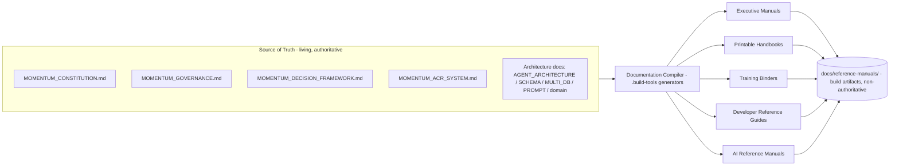

# ACR-001 — Reclassify Document Generators as Documentation Compilers

**The first official Architectural Change Request of Momentum Creation System V2.**

**Status:** RELEASED — approved by Kevin 2026-06-26; implemented, verified, merged on commit.
**Risk level:** High (source-of-truth classification change; reversible; not prospect-facing, compliance, or safety-critical). *Kevin may re-rate.*
**Change type:** source-of-truth (with build-tooling reclassification).
**Proposed by:** Kevin L. Gardner (directive) — drafted by the Constitution Agent (advisory).
**Governed by:** `MOMENTUM_ACR_SYSTEM.md`, `MOMENTUM_DECISION_FRAMEWORK.md`, `MOMENTUM_CONSTITUTION.md`.
**Date:** 2026-06-26

---

## §1 — The Change in One Sentence

The document generators (`.build-tools/generate-momentum-*.mjs`) are **not retired**; they are **reclassified as Documentation Compilers** that read the living constitutional and architecture documents as source of truth and compile them into non-authoritative reference manuals (build artifacts).

```
Living Documents  →  Documentation Compiler  →  Generated Reference Manuals
  (source of truth)        (build tooling)            (build artifacts)
```

---

## §2 — Motivation

The reconciliation found ~30,714 lines of generated handbooks in `constitution/` carrying ~5–8% signal, and a sixth handbook (`MOMENTUM_KNOWLEDGE_CORE.md`, header: *“Minimum depth target: 150 pages”*) was generated **into the constitutional directory during the very session that built the constitution.** The defect was never that these documents are long — it was that long, generated documents were sitting where authority lives and being mistaken for it.

Retiring the generators would discard a genuine capability (producing thorough printable references). Reclassifying them fixes the real problem: authority moves to the living documents; the generators become a downstream compile step; their output becomes clearly-labeled build artifacts. Page-count depth, a defect in a constitution, is a feature in a training binder.

---

## §3 — The Proposed Model



**Artifact → source mapping:**

| Reference manual (artifact) | Compiled from (living source) |
|---|---|
| Executive manual | Constitution + Decision Framework + Governance |
| Printable handbook | Constitution + Governance |
| Training binder | `TRAINING_ARCHITECTURE.md` + Governance + orientation/launch docs |
| Developer reference guide | `AGENT_ARCHITECTURE.md` + `SCHEMA_GOVERNANCE.md` + `MULTI_DB_AGENT_LEARNING_GOVERNANCE.md` + `AGENTS.md` |
| AI reference manual | Constitution + Governance + agent contracts + `AGENT_PROMPT_GOVERNANCE.md` |

**Invariants this ACR establishes:**
1. Compilers **read** living docs; they never become the source.
2. Compiler output **never** lands in `constitution/`. It lands in `docs/reference-manuals/`.
3. Every generated manual carries the approved banner: *“Generated Reference Manual — Not Constitutional Authority. Source-of-truth documents live in `constitution/` and governing architecture documents.”*
4. Generated manuals are **build artifacts**, not constitutional authority, and may not be cited as governance.

---

## §4 — ACR Record

```json
{
  "acr_id": "acr_001",
  "title": "Reclassify document generators as Documentation Compilers",
  "status": "reviewed",
  "risk_level": "high",
  "change_type": "source-of-truth",
  "proposed_by": "Kevin L. Gardner (directive); drafted by Constitution Agent",
  "constitutional_check": {
    "future_dev_test": "pass",
    "boundaries_reviewed": [
      "Art I supremacy preserved (living docs remain authority)",
      "Art XI slop-risk directly mitigated",
      "Art VII.1 no-scoring: N/A",
      "No prospect-facing, compliance, or safety surface touched"
    ]
  },
  "affected": {
    "documents": [".build-tools/generate-momentum-*.mjs", "constitution/_generated_archive/*", "MOMENTUM_ACR_SYSTEM.md (register pointer)"],
    "schemas": [],
    "surfaces": [],
    "agents": ["Documentation"]
  },
  "reconciliation_ref": "constitution/MOMENTUM_CONSTITUTIONAL_RECONCILIATION_REPORT.md",
  "review": {
    "reviewers": ["Constitution Agent (advisory)", "Architect (advisory)"],
    "decision": "recommend approve",
    "conditions": [
      "output path is not constitution/",
      "artifacts carry non-authoritative header naming source + compile date",
      "compilers read living docs as source"
    ]
  },
  "approval": { "approved_by": null, "approved_at": null },
  "implementation": { "branch": null, "commits": [], "append_only_respected": true },
  "verification": { "typecheck": null, "flows": [], "persistence_readback": null },
  "release": { "gates_passed": [], "released_at": null },
  "version": {
    "from": "generators = ungoverned document producers writing into constitution/",
    "to": "generators = Documentation Compilers writing build artifacts to docs/reference-manuals/",
    "supersedes": null,
    "rollback_to": "revert generator changes (reversible)"
  },
  "decision_ledger_ref": null,
  "created_at": "2026-06-26",
  "updated_at": "2026-06-26"
}
```

---

## §5 — Gate Status

| Gate | State | Notes |
|---|---|---|
| Review gate | **Passed** | Future-Development Test passes; boundaries reviewed; no duplicate concept introduced |
| Approval gate | **Passed** | Approved by Kevin, 2026-06-26 |
| Testing gate | **Passed** | All 3 compilers run; output lands in docs/reference-manuals/, never constitution/; banner present |
| Merge gate | **Passed on commit** | Committed to main per Kevin's directive |
| Release gate | **Passed** | constitution/ no longer receives generated files; root duplicates removed; archive retained |

Current state on the ACR state machine: **Released** (Proposed → Triaged → Reconciled → Reviewed → Approved → Implementing → Verified → Merged → **Released**).

---

## §6 — Implementation Plan (on approval)

1. Relabel each `.build-tools/generate-momentum-*.mjs` generator as a **Documentation Compiler** (header comment declaring role, source inputs, and artifact output).
2. Change every generator's output target from `constitution/` to `docs/reference-manuals/` (create the directory with a non-authoritative `README`).
3. Make each compiler **read the living docs** named in the artifact-→-source mapping as its input.
4. Stamp every emitted manual with the non-authoritative header (§3 invariant 3).
5. Add a guard: a compiler that would write into `constitution/` fails.
6. Regenerate the five/six archived handbooks as fresh artifacts from the *new* living source, so the binders reflect reconciled truth (optional, post-approval).

---

## §7 — Verification Plan (testing gate)

- Run one compiler; confirm output lands in `docs/reference-manuals/`, never `constitution/`.
- Confirm the artifact header names its living sources and compile date.
- Confirm the compiler sourced the living docs (not stale copies).
- Confirm the `constitution/`-write guard trips when pointed at the wrong directory.

(No repo typecheck applies to standalone `.mjs` build scripts; verification is run-and-inspect.)

---

## §8 — Rollback

Fully reversible: revert the generator changes. No data migration, no schema change, no irreversible step — which is why this is rated High rather than Critical.

---

## §9 — Open Decisions for Kevin (at the approval gate)

1. **Output path** — default proposed `docs/reference-manuals/`. Alternative: `dist/manuals/` (gitignored build output). Tracked vs. gitignored is your call.
2. **Risk rating** — I rated this High (reversible, internal). If you consider “source-of-truth classification” inherently Critical, re-rate; approval authority is you either way.
3. **Regenerate now or later** — whether to recompile the archived handbooks from new living source as part of this ACR or as follow-up.

---

## §10 — On Approval

Approval writes a decision-ledger entry (`momentum.decisions`, e.g. `dec_documentation_compilers`, status `active`) recording: generators are Documentation Compilers; living documents are source of truth; generated documents are build artifacts. The ACR then advances Approved → Implementing → Verified → Merged (Kevin) → Released.

---

## §11 — Approval & Implementation Record

- **Approved by:** Kevin L. Gardner, 2026-06-26 (approval gate; source-of-truth / high risk → Kevin).
- **Implemented:** the three `.build-tools/generate-momentum-*.mjs` scripts were reclassified as Documentation Compilers — output redirected from `constitution/` to `docs/reference-manuals/`, a guard added that throws if the resolved output path contains `constitution`, and a non-authoritative build-artifact banner stamped on every emitted file. `docs/reference-manuals/` created with a non-authoritative `README` and a `.gitignore` excluding compiled artifacts from version control.
- **Verified (testing gate):** all three compilers run successfully; output lands in `docs/reference-manuals/` (MISSION_CONTROL_ARCHITECTURE 127 pages, MOMENTUM_EXECUTIVE_SYSTEM 123 pages, MOMENTUM_KNOWLEDGE_CORE 160 pages, plus the three AI-organization manuals); none write to `constitution/`. The compilers were re-run with `constitution/` root listed immediately before and after — identical both times (six source-of-truth documents, zero handbooks regenerated), proving they no longer repopulate `constitution/`. The approved banner — *“Generated Reference Manual — Not Constitutional Authority. Source-of-truth documents live in `constitution/` and governing architecture documents.”* — was confirmed at the head of the output.
- **Released:** the four duplicated handbooks were removed from `constitution/` root (`MOMENTUM_AI_ORGANIZATION`, `MOMENTUM_AGENT_DIRECTORY`, `MOMENTUM_AGENT_COMMUNICATION_PROTOCOL`, `MOMENTUM_KNOWLEDGE_CORE`); their archived copies in `constitution/_generated_archive/` were retained; no source-of-truth document, the archive, or FOUNDATION.md was touched.
- **Open decision left to Kevin:** compiled artifacts are gitignored (not tracked). Remove the ignore if the binders should be version-controlled for distribution.

---

## §12 — Files Changed

**Modified (reclassified as Documentation Compilers):**
- `.build-tools/generate-momentum-ai-constitution.mjs`
- `.build-tools/generate-momentum-knowledge-core.mjs`
- `.build-tools/generate-mission-control-center.mjs`

**Added:**
- `docs/reference-manuals/README.md`
- `docs/reference-manuals/.gitignore`

**Removed from `constitution/` root (archive copies retained in `_generated_archive/`):**
- `MOMENTUM_AI_ORGANIZATION.md`
- `MOMENTUM_AGENT_DIRECTORY.md`
- `MOMENTUM_AGENT_COMMUNICATION_PROTOCOL.md`
- `MOMENTUM_KNOWLEDGE_CORE.md`

**ACR records updated:**
- `constitution/acr/ACR-001-documentation-compilers.md`
- `constitution/acr/REGISTER.md`

**Decision ledger:** `dec_documentation_compilers` written to MongoDB `momentum.decisions`, Neo4j, and ChromaDB `momentum_decisions` (all read back and verified).

**Commits:** `38c840f` (governed change), plus the banner-wording correction and this record update.

---

## §13 — Release Status

**RELEASED.** Approved 2026-06-26, implemented, verified, merged to `main`, and pushed to origin. The generators are preserved and reclassified as Documentation Compilers; living constitutional documents remain the sole source of truth.

*The Constitution Agent warns. Kevin decided: approved. This record is the first completed pass through the Constitutional Governance process.*
