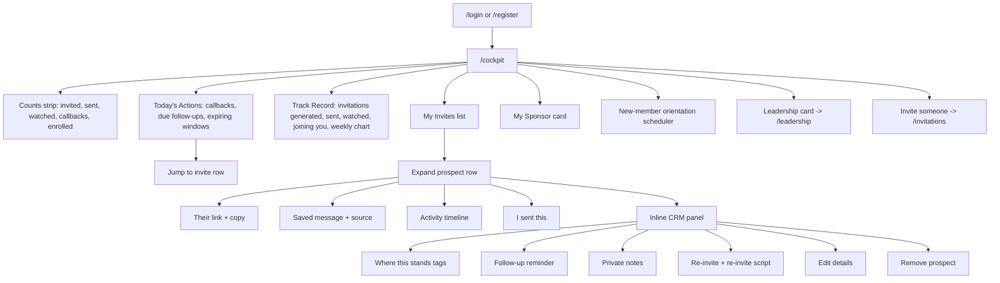
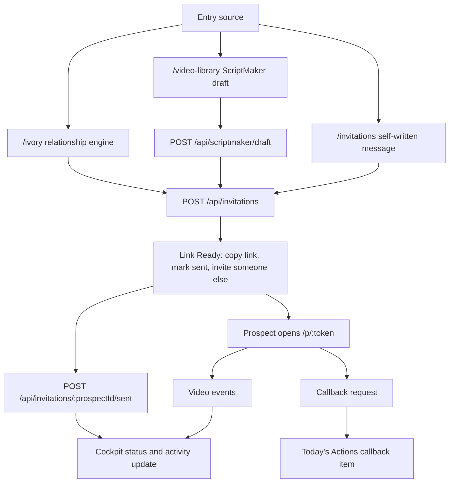
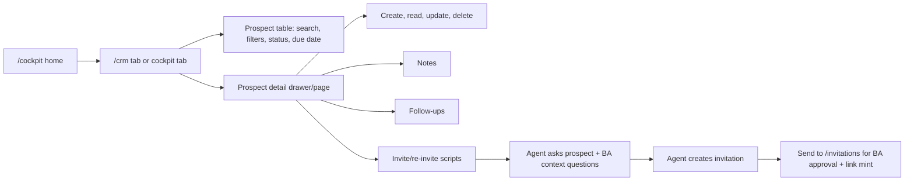

# Team Magnificent Cockpit Workflow

Print companion for `docs/cockpit-workflow-print.html`.

## Saved Screens

- `docs/screenshots/team-cockpit-crm-notes-preview.png` - cockpit invite row expanded to CRM notes, disposition, follow-up, and re-invite.
- `docs/screenshots/team-cockpit-track-record-preview.png` - cockpit track record section.

## Kevin's Notes From The Cockpit

1. Script generation should serve the new BA, not only create a link. The agent should ask key questions about the prospect and the BA's context, then create the invitation for the BA.
2. CRM is useful and should become a separate tab or tool inside the app with CRUD capabilities.

## Current Cockpit Workflow

## Invitation And Prospect Workflow

## Recommended Next Shape

## API Surfaces Behind The Cockpit

- `GET /api/cockpit/summary`
- `GET /api/cockpit/invites`
- `GET /api/cockpit/todays-actions`
- `POST /api/invitations`
- `POST /api/invitations/:prospectId/sent`
- `GET /api/crm/:prospectId`
- `POST /api/crm/:prospectId/notes`
- `POST /api/crm/:prospectId/followup`
- `DELETE /api/crm/:prospectId/followup`
- `POST /api/crm/:prospectId/disposition`
- `POST /api/crm/:prospectId/reinvite`
- `POST /api/crm/:prospectId/reinvite-script`
- `PUT /api/crm/:prospectId`
- `DELETE /api/crm/:prospectId`
- `POST /api/scriptmaker/draft`
- `GET /api/orientation/sessions`
- `POST /api/orientation/sessions/:id/reserve`
- `DELETE /api/orientation/sessions/:id/reserve`

