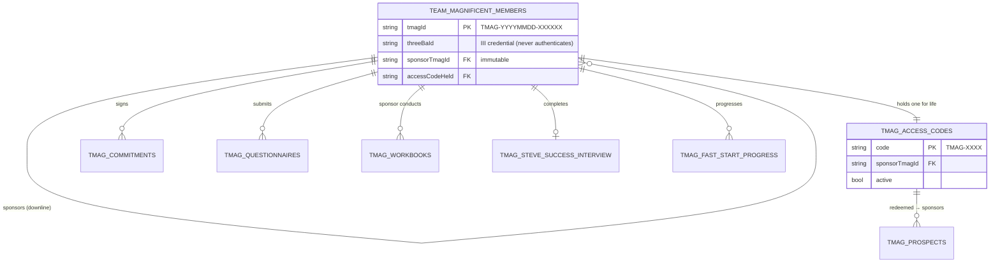
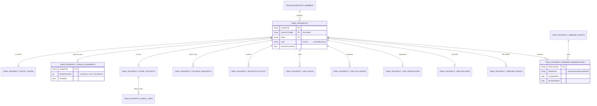
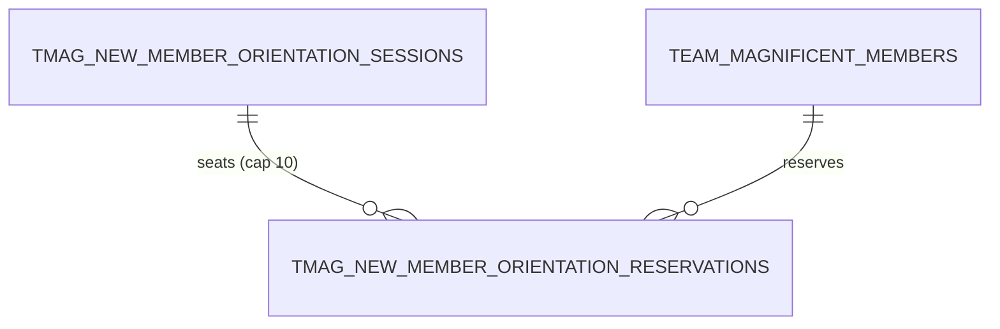
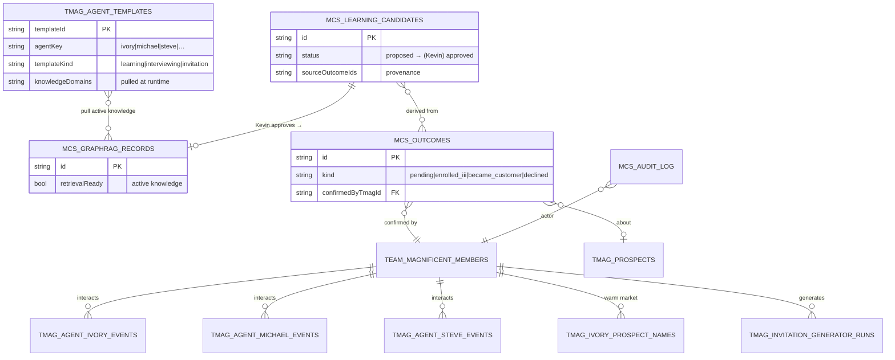
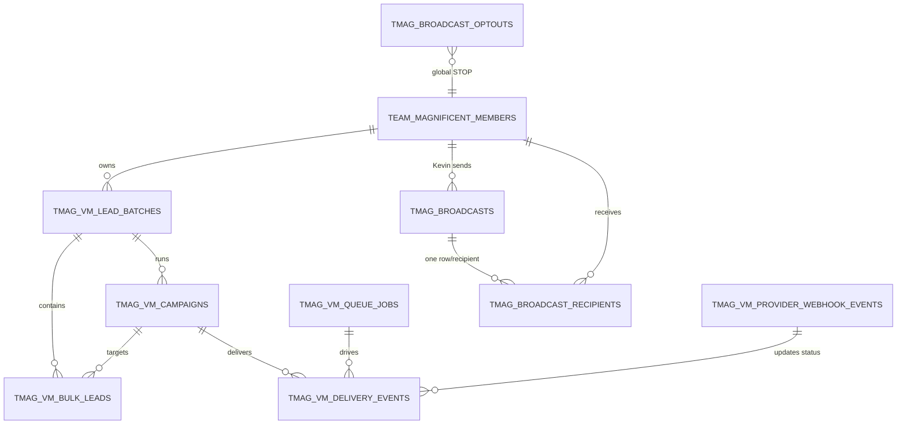
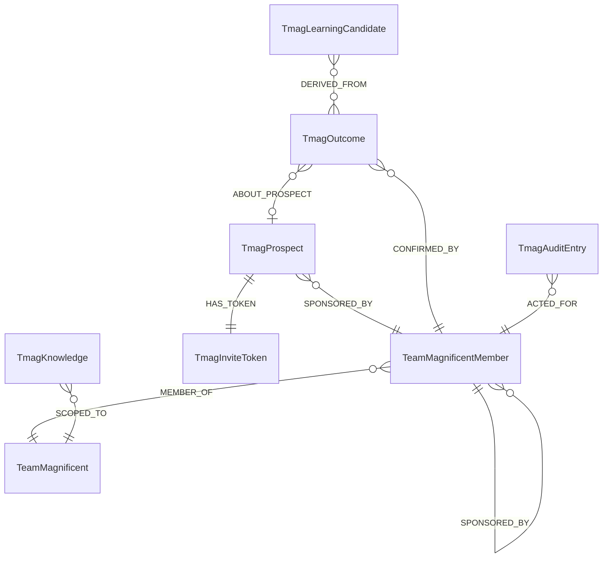

# MCS V2 — Database Architecture ERD

Entity-relationship view of the dedicated triple-stack, **canonical (Rev 2) names**
(`tmag_` app-domain · `mcs_` system/memory). Mongo `momentum`@30000 is the source of
truth; Neo4j@7710 mirrors relationships; Chroma@8200 mirrors vectors. The diagrams
below are the **relationship map** — the companion to `MCS_V2_CANONICAL_SCHEMAS.docx`
(which is the field-level list). Renders in GitHub / VS Code / any Mermaid viewer.

> Cross-store rule: every Mongo write is *projected* into Neo4j + Chroma via
> `tmag_projection_outbox` (durable retry). The same entity keeps the **same name**
> across all three stores.

---

## 1 · Identity & Membership (the downline)

*Eligibility is structural: only Kevin mints codes; each member reuses one code to
sponsor; sponsor is immutable → the member set **is** Kevin's downline.*

---

## 2 · Prospect funnel (holding tank → CRM → webinar)

*A single team-wide `TMAG_PROSPECT_HTANK_COUNTERS` singleton anchors pool position.*

---

## 3 · New-member onboarding

---

## 4 · Agents · Templates · Memory / Learning (the loop)

**The learning loop:** outcomes (signal) → learning candidates (proposed, **Kevin
approves**) → GraphRAG active knowledge → the agent templates pull it → better agent
behavior → new outcomes. No agent may approve knowledge.

---

## 5 · Voicemail (VM/RVM) · Broadcast

---

## 6 · Neo4j graph shape (relationship mirror)

*Business-key labels (`TmagInviteToken`, `TmagAccessCode`, `TmagWebinarEvent`,
`TmagIvoryName`, `TmagBroadcast`, `TmagVmCampaign`, …) each get a uniqueness
constraint; the set grows with features (P10 §6).*

---

### Legend
`||--o{` one-to-many · `||--||` one-to-one · `}o--||` many-to-one · `}o--o{` many-to-many.
PK = `_id` key · FK = reference to another collection. This ERD is the **relationship
companion** to the field-level `MCS_V2_CANONICAL_SCHEMAS.docx`; both use the Rev 2
canonical names and are the reference for M6 provisioning.
