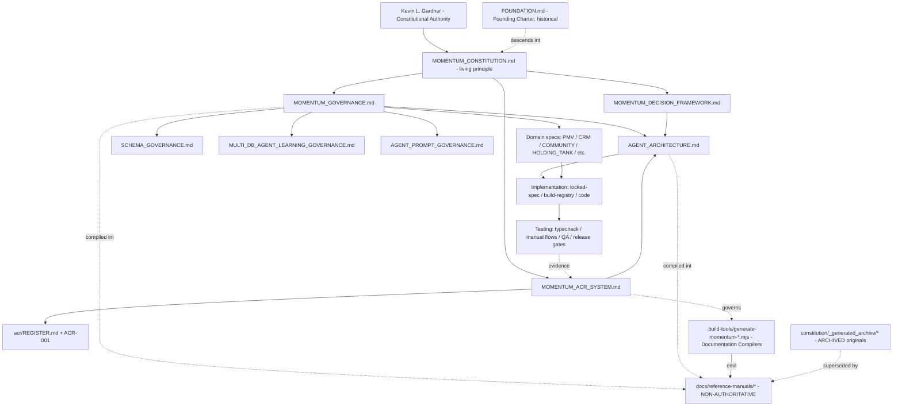

# PROGRAM DEPENDENCY MAP

**Prepared by:** Chief Integration Officer (advisory)
**Authority:** Subordinate to `constitution/MOMENTUM_CONSTITUTION.md`. Navigational aid, not a source of truth.
**Date:** 2026-06-26

> Extends the existing `constitution/CONSTITUTION_DEPENDENCY_MAP.md` (constitutional-library scope) outward to the full program: governance, AI organization, knowledge core, mission control, implementation, and testing. Where the two maps overlap, the constitutional map governs.

---

## Program Dependency Diagram

---

## Dependency Table (program scope)

| Document / Node | Depends On | Referenced By | Consumed By | Source of Truth? |
|---|---|---|---|---|
| `MOMENTUM_CONSTITUTION.md` | Kevin; FOUNDATION (descent) | every governance & arch doc | all layers | **YES — supreme** |
| `MOMENTUM_GOVERNANCE.md` | Constitution | architecture docs; reference-manuals (compiled) | agents | YES (governance) |
| `MOMENTUM_DECISION_FRAMEWORK.md` | Constitution | ACR System; architecture | decision-makers | YES (governance) |
| `MOMENTUM_ACR_SYSTEM.md` | Constitution; uses Decision Framework | `acr/REGISTER.md`; Compilers | change process | YES (governance) |
| `acr/REGISTER.md` + `ACR-001` | ACR System | reference-manuals README | auditors | YES (record) |
| `AGENT_ARCHITECTURE.md` | Governance, Decision, ACR | domain specs; agent prompts | implementation | YES (architecture) |
| `SCHEMA_GOVERNANCE` / `MULTI_DB_AGENT_LEARNING_GOVERNANCE` | Governance | architecture; code | implementation | YES (architecture) |
| `AGENT_PROMPT_GOVERNANCE` | Governance | agent prompts | agents | YES (architecture) |
| Domain specs (PMV, CRM, COMMUNITY, HOLDING_TANK, …) | Constitution + Governance | implementation | code | YES (domain) |
| `docs/locked-spec.md`, `build-registry.md` | architecture; currency chain | agents; CIO | testing | OPERATIONAL (current state) |
| **AI Organization** (`reference-manuals/MOMENTUM_AI_ORGANIZATION.md`) | Governance (compiled from) | — | readers only | **NO — compiled artifact** |
| **Mission Control** (`reference-manuals/MISSION_CONTROL_ARCHITECTURE.md`) | Governance + admin code | — | readers only | **NO — compiled artifact** |
| **Knowledge Core** (`reference-manuals/MOMENTUM_KNOWLEDGE_CORE.md`) | MULTI_DB governance (compiled) | — | readers only | **NO — compiled artifact** |
| **Agent Directory** (`reference-manuals/MOMENTUM_AGENT_DIRECTORY.md`) | AGENT_ARCHITECTURE (compiled) | — | readers only | **NO — compiled artifact** |
| **Executive System / Comms Protocol** (`reference-manuals/*`) | Governance (compiled) | — | readers only | **NO — compiled artifact** |
| `.build-tools/generate-momentum-*.mjs` | living docs (read-only) | ACR-001 | emit reference-manuals | TOOL (governed by ACR) |
| `constitution/_generated_archive/*` | — | reconciliation report | history only | ARCHIVED |
| **Master Index** | *(does not yet exist)* | — | — | **MISSING** |

---

## Cross-References to Resolve

- The constitutional dependency map and this program map must agree. They do today; if either changes, re-sync.
- The compiled reference-manuals **must show their living source** in their own headers (the README does this folder-wide; per-file provenance is the stronger form — see Revision Assignments R-7).
- A **Master Index** would sit beside the Constitution as a navigational root pointing into both maps. Currently absent.

*End of map.*
